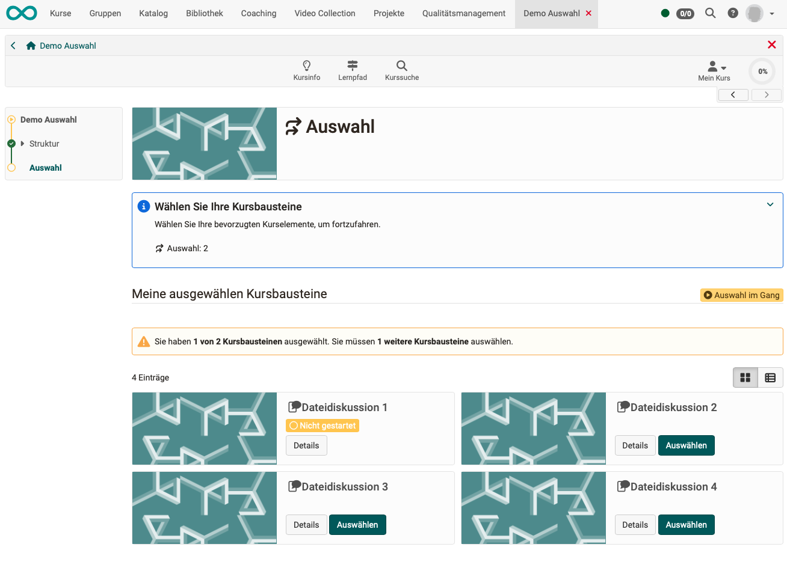
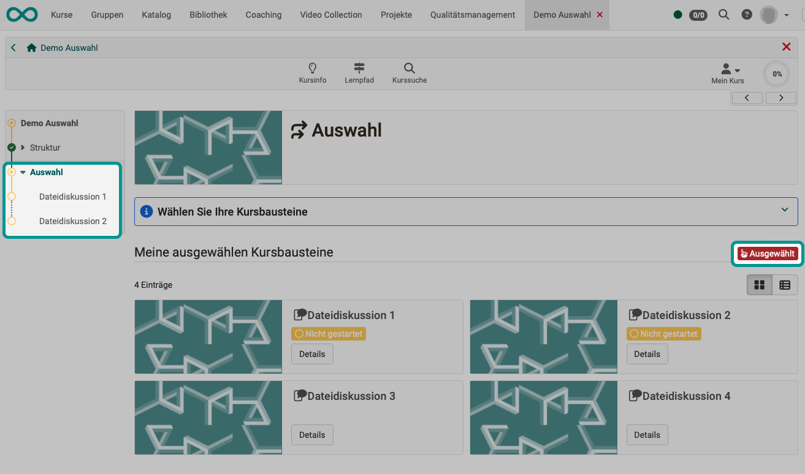
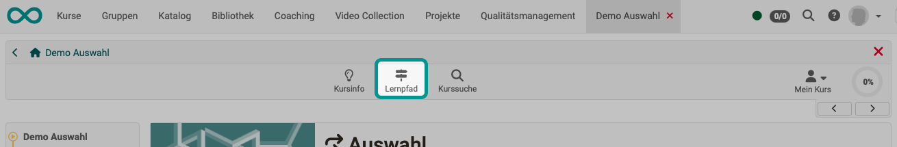
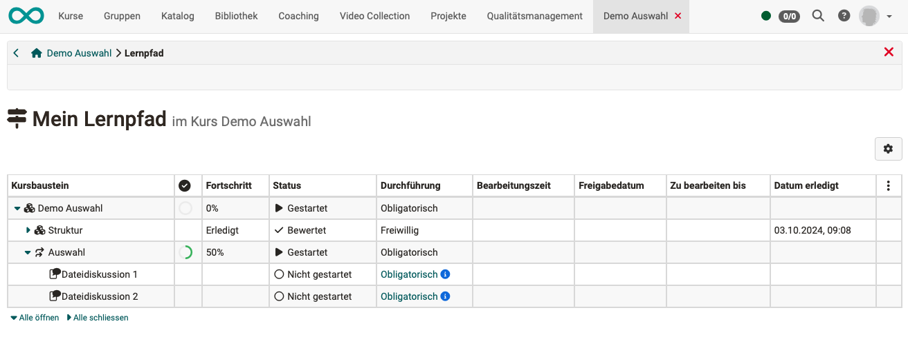
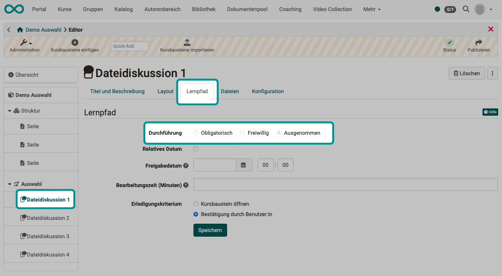
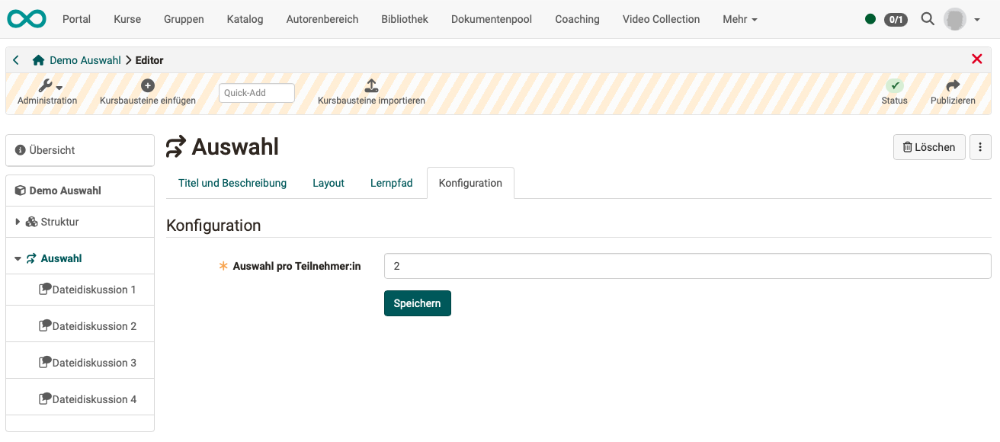
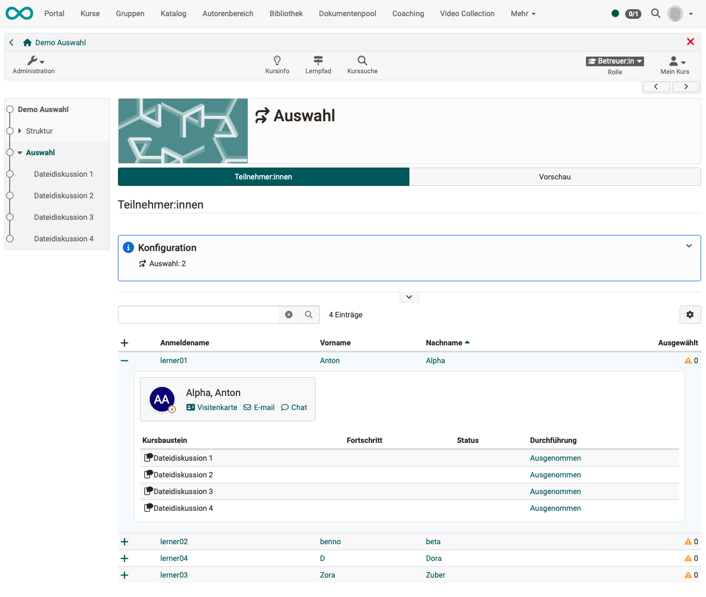
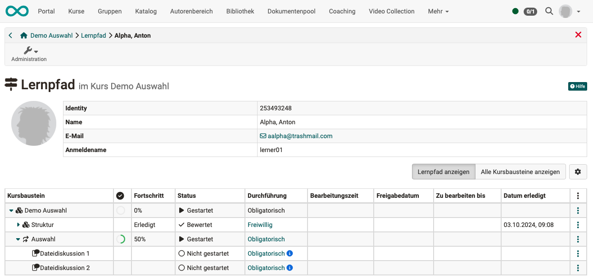
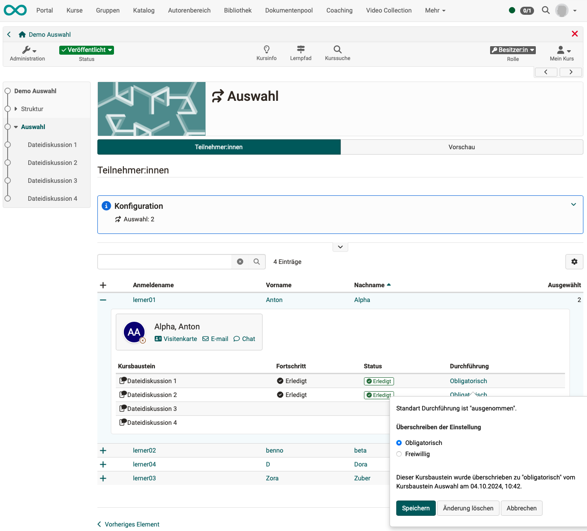
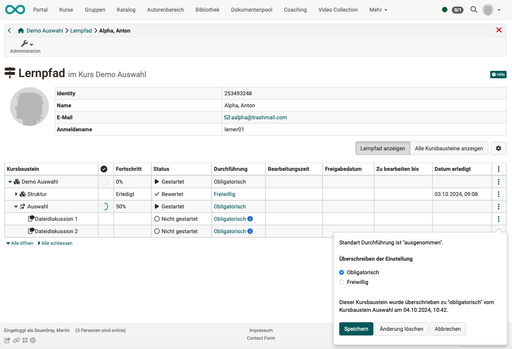

# Course Element "Selection" {: #selection}

## Profile

Name | Selection
---------|----------
Icon | { class=size24  }
Available since | Release 19.1
Functional group | Administration and Organisation
Purpose | Auswahl einer bestimmten Anzahl Kursbausteine innerhalb der Kursstruktur (Kursmenü) durch die Teilnehmer:innen
Assessable | no
Speciality / Note | Der Kursbaustein ist nur in Lernpfadkursen einsetzbar.

The course element "Selection"  is used in a similar way to the "Structure" course element. There are also various other course elements below the "Selection" course element. In contrast to the "Structure" course element, however, participants can decide for themselves which course elements should be included in their course menu. The course owner specifies a number of course elements to choose from (e.g. different tasks). Each participant then selects the course elements in the course element "Selection", which are then displayed individually in the course menu.

## Functionality {: #selection_functionality}

* In the course menu, course participants will find a course element of the type "Selection". (The title can also have a different name).
* By clicking on the course element, various course elements are offered for selection.
* Each participant selects a predetermined number of course modules from those offered.
* The selected course elements now appear in the participant's course menu below the course element of type "Selection" (individual menu).

[To the top of the page ^](#selection)

## Selection (Participant) {: #selection_participant}

**Step 1:** 
As a participant, simply select the course element of the "Selection" type in your course. There you choose which of the suggested course elements you want to include in your course menu.

{ class="shadow lightbox" }

**Step 2:** 
The selected course elements will then appear in your course menu and can be edited.

{ class="shadow lightbox" }

!!! info "Note"

    Once a selection has been made, it can no longer be changed by participants. Intervention by the course owner or coach is required to reset the selection.

### View in the learning path tool

Course participants will find the "Learning path" icon in the toolbar, where they can see which course elements they have already completed.
As long as no selection has been made in a course element of the type "Selection", no course elements assigned to the selection element are displayed in the learning path tool. As soon as a selection has been made, the selected course elements are displayed.

{ class="shadow lightbox" }

{ class="shadow lightbox" }

[Up (Participant) ^](#selection_participant) 
[To the top of the page ^](#selection)

---

## Set up selection (Perspective course owner) {: #selection_setup}

### Add course element

Insert a "Selection" course element into your course in the course editor in the same way as you insert a “Structure” course element.

### Capture selectable topics

In the course editor, drag additional course elements onto the "Selection" course element so that they are subordinate to it. The available selection then refers to these subordinate modules.

### Tab "Learning path"

In contrast to the assigned course elements, you can choose whether the course element is compulsory, voluntary or subject to an exception in the selection element itself for **implementation**.

The **completion criterion** can **not** be set for a course element "Selection", but is predefined.
It counts whether assigned course elements have been selected and completed. 

### "Learning path" tab of the assigned course elements

All course elements assigned to a course element "Selection" in the course editor are automatically "**excluded**" at the beginning, i.e. not displayed in the course menu by default.
This automatically set property **cannot** be changed by authors in the course editor.

Later, during the course, this property is automatically changed individually according to the selection made by the participants.

{ class="shadow lightbox" }

### Tab "Configuration"

In the "Configuration" tab, you can specify how many course elements the participants must transfer from the suggestions to their personal course menu.
This is mandatory information for course owners so that the "Selection" course element works. 

{ class="shadow lightbox" }

[Up (Perspective course owner) ^](#selection_setup) 
[To the top of the page ^](#selection)

---

## Coaching (Perspective coach) {: #selection_coaching}

### View course elements

In the course menu, as a coach you will see **all** the course elements available for the participants to choose from below a course element "Selection". 

If you call up the course element "Selection" as a coach, you will see the course participants listed and can find out who has selected which course elements.

If a complete selection has not yet been made, you can recognize this by the small yellow triangle on the right. 

In the detailed view, you can see which course elements a participant has selected.

Course elements with the implementation status "Excluded" are not displayed in the course menu.
Before a selection is made, all selectable course elements have this status. Once a selection has been made, the course element is assigned the status "Compulsory" or "Optional" (depending on the status of the course element "Selection"). 

If the participant has selected the required number of course elements, the yellow triangle is no longer displayed.

{ class="shadow lightbox" }

### View of selected course elements in the learning path tool

Coaches can display the learning paths of all course participants under the "Learning path" icon in the toolbar. Open the tool and select a participant.

{ class="shadow lightbox" }

If no selection has yet been made by the course participant, no course elements will be displayed below the "Selection" course element. As soon as participants have made a selection, the selected course elements are also visible to coaches in their learning path tool.

{ class="shadow lightbox" }

[Up (Course coach) ^](#selection_coaching) 
[To the top of the page ^](#selection)

### Reset or change selection made by participants

Coaches and owners have the opportunity to edit the selection made by participants: 

* Select the desired course element "Selection" in the course menu. 
* All participants are displayed as coaches. Select a participant.
* Click on the entry in the "Implementation" column to open the pop-up for overwriting the implementation setting.

{ class="shadow lightbox" }

**Variant:**

* Open the learning path tool and select a participant.
* Click on the 3 dots at the end of a line. The pop-up for overwriting the setting for execution opens. 
* To completely reset, change all course elements to "Excluded". To do this, click on "Delete change". This will restore the original status.

{ class="shadow lightbox" }

[Up (Course coach) ^](#selection_coaching) 
[To the top of the page ^](#selection)

---

## Further information

[Course element structure](../learningresources/Course_Element_Structure.md) 

 

[To the top of the page ^](#selection)

