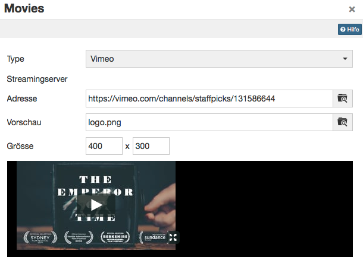

# Kursbaustein "Einzelne Seite"

Im Kursbaustein „Einzelne Seite“ können Sie HTML und PDF-Dateien direkt in die
Kursstruktur einbinden. Geben Sie auf diesem Weg beispielsweise zentrale
Informationen, den Kursablauf oder Literaturtipps zu Ihrem Kurs bekannt oder
platzieren Sie Inhalte wie Bilder oder Videos gezielt im Kurs. Die Dateien
selbst werden dabei im [Ablageordner ](../learningresources/Storage_folder.de.md)des Kurses angelegt.

!!! info "Info"

    Für die Einbindung von Office-Dokumenten nutzen Sie bitte den [Kursbaustein
    "Dokument".](Knowledge_Transfer.de.md)

## Tab Seiteninhalt

Hier nehmen Sie die zentrale Konfiguration dieses Kursbausteins vor. Sie haben folgende Möglichkeiten, um den gewünschten Inhalt mit Hilfe des Kursbausteins "Einzelne Seite" in Ihren Kurs zu integrieren:

  * Neue HTML-Seite online erstellen
  * Eine beliebige Datei aus dem Ablageordner wählen
  * Eine Datei in den Ablageordner hochladen und mit dem Baustein verknüpfen

Für die weitere Bearbeitung von HTML-Seiten können Sie den OpenOlat Editor
nutzen. Er funktioniert ähnlich wie ein Textverarbeitungsprogramm. Eine
automatisch erstellte Datei trägt bereits den Namen des Kurselements. Einmal angelegt, öffnen Sie die HTML-Datei mit dem Link "Seite bearbeiten" und Sie gelangen in den OpenOlat HTML Editor.

Im HTML Editor können Sie neben den verschiedenen Formatierungen auch
Verlinkungen zu Bildern, Videos, den einzelnen Kursbausteinen des Kurses und
zu den Tools in der [Toolbar](../learningresources/Using_Additional_Course_Features.de.md) einfügen.

Sie können auch Dateien die Sie zuvor erstellt haben in den Ablageordner des
Kurses hochladen oder einen Ressourcenordner mit dem Kurs und dem Ablageordner
verbinden. Über den Link "Auswählen" werden Ihnen alle Dateien
angezeigt, die sich im Ablageordner befinden. Anschliessend können Sie diese
Dateien über den Kursbaustein "Einzelne Seite" verlinken und so in Ihren Kurs
einbinden. Dieser Weg empfiehlt sich, wenn Sie die Strukturierung des
Ablageordners selbst beeinflussen möchten.

Mit der "Einzelnen Seite" können auf verschiedene Weise Videos und Audios in
den Kurs eingebunden werden. Detaillierte Information finden Sie
[hier](../learningresources/Single_Page_Add_edit_video.de.md).

Die Dateien können bei Bedarf später auch 
wieder ausgetauscht werden.

!!! warning "Achtung"

    Öffnen und speichern Sie HTML-Seiten, die Sie mit einem externen Editor
    erstellt haben, nicht mit dem eingebauten HTML-Editor, da dadurch Teile der Formatierung verloren gehen können. Der OpenOlat HTML-Editor enthält nur den < body > Bereich einer HTML Seite. Sollen Einträge im HTML < head > vorgenommen werden, muss dies in einem externen Editor erfolgen.

Unter „Sicherheitseinstellungen“ können Sie festlegen, ob Verweise in Ihren
HTML-Seiten nur auf Dateien des gleichen Ordners und auf darin enthaltene
Unterordner möglich sind, oder ob alle Dateien des Ablageordners referenziert
werden können. Dies ist beispielsweise notwendig, wenn Ihre HTML Seite
Grafiken, CSS-Dateien oder Skripte enthält, die sich in anderen Ordnern
befinden.

Ferner können Sie definieren, ob Betreuer die hinterlegte HTML-Datei
bearbeiten dürfen. Die Betreuer benötigen dafür keine Kursbesitzerrechte oder
Zugang zum Kurseditor.

## Tab Anzeige Inhalt  {: #layout}

Im Tab „**Anzeige Inhalt**“ definieren Sie die Einstellungen für die Anzeige
des Seiteninhalts. Hier legen Sie fest ob die Seite unverändert, oder
optimiert für OpenOlat angezeigt werden soll. Der Anzeigemodus „Optimiert für
OpenOlat“ gestattet Ihnen z.B. das Kurslayout auf den Seiteninhalt anzuwenden,
oder ein in den Kurs eingebundenes [Glossar](../learningresources/Using_Additional_Course_Features.de.md#glossary) für die Seite zu aktivieren.

Folgende Einstellungen für den Kursbaustein "Einzelne Seite" vorgenommen werden. 

 **Anzeigemodus:** 

 Wählen Sie den Modus "Standard" um die Ressource unverändert anzuzeigen. Dieser Modus ist geeignet für Ressourcen, bei denen es im Modus "Optimiert für OpenOlat" zu Anzeigeproblemen kommt, was vor allem bei
extern erstelltem Inhalt passieren kann, wie z.B. HTML5 Seiten. Wählen Sie den
Modus "Optimiert für OpenOlat", wenn Sie das Kurslayout in der Seite einbinden
wollen, eine JavaScript Bibliothek verwenden möchten, das OpenOlat Glossar auf
dieser Seite anwenden wollen oder die Höhe der Seite automatisch berechnet
werden soll. Bei SCORM Modulen ist der Modus "Standard" empfohlen.

 **JavaScript hinzufügen:** 
 
Um die Funktionen des Anzeigemodus "Optimiert für OpenOlat" nutzen zu können muss die JavaScript Bibliothek "jQuery" aktiviert
sein. Die Option "Prototype" sollte nur gewählt werden, wenn Ihre Inhalte
diese Bibliothek voraussetzen. Wählen Sie keine Bibliothek, wenn es zu Anzeigeproblemen mit Ihren Inhalten kommt.

 **Glossarbegriffe einbinden:** 
 
Wählen Sie diese Option um die Möglichkeit der
Hervorhebung von Glossarbegriffen für Ihre HTML-Seiten zu aktivieren sofern
Sie ein Glossar in Ihrem Kurs eingebunden haben. Diese Option setzt die
Verwendung der JavaScript Bibliothek "jQuery" voraus.

 **Höhe Anzeigefläche:** 

Mittels des Drop-Down-Menus können Sie die Höhe der Inhalte bestimmen. Sie haben die Möglichkeit, diese via "Automatisch" auf die
jeweilige Fensterhöhe zu setzen oder auf einen bestimmten Wert zu setzen.

 **Layout anpassen:** 

Wählen Sie die Option "OpenOlat Stylesheets" um das OpenOlat und Kurslayout in Ihre Seite zu übernehmen (Schriftart, Farben,
Grösse etc). Wenn Sie diese Anpassung nicht wünschen wählen Sie die Option
"Keine".

 **Zeichensatz Inhalt:** 
 
OpenOlat versucht, den Zeichensatz automatisch zu erkennen. Wenn die Option "Automatisch" nicht zu der gewünschten Anzeige
führt, kann die Kodierung des Inhalts anhand eines vordefinierten
Zeichensatzes konfiguriert werden (ist keine Kodierung vorhanden, wird per Default der Zeichensatz ISO-8899-1 verwendet).

 **Zeichensatz JavaScript:** 
 
Erlaubt die Kodierung des JavaScript Codes anhand eines vordefinierten Zeichensatzes (per Default wird der gleiche Zeichensatz
für Inhalt und JavaScript verwendet).

!!! tip "Tipp"

    In der Regel sind im Tab "Layout" keine Änderungen notwendig. Die Standardeinstellungen passen für 90% der Kurse.

#  Mehrere Einzelseiten

Mit dieser Option können Sie sich das Hinzufügen und organisieren von
Einzelseiten in den Kurs erleichtern und die Dateien rasch in der Kursstruktur
sichtbar machen. Wenn Sie beim Hinzufügen von Kursbausteinen "Mehrere
Einzelseiten" wählen, öffnet sich die Anzeige des Ablageordners mit allen im
jeweiligen Kurs verfügbaren Dateien. Sie können nun alle Dateien auf einmal
auswählen, die Sie direkt als Einzelne Seite hinzufügen möchten. Entscheiden
Sie auch, ob die ausgewählten Dateien nach oder als Unterordner des aktuellen
Kursbausteins eingefügt werden sollen. Die Reihenfolge kann im Anschluss
verändert werden.

Die Funktion "Mehrere Einzelseiten" bietet sich an, wenn Sie bereits mehrere
HTML-Dateien bzw. komplexe Hypermedia-Dateien extern erstellt und im
[Ablageordner ](../learningresources/Storage_folder.de.md)des Kurses abgelegt haben. Achten Sie bei
komplexen Seiten mit diversen Verlinkungen zu Grafiken u.ä. darauf die Option
"Link im gesamten Ablageordner erlauben" zu aktivieren. Ferner sollten Sie die
Dateinamen möglichst schon so benennen wie Sie später im Kurs erscheinen
sollen, da der Dateiname als Kursbaustein Titel verwendet wird.

Mehrere Einzelseiten lassen sich auch sehr gut mit einem [Kursbaustein "Struktur"](Course_Element_Structure.de.md)
bündeln. So können automatisch Übersichtsseiten für die jeweiligen Inhalte
erstellt werden und die Einzelnen Seiten besser strukturiert werden.

## Einzelne Seite: Video hinzufügen / editieren

Eine weitere Möglichkeit Videos in OLAT Kursen einzubinden ist die Verwendung
des Kursbausteins „**Einzelne Seite**“.

Im Kursbaustein "Einzelne Seite" steht Ihnen ein Editor zur Verfügung über den
Sie auch Videos in eine HTML-Seite einbinden können. Im Tab "Seiteninhalt"
können Sie den Editor öffnen und gelangen zum Button „Video hinzufügen /
editieren".

  

Für die Anzeige greift das Tool auf den in OpenOlat integrierten Mediaplayer
zurück, was einige Vorteile hat.  
1. Der Player erkennt das Format selbst, solange die Video- und Audio-Daten
richtig codiert sind.  
2. Der Player erkennt, ob ein Benutzer mit einem HTML5-fähigen und Codec-
kompatiblen mobile-Browser auf das Video zugreift. In dem Fall werden die
Filme mit einem HTML5-Tag versehen und können problemlos auch auf iPad o.ä.
angezeigt werden.  

!!! tip "Tipp"

    Sie können Ihrer Mediendatei auch noch ein Startbild (Vorschau) hinzufügen.

Im Folgenden finden Sie die wichtigsten Informationen zur Nutzung des in
Einzelseiten verwendeten TinyMCE Plugins "Video hinzufügen / editieren"
(Unterstützt FLV, MP4 mit h264 codiert, AAC).

### Empfohlenes Format

In der Praxis hat sich der **mp4** (oder MPEG-4) Container mit dem H.264
Video-Codec für Video und dem **mp3** Audio-Codec für Audio etabliert.
Aktuelle Versionen von Firefox, Chrome und Safari können solche Videos
abspielen.

  

Die folgenden Optionen stehen Ihnen zur Verfügung

| Option |  Beschreibung  | 
---|---  
Video | Einbindung eines Videos mit spezifischer Codierung.  
Musik | Einbindung eines Audio-Files ohne Video.  
YouTube / Vimeo / Nanoo.tv | Einbindung eines YouTube / Vimeo / Nanoo.tv - Videos  
http | Streaming mit Flash-Datei von einem Webserver  
rtmp | Streaming mit Flash-Datei von einem speziellen Streaming-Server  
  
#### Video (.FLV, .F4V, .MP4 und .M4V - h264 kodiert, .AAC sowie .M4A)

Diese Einstellung eignet sich für die Integration von Videos auf OpenOlat am
Besten. Als Container-Formate, d.h. die Formate die hochgeladen werden können,
eignen sich die folgenden Kennzeichnungen:

| Format Container | Bezeichnung des Containers | Beschreibung  | 
| ---|---|---  | 
| .FLV | Flash Container | Flash-Videos mit Video und Audio, von Adobe definiert (Achtung: Flash Player
muss aktiviert sein)  
  .F4V | | Kein Container, sondern reines Video-Format ohne Audio, von Adobe definiert  
  .MP4| MPEG-4|MP4 Video- und Audioformat, von MPEG-Verbund definiert, verschiedene Codecs  
  .M4V|MPEG-4|MP4 Videoformat mit H.264 Videocodec und MP3 oder AAC Audiocodec; Format für iTunes  
  
In das Adressfeld können Sie entweder den Link auf das Video direkt eingeben
oder die Datei entsprechend hochladen.

!!! tip "Tipp"

    Um optimale Kompatibilität sicherzustellen sollte ein MPEG-4 Container mit H.264 Kodierung für Video und AAC oder MP3 Kodierung für Audio verwendet werden. 
    
    Als Dateiendung stehen somit .mp4 oder .m4v zur Verfügung, wobei .m4v nicht von allen Geräten abgespielt werden kann. 
    
    Von Flash Filmen wird abgeraten, da diese auf vielen mobilen Geräten wie z.B. das iPad grundsätzlich nicht abspielbar sind.

#### Musik (.MP3)

Bei der Einbindung von reinen Audio-Dateien stehen nur eingeschränkte
Funktionen im Player zur Verfügung. Man kann starten, stoppen und hat eine
Fortschrittsanzeige, Funktionen wie Vollbild fehlen hier. 

Im Feld „Adresse“
kann entweder ein Link auf ein mp3-File eingegeben werden oder man lädt eine
Datei auf OpenOlat hoch. 

!!! check ""

    Das Abspielen von mp3 Audiodateien ist auf **allen** gängigen Browsern problemlos.

#### YouTube  

YouTube Filme werden direkt verlinkt, d.h. die Auswahlbox für das Hochladen
einer Datei wird hier nicht benötigt. Videos können mit dieser Konfiguration
**direkt integriert** werden.

  

Benutzen Sie als "Adresse" einen direkten Link zu dem Video, erhältlich unter
dem Link "Teilen"

#### Vimeo  

Vimeo Videos werden in OpenOlat ebenfalls direkt verlinkt. Unter "Adresse"
geben Sie den Link des gewünschten Videos ein.

  

Einen direkten Link zum Vimeo-Video finden Sie unter dem Link "**Share**".  

#### Nanoo.tv

Videos von der Plattform [Nanoo.tv](https://portal.nanoo.tv/) können direkt
verlinkt werden. Für die Nutzung und Anzeige der Videos ist ein Nanoo.tv-
Account notwendig.

Über die URL kann - unabhängig vom Browser - gesteuert werden, ob das Video
sofort automatisch startet oder nicht. Dafür muss die URL hinter /link/
entsprechend angepasst werden.

  * automatisch starten mit "n": https://www.nanoo.tv/link/ **n** /sdxpLoaC
  * manuell starten mit "v": https://www.nanoo.tv/link/ **v** /sdxpLoaC

Die Einstellungen im Tab "Erweitert" funktionieren hier nicht.

##### http (pseudo) Streamingserver (nur .FLV)

Mit dieser Funktion können **Flash-Filme** im Format **.flv** integriert werden. Wenn
die Filme am Ursprungsort richtig exportiert werden, enthalten sie eine
Indexierung. Mit Hilfe dieses Inhaltsverzeichnisses kann man auch innerhalb
des Films schnell an eine beliebige Stelle springen, der Film muss nicht erst
komplett geladen werden. Es handelt sich dabei nicht um ein richtiges
Streaming, bei diesem muss auch auf dem Server eine entsprechende Streaming-
Software installiert sein muss.

In das Feld „Streamingserver“ muss die Adresse des Servers eingegeben werden.
Unter „Adresse“ wird die Adresse des eigentlichen Films eingegeben.

!!! warning "Achtung"

    Da mit dieser Variante der Einbettung die Inhalte nicht auf dem iPad und den meisten anderen mobilen Geräten angesehen werden können wird dieses Vorgehen **nicht empfohlen**.

#### rtmp Streamingserver

Mit dieser Funktion kann ein Flash Streaming-Server genutzt werden. Dabei wird
ein spezielles Protokoll verwendet: RMTP - Real Time Messaging Protocol. Als
Streaming-Server können verschiedene Produkte verwendet werden, z.B. das
Akamai Netzwerk.

Dieses von Adobe entwickelte Protokoll ermöglicht die Übertragung des Videos
vom Server zum Flash Player. Häufig kommt es bei dieser Variante aber zu
Problemen mit Port-Einstellungen und Firewalls.

!!! warning "Achtung"

    Da mit dieser Variante der Einbettung die Inhalte nicht auf dem iPad und den meisten anderen mobilen Geräten angesehen werden können wird dieses Vorgehen **nicht empfohlen**.

    Da Flash von den meisten Browsern nicht mehr oder nur sehr eingeschränkt unterstützt wird, sollte generell auf den Einsatz von flashbasierten Videos verzichtet werden.

#### HTML5 Video

OpenOlat unterstützt auch HTML5 Videos welche in einer HTML Seite mit externen
Werkzeugen eingebunden wurde. In diesem Fall muss der Autor selbst dafür
sorgen, dass in dem HTML Tags verschiedene alternative Videoformate angegeben
wurden (z.B. m4v und ogg) und diese allenfalls auch in unterschiedlichen
Auflösungen in OpenOlat abgelegt werden.

OpenOlat unterstützt in diesem Fall das Pseudo-Streaming mittels Progressive
Download bzw. Range-Requests.  

  

