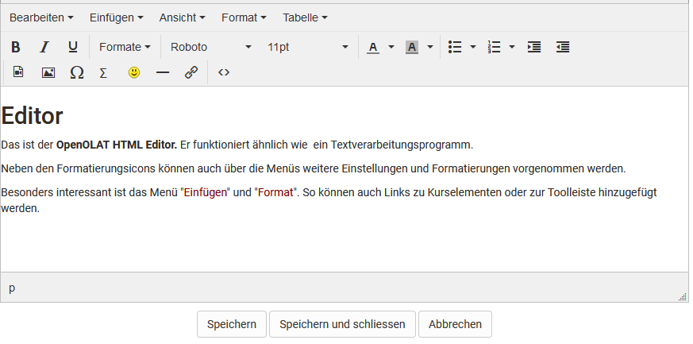
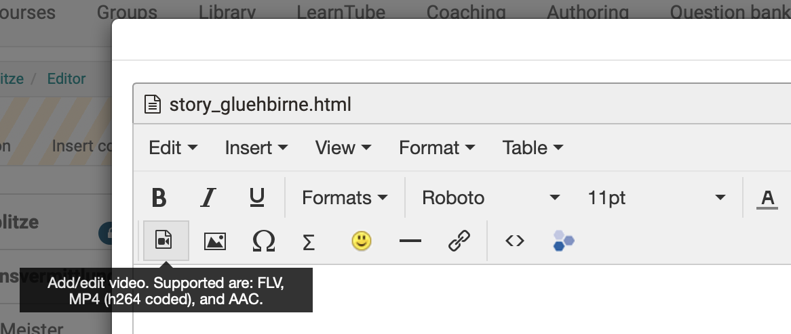
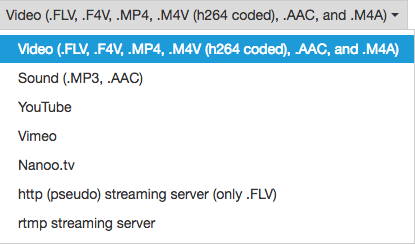
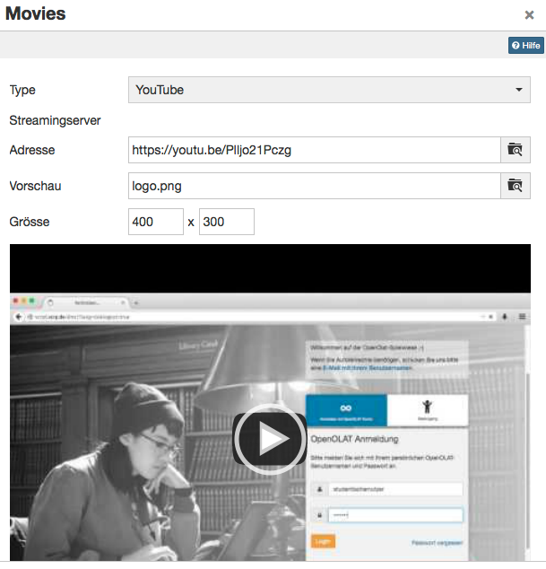
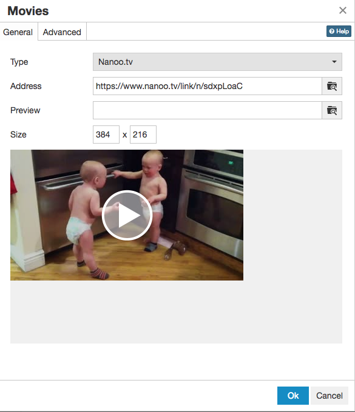

# Course Element "HTML page"

## Profile

Name | HTML-Page
---------|----------
Icon | { class=size24 }
Available since | New edition with release 18
Functional group | Knowledge transfer
Purpose | Presentation of different content elements (text, images, videos) within a HTML page
Assessable | no
Specialty / Note | 

In the course element "Single page" you can insert various files in your course. In this way you can, for example, provide central information, the course schedule or literature tips for your course or place content such as pictures or videos precisely in the course. The files themselves are created in the [storage folder](../learningresources/Storage_folder.md) of the course.

!!! info "Info"

    For integrating Office documents please use the course element "[Document](Knowledge_Transfer.md)".

  ## Tab Page content

Here you carry out the central configuration of this course element. There are three possibilities to embed a page's content in your course:

  * Create new HTML page online
  * Select any file from the storage folder
  * Upload file in storage folder

For further editing of HTML pages you can use the OpenOlat Editor. It works similar to a word processing program. The automatically created file when you create a page for the first time already has the name of the course element. Once created, open the file with the link "Edit page" and you will get to the OpenOlat HTML Editor.

In the HTML editor you can insert links to pictures, videos, the individual course elements of the course and to the tools in the [toolbar](../learningresources/Using_additional_Course_Editor_Tools.md) in addition to the different formatting.

You can also upload files that you have previously created to the storage folder of the course and link them with the help of the course element. The link "Select" shows you all files in the folder. Then you can link these files via the course element "Single page" and integrate them into your course. This method is recommended if you want to influence the structure of the folder yourself.

With the "Single page", videos and audios can be integrated into the course in various ways. Detailed information can be found [here](../learningresources/Single_Page_Add_edit_video.md).

The Files can also be swapped later.

!!! warning "Attention"

    Avoid opening or saving HTML pages that have been created by means of an external editor with the OpenOlat HTML editor; part of your formatting could be lost. The OpenOlat HTML editor contains only the < body > area of an HTML page. If entries are to be made in HTML < head >, this must be done in an external editor.

Under "Security Settings" you can specify whether references in your HTML pages are only possible to files in the same folder and its subfolders, or whether all files in the storage folder can be referenced. This is necessary, for example, if your HTML page contains graphics, CSS files, or scripts located in other folders.

Furthermore, you can define under "Security Settings" whether coaches are allowed to edit the stored HTML file. The coaches do not need any coach rights or access to the course editor.

## Tab Layout {: #layout}

In the "**Layout**" tab you can define the settings for the display of page contents. Here you determine whether the page should be displayed unaltered, or optimized for OpenOlat. The display mode "Optimized for OpenOlat" allows you to e.g. apply the course layout to the page content, or to enable the course [glossary](../learningresources/Using_Additional_Course_Features.md#glossary).

The following settings can be made for the course element "Single page". 

**Display mode:** 

Select the mode "Standard" to display the resource unmodified. This mode is useful for resource that encounter render issues when using the mode "Optimized for OpenOlat", usually content not created with the OpenOlat editor, such as HTML5 content. Use the mode "Optimized for OpenOlat" when you want to embed the course layout, a JavaScript library, the OpenOlat glossary or when you want to use the automatic height detection of the page. In case of SCORM modules the mode "Standard" is recommended.

 **Embed Javascript library:**
  
To use the features of the display mode "Optimized for OpenOlat" the JavaScript library "jQuery" must be activated. The option "Prototype" should only be used in case your content requests this library. Select no JavaScript library if you have display issues with your content within OpenOlat.

 **Embed glossary terms:** 

Select this option to activate the glossary terms embedding on that page if you have a glossary configured for this course. This option requires the JavaScript library "jQuery".

 **Display height:** 

By means of the drop-down menu you can determine the height of your content. You have the possibility to set them via "Automatic" to the respective window height or to a certain value of your choice.

 **Adapt layout:** 

Select the option "OpenOlat stylesheets" to embedd the OpenOlat and course layout into this page (font type, colors, sizes etc.). If you do not want this option select "None".

**Content character set:** 

OpenOlat tries to detect a character set automatically. If the option "Automatic" is not successful it is possible to configure the content coding by means of a predefined character set (should there be no coding the character set ISO-8899-1 will be used by default).

**Javascript character set:** 

This permits the coding of Javascript by means
of a predefined character set (by default the same set will be used for content and Javascript).

!!! tip "Hint"

    As a rule, no changes are necessary in the "Layout" tab. The default settings are suitable for 90% of the courses.

## Multiple single pages

With this option you can easily add and organize single pages in the course and quickly make the files visible in the course structure. Clicking on "Multiple Single Pages" opens the folder with all available files for the course. You can now select all files at once that you want to add directly as a single page. You can also decide whether the selected files should be inserted after or as subfolders of the current course element. The order can be changed afterwards.

This function is useful if you have already created several HTML files or complex hypermedia files externally and stored them in the [Storage folder](../learningresources/Storage_folder.md) of the course. For complex pages with various links to graphics, etc., make sure to activate the option "Allow links in the entire storage folder". Furthermore you should name the file names as they should appear later in the course, because the file name is used as course element title.

Several individual pages can also be bundled very well with a [Course element "Structure"](Course_Element_Structure.md). This way, overview pages can be created automatically for the respective contents and the individual pages can be better structured.

## Single Page: Add / edit video

Another possibility to include videos in OLAT courses is to use the course element "**Single page**".

In the course element "Single page" you will find an editor which you can use to integrate videos into the single page. In the tab "Page content" you can open the editor and get to the button "Add / edit video".

  

For the display, the tool uses the media player integrated in OpenOlat, which has some advantages.

1. The player automatically detects the format, as long video and audio tracks are encoded correctly.  
2. The player detects whether the user accesses the video with a HTML5 enabled and codec compatible mobile browser. If so, videos will receive a HTML5 tag and can be viewed without difficulty on iPad or similar devices.

!!! tip "Hint"

    You can also add a startup image (preview) to your media file.

This chapter provides you with the key information for using the "Add/edit video" plugin in TinyMCE (Supported are: FLV, MP4 (h264 coded), and AAC).

### Recommended format

The **mp4** container using the H.264 video codec and the **mp3** audio codec is widely established and accepted. Current releases of Win IE, Firefox, Chrome and Safari are capable of playing videos encoded in such a way.

These are the options available to you:  

  

| Option | Description  
---|---  
Video | Embed a video with specific encoding.  
Sound | Embed a sound file without video.  
YouTube / Vimeo / Nanoo.tv | Embed a youtube / vimeo / nanoo.tv video.  
http | Stream a flash file from a specific web server type.  
rtmp | Stream a flash file from a specific streaming server.  
  
#### Video (.FLV, .F4V, .MP4, .M4V (h264 coded), .AAC and .M4A)

This setting is best suited for integrating videos in OpenOlat. Use the following container formats for uploading videos:

| Format container | Container description |Description   | 
| ---|---|---  |
|  .FLV | Flash Container | Flash videos containing video and audio tracks, defined by Adobe    
  .F4V||No container, but a pure video format without sound, defined by Adobe    
  .MP4|MPEG-4|MP4 video and sound format, defined by MPEG (Moving Picture Experts Group), various codecs  
  .M4V|MPEG-4|MP4 video format containing H.264 video codec as well as either MP3 or AAC audio codec; iTunes format  
  
You can either add the link to the video in the address field or upload the video.

!!! tip "Hint"

    To ensure optimum compatibility, best use a MPEG-4 container with a H.264 encoded video track and either an AAC or MP3 encoded sound track. 
    
    This provides you with either the .mp4 or the .m4v file extension - but keep in mind that not all devices can play a .m4v file. 
    
    We advise against using flash movies, as many portable devices such as e.g. the iPad generally do not support flash movies.

##### Sound (.MP3)

The player only offers limited functions when embedding mere sound files. Available functions are start, stop and the progress bar, but other functions such as full screen are missing. 

In the "Address" field you can either enter a link to an mp3 file or upload a file to OpenOlat. 

!!! check ""

    Established browsers **all** fully support playback of mp3 audio files.

#### YouTube  

YouTube movies are linked directly, thus bypassing the upload selection field. Videos are **directly embedded** this way.  

  

Use the direct link to the video, available under "**Share**".

#### Vimeo

Vimeo movies are also linked directly. Enter the link to the desired movie in the "Address" field.  

The direct link to the vimeo video can be found when following the "**Share**" link in the homepage.

#### Nanoo.tv

Videos from the [Nanoo.tv](https://portal.nanoo.tv/) platform can be linked directly. A Nanoo.tv account is required to use and display the videos.

The URL can be used to control whether the video starts automatically or not. Therefore the URL behind /link/ has to be adjusted accordingly.

  * start automatically with "n": https://www.nanoo.tv/link/ **n** /sdxpLoaC
  * start manually with "v": https://www.nanoo.tv/link/ **v** /sdxpLoaC

The settings in the tab "Advanced" do not work here.

#### http (pseudo) streaming server (only .FLV)

This function allows you to integrate **flash movies** with the **.flv** format. Once a movie is correctly exported at its origin, an index is added. Utilizing this index, users can jump to any spot at will without completely loading the movie. This is not a proper streaming though, as it would require an appropriate streaming software installed on the server.

Enter the server address in the field "Streaming server". "Address" contains the address of the actual movie.  

!!! warning "Attention"

    We **do not recommend** this option, as videos embedded in such a way cannot be viewed on the iPad.   

#### rtmp streaming server

This function enables you to use a flash streaming server. It requires a particular protocol, the so-called RMTP - Real Time Messaging Protocol. Various products are available to be employed as streaming servers, e.g. from the Akamai network.

This protocol, developed by Adobe, permits the transmission of the video from the server to the flash player. It's common though to encounter problems with port settings and firewalls.  

!!! warning "Attention"

    We **do not recommend** this option, as videos embedded in such a way cannot be viewed on the iPad.  

    Since Flash is no longer supported by most browsers or only to a very limited extent, the use of Flash-based videos should generally be avoided.

  

#### HTML5 Video

OpenOlat also supports HTML5 videos embedded into a html page with external tools. This requires the author though to add different alternative video formats to the html tags (such as m4v and ogg) and file those in variable resolutions in OpenOlat, if necessary.  

In this case, OpenOlat supports pseudo streaming through progressive download respectively range requests.
