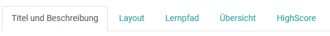
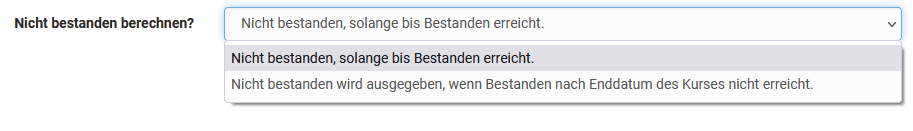

# Kursbaustein "Struktur"

Der Kursbaustein Struktur dient vorrangig der Gliederung und Strukturierung
des Kurses. Die konkreten Einstellungsmöglichkeiten sind davon abhängig, ob
der Kursbaustein in herkömmlichen oder in Lernpfad Kursen verwendet wird

 **Tabs in Lernpfad Kursen**

 **Tabs in herkömmlichen Kursen**

Weitere Informationen zu den allgemeinen Tabs "Titel und Beschreibung",
Layout" sowie "Sichtbarkeit" und "Zugang" finden Sie
[hier](../learningresources/General_Configuration_of_Course_Elements.de.md).

## Tab Übersicht

Sie können für den Kursbaustein "Struktur" im Tab Übersicht zwischen vier
Darstellungsarten wählen und so ein automatisch von OpenOlat generierte
Übersicht erzeugen, eine eigene HTML-Seite einbinden oder einfach den ersten
untergeordneten Kursbaustein anzeigen lassen.

  * Wenn Sie den Radio-Button _«automatische Übersicht»_ wählen, wird ein von OpenOlat generiertes Verzeichnis der untergeordneten Kursbausteine angezeigt. Sie können zusätzlich auswählen, ob alle oder nur bestimmte Kursbausteine angezeigt werden und ob die Anzeige in einer oder zwei Spalten erfolgen soll.
  * Wenn Sie den Radio-Button _«automatische Übersicht mit Vorschau»_ wählen, werden die untergeordneten Kursbausteine mit einer Vorschau angezeigt. Die genaue Vorschau variiert dabei je nach Kursbaustein. Die Konfigurationsmöglichkeiten dieser Einstellung sind ähnlich wie bei der automatischen Übersicht. Ferner kann eingestellt werden, ob sich die Vorschau auf alle Kursbausteine oder nur auf Strukturbausteine bezieht. Der User sieht allerdings keine Vorschau für Kursbausteine zu denen er (noch) keinen Zugang hat.
  * Wenn Sie den Radio-Button _«eigene HTML-Seite»_ wählen, können Sie eine HTML Seite aus dem Ablageordner wählen, eine neue HTML Datei erstellen oder eine passende Datei importieren.   
  * Wenn Sie den Radio-Button _«Keine Übersicht, erster sichtbarer Kursbaustein aktivieren»_ wählen, wird anstelle einer Übersicht der erste sichtbare, untergeordnete Kursbaustein angezeigt. Zusätzlich erscheint dann der Tab "Anzeige Inhalt" und weitere spezifische Einstellungen für HTML-Seiten können vorgenommen werden.

 **Anzeige in zwei Spalten:** Wählen Sie die Checkbox _Anzeige in zwei
Spalten_ an, um das automatische Inhaltsverzeichnis bzw. die Vorschau in zwei
Spalten anzeigen zu lassen.

!!! info "Info"

    Wenn Sie sich für eine eigene HTML-Seite entschieden haben und diese Verknüpfungen zu in OpenOlat abgelegten Grafiken oder sonstigen Dateien beinhaltet, müssen Sie unter "Sicherheitseinstellungen" die Option "Link im gesamten Ablageordner erlauben" wählen. Ferner können Sie auch Betreuern erlauben die HTML-Seite ohne Zugriff auf den Kurseditor zu bearbeiten.

## Tab Highscore

Hier können Sie die Anzeige der Highscore-Darstellung aktivieren und
konfigurieren. Sie können einen Gratulationstitel, ein Siegertreppchen, ein
Histogramm sowie eine Bestenliste anzeigen lassen. Auch eine anonymisierte
Darstellung ist hier möglich.

Einen Sonderfall des Bausteins Struktur stellt der Hauptkursknoten dar. Er
enthält zusätzlich den Tab
"[Erinnerungen](../learningresources/Course_Reminders.de.md)" und kann weder gelöscht
noch verschoben werden.

## Spezielle Einstellungen des Kursbausteins Struktur je nach Kurstyp

## Einstellungen für herkömmliche Kurse

###  Tab Punkte   {: #score}

Der Kursbaustein Struktur bietet sich auch an um Punkte, die in anderen
bewertbaren OpenOlat Kursbausteinen (z.B.  _Bewertung_ , _Gruppen-/Aufgabe,
SCORM-Lerninhalt, Checkliste, LTI-Seite, Portfolioaufgabe_ , _Test_ )
gesammelt wurden aufzuaddieren und ein bestanden/nicht bestanden anzeigen zu
lassen. Die zusammengefassten Resultate erscheinen beim Klick auf den
Kursbaustein _Struktur_ im laufenden Kurs.

Folgende Einstellungen sind möglich:

 **Punkte berechnen?:** Es erscheint eine Übersicht der bewertbaren Bausteine
Ihres Kurses die Sie für die Berechnung der Punkte berücksichtigen können.
Wählen Sie entweder alle oder gezielte Bausteine aus und OpenOlat addiert die
jeweiligen Punkte. Es ist auch möglich anstatt einer Gesamtsumme einen
Durchschnittswert berechnen zu lassen. Das macht z.B. Sinn, wenn alle
Bausteine dieselbe maximale Punktzahl haben. Bausteine, die (noch) keine
Bewertung enthalten, bleiben bei der Berechnung unberücksichtigt. Der
berechnete Wert wird dem User nach der Bewertung unter „Punkte“ angezeigt.

 **Bestanden berechnen?:** Bestanden bzw. nicht bestanden kann sich auf eine
Mindestpunktzahl beziehen, die Sie definieren oder auf das bestehen
ausgewählter oder aller bewertbarer Kursbausteine. Wenn Sie _«Aus
Punkteminimum»_ wählen, können Sie das Punkteminimum eingeben. Dieses bezieht
sich auf die zuvor ausgewählten Kursbausteine, d.h. es wird auf dem
Kursbaustein _Struktur_ ein _«Bestanden»_ angezeigt, wenn die Punktesumme
obiger Kursbausteine grösser oder gleich gross wie das von Ihnen gewählte
Punkteminimum ist.

Wenn Sie _«Von Bausteinen übernehmen»_ wählen, werden Ihnen unter **Bestanden
von** die bewertbaren Kursbausteine Ihres Kurses angezeigt. Sie können nun
diejenigen anwählen, deren Bestanden-Wert mit einer boolschen UND-Verknüpfung
den Bestanden-Wert des Kursbausteins _Struktur_ bilden sollen. D.h. damit der
Kursbaustein _Struktur_ ein _«Bestanden»_ anzeigt, müssen alle gewählten
Kursbausteine ein _«Bestanden»_ aufweisen.

 **Nicht bestanden berechnen?:  **Es ist auch möglich gezielt ein "nicht
bestanden" zu berechnen.

  * Nicht bestanden wird solange angezeigt bis die Anforderungen, die für das Bestehen definiert wurden, erfüllt sind.
  * Nicht bestanden wird erst dann angezeigt, wenn die Anforderungen an das Bestehen nicht erfüllt sind _und_ das Enddatum des Kurses erreicht ist. Wurden schon vor Kursende die Bedingungen für "bestanden" erfüllt, wird bestanden schon während der Kurslaufzeit angezeigt.

Sollen für einen Kurs Leistungsnachweise ausgestellt werden, ist es notwendig
die Einstellungen im Tab "Punkte" entsprechend anzupassen.

Wenn Sie Leistungsnachweise verwenden, bzw. den Bestanden-Status des Kurses
z.B. im Coaching-Tool überprüfen wollen, muss im Kurshauptknoten an dieser
Stelle zwingend die Option **Bestanden berechnen?** aktiviert werden.

Verwenden Sie für alle bewertbaren Kursbausteine eindeutige Kurztitel, um
diese in der Auswahl im Tab „Punkte“ rasch voneinander unterscheiden zu
können.

Der Kursbaustein „Struktur“ und damit seine untergeordneten Kursbausteine
können mit einem Passwort geschützt werden. Öffnen Sie dazu den Tab „Zugang“
und legen dort unter „Passwort“ das Passwort fest.

Auf dem obersten Kursbaustein kann im Tab "Zugang" kein Passwort hinterlegt
werden.

## Einstellungen für Lernpfad Kurse

Die Einstellungen im Tab "Lernpfad" unterscheiden sich grundsätzlich von den
Einstellungen in anderen Kursbausteinen. Bei Lernpfad Kursen wird im
Kursbaustein Struktur definiert ob die Abfolge der Lernschritte sequenziell
(nacheinander) oder ohne Reihenfolge erfolgt. Bei Strukturbausteinen gibt es
kein spezifisches Erledigungskriterium.
