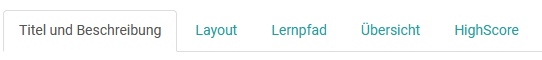
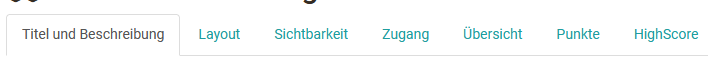
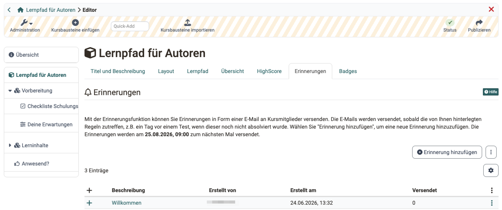
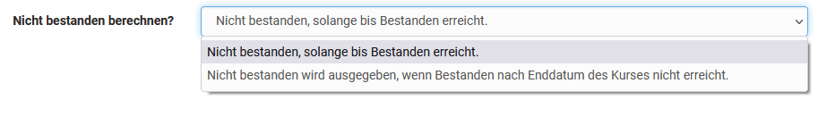

# Kursbaustein "Struktur" {: #course_element_structure}

## Steckbrief

Name | Struktur
---------|----------
Icon | :o_icon_o_st_icon:
Verfügbar seit | Release 1
Funktionsgruppe | Wissensvermittlung
Verwendungszweck | Gliederung des Menüs in Kapitel, Zusammenfassung der Bewertungen frei gewählter bewertbarer Kursbausteine des Kurses
Bewertbar | ja
Spezialität / Hinweis | Generierung von automatischen Übersichten

Verwenden Sie diesen Kursbaustein, um Ihre Kursbausteine zu gliedern, zu strukturieren und/oder Bereiche klar zu trennen. Legen Sie z.B. einen Bereich für die Kommunikation und einen für Kursaktivitäten und einen für Inhalte an.

Der Kursbaustein Struktur bietet u.a. eine automatische Übersicht über alle ihm untergeordneten Kursbausteine mit deren Kurztitel, Titel und Beschreibungen. Mit der automatischen Übersicht ist auch eine automatisch generierte Leistungsübersicht mit Punkten, Status und Link zum Leistungsnachweis verbunden, sofern diese für den Kursbaustein bzw. den Kurs generell aktiviert wurden.

Die Einstellungen des Kursbausteins nehmen Besitzer:innen des Kurses im Kurseditor vor: `Kurs > Administration > Kurseditor`. Betreuer:innen erreichen den Kurseditor nur, wenn ihnen im Kurs das Recht "Kurseditor" erteilt wurde.

{ class="shadow lightbox" }

### Das gewählte Kursformat

!!! tip "Lernpfad oder nicht?"

    Die konkreten Einstellungsmöglichkeiten sind davon abhängig, ob der Kursbaustein in herkömmlichen oder in Lernpfad-Kursen verwendet wird. An der Tab-Leiste des Kursbausteins erkennen Sie, welchen Kurstyp Sie vor sich haben: Ein Tab "Lernpfad" weist den Kurs als Lernpfad-Kurs aus, die Tabs "Sichtbarkeit", "Zugang" und "Punkte" weisen ihn als herkömmlichen Kurs aus. Hier die Tabs im Vergleich:

**Tabs in Lernpfad-Kursen**

{ class="shadow lightbox" }

**Tabs in herkömmlichen Kursen**

{ class="shadow lightbox" }

Einen weiteren Sonderfall stellt der oberste Eintrag im Kurseditor dar: der Kurshauptknoten. Auch er ist ein Strukturbaustein, obwohl man es ihm nicht ansieht: Er trägt das Symbol des Kurses :o_icon_o_CourseModule_icon: und nicht das Symbol des Strukturbausteins :o_icon_o_st_icon:. Er hat deshalb dieselben Tabs wie jeder andere Strukturbaustein, aber er trägt als einziger den Tab "[Erinnerungen](../learningresources/Course_Reminders.de.md)". Zudem sind Löschen und Verschieben beim Kurshauptknoten **nicht** möglich.

{ class="shadow lightbox" }

Im Kurseditor erscheinen die Tabs des Strukturbausteins in dieser Reihenfolge:

  1. **Titel und Beschreibung** und **Layout**: in beiden Kurstypen gleich, beschrieben unter [Kursbausteine im Kurseditor](../learningresources/General_Configuration_of_Course_Elements.de.md).
  2. **Lernpfad** im Lernpfad-Kurs, oder **Sichtbarkeit** und **Zugang** im herkömmlichen Kurs. Zum Tab "Lernpfad" siehe [Einstellungen im Lernpfad-Kurs](#learning_path_course_settings), zu "Sichtbarkeit" und "Zugang" die [allgemeine Beschreibung](../learningresources/General_Configuration_of_Course_Elements.de.md#access) und für den Passwortschutz des Strukturbausteins den [Tab Zugang](#access).
  3. **Übersicht**, **Punkte** nur im herkömmlichen Kurs, und **HighScore**: die Tabs des Strukturbausteins selbst, auf dieser Seite beschrieben.
  4. **Erinnerungen** nur am Kurshauptknoten, **Badges** nur bei aktivierter Badge-Vergabe.

#### Tab Übersicht {: #overview}

Die zentralen Einstellungen werden im Tab "Übersicht" vorgenommen. Sie können zwischen vier Darstellungsarten für den Baustein wählen und so eine automatisch von OpenOlat generierte Übersicht erzeugen, eine eigene HTML-Seite verknüpfen oder einfach den ersten untergeordneten Kursbaustein anzeigen lassen.

  * **Automatische Übersicht** generiert ein Verzeichnis der untergeordneten Kursbausteine. Sie können zusätzlich auswählen, ob alle oder nur bestimmte Kursbausteine angezeigt werden und ob die Anzeige in einer oder zwei Spalten erfolgen soll.
  * **Automatische Übersicht mit Vorschau** generiert ebenfalls ein Verzeichnis der untergeordneten Kursbausteine, zeigt aber zusätzlich noch eine Vorschau bei einigen Kursbausteinen an. Die genaue Vorschau variiert dabei je nach Kursbaustein. Die Konfigurationsmöglichkeiten dieser Einstellung sind ähnlich wie bei der automatischen Übersicht. Ferner kann eingestellt werden, ob sich die Vorschau auf alle Kursbausteine oder nur auf Strukturbausteine bezieht. Teilnehmende sehen allerdings keine Vorschau für Kursbausteine, zu denen sie (noch) keinen Zugang haben.
  * **Eigene HTML-Seite** ermöglicht es anstatt der automatisch generierten Übersicht eine eigene Informationsseite zu erstellen. Dafür können Sie eine HTML-Seite aus dem Ablageordner wählen, eine neue HTML Datei erstellen oder eine passende Datei importieren. Im OpenOlat HTML-Editor können dann ähnlich wie beim Kursbaustein HTML-Seite Text, Bilder u.ä. hinzugefügt werden. Zusätzlich erscheint der Tab "Anzeige Inhalt" und weitere spezifische Einstellungen für HTML-Seiten können vorgenommen werden.
  * Wenn Sie den Radio-Button **Keine Übersicht, erster sichtbarer Kursbaustein aktivieren** wählen, wird anstelle einer Übersicht der erste sichtbare, untergeordnete Kursbaustein angezeigt.

!!! info "Wichtig"

    Wenn Sie sich für eine eigene HTML-Seite entschieden haben und diese Verknüpfungen zu in OpenOlat abgelegten Grafiken oder sonstigen Dateien beinhaltet, müssen Sie unter "Sicherheitseinstellungen" die Option "Link im gesamten Ablageordner erlauben" wählen. Ferner können Sie auch Betreuern erlauben die HTML-Seite ohne Zugriff auf den Kurseditor zu bearbeiten.

#### Tab HighScore [:octicons-tag-16:{ title="ab Release 11.3 (OO-2133)" }](https://track.frentix.com/issue/OO-2133) {: #highscore}

Hier können Sie die Anzeige der Highscore-Darstellung aktivieren und konfigurieren. Sie können einen Gratulationstitel, ein Siegertreppchen, ein Histogramm sowie eine Bestenliste anzeigen lassen. Auch eine anonymisierte Darstellung ist hier möglich.

#### Tab Badges {: #badges}

Hat die Besitzer:in des Kurses unter `Kurs > Administration > Einstellungen > Bewertung` im Abschnitt **Badges** die Vergabe von Badges aktiviert, wird im Kurseditor zu diesem Kursbaustein der Tab "Badges" angezeigt und es kann ein spezifischer Badge für diesen Kursbaustein erstellt werden.

[Zum Seitenanfang ^](#course_element_structure)

---

## Einstellungen nach Kurstyp

Alle bisher beschriebenen Tabs verhalten sich in beiden Kurstypen gleich. Die Unterschiede betreffen nur wenige Tabs: Im Lernpfad-Kurs, dem Standardfall, kommt der Tab "Lernpfad" hinzu. Im herkömmlichen Kurs kommen stattdessen die Tabs "Sichtbarkeit", "Zugang" und "Punkte" hinzu.

### Einstellungen im Lernpfad-Kurs {: #learning_path_course_settings}

Die Einstellungen im Tab "Lernpfad" unterscheiden sich grundsätzlich von den Einstellungen der anderen Kursbausteine in Lernpfad-Kursen. Bei Lernpfad-Kursen wird im Kursbaustein Struktur definiert, ob die Abfolge der Lernschritte der untergeordneten Kursbausteine sequenziell (nacheinander) oder flexibel, ohne Reihenfolge, erfolgt. Unter **Durchführung** legen Sie zudem fest, ob der Strukturbaustein "Teil des Lernpfades" ist oder "Ausgenommen" wird. Bei Strukturbausteinen gibt es kein spezifisches Erledigungskriterium.

{ class="shadow lightbox" }

Weitere Informationen zum Tab finden Sie [hier](../learningresources/Learning_path_course_Course_editor.de.md).

### Abweichungen im herkömmlichen Kurs {: #conventional_course_settings}

Der herkömmliche Kurs kennt am Strukturbaustein zwei Tabs, die es im Lernpfad-Kurs nicht gibt: "Punkte" und "Zugang".

#### Tab Punkte {: #score}

!!! note "Sie finden den Tab «Punkte» nicht?"

    Dann arbeiten Sie in einem Lernpfad-Kurs. Die Bewertung des Kurses stellen Sie dort an einem anderen Ort ein: `Kurs > Administration > Einstellungen > Bewertung`, Abschnitt "Einstellungen Bewertung". Die Beschreibung dazu finden Sie unter [Kurseinstellungen - Tab Bewertung](../learningresources/Course_Settings_Assessment.de.md#section_assessment_settings).

Herkömmliche Kurse verfügen über den Tab "Punkte". Hier können Punkte, die in anderen bewertbaren OpenOlat Kursbausteinen (z.B.  _Bewertung_, _Gruppen-/Aufgabe, SCORM 1.2, Checkliste, LTI-Seite, Portfolioaufgabe_, _Test_) aufaddiert werden und ein bestanden/nicht bestanden angezeigt werden. Die zusammengefassten Resultate erscheinen beim Klick auf den Kursbaustein _Struktur_ im laufenden Kurs.

Folgende Einstellungen zur Konfiguration der manuellen Bewertung sind möglich:

 **Punkte** berechnen: Unter **Punkte von** erscheint eine Übersicht aller bewertbaren Kursbausteine Ihres Kurses, die Sie für die Berechnung der Punkte berücksichtigen können. Wählen Sie entweder alle oder gezielte Kursbausteine aus und OpenOlat addiert die jeweiligen Punkte. Es ist auch möglich anstatt einer Gesamtsumme einen Durchschnittswert berechnen zu lassen. Das macht z.B. Sinn, wenn alle Bausteine dieselbe maximale Punktzahl haben. Bausteine, die (noch) keine Bewertung enthalten, bleiben bei der Berechnung unberücksichtigt. Der berechnete Wert wird den Teilnehmenden nach der Bewertung unter "Punkte" angezeigt.

 **Bestanden** berechnen: Bestanden bzw. nicht bestanden kann sich auf eine Mindestpunktzahl beziehen, die Sie definieren, oder auf das Bestehen ausgewählter Kursbausteine. Wenn Sie _«Aus Punkteminimum»_ wählen, geben Sie das Punkteminimum ein. Es bezieht sich auf die unter "Punkte von" gewählten Kursbausteine: Der Kursbaustein _Struktur_ zeigt _«Bestanden»_ an, wenn deren Punktesumme grösser oder gleich dem Punkteminimum ist.

Wenn Sie _«Von Bausteinen übernehmen»_ wählen, zeigt OpenOlat unter **Relevante Kursbausteine** die bewertbaren Kursbausteine Ihres Kurses an. Wählen Sie diejenigen aus, deren Bestanden-Wert zählen soll. Unter **Bestanden, wenn** legen Sie fest, wie viele davon bestanden sein müssen: [:octicons-tag-16:{ title="ab Release 19.0.3 (OO-7484)" }](https://track.frentix.com/issue/OO-7484)

  * **Alle relevanten Kursbausteine bestanden**: Der Kursbaustein _Struktur_ zeigt erst _«Bestanden»_ an, wenn jeder gewählte Kursbaustein bestanden ist.
  * **Eine bestimmte Anzahl der relevanten Kursbausteine bestanden**: Geben Sie unter **Anzahl Kursbausteine zu bestehen** ein, wie viele der gewählten Kursbausteine bestanden sein müssen. Die Zahl muss kleiner sein als die Anzahl der gewählten Kursbausteine. So bilden Sie zum Beispiel eine Wahlpflicht ab: Drei von fünf Tests müssen bestanden sein.

!!! tip "Die Auswahl umfasst die ganze Lernressource"

    Unter "Punkte von" und "Relevante Kursbausteine" bietet OpenOlat alle bewertbaren Kursbausteine des Kurses an, unabhängig davon, wo sie im Menü stehen. Ein Strukturbaustein kann darum "Nicht bestanden" anzeigen, obwohl alle Kursbausteine unterhalb bestanden sind: zum Beispiel, wenn ein Test aus einem anderen Kapitel ebenfalls als relevant gewählt ist. Prüfen Sie bei unerwarteten Ergebnissen zuerst die gewählten Kursbausteine im Tab "Punkte".

**Nicht bestanden** berechnen: Es ist auch möglich gezielt ein "nicht bestanden" zu berechnen.

{ class="shadow lightbox" }

  * Nicht bestanden wird solange angezeigt bis die Anforderungen, die für das Bestehen definiert wurden, erfüllt sind.
  * Nicht bestanden wird erst dann angezeigt, wenn die Anforderungen an das Bestehen nicht erfüllt sind _und_ das Enddatum des Kurses erreicht ist. Wurden schon vor Kursende die Bedingungen für "bestanden" erfüllt, wird bestanden schon während der Kurslaufzeit angezeigt.

Sollen für einen Kurs Leistungsnachweise ausgestellt werden, ist es notwendig die Einstellungen im Tab "Punkte" entsprechend anzupassen.

Für Teilnehmende zeigt sich die Leistungsübersicht wie folgt:

{ class="shadow lightbox" }

!!! note "Hinweis"

    Wenn Sie Leistungsnachweise verwenden, bzw. den Bestanden-Status des Kurses z.B. im Coaching-Tool überprüfen wollen, muss im Kurshauptknoten an dieser Stelle zwingend die Option **Bestanden berechnen?** aktiviert werden.

!!! tip "Tipp"

    Verwenden Sie für alle bewertbaren Kursbausteine eindeutige Kurztitel, um diese in der Auswahl im Tab "Punkte" rasch voneinander unterscheiden zu können.

**Wenn die Konfiguration schreibgeschützt ist**

Die Konfiguration im Tab "Punkte" lässt sich nicht immer sofort ändern. Sobald für den Strukturbaustein Bewertungen vorhanden sind, zeigt OpenOlat sie schreibgeschützt an. Der Grund: Jede Änderung an den Bewertungsregeln wirkt auf alle bestehenden Bewertungen zurück. Der Schreibschutz stellt sicher, dass Sie diesen Eingriff bewusst auslösen und nicht nebenbei. [:octicons-tag-16:{ title="ab Release 20.3.7 / 21.0.1 (OO-9646)" }](https://track.frentix.com/issue/OO-9646)

OpenOlat sagt Ihnen das mit einem Hinweis über der Konfiguration: "Da bereits **Bewertungen vorhanden** sind, wird die Konfiguration als **schreibgeschützt** angezeigt. Um Änderungen vorzunehmen, müssen Sie den schreibgeschützten Modus deaktivieren - dadurch werden alle vorhandenen Bewertungen neu berechnet."

Klicken Sie auf **Bearbeitung aktivieren**, um den Schreibschutz aufzuheben. Die Schaltfläche trägt das Symbol eines offenen Schlosses. Danach sind die Felder wieder bearbeitbar, und an der Stelle des Hinweises steht die Warnung: "Sie bearbeiten derzeit die Konfiguration der Bewertung, obwohl bereits Bewertungen vorhanden sind. Wenn Sie die Änderungen speichern und veröffentlichen, werden alle vorhandenen Bewertungen **neu berechnet**. Dieser Vorgang kann **nicht rückgängig** gemacht werden."

Sind noch keine Bewertungen vorhanden, ist der Tab direkt bearbeitbar. Hinweis und Warnung erscheinen dann nicht.

!!! info "Wichtig"

    Denselben Schutz gibt es im Lernpfad-Kurs, nur an einem anderen Ort und zu einem anderen Zeitpunkt. Dort stellen Sie die Kursbewertung unter `Kurs > Administration > Einstellungen > Bewertung` ein. Sind Teilnehmende bereits bewertet, ist das Formular nicht schreibgeschützt: Stattdessen öffnet OpenOlat beim Speichern den Dialog "Einstellungen speichern" und Sie entscheiden dort zwischen **Übernehmen & neu berechnen** und **Verwerfen**.

**Neuberechnung beim Publizieren**

Publizieren Sie eine Änderung, die einen Strukturbaustein oder den Kurshauptknoten einschliesst, berechnet OpenOlat die Bewertungen aller betroffenen Teilnehmenden sofort neu: Punkte, Bestanden-Status und, wenn eine Einstufung konfiguriert ist, die Note. Auch die Leistungsnachweise werden aktualisiert.

Betreuer:innen sehen damit direkt nach dem Publizieren einen einheitlichen Stand. Die Teilnehmenden müssen den Kurs dafür nicht öffnen. Die Neuberechnung läuft im Hintergrund, eine manuelle Aktion ist dafür nicht nötig.

#### Tab Zugang {: #access}

Der Kursbaustein "Struktur" und damit seine untergeordneten Kursbausteine können bei herkömmlichen Kursen mit einem Passwort geschützt werden. Setzen Sie dafür den Haken bei "Passwort" und hinterlegen Sie den gewünschten Code.

!!! warning "Achtung"

    Auf dem Kurshauptknoten kann im Tab "Zugang" _kein_ Passwort hinterlegt werden.

## Weiterführende Informationen {: #further_information}

**Auf dieser Seite erwähnt** 
[Erinnerungen >](../learningresources/Course_Reminders.de.md) 
[Kursbausteine im Kurseditor >](../learningresources/General_Configuration_of_Course_Elements.de.md) 
[Lernpfadkurs - Kurseditor >](../learningresources/Learning_path_course_Course_editor.de.md) 
[Kurseinstellungen - Tab Bewertung >](../learningresources/Course_Settings_Assessment.de.md)

**Weiterführend** 
[Kursbausteine >](../learningresources/Course_Elements.de.md) 
[Lernpfadkurs - Überblick >](../learningresources/Learning_path_course.de.md) 
[Bewertungswerkzeug - Übersicht >](../learningresources/Assessment_tool_overview.de.md)

[Zum Seitenanfang ^](#course_element_structure)
