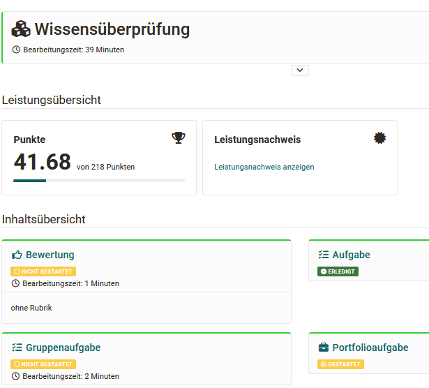
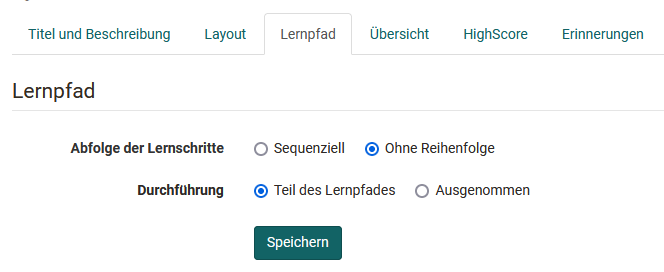
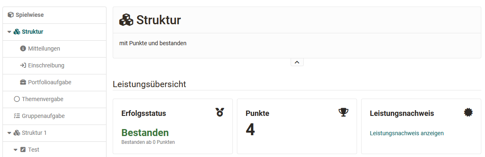

# Kursbaustein "Struktur"

## Steckbrief

Name | Struktur
---------|----------
Icon | { class=size24  }
Verfügbar seit | Release 1
Funktionsgruppe | Wissensvermittlung
Verwendungszweck | Gliederung des Menüs in Kapitel, Sammlung von Bewertungen aller dem Strukturbaustein untergeordneten Kursbausteine 
Bewertbar | ja
Spezialität / Hinweis | Generierung von automatischen Übersichten 

Verwenden Sie diesen Kursbaustein, um Ihre Kursbausteine zu gliedern, zu strukturieren und/oder Bereiche klar zu trennen. Legen sie z.B. einen Bereich für die Kommunikation und einen für Kursaktivitäten und einen für Inhalte an. 

Der Kursbaustein Struktur bietet u.a. eine automatische Übersicht über alle ihm untergeordneten Kursbausteine mit deren Kurztitel, Titel und Beschreibungen. Mit der automatischen Übersicht ist auch eine automatisch generierte Leistungsübersicht mit Punkten, Status und Link zum Leistungsnachweis verbunden, sofern diese für den Kursbaustein bzw. den Kurs generell aktiviert wurden. 

Die konkreten Einstellungsmöglichkeiten sind davon abhängig, ob der Kursbaustein in herkömmlichen oder in Lernpfad Kursen verwendet wird. Hier die Tabs im Vergleich: 

**Tabs in Lernpfad Kursen**

**Tabs in herkömmlichen Kursen**

Weitere Informationen zu den allgemeinen Tabs "Titel und Beschreibung", Layout" sowie "Sichtbarkeit" und "Zugang" finden Sie [hier](../learningresources/General_Configuration_of_Course_Elements.de.md).

## Tab Übersicht

Die zentralen Einstellungen werden im Tab "Übersicht" vorgenommen. Sie können zwischen vier Darstellungsarten für den Baustein wählen und so eine automatisch von OpenOlat generierte Übersicht erzeugen, eine eigene HTML-Seite verknüpfen oder einfach den ersten untergeordneten Kursbaustein anzeigen lassen.

  * **Automatische Übersicht** generiert ein Verzeichnis der untergeordneten Kursbausteine. Sie können zusätzlich auswählen, ob alle oder nur bestimmte Kursbausteine angezeigt werden und ob die Anzeige in einer oder zwei Spalten erfolgen soll.
  * **Automatische Übersicht mit Vorschau** generiert ebenfalls Verzeichnis der untergeordneten Kursbausteine, zeigt aber zusätzlich noch eine Vorschau bei einigen Kursbausteinen an. Die genaue Vorschau variiert dabei je nach Kursbaustein. Die Konfigurationsmöglichkeiten dieser Einstellung sind ähnlich wie bei der automatischen Übersicht. Ferner kann eingestellt werden, ob sich die Vorschau auf alle Kursbausteine oder nur auf Strukturbausteine bezieht. Der User sieht allerdings keine Vorschau für Kursbausteine zu denen er (noch) keinen Zugang hat.
  * **Eigene HTML-Seite** ermöglicht es anstatt der automatisch generierten Übersicht eine eigene Informationsseite zu erstellen. Dafür können Sie eine HTML-Seite aus dem Ablageordner wählen, eine neue HTML Datei erstellen oder eine passende Datei importieren. Im OpenOlat HTML-Editor können dann ähnlich wie beim Kursbaustein HTML-Seite Text, Bilder u.ä. hinzugefügt werden. Zusätzlich erscheint der Tab "Anzeige Inhalt" und weitere spezifische Einstellungen für HTML-Seiten können vorgenommen werden.  
  * Wenn Sie den Radio-Button **Keine Übersicht, erster sichtbarer Kursbaustein aktivieren** wählen, wird anstelle einer Übersicht der erste sichtbare, untergeordnete Kursbaustein angezeigt. 

!!! info "Info"

    Wenn Sie sich für eine eigene HTML-Seite entschieden haben und diese Verknüpfungen zu in OpenOlat abgelegten Grafiken oder sonstigen Dateien beinhaltet, müssen Sie unter "Sicherheitseinstellungen" die Option "Link im gesamten Ablageordner erlauben" wählen. Ferner können Sie auch Betreuern erlauben die HTML-Seite ohne Zugriff auf den Kurseditor zu bearbeiten.

## Tab Highscore

Hier können Sie die Anzeige der Highscore-Darstellung aktivieren und konfigurieren. Sie können einen Gratulationstitel, ein Siegertreppchen, ein Histogramm sowie eine Bestenliste anzeigen lassen. Auch eine anonymisierte Darstellung ist hier möglich.

Einen Sonderfall des Bausteins Struktur stellt der Hauptkursknoten dar. Er enthält zusätzlich den Tab "[Erinnerungen](../learningresources/Course_Reminders.de.md)" und kann weder gelöscht noch verschoben werden.

## Spezielle Einstellungen des Kursbausteins Struktur je nach Kurstyp

### Einstellungen für Lernpfad Kurse

Die Einstellungen im Tab "Lernpfad" unterscheiden sich grundsätzlich von den Einstellungen der anderen Kursbausteinen in Lernpfad Kursen. Bei Lernpfad Kursen wird im Kursbaustein Struktur definiert ob die Abfolge der Lernschritte der untergeordneten Kursbausteine sequenziell (nacheinander) oder flexibel, ohne Reihenfolge, erfolgt. Bei Strukturbausteinen gibt es kein spezifisches Erledigungskriterium.

Weitere Informationen zum Tab findet man [hier](../learningresources/Learning_path_course_Course_editor.de.md) 

### Einstellungen für herkömmliche Kurse

#### Tab Punkte   {: #score}

Herkömmliche Kurs verfügen über den Tab "Punkte". Hier können Punkte, die in anderen bewertbaren OpenOlat Kursbausteinen (z.B.  _Bewertung_, _Gruppen-/Aufgabe, SCORM-Lerninhalt, Checkliste, LTI-Seite, Portfolioaufgabe_, _Test_) aufaddiert werden und ein bestanden/nicht bestanden angezeigt werden. Die zusammengefassten Resultate erscheinen beim Klick auf den Kursbaustein _Struktur_ im laufenden Kurs.

Folgende Einstellungen zur Konfiguration der manuellen Bewertung sind möglich:

 **Punkte** berechnen: Es erscheint eine Übersicht der bewertbaren Bausteine Ihres Kurses die Sie für die Berechnung der Punkte berücksichtigen können. Wählen Sie entweder alle oder gezielte Bausteine aus und OpenOlat addiert die jeweiligen Punkte. Es ist auch möglich anstatt einer Gesamtsumme einen Durchschnittswert berechnen zu lassen. Das macht z.B. Sinn, wenn alle Bausteine dieselbe maximale Punktzahl haben. Bausteine, die (noch) keine Bewertung enthalten, bleiben bei der Berechnung unberücksichtigt. Der berechnete Wert wird dem User nach der Bewertung unter "Punkte" angezeigt.

 **Bestanden** berechnen: Bestanden bzw. nicht bestanden kann sich auf eine Mindestpunktzahl beziehen, die Sie definieren oder auf das bestehen ausgewählter oder aller bewertbarer Kursbausteine. Wenn Sie _«Aus Punkteminimum»_ wählen, können Sie das Punkteminimum eingeben. Dieses bezieht sich auf die zuvor ausgewählten Kursbausteine, d.h. es wird auf dem Kursbaustein _Struktur_ ein _«Bestanden»_ angezeigt, wenn die Punktesumme obiger Kursbausteine grösser oder gleich gross wie das von Ihnen gewählte Punkteminimum ist.

Wenn Sie _«Von Bausteinen übernehmen»_ wählen, werden Ihnen unter **Bestanden von** die bewertbaren Kursbausteine Ihres Kurses angezeigt. Sie können nun diejenigen anwählen, deren Bestanden-Wert mit einer boolschen UND-Verknüpfung den Bestanden-Wert des Kursbausteins _Struktur_ bilden sollen. D.h. damit der Kursbaustein _Struktur_ ein _«Bestanden»_ anzeigt, müssen alle gewählten Kursbausteine ein _«Bestanden»_ aufweisen.

**Nicht bestanden** berechnen: Es ist auch möglich gezielt ein "nicht bestanden" zu berechnen.

  * Nicht bestanden wird solange angezeigt bis die Anforderungen, die für das Bestehen definiert wurden, erfüllt sind.
  * Nicht bestanden wird erst dann angezeigt, wenn die Anforderungen an das Bestehen nicht erfüllt sind _und_ das Enddatum des Kurses erreicht ist. Wurden schon vor Kursende die Bedingungen für "bestanden" erfüllt, wird bestanden schon während der Kurslaufzeit angezeigt.

Sollen für einen Kurs Leistungsnachweise ausgestellt werden, ist es notwendig die Einstellungen im Tab "Punkte" entsprechend anzupassen.

Für den User zeigt sich die Leistungsübersicht wie folgt:

!!! note "Hinweis"

    Wenn Sie Leistungsnachweise verwenden, bzw. den Bestanden-Status des Kurses z.B. im Coaching-Tool überprüfen wollen, muss im Kurshauptknoten an dieser Stelle zwingend die Option **Bestanden berechnen?** aktiviert werden.

!!! Tip "Tipp"

    Verwenden Sie für alle bewertbaren Kursbausteine eindeutige Kurztitel, um diese in der Auswahl im Tab "Punkte" rasch voneinander unterscheiden zu können.

#### Tab Zugang

Der Kursbaustein "Struktur" und damit seine untergeordneten Kursbausteine können bei herkömmlichen Kursen mit einem Passwort geschützt werden. Setzen Sie dafür den Haken bei "Passwort" und hinterlegen Sie den gewünschten Code. 

!!! warning "Achtung"

    Auf dem obersten Kursbaustein, der eigentlich auch ein Strukturbaustein ist, kann im Tab "Zugang" _kein_ Passwort hinterlegt werden.

