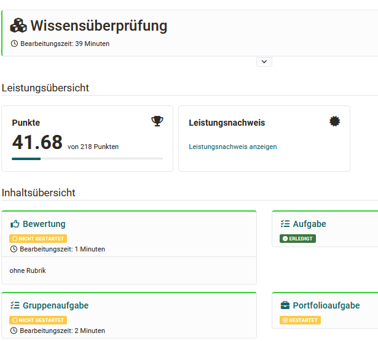
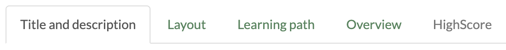
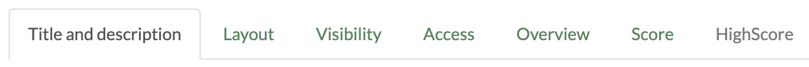
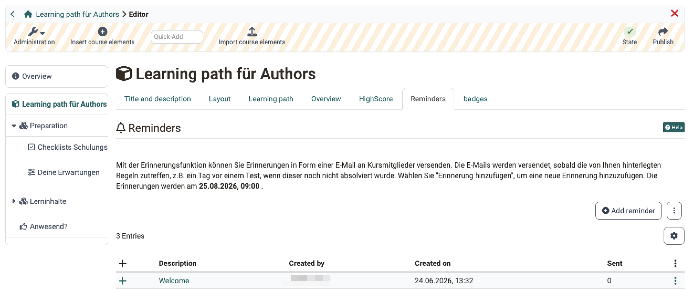
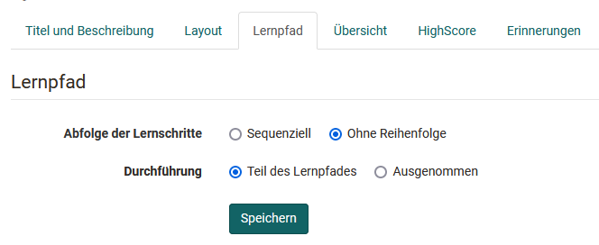
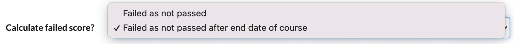
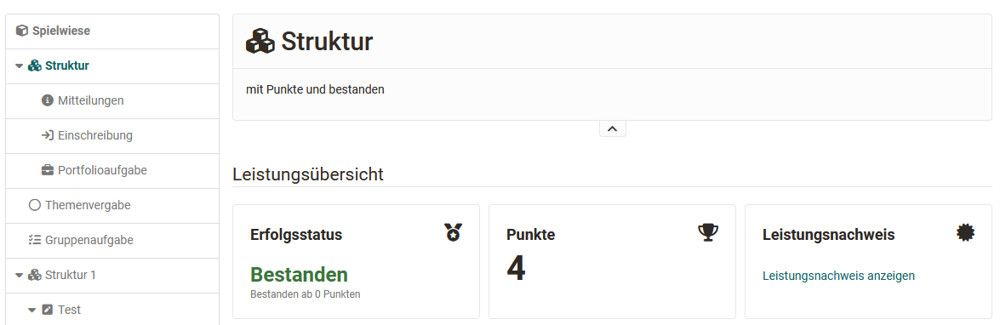

# Course Element "Structure" {: #course_element_structure}

## Profile

Name | Structure
---------|----------
Icon | :o_icon_o_st_icon:
Available since | Release 1
Functional group | Knowledge transfer
Purpose | Structuring of the menu into chapters, collection of assessments of all course elements subordinate to the structure element
Assessable | yes
Specialty / Note | Generation of automatic overviews

Use this course element to organize and structure your course elements and/or to clearly separate areas. For example, create an area for communication, one for course activities and one for content.

The course element Structure offers, among other things, an automatic overview of course elements subordinate to it with their short titles, titles and descriptions. The automatic overview is also linked to an automatically generated performance overview with points, status and link to the performance record, provided these have been activated for the course element or the course in general. 

The settings of the course element are made by the owners of the course in the course editor: `Course > Administration > Course editor`. Coaches only reach the course editor if they have been granted the "Course editor" right in the course.

{ class="shadow lightbox" }

### The chosen course format

!!! tip "Learning path or not?"

    The concrete setting options depend on whether the course element is used in conventional or in learning path courses. The tab bar of the course element tells you which course format you are looking at: A tab "Learning path" identifies the course as a learning path course, the tabs "Visibility", "Access" and "Score" identify it as a conventional course. Here the tabs in comparison:

**Tabs in learning path courses**

{ class="shadow lightbox" }

**Tabs in conventional courses**

{ class="shadow lightbox" }

A further special case is the topmost entry in the course editor: the course root node. It is a structure element as well, even though it does not look like one: It carries the symbol of the course :o_icon_o_CourseModule_icon: and not the symbol of the structure element :o_icon_o_st_icon:. It therefore has the same tabs as any other structure element, but it is the only one that carries the tab "[Reminders](../learningresources/Course_Reminders.md)". In addition, deleting and moving are **not** possible for the course root node.

{ class="shadow lightbox" }

In the course editor, the tabs of the structure element appear in this order:

  1. **Title and description** and **Layout**: identical in both course formats, described under [Course elements in the course editor](../learningresources/General_Configuration_of_Course_Elements.md).
  2. **Learning path** in the learning path course, or **Visibility** and **Access** in the conventional course. On the tab "Learning path" see [Settings in the learning path course](#learning_path_course_settings), on "Visibility" and "Access" the [general description](../learningresources/General_Configuration_of_Course_Elements.md#access) and for the password protection of the structure element the [Tab Access](#access).
  3. **Overview**, **Score** only in the conventional course, and **HighScore**: the tabs of the structure element itself, described on this page.
  4. **Reminders** only on the course root node, **Badges** only if the awarding of badges is activated.

#### Tab Overview {: #overview}

The central settings are made in the "Overview" tab.You can choose between four display modes for the course element "Structure" in the tab Overview and thus generate an automatically generated overview, integrate your own HTML page or simply display the first subordinate course element.

* **Automatic overview** generates a list of the subordinate course elements. You can additionally select whether all or only certain course elements are displayed and whether the display should be in one or two columns.
* **Automatically generated overview incl. preview**  also generates a directory of the subordinate course elements, but also displays a preview for some course elements. The exact preview varies depending on the course element. The configuration options for this setting are similar to those for the automatic overview. Furthermore, it can be set whether the preview refers to all course elements or only to structure elements. However, the user does not see a preview for course elements to which he does not (yet) have access.
* **Custom HTML page** allows you to create your own information page instead of the automatically generated overview. Therefore, you can select an HTML page from the storage folder, create a new HTML file or import a suitable file. Text, images etc. can then be added in the OpenOlat HTML editor in a similar way to the HTML page course element. In addition, the "Display content" tab appears and further specific settings for HTML pages can be made.  
* If you select the radio button **«No overview, activate first visible child node»**, the first visible subordinate course element will be displayed instead of an overview. 

!!! info "Important"

    If you have chosen your own HTML page and this contains links to graphics or other files stored in OpenOlat, you must select the option "Allow links in the entire storage folder" under "Security settings". You can also allow coaches to edit the HTML page without access to the course editor.

#### Tab HighScore [:octicons-tag-16:{ title="from Release 11.3 (OO-2133)" }](https://track.frentix.com/issue/OO-2133) {: #highscore}

Here you can activate and configure the high score display. You can display a congratulation title, a winner's podium, a histogram as well as a highscore list. An anonymized representation is also possible here.

#### Tab Badges {: #badges}

If the owner of the course has activated the awarding of badges under `Course > Administration > Settings > Assessment` in the section **Badges**, the "Badges" tab is displayed in the course editor for this course element and a specific badge can be created for this course element.

[To the top of the page ^](#course_element_structure)

---

## Settings by course format

All tabs described so far behave identically in both course formats. The differences concern only a few tabs: In the learning path course, the standard case, the tab "Learning path" is added. In the conventional course, the tabs "Visibility", "Access" and "Score" are added instead.

### Settings in the learning path course {: #learning_path_course_settings}

The settings in the tab "Learning path" basically differ from the settings of the other course elements in learning path courses. For learning path courses, the course element Structure defines whether the sequence of learning steps of the subordinate course elements is sequential (one after the other) or flexible, without a given order. Under **Execution** you additionally define whether the structure element is "Part of learning path" or "Excluded". There is no specific completion criterion for structure elements.

{ class="shadow lightbox" }

Further information on the tab can be found [here](../learningresources/Learning_path_course_Course_editor.md).

### Deviations in the conventional course {: #conventional_course_settings}

The conventional course has two tabs on the structure element that do not exist in the learning path course: "Score" and "Access".

#### Tab Score  {: #score}

!!! note "Can't find the «Score» tab?"

    Then you are working in a learning path course. There you set the assessment of the course in a different place: `Course > Administration > Settings > Assessment`, section "Assessment settings". You find the description under [Course settings - Assessment tab](../learningresources/Course_Settings_Assessment.md#section_assessment_settings).

Conventional courses have the "Score" tab. Here points that were collected in other assessable OpenOlat course elements (e.g. _assessment_, _group/assignment, SCORM 1.2, checklist, LTI page, portfolio task_, _test_ ) be added up and a pass/fail result displayed. The summarized results appear when you click on the course element _Structure_ in the current course.

The following settings are possible:

 Calculate **score**: An overview of the assessable elements of your course will appear, which you can take into account when calculating the points. Select either all or specific course elements and OpenOlat adds the respective points. It is also possible to calculate an average value instead of a total. This makes sense, for example, if all course elements have the same maximum number of points. Course elements that do not (yet) contain a rating are not taken into account in the calculation. The calculated value is displayed to the participants after the assessment under "Score".

 Calculate **passing score:** Pass or fail can refer to a minimum score that you define or to passing selected or all assessable course elements.
 If you select  _«As of minimum score»_ , you can enter the minimum score in another field. This refers to the course elements selected above, i.e. on the course element  _Structure_  a _«Passed»_  is displayed, if the total score is greater or equal to the selected minimum score. 
 
 If you select _«Adopt from course element»_, assessable course elements of your course are displayed by means of  **Passed by**. You can now select those whose "Passed" value should result in the "Passed" value of the course element  _Structure_ with a boolean AND-link. I.e. if the course element _Structure_  should show a  _«Passed»_, all selected course elements have to have a  _«Passed»_.

 Calculate **failed score:**  It is also possible to calculate "Failed".

{ class="shadow lightbox" }

  * As long as the conditions for passed are not reached, the structure is shown as "Failed". 
  * As long as the conditions for passed are not reached _and_ the end date of the course is reached, the structure is shown as "Failed". If the conditions for "passed" have already been fulfilled before the end of the course, passed is already displayed during the course duration.

If certificates of achievement are to be issued for a course, it is necessary to adjust the settings in the "Score" tab accordingly.

For participants, the performance overview is as follows:

{ class="shadow lightbox" }

!!! note "Note"

    In case you wish to utilize an evidence of achievement or be able to check the Passed status in the Coaching tool, you must check the option  **Calculate passing score?**  in the course root node.

!!! tip "Hint"

    Use distinct short titles for all of your assessable course elements to be able to clearly distinguish them in the tab "Score."

**When the configuration is read-only**

The configuration in the tab "Score" cannot always be changed right away. As soon as assessments exist for the structure element, OpenOlat displays it as read-only. The reason: every change to the assessment rules acts back on all existing assessments. The read-only mode makes sure that you trigger this intervention deliberately and not in passing. [:octicons-tag-16:{ title="from Release 20.3.7 / 21.0.1 (OO-9646)" }](https://track.frentix.com/issue/OO-9646)

OpenOlat tells you so with a message above the configuration: "**Assessments already exist**, so the configuration is displayed as **read-only**. To make changes, you must disable read-only mode - this will cause all existing assessments to be recalculated."

Click on **Enable editing** to lift the read-only mode. The button carries the symbol of an open lock. Afterwards the fields are editable again, and in place of the message the warning appears: "You are currently editing the assessment configuration, even though assessments already exist. Saving and publishing your changes will cause all existing assessments to be **recalculated**. This action **cannot be undone**."

If no assessments exist yet, the tab is directly editable. Message and warning do not appear then.

!!! info "Important"

    The same protection exists in the learning path course, only in a different place and at a different moment. There you set the course assessment under `Course > Administration > Settings > Assessment`. If participants have already been assessed, the form is not read-only: instead OpenOlat opens the dialog "Save settings" when you save, and there you decide between **Apply & recalculate** and **Discard**.

**Recalculation when publishing**

If you publish a change that includes a structure element or the course root node, OpenOlat immediately recalculates the assessments of all affected participants: score, success status and, if a grading is configured, the grade. The evidence of achievement is updated as well.

Coaches therefore see a consistent state directly after publishing. The participants do not have to open the course for this. The recalculation runs in the background, no manual action is needed.

#### Tab Access {: #access}

The course element "Structure" and thus its subordinate course elements can be protected with a password in conventional courses. To do so, tick the box "Password" and enter the code you want.

!!! warning "Attention"

    On the course root node, _no_ password can be stored in the "Access" tab.

  

