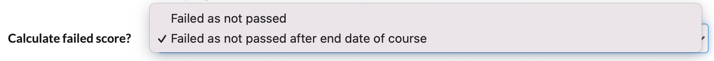

# Course Element "Structure"

## Profile

Name | Structure
---------|----------
Icon | { class=size24 }
Available since | Release 1
Functional group | Knowledge transfer
Purpose | Structuring of the menu into chapters, collection of assessments of all course elements subordinate to the structure element
Assessable | yes
Specialty / Note | 

The course element Structure is primarily used to structure the course. By default, it provides an automatic overview of all course elements subordinate to it with their short titles, titles and descriptions. Use this course element to structure your course content and/or clearly separate modules.

The concrete setting options depend on whether the course element is used in conventional or in learning path courses.

 **Tabs in learning path courses**

 ****

 **Tabs in conventional courses**

 ****

For more information on the general tabs "Title and Description", "Layout" and "Visibility" and "Access", see [here](../learningresources/General_Configuration_of_Course_Elements.md)

## Tab Overview

You can choose between four display modes for the course element "Structure" in the tab Overview and thus generate an automatically generated overview, integrate your own HTML page or simply display the first subordinate course element.

  * If you select the radio button _«Automatic overview»_, a list of the subordinate course elements generated by OpenOlat will be displayed. You can additionally select whether all or only certain course elements are displayed and whether the display should be in one or two columns.
  * By selecting the radio button _«Automatically generated overview incl. preview»_  the subordinate course elements will be displayed along with a preview. The exact preview varies depending on the course element. The configuration options for this setting are similar to those for the automatic overview. Furthermore, it can be set whether the preview refers to all course elements or only to structure elements. However, the user does not see a preview for course elements to which he does not (yet) have access.
  * If you select the radio button  _«Your HTML page»_, you can select an HTML page from the storage folder, create a new HTML file or import a suitable file. 
  * If you select the radio button _«No overview, activate first visible child node»_, the first visible subordinate course element will be displayed instead of an overview. In addition, the tab "Display content" will then appear and further specific settings for HTML pages can be made.

 **Display in two columns**: Please select the check box  _Display in two columns_  to display the automatically generated table of contents or the preview in two columns.

!!! info "Info"

    If you have chosen your own HTML page and this contains links to graphics or other files stored in OpenOlat, you must select the option "Allow links in the entire storage folder" under "Security settings". You can also allow coaches to edit the HTML page without access to the course editor.

##  Tab Highscore

Here you can activate and configure the high score display. You can display a congratulation title, a winner's podium, a histogram as well as a highscore list. An anonymized representation is also possible here.

Auch hier ist eine anonymisierte Darstellung möglich. It also contains the tab "[Reminders](../learningresources/Course_Reminders.md)" and can neither be deleted nor moved.

## Special settings of the course element structure depending on the course type

## Settings for conventional courses

### Tab Score   {: #score}

The course element structure is also useful to add up points collected in other assessable OpenOlat course elements (e.g. _assessment_, _group/assignment, SCORM learning content, checklist, LTI page, portfolio task_, _test_ ) and display a pass/fail. The summarized results appear when you click on the course element _Structure_ in the current course.

The following settings are possible:

 **Calculate score?**: An overview of the assessable elements of your course will appear, which you can take into account when calculating the points. Select either all or specific course elements and OpenOlat adds the respective points. It is also possible to calculate an average value instead of a total. This makes sense, for example, if all course elements have the same maximum number of points. Course elements that do not (yet) contain a rating are not taken into account in the calculation. The calculated value is displayed to the user after the evaluation under "Score".

 **Calculate passing score?:** Pass or fail can refer to a minimum score that you define or to passing selected or all assessable course elements.
 If you select  _«As of minimum score»_ , you can enter the minimum score in another field. This refers to the course elements selected above, i.e. on the course element  _Structure_  a _«Passed»_  is displayed, if the total score is greater or equal to the selected minimum score. 
 
 If you select _«Adopt from course element»_, assessable course elements of your course are displayed by means of  **Passed by**. You can now select those whose "passed" value should result in the "passed" value of the course element  _Structure_ with a boolean AND-link. I.e. if the course element _Structure_  should show a  _«Passed»_, all selected course elements have to have a  _«Passed»_.

 **Calculate failed score?:**  It is also possible to calculate "Failed".

  * As long as the conditions for passed are not reached, the structure is shown as "Failed". 
  * As long as the conditions for passed are not reached _and_ the end date of the course is reached, the structure is shown as "Failed". If the conditions for "passed" have already been fulfilled before the end of the course, passed is already displayed during the course duration.

If certificates of achievement are to be issued for a course, it is necessary to adjust the settings in the "Score" tab accordingly.

In case you wish to utilize an evidence of achievement or be able to check the Passed status in the Coaching tool, you must check the option  **Calculate passing score?**  in the course root node.

Use distinct short titles for all of your assessable course elements to be able to clearly distinguish them in the tab "Score."

The course element "Structure" and thus its subordinate course elements can be protected with a password.

On the top course element no password can be stored in the tab "Access". To do this, open the "Access" tab and set the password there under "Password".

On the top course element no password can be stored in the tab "Access".

## Settings for learning path courses

The settings in the tab "Learning path" basically differ from the settings in other course elements. For learning path courses, the course element structure defines whether the sequence of learning steps is sequential (one after the other) or not. There is no specific completion criterion for structure elements.

  

