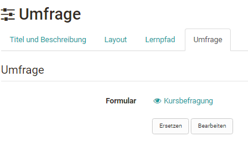

# Kursbaustein "Umfrage" {: #course_element_survey}

## Steckbrief {: #profile}

Name | Umfrage
---------|----------
Icon | { class=size24  }
Verfügbar seit | 
Funktionsgruppe | Wissensüberprüfung
Verwendungszweck | Kursbaustein zur Integration der Lernressource "Formular"
Bewertbar | nein
Spezialität / Hinweis |

Mit dem Kursbaustein "Umfrage" fügen Sie Ihrem Kurs einen Online-Fragebogen hinzu. Als Basis wird die Lernressource "Formular" verwendet und mit dem Kursbaustein Umfrage verknüpft. Die Resultate einer Umfrage werden standardmässig anonymisiert gespeichert.

Wenn Sie noch kein Formular für Befragungen erstellt haben, schauen Sie im [How-to Bereich](../../manual_how-to/create_a_form/create_a_form.de.md)  nach, wie Sie Formulare für Ihre Umfrage erstellen können. 

!!! note "Hinweis"

    Ein in einem Kurs verlinktes Formular kann nur solange vollständig im "[Formular-Editor](../learningresources/Form_Editor.de.md)" bearbeitet werden, solange die Seite nicht aufgerufen wurde. Danach können nur noch Tippfehler korrigiert werden. 

!!! note "Achtung"

    Wenn Teilnehmende aktuell die Umfrage ausführen, jedoch noch nicht abgeschlossen haben, gehen deren Resultate verloren.

Eine Übersicht über weitere Informationen rund um das Thema "Formulare" finden Sie [hier](../learningresources/Form.de.md). 

## Formular in Umfragen {: #forms_in_surveys}

Die Lernressource Formular wird im Kursbaustein "Umfrage" in Form eines Fragebogens verwendet. Kursbesitzer:innen können so Fragebögen in ihren Kurs einbinden und Lernende können die bereitgestellten Umfragen ausfüllen. Die Ergebnisse werden den Kursbesitzenden und Betreuenden, dann entsprechend angezeigt.

OpenOlat stellt sicher, dass Kursteilnehmende die Umfrage bzw. den Fragebogen nur einmal ausfüllen können. Die Resultate werden standardmässig anonymisiert gespeichert. Eine Personalisierung ist jedoch durch die Auswahl der passenden Formular Elemente [Formular Editor](../learningresources/Form_Editor.de.md) möglich.

### Im Kurseditor {: #course_editor}

Gehen Sie in den Kurseditor und fügen Sie den Kursbaustein Umfrage hinzu. Nachdem Sie den Kursbaustein Umfrage dem Kurs hinzugefügt haben stehen Ihnen im Kurseditor folgende Tabs zur Verfügung:

{ class="shadow lightbox" }

Im Tab "Titel und Beschreibung" sowie "Layout" können allgemeine Beschreibungen und Informationen zum jeweiligen Kursbaustein hinterlegt und die optische Darstellung definiert werden. Im [Tab Lernpfad](../learningresources/Learning_path_course_Course_editor.de.md) werden spezielle Einstellungen die für Lernpfad Kurse gelten definiert, z.B. kann als Erledigungskriterium "Umfrage teilgenommen" gewählt werden.

Klassische bzw. herkömmliche Kurs verfügen dagegen über die Tabs Sichtbarkeit und Zugang. Hier wird definiert, wer den Kursbaustein sehen bzw. bearbeiten kann.

#### Tab "Umfrage" {: #survey}

Die zentrale Konfiguration erfolgt im Tab "Umfrage". Hier wird im ersten Schritt entweder ein neues Formular erstellt oder ein existierendes ausgewählt. In der erscheinenden Übersicht werden alle Formulare, bei denen man Besitzer:in ist, angezeigt und können einfach per Klick auf den Haken ausgewählt und so dem Kurs hinzugefügt werden.

{ class="shadow lightbox" }

Hat man noch kein Formular erstellt, kann eine neue Lernressource Formular über den Button "Erstellen" erstellt oder ein extern vorliegendes Formular importiert werden. Anschliessend erscheint das gerade angelegte oder importierte Formular ebenfalls in der Liste und kann ausgewählt werden.

Ein neu erstelltes Formular beinhaltet zunächst noch keine Elemente, Fragen oder Textfelder. Diese müssen im Kurs über "Bearbeiten" oder alternativ direkt in der Lernressource im [Formular Editor](../learningresources/Form_Editor.de.md) hinzugefügt werden.

Wenn ein Formular direkt im Kurseditor erstellt wird, wird automatisch eine neue Lernressource Formular angelegt, die auch im [Autorenbereich](../area_modules/Authoring.de.md) unter "Meine Einträge" zu finden ist und in weiteren Kursen eingebunden werden kann.

Nachdem ein Formular ausgewählt wurde kann es über den Link "Bearbeiten" gestaltet werden. Wurde das Formular schon vorher passend eingerichtet ist eine Bearbeitung nicht mehr notwendig. 

{ class="shadow lightbox" }

!!! warning "Achtung"

    Sobald ein Formular von mindestens einem Teilnehmenden angesehen wurde, kann es nicht mehr ersetzt werden. Der Button "Ersetzen" entfällt dann. Wenn nötig muss ein neuer Kursbaustein "Umfrage" angelegt und das gewünschte Formular eingebunden werden. 

Im Bereich "Berechtigungen" des Tabs "Umfrage" können Sie festlegen, wer die Umfrage ausfüllen und wer die Ergebnisse der Umfrage einsehen darf. Folgende Optionen stehen jeweils zur Auswahl:

* die Besitzer:innen des Kurses
* die Betreuer:innen des Kurses
* die Teilnehmer:innen des Kurses: Alle Personen die in der Rolle "Teilnehmer:in" in den Kurs eingetragen sind
* Gäste: Personen ohne OpenOlat-Account

Aktiviert man die erweiterte Konfiguration, können noch weitere Einstellungen vorgenommen werden, z.B. bestimmte Zeiträume der Teilnahme für bestimmte Rollen definiert werden und die Teilnahme durch bestimmte Gruppen festgelegt werden.

Auch die Ergebnisse können für all diese Gruppen frei gegeben und in der erweiterten Konfiguration mit einem Beginn und Ende Datum verbunden werden.

!!! tip "Tipp"

    Voraussetzung für die Bearbeitung der Umfrage ist jedoch, dass der gesamte Kurs auch für die jeweilige Personengruppe freigegeben ist. Soll also beispielsweise eine Umfrage auch von externen Personen (Gästen) ausfüllbar sein, muss auch der Kurs ein Zugangs-Angebot für Gäste beinhalten > [Freigabe](../learningresources/Access_configuration.de.md). Beachten Sie, dass eine Kursfreigabe für Gäste nur bei klassischen bzw. herkömmlichen Kursen möglich ist, nicht bei Lernpfad-Kursen.

Wird ein Formular als Umfrage in einem Kurs eingebunden, kann das Formular im Kurs über den Button "bearbeiten" eingeschränkt geändert werden. Texte können geändert aber einzelne Blöcke nicht mehr verschoben oder neue Bereiche angelegt oder gelöscht werden. Im Formular erscheint die Meldung "Die Ressource wird bereits verwendet...".

### Ansicht {: #view}

Was Besitzer:innen, Betreuer:innen und Teilnehmende bei geschlossenem Editor sehen ist davon abhängig welche Benutzerberechtigungen im Tab Umfrage ausgewählt wurden. Hat die jeweilige Personengruppe das Recht den Fragebogen auszufüllen (Teilnahme durch...), dann sieht sie als erstes auch den jeweiligen Fragebogen.  Sobald die Person aber selbst den Fragebogen ausgefüllt hat, erscheint die Fragebogen Statistik Übersicht direkt bei dem jeweiligen Umfrage Baustein, sofern für die Benutzergruppe auch die Anzeige der Resultate freigegeben ist.

{ class="shadow lightbox" }

Ist eine Personengruppe (z.B. Teilnehmende) berechtigt die Umfrage auszufüllen aber nicht berechtigt die Ergebnisse zu sehen, erscheint *nach* dem Ausfüllen die Meldung:

{ class="shadow lightbox" }

Die Umfrage kann nur einmal ausgefüllt und nach dem abschicken nicht mehr geändert werden. Der User sieht eine entsprechende Information. Soll der Fragebogen noch nicht direkt abgeschickt werden, kann die Option "Zwischenspeichern" verwendet werden.

Ist eine Personengruppe weder berechtigt den Fragebogen auszufüllen noch die Resultate zu sehen, erscheint die Meldung "Kein Zugang".

### Ansicht der Resultate einer Umfrage {: #view_survey_results}

Folgende Auswertungstabs stehen den Berechtigten zur Verfügung:

**Übersicht**: Hier erfährt man wie viele Personen den Fragenbogen ausgefüllt haben, den Abgabezeitraum sowie die Bearbeitungsdauer. Je nach Fragetyp werden auch noch weitere Kennzahlen aufgeführt.

**Tabellen**: Hier sehen Sie die einzelnen Fragen und Antworten sowie bei Rubriks weitere statistische Auswertungen. Freitexte können zusätzlich als Excel Tabelle heruntergeladen werden.

**Diagramme**: Im Tab Diagramme sehen Sie eine grafische Darstellung der einzelnen Fragen

**Einzelne Formulare**: Hier hat man Zugriff auf die gesamten ausgefüllten, anonymen Fragebogen einzelner Personen.  
  
Ferner können die Inhalte aller 4 Tabs auch ausgedruckt oder als Excel Tabelle oder als PDF-Version heruntergeladen werden.

**Weitere Bereiche für die Ansicht der Ergebnisse**

Dieselbe Auswertung finden Sie übrigens auch im Menü `Administration > Fragebogen Statistiken`.

Die Ergebnisse können auch als Teil der [Kursarchivierung](../learningresources//Course_Archiving.de.md) gespeichert werden. Dabei ist es sogar möglich die Ergebnisse mehrere Kursbausteine in einem zip file zu bündeln.

### Umfragen zurücksetzen {: #reset surveys}

Kursbesitzer:innen können schon ausgefüllte Fragebögen auch über den Link im 3-Punkte Menü des jeweiligen Kursbaustein "Zurücksetzen". In diesem Fall werden alle bereits eingereichten Fragebögen für diese Umfrage gelöscht. Ein Zurücksetzen von einzelnen Fragebögen ist nicht möglich, da die Abgabe anonym erfolgt.

{ class="shadow lightbox" }

Ferner können die Inhalte aller 4 Tabs auch ausgedruckt oder als Excel Tabelle oder als PDF-Version heruntergeladen werden.
