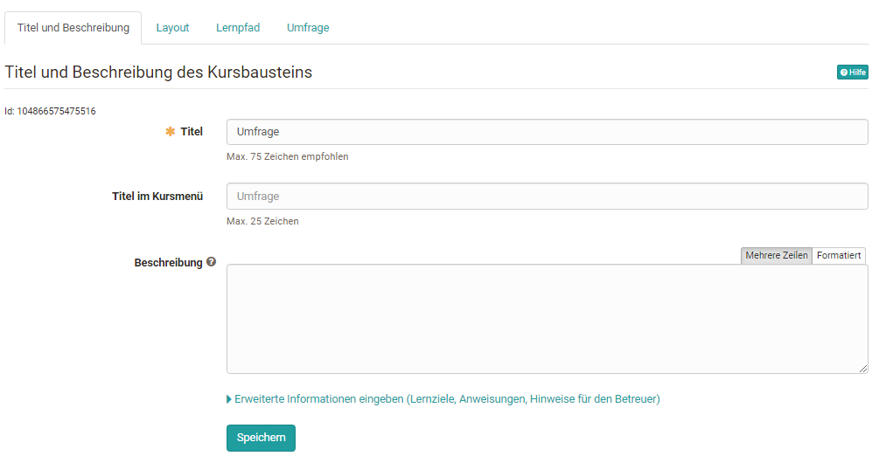
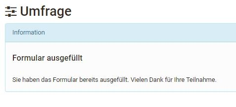

# Course Element "Survey" {: #course_element_survey}

## Profile

Name | Survey
---------|----------
Icon | { class=size24 }
Available since | 
Functional group | Assessment
Purpose | Course element for integration of learning resource "form"
Assessable | no
Specialty / Note | 

With the course element "Survey" you can add an online questionnaire to your course. The learning resource "Form" is used as a basis and linked to the course element Survey. If you have not yet created a questionnaire, follow the instructions in chapter "[3 steps to your questionnaire](../forms/Three_Steps_to_your_Form.md)". By default, the results are stored anonymously. 

A formular linked in a course can only be edited completely in the "[Form editor](../learningresources/Form_editor_Questionnaire_editor.md)" as long as the page has not been opened. After that only typing errors can be corrected.

!!! Note "Attention"

    If participants are currently running the questionnaire but have not yet completed it, their results will be lost.

Further information on the subject of questionnaires and surveys can be found in the chapter "[Forms](../learningresources/Form.md)" and the corresponding subchapters.

## Forms in surveys

The learning resource form is used in the course element "Survey" in the form of a questionnaire. Course owners can thus include questionnaires in their course and learners can complete the surveys provided. The results are displayed to the course owners and coaches then accordingly.

OpenOlat ensures that course participants can only fill out the survey or questionnaire once. The results are stored anonymously by default. However, personalization is possible by selecting the appropriate form elements [Form Editor](../learningresources/Form_editor_Questionnaire_editor.md).

You can learn how to create forms and integrate them into courses [here](../forms/Three_Steps_to_your_Form.md).

### Course editor

Go to the course editor and add the course element Survey. After you have added the course element Survey to the course, the following tabs will be available in the course editor:

{ class="shadow lightbox" }

In the tab "Title and description" as well as "Layout" general descriptions and information about the respective course element can be stored and the visual presentation can be defined. In the [Tab Learning path](../learningresources/Learning_path_course_Course_editor.md) special settings are defined, which are valid for learning path courses, e.g. "Survey participated" can be selected as completion criterion.

Conventional courses, on the other hand, have the Visibility and Access tabs. Here you define who can see or edit this course element.

#### Tab "Survey"

The central configuration is done in the "Survey" tab. Here, in the first step, either a new form is created or an existing one is selected. In the overview that appears, all forms for which one is the owner are displayed and can be selected simply by clicking on the checkmark and thus added to the course.

{ class="shadow lightbox" }

If you have not yet created a form, you can create a new learning resource form using the "Create" button or import an existing external form. Subsequently, the form just created or imported also appears in the list and can be selected.

A newly created form does not yet contain any elements, questions or text fields. These must be added in the course via "Edit" or alternatively directly in the learning resource in the [Form Editor](../learningresources/Form_editor_Questionnaire_editor.md).

If a form is created directly in the course editor, a new learning resource Form is automatically created, which can also be found in the [Authoring area](../area_modules/Authoring.md) under "My entries" and can be included in further courses.

After a form has been selected, it can be designed via the "Edit" link. If the form has already been set up appropriately, editing is no longer necessary.

{ class="shadow lightbox" }

Then you can define who can fill in the survey and who can see the results of the survey. The following options can be selected:

* the Owner of the course
* the Coach of the course
* the Participants of the course: All persons who are registered in the role "Participant" in the course.
* Guests: Persons without OpenOlat account

If you activate the advanced configuration, you can make even more settings, e.g. define certain periods of participation for certain roles and specify participation by certain groups.

Also the results can be released to all these groups and associated with a start and end date in the advanced configuration.

!!! tip "Hint"

    However, a prerequisite for processing the survey is that the entire course is also released for the respective group of people. For example, if a survey is to be fillable by external persons (guests) as well, the course has to be "open without booking" for guests in the menu "Settings" > [Share](../learningresources/Access_configuration.md)

If a form is included as a survey in a course, the form can be modified in a limited way in the course via the "edit" button. Texts can be changed but individual blocks can no longer be moved or new areas can be created or deleted. The message "The resource is already used..." appears in the form.

!!! warning "Attention"

    Once a form has been viewed by at least one participant, it can no longer be replaced. The "Replace" button is then omitted.

### View

What owners, coaches and participants see when the editor is closed depends on what user permissions are selected in the Survey tab. If the respective group of persons has the right to fill in the questionnaire (participation by...), then they will see the respective questionnaire first. As soon as the person has filled out the questionnaire, the questionnaire statistics overview appears directly at the respective survey module, provided that the results are also visible for the user group.

{ class="shadow lightbox" }

If a group of people (e.g. learners) is authorized to fill in the survey but not authorized to see the results, this message will appear after filling in:

{ class="shadow lightbox" }

The survey can be filled out only once and cannot be changed after it has been submitted. The user will see a corresponding information. If the questionnaire is not to be sent directly, the option "Save temporarily" can be used.

If a group of persons is neither authorized to fill in the questionnaire nor to see the results, the message "no access" appears.

### View the results of a survey

The following evaluation tabs are available for the authorized persons:

**Overview**: Here you can find out how many people have completed the questionnaire, the submission period and the processing time. Depending on the question type, other key figures are also listed.

**Tables**: Here you can see the individual questions and answers as well as further statistical evaluations for rubrics. Free texts can also be downloaded as an Excel table.

**Diagrams**: In the Diagrams tab you can see a graphical representation of the individual questions

**Individual questionnaires**: Here you have access to the entire completed, anonymous questionnaires of individual persons.

Furthermore, the contents of all 4 tabs can also be printed or downloaded as an Excel spreadsheet or as a PDF version.

The same evaluation can be found in the menu `Administration > Questionnaire statistics`.

The results can also be saved via the menu "[Data archiving](../learningresources/Using_Course_Tools.en.md)" > "Surveys". This is the same file as under "Export" in the course run.

### Reset surveys

Course owners can also "Reset" already completed questionnaires via the link in the 3-point menu of the respective course element. In this case, all questionnaires already submitted for this survey will be deleted. It is not possible to reset individual questionnaires, as the submission is anonymous.

{ class="shadow lightbox" }

Furthermore, the contents of all 4 tabs can also be printed or downloaded as an Excel spreadsheet or as a PDF version.
