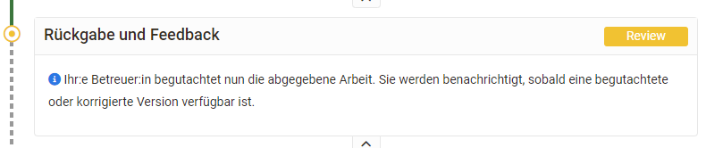
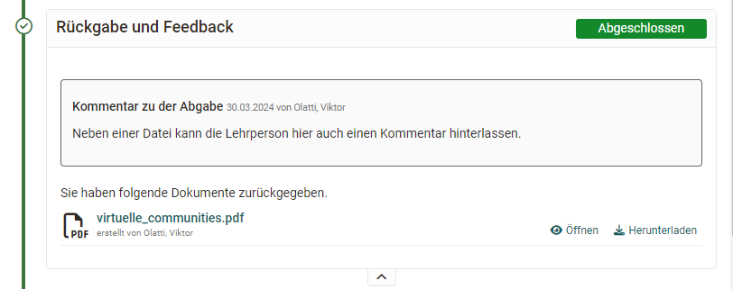
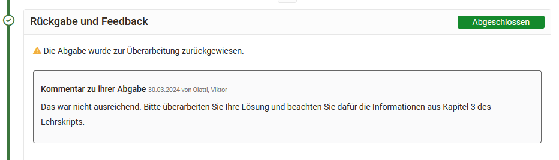
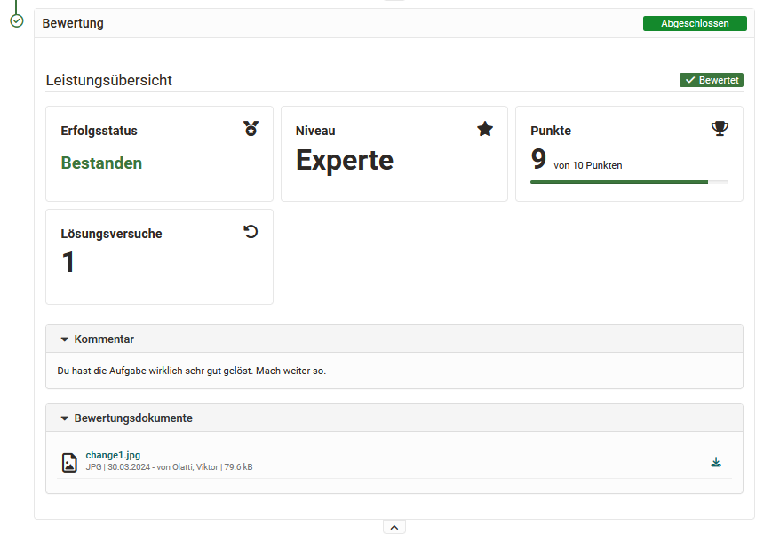

# Kursbaustein "Aufgabe" {: #course_element_task}

## Steckbrief

Name | Aufgabe
---------|----------
Icon | { class=size24  }
Verfügbar seit | Neuauflage mit Release 10.3
Funktionsgruppe | Wissensüberprüfung
Verwendungszweck | Abbildung komplexer Aufgabenworkflows mit konfigurierbaren Teilschritten wie Abgabe von Lösungsdokumenten, Feedback und Überarbeitungsschlaufe, Bereitstellung der Musterlösung und Bewertung
Bewertbar | ja
Spezialität / Hinweis | auch als [Gruppenaufgabe](../learningresources/Course_Element_Grouptask.de.md) verfügbar

## Allgemeines

Mit Hilfe des Kursbausteins Aufgabe können Lehrende **Dateiabgaben** und **Einsendeaufgaben** organisieren. Lernende laden dabei ihre Einreichungen in den OpenOlat Kurs hoch und erhalten vom Lehrenden ein Feedback bzw. eine Bewertung. Ebenso können Überarbeitungen eingefordert oder Musterlösungen bereitgestellt werden.

Die Konfiguration des Kursbausteins erfolgt wie bei allen Kursbausteinen im Kurseditor.

## Überblick der Kursbaustein Tabs

* **Tab Workflow**: Starten Sie die Konfiguration in diesem Kursbaustein und wählen Sie die Funktionen aus, die Sie benötigen. Anschliessend sind die passenden Tabs aktiv und können weiter konfiguriert werden
* **Tab Aufgabenstellung**: Hier hinterlegen Sie Ihre Aufgabenstellung. 
* **Tab Abgabe**: Hier definieren Sie Art und Umfang der Einsendemöglichkeiten für die Teilnehmenden. 
* **Tab Rückgabe und Feedback**: Legen Sie die minimale und maximale Anzahl von Dokumenten fest, die die Teilnehmenden während der Schritte "Rückgabe und Feedback" und "Überarbeitung" abgeben dürfen.
* **Tab Musterlösungen**: Hinterlegen Sie hier Ihre Musterlösung. 
* **Tab Bewertung**: Konfigurieren Sie die Art der Bewertung und definieren Sie z.B. z.B. ob und wie viele Punkte vergeben werden, es ein bestanden/nicht bestanden gibt und ob individuelle Feedbacks vergeben werden können.
* **Tab HighScore**: Sofern für die Aufgabe Punkte vergeben werden können Sie diese mit den HighScore-Optionen weiter visualisieren. 
* **Tab Erinnerungen & To-dos**: Mit der Erinnerungsfunktion können Sie Erinnerungen in Form einer E-Mail an Kursmitglieder versenden und automatische To-dos für die Aufgabe generieren. To-dos werden den Kursteilnehmenden im persönlichen Menü unter "To-dos" hinterlegt. 

Die Tabs "Titel und Beschreibung" sowie "Layout" finden sich bei allen Kursbausteinen. Hier können Sie Informationen zum Kursbaustein hinterlegen und die Darstellung konfigurieren. 

Darüber hinaus verfügen Lernpfad Kurse noch über den Tab "Lernpfad" bzw. Herkömmliche Kurse über die Tabs "Sichtbarkeit" und "Zugang".

!!! info "Hinweis"

    Die Funktionsweise und der Aufbau der Kursbausteine "Aufgabe" und "[Gruppenaufgabe](../learningresources/Course_Element_Grouptask.de.md)" sind identisch.

## Konfigurationen

Im Folgenden werden die einzelnen Tabs für den Kursbaustein Aufgabe näher erläutert.

### Tab "Workflow“  {: #workflow}

Der Tab Workflow ist der zentrale Tab zur Konfiguration des Kursbausteins Aufgabe. Hier wird definiert welche einzelnen Elemente der Aufgabe überhaupt benötigt werden. 

Soll eine konkrete Aufgabenstellung im Kursbaustein hinterlegt werden oder findet der User die Aufgabe vielleicht woanders? Soll der User ein Dokument abgeben? Soll es ein Feedback vom Lehrenden geben? Sollen die User, wenn notwendig, die Möglichkeit zur Überarbeitung einer Einsendung erhalten können? Soll eine Musterlösung bereitgestellt werden? Soll eine Bewertung mit Punkten oder bestanden möglich sein? Sollen bestimmte Lernende von bestimmten Betreuenden bewertet werden?

Aktivieren Sie einfach die Dinge die Sie benötigen und konfigurieren Sie im nächsten Schritt die dafür relevanten Tabs.

Die Abschnitte Aufgabenstellung, Abgabe, verspätete Abgabe und Musterlösung können mit einem Datum versehen werden. Aufgabenstellung und Abgabe sind bis zum eingetragenen Datum verfügbar. 

Wird die verspätete Abgabe aktiviert und ein Termin hinterlegt können Teilnehmende noch bis zum verspäteten Termin ihre Lösung einreichen. Für den User wird sowohl der normale Abgabetermin als auch der verspätete Termin angezeigt bzw. die Termine die noch in der Zukunft liegen. Die verspätete Abgabe wird dem Betreuer bzw. Kursbesitzer im Bewertungsflow ebenfalls angezeigt.

Eine Musterlösung kann für alle Teilnehmenden oder nur diejenigen, die die Aufgabe bearbeitet haben, ab dem eingetragenen Datum bereitgestellt werden.
Sind Musterlösungen aktiviert, kann hier auch definiert werden, ob Betreuer Dokumente hinzufügen und bearbeiten dürfen.

Statt Kalenderdaten einzutragen können Sie auch mit _relativen Daten_ arbeiten. Legen Sie fest wie viele Tage nach dem ersten Kursbesuch oder der Buchung die Aufgabenstellung geöffnet bleibt. Alle eingestellten Zeitvorgaben können auch individuell angepasst werden, z.B. wenn ein Lerner aufgrund bestimmter Umstände eine Verlängerung benötigt. Dies gilt für alle Prozessschritte. Wenn Sie das Abgabedatum verlängern, wird die Aufgabe neu eröffnet. Auch ein Datum für eine verspätete Abgabe ist möglich.

Im Bereich "Betreuung" des Tabs Workflow kann eine teilnehmerabhängige Betreuung aktiviert und konfiguriert werden.

Die differenzierte Zuordnung der Personen erfolgt allerdings bei geschlossenem Kurseditor.

!!! warning "Achtung"

    Nachträgliche Änderungen am Workflow wirken sich auf alle Teilnehmenden aus, auch wenn diese den Workflow bereits begonnen haben.

    Bei Änderungen am Workflow, z.B. dem Entfernen der Aufgabenstellung, wird bei allen Teilnehmenden des Kurses dieser Bestandteil des Workflows entfernt. Die Information über bereits gewählte Aufgaben ist dann nicht mehr sichtbar. Wird der Bestandteil des Workflows wieder eingefügt, ist diese Information aber wieder zugänglich.

    Wird jedoch z.B. die Aufgabenstellung nachträglich hinzugefügt und ein Teilnehmer ist in ihrem persönlichen Workflow bereits weiter fortgeschritten, so muss nachträglich keine Aufgabe mehr ausgewählt werden.  

### Tab "Aufgabenstellung“  {: #assignment}

Sofern im Tab "Workflow" die  "Aufgabenstellung" aktiviert wurde können Sie diese nun bereitstellen. 

 **a) Dateien hochladen**

Ausserhalb von OpenOlat erstellte Aufgaben können als Datei hochgeladen werden. Auch kann eine Zip-Datei mit mehreren (verschiedenen) Aufgaben hochgeladen und jede Datei mit einem passenden Titel und einer Beschreibung versehen werden.

**b) Dateien unterschiedlicher Formate erstellen**

Dateien können auch direkt in OpenOlat erstellt werden. Welche Formate genau zur Verfügung stehen hängt davon ab welche von der OpenOlat Administration aktiviert wurden. In der Regel steht mindestens ein HTML-Editor zur Verfügung. Aber auch die Erstellung von Word, Excel, PowerPoint sowie seit :octicons-tag-24: Release 18.1.  Diagrammen oder Whiteboards sind möglich. Zusätzlich können eine spezifische Video- und ab :octicons-tag-24: Release 18.1. auch eine Audio-Aufgabe erstellt werden. 

Wird eine Aufgabe mit dem internen HTML-Editor erstellt, können Sie ebenfalls mehrere Dateien (z.B. Bilder oder PDFs) zur Verfügung stellen, in dem Sie diese im HTML-Editor hochladen und dann in der HTML-Seite verlinken bzw. direkt anzeigen. So erstellte Aufgaben werden von den Benutzern dann im .zip Format heruntergeladen. Wird der HTML-Editor verwendet, wird automatisch der hinterlegte Titel auch als Dateiname übernommen. Dies kann aber jederzeit wieder geändert werden.

!!! info "Mehrere Dateien"

    Bitte beachten: Werden mehrere Dateien im Tab Aufgabenstellung hinterlegt, werden diese als mehrere verschiedene Aufgabenstellungen betrachtet. Es handelt sich _nicht_ um eine Aufgabe mit mehreren ergänzenden Dateien.
    
Im Feld "Art der Zuweisung" bestimmen Sie, ob einem Kursteilnehmer alle zur Verfügung stehenden Aufgaben zur Auswahl angeboten werden, oder ob ihm eine Aufgabe automatisch per Zufallsauswahl zugewiesen wird.

Wählen Sie im Feld "Typ der Ziehung", ob mehrere Kursteilnehmende die gleiche Aufgabe lösen können, oder ob jeder Kursteilnehmer bzw. Kursteilnehmerin eine andere Aufgabe lösen soll. Wenn die Aufgabe manuell gewählt wird, können Sie im Feld "Vorschau" weiter festlegen, ob die Kursteilnehmenden vor der Wahl einer Aufgabe diese einsehen dürfen. Wenn bei "Typ der Ziehung" jeder Kursteilnehmer eine andere Aufgabe lösen soll, müssen mindestens so viele Aufgaben hinterlegt werden, wie es Kursteilnehmende gibt, die diese Aufgabe lösen sollen.

!!! info "Tipp"

    Wenn der Kursbaustein nur _eine_ Aufgabe beinhaltet ist eine manuelle Wahl wenig sinnvoll. Nutzen Sie in diesem Fall am besten die automatische Zuweisung.

Im Feld "Mitteilung an Benutzer" können Sie für alle Kursteilnehmenden allgemeine Hinweise zur Bearbeitung der Aufgaben formulieren.

Wählt ein Kursteilnehmer bei der manuellen Auswahl aus versehen die falsche bzw. nicht gewollte Aufgabenstellung, kann die Wahl vom Kursbesitzer im [Bewertungswerkzeug](../learningresources/Assessment_tool_overview.de.md) zurückgesetzt werden.

Es folgt keine automatische Änderung. Der Teilnehmer erhält nun aber die Möglichkeit seine bisherigen Schritte wieder rückgängig zu machen.

### Tab "Abgabe“  {: #submission}

Hier legen Sie fest wie und in welchem Umfang Kursteilnehmende Dokumente bzw. Bearbeitungen abgeben können.

Zur Auswahl stehen: 

**"Dokumente hochladen"**: In diesem Fall können Kursteilnehmende außerhalb von OpenOlat erstellte Dokumente hochladen und abgeben. 

**"Abgabe mit OpenOlat Editor"**: Mit dieser Auswahl können Teilnehmende die Erstellung von Dokumenten direkt im Kursbaustein vornehmen. Ein HTML-Editor kann dafür standardmässig verwendet werden. Sind weitere Dokument Editoren in OpenOlat eingebunden, können auch Dokumente in weiteren Formaten wie Word, Excel usw.  erstellt werden. 

**Videoaufnahmen zulassen**: In diesem Fall können Lernende Videoaufnahmen per Webcam zu erstellen und abgeben. Auch eine maximale Aufnahmedauer sowie eine Qualitätsstufe kann für die Videos gewählt werden. 

**Audioaufnahmen zulassen**: Hier erhält der User die Möglichkeit direkt in OpenOlat eine Tonaufnahme zu erstellen und einzureichen. (Seit :octicons-tag-24: Release 18.1.)

!!! info "Hinweis"

    Audio- und Videoaufnahmen müssen immer mit einer der Optionen "Dokumente hochladen" oder "Abgabe mit OpenOlat Editor" kombiniert werden. 

Aktivieren Sie **"Aufgabe ist Vorlage für die Abgabe"**, wenn die Lernenden die hinterlegte Aufgabendatei als Basis für ihre Bearbeitung nutzen sollen, beispielsweise wenn die Aufgabenstellung eine auszufüllende vorstrukturierte Tabelle beinhaltet. Voraussetzung ist, dass diese Option von den OpenOlat Administrationen freigeschaltet wurde.

Darüber hinaus können Sie auch die minimale und maximale Anzahl von Dokumenten für die Abgabe definieren. Lassen Sie das Feld bei "Max. Anzahl von Dokumenten" frei, wenn Sie die Anzahl der Dokumente nicht einschränken möchten. Sollen zwingend mehrere Dokumente abgegeben werden können Sie auch die Mindestanzahl von Dokumenten erhöhen.

Aktivieren Sie die E-Mail Bestätigung damit Personen, die eine Aufgabe abgegeben haben eine entsprechende E-Mail erhalten. Der vorformulierte E-Mailtet kann bei Bedarf weiter angepasst werden. 

### Tab "Rückgabe und Feedback"  {: #revisions}

In diesem Tab kann die minimale und maximale Anzahl von Rückgabedokumenten definiert werden.

### Tab "Bewertung“  {: #grading}

Hier definieren Sie _wie_ die Lernenden bewertet werden sollen. Soll es Punkte geben? Soll es ein bestanden/nicht bestanden für den Kursbaustein geben? Soll die Punktebewertung mit einer Bewertungsskala verbunden werden? Wenn ja, mit welcher? Sollen weitere individuelle Kommentare oder Dokumente bereitgestellt werden können? Entscheiden Sie jeweils was für Ihr Szenario passend ist.

#### Punkte vergeben  

Wenn die Punktevergabe aktiviert wurde müssen die minimale und die maximale Punktzahl angegeben werden. Zusätzlich können Sie dann auch die Option "Bewertung mit Einstufung/Noten" wählen und weiter konfigurieren. So können den jeweiligen Punkten bestimmte Bewertungsskalen wie Level, Noten, (Kompetenz-)Stufen oder Label zugeordnet werden. Die zur Verfügung stehenden Bewertungsskalen werden vom OpenOlat Administrator definiert und können über den Button "Bewertungsskala bearbeiten" ausgewählt sowie die Punkte im Detail angepasst werden. Ferner muss definiert werden ob die Zuordnung zur berechneten Einstufung manuell durch den Betreuer erfolgt oder automatisch bei Punktänderung angezeigt werden soll.

#### Bestanden/Nicht bestanden
Sofern aktiviert kann das Bestehen entweder manuell durch den Betreuer oder automatisch erfolgen. Für die automatische Bewertung müssen die Punktevergabe aktiviert und eine Punktschwelle für das Bestehen angegeben werden.

#### Bei Kurs-Bewertung berücksichtigen
Im Tab "Bewertung" kann auch definiert werden ob das Ergebnis des konkreten Aufgabenbausteins bei der Bewertung des gesamten Kurses inbegriffen ist oder ausgeschlossen werden soll.

#### Individuelle Feedbacks 
Optional können sie noch die Möglichkeit für individuelle Kommentare oder individuelle Bewertungsdokumente aktivieren, sodass Betreuende noch weitere flexible Rückmeldungsmöglichkeiten haben.

#### Hinweise
Wenn Sie die erweiterte Konfiguration aufklappen stehen noch weitere Konfigurationen zur Verfügung. Hier können Sie noch Hinweistexte für alle Lernenden und/oder für alle Betreuenden hinterlegen. 

### Tab "Musterlösung“ {: #sample}

Um allen Kursteilnehmenden eine Musterlösung zu den gestellten Aufgaben anzubieten, erstellen Sie entweder direkt die Musterlösung mit dem internen Editor, nehmen ein Video mit ihrer Webcam auf oder laden Dateien mit den Musterlösungen hoch. 

Die Musterlösung ist erst sichtbar, wenn die vom Teilnehmer eingereichten Dokumente vom Betreuer akzeptiert wurden.

!!! Tip "Tipp"

    Sollen die Teilnehmenden vorab bereits Hilfestellungen zur Bearbeitung der Aufgabe erhalten, laden Sie diese zusammen mit der Aufgabenstellung als ZIP-Dokument hoch oder nutzen Sie die das Mitteilungsfeld (siehe Tab "Aufgabenstellung").

### Tab "HighScore"

Sofern für die Aufgabe im Tab "Bewertung" die Vergabe von Punkten aktiviert wurde kann auch der Tab Highscore konfiguriert werden. So kann definiert werden welche Elemente angezeigt werde, ob die Darstellung anonym sein soll und ab welchem Zeitpunkt die Highscore-Liste sichtbar sein soll.

Weitere Informationen zu diesem Tab, der in den meisten Assessment Kursbausteinen zur Verfügung steht, finden Sie [hier](../learningresources/Course_Elements.de.md).

### Tab "Erinnerungen & To-dos"

Erstellen Sie bei Bedarf für die Teilnehmenden [Erinnerungen](../learningresources/Course_Reminders.de.md). zur Bearbeitung des Kursbausteins. 

Wird die automatische Erstellung von To-dos aktiviert (ab :octicons-tag-24: Release 18.2.) sehen die Lernenden unter "Mein Kurs" -> To-dos den aktuellen Stand (Schritt) des Worklows der entsprechenden  und erkennen so rasch ob bzw. welche Aktionen aktuell von ihnen vorgenommen werden müssen. Darüber hinaus erscheinen diese To-dos auch bei den persönlichen To-dos der User in den persönlichen Werkzeugen. 

Die To-dos helfen also den Lernenden den Überblick über ihre Aufgaben zu behalten. 
Weitere Informationen zu To-dos finden Sie [hier](../basic_concepts/To_Dos_Basics.de.md).

!!! note "Hinweis"

    Ob auch Betreuende To-dos bearbeiten dürfen wird in den Einstellungen der Kurs-Administration definiert. Gehen Sie dafür in den Tab "Optionen" und aktivieren Sie den entsprechenden Haken.
    
    
### Tab "Lernpfad“ (nur für den Kurs-Typ Lernpfad)

Hier definieren Sie ob die Bearbeitung der Aufgabe obligatorisch oder freiwillig ist oder ob der Kursbaustein nicht angezeigt (Ausgenommen) werden soll. Obligatorische Aufgaben werden bei der Fortschrittsanzeige berücksichtigt, freiwillige nicht.

Das Freigabedatum kann verwendet werden, wenn der Kursbaustein erst zu einem bestimmten Datum geöffnet und gestartet werden soll. Der Baustein selbst wird aber bereits in der Kursstruktur angezeigt.

Die Zeitangabe unter "Zu bearbeiten bis" bezieht sich auf die Frist für das Abholen bzw. den Start des Kursbausteins Aufgabe, nicht auf den Abgabetermin für den Dateiupload (siehe Tab Workflow).

Bei der Bearbeitungszeit kann die geschätzte Zeit, die ein User für die Bearbeitung des Kursbausteins benötigt, eingetragen werden. Ein Eintrag ist vor allem relevant, wenn sich der Fortschritt im Kurs auf die Bearbeitungszeit der Kursbausteine bezieht (siehe Administration -> [Einstellungen](../learningresources/Course_Settings.de.md) -> Tab "Durchführung")

Im Tab "Lernpfad" wird auch definiert, welches Kriterium erfüllt sein muss, damit die Aufgabe als "erledigt" gilt. Folgende Optionen stehen zur Wahl:

{ class="shadow" }

* **Kursbaustein öffnen**: User hat auf den Kursbaustein geklickt.
* **Bestätigung durch den Benutzer**: User hat auf die Lesebestätigung geklickt.
* **Punkte**: Der User hat bei der Bearbeitung der Aufgabe mindestens die angegebene Punktzahl erreicht.
* **Bestanden**: Der User hat die im Tab "Bewertung" konfigurierten Anforderungen an "Bestanden" erfüllt bzw. die Aufgabe wurde manuell vom Betreuer auf bestanden gesetzt.
* **Durchführung erledigt**: Alle Schritte des Aufgabenflows wurden durchlaufen.

!!! info "Herkömmliche Kurse"

    Herkömmliche Kurse verfügen nicht über den Tab "Lernpfad" und haben stattdessen die Tabs "Sichtbarkeit" und "Zugang", inklusive Expertenmodus.

## Aufgaben aus der User-Perspektive

Der gesamte Flow einer Aufgabe zeigt sich für den User direkt im Kursbaustein, angefangen vom Abholen der Aufgabe, über die Einreichung bis zur finalen Bewertung, je nach Konfiguration des Kursbausteins. 

!!!in  "Tipp"

    Abonnieren Sie den jeweiligen Aufgabenbaustein um schnell per Mail über Änderungen informiert zu werden.

### Zugewiesene Aufgabe herunterladen

Je nach Konfiguration stehen im Schritt **"Zuweisung Aufgabenstellung"** eine oder mehrere Aufgaben zur Auswahl oder eine Aufgabe wird Ihnen automatisch zugewiesen. Wenn bei mehreren Aufgaben der Titel der Aufgabendatei verlinkt ist, können Sie die Aufgabenstellung vor der Auswahl ansehen. Wenn Sie nur die Schaltfläche "Wählen" haben, können Sie die Aufgabe nicht im Vorfeld ansehen. Eine automatische Zuweisung einer Aufgabe erfolgt direkt sobald Sie die Aufgabe vor Ablauf einer eventuellen Abgabedeadline anklicken.

Wenn Sie eine Aufgabe gewählt haben oder Ihnen eine Aufgabe automatisch zugewiesen wurde, klicken Sie auf "Aufgabe herunterladen", um die Aufgabenstellung herunterzuladen bzw. anzeigen zu lassen. Wenn Sie auf den Dateinamen der Aufgabenstellung klicken wird die Aufgabe angezeigt. Die Aufgabe können Sie dann jederzeit wiederholt herunterladen.

Es ist auch möglich, dass Ihre Lehrperson die Aufgabenstellung nicht in dem Kursbaustein "Aufgabe" hinterlegt hat, sondern einen anderen Ort z.B. einen anderen Kursbaustein, einer HTML-Seite,  eine externe Webseite gewählt hat oder die Aufgabenstellung mündlich in Präsenz oder in einem Online-Meeting gestellt hat. In diesem Fall erscheint der Abschnitt "Zuweisung Aufgabenstellung" nicht.

### Lösung abgeben

Im Bereich **"Abgabe"** haben Sie die Möglichkeit Ihre Lösung einzureichen. Je nach Konfiguration durch die Lehrperson können sie entweder Dokumente hochladen, Dateien mit dem OpenOlat Editor erstellen oder auch  kurze Audio- und Video-Aufnahmen direkt in OpenOlat erstellen.  

In der Regel wird nur ein Teil der vier Optionen für Sie verfügbar sein.
Laden Sie Ihre Lösung hoch bzw. erstellen Sie sie direkt in OpenOlat und das Dokument wird zwischengespeichert. Die Dokumente bleiben solange für Sie bearbeitbar bis Sie über die Schaltfläche "Endgültige Abgabe" Ihre Aufgabe einreichen. Sie erhalten eine Bestätigung, dass Sie Dokumente abgegeben haben.

Im Abgabe-Schritt, der nun mit einem grünen Häkchen als erledigt markiert wird, erhalten Sie eine Übersicht über abgegebenen Dateien. Sie können sich die Dateien zwar noch ansehen aber keine Änderungen mehr vornehmen.

### Rückgabe und Feedback 

Wenn Sie noch _keine_ Einreichung vorgenommen haben, und der Betreuer keine Rückmeldung bereitgestellt hat, ist dieser Bereich leer.

Wenn Sie eine Bearbeitung eingereicht haben und der Betreuer noch keine Rückmeldung erstellt hat, erscheint die entsprechende Information.

Sobald Ihr Betreuer ein Feedback erstellt hat, finden Sie im Schritt "Rückgabe und Feedback" die Feedback Information.

Wenn Ihre Bearbeitung nicht ausreichend war und der Betreuer eine Überarbeitung einfordert, erscheint ebenfalls eine entsprechende Anzeige und Sie haben die Möglichkeit, eine neue Bearbeitung im Schritt "Überarbeitung" einzureichen. Eventuell wird dafür eine Deadline gesetzt.

### Aufgabe überarbeiten

Wenn Sie eine Überarbeitung vornehmen müssen, gehen Sie wie unter "Lösung abgeben" (Abgabe) erläutert vor. Im Abschnitt **"Überarbeitung"** kann es auch sein, dass Ihr Betreuer Ihnen Ihre Arbeit mehrfach zur Korrektur zurückgibt.

Sobald der Betreuer die Aufgabe als gelöst ansieht, wird er die Überarbeitungsperiode schliessen. Zu jedem Zeitpunkt sehen Sie welche Dokumente von Ihnen und Ihrem Betreuer abgegeben wurden und können diese einsehen.

### Musterlösung betrachten

Ihr Dozent kann der Aufgabe eine **Musterlösung** anfügen, welche zu einem von ihm festgelegten Zeitpunkt sichtbar wird, aber immer erst _nachdem_ ihre Lösung vom Betreuer akzeptiert wurde. Klicken Sie auf den Dateinamen bzw. den Button "Musterlösungen herunterladen", um die Musterlösung anzuschauen oder herunterzuladen.

### "Bewertung" vom Betreuer lesen

Der Bereich **Bewertung** umfasst zum einen automatisch generierte Informationen der Leistungsübersicht mit Status,  Punktestand, Einstufung der gewählten Bewertungsskala, je nach Konfiguration des Kursbausteins. Zum anderen können Betreuende in dem Bereich Bewertung ein Feedback im Kommentarfeld sowie (Bewertungs-)dokumente hinterlegen. 

