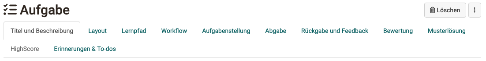
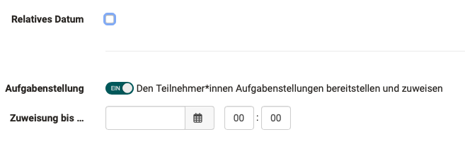
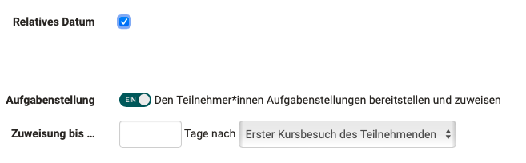
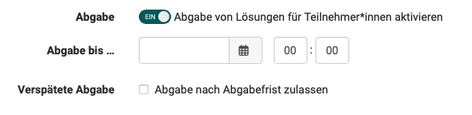
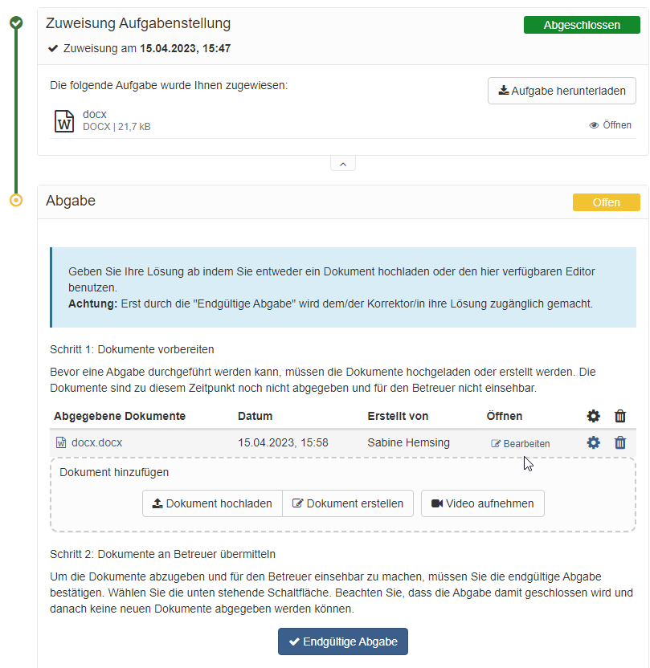
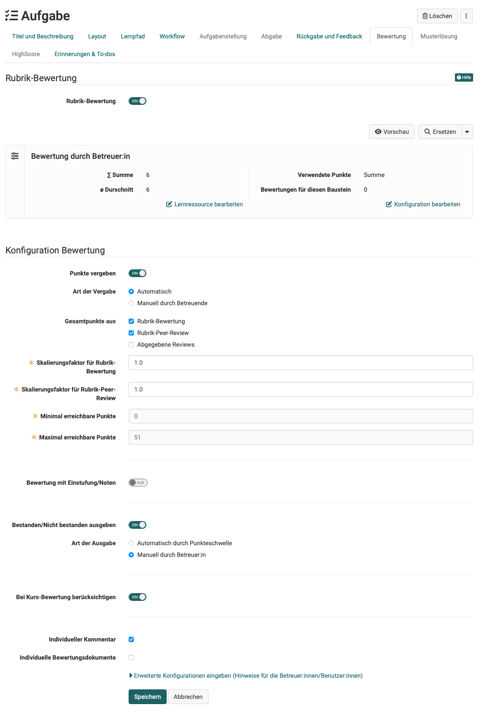
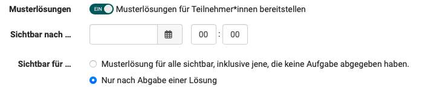
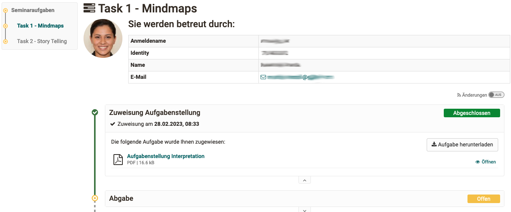
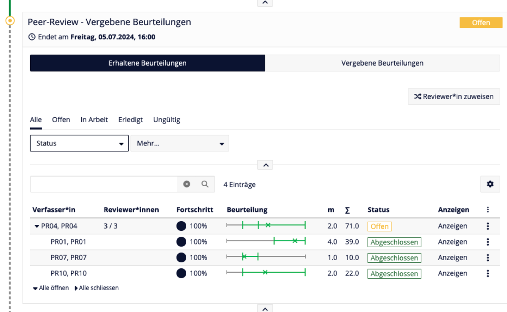
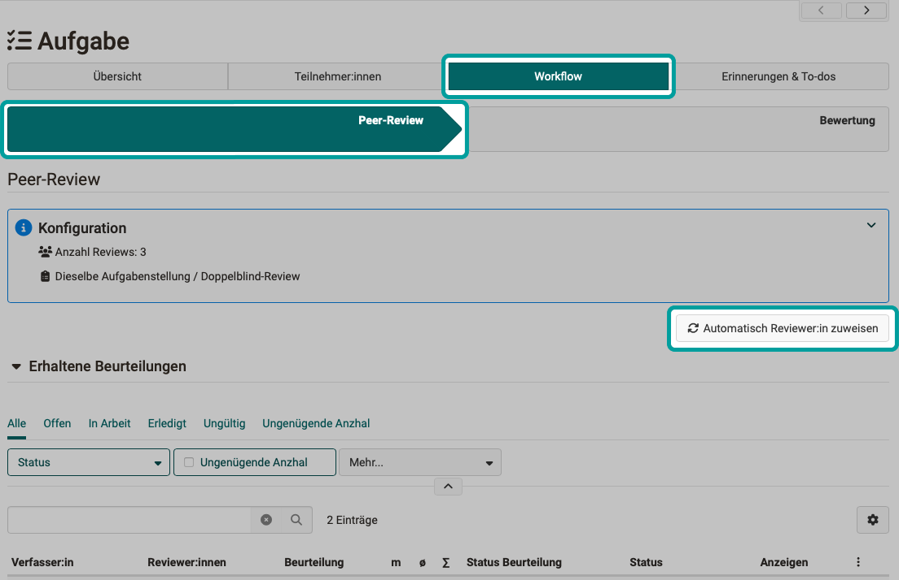

# Kursbaustein "Aufgabe" {: #course_element_task}

## Steckbrief

Name | Aufgabe
---------|----------
Icon | { class=size24  }
Verfügbar seit | Neuauflage mit Release 19
Funktionsgruppe | Wissensüberprüfung
Verwendungszweck | Abbildung komplexer Aufgabenworkflows mit konfigurierbaren Teilschritten, wie Abgabe von Lösungsdokumenten, Feedback (auch als Peer-Review) und Überarbeitungsschlaufe, Bereitstellung der Musterlösung und Bewertung
Bewertbar | ja
Spezialität / Hinweis | auch als [Gruppenaufgabe](../learningresources/Course_Element_Grouptask.de.md) verfügbar

Mit Hilfe des Kursbausteins Aufgabe können Lehrende **Dateiabgaben** und **Einsendeaufgaben** organisieren. Lernende laden dabei ihre Einreichungen in den OpenOlat Kurs hoch und erhalten ein Feedback bzw. eine Bewertung. Auch Peer-Reviews sind möglich. Ebenso können Überarbeitungen eingefordert oder Musterlösungen bereitgestellt werden.

## Aufgabe erstellen (Perspektive Autor:in) {: #create_task}

Die Erstellung und Konfiguration einer Aufgabe erfolgt wie bei allen Kursbausteinen im Kurseditor.

{ class="shadow lightbox"}

!!! note "Quick Links: Aufgabe erstellen (Perspektive Autor:in)"

    * [Tab Titel und Beschreibung](#title)  Allgemeine Angaben über den Kursbaustein
    * [Tab Layout](#layout) Allgemeine Einstellungen im Layout
    * [Tab Lernpfad](#learningpath) Soll die Aufgabe freiwillig, Pflicht oder nur für bestimmte Personengruppen sein?
    * [Tab Workflow](#workflow) Hier bestimmen Sie, welche Schritte die Aufgabe enthalten soll.
    * [Tab Aufgabenstellung](#assignment) Erstellung oder Upload der Aufgabenstellung, Zuweisung verschiedener Aufgaben oder Ziehung, usw.
    * [Tab Abgabe](#submission) Definition der erwarteten Einsendungen (mit Vorlage?, als Audio-/Videoaufnahme?, usw.)
    * [Tab Rückgabe und Feedback](#revisions) Z.B. Definition des Prozesses für einen Peer-Review.
    * [Tab Bewertung](#grading)  Konfiguration der Punktevergabe, Kriterium für Bestanden, Berücksichtigung in der Kursbewertung usw.
    * [Tab Musterlösung](#sample) Z.B. Bereitstellung einer pdf-Datei.
    * [Tab Highscore](#highscore) Visualisierung der Resultate, falls Punkte vergeben werden.
    * [Tab Erinnerungen & To-dos](#reminders) Vorbereitung automatischer Erinnerungsmails und To-dos

### Tab "Titel und Beschreibung"  {: #title}

Die Angaben über den Kursbaustein entsprechen denen, wie sie in allen Kursbausteinen enthalten sind. 

[nach oben (Perspektive Autor:in) ^](#create_task) 
[zum Seitenanfang ^](#course_element_task)

### Tab "Layout"  {: #layout}

Die Optionen zum Layout entsprechen denen, wie sie in allen Kursbausteinen enthalten sind. 

[nach oben (Perspektive Autor:in) ^](#create_task) 
[zum Seitenanfang ^](#course_element_task)

### Tab "Lernpfad" {: #learningpath}

!!! info "Herkömmliche Kurse"

    Herkömmliche Kurse verfügen nicht über den Tab "Lernpfad" und haben stattdessen die Tabs "Sichtbarkeit" und "Zugang", inklusive Expertenmodus.

Definieren Sie, ob die Bearbeitung der Aufgabe obligatorisch oder freiwillig ist oder ob der Kursbaustein nicht angezeigt (ausgenommen) werden soll. Obligatorische Aufgaben werden bei der Fortschrittsanzeige berücksichtigt, freiwillige nicht.

Das **Freigabedatum** kann verwendet werden, wenn der Kursbaustein erst zu einem bestimmten Datum geöffnet und gestartet werden soll. Der Baustein selbst wird aber bereits in der Kursstruktur angezeigt.

Die Zeitangabe unter "**Zu bearbeiten bis**" bezieht sich auf die Frist für das Abholen bzw. den Start des Kursbausteins Aufgabe, nicht auf den Abgabetermin für den Dateiupload (siehe Tab Workflow).

Bei der **Bearbeitungszeit** kann die geschätzte Zeit, die ein/e Teilnehmer:in für die Bearbeitung des Kursbausteins benötigt, eingetragen werden. Ein Eintrag ist vor allem relevant, wenn sich der Fortschritt im Kurs auf die Bearbeitungszeit der Kursbausteine bezieht (siehe Administration -> [Einstellungen](../learningresources/Course_Settings.de.md) -> Tab "Durchführung")

Im Tab "Lernpfad" wird auch definiert, welches Kriterium erfüllt sein muss, damit die Aufgabe als "erledigt" gilt. Folgende Optionen stehen zur Wahl:

{ class="shadow" }

* **Kursbaustein öffnen**: User hat auf den Kursbaustein geklickt.
* **Bestätigung durch den Benutzer**: User hat auf die Lesebestätigung geklickt.
* **Punkte**: Der User hat bei der Bearbeitung der Aufgabe mindestens die angegebene Punktzahl erreicht.
* **Bestanden**: Der User hat die im Tab "Bewertung" konfigurierten Anforderungen an "Bestanden" erfüllt bzw. die Aufgabe wurde manuell vom Betreuer auf bestanden gesetzt.
* **Durchführung erledigt**: Alle Schritte des Aufgabenflows wurden durchlaufen.

[nach oben (Perspektive Autor:in) ^](#create_task) 
[zum Seitenanfang ^](#course_element_task)

### Tab "Workflow“  {: #workflow}

Im Tab "Workflow" definieren Sie, welche einzelnen Elemente die Aufgabe überhaupt enthalten soll.

!!! tip "Tipp"

    Starten Sie die Konfiguration in diesem Tab und wählen Sie die Funktionen aus, die Sie benötigen. Anschliessend sind die benötigten Tabs aktiv/inaktiv und können weiter konfiguriert werden.

{ class="shadow lightbox"}

 **Relatives Datum** 
Statt Kalenderdaten einzutragen, können Sie auch mit _relativen Daten_ arbeiten. Legen Sie fest, wie viele Tage nach dem ersten Kursbesuch oder der Buchung die Aufgabenstellung geöffnet bleibt. Alle eingestellten Zeitvorgaben können auch individuell angepasst werden, z.B. wenn ein Lerner aufgrund bestimmter Umstände eine Verlängerung benötigt. Dies gilt für alle Prozessschritte. Wenn Sie das Abgabedatum verlängern, wird die Aufgabe neu eröffnet. Auch ein Datum für eine verspätete Abgabe ist möglich.

=== "Mit fixem Datum"

    { class="shadow lightbox" }

=== "Mit relativem Datum"

    { class="shadow lightbox" }

Die Umstellung auf relative Daten betrifft die Eingabefelder für **Aufgabenstellung**, **Abgabe** und **Musterlösung**.

 **Aufgabenstellung** 
Soll eine konkrete Aufgabenstellung im Kursbaustein hinterlegt werden oder findet der User die Aufgabe vielleicht woanders? Soll der User ein Dokument abgeben? Soll es ein Feedback vom Lehrenden geben? Sollen die User, wenn notwendig, die Möglichkeit zur Überarbeitung einer Einsendung erhalten können? Soll eine Musterlösung bereitgestellt werden? Soll eine Bewertung mit Punkten oder bestanden möglich sein? Sollen bestimmte Lernende von bestimmten Betreuenden bewertet werden?

Aktivieren Sie einfach die Dinge die Sie benötigen und konfigurieren Sie im nächsten Schritt die dafür relevanten Tabs.

 **Abgabe** 
Die Abschnitte Aufgabenstellung, Abgabe, verspätete Abgabe und Musterlösung können mit einem Datum versehen werden. Aufgabenstellung und Abgabe sind bis zum eingetragenen Datum verfügbar. 

Wird die verspätete Abgabe aktiviert und ein Termin hinterlegt, können Teilnehmende noch bis zum verspäteten Termin ihre Lösung einreichen. Für den User wird sowohl der normale Abgabetermin als auch der verspätete Termin angezeigt, bzw. die Termine, die noch in der Zukunft liegen. Die verspätete Abgabe wird dem Betreuer bzw. Kursbesitzer im Bewertungsflow ebenfalls angezeigt.

 **Feedback** 
Standardmässig wird das Feedback durch Betreuende gegeben, es kann aber auch durch die anderen Teilnehmer:innen erfolgen (Peer-Review).

 **Überarbeitung** 
Die Abgabe von Überarbeitungen durch Teilnehmer:innen nach der Korrektur kann optional erlaubt werden.

 **Musterlösung** 
Eine Musterlösung kann für alle Teilnehmenden oder nur diejenigen, die die Aufgabe bearbeitet haben, ab dem eingetragenen Datum bereitgestellt werden.
Sind Musterlösungen aktiviert, kann hier auch definiert werden, ob Betreuer:innen Dokumente hinzufügen und bearbeiten dürfen.

 **Bewertung** 
Mit dem Einschalten dieses Toggle-Buttons wird der Tab "Bewertung" aktiviert, in dem die Details der Bewertung konfiguriert werden können.

 **Dokumente Konfiguration** 
Diese Option wird nur angzeigt, wenn eine der Optionen "Aufgabenstellung" oder "Musterlösung" gewählt wurde und so das Hochladen von Dokumenten erforderlich ist. Es kann hier erlaubt werden, dass neben Kursbesitzer:innen auch Betreuer:innen Dokumente hinzufügen und bearbeiten können.

 **Betreuung** 
Im Abschnitt "Betreuung" des Tabs "Workflow" kann eine teilnehmerabhängige Betreuung aktiviert und konfiguriert werden.

* **Zuweisung Betreuende/Teilnehmende** 
Mit Wahl dieser Checkbox werden die weiteren Optionen zur Betreuung eingeblendet.
Die differenzierte Zuordnung der Personen erfolgt dann bei geschlossenem Kurseditor.

* **Zur Auswahl stehende Betreuende** 
Es kann entschieden werden, ob neben den Betreuer:innen auch Kursbesitzer:innen für die Betreuung der Teilnehmer:innen zugewiesen werden sollen.

* **Art der Zuweisung** 
Die Zuweisung (Zuordnung) von betreuenden Personen zu einem/einer Teilnehmer:in kann manuell oder automatisch erfolgen.

* **Benachrichtigung Betreuende** 
Wählen Sie hier, in welchen Fällen Betreuende eine Benachrichtigung per Mail erhalten.

* **Benachrichtigung Teilnehmende** 
Wählen Sie hier, ob Teilnehmende über die Zuweisung zu einer betreuenden Person per Mail informiert werden.

!!! warning "Achtung"

    Nachträgliche Änderungen am Workflow wirken sich auf alle Teilnehmenden aus, auch wenn diese den Workflow bereits begonnen haben.

    Bei Änderungen am Workflow, z.B. dem Entfernen der Aufgabenstellung, wird bei allen Teilnehmenden des Kurses dieser Bestandteil des Workflows entfernt. Die Information über bereits gewählte Aufgaben ist dann nicht mehr sichtbar. Wird der Bestandteil des Workflows wieder eingefügt, ist diese Information aber wieder zugänglich.

    Wird jedoch z.B. die Aufgabenstellung nachträglich hinzugefügt und ein/e Teilnehmer:in ist im persönlichen Workflow bereits weiter fortgeschritten, so muss nachträglich keine Aufgabe mehr ausgewählt werden.  

!!! warning "Achtung"

    Wenn unter den Kursmitgliedern keine Person die Rolle Betreuer:in hat und gleichzeitig Kursbesitzer:innen keine Betreuungsaufgaben wahrnehmen (Tab Workflow > Abschnitt "Betreuung" > "Zur Auswahl stehende Betreuende"), dann kann keine Betreuerzuweisung stattfinden.

[nach oben (Perspektive Autor:in) ^](#create_task) 
[zum Seitenanfang ^](#course_element_task)

### Tab "Aufgabenstellung“  {: #assignment}

!!! info "Voraussetzung"

    Im Tab "Workflow" muss die "Aufgabenstellung" aktiviert worden sein, damit Sie diese nun bereitstellen können. 

**a) Dateien hochladen**

Ausserhalb von OpenOlat erstellte Aufgaben können als Datei hochgeladen werden. Auch kann eine Zip-Datei mit mehreren (verschiedenen) Aufgaben hochgeladen und jede Datei mit einem passenden Titel und einer Beschreibung versehen werden.

**b) Dateien unterschiedlicher Formate erstellen**

Dateien können auch direkt in OpenOlat erstellt werden. Welche Formate genau zur Verfügung stehen hängt davon ab welche von der OpenOlat Administration aktiviert wurden. In der Regel steht mindestens ein HTML-Editor zur Verfügung. Aber auch die Erstellung von Word, Excel, PowerPoint sowie seit :octicons-tag-24: Release 18.1.  Diagrammen oder Whiteboards sind möglich. Zusätzlich können eine spezifische Video- und ab :octicons-tag-24: Release 18.1. auch eine Audio-Aufgabe erstellt werden. 

Wird eine Aufgabe mit dem internen HTML-Editor erstellt, können Sie ebenfalls mehrere Dateien (z.B. Bilder oder PDFs) zur Verfügung stellen, in dem Sie diese im HTML-Editor hochladen und dann in der HTML-Seite verlinken bzw. direkt anzeigen. So erstellte Aufgaben werden von den Benutzern dann im .zip Format heruntergeladen. Wird der HTML-Editor verwendet, wird automatisch der hinterlegte Titel auch als Dateiname übernommen. Dies kann aber jederzeit wieder geändert werden.

!!! info "Mehrere Dateien"

    Bitte beachten: Werden mehrere Dateien im Tab Aufgabenstellung hinterlegt, werden diese als mehrere verschiedene Aufgabenstellungen betrachtet. Es handelt sich _nicht_ um eine Aufgabe mit mehreren ergänzenden Dateien.
    
Im Feld "Art der Zuweisung" bestimmen Sie, ob einem Kursteilnehmer alle zur Verfügung stehenden Aufgaben zur Auswahl angeboten werden, oder ob ihm eine Aufgabe automatisch per Zufallsauswahl zugewiesen wird.

Wählen Sie im Feld "Typ der Ziehung", ob mehrere Kursteilnehmende die gleiche Aufgabe lösen können, oder ob jeder Kursteilnehmer bzw. Kursteilnehmerin eine andere Aufgabe lösen soll. Wenn die Aufgabe manuell gewählt wird, können Sie im Feld "Vorschau" weiter festlegen, ob die Kursteilnehmenden vor der Wahl einer Aufgabe diese einsehen dürfen. Wenn bei "Typ der Ziehung" jeder Kursteilnehmer eine andere Aufgabe lösen soll, müssen mindestens so viele Aufgaben hinterlegt werden, wie es Kursteilnehmende gibt, die diese Aufgabe lösen sollen.

!!! info "Tipp"

    Wenn der Kursbaustein nur _eine_ Aufgabe beinhaltet ist eine manuelle Wahl wenig sinnvoll. Nutzen Sie in diesem Fall am besten die automatische Zuweisung.

Im Feld "Mitteilung an Benutzer" können Sie für alle Kursteilnehmenden allgemeine Hinweise zur Bearbeitung der Aufgaben formulieren.

Wählt ein Kursteilnehmer bei der manuellen Auswahl aus versehen die falsche bzw. nicht gewollte Aufgabenstellung, kann die Wahl vom Kursbesitzer im [Bewertungswerkzeug](../learningresources/Assessment_tool_overview.de.md) zurückgesetzt werden.

Es folgt keine automatische Änderung. Der Teilnehmer erhält nun aber die Möglichkeit seine bisherigen Schritte wieder rückgängig zu machen.

[nach oben (Perspektive Autor:in) ^](#create_task) 
[zum Seitenanfang ^](#course_element_task)

### Tab "Abgabe"  {: #submission}

Hier definieren Sie Art und Umfang der Einsendemöglichkeiten für die Teilnehmenden.

!!! info "Voraussetzung"

    Im Tab "Workflow" muss 

    * "Abgabe" aktiviert worden sein, damit Sie diese nun einrichten können.

    { class="shadow lightbox" }

Nach Aktivierung stehen zur Auswahl: 

**"Dokumente hochladen"**: In diesem Fall können Kursteilnehmende außerhalb von OpenOlat erstellte Dokumente hochladen und abgeben. 

**"Abgabe mit OpenOlat Editor"**: Mit dieser Auswahl können Teilnehmende die Erstellung von Dokumenten direkt im Kursbaustein vornehmen. Ein HTML-Editor kann dafür standardmässig verwendet werden. Sind weitere Dokument Editoren in OpenOlat eingebunden, können auch Dokumente in weiteren Formaten wie Word, Excel usw.  erstellt werden. 

**Videoaufnahmen zulassen**: In diesem Fall können Lernende Videoaufnahmen per Webcam zu erstellen und abgeben. Auch eine maximale Aufnahmedauer sowie eine Qualitätsstufe kann für die Videos gewählt werden. 

**Audioaufnahmen zulassen**: Hier erhält der User die Möglichkeit direkt in OpenOlat eine Tonaufnahme zu erstellen und einzureichen. (Seit :octicons-tag-24: Release 18.1.)

!!! info "Hinweis"

    Audio- und Videoaufnahmen müssen immer mit einer der Optionen "Dokumente hochladen" oder "Abgabe mit OpenOlat Editor" kombiniert werden. 

Aktivieren Sie **"Aufgabe ist Vorlage für die Abgabe"**, wenn die Lernenden die hinterlegte Aufgabendatei als Basis für ihre Bearbeitung nutzen sollen, beispielsweise wenn die Aufgabenstellung eine auszufüllende vorstrukturierte Tabelle beinhaltet. Voraussetzung ist, dass diese Option von den OpenOlat Administrationen freigeschaltet wurde.

Darüber hinaus können Sie auch die minimale und maximale Anzahl von Dokumenten für die Abgabe definieren. Lassen Sie das Feld bei "Max. Anzahl von Dokumenten" frei, wenn Sie die Anzahl der Dokumente nicht einschränken möchten. Sollen zwingend mehrere Dokumente abgegeben werden können Sie auch die Mindestanzahl von Dokumenten erhöhen.

Aktivieren Sie die E-Mail Bestätigung damit Personen, die eine Aufgabe abgegeben haben eine entsprechende E-Mail erhalten. Der vorformulierte E-Mailtext kann bei Bedarf weiter angepasst werden. 

[nach oben (Perspektive Autor:in) ^](#create_task) 
[zum Seitenanfang ^](#course_element_task)

### Tab "Rückgabe und Feedback"  {: #revisions}

!!! info "Voraussetzung"

    Im Tab "Workflow" muss 

    * "Rückgabe und Feedback" aktiviert worden sein, damit Sie diese nun einrichten können,
    * gewählt worden sein, ob das Feedback durch Betreuer:innen oder Peer-Review geschehen soll.

    { class="shadow lightbox" }

**Rückgabe und Feedback durch Betreuer:innen**

Wurde im Tab Workflow die Option "Durch Betreuende" gewählt, können nun im Tab "Rückgabe und Feedback" die minimale und die maximale Anzahl von Rückgabedokumenten festgelegt werden, die die Teilnehmenden während der Schritte "Rückgabe und Feedback" und "Überarbeitung" abgeben dürfen.

**Rückgabe und Feedback durch Peer-Review**

Wurde im Tab Workflow die Option "Mit Peer-Review" gewählt, können nun im Tab "Rückgabe und Feedback" die Regeln für die Abgabe eines Feedbacks durch andere Teilnehmer:innen festgelegt werden. Das Feedback der Reviewer:innen wird jeweils in einem [Formular](../learningresources/Form_Element_Rubric.de.md) gegeben. Als Kursbesitzer:in geben Sie dieses [Formular](../learningresources/Form_Element_Rubric.de.md) vor. Für ein Peer-Review muss es ein Formular sein, das mindestens 1 Rubrik-Element enthält, denn nur das Rubrik-Element gibt die darin erreichten Punkte an den Kursbaustein weiter.

{ class="shadow lightbox" }

Auch eine Rückmeldung an die Reviewer:innen kann ermöglicht werden (Hilfreich? Ja/Nein und Sternebewertung).

Damit neben Kursbesitzer:innen auch Betreuer:innen die automatische Reviewer-Zuweisung auslösen können, muss die entsprechende Option im Tab "Rückgabe und Feedback", Abschnitt "Berechtigungen" gewählt werden.

[nach oben (Perspektive Autor:in) ^](#create_task) 
[zum Seitenanfang ^](#course_element_task)

### Tab "Bewertung"  {: #grading}

Hier definieren Sie _wie_ die Lernenden bewertet werden sollen. Soll es Punkte geben? Soll es ein bestanden/nicht bestanden für den Kursbaustein geben? Soll die Punktebewertung mit einer Bewertungsskala verbunden werden? Wenn ja, mit welcher? Sollen weitere individuelle Kommentare oder Dokumente bereitgestellt werden können? Entscheiden Sie jeweils was für Ihr Szenario passend ist.

Für die Bewertung kann auch ein Formular mit Rubrik verwendet werden. Die Punkte können dann aus dem Rubrik-Formular für die Bewertung des Kursbausteins übernommen werden.  Das hier im Tab "Bewertung" eingebundene Rubrik-Formular ist zu unterscheiden von dem Rubrik-Formular, das im Tab "Rückgabe und Feedback" für Peer-Reviews verwendet wird.

{ class="shadow lightbox" }

#### Punkte vergeben  

Wenn die Punktevergabe aktiviert wurde, müssen die minimale und die maximale Punktzahl angegeben werden. Zusätzlich können Sie dann auch die Option "Bewertung mit Einstufung/Noten" wählen und weiter konfigurieren. So können den jeweiligen Punkten bestimmte Bewertungsskalen wie Level, Noten, (Kompetenz-)Stufen oder Label zugeordnet werden. Die zur Verfügung stehenden Bewertungsskalen werden vom OpenOlat Administrator definiert und können über den Button "Bewertungsskala bearbeiten" ausgewählt sowie die Punkte im Detail angepasst werden. Ferner muss definiert werden ob die Zuordnung zur berechneten Einstufung manuell durch den Betreuer erfolgt oder automatisch bei Punktänderung angezeigt werden soll.

#### Gesamtpunkte aus ...

Die Gesamtpunktzahl kann aus einer oder mehreren Quellen errechnet werden:

* **Rubrik-Bewertung**: Wird im Tab "Bewertung" ein Rubrik-Formular verwendet, können von dort Punkte übernommen werden.
* **Rubrik-Peer-Review**: Ein Peer-Review verwendet das Rubrik-Formular, das im Tab "Rückgabe und Feedback" eingebunden wird.
* **Abgegebene Reviews**: Für das Reviewen von anderen Teilnehmer:innen können der Person zusätzliche Punkte angerechnet werden (Punkte pro erledigtem Review, konfiguriert unterhalb dieser Auswahl, sobald die Option markiert wurde).  

#### Bestanden/Nicht bestanden
Sofern aktiviert kann das Bestehen entweder manuell durch den Betreuer oder automatisch erfolgen. Für die automatische Bewertung müssen die Punktevergabe aktiviert und eine Punktschwelle für das Bestehen angegeben werden.

#### Bei Kurs-Bewertung berücksichtigen
Im Tab "Bewertung" kann auch definiert werden ob das Ergebnis des konkreten Aufgabenbausteins bei der Bewertung des gesamten Kurses inbegriffen ist oder ausgeschlossen werden soll.

#### Individuelle Feedbacks 
Optional können sie noch die Möglichkeit für individuelle Kommentare oder individuelle Bewertungsdokumente aktivieren, sodass Betreuende noch weitere flexible Rückmeldungsmöglichkeiten haben.

#### Hinweise
Wenn Sie die erweiterte Konfiguration aufklappen stehen noch weitere Konfigurationen zur Verfügung. Hier können Sie noch Hinweistexte für alle Lernenden und/oder für alle Betreuenden hinterlegen. 

[nach oben (Perspektive Autor:in) ^](#create_task) 
[zum Seitenanfang ^](#course_element_task)

### Tab "Musterlösung" {: #sample}

Um allen Kursteilnehmenden eine Musterlösung zu den gestellten Aufgaben anzubieten, erstellen Sie entweder die Musterlösung direkt mit dem internen Editor oder Sie nehmen ein Video mit Ihrer Webcam auf oder Sie laden Dateien mit den Musterlösungen hoch. 

!!! info "Voraussetzung"

    Im Tab "Workflow" muss 

    * "Musterlösungen" aktiviert worden sein, damit Sie diese nun einrichten können.

    { class="shadow lightbox" }

Per Voreinstellung ist die Musterlösung erst sichtbar, wenn die vom Teilnehmer eingereichten Dokumente von dem/der Betreuer:in akzeptiert wurden.

!!! Tip "Tipp"

    Sollen die Teilnehmenden vorab bereits Hilfestellungen zur Bearbeitung der Aufgabe erhalten, laden Sie diese zusammen mit der Aufgabenstellung als ZIP-Dokument hoch oder nutzen Sie die das Mitteilungsfeld (siehe Tab "Aufgabenstellung").

[nach oben (Perspektive Autor:in) ^](#create_task) 
[zum Seitenanfang ^](#course_element_task)

### Tab "HighScore"  {: #highscore}

Sofern für die Aufgabe Punkte vergeben werden, können Sie diese mit den HighScore-Optionen visualisieren. 

Voraussetzung ist, dass für die Aufgabe im Tab "Bewertung" die Vergabe von Punkten aktiviert wurde. Erst dann wird der Tab Highscore aktiv und kann konfiguriert werden. Es kann bestimmt werden, 

* welche Elemente angezeigt werden, 
* ob die Darstellung anonym sein soll und
* ab welchem Zeitpunkt die Highscore-Liste sichtbar sein soll.

Weitere Informationen zu diesem Tab, der in den meisten Assessment Kursbausteinen zur Verfügung steht, finden Sie [hier](../learningresources/Course_Elements.de.md).

[nach oben (Perspektive Autor:in) ^](#create_task) 
[zum Seitenanfang ^](#course_element_task)

### Tab "Erinnerungen & To-dos"  {: #reminders}

Mit der Erinnerungsfunktion können Sie [Erinnerungen](../learningresources/Course_Reminders.de.md) in Form einer E-Mail an Kursmitglieder versenden und automatische [To-dos](../learningresources/Course_todos.de.md)für die Aufgabe generieren. To-dos werden den Kursteilnehmenden im persönlichen Menü unter "[To-dos](../personal_menu/To-Dos.de.md)" hinterlegt. 

Wird die automatische Erstellung von To-dos aktiviert (ab :octicons-tag-24: Release 18.2.) sehen die Lernenden unter "Mein Kurs" -> To-dos den aktuellen Stand (Schritt) des Worklows der entsprechenden  und erkennen so rasch ob bzw. welche Aktionen aktuell von ihnen vorgenommen werden müssen. Darüber hinaus erscheinen diese To-dos auch bei den persönlichen To-dos der User in den persönlichen Werkzeugen. 

Die To-dos helfen also den Lernenden den Überblick über ihre Aufgaben zu behalten. 
Weitere Informationen zu To-dos finden Sie [hier](../basic_concepts/To_Dos_Basics.de.md).

!!! note "Hinweis"

    Ob auch Betreuende To-dos bearbeiten dürfen wird in den Einstellungen der Kurs-Administration definiert. Gehen Sie dafür in den Tab "Optionen" und aktivieren Sie den entsprechenden Haken.
    
[nach oben (Perspektive Autor:in) ^](#create_task) 
[zum Seitenanfang ^](#course_element_task)

!!! info "Hinweis"

    Die Funktionsweise und der Aufbau der Kursbausteine "Aufgabe" und "[Gruppenaufgabe](../learningresources/Course_Element_Grouptask.de.md)" sind ähnlich.

---

## Aufgabe erledigen (Perspektive Kursteilnehmer:in)  {: #process_task}

Alle Schritte einer Aufgabe (Workflow) zeigen sich für Kursteilnehmer:innen direkt im Kursbaustein, je nach Konfiguration des Kursbausteins. Nach Erledigung eines Schrittes wird der nächste Schritt angezeigt und zugänglich.
 
{ class="shadow lightbox" }

!!! note "Quick Links: Aufgabe erledigen (Perspektive Kursteilnehmer:in)"

    * [Zugewiesene Aufgabe herunterladen](#process_task_download)
    * [Von wem werde ich betreut?](#process_task_my_coach)
    * [Lösung abgeben](#process_task_solution)
    * [Rückgabe und Feedback](#process_task_feedback)
    * [Ergebnisse des Peer-Reviews ansehen](#process_task_view_reviews)
    * [Aufgabe überarbeiten](#process_task_rework)
    * [Musterlösung betrachten](#process_task_view_example)
    * ["Bewertung" des Betreuers lesen](#process_task_view_coach_assessment)
    

!!! info  "Tipp"

    Abonnieren Sie den jeweiligen Aufgabenbaustein um schnell per Mail über Änderungen informiert zu werden.

### Zugewiesene Aufgabe herunterladen {: #process_task_download}

Je nach Konfiguration stehen im Schritt **"Zuweisung Aufgabenstellung"** eine oder mehrere Aufgaben zur Auswahl oder eine Aufgabe wird Ihnen automatisch zugewiesen. Wenn bei mehreren Aufgaben der Titel der Aufgabendatei verlinkt ist, können Sie die Aufgabenstellung vor der Auswahl ansehen. Wenn Sie nur die Schaltfläche "Wählen" haben, können Sie die Aufgabe nicht im Vorfeld ansehen. Eine automatische Zuweisung einer Aufgabe erfolgt direkt sobald Sie die Aufgabe vor Ablauf einer eventuellen Abgabedeadline anklicken.

Wenn Sie eine Aufgabe gewählt haben oder Ihnen eine Aufgabe automatisch zugewiesen wurde, klicken Sie auf "Aufgabe herunterladen", um die Aufgabenstellung herunterzuladen bzw. anzeigen zu lassen. Wenn Sie auf den Dateinamen der Aufgabenstellung klicken wird die Aufgabe angezeigt. Die Aufgabe können Sie dann jederzeit wiederholt herunterladen.

Es ist auch möglich, dass Ihre Lehrperson die Aufgabenstellung nicht in dem Kursbaustein "Aufgabe" hinterlegt hat, sondern einen anderen Ort z.B. einen anderen Kursbaustein, einer HTML-Seite,  eine externe Webseite gewählt hat oder die Aufgabenstellung mündlich in Präsenz oder in einem Online-Meeting gestellt hat. In diesem Fall erscheint der Abschnitt "Zuweisung Aufgabenstellung" nicht.

[nach oben (Perspektive Kursteilnehmer:in) ^](#process_task) 
[zum Seitenanfang ^](#course_element_task)

### Von wem werde ich betreut? {: #process_task_my_coach}

In Kurs-Settings mit sehr vielen Teilnehmenden werden diese häufig von mehreren Lehrpersonen betreut. Als Teilnehmer:in wird Ihnen ein/eine Betreuer:in zugewiesen.

Sie sehen als Teilnehmer:in die Ihnen zugewiesene betreuende Person oberhalb der Aufgabe. Sollte kein/keine Betreuer:in angzeigt werden, wurde Ihnen noch niemand zugeteilt.

{ class="shadow lightbox" }

Mit der Implementierung des Peer-Reviews haben seit Release 19 auch Teilnehmende die Möglichkeit, gegenseitig Feedback zu den gelösten Aufgaben abzugeben.

[nach oben (Perspektive Kursteilnehmer:in) ^](#process_task) 
[zum Seitenanfang ^](#course_element_task)

### Lösung abgeben {: #process_task_solution}

Im Bereich **"Abgabe"** haben Sie die Möglichkeit Ihre Lösung einzureichen. Je nach Konfiguration durch die Lehrperson können sie entweder Dokumente hochladen, Dateien mit dem OpenOlat Editor erstellen oder auch  kurze Audio- und Video-Aufnahmen direkt in OpenOlat erstellen.  

In der Regel wird nur ein Teil der vier Optionen für Sie verfügbar sein.
Laden Sie Ihre Lösung hoch bzw. erstellen Sie sie direkt in OpenOlat und das Dokument wird zwischengespeichert. Die Dokumente bleiben solange für Sie bearbeitbar bis Sie über die Schaltfläche "Endgültige Abgabe" Ihre Aufgabe einreichen. Sie erhalten eine Bestätigung, dass Sie Dokumente abgegeben haben.

Im Abgabe-Schritt, der nun mit einem grünen Häkchen als erledigt markiert wird, erhalten Sie eine Übersicht über abgegebenen Dateien. Sie können sich die Dateien zwar noch ansehen aber keine Änderungen mehr vornehmen.

[nach oben (Perspektive Kursteilnehmer:in) ^](#process_task) 
[zum Seitenanfang ^](#course_element_task)

### Rückgabe und Feedback {: #process_task_feedback}

Wenn Sie noch _keine_ Einreichung vorgenommen haben, und der Betreuer keine Rückmeldung bereitgestellt hat, ist dieser Bereich leer.

Wenn Sie eine Bearbeitung eingereicht haben und der Betreuer noch keine Rückmeldung erstellt hat, erscheint die entsprechende Information.

Sobald Ihr Betreuer ein Feedback erstellt hat, finden Sie im Schritt "Rückgabe und Feedback" die Feedback Information.

Wenn Ihre Bearbeitung nicht ausreichend war und der Betreuer eine Überarbeitung einfordert, erscheint ebenfalls eine entsprechende Anzeige und Sie haben die Möglichkeit, eine neue Bearbeitung im Schritt "Überarbeitung" einzureichen. Eventuell wird dafür eine Deadline gesetzt.

[nach oben (Perspektive Kursteilnehmer:in) ^](#process_task) 
[zum Seitenanfang ^](#course_element_task)

### Ergebnisse des Peer-Reviews ansehen {: #process_task_view_reviews}

Wurde ein Peer-Review vorgesehen, sehen Sie eine Übersicht über Ihre vergebenen und erhaltenen Beurteilungen.

{ class="shadow lightbox" }

[nach oben (Perspektive Kursteilnehmer:in) ^](#process_task) 
[zum Seitenanfang ^](#course_element_task)

### Aufgabe überarbeiten {: #process_task_rework}

Wenn Sie eine Überarbeitung vornehmen müssen, gehen Sie wie unter "Lösung abgeben" (Abgabe) erläutert vor. Im Abschnitt **"Überarbeitung"** kann es auch sein, dass Ihr Betreuer Ihnen Ihre Arbeit mehrfach zur Korrektur zurückgibt.

Sobald der Betreuer die Aufgabe als gelöst ansieht, wird er die Überarbeitungsperiode schliessen. Zu jedem Zeitpunkt sehen Sie welche Dokumente von Ihnen und Ihrem Betreuer abgegeben wurden und können diese einsehen.

[nach oben (Perspektive Kursteilnehmer:in) ^](#process_task) 
[zum Seitenanfang ^](#course_element_task)

### Musterlösung betrachten {: #process_task_view_example}

Ihr Dozent kann der Aufgabe eine **Musterlösung** anfügen, welche zu einem von ihm festgelegten Zeitpunkt sichtbar wird, aber immer erst _nachdem_ ihre Lösung vom Betreuer akzeptiert wurde. Klicken Sie auf den Dateinamen bzw. den Button "Musterlösungen herunterladen", um die Musterlösung anzuschauen oder herunterzuladen.

[nach oben (Perspektive Kursteilnehmer:in) ^](#process_task) 
[zum Seitenanfang ^](#course_element_task)

### "Bewertung" des Betreuers lesen {: #process_task_view_coach_assessment}

Der Bereich **Bewertung** umfasst zum einen automatisch generierte Informationen der Leistungsübersicht mit Status,  Punktestand, Einstufung der gewählten Bewertungsskala, je nach Konfiguration des Kursbausteins. Zum anderen können Betreuende in dem Bereich Bewertung ein Feedback im Kommentarfeld sowie (Bewertungs-)dokumente hinterlegen. 

[nach oben (Perspektive Kursteilnehmer:in) ^](#process_task) 
[zum Seitenanfang ^](#course_element_task)

---

## Aufgaben betreuen (Perspektive Betreuer:in) {: #coach_task}

!!! note "Quick Links: Aufgaben betreuen (Perspektive Betreuer:in)"

    * [Regeln eines Peer-Reviews](#coach_task_peer_review_rules)
    * [Peer-Review betreuen](#coach_task_peer_review)
    * [Manuelle Zuweisung von Peer-Reviewer:innen](#coach_task_peer_review_assign_manually)
    * [Automatische Zuweisung von Peer-Reviewer:innen](#coach_task_peer_review_assign_automatically)

### Regeln eines Peer-Reviews {: #coach_task_peer_review_rules}

Bei einem Peer-Review geben sich die Teilnehmer:innen eines Kurses gegenseitig ein Feedback oder eine Bewertung. Das Feedback kann allgemeiner Art sein (z.B. in einem Textfeld) oder zusätzlich auch eine Bewertung mit Punkten umfassen.

Dabei muss nicht von jedem/jeder Teilnehmer:in ein Review aller anderen Teilnehmer:innen gemacht werden. Es kann bestimmt werden, für wieviele andere Personen ein Review gemacht werden muss.

Ob die Reviewer die Namen der zugewiesenen Personen sehen, nur ihr eigener Name als Reviewer:in ersichtlich ist oder vollständig offen gelegt wird, wer wen reviewt, kann ebenfalls konfiguriert werden.

Als Betreuer:in überwachen Sie die gegenseitigen Reviews und können ggf. auch eingreifen.

[nach oben (Perspektive Betreuer:in) ^](#coach_task) 
[zum Seitenanfang ^](#course_element_task)

### Peer-Review betreuen {: #coach_task_peer_review}

Der Ablauf eines Peer-Reviews wurde von dem/der Kursbesitzer:in festgelegt. Entsprechend finden Sie als Betreuer:in die Optionen für Ihre Betreuungsaufgabe vor.

* In einer Übersicht sehen Sie den Stand der Peer-Reviews. In zwei Tabs finden Sie erhaltene und vergebene Beurteilungen der Teilnehmer:innen.
* Als Betreuer:in können Sie manuell Reviewer:innen zuweisen.

{ class="shadow lightbox" }

!!! note  "Hinweis"

    Kursbetreuer:innen sehen nur Gruppen, in denen sie selbst Mitglied sind. Soll ein Peer-Review durch Mitglieder anderer Gruppen erfolgen, sind die Bewertungen dieser Teilnehmer:innen für Kursbetreuer:innen nicht vollständig ersichtlich.

[nach oben (Perspektive Betreuer:in) ^](#coach_task) 
[zum Seitenanfang ^](#course_element_task)

### Manuelle Zuweisung von Peer-Reviewer:innen {: #coach_task_peer_review_assign_manually}

Wenn Sie als Betreuer:in bestimmen wollen, wer von wem ein Review erhält, können Sie die Zurordnung selbst vornehmen.

{ class="shadow lightbox" }

[nach oben (Perspektive Betreuer:in) ^](#coach_task) 
[zum Seitenanfang ^](#course_element_task)

### Automatische Zuweisung von Peer-Reviewer:innen {: #coach_task_peer_review_assign_automatically}

Die Zuordnung von Peer-Reviewer:innen zu Teilnehmer:innen kann auch durch OpenOlat automatisch vorgenommen werden. Sie erfolgt gemäss den eingestellten Regeln. (Z.B. definierte Anzahl der Personen, die pro Teilnehmer:in zu reviewen sind.) Auch wenn vorab schon manuelle Zuordnungen durch Betreuer:innen gemacht wurden, werden diese bei den verbleibenden automatischen Zuordnungen berücksichtigt.

Der automatische Zuordnungsprozess muss durch Kursbesitzer:innen oder Kursbetreuer:innen ausgelöst werden.

{ class="shadow lightbox" }

!!! info "Hinweis"

    Damit auch Betreuer:innen die automatische Reviewer-Zuweisung auslösen können, muss die entsprechende Option von dem/der Kursbesitzer:in eingerichtet worden sein.

!!! info "Hinweis"

    Der Button "Automatisch Reviewer:in zuweisen" wird nach einer durchgeführten Zuweisung nicht deaktiviert und ist weiterhin verfügbar. Der Grund dafür ist, dass Teilnehmende auch später noch hinzukommen können oder jemand eine Verlängerung erhalten hat.

[nach oben (Perspektive Betreuer:in) ^](#coach_task) 
[zum Seitenanfang ^](#course_element_task)
