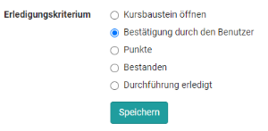

# Kursbaustein "Aufgabe" {: #course_element_task}

## Steckbrief

Name | Aufgabe
---------|----------
Icon | { class=size24  }
Verfügbar seit | Neuauflage mit Release 10.3
Funktionsgruppe | Wissensüberprüfung
Verwendungszweck | Abbildung komplexer Aufgabenworkflows mit konfigurierbaren Teilschritten wie Abgabe von Lösungsdokumenten, Feedback und Überarbeitungsschlaufe, Bereitstellung der Musterlösung und Bewertung
Bewertbar | ja
Spezialität / Hinweis | auch als Gruppenaufgabe verfügbar

## Allgemeines

Mit Hilfe des Kursbausteins Aufgabe können Lehrende **Dateiabgaben** und **Einsendeaufgaben** organisieren. Lernende laden dabei ihre Einreichungen in den OpenOlat Kurs hoch und erhalten vom Lehrenden ein Feedback bzw. eine Bewertung. Ebenso können Überarbeitungen eingefordert oder Musterlösungen bereitgestellt werden.
****
Die gewünschte Funktionsweise des Kursbausteins "Aufgabe" lässt sich von den Autor:innen in den Einstellungen konfigurieren:  

* **Tab Lernpfad**: Im Tab "Lernpfad" (bzw. im Tab "Workflow" bei herkömmlichen Kursen) kann definiert werden, ob die Aufgabe obligatorisch oder freiwillig ist. Obligatorische Aufgaben müssen bearbeitet werden und werden nach Ablauf des eingestellten Abgabetermins eingezogen und zur Bewertung an den Lehrenden übergeben. Bei freiwilligen Aufgaben kann der User selbst entscheiden ob er sie bearbeiten möchte. Ferner werden freiwillige Aufgaben nach der Deadline _nicht_ eingezogen.
* **Tab Workflow**: Die zentrale Konfiguration des Kursbausteins erfolgt im Tab "Workflow". Hier bestimmen Sie, welche der folgenden Optionen Sie verwenden möchten. Anschliessend können Sie diese weiter konfigurieren.
* **Tab Aufgabenstellung**: Stellen Sie eine Aufgabenstellung direkt im Kursbaustein zur Verfügung.
* **Tab Abgabe**: Lernende sollen die Möglichkeit haben ihre Bearbeitung einzureichen. Kursteilnehmende erstellen hier ihre Lösungen oder laden diese hoch.
* **Tab Rückgabe und Feedback**: Korrigierte Aufgaben und Überarbeitungsanforderungen können hier den Teilnehmern zurückgegeben werden. 
* **Überarbeitung**: Teilnehmende können wenn nötig eine Überarbeitungsmöglichkeit erhalten. Lehrende können weitere Korrekturanforderungen stellen, bis sie die Aufgabe als erledigt betrachten und den Revisionsprozess schliessen.
* **Tab Bewertung**: Punkte, bestanden/nicht bestanden und Feedbacks können individuell hinterlegt werden.
* **Tab Musterlösung**: Stellen Sie allen Teilnehmenden eine Musterlösung für die Aufgabe zur Verfügung. Musterlösungen können als Datei hochgeladen oder direkt in OpenOlat erstellt werden.
* **Tab HighScore**: Hier können Sie die Anzeige von Siegertreppchen, Histogramm oder einer Highscore-Liste einrichten.
* **Tab Erinnerungen & To-dos**: Mit der Erinnerungsfunktion können Sie Erinnerungen in Form einer E-Mail an Kursmitglieder versenden. To-dos werden den Kursteilnehmer:innen im persönlichen Menü unter "To-Dos" hinterlegt. 

!!! info "Hinweis"

    Die Funktionsweise und der Aufbau der Kursbausteine "Aufgabe" und "Gruppenaufgabe" sind identisch.

## Konfigurationen

Die Aufgaben eines Kurses werden im Kurseditor erstellt und konfiguriert. Wählen Sie den Kursbaustein "Aufgabe", dann werden Ihnen rechts die nachfolgend beschriebenen Tabs angezeigt.

Die Tabs "Titel und Beschreibung" sowie "Layout" finden sich bei allen Kursbausteinen. Hier können Sie Informationen zum Baustein hinterlegen und die Darstellung konfigurieren. Im Folgenden werden die weiteren zentralen Tabs für den Kursbaustein Aufgabe erläutert.

### Tab "Lernpfad“

Dieser Tab ist nur im Lernpfad-Kurs verfügbar.

Hier definieren Sie ob die Bearbeitung der Aufgabe obligatorisch oder freiwillig ist oder ob der Kursbaustein nicht angezeigt (Ausgenommen) werden soll. Obligatorische Aufgaben werden bei der Fortschrittsanzeige berücksichtigt, freiwillige nicht.

Das Freigabedatum kann verwendet werden, wenn der Kursbaustein erst zu einem bestimmten Datum geöffnet und gestartet werden soll. Der Baustein selbst wird aber bereits in der Kursstruktur angezeigt.

Die Zeitangabe unter "Zu bearbeiten bis" bezieht sich auf die Frist für das Abholen bzw. den Start des Kursbausteins Aufgabe, nicht auf den Abgabetermin für den Dateiupload (siehe Tab Workflow).

Bei der Bearbeitungszeit kann die geschätzte Zeit, die ein User für die Bearbeitung des Kursbausteins benötigt, eingetragen werden. Ein Eintrag ist vor allem relevant, wenn sich der Fortschritt im Kurs auf die Bearbeitungszeit der Kursbausteine bezieht (siehe Administration -> [Einstellungen](../learningresources/Course_Settings.de.md) -> Tab "Durchführung")

Im Tab "Lernpfad" wird auch definiert, welches Kriterium erfüllt sein muss, damit die Aufgabe als "erledigt" gilt. Folgende Optionen stehen zur Wahl:

{ class="shadow" }

* **Kursbaustein öffnen**: User hat auf den Kursbaustein geklickt.
* **Bestätigung durch den Benutzer**: User hat auf die Lesebestätigung geklickt.
* **Punkte**: Der User hat bei der Bearbeitung der Aufgabe mindestens die angegebene Punktzahl erreicht.
* **Bestanden**: Der User hat die im Tab "Bewertung" konfigurierten Anforderungen an "Bestanden" erfüllt bzw. die Aufgabe wurde manuell vom Betreuer auf bestanden gesetzt.
* **Durchführung erledigt**: Alle Schritte des Aufgabenflows wurden durchlaufen.

!!! info "Herkömmliche Kurse"

    Herkömmliche Kurse verfügen nicht über den Tab "Lernpfad" und haben stattdessen die Tabs "Sichtbarkeit" und "Zugang", inklusive Expertenmodus.

### Tab "Workflow“

Der Tab Workflow ist der zentrale Tab zur Konfiguration des Kursbausteins Aufgabe. Hier wird definiert welche einzelnen Elemente der Aufgabe überhaupt benötigt werden. Soll eine konkrete Aufgabenstellung im Kursbaustein hinterlegt werden oder findet der User die Aufgabe vielleicht woanders? Soll der User ein Dokument abgeben? Soll es ein Feedback vom Lehrenden geben? Sollen die User, wenn notwendig, die Möglichkeit zur Überarbeitung einer Einsendung erhalten können? Soll eine Musterlösung bereitgestellt werden? Soll eine Bewertung mit Punkten oder bestanden möglich sein? Sollen bestimmte Lernende von bestimmten Betreuenden bewertet werden?

Aktivieren Sie einfach die Dinge die Sie benötigen und konfigurieren Sie im nächsten Schritt die dafür relevanten Tabs.

Die Abschnitte Aufgabenstellung, Abgabe, verspätete Abgabe und Musterlösung können mit einem Datum versehen werden. Aufgabenstellung und Abgabe sind bis zum eingetragenen Datum verfügbar. 

Wird die verspätete Abgabe aktiviert und ein Termin hinterlegt können Teilnehmende noch bis zum verspäteten Termin ihre Lösung einreichen. Für den User wird sowohl der normale Abgabetermin als auch der verspätete Termin angezeigt bzw. die Termine die noch in der Zukunft liegen. Die verspätete Abgabe wird dem Betreuer bzw. Kursbesitzer im Bewertungsflow ebenfalls angezeigt.

Eine Musterlösung kann für alle Teilnehmenden oder nur diejenigen, die die Aufgabe bearbeitet haben, ab dem eingetragenen Datum bereitgestellt werden.

Statt Kalenderdaten einzutragen können Sie auch mit relativen Daten arbeiten. Dort legen Sie fest z.B. wie viele Tage nach dem ersten Kursbesuch die Aufgabenstellung geöffnet bleibt. Alle eingestellten Zeitvorgaben können auch individuell angepasst werden, z.B. wenn ein Lerner aufgrund bestimmter Umstände eine Verlängerung benötigt. Dies gilt für alle Prozessschritte. Wenn Sie das Abgabedatum verlängern, wird die Aufgabe neu eröffnet. Auch ein Datum für eine verspätete Abgabe ist möglich.

Sind Musterlösungen aktiviert, kann hier auch definiert werden, ob Betreuer Dokumente hinzufügen und bearbeiten dürfen.

Im Bereich "Betreuung" des Tabs Workflow kann eine teilnehmerabhängige Betreuung aktiviert und konfiguriert werden.

Die differenzierte Zuordnung der Personen erfolgt allerdings bei geschlossenem Kurseditor.

#### Spezifische Gruppenaufgabe (im Tab Workflow):
In der Gruppenaufgabe legen Sie zusätzlich im Abschnitt "Aufgabentyp" fest, für welche Gruppen oder Lernbereiche der Aufgabenbaustein zugänglich ist. Dafür entfällt bei der Gruppenaufgabe die Betreuerzuordnung im Tab "Workflow" da sich diese Zuordnung automatisch durch die Betreuerzuordnung der Gruppe ergibt.  

!!! warning "Achtung"

    Nachträgliche Änderungen am Workflow wirken sich auf alle Teilnehmenden bzw. Gruppen aus, auch wenn diese den Workflow bereits begonnen haben.

    Bei Änderungen am Workflow, z.B. dem Entfernen der Aufgabenstellung, wird bei allen Teilnehmenden bzw. Gruppen des Kurses dieser Bestandteil des Workflows entfernt. Die Information über bereits gewählte Aufgaben ist dann nicht mehr sichtbar. Wird der Bestandteil des Workflows wieder eingefügt, ist diese Information aber wieder zugänglich.

    Wird jedoch z.B. die Aufgabenstellung nachträglich hinzugefügt und ein Teilnehmer bzw. eine Gruppe ist in ihrem persönlichen Workflow bereits weiter fortgeschritten, so muss nachträglich keine Aufgabe mehr ausgewählt werden.  

### Tab "Aufgabenstellung“

Im Tab "Aufgabenstellung" können Sie

 **a) Dateien hochladen**

Ausserhalb von OpenOlat erstellte Aufgaben können als Datei hochladen. Auch kann eine Zip-Datei mit mehreren (verschiedenen) Aufgaben hochgeladen und jede Datei mit einem passenden Titel und einer Beschreibung versehen werden.

**b) Dateien unterschiedlicher Formate erstellen**

Dateien können direkt in OpenOlat estellt werden. Welche Formate genau zur Verfügung stehen hängt davon ab welche von der OpenOlat Administration aktiviert wurden. Meist steht mindestens ein HTML-Editor zur Verfügung. Aber auch die Erstellung von Word, Excel, PowerPoint sowie seit :octicons-tag-24: Release 18.1.  Diagrammen oder Whiteboards ist möglich. Zusätzlich können eine spezifische Video- oder ab :octicons-tag-24: Release 18.1. auch eine Audio-Aufgabe erstellt werden. 

Wird eine Aufgabe mit dem internen HTML-Editor erstellt, können Sie ebenfalls mehrere Dateien (z.B. Bilder oder PDFs) zur Verfügung stellen, in dem Sie diese im HTML-Editor hochladen und dann in der HTML-Seite verlinken bzw. direkt anzeigen. So erstellte Aufgaben werden von den Benutzern dann im .zip Format heruntergeladen. Wird der HTML-Editor verwendet, wird automatisch der hinterlegte Titel auch als Dateiname übernommen. Dies kann aber jederzeit wieder geändert werden.

Im Feld "Art der Zuweisung" bestimmen Sie, ob einem Kursteilnehmer alle zur Verfügung stehenden Aufgaben zur Auswahl angeboten werden, oder ob ihm eine Aufgabe automatisch per Zufallsauswahl zugewiesen wird.

!!! info "Mehrere Dateien"

    Bitte beachten: Werden mehrere Dateien im Tab Aufgabenstellung hinterlegt, werden diese als mehrere verschiedene Aufgabenstellungen betrachtet. Es handelt sich _nicht_ um eine Aufgabe mit mehreren ergänzenden Dateien.

Wählen Sie im Feld "Typ der Ziehung", ob mehrere Kursteilnehmende die gleiche Aufgabe lösen können, oder ob jeder Kursteilnehmer bzw. Kursteilnehmerin eine andere Aufgabe lösen soll. Wenn die Aufgabe manuell gewählt wird, können Sie im Feld "Vorschau" weiter festlegen, ob die Kursteilnehmenden vor der Wahl einer Aufgabe diese einsehen dürfen. Wenn bei "Typ der Ziehung" jeder Kursteilnehmer eine andere Aufgabe lösen soll, müssen mindestens so viele Aufgaben hinterlegt werden, wie es Kursteilnehmende gibt, die diese Aufgabe lösen sollen.

!!! info "Tipp"

    Wenn der Kursbaustein nur eine Aufgabe beinhaltet ist eine manuelle Wahl wenig sinnvoll. Nutzen Sie in diesem Fall am besten die automatische Zuweisung.

Im Feld "Mitteilung an Benutzer" können Sie für alle Kursteilnehmenden allgemeine Hinweise zur Bearbeitung der Aufgaben formulieren.

!!! info "Ergänzende Dokumenteneditoren"

    Sind in der Administration ergänzende Dokumenteneditoren aktiviert, können auch noch weitere Dateiformate erstellt werden. Beispielsweise können bei Verwendung von Only Office auch Word, Excel oder PowerPoint Dateien erstellt werden. Gleiches gilt für die Erstellung von sonstigen (Feedback-)Dateien.

Wählt ein Kursteilnehmer bei der manuellen Auswahl aus versehen die falsche bzw. nicht gewollte Aufgabenstellung, kann die Wahl vom Kursbesitzer im [Bewertungswerkzeug](../learningresources/Assessment_tool_overview.de.md) zurückgesetzt werden.

Es folgt keine automatische Änderung. Der Teilnehmer erhält nun aber die Möglichkeit seine bisherigen Schritte wieder rückgängig zu machen.

!!! warning "Gruppenaufgabe"

    Bei Gruppenaufgaben kann nur ein Thema pro Gruppe gewählt werden. Sobald ein Gruppenteilnehmer ein Thema gewählt hat, ist das Thema für die gesamte Gruppe festgelegt. Dabei ist es egal wer aus der Gruppe die Wahl trifft. 

### Tab "Abgabe“

Hier legen Sie fest wie und in welchem Umfang Kursteilnehmende Dokumente bzw. Bearbeitungen abgeben können.

Die **"Abgabe mit OpenOlat Editor"** gestattet die Erstellung von Dokumenten direkt im Kursbaustein, die dann als HTML-Datei gespeichert werden. Sind weitere Dokument Editoren in OpenOlat eingebunden, können auch weitere Formate erstellt werden. Ist nur **"Dokumente hochladen"** aktiviert, müssen Kursteilnehmende ihr Dokument bereits in einem gängigen Dateiformat vorliegen haben um dieses hochzuladen. Lassen Sie das Feld bei "Max. Anzahl von Dokumenten" frei, wenn Sie die Anzahl der Dokumente nicht einschränken möchten. Sollen mehrere Dokumente abgegeben werden können Sie auch die Mindestanzahl von Dokumenten erhöhen.

Es ist nun auch möglich Videoaufnahmen per Webcam als Abgabe zuzulassen (**"Videoaufnahmen zulassen"**) und dafür eine maximal Aufnahmedauer sowie die Qualität der Videoaufnahme festzulegen. Die Abgabe eines Videos ermöglicht es Lernenden z.B. statt eines schriftlichen Dokuments direkt ein Video-Statement einzureichen. Seit :octicons-tag-24: Release 18.1. können auch Audio-Dateien zur Abgabe ausgewählt werden. 

Aktivieren Sie **"Aufgabe ist Vorlage für die Abgabe"**, wenn die Lernenden die hinterlegte Aufgabendatei als Basis für ihre Bearbeitung nutzen sollen, beispielsweise wenn die Aufgabenstellung eine auszufüllende vorstrukturierte Tabelle beinhaltet.

!!! Info "Info"

    Damit die Nutzung der Vorlage funktioniert muss auch die Bearbeitung in entsprechenden Editoren von den OpenOlat Administratoren freigeschaltet sein.  

Im Abschnitt "Abgabe Bestätigung" finden Sie den vorformulierten Text der Kursteilnehmenden die Abgabe der eigenen Lösung bestätigt. Dieser Text kann bei Bedarf angepasst werden. Die Option "Text zusätzlich als E-Mail verschicken" bewirkt, dass dieser Bestätigungstext dem jeweiligen OpenOlat-Benutzer auch als E-Mail zugestellt wird. Bei Gruppenaufgaben erhalten alle Gruppenmitglieder eine E-Mail-Bestätigung.

### Tab "Rückgabe und Feedback"

Hier kann die minimale und maximale Anzahl von Rückgabedokumenten definiert werden.

### Tab "Bewertung“

Hier definieren Sie wie die Lernenden bewertet werden sollen. Soll es Punkte geben? Soll es ein bestanden/nicht bestanden für den Kursbaustein geben? Soll die Punktebewertung mit einer Bewertungsskala verbunden werden? Sollen weitere individuelle Kommentare oder Dokumente bereitgestellt werden können? Entscheiden Sie jeweils was für Ihr Szenario passend ist.

Standardmässig können Aufgaben von einem Betreuer mit bestanden/nicht bestanden bewertet werden. Das Bestehen kann entweder manuell durch den Betreuer definiert werden oder, sofern auch Punkte für die Aufgabe vergeben werden, sich auf eine bestimmte Punktzahl beziehen.

Wenn Punkte vergeben werden, müssen die minimale und die maximale Punktzahl angegeben werden. Zusätzlich können Sie dann auch die Option "Bewertung mit Einstufung/Noten" wählen. So können den jeweiligen Punkten bestimmte Bewertungsskalen wie Level, Noten, (Kompetenz-)Stufen oder Label zugeordnet werden. Die zur Verfügung stehenden Bewertungsskalen werden vom OpenOlat Administrator definiert und können über den Button "Bewertungsskala bearbeiten" ausgewählt sowie die Punkte im Detail angepasst werden. Ferner muss definiert werden ob die Zuordnung zur berechneten Einstufung manuell durch den Betreuer erfolgt oder automatisch bei Punktänderung angezeigt werden soll.

Im Tab "Bewertung" kann auch definiert werden ob das Ergebnis des konkreten Aufgabenbausteins bei der Bewertung des gesamten Kurses inbegriffen ist oder ausgeschlossen werden soll.

Optional können sie noch die Möglichkeit für individuelle Kommentare oder individuelle Bewertungsdokumente aktivieren, sodass Betreuer noch weitere flexible Rückmeldungsmöglichkeiten erhalten.

Zudem können in den Feldern "Hinweis für alle Benutzer" und "Hinweis für Betreuer" weitere Informationen hinterlegt werden, z.B. ein allgemeiner Kommentar zum Vorgehen bei den Bewertungen für alle Betreuer.

### Tab "Musterlösung“

Um allen Kursteilnehmenden eine Musterlösung zu den gestellten Aufgaben anzubieten, erstellen Sie entweder direkt die Musterlösung mit dem internen Editor, nehmen ein Video mit ihrer Webcam auf oder laden Dateien mit den Musterlösungen hoch. Die Musterlösung ist erst sichtbar, wenn die vom Teilnehmer eingereichten Dokumente vom Betreuer akzeptiert wurden.

!!! tip "Tipp"

    Sollen die Teilnehmenden vorab bereits Hilfestellungen zur Bearbeitung der Aufgabe erhalten, laden Sie diese zusammen mit der Aufgabenstellung als ZIP-Dokument hoch oder nutzen Sie die Kommentarfunktion (siehe Tab "Aufgabenstellung").

### Tab "HighScore"

Sofern für die Aufgabe auch die Vergabe von Punkten aktiviert wurde (Tab "Bewertung"), kann auch der Tab Highscore näher konfiguriert werden. So kann definiert werden welche Elemente angezeigt werde, ob die Darstellung anonym sein soll und ab welchem Zeitpunkt die Highscore-Liste sichtbar sein soll.

Weitere Informationen zu diesem Tab, der in mehreren Kursbausteinen zur Verfügung steht, finden Sie [hier](../learningresources/Course_Elements.de.md).

### Tab "Erinnerungen & To-dos"

Erstellen Sie bei Bedarf Erinnerungen zur Bearbeitung des Kursbausteins für die Teilnehmenden.

Weitere Informationen zu Erinnerungen finden Sie [hier](../learningresources/Course_Reminders.de.md).

Als **Autor:in** können Sie eine automatische Erstellung von To-dos aktivieren (ab Release 18.2 verfügbar). Wenn dann für einen der Workflow-Schritte eine Abgabefrist eingerichtet wurde (Deadline), wird für die Kursteilnehmer:innen automatisch ein To-do erstellt.

Die **Teilnehmer:innen** finden die To-dos in ihrem persönlichen Menü unter ihren To-dos.

**Betreuer:innen** verschaffen sich am besten unter **Administration > To-dos** einen Überblick über den Stand der To-Dos. 

Weitere Informationen zu To-dos finden Sie [hier](../basic_concepts/To_Dos_Basics.de.md).

!!! note "Hinweis"

    Nicht in diesem Tab, sondern unter **Einstellungen > Tab "Optionen" > Abschnitt "Einstellungen Betreuer:innen"** kann mit einer Checkbox bestimmt werden, ob Betreuer:innen To-dos bearbeiten können.

## Aufgaben und Gruppenaufgaben aus der User-Perspektive

Lernende bzw. Kursteilnehmende finden über die Kursbausteine **Aufgabe** bzw. **Gruppenaufgabe** für sie bereitgestellte Aufgaben und können ihre Bearbeitungen von Aufgabenstellungen über diese Kursbausteine einreichen. 

Über diese Bausteine können Sie auch Feedbacks zu Ihren Einsendungen, Punkte und Musterlösungen erhalten und Ihnen kann angezeigt werden, ob Sie die Aufgabe bestanden haben oder noch Überarbeitungen notwendig sind.  Möglicherweise sehen Sie nicht alle der genannten Dinge, da nicht alle Optionen für Ihre Aufgabe verwendet wurden.

Abonnieren Sie den jeweiligen Aufgabenbaustein um schnell per Mail über Änderungen informiert zu werden.

### Zugewiesene Aufgabe herunterladen

Je nach Konfiguration stehen im Schritt "Aufgabenstellung" eine oder mehrere Aufgaben zur Auswahl oder eine Aufgabe wird Ihnen automatisch zugewiesen. Wenn bei mehreren Aufgaben der Titel der Aufgabendatei verlinkt ist, können Sie die Aufgabenstellung vor der Auswahl ansehen. Wenn Sie nur die Schaltfläche "Wählen" haben, können Sie die Aufgabe nicht im Vorfeld ansehen. Eine automatische Zuweisung einer Aufgabe erfolgt direkt sobald Sie die Aufgabe vor Ablauf einer eventuellen Abgabedeadline anklicken.

Wenn Sie eine Aufgabe gewählt haben oder Ihnen eine Aufgabe automatisch zugewiesen wurde, klicken Sie auf "Aufgabe herunterladen", um die Aufgabenstellung herunterzuladen bzw. anzeigen zu lassen. Wenn Sie auf den Dateinamen der Aufgabenstellung klicken wird die Aufgabe angezeigt. Die Aufgabe können Sie dann jederzeit wiederholt herunterladen.

Es ist auch möglich, dass Ihre Lehrperson die Aufgabenstellung nicht in dem Kursbaustein "Aufgabe" hinterlegt hat, sondern einen anderen Ort z.B. eine HTML-Seite oder eine externe Seite gewählt hat oder die Aufgabenstellung mündlich in Präsenz oder in einem Online-Meeting gestellt hat. In diesem Fall erscheint der Abschnitt "Zuweisung Aufgabenstellung" nicht.

### Lösung abgeben

Im Bereich "Abgabe" haben Sie die Möglichkeit Ihre Lösung einzureichen. Je nach Konfiguration durch die Lehrperson können sie entweder Dokumente hochladen, Dateien mit dem OpenOlat Editor erstellen oder auch  kurze Audio- und Video-Aufnahmen direkt in OpenOlat erstellen.  

In der Regel wird nur ein Teil der vier Optionen für Sie verfügbar sein.
Laden Sie Ihre Lösung hoch bzw. erstellen Sie sie direkt in OpenOlat und das Dokument wird zwischengespeichert. Die Dokumenten bleiben solange für Sie bearbeitbar bis Sie über die Schaltfläche "Endgültige Abgabe" Ihre Aufgabe einreichen. Sie erhalten eine Bestätigung, dass Sie Dokumente abgegeben haben.

Im Abgabe-Schritt, der nun mit einem grünen Häkchen als erledigt markiert wird, erhalten Sie eine Übersicht über abgegebenen Dateien. Sie können sich die Dateien zwar noch ansehen aber keine Änderungen mehr vornehmen.

### Rückgabe und Feedback 

Wenn Sie noch _keine_ Einreichung vorgenommen haben, und der Betreuer keine Rückmeldung bereitgestellt hat, ist dieser Bereich leer.

Wenn Sie eine Bearbeitung eingereicht haben und der Betreuer noch keine Rückmeldung erstellt hat, erscheint die entsprechende Information.

Sobald Ihr Betreuer ein Feedback erstellt hat, finden Sie im Schritt "Rückgabe und Feedback" die Feedback Information.

Wenn Ihre Bearbeitung nicht ausreichend war und der Betreuer eine Überarbeitung einfordert, erscheint ebenfalls eine entsprechende Anzeige und Sie haben die Möglichkeit, eine neue Bearbeitung im Schritt "Überarbeitung" einzureichen. Eventuell wird dafür eine Deadline gesetzt.

### Aufgabe überarbeiten

Wenn Sie eine Überarbeitung vornehmen müssen, gehen Sie wie unter "Lösung abgeben" (Abgabe) erläutert vor. Im Abschnitt "Überarbeitung" kann es auch sein, dass Ihr Betreuer Ihnen Ihre Arbeit mehrfach zur Korrektur zurückgibt.

Sobald er die Aufgabe als gelöst ansieht, wird er die Überarbeitungsperiode schliessen. Zu jedem Zeitpunkt sehen Sie welche Dokumente von Ihnen und Ihrem Betreuer abgegeben wurden und können diese einsehen.

### Musterlösung betrachten

Ihr Dozent kann der Aufgabe eine Musterlösung anfügen, welche zu einem von ihm festgelegten Zeitpunkt sichtbar wird, aber immer erst _nachdem_ ihre Lösung vom Betreuer akzeptiert wurde. Klicken Sie auf den Dateinamen bzw. den Button "Musterlösungen herunterladen", um die Musterlösung anzuschauen oder herunterzuladen.

### "Bewertung" vom Betreuer lesen

Der Bereich Bewertung umfasst zum einen automatisch generierte Informationen der Leistungsübersicht mit Status,  Punktestand, Einstufung der gewählten Bewertungsskala, je nach Konfiguration des Kursbausteins. Zum anderen können Betreuende in dem Bereich Bewertung ein Feedback im Kommentarfeld sowie (Bewertungs-)dokumente hinterlegen. 

## Gruppenaufgabe User Perspektive

Die Ansicht für OpenOlat Aufgaben und Gruppenaufgaben ist dieselbe. Sämtliche Entscheidungen und Einsendungen, die während des Workflows getroffen werden, gelten jedoch immer für die gesamte Gruppe. Deshalb ist es wichtig, sich in der Gruppe abzustimmen _bevor_ eine endgültige Abgabe erfolgt. Gleichzeitig sollte man darauf achten, keine Deadline zu verpassen.

Die Rückmeldungen des Betreuers werden für die gesamte Gruppe ebenfalls hier bereitgestellt. Bei Bedarf kann der Betreuer aber auch individuelle Punkte oder Feedbacks innerhalb einer Gruppenaufgabe verteilen.
