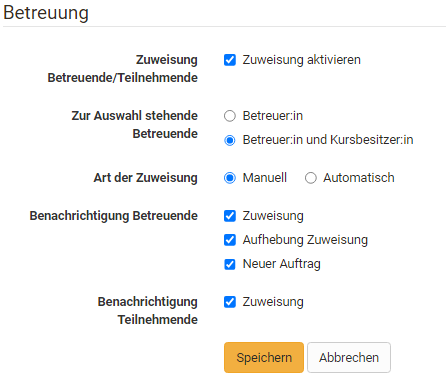
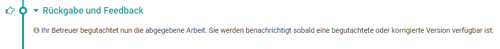
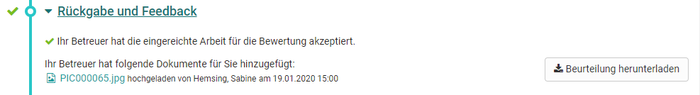
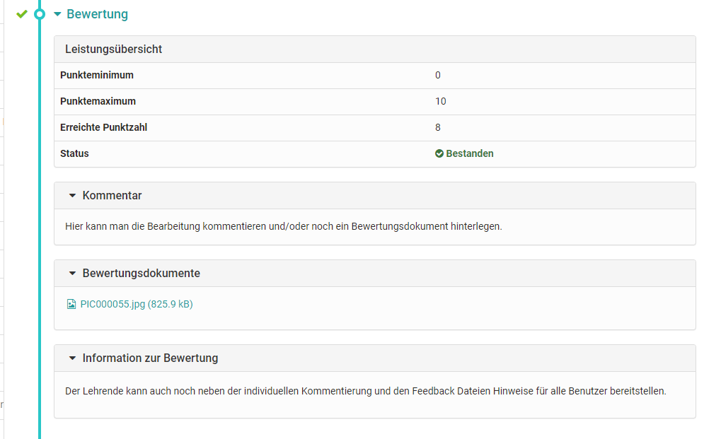

# Course Element "Task" {: #course_element_task}

## Profile

Name | Task
---------|----------
Icon | { class=size24 }
Available since | New edition with release 10.3
Functional group | Assessment
Purpose | Modeling of complex task workflows with configurable substeps such as submission of solution documents, feedback and revision loop, provision of sample solution and assessment
Assessable | yes
Specialty / Note | also available as group task

## General

Coaches can use the Task course element to organize actions and submission tasks. Learners upload their submissions to the OpenOlat course and receive feedback or assessment from the teacher. Revisions can also be requested. Sample solutions can also be provided using this course element.

The central configuration of the course element takes place in the first step in the tab "Workflow". Here you determine which of the following options you want to use:

* **Task Assignment**: assign tasks to course participants or groups.
* **Submission**: Learners should have the opportunity to submit tasks. This is where course participants create their solutions or upload them. 
* **Review and Correction**: this is where course participants will find their tasks corrected as well as requests for revisions.
* **Revision Period**: course participants upload their revised documents in this element. You as a coach can place multiple revision requests until the task is considered completed and the revision process closed.
* **Sample solution**: provide course participants with sample solutions of their tasks. You can either create them directly in OpenOlat or upload files.
* **Assessment**: Score, Passed/Failed and feedback can be deposited here individually.

In the tab "Learning path" (or in the tab "Workflow" for conventional courses) you can also define whether the task is mandatory or voluntary. Mandatory tasks have to be completed and will be collected after the set deadline and handed over to the coach for evaluation. In the case of optional tasks, the user can decide for himself if he wants to work on them. Furthermore, optional tasks are _not_ collected after the deadline.

!!! info "Note"

    The functionality and structure of the course elements "Task" and "Group task" are identical.

## Configurations

The tasks of a course are created and configured in the course editor.

The tabs "Title and description" and "Layout" can be found for all course elements. Here you can store information about the course element and configure its display. In the following, the other central tabs for the course element Task will be explained.

### Tab "Learning path"

This tab is only available in the Learning path course.

Here you define whether the execution of the task is obligatory or voluntary or if the course element should hidden. Obligatory tasks are taken into account in the progress display, voluntary ones are not.

The release date can be used if the course element is to be opened and started only on a certain date. However, the course element itself is already displayed in the course structure.

The time entered under "To be edited by" refers to the deadline for picking up or starting the course element Task, not to the deadline for file upload (see tab Workflow).

In the case of the processing time, the estimated time a user needs to process the course element can be entered. An entry is especially relevant if the progress in the course refers to the processing time of the course elements (see Administration -> [Settings](../learningresources/Course_Settings.md) -> Tab "Execution").

The Learning Path tab also defines which criterion must be met for the task to be considered "completed". The following options are available:

{ class="shadow" }

* **Visit course element**: User has clicked on the course element.
* **Confirmation by participant:** User has clicked on the "I've read the content" button
* **Score**: The user has achieved at least the specified score while completing the task.
* **Passed**: The user has fulfilled the "passed" requirements configured in the "Grading" tab or the task has been manually set to passed by the coach.
* **Execution done**: All steps of the task flow were run through.

!!! info "Traditional courses"

    Traditional courses do not have the "Learning Path" tab and instead have the "Visibility" and "Access" tabs, including expert mode.

### Tab "Workflow"

This is the central tab for configuring the course element Task. Here you can define which individual elements of the task are required in general. Should a concrete task be stored in the course element or will the user find the task somewhere else? Should the user hand in a document? Should there be feedback from the teacher? Should the user be able to revise a submission if necessary? Should a sample solution be provided? Should a score or passing be possible? Should certain learners be assessed by certain coaches?

Simply activate the elements you need and configure the relevant tabs in the next step.

The task assignment, submission, late submission and sample solution steps can be configured with a deadline, with the assignment and submission open until that specific date, whereas the sample solution won't be available before the respective date. 

The user is shown both the normal submission deadline and the late deadline or the deadlines that are still in the future. The late submission is also displayed to the coach or course owner in the assessment flow.

A sample solution can be provided for all participants or only those who have completed the task from the date entered.

Instead of using a fixed calendar date, relative dates are available too, resulting in deadlines dependent on participant activities, such as a first course launch. All defined dates can be adapted individually, e.g. if a participant needs more time according to special circumstances. This is possible for all workflow steps. If the submission deadline is extended, the task will be opened again automatically. A date for late submission is also possible.

If sample solutions are activated, you can also define here whether coaches are allowed to add and edit documents.

In the "Coaching" section of the Workflow tab, participant-dependent coaching can be activated and configured.

However, the differentiated assignment of persons takes place when the course editor is closed.

#### Specifics group task:
In the group task, you additionally define in the "Task type" section for which groups or learning areas the task module is accessible. In return, the tutor assignment in the "Workflow" tab is omitted for the group task, since this assignment results automatically from the coach assignment of the group.

!!! warning "Warning"

    Changing the workflow will delete the corresponding elements from the workflow for all members or groups.
    
    When changes are made to the workflow, such as removing the assignment, all participants or groups in the course will have that component of the workflow removed. The information about already selected tasks is then no longer visible. However, if the workflow component is inserted again, this information will be accessible again.

    However, if you add the assignment step later and a member or group is already further into the task, then they don't have to choose an assignment anymore.

### Tab "Assignment"

In the "Assignment" tab you can

**a)Upload files**

Upload tasks created outside of OpenOlat (upload assignment)
Auch kann eine Zip-Datei mit mehreren (verschiedenen) Aufgaben hochgeladen und jede Datei mit einem passenden Titel und einer Beschreibung versehen werden.

**Create files in differente formats**

Create files directly in OpenOlat. 
Welche Formate genau zur Verfügung stehen hängt davon ab welche von der OpenOlat Administration aktiviert wurden. Meist steht mindestens ein HTML-Editor zur Verfügung. Aber auch die Erstellung von Word, Excel, PowerPoint sowie seit :octicons-tag-24: Release 18.1.  Diagrammen oder Whiteboards ist möglich. Zusätzlich können eine spezifische Video- oder ab :octicons-tag-24: Release 18.1. auch eine Audio-Aufgabe erstellt werden.

If a task is created with the internal OpenOlat HTML editor, multiple files such as images or PDF files can be provided by first uploading them in the HTML editor and then linking them in the corresponding html page. Such a task will then be downloaded in .zip file format as well. If the HTML editor is used, the stored title is automatically used as the file name. However, this can be changed at any time.

In the section "Type of assignment" you determine whether a course participant is offered all available tasks for selection or whether a task is automatically assigned to him/her by random selection.

!!! info "Multiple files"

    If multiple files are stored in the Task tab, they will be considered as multiple different tasks. It is _not_ a task with several complementary files.

Select in the field "Type of drawing" if several course participants can solve the same task or if each task or if each student should solve a different task. If the task is selected manually, you can further specify in the "Preview" field whether the course participants are allowed to view the task before selecting it.  
If course participants must all work on different tasks, you have to offer at least the same number of tasks as there are course participants.

!!! info "Hint"

    If the course element contains only one task, manual selection is not very useful. In this case, it is best to use the automatic assignment.

In the field "Message for user" you can provide general information for all course participants regarding your tasks.

!!! info "Additional document editors"

    If additional document editors are activated in the administration, additional file formats can also be created. For example, if Only Office is used, Word, Excel or PowerPoint files can also be created. The same applies to the creation of other (feedback) files.

In the setting manual choice, if a course participant choses by incident a wrong or not-wanted assignment, it can be reset in the [assessment tool](../learningresources/Assessment_tool_overview.md) by the course owner.

{ class="shadow" }

The assignment is not reset automatically. The participant gets the opportunity to undo all pervious steps.

{ class="shadow" }

!!! warning "Group task"

    In group tasks only one task can be chosen by the group. As soon as one member picks a task, this choice counts for all group members.

### Tab "Submission"

Determine how participants are allowed to hand in documents and how many in the segment "Submission configuration".

Submitting **with the embedded text editor** allows the creation of HTML documents directly in the course element. If other document editors are integrated in OpenOlat, additional formats can also be created. If only the option **Upload files** is enabled, course participants will have to have their documents ready for upload in an established file format. Enter a number in the field "Max. number of documents" in order to restrict the number of documents uploaded.

It is now also possible to accept **video recordings** via webcam as a delivery. In the "Submission" tab, you can determine the maximum length of the recording as well as the video quality level. This allows learners to submit a video statement directly instead of a written document. eit :octicons-tag-24: Release 18.1. können auch Audio-Dateien zur Abgabe ausgewählt werden. 

Activate **"Task as template"** if learners should use the stored task file as a basis for their work, for example if the task contains a pre-structured table to be filled in.

!!! Info "Note"

    In order to use the template, editing in the corresponding editors must also be enabled by the OpenOlat administrators.  

In the "Submission confirmation" segment you will find the standard phrase to confirm that course participants have submitted their solutions successfully. This text can be adapted if necessary. The option "Send text additionally as e-mail" means that your text will be sent by e-mail as well. In group tasks all members get an e-mail confirmation.

### Tab "Revisions and feedback"

Here you can define the minimum and maximum number of return documents.

### Tab "Grading"

Here you define how each course participant shall be assessed. Should there be points? Should there be a pass/fail for the course element? Should the point evaluation be linked to a rating scale? Should it be possible to provide further individual comments or documents? Decide in each case what is suitable for your scenario.

By default a tutor can assess tasks by means of "Passed/failed". Passing can either be defined manually by the coach or, if points are also awarded for the task, refer to a specific score.

If points are awarded, the minimum and maximum number of points must be specified. In addition, you can then also select the "Evaluation with rating/grades" option. In this way, certain rating scales such as levels, grades, (competence) levels or labels can be assigned to the respective points. The available rating scales are defined by the OpenOlat administrator and can be selected via the button "Edit rating scale" and the points can be adjusted in detail. Furthermore, it has to be defined if the assignment to the calculated rating is done manually by the coach or if it should be displayed automatically when the points are changed.

In the tab "Evaluation2 you can also define whether the result of the concrete task element is included in the evaluation of the entire course or should be excluded.

Optionally, you can activate the option for individual comments or individual assessment documents, so that tutors have even more flexible feedback options.

In addition you can provide further information in the fields "Notice for all users" and "Notice for tutors," e.g. some general comment on how to assess course participants.

### Tab "Sample Solutions"

In order to provide all course participants with a sample solution regarding your tasks just either upload appropriate documents or directly create them via the embedded text editor. The sample solution is visible after the coach accepted solution documents for submission.

!!! tip "Hint"

    If you wish to provide assistance in solving the task, you can add additional documents to the task by packing all documents and upload as .zip file in the assignment tab.

### Tab "HighScore"

If the assignment of scores has also been activated for the task, the Highscore tab can also be configured in more detail. You can specify the start date and define which elements are displayed and whether the display should be anonymous.

For more information on this tab, which is available in several course elements, see [here](../learningresources/Course_Elements.md).

### Tab "Reminders"

If required, create reminders for participants to work on the course element.

For more information on this tab, which is available in several course elements, see [here](../learningresources/Course_Reminders.md).

## Tasks and Group Tasks aus der User-Perspektive

Lernende bzw. Kursteilnehmende finden über die Kursbausteine **Aufgabe** bzw. **Gruppenaufgabe** für sie bereitgestellte Aufgaben und können ihre Bearbeitungen von Aufgabenstellungen über diese Kursbausteine einreichen. 

Via these course elements you can also receive feedback on your submissions, points and sample solutions and you can be shown whether you have passed the task or not. You may not see all of the above because not all options are used for your assignment.

Subscribe to the respective task module to be quickly informed about changes via e-mail.

### Download assigned Task

According to the configuration there are either one or more tasks at your disposal in the step "Assignment" or a task will be assigned to you automatically. If the title of a task file is linked along with several tasks it is possible to first have a look at a task before selecting it. If there is only the "Select" link it is not possible to have a look at it first. A task is automatically assigned as soon as you click on the task before a possible deadline.

If you have selected a task or a task has been assigned to you automatically, click on "Download task" to download or display the task. If you click on the file name of the task, the task will be displayed. You can then download the task repeatedly at any time.

It is also possible that your coach has not stored the task in the course element "Task", but has chosen another location, e.g. a single page or an external page, or has placed the task orally in presence or in an online meeting. In that case the section "Assignment of tasks" will not appear.

### Submit Solution

Schauen Sie sich an welche Optionen zur Abgabe Ihnen zur Verfügung stehen. Je nach Konfiguration durch die Lehrperson können sie entweder Dokumente hochladen, Dateien mit dem OpenOlat Editor erstellen oder auch  kurze Audio- und Video-Aufnahmen direkt in OpenOlat erstellen. Beachten Sie die Optionen bei der Erstellung Ihrer Aufgabenlösung. 

In der Regel wird nur ein Teil der vier Optionen für Sie verfügbar sein.
Laden Sie Ihre Lösung hoch bzw. erstellen Sie sie direkt in OpenOlat und das Dokument wird zwischengespeichert. Die Dokumenten bleiben solange für Sie bearbeitbar bis Sie über die Schaltfläche "Endgültige Abgabe" Ihre Aufgabe einreichen. Sie erhalten eine Bestätigung, dass Sie Dokumente abgegeben haben.

In the submission step, which is now marked as completed with a green checkmark, you will receive an overview of the submitted files. You can still view the files, but you can no longer make any changes.

### Download Review

If you have _not_ yet submitted a solution and the coach has not provided feedback, this area is empty.

If you have submitted a solution and the coach has not yet provided a confirmation, the corresponding information appears:

Once your coach has created a feedback you will find the feedback information in the step "Return and Feedback".

If your editing was insufficient and the coach requests a revision, a corresponding message will also appear and you will have the opportunity to submit a new editing in the "Revision" step. A deadline may be set for this.

### Revise Solution

If you need to make a revision, proceed as explained under "Submission". In the "Revision" section, your coach may also return your work to you several times for correction.

As soon as the task is considered solved, the revision period is closed. At any time, you can see which documents have been submitted by you and your coach and can view them.

### View "Sample Solutions"

Your coach can attach a sample solution to the task, which will become visible at a time he/she determines, but always only after the coach has accepted the solution. Click on the file name or the button "Download sample solutions" to view or download the sample solution.

### Read "Grading" from coach

The assessment may include the following individual information: A performance overview with the status and information on the score, a comment field and evaluation documents. In addition, the coach can also leave general information here.

## Group task

The view for OpenOlat tasks and group tasks is the same. However, all decisions and submissions made during the workflow always apply to the whole group. That's why it is important to coordinate within the group _before_ a final submission is made. At the same time you should take care not to miss a
deadline.

The coach's feedback is also provided here for the entire group. If necessary, the coach can also distribute individual points or feedback within a group task.
