# Course Element "Task" {: #course_element_task}

## Profile

Name | Task
---------|----------
Icon | { class=size24 }
Available since | New edition with release 19
Functional group | Assessment
Purpose | Modeling of complex task workflows with configurable substeps such as submission of solution documents, feedback and revision loop, provision of sample solution and assessment
Assessable | yes
Specialty / Note | also available as [group task](../learningresources/Course_Element_Grouptask.md)

Teachers can use the course element Assignment to organize **file submissions** and **submission assignments**. Learners upload their submissions to the OpenOlat course and receive feedback or an assessment from the teacher. Peer reviews are also possible. Revisions can also be requested or sample solutions provided.

---

## Create task (Author perspective) {: #create_task}

A task is created and configured in the course editor, as with all course elements.

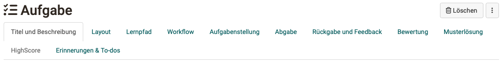{ class="shadow lightbox"}

!!! note "Quick Links: Create tasks (Author perspective)"

    * [Tab Title](#title)  General information about the course element
    * [Tab Layout](#layout)  General settings in the layout
    * [Tab Learning path](#learningpath)  Should the task be voluntary, mandatory or only for certain groups of people?
    * [Tab Workflow](#workflow)  Here you determine which steps the task should contain.
    * [Tab Assignment](#assignment)  Creation or upload of the task, assignment of different tasks or drawing, etc.
    * [Tab Submission](#submission)  Definition of expected submissions (with template?, as audio/video recording?, etc.)
    * [Tab Revisions](#revisions)  E.g. definition of the process for a peer review.
    * [Tab Grading](#grading)  Configuration of the grading, criterion for passing, consideration in the course evaluation, etc.
    * [Tab Sample](#sample)  E.g. provision of a pdf file.
    * [Tab Highscore](#highscore)  Visualization of the results if points are awarded.
    * [Tab Reminders](#reminders)  Preparation of automatic reminder emails and to-dos
    * [Tab Badges](#tab-badges Creation of badges for the processing/completion of the task

### Tab "Title and description"  {: #title}

The layout options are the same as those contained in all course elements.

[Up (Author perspective) ^](#create_task) 
[To the top of the page ^](#course_element_task)

### Tab "Layout"  {: #layout}

The layout options are the same as those contained in all course elements.

[Up (Author perspective) ^](#create_task) 
[To the top of the page ^](#course_element_task)

---

### Tab "Learning path"  {: #learningpath}

!!! info "Traditional courses"

    Traditional courses do not have the "Learning path" tab and instead have the "Visibility" and "Access" tabs, including expert mode.

Here you define whether the execution of the task is obligatory or voluntary or if the course element should hidden. Obligatory tasks are taken into account in the progress display, voluntary ones are not.

The **release date** can be used if the course element is to be opened and started only on a certain date. However, the course element itself is already displayed in the course structure.

The time entered under "**To be edited by**" refers to the deadline for picking up or starting the course element Task, not to the deadline for file upload (see tab Workflow).

In the case of the **processing time**, the estimated time a user needs to process the course element can be entered. An entry is especially relevant if the progress in the course refers to the processing time of the course elements (see Administration -> [Settings](../learningresources/Course_Settings.md) -> Tab "Execution").

The "Learning Path" tab also defines which criterion must be met for the task to be considered "completed". The following options are available:

{ class="shadow" }

* **Visit course element**: User has clicked on the course element.
* **Confirmation by participant:** User has clicked on the "I've read the content" button.
* **Score**: The user has achieved at least the specified score while completing the task.
* **Passed**: The user has fulfilled the "passed" requirements configured in the "Grading" tab or the task has been manually set to passed by the coach.
* **Execution done**: All steps of the task flow were run through.

[Up (Author perspective) ^](#create_task) 
[To the top of the page ^](#course_element_task)

### Tab "Workflow"  {: #workflow}

In the "Workflow" tab, you define which individual elements the task should contain.

!!! tip "Hint"

    Start the configuration in this tab and select the functions you require. The required tabs are then active/inactive and can be configured further.

The following options are available to you:
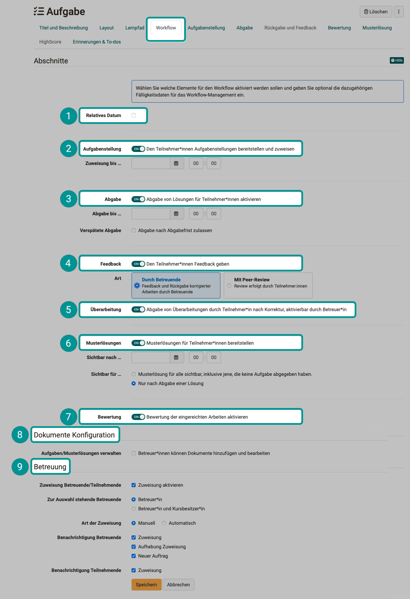{ class="shadow lightbox"}

 **Relative date** 
Instead of entering calendar data, you can also work with _relative data_. Specify how many days after the first course visit or booking the assignment remains open. All set times can also be adjusted individually, e.g. if a learner needs an extension due to certain circumstances. This applies to all process steps. If you extend the submission date, the task is reopened. A late submission date is also possible.

=== "With fixed date"

    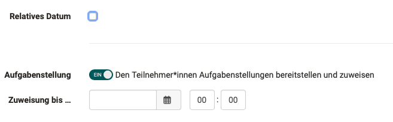{ class="shadow lightbox" }

=== "With relative date"

    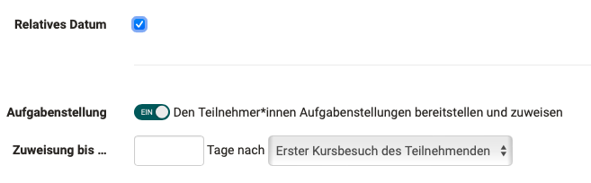{ class="shadow lightbox" }

The changeover to relative data affects the input fields for **Task**, **Submission** and **Sample solution**.

 **Task** 
Should a specific task be stored in the course element or can the user perhaps find the task elsewhere? Should the user submit a document? Should there be feedback from the teacher? Should users be given the opportunity to revise a submission if necessary? Should a sample solution be provided? Should an assessment with points or a pass be possible? Should certain learners be assessed by certain coaches?

Simply activate the things you need and configure the relevant tabs in the next step.

 **Submission** 
The sections Assignment, Submission, Late submission and Sample solution can be given a date. The assignment and submission are available until the date entered.

If late submission is activated and a deadline is set, participants can still submit their solution up to the late deadline. Both the normal submission deadline and the late deadline are displayed for the user, or the deadlines that are still in the future. The late submission is also displayed to the coach or course owner in the assessment flow.

 **Feedback** 
By default, feedback is given by coaches, but it can also be given by the other participants (peer review).

 **Correction** 
The submission of revisions by participants after correction is optional.

 **Sample solution** 
A sample solution can be provided for all participants or only those who have completed the task from the date entered.
If sample solutions are activated, you can also define here whether coaches are allowed to add and edit documents.

 **Assessment** 
Activating this toggle button activates the "Assessment" tab, in which the details of the assessment can be configured.

 **Document configuration** 
This option is only displayed if one of the options "Task" or "Sample solution" has been selected and thus the upload of documents is required. In addition to course owners, coaches can also be allowed to add and edit documents here.

 **Coaching** 
Participant-dependent coaching can be activated and configured in the "Coaching" section of the "Workflow" tab.

* **Assignment of coaches/participants** 
Selecting this checkbox displays the other options for coaches.
The differentiated assignment of persons then takes place when the course editor is closed.

* **Coaches available for selection** 
It can be decided whether, in addition to coaches, course owners should also be assigned to coach participants.

* **Type of assignment** 
The assignment (allocation) of coaches to a participant can be done manually or automatically.

* **Notification of coach** 
Select here in which cases coaches receive a notification by e-mail.

* **Notification of participants** 
Select here whether participants should be informed by e-mail about the assignment to a coach.

!!! warning "Warning"

    Changing the workflow will delete the corresponding elements from the workflow for all members or groups.
    
    When changes are made to the workflow, such as removing the assignment, all participants or groups in the course will have that component of the workflow removed. The information about already selected tasks is then no longer visible. However, if the workflow component is inserted again, this information will be accessible again.

    However, if you add the assignment step later and a member or group is already further into the task, then they don't have to choose an assignment anymore.

!!! warning "Warning"

    If no person has the role of coach among the course members and at the same time course owners do not perform any coach tasks (Workflow tab > "Coach" section > "Coaches available for selection"), then no coach assignment can take place.

!!! info "Note"

    The options displayed in the Workflow tab and selectable by the author can be preconfigured by the administrator. See Admin manual > Modules > Course elements

[Up (Author perspective) ^](#create_task) 
[To the top of the page ^](#course_element_task)

---

### Tab "Assignment"   {: #assignment}

!!! info "Requirement"
    
    The "Task" must have been activated in the "Workflow" tab so that you can now make it available. 

**a) Upload files**

Upload tasks created outside of OpenOlat (upload assignment).
You can also upload a zip file with several (different) tasks and provide each file with a suitable title and description.

**b) Create files in different formats**

Create files directly in OpenOlat. Exactly which formats are available depends on which have been activated by the OpenOlat administration. In most cases, at least one HTML editor is available. But it is also possible to create Word, Excel, PowerPoint and, since :octicons-tag-24: release 18.1, diagrams or whiteboards. In addition, a specific video task or, from :octicons-tag-24: Release 18.1, an audio task can also be created.

If a task is created with the internal OpenOlat HTML editor, multiple files such as images or PDF files can be provided by first uploading them in the HTML editor and then linking them in the corresponding html page. Such a task will then be downloaded in .zip file format as well. If the HTML editor is used, the stored title is automatically used as the file name. However, this can be changed at any time.

!!! info "Multiple files"

    Please note: If multiple files are stored in the Task tab, they will be considered as multiple different tasks. It is _not_ a task with several complementary files.

Select in the field **"Type of drawing"** if several course participants can solve the same task or if each task or if each student should solve a different task.

In the **"Type of draw"** field, select whether several course participants can solve the same task or whether each course participant should solve a different task. If the task is selected manually, you can also specify in the "Preview" field whether the course participants can view the task before selecting it. If each course participant is to solve a different task for "Type of draw", at least as many tasks must be entered as there are course participants who are to solve this task.

!!! info "Hint"

    If the course element contains only one task, manual selection is not very useful. In this case, it is best to use the automatic assignment.

In the field **"Message for user"** you can provide general information for all course participants regarding your tasks.

In the setting manual choice, if a course participant choses by incident a wrong or not-wanted assignment, it can be reset in the [assessment tool](../learningresources/Assessment_tool_overview.md) by the course owner.

{ class="shadow" }

The assignment is *not reset automatically*. The participant gets the opportunity to undo all pervious steps.

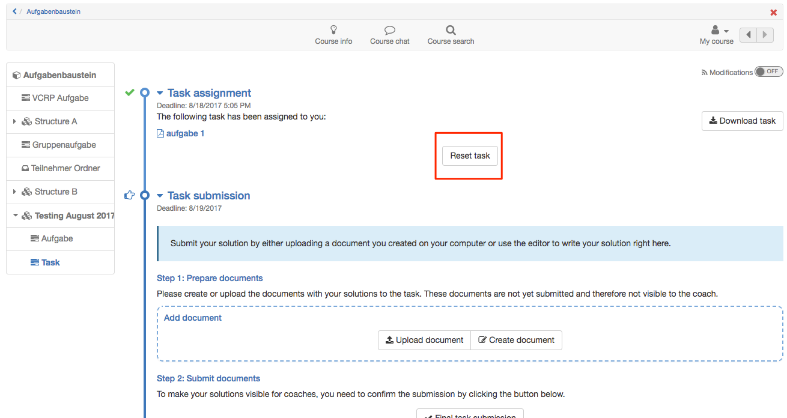{ class="shadow" }

[Up (Author perspective) ^](#create_task) 
[To the top of the page ^](#course_element_task)

---

### Tab "Submission"  {: #submission}

Here you define the type and scope of the submission options for the participants.

!!! info "Requirements"

    In the tab "Workflow"

    * "Submission" must be activated in order to configurated them. 

    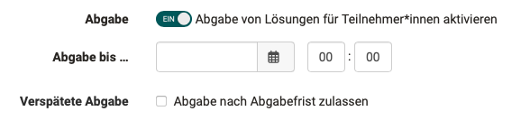{ class="shadow lightbox" }

After activation, you must at least enable users to upload documents and/or use the OpenOlat Editor for submission. 

The following options are available or can be configured in the "Submission" tab:

**"Upload documents"**: In this case, course participants can upload and submit documents created outside of OpenOlat.

**"Submission with OpenOlat Editor**: With this selection, participants can create documents directly in the course element. An HTML editor can be used for this by default. If other document editors are integrated in OpenOlat, documents can also be created in other formats such as Word, Excel, etc.  The creation of drawio diagrams is also possible here.

Activate **"Task is template for submission"** if learners are to use the stored task file as the basis for their work, for example if the task contains a pre-structured table to be filled in. The prerequisite is that this option has been enabled by the OpenOlat administrators.

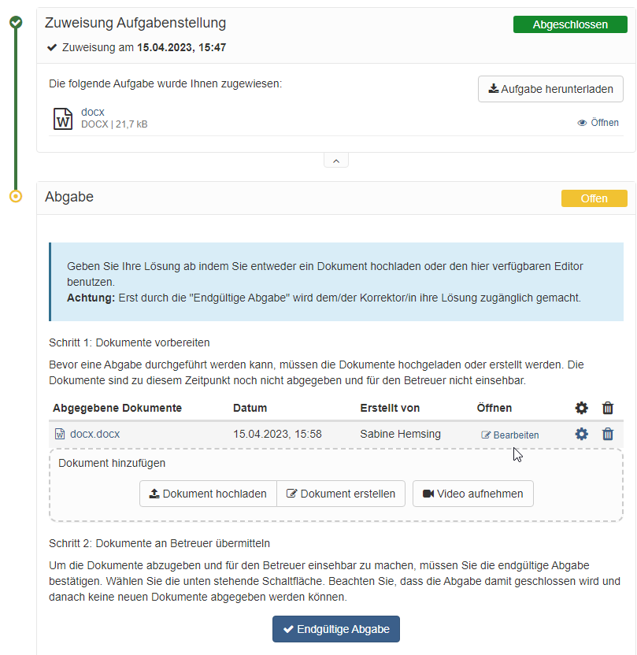

**Allow video recordings**: In this case, learners can create and submit video recordings via webcam. A maximum recording duration and a quality level can also be selected for the videos.

**Allow audio recordings**: In this case, learners can also create and submit audio recordings using the OpenOlat audio recorder. A maximum recording duration and a quality level can also be selected for the audios. 

You can also define the minimum and maximum number of documents for submission. Leave the "Max. number of documents" field blank if you do not want to limit the number of documents. 

Activate the e-mail confirmation so that people who have submitted a task receive a corresponding e-mail. The pre-formulated e-mail text can be further customized if required.

[Up (Author perspective) ^](#create_task) 
[To the top of the page ^](#course_element_task)

### Tab "Revisions"  {: #revisions}

!!! info "Requirements"

    In the tab "Workflow"

    * "Return and feedback" must have been activated so that you can now set this up    
    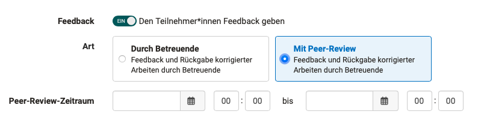{ class="shadow lightbox" }
    * Depending on who is providing the feedback, different options appear in the Return and Feedback tab.

**Revisions by coaches**

If the "By coach" option was selected in the Workflow tab, the minimum and maximum number of return documents that participants are allowed to submit during the "Return and feedback" and "Revision" steps can now be defined in the "Return and feedback" tab.

**Return and feedback by means of peer reviews**

If the "With peer review" option was selected in the Workflow tab, this becomes more complex. The rules for the submission of feedback by other participants can now be defined in the "Return and feedback" tab. The feedback from the reviewers is given in a [form](../learningresources/Form_Element_Rubric.md), usually with the help of a rubric. As the course owner, you provide this review form. 

If the assessment is also activated in the Workflow tab and the points for the peer review are to be taken automatically from the peer review form, the peer review form used must also contain (at least) one rubric element, as points can be awarded automatically via this. Here you can find a [sample form for download](assets/Example_PeerReview_v1_de.zip).

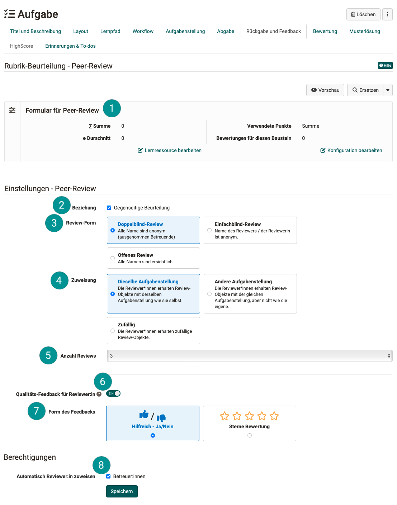{ class="shadow lightbox" }

 **Form** 
A suitable rubric form is required for peer reviews. Here you will find a [sample form](assets/Example_PeerReview_v1_de.zip) (zip file for importing into your OpenOlat).

 **Mutual assessment** 
If mutual assessment is permitted, participants can assess each other, but do not have to.

 **Review-Form** 
Regarding the **visibility of names**, you can choose one of the following forms as author:  
\- Double blind review: All names are anonymous (except coaches). 
\- Single blind review: The name of the reviewer is anonymous. 
\- Open review: All names are visible.

 **Assignment** 
As the author, you determine here **which tasks** the reviewers receive for review:  
\- **The same assignment**: For example, if a person has drawn and completed task 1, they will only be given task 1 to review. They do not then have to familiarize themselves with another topic. 
\- **Other assignments**: A review must be carried out for a different task than the task that you have drawn yourself. If several reviews are to be made, however, all reviews must always be made for the same task type. 
\- **Random**: The reviewers are given random tasks to review.

 **Number of reviews** 
Here you specify how many reviews are planned for each participant. However, depending on the number of participants, the actual number of reviews to be completed may vary. Ideally, the number of reviews to be completed should correspond to the number of reviews you receive from others.  

 **Quality feedback for reviewers** 
Participants can be given the opportunity to provide their reviewers with feedback after receiving reviews. Whether the review received was helpful can be indicated with the thumb symbol or with stars. 

 **Form of feedback** 
If "Quality feedback for reviewers" has been activated, you can select which symbols should be used to give the reviewers this feedback ("Helpful? Yes/No" and star rating). 
The "thumbs up" / "thumbs down" symbol has proven to be recommendable.

 **Automatically assign reviewer** 
Authors see all participants of a course, but coaches may only see their coached group. 
In order for coaches to be able to view the reviews of the supervised participants, reviews must be assigned within their groups. (Only then can coaches follow all reviews). 
If the "Automatically assign reviewers" option is selected, coaches will only see their group, but review assignments will be assigned among all participants. Coaches will then see that a coached person has received a review from someone in the other group. However, the name of the person who did the review is not visible.  
In order for coaches as well as course owners to be able to trigger the automatic reviewer assignment, the corresponding option must be selected in the "Revisions" tab, "Authorizations" section.

There is a **Participant Review** and an **Expert Review**, each with its own form. However, the participant review can also (additionally) be completed by coaches. 

* Coaches can do a participant review, for example, if a participant has received too few reviews. 
* Even if a participant review has been marked as "not valid", coaches can fill out a form as a replacement if necessary.
* An expert form for coaches may contain different criteria than the form for participants. In this case, it may also make sense for coaches to be able to use both forms.

!!! info "Note"

    Course owners can configure which review counts. (Only that of the participants, only that of the experts or both.) This configuration should be taken into account when planning a peer review. See also [How do I conduct a peer review? >](../../manual_how-to/peer_review/peer_review.md) 

**Further informations**

[Sample form for peer review (zip file for import into your OpenOlat) >](assets/Example_PeerReview_v1_de.zip) 
[How do I create a form learning resource? >](../../manual_how-to/create_a_form/create_a_form.md) 
[How do I carry out a peer review? >](../../manual_how-to/peer_review/peer_review.md) 

[Up (Author perspective) ^](#create_task) 
[To the top of the page ^](#course_element_task)

---

### Tab "Grading"  {: #grading}

Here you define _how_ each course participant shall be assessed. Should there be points? Should there be a pass/fail for the course element? Should the point evaluation be linked to a rating scale? If so, with which? Should it be possible to provide further individual comments or documents? Decide in each case what is suitable for your scenario.

A form with a rubric can also be used for the assessment. The points can then be taken from the rubric form for the assessment of the course element.   The rubric form included here in the "Assessment" tab is to be distinguished from the rubric form used in the "Return and feedback" tab for peer reviews.

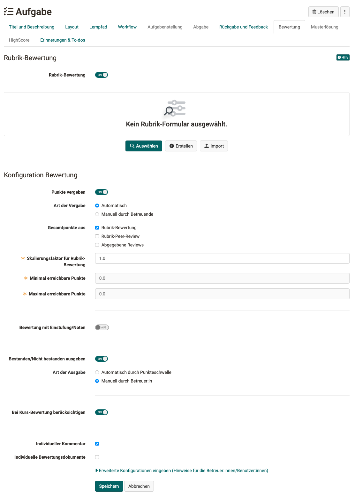{ class="shadow lightbox" }

#### Awarding points

If scoring has been activated, the minimum and maximum number of points must be specified. You can then also select the "Assessment with grading/marks" option and configure it further. The respective points can be assigned specific evaluation scales such as levels, grades, (competence) levels or labels. The available rating scales are defined by the OpenOlat administrator and can be selected via the "Edit rating scale" button and the points can be adjusted in detail. It must also be defined whether the assignment to the calculated classification is made manually by the coach or whether it should be displayed automatically when points are changed.

#### Total points from...

The total points can be calculated from one or more sources:

* **Rubric-assessment**: If a rubric form is used in the "Assessment" tab, points can be transferred from there.
* **Rubric-peer-review**: A peer review uses the rubric form, which is included in the "Return and feedback" tab.
* **Submitted reviews**: Additional points can be awarded to the person for reviewing other participants (points per completed review, configured below this selection as soon as the option has been selected).

#### Passed/Failed
If activated, passing can either be done manually by the coach or automatically. For automatic assessment, the points allocation must be activated and a points threshold for passing must be specified.

#### Consider in course assessment
In the "Assessment" tab, you can also define whether the result of the specific task module is included in the assessment of the entire course or whether it should be excluded.

#### Individual feedbacks
Optionally, you can also activate the option for individual comments or individual assessment documents so that coaches have even more flexible feedback options.

#### Hints
If you open the extended configuration, further configurations are available. Here you can store information texts for all learners and/or for all coaches.

[Up (Author perspective) ^](#create_task) 
[To the top of the page ^](#course_element_task)

### Tab "Sample Solutions"  {: #sample}

In order to provide all course participants with a sample solution regarding your tasks just either upload appropriate documents or directly create them via the embedded text editor. The sample solution is visible after the coach accepted solution documents for submission.

!!! info "Requirements"

    In the tab "Workflow"

    * "Sample solutions" must be activated in order to be configurated.
  
    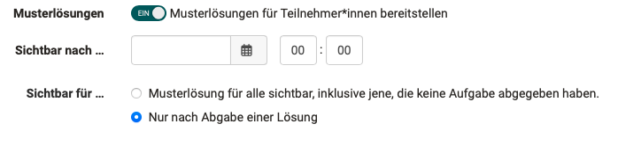{ class="shadow lightbox" }

By default, the sample solution is only visible once the documents submitted by the participant have been accepted by the coach.

!!! Tip "Hint"

    If the participants are to receive help with the task in advance, upload it together with the task as a ZIP document or use the message field (see "Task" tab).

[Up (Author perspective) ^](#create_task) 
[To the top of the page ^](#course_element_task)

---

### Tab "HighScore" {: #highscore}

If points are awarded for the task, you can visualize them with the HighScore options. 

The prerequisite is that the awarding of points has been activated for the task in the "Assessment" tab. Only then does the Highscore tab become active and can be configured. It can be determined,

* Which elements are displayed,
* if the depiction should be anonymous,
* the time from which the high score list should be visible.

For more information on this tab, which is available in several course elements, see [here](../learningresources/Course_Elements.md).

[Up (Author perspective) ^](#create_task) 
[To the top of the page ^](#course_element_task)

### Tab "Reminders & To-dos"    {: #reminders}

With the reminder function, you can send [Reminders](../learningresources/Course_Reminders.md) to course members in the form of an e-mail and generate automatic [To-dos](../learningresources/Course_todos.md) for the task. To-dos are stored for course participants in the personal menu under "[To-dos](../personal_menu/To-Dos.md)".

If the automatic creation of to-dos is activated (from :octicons-tag-24: Release 18.2.), learners can see the current status (step) of the corresponding worklow under "My course" -> To-dos and thus quickly recognize whether or which actions currently need to be taken by them. In addition, these to-dos also appear in the user's personal to-dos in the personal tools. 

The to-dos therefore help learners to keep track of their tasks.
Further information on To-dos can be found [here](../basic_concepts/To_Dos_Basics.md).

!!! note "Hint"

    Whether coaches are also allowed to edit to-dos is defined in the course administration settings. To do this, go to the "Options" tab and activate the corresponding checkmark.

[Up (Author perspective) ^](#create_task) 
[To the top of the page ^](#course_element_task)

---

### Tab Badges

If the course owner has activated the assignment of badges under **Administration > Settings > Assessment tab > Badges section**, the ‘Badges’ tab is displayed in the course editor for this course element and a specific badge can be created for this course element.

[Up (Author perspective) ^](#create_task) 
[To the top of the page ^](#course_element_task)

!!! info "Hint"

    The functionality and structure of the course elements "Task" and "[Group task](../learningresources/Course_Element_Grouptask.md)" are similar.

---

## Complete tasks (Course participant perspective)  {: #process_task}

All steps of a task (workflow) are displayed to course participants directly in the course element, depending on the configuration of the course element. Once a step has been completed, the next step is displayed and accessible.

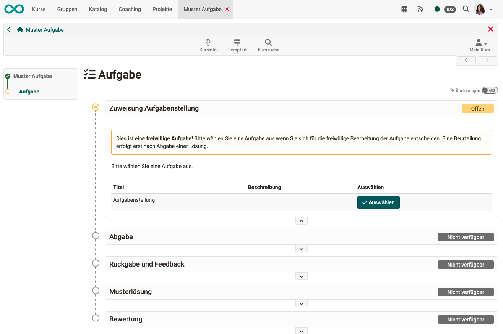{ class="shadow lightbox" }

!!! note "Quick Links: Complete tasks (Course participant perspective)

    * [Download assigned tasks](#process_task_download)
    * [Who coaches me?](#process_task_my_coach)
    * [Submit solution](#process_task_solution)
    * [Feedback](#process_task_solution)
    * [Results of a peer review](#process_task_view_reviews)
    * [Rework task](#process_task_rework)
    * [View sample solution](#process_task_view_example)
    * [Read "Assessment" of coach](#process_task_view_coach_assessment)

!!! info "Hint"

    Subscribe to the respective task module to be informed quickly by e-mail about changes.

### Download assigned tasks {: #process_task_download}

Depending on the configuration, one or more tasks are available for selection in the **"Assign task"** step or a task is automatically assigned to you. If the title of the task file is linked for several tasks, you can view the task before selecting it. If you only have the "Select" button, you cannot view the task in advance. A task is automatically assigned as soon as you click on the task before a possible submission deadline.

If you have selected a task or a task has been automatically assigned to you, click on "Download task" to download or display the task. If you click on the file name of the task, the task is displayed. You can then download the task again at any time.

It is also possible that your teacher has not stored the task in the course element "Task", but has chosen a different location, e.g. another course element, an HTML page, an external website or has set the task orally in presence or in an online meeting. In this case, the "Assign task" section does not appear.

[Up (Participant perspective) ^](#process_task) 
[To the top of the page ^](#course_element_task)

### Who coaches me? {: #process_task_my_coach}

In course settings with a large number of participants, they are often coached by several teachers. As a participant, you will be assigned a coach.

As a participant, you will see the coach assigned to you above the task. If no coach is displayed, no one has been assigned to you yet.

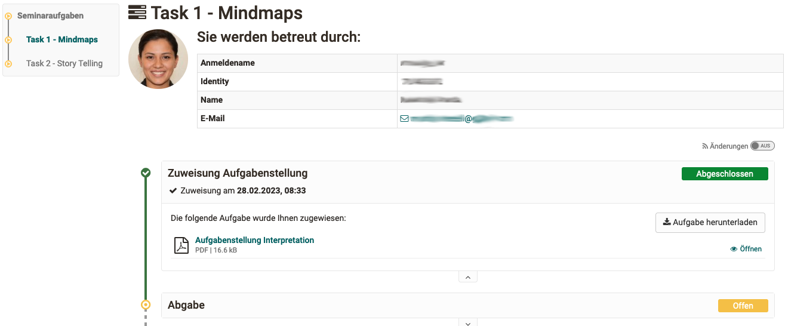{ class="shadow lightbox" }

With the implementation of peer review, participants have also been able to give each other feedback on the tasks they have completed since Release 19.

[Up (Participant perspective) ^](#process_task) 
[To the top of the page ^](#course_element_task)

### Submit solution {: #process_task_solution}

In the **"Submission"** area, you have the option of submitting your solution. Depending on the teacher's configuration, you can either upload documents, create files with the OpenOlat Editor or create short audio and video recordings directly in OpenOlat.  

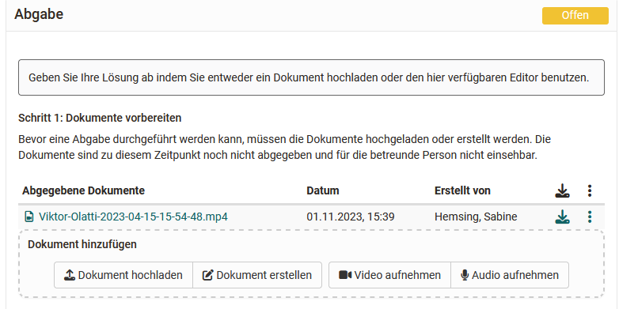

As a rule, only some of the four options will be available to you.
Upload your solution or create it directly in OpenOlat and the document will be saved temporarily. The documents remain editable for you until you submit your task via the "Final submission" button. You will receive confirmation that you have submitted documents.

In the submission step, which is now marked as completed with a green tick, you will receive an overview of the submitted files. You can still view the files but can no longer make any changes.

[Up (Participant perspective) ^](#process_task) 
[To the top of the page ^](#course_element_task)

### Feedback {: #process_task_feedback}

If you have _not_ made a submission yet and the coach has not provided any feedback, this area will be empty.

If you have submitted an edit and the coach has not yet created a feedback, the corresponding information will appear.

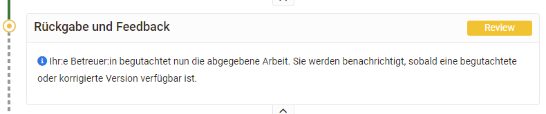

As soon as your coach has created feedback, you will find the feedback information in the "Return and feedback" step.

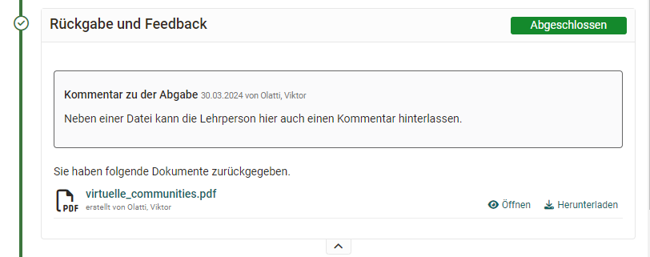

If your editing was not sufficient and the coach requests a revision, a corresponding message also appears and you have the option of submitting a new edit in the "Revision" step. A deadline may be set for this.

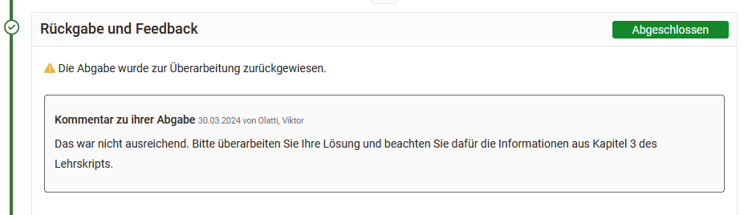

[Up (Participant perspective) ^](#process_task) 
[To the top of the page ^](#course_element_task)

### Carry out a peer review {: #process_task_make_reviews}

If a peer review was planned for the task, you will now be assigned review tasks. You are to assess the documents submitted by other course members. The documents you are to review can be assigned to you automatically or manually by coaches. 

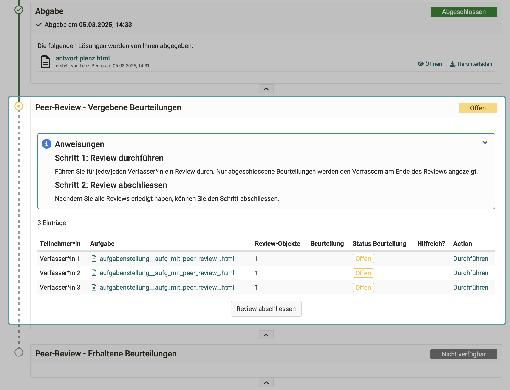{ class="shadow lightbox" }

Once you have completed all the reviews, finalise this step by clicking on the ‘Complete reviews’ button.

[Up (Participant perspective) ^](#process_task) 
[To the top of the page ^](#course_element_task)

### View results of a peer review {: #process_task_view_reviews}

If a peer review has been scheduled, you will see an overview of the assessments you have given and received.

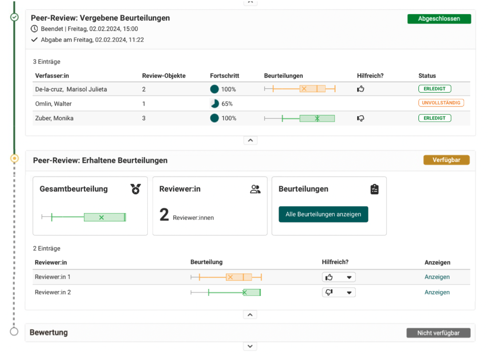{ class="shadow lightbox" }

[Up (Participant perspective) ^](#process_task) 
[To the top of the page ^](#course_element_task)

### Rework task {: #process_task_rework}

If you need to make a revision, proceed as explained under "Submitting a solution" (submission). In the section **"Revision"**, your coach may also return your work to you several times for correction.

As soon as the coach considers the task to be completed, he or she will close the revision period. At any time, you can see which documents have been submitted by you and your coach and can view them.

[Up (Participant perspective) ^](#process_task) 
[To the top of the page ^](#course_element_task)

### View sample solution {: #process_task_view_example}

Your lecturer can attach a **sample solution** to the assignment, which will be visible at a time specified by him/her, but only _after_ your solution has been accepted by the coach. Click on the file name or the “Download sample solutions" button to view or download the sample solution.

[Up (Participant perspective) ^](#process_task) 
[To the top of the page ^](#course_element_task)

### Read "assessment" of coach {: #process_task_view_coach_assessment}

The **Assessment** area includes automatically generated information on the performance overview with status, score, classification of the selected assessment scale, depending on the configuration of the course element. On the other hand, coaches can store feedback in the comments field as well as (assessment) documents in the assessment area. 

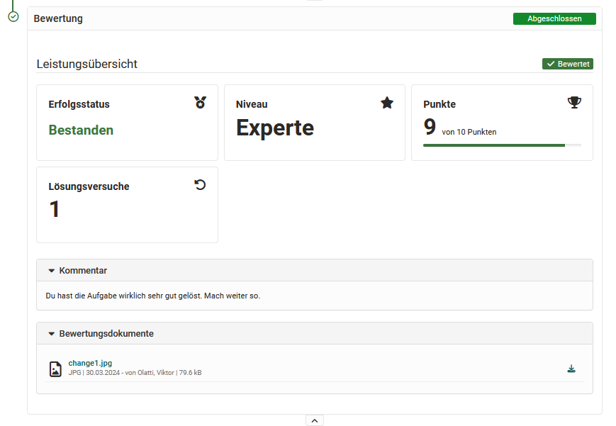

[Up (Participant perspective) ^](#process_task) 
[To the top of the page ^](#course_element_task)

---

## Coaching tasks (Coach perspective) {: #coach_task}

!!! note "Quick links: Coaching tasks (Coach perspective)

    * [Check assignment of tasks](#coach_task_peer_review_check_assignment)
    * [Check submission](#coach_task_peer_review_check_delivery)
    * [Review by coach](#coach_task_peer_review_by_coach)
    * [Rules of a peer review](#coach_task_peer_review_rules)
    * [Supervise peer review](#coach_task_peer_review_supervise)
    * [Manual assigning of peer reviewers](#coach_task_peer_review_assign_manually)
    * [Assign peer reviewers automatically](#coach_task_peer_review_assign_automatically)
    * [Close peer review](#coach_task_peer_review_close)
    * [Coach participates in peer review](#coach_task_peer_review_reviewer_participates)
    * [Expert review](#coach_task_peer_review_expert)
    * [Task assessment](#coach_task_peer_review_evaluate)

### Check assignment of tasks {: #coach_task_peer_review_check_assingment}

The following questions and control tasks arise for coaches:

* Has an automatic assignment been made?
* Have all participants drawn a task?
* Who drew which assignment? => Is there a need to correct the assignments?
* Who has not yet drawn a task? => Why? => The persons can be selected in the list and contacted by e-mail. => Possibly an extension should be made so that one person can still draw a task. (Automatic assignment is not possible.)

[Up (Coach perspective) ^](#coach_task) 
[To the top of the page ^](#course_element_task)

### Check submission {: #coach_task_peer_review_check_delivery}

* Was the submission made within the deadline?
* Was there a late submission?
* Is there a reason for an individual extension for the submission? An extension can be granted for assignment, submission and solution viewing. An extension of the revision period is not possible, as the revision period is already a type of extension.
* If participants have accidentally submitted or forgotten something, the submission option can be reopened.
* Is it necessary to withdraw the tasks prematurely? This may be the case in the event of attempted fraud, for example. 
* Is the submission deadline open and should a manual collection take place? (If a submission deadline has been set, an automatic collection will always take place if someone has not yet submitted the return themselves).

!!! note "Note"

    An **extension** can also be set up by coaches. The **delivery deadline**, on the other hand, can only be set by course owners.

!!! note "Note"

    No deadline can be set for courses that run indefinitely. An alternative in this case may be a certificate and recertification.

[Up (Coach perspective) ^](#coach_task) 
[To the top of the page ^](#course_element_task)

### Review by coach {: #coach_task_peer_review_by_coach}

A review is only possible if the participant has submitted.

A review is also possible if it has already been submitted before the deadline.

If a time period has been set for the review (by the owner), the review cannot be carried out.

[Up (Coach perspective) ^](#coach_task) 
[To the top of the page ^](#course_element_task)

### Rules of a peer review {: #coach_task_peer_review_rules}

In a peer review, the participants in a course give each other feedback or an assessment. The feedback can be of a general nature (e.g. in a text field) or also include an assessment with points.

It is not necessary for each participant to review all other participants. It can be determined for how many other people a review must be made.

You can also configure whether the reviewers see the names of the assigned persons, whether only their own name is visible as a reviewer or whether it is fully disclosed who is reviewing whom.

As a coach, you monitor the mutual reviews and can also intervene if necessary.

[Up (Coach perspective) ^](#coach_task) 
[To the top of the page ^](#course_element_task)

### Coach peer review {: #coach_task_peer_review}

The procedure for a peer review was determined by the course owner. As a coach, you will find the options for your supervision task accordingly.

* You can see the status of the peer reviews in an overview. In two tabs you will find the assessments received and awarded by the participants.
* As a coach, you can manually assign reviewers.

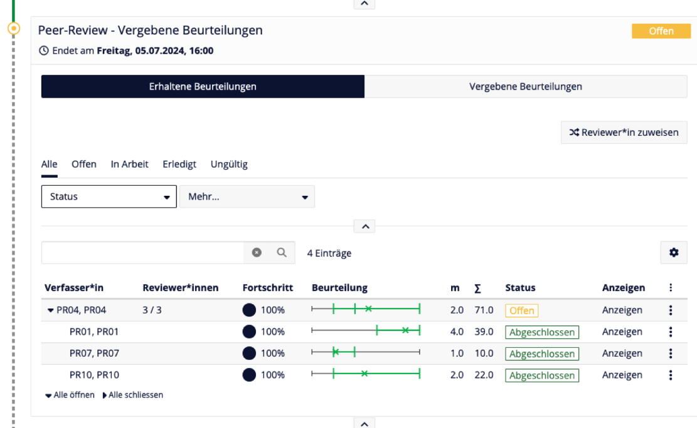{ class="shadow lightbox" }

!!! note "hint"

    Course coaches only see groups in which they themselves are members. If a peer review is to be carried out by members of other groups, the evaluations of these participants are not fully visible to course coaches.

[Up (Coach perspective) ^](#coach_task) 
[To the top of the page ^](#course_element_task)

### Manual assignment of peer reviewers {: #coach_task_peer_review_assign_manually}

If you as a coach want to determine who receives a review from whom, you can make the assignment yourself.

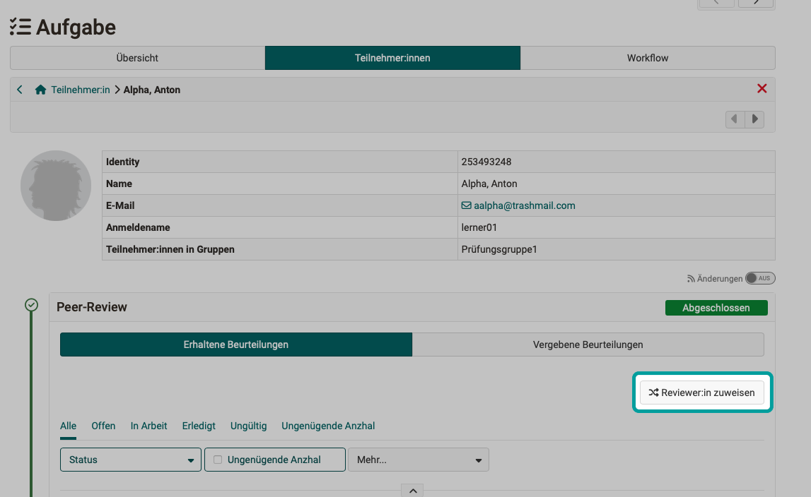{ class="shadow lightbox" }

[Up (Coach perspective) ^](#coach_task) 
[To the top of the page ^](#course_element_task)

### Automatic assignment of peer reviewers {: #coach_task_peer_review_assign_automatically}

The assignment of peer reviewers to participants can also be carried out automatically by OpenOlat. It is carried out according to the set rules. (E.g. defined number of people to be reviewed per participant). Even if manual assignments have already been made by coaches, these are taken into account in the remaining automatic assignments.

The automatic assignment process must be triggered by course owners or course coaches.

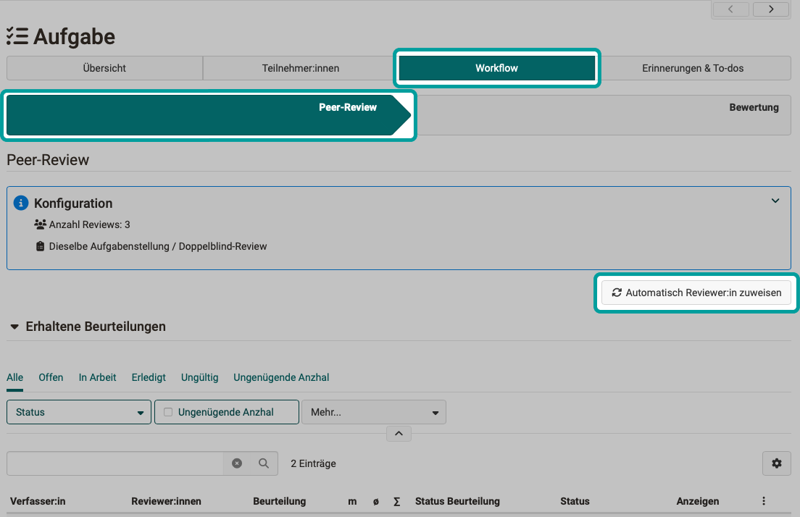{ class="shadow lightbox" }

!!! info "Hint"

    In order for coaches to be able to trigger the automatic reviewer assignment, the corresponding option must have been set up by the course owner.

!!! info "Hint"

    The "Automatically assign reviewer" button is not deactivated after an assignment has been made and is still available. The reason for this is that participants can still be added later or someone has received an extension.

[Up (Coach perspective) ^](#coach_task) 
[To the top of the page ^](#course_element_task)

### Close peer review {: #coach_task_peer_review_close}

When a participant has completed all his/her reviews, the reviews must be submitted. Only then do they count. The other participants will only be judged with completed reviews.

If the specified time for reviews has expired, participants can no longer make reviews.

If participants have completed reviews but not submitted them, these reviews cannot be collected by coaches. The reason: The coaches cannot know whether a review that has not been completed should already be final and what quality the review has at the current time.

Coaches cannot complete all the reviews. They simply have to wait until the period for the reviews has expired.

It is not possible for a peer review to be followed by a revision and then a second review.

[Up (Coach perspective) ^](#coach_task) 
[To the top of the page ^](#course_element_task)

### Coach participates in peer review {: #coach_task_peer_review_reviewer_participates}

It is possible for coaches to participate in the review in the same way as participants. They then have the role of a participant for the review, so to speak, and use the same criteria. 

In this case, the coaches' review counts in the same way as the reviews of the other participants.

**Example 1:** 
One reviewer is absent due to illness and the coaches steps in as reviewer. This ensures that everyone receives the same number of reviews.

**Example 2:** 
A coach sees that a reviewer has performed a review incorrectly or poorly. The coach then marks this review as invalid and makes a review themselves so that this person has received the same number of reviews again.

**Example 3:** 
There are two completely contradictory reviews from the peer review. The supervisor therefore provides a mediating or corrective review. (In contrast to an expert review, the same assessment grid is used here).

[Up (Coach perspective) ^](#coach_task) 
[To the top of the page ^](#course_element_task)

### Expert review {: #coach_task_peer_review_expert}

An expert review is carried out by coaches after a peer review has taken place.

It is analogous to the [course element "Assessment"](../learningresources/Course_Element_Assessment.md#rubric-assessment), with a stored [rubric form](../learningresources/Forms_in_Rubric_Scoring.md). (In other words, a different questionnaire than the peer reviewers used).

[Up (Coach perspective) ^](#coach_task) 
[To the top of the page ^](#course_element_task)

### Task assessment {: #coach_task_peer_review_evaluate}

If a peer review has been carried out, the results do not necessarily have to be included in the **assessment**. Reviews and peer reviews without an assessment are also possible. You can choose, 

* whether the reviews from a peer review are included in the assessment,
* are not included in the assessment,
* or only the expert review counts.

[Up (Coach perspective) ^](#coach_task) 
[To the top of the page ^](#course_element_task)

## Further information

[Course element "Group task" >](../learningresources/Course_Element_Grouptask.md) 
[Course element "Portfolio task" >](../learningresources/Course_Element_Portfolio_Task.md) 
[Course element "Assessment" >](../learningresources/Course_Element_Assessment.md#rubric-assessment) 
[Rubric forms >](../learningresources/Forms_in_Rubric_Scoring.md) 
[How do I perform a peer review? >](../../manual_how-to/peer_review/peer_review.md) 

