# Kursbaustein "Test"  {: #course_element_test}

## Steckbrief

Name | Test
---------|----------
Icon | :o_icon_o_iqtest_icon:
Funktionsgruppe | Wissensüberprüfung
Verwendungszweck | Kursbaustein zum Einbinden einer Test-Lernressource in einen Kurs
Bewertbar | ja
Spezialität / Hinweis |

Mit dem Kursbaustein "Test" binden Sie eine OpenOlat Lernressource "Test" in Ihren Kurs ein. Ein Test wird im Kurs zur Leistungsüberprüfung oder als Quiz verwendet und umfasst diverse Frage-Typen. 

Je nach Fragetyp können eine oder mehrere Antworten angekreuzt, Elemente per drag & drop verschoben, Texte und/oder Zahlen eingefügt, Dateien hinzugefügt, Markierungen oder (sehr einfache) Zeichnungen erstellt werden. Die Auswertung erfolgt dann abhängig vom Fragetyp manuell oder automatisch.

!!! note "Fragetypen"
    Übersicht aller verfügbaren Fragetypen. 
    [Fragetypen](../learningresources/Test_question_types.de.md)

Pro OpenOlat Kurs können auch mehrere Tests für unterschiedliche Zwecke zum Einsatz kommen. Die Resultate der Teilnehmenden werden personalisiert aufgezeichnet.

OpenOlat verwendet das IMS-QTI 2.1 Format für Tests, was einen Austausch mit anderen Test-Systemen und Learning Management Systemen, die diesen Standard ebenfalls unterstützen, gewährt. 

Die zwei zentralen Tabs, in denen Sie Einstellungen für Ihren Test vornehmen, sind "Test-Konfiguration" und "Optionen".

!!! warning "Achtung"

    Tauschen Sie den Test im Kursbaustein aus, werden laufende und pausierte Testläufe der Teilnehmenden eingezogen und als ungültig markiert. Was mit beendeten Testläufen und bestehenden Bewertungen geschieht, beschreibt der Abschnitt [Änderungen an Tests und Selbsttests](#changes).

!!! note "Hinweis"

    In OpenOlat gibt es zwei unterschiedliche Kursbausteine für Tests: "Tests" und ["Selbsttests"](../learningresources/Course_Element_Self_Test.de.md). Im Gegensatz zum Test werden im **Selbsttest die Testresultate anonymisiert** gespeichert. Selbsttests eignen sich für Übungszwecke und können unlimitiert absolviert werden. Auch werden bei Selbsttests die Ergebnisse nach Beenden des Tests automatisch angezeigt.

    Der Umgang mit Selbsttests ist ansonsten identisch mit der Handhabung der Tests.

Weitere Informationen zur Lernressource Test: [Tests erstellen](../learningresources/Test.de.md)

[Zum Seitenanfang ^](#course_element_test)

---

## Testkonfiguration {: #config}

Den Kurseditor öffnen Besitzer:innen des Kurses, Lernressourcenverwalter:innen und Administrator:innen sowie Personen mit dem Recht "Kurseditor". Öffnen Sie den Kurs, gehen Sie in den Kurseditor und fügen Sie einen Kursbaustein "Test" hinzu bzw. wählen Sie einen bereits hinzugefügten Kursbaustein Test. Sie sehen nun die folgenden Tabs:

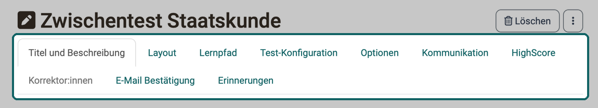{ class="shadow lightbox" title="Kursbaustein Test im Kurseditor · 2026.10.01" }

Die Tabs "Titel und Beschreibung" sowie "Layout" sind bei allen Kursbausteinen gleich. Der Tab "Korrektor:innen" ist nur aktiv, wenn im Abschnitt "Korrektur" die Option "Manuell durch Korrektor:innen" gewählt ist. Der Tab "Badges" kommt hinzu, wenn im Kurs die Vergabe von Badges aktiviert ist.

### Tab "Lernpfad" {: #tab_learning_path}

Im Tab Lernpfad legen Sie unter "Durchführung" fest, ob der Test im Lernpfad Kurs "Obligatorisch" oder "Freiwillig" ist oder ob der Kursbaustein gar nicht angezeigt werden soll ("Ausgenommen"). Mit "Ausnahmen einschalten" gilt für bestimmte Personen oder Gruppen eine andere Durchführung. Ferner können ein "Freigabedatum", ein Datum unter "Zu bearbeiten bis" sowie die voraussichtliche "Bearbeitungszeit (Minuten)" definiert werden, mit "Relatives Datum" auch relativ zu einem Ereignis wie dem ersten Kursbesuch. Die Felder dieses Tabs beschreibt die Seite [Lernpfadkurs - Kurseditor](Learning_path_course_Course_editor.de.md).

Des Weiteren stehen für Tests unter "Erledigungskriterium" folgende Optionen zur Verfügung: "Kursbaustein öffnen", "Bestätigung durch Benutzer:in", "Punkte", "Bestanden" und "Test beendet".

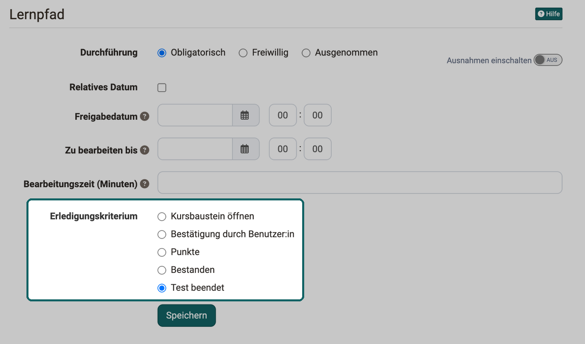{ class="shadow lightbox" title="Tab Lernpfad des Kursbausteins Test · 2026.10.01" }

Nur wenn die gewählte Bedingung erfüllt ist, wird den Teilnehmenden der Fortschritt in der Lernpfadanzeige und in der Fortschrittsprozentzahl angezeigt.

[Zum Anfang des Abschnitts Testkonfiguration ^](#config) 
[Zum Seitenanfang ^](#course_element_test)

### Tab "Test-Konfiguration" {: #tab_configuration}

Wenn Sie noch keinen Test ausgewählt haben, erscheint im Tab "Test-Konfiguration" ein entsprechender Hinweis. Sie können nun einen vorhandenen Test "Auswählen" oder "Importieren" oder einen neuen Test "Erstellen". 

!!! tip "bestehende Lernressource"
    Wurde bereits eine Test-Lernressource eingefügt und wollen Sie diese austauschen, beachten Sie bitte die Hinweise im Abschnitt [Änderungen an Tests und Selbsttests](#changes).

Klicken Sie auf "Auswählen", um einen Test dem Kursbaustein zuzuordnen. Auch die Optionen zum Erstellen und Importieren erhalten Sie anschliessend noch einmal. Hier wählen oder erstellen Sie den Test, den Sie einsetzen und dem Kursbaustein Test zuordnen möchten. Anschliessend können weitere Einstellungen vorgenommen werden, z.B. die Art der Korrektur oder die Art der Darstellung der Testresultate definiert werden.

Falls Sie bereits einen Test mit dem Kursbaustein Test verbunden haben wird im Tab "Test-Konfiguration" der Name des Tests sowie weitere Infos dazu angezeigt und Sie können den Test mit Klick auf "Lernressource bearbeiten" bearbeiten. 

Über den Button "Vorschau" erhalten Sie eine Test-Vorschau und über den Button "Ersetzen" können Sie den Test austauschen indem Sie einen neuen Test erstellen oder importieren. Falls Sie einen Test austauschen möchten für den schon Testresultate vorliegen, erhalten Sie einen entsprechenden Hinweis und eine Archivdatei wird erstellt und kann gespeichert werden.

Ein hinzugefügter Test kann wie folgt konkreter konfiguriert werden:

#### Abschnitt Test {: #section_test}

**Bewertung mit Einstufung/Noten**: Wählen Sie eine der vorgegebenen Bewertungsskalen z.B. Noten, Niveaustufen oder Emojis aus und passen Sie bei Bedarf die Details an. Entscheiden Sie auch ob die Stufenzuordnung automatisch für die Teilnehmenden sichtbar sein soll oder ob die Zuordnung manuell durch die Betreuer:in bereitgestellt werden soll.

**Bei Kurs-Bewertung berücksichtigen**: Schalten Sie diesen Schalter aus, bleibt der Test bei der Kurs-Bewertung in einem Lernpfad Kurs unberücksichtigt. Bei einem herkömmlichen Kurs ist diese Einstellung nicht vorhanden.

!!! note "Lernpfad Kurs"
    Konzept und Fortschrittsberechnung im Lernpfad Kurs. 
    [Lernpfad Kurs](../learningresources/Learning_path_course.de.md)

**Testzeitraum festlegen**: Während des Testzeitraums kann der Test gestartet werden. Sobald die "bis-Zeit" erreicht ist, wird der Test automatisch beendet. Auch dann, wenn die definierte Zeitbeschränkung noch nicht abgelaufen ist. Statt eines fixen Datums kann auch ein relatives Datum gewählt werden, z.B. x Tage nach dem ersten Kursbesuch. Wie Testzeitraum und Prüfungsmodus zusammenwirken, zeigt [Wie hängen die Zeiten einer Prüfung zusammen?](../../manual_how-to/exam_preparation/exam_preparation.de.md#exam_times)

Wird hier nichts aktiviert ist der Test jederzeit zugänglich, sofern keine Einschränkungen an anderer Stelle z.B. unter "Sichtbarkeit" bei herkömmlichen Kursen oder aufgrund einer seriellen Reihenfolge bei Lernpfad Kursen definiert wurde. 

#### Abschnitt Korrektur {: #section_correction}

**Korrektur**: Die Korrektur wird entweder **automatisch oder manuell** durchgeführt. Sobald ein manuell auszuwertender Fragetyp, z.B. Freitext vorhanden ist, muss zwingend eine manuelle Auswertung erfolgen. Bei der automatischen Korrektur werden alle Fragen automatisch und direkt korrigiert, das Resultat ist sofort für die Teilnehmenden sichtbar.

!!! note "Fragetypen"
    Übersicht aller verfügbaren Fragetypen, inkl. manuell auszuwertender Typen. 
    [Fragetypen](Test_question_types.de.md)

Bei einer manuellen Korrektur ist die Sichtbarkeit des Ergebnisses eingeschränkt und die Betreuer:in bzw. Korrektor:in muss die Korrektur manuell ergänzen. Zu den manuell zu bearbeitenden Fragen gehören Freitext, Datei hochladen und Zeichnen. Eine manuelle Korrektur kann bei Bedarf aber auch eingestellt werden, wenn der Test nur aus automatisch auswertbaren Fragetypen besteht.

Drei Optionen stehen zur Auswahl:

* **Automatisch**: OpenOlat korrigiert alle Fragen direkt.
* **Manuell durch Kursbetreuer:in oder -besitzer:in**: Die Korrektur übernehmen die Betreuer:innen oder Besitzer:innen des Kurses.
* **Manuell durch Korrektor:innen**: Die Korrektur übernehmen die Korrektor:innen aus dem Korrektur-Workflow der Lernressource Test. Sie können einen Test korrigieren, ohne dass sie Mitglied oder gar Betreuer:in des Kurses sind. Durch diese Wahl wird auch der Tab "Korrektor:innen" aktiviert, und man erkennt, wer als Korrektor:in dem Test zugeordnet ist.

!!! info "Wichtig"

    Die Option "Manuell durch Korrektor:innen" steht zur Auswahl, wenn in der Lernressource Test der [Korrektur-Workflow](Test_settings.de.md#correction-workflow) eingeschaltet ist. Korrektor:innen werden unabhängig vom Kursbaustein direkt an der Lernressource Test verwaltet und gelten kursübergreifend. Ist der Korrektur-Workflow eingeschaltet und eine andere Option gewählt, zeigt der Abschnitt "Korrektur" einen Hinweis: Mit dieser Einstellung entstehen keine Korrekturaufträge, empfohlen ist "Manuell durch Korrektor:innen".

**Freigabe Bewertung**: Das Feld erscheint bei den beiden manuellen Optionen. Mit "Freigegeben" sehen die Teilnehmenden die Bewertung direkt nach der manuellen Korrektur, mit "Nicht freigegeben" erst, wenn Sie die Bewertung freigeben.

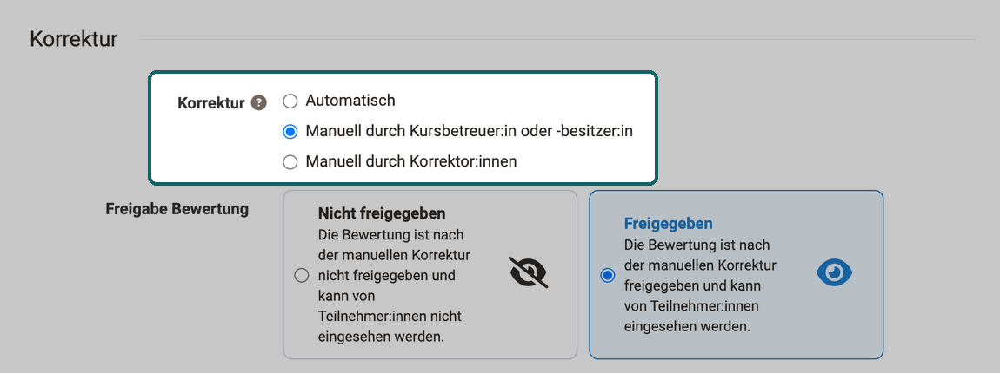{ class="shadow lightbox" title="Abschnitt Korrektur im Tab Test-Konfiguration · 2026.10.01" }

Die Korrektur-Optionen und die Freigabe beschreibt auch die Seite [Tests auf Kursebene](Tests_at_course_level.de.md#correction).

#### Abschnitt Report {: #section_report}

Hier wird definiert, ob und in welcher Form den Lernenden die Testergebnisse und der Leistungsstatus angezeigt werden sollen. Wird hier gar nichts ausgewählt erhalten die Lernenden auch keinerlei Informationen.

**Leistungsübersicht auf Test-Startseite anzeigen**: Wenn diese Option angewählt ist, werden den Teilnehmenden die Punkte und eventuelle weitere Leistungsinformationen wie Erfolgsstatus, Anzahl der Lösungsversuche und die erreichte Stufe der Bewertungsskala auf der Startseite des Tests angezeigt.

Neben der Leistungsübersicht kann den Teilnehmenden auch die konkrete Testauswertung angezeigt werden, dauerhaft auf der Test-Startseite und direkt nach der Bearbeitung.

**Resultate auf Test-Startseite anzeigen**: In dieser Auswahlliste legen Sie fest, ob und unter welchen Bedingungen die Testauswertung auf der Startseite des Tests erscheint. Bei "Immer" stehen die Resultate direkt nach Beenden des Tests zur Verfügung, bei "Nein" werden sie gar nicht angezeigt. Bei den übrigen Optionen legen Sie mit "Von" und "Bis" fest, in welchem Zeitraum die Resultate erscheinen: nur bei nicht bestandenem Test, nur bei bestandenem Test, mit verschiedenen Zeiträumen für beide Fälle oder mit einem gemeinsamen Zeitraum.

{ class="shadow lightbox" title="Abschnitt Report im Tab Test-Konfiguration" }

**Resultate nach Abgabe des Tests anzeigen**: Ist dieses Kontrollkästchen aktiviert, sehen die Teilnehmenden die Testauswertung direkt nach der Abgabe.

Wichtig ist, dass Sie unter **"Übersicht Resultate"** auswählen, in welcher Form die Ergebnisse angezeigt werden sollen. Die Auswahl gilt für beide Anzeigen. Das Feld erscheint, sobald "Resultate nach Abgabe des Tests anzeigen" aktiviert oder unter "Resultate auf Test-Startseite anzeigen" eine andere Option als "Nein" gewählt ist.

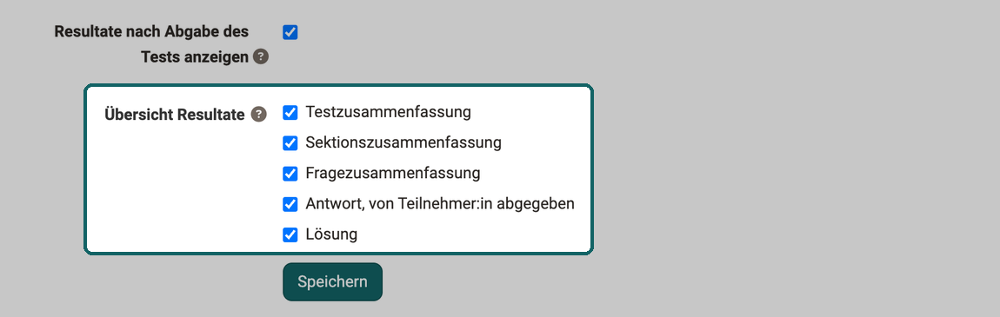{ class="shadow lightbox" title="Abschnitt Report im Tab Test-Konfiguration · 2026.10.01" }

Bei der **Testzusammenfassung** wird u.a. die erreichte Prozentzahl, die Bearbeitungsdauer, die Anzahl der bearbeiteten Fragen und die erreichte Punktzahl sowie der Status angezeigt.

Die **Sektionszusammenfassung** ist nur relevant, wenn ein Test auch Sektionen enthält.

!!! note "Sektion Ebene"
    Beschreibung der Sektionen-Konfiguration im Testeditor. 
    [Sektion Ebene](Configure_tests.de.md#section)

Bei der **Fragezusammenfassung** wird der Titel der Frage, die jeweils erreichte Punkte bzw. der passende Prozentwert angezeigt aber nicht die Fragestellung selbst.

Bei der Option **Antwort, von Teilnehmer:in abgegeben** wird die Frage, alle Antwortoptionen sowie die Wahl der Teilnehmenden angezeigt, allerdings keine Bewertung ob die Frage richtig oder falsch beantwortet wurde. Ist dies gewünscht muss die Option mit weiteren Feedback-Optionen kombiniert werden.

Die **Lösung** beinhaltet die korrekten Antworten.

Je nach Kombination der Anzeige Optionen können den Teilnehmenden somit unterschiedliche Arten von Feedback hinterlassen werden.

[Zum Anfang des Abschnitts Testkonfiguration ^](#config) 
[Zum Seitenanfang ^](#course_element_test)

### Tab "Optionen" {: #tab_options}

Bindet man einen Test in einen Kurs ein, werden die Einstellungen aus der Konfiguration der Lernressource Test (siehe  "[Test Einstellungen](Test_settings.de.md)" und "[Test konfigurieren](Configure_tests.de.md)") standardmässig übernommen. Im Tab "Optionen" ist deshalb "Konfiguration von Lernressource übernehmen" vorausgewählt und die entsprechenden Einstellungen, die in der Lernressource Test vorgenommen wurden, werden hier angezeigt. 

Wenn die Einstellungen für einen im Kurs eingebundenen Test geändert werden sollen, kann "Konfiguration anpassen" ausgewählt und die gewünschten Änderungen vorgenommen werden. Beispielsweise können eine Zeitbeschränkung definiert, die Anzahl der Lösungsversuche eingeschränkt oder Gästen erlaubt werden den Test durchzuführen. Darüber hinaus können diverse Darstellungsoptionen konfiguriert werden. 

Ist die Option "Fragetitel anzeigen" nicht markiert aber gleichzeitig die Menü-Navigation erlaubt, werden statt der wirklichen Titel lediglich anonymisierte Titel in der Navigation angezeigt. 

!!! info "Wichtig"

    Diese Anpassungen im Test haben keine Auswirkungen auf die Konfiguration der Lernressource Test selbst.

Zusätzlich kann auch ein Informationstext (HTML-Seite) für den Test eingerichtet werden, der den Teilnehmenden auf der Startseite des Tests oberhalb der Start-Schaltfläche angezeigt wird. Klicken Sie hierfür im Tab "Optionen" im Bereich "Informationstext (HTML) auf "Erstellen", "Auswählen" oder "Import".

Aktivieren Sie "Verlinkung im gesamten Ablageordner zulassen", wenn Sie z.B. auf andere HTML-Dateien oder Grafiken im Informationstext verlinken möchten. Diese Einstellung bewirkt aber auch, dass versierte Teilnehmer:innen Einsicht in den gesamten Ablageordner des Kurses erlangen können.

[Zum Anfang des Abschnitts Testkonfiguration ^](#config) 
[Zum Seitenanfang ^](#course_element_test)

### Tab "Kommunikation" [:octicons-tag-16:{ title="ab Release 16.2.0 (OO-5966)" }](https://track.frentix.com/issue/OO-5966) {: #tab_communication}

Hier kann eingestellt werden ob während der Durchführung des Tests Teilnehmende live Anfragen per Chat an die Betreuer:innen bzw. Besitzer:innen des Kurses senden dürfen. Das macht natürlich nur dann Sinn, wenn während eines definierten Test-Zeitraums auch reale betreuende Personen die Testdurchführung beobachten. Dieses Vorgehen ist z.B. bei der Durchführung von Online-Prüfungen oder synchronen Zulassungsprüfungen per Test hilfreich. 

[Zum Anfang des Abschnitts Testkonfiguration ^](#config) 
[Zum Seitenanfang ^](#course_element_test)

### Tab "HighScore" [:octicons-tag-16:{ title="ab Release 11.3 (OO-2133)" }](https://track.frentix.com/issue/OO-2133) {: #tab_highscore}

Hier kann für einen Test eine Highscore Übersicht aktiviert und weiter konfiguriert werden. Diese Übersicht vergleicht die Test-Ergebnisse der Teilnehmenden und ordnet das individuelle Ergebnis im Vergleich ein. 

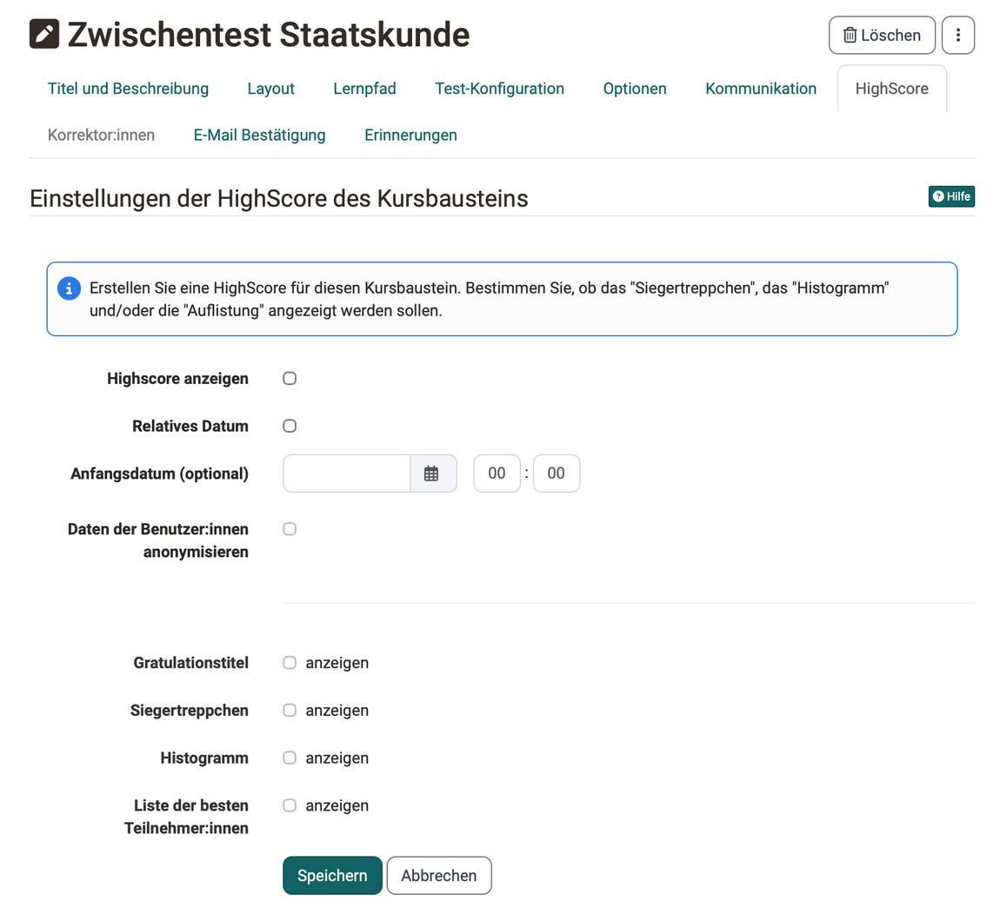{ class="shadow lightbox" title="Tab HighScore des Kursbausteins Test · 2026.10.01" }

Aktivieren Sie zuerst "Highscore anzeigen". Unter "Anfangsdatum (optional)" legen Sie fest, ab wann die Rangliste erscheint. Mit "Relatives Datum" geben Sie dieses Datum relativ zu einem Ereignis an, zum Beispiel zum ersten Kursbesuch. Mit "Daten der Benutzer:innen anonymisieren" erscheinen die Teilnehmenden in der Rangliste ohne Vor- und Nachnamen.

Darunter wählen Sie, was angezeigt wird: "Gratulationstitel", "Siegertreppchen", "Histogramm" und "Liste der besten Teilnehmer:innen". Mindestens eine Anzeigeoption muss aktiviert sein. Für die Liste legen Sie zusätzlich fest, ob alle oder nur die besten Teilnehmer:innen erscheinen und wie viele.

!!! note "Highscore"
    Weitere Informationen zum Thema Highscore. 
    [Mehr erfahren](../learningresources/Course_Elements.de.md#highscore)

[Zum Anfang des Abschnitts Testkonfiguration ^](#config) 
[Zum Seitenanfang ^](#course_element_test)

### Tab "Korrektor:innen" [:octicons-tag-16:{ title="ab Release 15.0 (OO-4442)" }](https://track.frentix.com/issue/OO-4442) {: #tab_correctors}

Der Tab ist aktiv, wenn im Abschnitt "Korrektur" die Option "Manuell durch Korrektor:innen" gewählt ist, sonst ist er ausgegraut. Er zeigt die Konfiguration des Korrektur-Workflows und die Korrektor:innen, die in der Lernressource Test eingetragen sind. Per Link zur Lernressource des Tests können Änderungen vorgenommen werden.

[Zum Anfang des Abschnitts Testkonfiguration ^](#config) 
[Zum Seitenanfang ^](#course_element_test)

### Tab "E-Mail Bestätigung" [:octicons-tag-16:{ title="ab Release 17.2.0 (OO-6672)" }](https://track.frentix.com/issue/OO-6672) {: #tab_email_confirmation}

Aktivieren Sie die E-Mail Bestätigung, wenn die Lernenden nach Abgabe des Tests eine Bestätigung erhalten sollen. Eine Kopie der Mail kann auch an die Kursbesitzer:innen, zuständige Betreuer:innen oder externe E-Mail-Adressen verschickt werden.

Für den Mailtext kann die Vorlage und ein voreingestellter Betreff mit dem Titel des Test-Kursbausteins verwendet werden. Alternativ kann beides auch geändert werden. Wählen Sie in diesem Fall bei "Vorlage" die Option "Eigener Text", um den Mailtext zu bearbeiten oder komplett zu ändern.

Sie können in dem Mailtext auch auf verschiedene Variablen wie Name oder Punktezahl zurückgreifen.

!!! note "Variablen in Mailing-Texten"
    Weitere Informationen zur Verwendung von Variablen in Mailing-Texten. 
    [Mehr erfahren](Course_Element_EMail.de.md#einsatz-von-variablen)

[Zum Anfang des Abschnitts Testkonfiguration ^](#config) 
[Zum Seitenanfang ^](#course_element_test)

### Tab "Erinnerungen" [:octicons-tag-16:{ title="ab Release 16.0.0 (OO-5447)" }](https://track.frentix.com/issue/OO-5447) {: #tab_reminders}

Hier können Erinnerungsmails nach bestimmten Kriterien konfiguriert werden.

!!! note "Erinnerungen"
    Weitere Informationen zum Versand von Erinnerungen. 
    [Mehr erfahren](../learningresources/Course_Reminders.de.md)

[Zum Anfang des Abschnitts Testkonfiguration ^](#config) 
[Zum Seitenanfang ^](#course_element_test)

### Tab "Badges" {: #tab_badges}

Wurde von der Kursbesitzer:in unter `Kurs > Administration > Einstellungen > Tab Bewertung > Abschnitt Badges` die Vergabe von Badges aktiviert, wird im Kurseditor zu diesem Kursbaustein der Tab "Badges" angezeigt und es kann ein spezifischer Badge für diesen Kursbaustein erstellt werden.

!!! note "Badges"
    Weitere Informationen zum Thema Badges und wie sie vergeben werden. 
    [Badges](../learningresources/OpenBadges.de.md)

[Zum Anfang des Abschnitts Testkonfiguration ^](#config) 
[Zum Seitenanfang ^](#course_element_test)

---

## Test und Selbsttest im Vergleich {: #compare_test_self-test}

Merkmal | :fontawesome-solid-square-pen: Test | :fontawesome-solid-square-pen: Selbsttest
------|------|------
 Einsatzzweck | Prüfungstest, Test mit Einblick für die Lehrenden, Standard Test | Übung, Selbstevaluation, keine Einsicht durch Lehrperson
 Herstellung mit | [Testeditor](Test_editor_QTI_2.1.de.md) | [Testeditor](Test_editor_QTI_2.1.de.md)
 Fragetypen QTI 2.1 | Alle [Fragetypen](Test_question_types.de.md) möglich | Alle [Fragetypen](Test_question_types.de.md) möglich, aber nur automatisch auswertbare Fragetypen können auch für Punkte verwendet werden.
 Einbindung mit Kursbaustein | Test| Selbsttest
 Anzahl Aufrufe durch Teilnehmende | konfigurierbar | unlimitiert
 Ergebnisse | erscheinen im [Bewertungswerkzeug](../learningresources/Assessment_tool_overview.de.md) sowie in den Teststatistiken und sind für Betreuer:innen einsehbar | erscheinen _nicht_ im [Bewertungswerkzeug](../learningresources/Assessment_tool_overview.de.md) und in den Teststatistiken und sind nicht personalisiert für Betreuer:innen und Besitzer:innen einsehbar
 Datenarchivierung| ja, personalisiert| ja, anonymisiert. Eine personenbezogene Zuordnung oder Feedbacks sind aber nicht möglich.

!!! tip "Tipp"

    Manchmal ist es sinnvoll, den Typ "Test" zu verwenden, auch wenn man den Lernenden eigentlich einen Selbsttest zur Verfügung stellen möchte. Tests ermöglichen bei Bedarf die Lernenden individuell zu unterstützen und auch Feedback zu manuell bewertbaren Fragetypen bereitzustellen und können Lehrenden ein Feedback zur Qualität und Effektivität ihrer Fragen geben. 

[Zum Seitenanfang ^](#course_element_test)

---

## Änderungen an Tests und Selbsttests {: #changes}

!!! warning "Achtung"

    Sobald ein Test oder Selbsttest in einen Kurs eingebunden wird, können nur noch sehr eingeschränkt Änderungen unter "Lernressource bearbeiten" vorgenommen werden. Deshalb sollte ein Test möglichst erst in einen Kurs eingebunden werden, wenn er vollständig fertiggestellt ist.

Warum ist das so? Angenommen Sie könnten in einem eingebundenen Test noch Fragen hinzufügen oder andere Antworten als korrekt markieren, würden einerseits nicht alle Teilnehmenden die gleichen Voraussetzungen antreffen. Andererseits könnten bereits gespeicherte Resultate nicht mehr eindeutig einer Version der Testdatei zugewiesen werden. Deshalb ist das Editieren bereits eingebundener Tests und Selbsttests stark eingeschränkt.

Die Frage ist also was man tun kann, wenn man doch mal einen Test aus triftigen Gründen ändern muss. Hierfür haben Sie folgende Möglichkeit:

### Bereits bearbeitete Tests austauschen [:octicons-tag-16:{ title="ab Release 19.1.10 (OO-8400)" }](https://track.frentix.com/issue/OO-8400) {: #tab_replace_tests}

Wenn Sie einen Test nachträglich ändern möchten (z. B. neue Fragen hinzufügen oder fehlerhafte Antworten korrigieren), kopieren Sie zunächst die Lernressource Test im Autorenbereich und bearbeiten Sie die Kopie. Binden Sie diese anschliessend im gewünschten Kurs ein.

Dazu öffnen Sie im Kurseditor den betreffenden Kursbaustein, wechseln in den Tab Test-Konfiguration und klicken auf Ersetzen. Wählen Sie die vorbereitete Test-Kopie aus.

Im nächsten Schritt stehen zwei Optionen zur Verfügung:

* **Kontrollierter Austausch**: Alle bisherigen Durchläufe und Bewertungen werden ungültig, das Bewertungsformular wird zurückgesetzt. Die bisherigen Ergebnisse erhalten Sie zusätzlich als ZIP-Download.

* **Nur ersetzen**: Der Test wird ausgetauscht. Beendete Testläufe bleiben gültig, bestehende Bewertungen bleiben unverändert. Laufende und pausierte Testläufe werden eingezogen und als ungültig markiert.

Vor dem Austausch informiert Sie ein Dialog über die Auswirkungen. Diese müssen Sie ausdrücklich bestätigen.

**Beispiel:**
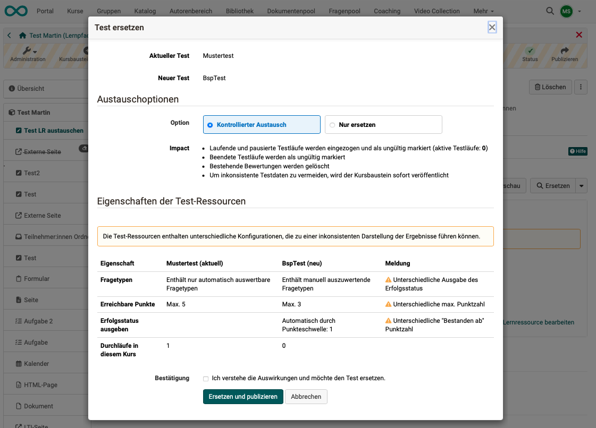{ class="shadow lightbox" title="Dialog Test ersetzen" }

Nach dem Austausch erscheint beim Button "Ersetzen" auch der Link "Verlauf anzeigen".

!!! note "Test-Historie"
    Details zum Verlauf ausgetauschter Test-Lernressourcen. 
    [Test-Historie](#history)

[Zum Seitenanfang ^](#course_element_test)

---

## Tests einsehen und bewerten {: #assess}

Wer bearbeitete Tests korrigieren und bewerten will, findet alle Testläufe des Kurses im Bewertungswerkzeug. Zugriff darauf haben Betreuer:innen und Kursbesitzer:innen: `Kurs > Administration > Bewertungswerkzeug`. Navigieren Sie zum gewünschten Kursbaustein Test. Im Tab  "Teilnehmer:innen" werden alle Teilnehmenden mit dem jeweiligen Bearbeitungsstand zu diesem Kursbaustein angezeigt und Sie erkennen in der Spalte "Status" ob eine Bewertung erforderlich ist. Auch werden offene Bewertungen bereits in der Übersicht unter "Offene Bewertungen" angezeigt.

!!! note "Bewertungswerkzeug"
    Zentrale Oberfläche zur Bewertung, Benotung und Verwaltung der Bewertungen der Teilnehmenden. 
    [Bewertungswerkzeug](../learningresources/Assessment_tool_overview.de.md)

Alternativ können die Ergebnisse eines spezifischen Tests auch im Kurs bei geschlossenem Kurseditor direkt beim jeweiligen Test-Kursbaustein eingesehen und verwaltet werden. Wechseln Sie hierfür in den Tab "Teilnehmer:innen". Zusätzlich stehen Ihnen als Kursbesitzer:in im Kurs noch weitere Tabs wie Vorschau, Kommunikation, Erinnerungen und Badges zur Verfügung. Auch Betreuer:innen verfügen teilweise über diese Tabs.

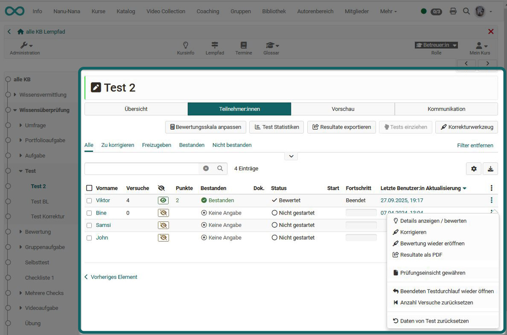{ class="shadow lightbox" title="Tab Teilnehmer:innen des Kursbausteins Test" }

Sofern für einen Test auch Korrektor:innen aktiviert wurden, können diese die Bewertungen über das Coaching Tool vornehmen.

!!! note "Coaching Tool"
    Kursübergreifende Bewertung durch Korrektor:innen. 
    [Coaching Tool](../area_modules/Coaching.de.md)

[Zum Seitenanfang ^](#course_element_test)

---

## Test-Historie {: #history}

Wer die Test-Lernressource eines Kursbausteins ausgetauscht hat, behält die früheren Ergebnisse, sieht den Verlauf der Zuweisungen und kann die Statistik jeder verwendeten Test-Lernressource weiterhin aufrufen.

**A)** Wird die Test-Lernressource kontrolliert ausgetauscht, werden die bisher mit diesem Kursbaustein erzielten Testergebnisse (die Testergebnisse mit der bisherigen Lernressource) automatisch gespeichert und als zip-Datei exportiert. Auch eine Excel-Datei ist im Export enthalten, in der die Testergebnisse der einzelnen Teilnehmer:innen nachvollzogen werden können.

**B)** Wenn Sie nachsehen möchten, wann welche Test-Lernressource im Kursbaustein ausgetauscht wurde, finden Sie eine Übersicht beim Button "Ersetzen". Klicken Sie auf den kleinen Pfeil neben dem Button und dann auf "Verlauf anzeigen".

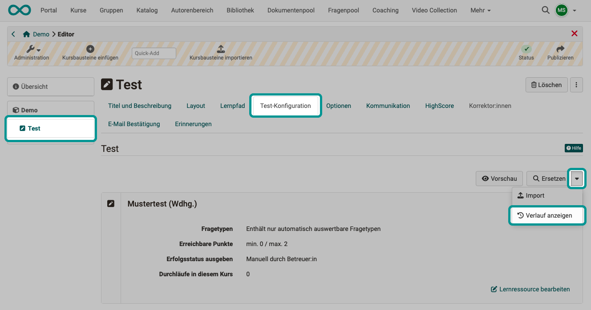{ class="shadow lightbox" title="Tab Test-Konfiguration im Kurseditor" }

Der Dialog "Verlauf der Test-Ressourcen" zeigt je Test-Lernressource:

* **Zugewiesen am**: wann die Test-Lernressource dem Kursbaustein zugewiesen wurde.
* **Zugewiesen von**: wer sie zugewiesen hat.
* **Durchläufe in diesem Kurs**: wie oft die Test-Lernressource in diesem Kurs bearbeitet wurde. Die Durchläufe können von verschiedenen Personen stammen, die den Test je einmal gemacht haben, oder von einer Person, die ihn mehrfach bearbeitet hat. Jede Bearbeitung zählt als Durchlauf.

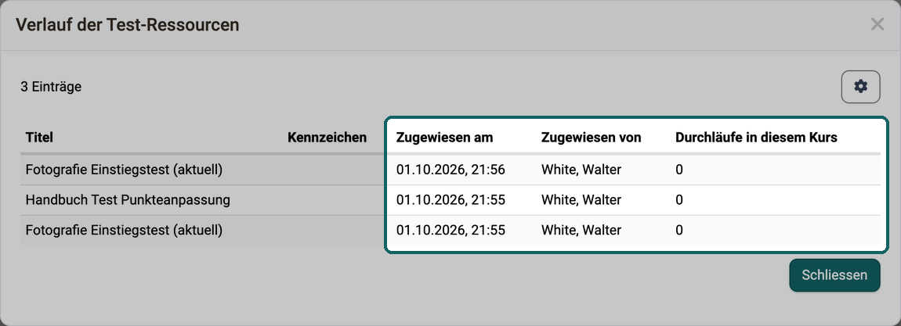{ class="shadow lightbox" title="Dialog Verlauf der Test-Ressourcen · 2026.10.01" }

**C)** Wird die Test-Lernressource ausgewechselt, wird auch eine neue Teststatistik mit der neuen Test-Lernressource angelegt. Als Betreuer:in wählen Sie wie gewohnt den Test-Kursbaustein und den Tab "Teilnehmer:innen". Hier wird der Button "Teststatistiken" angezeigt. 

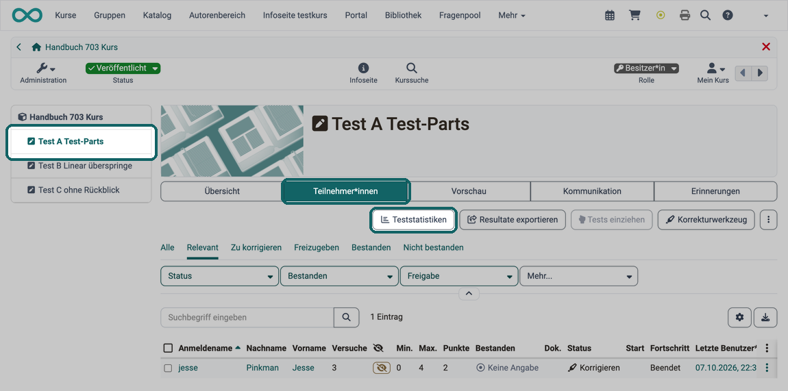{ class="shadow lightbox" title="Tab Teilnehmer:innen des Kursbausteins Test · 2026.10.07" }

Haben Teilnehmende in diesem Kurs mehr als eine der verwendeten Test-Lernressourcen bearbeitet, erscheint in den Teststatistiken rechts oben eine Auswahl, mit der Sie zwischen den Statistiken der verschiedenen Testversionen (verwendeten Test-Lernressourcen) wechseln.

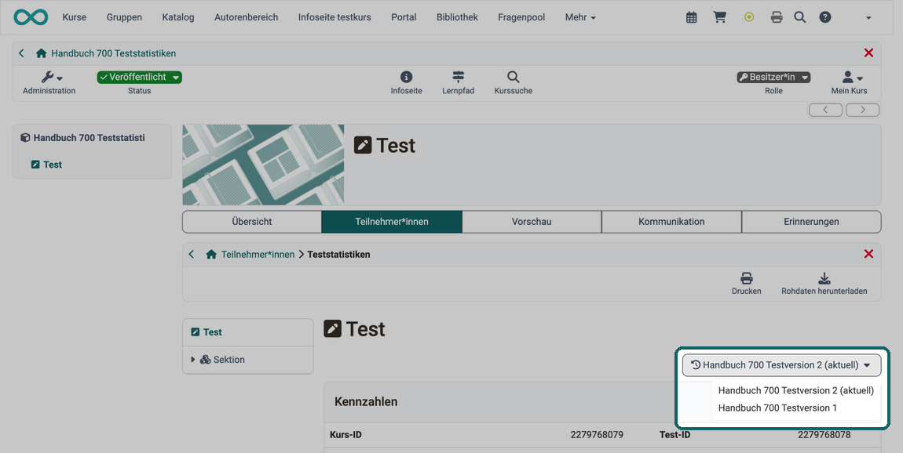{ class="shadow lightbox" title="Teststatistiken im Kursbaustein Test · 2026.10.07" }

!!! note "Hinweis"

    Wurde "Nur ersetzen" gewählt, bleiben die bestehenden Bewertungen unverändert. Diese Variante ist mit Vorsicht zu verwenden. Wenn z.B. neu 12 Punkte erreicht werden können und bisher nur 10, sind immer noch maximal 10 Punkte im Kurs eingetragen. Solche Angaben können dann zu Verwirrung führen und müssen manuell korrigiert werden.

[Zum Seitenanfang ^](#course_element_test)

---

## Testergebnisse archivieren [:octicons-tag-16:{ title="ab Release 17.1.0 (OO-6466)" }](https://track.frentix.com/issue/OO-6466) {: #archive}

Wer die Testergebnisse eines Kurses gesammelt sichern will, etwa zusammen mit den Resultaten anderer bewertbarer Kursbausteine, archiviert sie in der Kursarchivierung: `Kurs > Administration > Archivierung & Reports`.

!!! note "Archivierung & Reports"
    Kursweite Archivierungsfunktion für alle bewertbaren Kursbausteine. 
    [Archivierung & Reports](../learningresources/Course_Archiving.de.md)

Dort können Sie alle Kursresultate von sämtlichen bewertbaren Kursbausteinen (u.a. Tests) herunterladen. Alternativ können Sie auch nur die Ergebnisse bestimmter Tests auswählen und nur diese speichern. Wählen Sie dafür `Kurs > Administration > Archivierung & Reports > Kursarchivierung > Archiv erstellen`. Wählen Sie im Wizard die Archivart "Teilarchiv" und markieren Sie im Schritt "Kursbausteine auswählen" den oder die gewünschten Test-Bausteine. Im Schritt "Einstellungen" wählen Sie bei "Kursbausteine" entweder "Standard-Einstellungen" oder "Benutzerspezifisch", um die Archivierungsoptionen anzupassen.

Es wird eine Zip-Datei erstellt, die dann im Bereich Kursarchivierung für eine bestimmte Zeit, z.B. 10 Tage, bereitliegt und kopiert, heruntergeladen und gelöscht werden kann. Im Wizard-Schritt "Einstellungen" gibt es bei der Auswahl "Benutzerspezifisch" beim Kursbaustein Test unter **"Export"** 2 Varianten:

* Der Export **Standard** enthält detaillierte Testresultate für jede:n Teilnehmer:in in Form eines HTML-Dokuments und einer Excel-Datei mit den Rohdaten.
* Die Option **"Erweitert – mit PDF"** erzeugt die gleiche zip-Datei, es werden jedoch zusätzlich noch PDF-Dateien mit den detaillierten Ergebnissen für jede:n Teilnehmer:in ergänzt. Achtung: Die Erstellung dieser zip-Datei kann je nach Anzahl der darin enthaltenen PDF-Dateien evtl. einige Zeit dauern.

Enthält der Test Freitextfragen und wurde die Option **"Erweitert – mit PDF"** gewählt, kann darunter unter **"Zusätzliche Option"** zusätzlich **"Separate PDF-Datei für jede Freitextfrage"** aktiviert werden. Die Antwort jeder Freitextfrage wird dann als eigene PDF-Datei im Archiv abgelegt. [:octicons-tag-16:{ title="ab Release 19.1.27 (OO-8964)" }](https://track.frentix.com/issue/OO-8964)

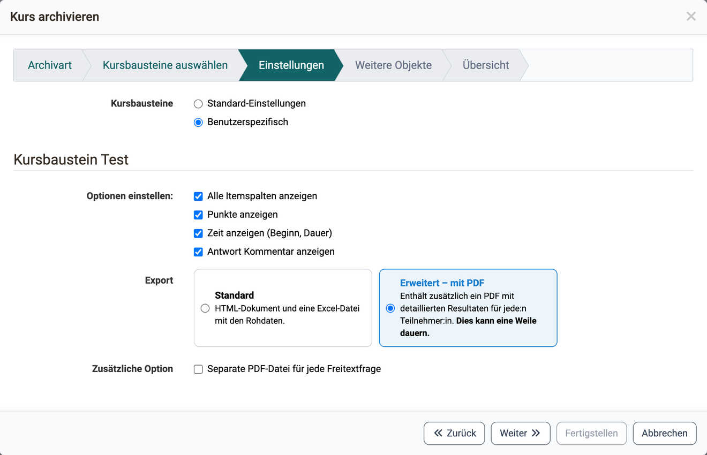{ class="shadow lightbox" title="Schritt Einstellungen im Dialog Kurs archivieren" }

Die Option "Alle PDF-Dateien in einem Ordner" bietet die Kursarchivierung nicht an. Im Archiv liegt jede PDF-Datei im Ordner der Teilnehmer:in, benannt nach Person, Kursbaustein und Test. Gesammelt in einem Ordner erhalten Sie die PDF-Dateien über den Button "Resultate exportieren" im Tab "Teilnehmer:innen" des Kursbausteins. Wie die Dateien dort heissen und abgelegt werden, steht auf der Seite [Tests exportieren](Test_export.de.md#pdf_files). [:octicons-tag-16:{ title="ab Release 21.1 (OO-9600)" }](https://track.frentix.com/issue/OO-9600)

Die Rohdaten von Tests können Sie zudem über die Teststatistiken herunterladen: `Kurs > Administration > Teststatistiken`. Dort finden Sie auch die grafische Auswertung.

!!! note "Teststatistiken"
    Rohdaten und grafische Auswertung von Testergebnissen. 
    [Teststatistiken](../learningresources/Statistics_Test.de.md)

[Zum Seitenanfang ^](#course_element_test)

---

## Arbeiten mit Tests {: #work_with_tests}

### Einsatzbeispiele
Tests können unter anderem in folgenden Szenarien eingesetzt werden:

* **Abschluss-Assessment**: Überprüfung des erworbenen Wissens nach einer Lern- oder Trainingsphase oder eines Online-Kurses

* **Pre-Test**: Erfassung des aktuellen Wissensstands vor Kursbeginn, um vorhandene Lücken zu erkennen und Schwerpunkte für den Kurs festzulegen

* **Interessen-Test**: Selbstüberprüfung zum eigenen Wissensstand sowie zur Identifikation persönlicher Vorlieben und Interessen

* **Antwortspezifisches Feedback**: Tests als individuelle Feedbackgeber bei intensiver Nutzung der OpenOlat-Feedbackfunktionen

* **Quiz-Game**: Spielerische Wissensüberprüfung in Form von Quiz, Quests, Storytelling u.ä.

* **Online-Klausur**: Durchführung von prüfungsrelevanten Online- oder E-Klausuren

### So bearbeiten Sie einen Test (Lernendenperspektive) [:octicons-tag-16:{ title="ab Release 20.3.0 (OO-8321)" }](https://track.frentix.com/issue/OO-8321) {: #participate_as_learner}

Als Lernende bearbeiten Sie einen Test Frage für Frage und sehen dabei jederzeit, was schon beantwortet ist. Um mit der Bearbeitung eines Tests zu beginnen drücken Sie "Test starten". Beantworten Sie die angezeigten Fragen und klicken Sie anschliessend bei jeder Frage auf "Antwort speichern". Sofern generell sichtbar, kann man in der linken Navigation sehen, welche Fragen bereits beantwortet wurden (ausgefüllter Punkt), welche Fragen nur angeschaut wurden (hervorgehobener Kreis) und welche noch gar nicht angeklickt wurden (grauer Kreis). Über das Symbol rechts neben einer Frage fügen Sie eine private Markierung hinzu, als Erinnerung, die Frage später noch einmal anzuschauen.

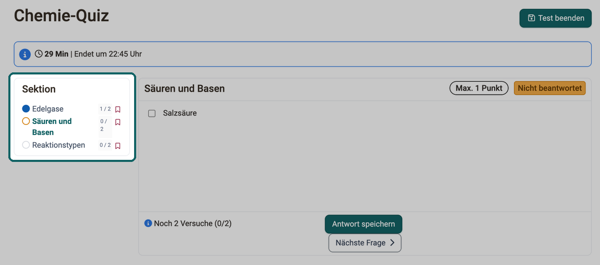{ class="shadow lightbox" title="Test aus Sicht der Teilnehmenden · 2026.10.01" }

Je nach Einstellung können Sie über den Button "Nächste Frage" und/oder einem Link in der linken Navigation weiter navigieren oder es wird automatisch die nächste Frage angezeigt. Ob Sie Fragen überspringen können oder Sie einen Beantwortungsfortschritt sehen, ist ebenfalls von der Konfiguration des Lehrenden abhängig. Je nach Konfiguration dürfen Sie den Test unterbrechen und zu einem späteren Zeitpunkt fortfahren oder generell abbrechen ohne dass Resultate gespeichert werden.

Bearbeiten Sie einen Test in nur einem Browserfenster. Wird der Test in einem anderen Fenster unterbrochen oder beendet, meldet das noch offene Fenster bei der nächsten Eingabe "Test unterbrochen" beziehungsweise "Test beendet" mit dem Text "Eingaben in diesem Fenster werden nicht mehr gespeichert, da der Test bereits beendet oder unterbrochen wurde. Bitte schliessen Sie es jetzt." [:octicons-tag-16:{ title="ab Release 21.0.3 (OO-9707)" }](https://track.frentix.com/issue/OO-9707)

Ist die Anzahl Lösungsversuche für eine Frage, eine Sektion oder den gesamten Test eingeschränkt, wird die verbleibende Anzahl direkt bei der Frage angezeigt, zum Beispiel „Noch 2 Versuche (1/3)“. In der linken Navigation steht bei jeder Frage die Zahl der genutzten und der möglichen Versuche, zum Beispiel "1 / 2"; die verbleibende Anzahl erscheint dort als Tooltip.

Wenn Sie fertig sind mit der Bearbeitung und den Test abschliessen wollen, klicken Sie auf den Button "Test beenden". Es erfolgt noch einmal eine Sicherheitsabfrage und wenn Sie diese bestätigen, wird der Test gespeichert und ist für die Lehrenden sichtbar.

Besteht ein Test aus mehreren [Test-Parts](Configure_tests.de.md#testpart), bearbeiten Sie diese nacheinander und schliessen jeden einzeln ab. Ein beendeter Test-Part ist abgegeben: Seine Antworten sind gespeichert, und Sie kehren nicht mehr dorthin zurück. Zu Beginn zeigt OpenOlat die Seite "Testbeginn" mit der Anzahl Teile, zum Beispiel "Der Test hat bis 2 Teile.", und dem Button "Test starten".

* Das Menü links zeigt nur die Sektionen und Fragen des aktuellen Test-Parts. Ist im Kursbaustein die Menü-Navigation ausgeschaltet, führt der Button "Menu-Navigation Test" auf die Seite "Test Part" mit diesen Fragen.
* Oben rechts steht der Button "Test Part beenden" statt "Test beenden". Je nach Einstellung des Tests erscheint er erst, wenn alle Fragen des Test-Parts beantwortet sind.

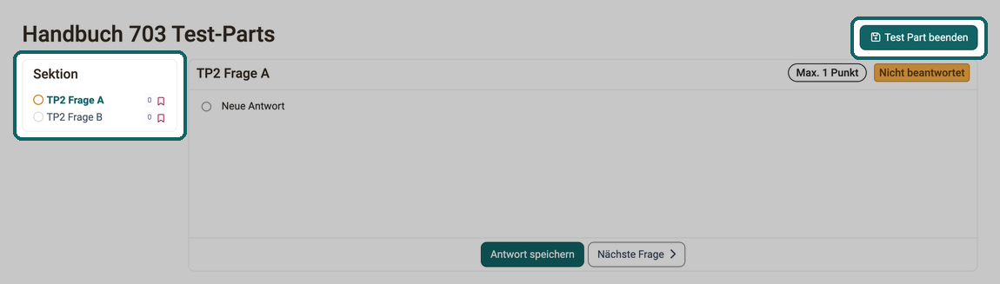{ class="shadow lightbox" title="Test mit mehreren Test-Parts aus Sicht der Teilnehmenden · 2026.10.07" }

* Nach dem Klick auf "Test Part beenden" fragt OpenOlat nach: "Sind Sie sicher dass Sie den Test Part beenden wollen? Ihre Antworten werden dadurch gespeichert." Mit "Ok" geben Sie den Test-Part ab.
* Ist ein Rückblick vorgesehen, erscheint danach die Seite "Test Part abgeschlossen". Unter "Ihre Antworten überprüfen" sehen Sie Ihre Antworten an, ändern können Sie sie nicht mehr. Mit "Test Part schliessen" und der Rückfrage "Test Part weiter gehen" gelangen Sie in den nächsten Test-Part. Ohne Rückblick geht es direkt in den nächsten Test-Part.
* Im letzten Test-Part heisst der Button ebenfalls "Test Part beenden", die Rückfrage trägt den Titel "Test beenden". Mit der Bestätigung ist der ganze Test abgeschlossen.

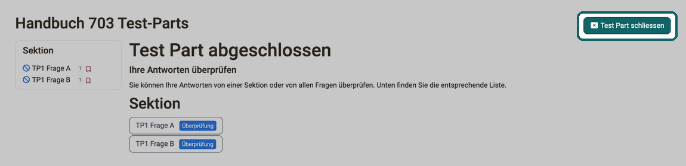{ class="shadow lightbox" title="Seite Test Part abgeschlossen · 2026.10.07" }

Ob, wie und wann Sie die Resultate und die Leistungsübersicht sehen ist von der Test-Konfiguration abhängig.

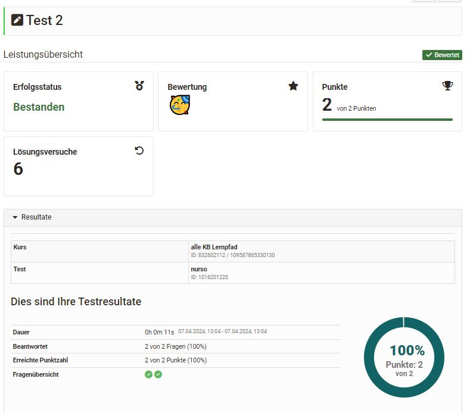{ class="shadow lightbox" title="Leistungsübersicht eines Tests aus Sicht der Teilnehmenden" }

Wenn Ihnen weitere Versuche zur Bearbeitung des Tests zur Verfügung stehen, können Sie mit "Test starten" den Test noch einmal durchlaufen. Bisherige Durchläufe bleiben dabei erhalten.

[Zum Seitenanfang ^](#course_element_test)

---

## Weiterführende Informationen {: #further_information}

**Auf dieser Seite erwähnt** 
[Test Fragetypen >](Test_question_types.de.md) 
[Kursbaustein "Selbsttest" >](Course_Element_Self_Test.de.md) 
[Tests erstellen >](Test.de.md) 
[Lernpfadkurs - Kurseditor >](Learning_path_course_Course_editor.de.md) 
[Lernpfadkurs - Überblick >](Learning_path_course.de.md) 
[Wie bereite ich eine Online-Prüfung vor? >](../../manual_how-to/exam_preparation/exam_preparation.de.md) 
[Test Einstellungen - Administration >](Test_settings.de.md) 
[Tests auf Kursebene >](Tests_at_course_level.de.md) 
[Test konfigurieren >](Configure_tests.de.md) 
[Kursbausteine >](Course_Elements.de.md) 
[Kursbaustein "E-Mail" >](Course_Element_EMail.de.md) 
[Erinnerungen >](Course_Reminders.de.md) 
[Badges >](OpenBadges.de.md) 
[Testeditor >](Test_editor_QTI_2.1.de.md) 
[Bewertungswerkzeug - Übersicht >](Assessment_tool_overview.de.md) 
[Coaching - Übersicht >](../area_modules/Coaching.de.md) 
[Kursadministration - Archivierung & Reports >](Course_Archiving.de.md) 
[Tests exportieren >](Test_export.de.md) 
[Teststatistiken >](Statistics_Test.de.md)

**Weiterführend** 
[Test Fragen konfigurieren >](Configure_test_questions.de.md) 
[Tests bewerten >](Assessing_tests.de.md) 
[Coaching - Bewertungsaufträge >](../area_modules/Coaching_Assessment_Orders.de.md)

[Zum Seitenanfang ^](#course_element_test)
