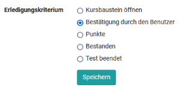

# Kursbaustein "Test"  {: #course_element_test}

## Steckbrief

Name | Test
---------|----------
Icon | { class=size24  }
Verfügbar seit | 
Funktionsgruppe | Wissensüberprüfung
Verwendungszweck | Kursbaustein zum Einbinden einer Test-Lernressource in einen Kurs
Bewertbar | ja
Spezialität / Hinweis |

Mit dem Kursbaustein "Test" binden Sie eine OpenOlat Lernressource "Test" in Ihren Kurs ein. Ein Test wird im Kurs zur Leistungsüberprüfung oder als Quiz verwendet und umfasst diverse Frage-Typen. 

Je nach [Fragetyp](../learningresources/Test_question_types.de.md) können eine oder mehrere Antworten angekreuzt, Elemente per drag & drop verschoben, Texte und/oder Zahlen eingefügt, Dateien hinzufügt, Markierungen oder (sehr einfache) Zeichnungen erstellt werden. Die Auswertung erfolgt dann abhängig vom Fragetyp manuell oder automatisch. 

Pro OpenOlat Kurs können auch mehrere Tests für unterschiedliche Zwecke zum Einsatz kommen. Die Resultate der Kursteilnehmenden werden personalisiert aufgezeichnet.

OpenOlat verwendet das IMS-QTI 2.1 Format für Tests, was einen Austausch mit anderen Test-Systemen und Learning Management Systemen, die diesen Standard ebenfalls unterstützen, gewährt. 

Die zwei zentralen Tabs in denen Sie Einstellungen für Ihren Test vornehmen können sind **Test-Konfiguration** und "**Optionen**".

!!! Warning "Achtung"

    Wenn Teilnehmende aktuell den Test ausführen, jedoch noch nicht abgeschlossen haben, gehen deren Resultate verloren. Ebenso gehen alle Resultate verloren, die zwischen dem Austauschen des Tests und dem Publizieren dieser Änderung angefallen sind.

!!! info "Hinweis"

    {class="size24"}
    
    In OpenOlat gibt es zwei unterschiedliche Kursbausteine für Tests: "Tests" und ["Selbsttests"](../learningresources/Course_Element_Self_Test.de.md). Im Gegensatz zum Test werden im Selbsttest die Testresultate anonymisiert gespeichert. Selbsttests eignen sich für Übungszwecke und können unlimitiert absolviert werden. Auch werden bei Selbsttests die Ergebnisse nach Beenden des Tests automatisch angezeigt.
    
    Der Umgang mit Selbsttests ist ansonsten identisch mit der Handhabung der Tests.

Weitere Informationen zur Lernressource Test
finden Sie im Kapitel "[Tests erstellen](../learningresources/Test.de.md)".

## Testkonfiguration

Öffnen Sie den Kurs, gehen Sie in den Kurseditor und fügen Sie einen Kursbaustein "Test" hinzu bzw. wählen Sie einen bereits hinzugefügten Kursbaustein Test. Sie sehen nun die folgenden Tabs:

{ class="shadow" }

Die Tabs "Titel und Beschreibung" sowie "Layout" sind bei allen Kursbausteinen gleich.

### Tab "Test-Konfiguration"

Wenn Sie noch keinen Test ausgewählt haben, erscheint im Tab "Test-Konfiguration" ein entsprechender Hinweis. Sie können nun einen vorhandenen Test "Auswählen" oder "Importieren" oder einen neuen Test "Erstellen". 

Klicken Sie auf "Auswählen", um einen Test dem Kursbaustein zuzuordnen. Auch die Optionen zum erstellen und importieren erhalten sie anschliessend noch einmal. Hier wählen oder erstellen Sie den Test, den Sie einsetzen und dem Kursbaustein Test zuordnen möchten. Anschliessend können weitere Einstellungen vorgenommen werden, z.B. die Art der Korrektur oder die Art der Darstellung der Testresultate definiert werden.

Falls Sie bereits einen Test mit dem Kursbaustein Test verbunden haben wird im Tab "Test-Konfiguration" der Name des Tests sowie weitere Infos dazu angezeigt und sie können den Test mit Klick auf "Lernressource bearbeiten" bearbeiten. 

Über den Button "Vorschau" erhalten Sie eine Test-Vorschau und über den Link "Ersetzen" können Sie den Test austauschen indem Sie einen neuen Test erstellen oder importieren. Falls Sie einen Test austauschen möchten für den schon Testresultate vorliegen, erhalten Sie einen entsprechenden Hinweis und eine Archivdatei wird erstellt und kann gespeichert werden.   

Ein hinzugefügter Test kann wie folgt konkreter konfiguriert werden:

#### Abschnitt Test

**Bewertung mit Einstufung/Noten**:
Wählen Sie eine der vorgegebenen Bewertungsskalen z.B. Noten, Niveaustufen oder Emojis aus und passen Sie bei Bedarf die Details an. Entscheiden Sie auch ob die Stufenzuordnung automatisch für den User sichtbar sein soll oder ob die Zuordnung manuell durch den Betreuer bereitgestellt werden soll.  

**Bei Kursbewertung ausschliessen**: Wird hier der Haken gesetzt, bleibt der Test bei der Fortschrittsberechnung in einem [Lernpfad Kurs](../learningresources/Learning_path_course.de.md) unberücksichtigt. Bei einem herkömmlichen Kurs ist diese Einstellung nicht vorhanden.

**Testzeitraum festlegen**: Während des Testzeitraum kann der Test gestartet werden. Sobald die "bis-Zeit" erreicht ist, wird der Test automatisch beendet. Auch dann, wenn die definierte Bearbeitungszeitdauer noch nicht aufgebraucht ist. Statt eines fixen Datums kann auch ein relatives Datum gewählt werden, z.B.  x Tage nach dem ersten Kursbesuch. 

Wird hier nichts aktiviert ist der Test jederzeit zugänglich, sofern keine Einschränkungen an anderer Stelle z.B. unter "Sichtbarkeit" bei herkömmlichen Kursen oder aufgrund einer seriellen Reihenfolge bei Lernpfad Kursen definiert wurde. 
  
#### Abschnitt Korrektur {: #correction}

**Korrektur**: Die Korrektur wird entweder **automatisch oder manuell** durchgeführt. Sobald ein manuell auszuwertender [Fragetyp](Test_question_types.de.md), z.B. Freitext vorhanden ist, muss zwingend eine manuelle Auswertung erfolgen. Bei der automatischen Korrektur werden alle Fragen automatisch und direkt korrigiert, das Resultat ist sofort für den User sichtbar.

Bei einer manuellen Korrektur ist die Sichtbarkeit des Ergebnisses eingeschränkt und der Betreuer bzw. Korrektor muss die Korrektur manuell ergänzen. Zu den manuell zu bearbeitenden Fragen gehören Freitext, Datei hochladen und Zeichnen. Eine manuelle Korrektur kann bei Bedarf aber auch eingestellt werden, wenn der Test nur aus automatisch auswertbaren Fragetypen besteht.

Aktiviert man die Option "**Manuell durch externe Korrektoren**" können auch OpenOlat Benutzer einen Test korrigieren, ohne dass sie Mitglied oder gar Betreuer des Kurses sind. Durch diese Wahl wird auch der Tab "Korrektoren" aktiviert und man erkennt, wer als Korrektor dem Test zugeordnet ist.

{ class="shadow" }

!!! info "Hinweis"

    Steht die Option "Manuell durch externe Korrektoren" nicht zur Verfügung, wurden in der Lernressource Test keine [externen Korrektoren](Test_settings.de.md) konfiguriert.

**Freigabe Bewertung**: Stellen Sie hier ein, ob die Resultate standarmässig für die User freigegeben und somit sichtbar sind oder nicht.

{ class="shadow" }
  
#### Abschnitt Report {: #report}

Hier wird definiert ob und welcher Form den Lernenden die Testergebnisse und der Leistungsstatus angezeigt werden sollen. Wird hier gar nichts ausgewählt erhalten die Lernenden auch keinerlei Informationen.

**Leistungsübersicht auf Test-Startseite anzeigen**: Wenn diese Option angewählt ist, werden den Usern die Punkte und eventuelle weitere Leistungsinformationen wie Erfolgsstatus, Anzahl der Lösungsversuche und die erreichte Stufe der Bewertungsskala auf der Startseite des Tests  angezeigt.

Neben der Leistungsübersicht können dem User auch die konkrete Testauswertung sowohl direkt nach der Bearbeitung (**Resultate nach Abgabe des Tests anzeigen**) als auch permanent auf der Kurs-Startseite (**Resultate auf Test-Startseite anzeigen**) angezeigt werden. Setzen Sie die entsprechenden Haken. 

Wichtig ist jedoch, dass Sie im nächsten Schritt konkret unter **"Übersicht Resultate"** auswählen in welcher Form die Ergebnisse angezeigt werden sollen. 

Wenn das Feld "immer" gewählt wird, stehen die Resultate direkt nach Beenden des Tests zur Verfügung. Bei der Auswahl "Nein" werden die Ergebnisse gar nicht angezeigt. Und bei den anderen Optionen können kriterien- bzw. datumsabhängige Anzeigen definiert werden.

{ class="shadow" }

Bei der **Testzusammenfassung** wird u.a. die erreichte Prozentzahl, die Bearbeitungsdauer, die Anzahl der bearbeiteten Fragen und die erreichte Punktzahl sowie der Status angezeigt.

Die **Sektionszusammenfassung** ist nur relevant, wenn ein Test auch [Sektionen](Configure_tests.de.md#sektion-ebene--section) enthält.

Bei der **Fragenzusammenfassung** wird der Titel der Frage, die jeweils erreichte Punkte bzw. der passende Prozentwert angezeigt aber nicht die Fragestellung selbst.

Bei der **Antwort der Teilnehmer** wird die Frage, alle Antwortoptionen sowie die Wahl des Users angezeigt, allerdings keine Bewertung ob die Frage richtig oder falsch beantwortet wurde. Ist dies gewünscht muss die Option mit weiteren Feedback-Optionen kombiniert werden.

Die **Lösung** beinhaltet die korrekten Antworten.

Je nach Kombination der Anzeige Optionen können dem User somit unterschiedliche Arten von Feedback hinterlassen werden.  

Für die Anzeige auf der Startseite können Sie zusätzlich noch definieren unter welchen Bedingungen diese angezeigt werden soll.

{ class="shadow" }

### Tab "Optionen"

Bindet man einen Test in einen Kurs ein, werden die Einstellungen aus der Konfiguration der Lernressource Test (siehe  "[Test Einstellungen](Test_settings.de.md)" und "[Test konfigurieren](Configure_tests.de.md)") standardmässig übernommen. Im Tab "Optionen" ist deshalb "Konfiguration von Lernressource übernehmen" vorausgewählt und die entsprechenden Einstellungen, die in der Lernressource Test vorgenommen wurden, werden hier angezeigt. 

Wenn die Einstellungen für einen im Kurs eingebundenen Test geändert werden sollen, kann "Konfiguration anpassen" ausgewählt und die gewünschten Änderungen vorgenommen werden. Beispielsweise können eine Zeitbeschränkung definiert, die Anzahl der Lösungsversuche eingeschränkt oder Gästen erlaubt werden den Test durchzuführen. Darüber hinaus können diverse Darstellungsoptionen konfiguriert werden. 

Ist die Option "Fragetitel anzeigen" nicht markiert aber gleichzeitig die Menü-Navigation erlaubt, werden statt der wirklichen Titel lediglich anonymisierte Titel in der Navigation angezeigt. 

!!! info "Hinweis

    Diese Anpassungen im Test haben keine Auswirkungen auf die Konfiguration der Lernressource Test selbst.

Zusätzlich kann auch ein Informationstext (HTML-Seite) für den Test eingerichtet werden, der dem User auf der Startseite des Tests oberhalb der Start-Schaltfläche angezeigt wird. Klicken Sie hierfür im Tab "Optionen" im Bereich "Informationstext (HTML) auf "Erstellen", "Auswählen" oder "Import".

Aktivieren Sie "Verlinkung im gesamten Ablageordner zulassen", wenn Sie z.B. auf andere HTML-Dateien oder Grafiken im Informationstext verlinken möchten. Diese Einstellung bewirkt aber auch, dass versierte Kursteilnehmer Einsicht in den gesamten Ablageordner des Kurses erlangen können.

### Tab "Kommunikation"

Hier kann eingestellt werden ob während der Durchführung des Tests Teilnehmende live Anfragen per Chat an die Kurs Betreuer bzw. Besitzer senden dürfen. Das macht natürlich nur dann Sinn, wenn während eines definierten Test-Zeitraums auch reale betreuende Personen die Testdurchführung beobachten. Dieses Vorgehen ist z.B. bei der Durchführung von Online-Prüfungen oder synchronen Zulassungsprüfungen per Test hilfreich. 

### Tab "HighScore"

Hier kann für einen Test eine Highscore Übersicht aktiviert und weiter konfiguriert werden. Diese Übersicht vergleicht die Test-Ergebnisse der Kursteilnehmenden und ordnet das individuelle Ergebnis im Vergleich ein. 

{ class="shadow" }

Weitere Informationen zum Thema Highscore finden Sie [hier](../learningresources/Course_Elements.de.md)

### Tab "Korrektoren"

Sofern für in der Lernressource Test über den Korrektur-Workflow der Lernressource Korrektoren definiert wurden, erscheint hier eine Übersicht der Korrektoren sowie weitere Informationen. Per Link zur Lernressource des Tests können Änderungen vorgenommen werden.

### Tab "E-Mail Bestätigung" (:octicons-tag-24: Release 17.2.)

Aktivieren Sie die E-Mail Bestätigung, wenn die Lernenden nach Abgabe es Tests eine Bestätigung erhalten sollen. Eine Kopie der Mail kann auch an die Kursbesitzer, zuständige Betreuer oder externe Mail-Adressen verschickt werden.

Für den Mailtext kann die Vorlage und ein voreingestellter Betreff mit dem Titel des Test-Kursbausteins verwendet werden. Alternativ kann beides auch geändert werden. Wählen Sie in diesem Fall bei "Vorlage" -> "Eigener Text" um den Mailingtext zu bearbeiten oder komplett zu ändern. 

Sie können in dem Mailtext auch auf verschiedene Variablen wie Name oder Punktezahl zurückgreifen. Weitere Informationen zur Verwendung von Variablen in Mailing-Texten finden Sie [hier](Course_Element_EMail.de.md#einsatz-von-variablen).

### Tab "Erinnerungen"

Hier können Erinnerungsmails nach bestimmten Kriterien konfiguriert werden. Weitere Informationen zum Versand von Erinnerungen erhalten Sie [hier](../learningresources/Course_Reminders.de.md).

### Tab "Lernpfad"

Im Tab Lernpfad kann definiert werden, ob der Test obligatorisch für den Lernpfad Kurs ist, ob er nicht für die Lernpfad Anzeige verwendet werden soll (Einstellung "Freiwillig") oder ob der Kursbaustein gar nicht angezeigt werden soll (Einstellung "Ausgenommen"). Ferner können ein Freigabedatum, ein maximales Bearbeitungsdatum sowie die voraussichtliche Bearbeitungszeit definiert werden. 

Des Weiteren stehen für Tests folgende Erledigungskriterien zur Verfügung: 

{ class="shadow" }

Nur wenn die gewählte Bedingung erfüllt ist wird dem User der Fortschritt in der Lernpfadanzeige und in der Fortschrittsprozentzahl angezeigt.

## Test und Selbsttest im Vergleich

Merkmal | { class=size16 } Test | { class=size16 } Selbsttest
------|------|------
 Einsatzzweck | Prüfungstest, Test mit Prüfungsmöglichkeit durch den Lehrenden, Standard Test | Übung, Selbstevaluation, keine Einsicht durch Lehrperson
 Herstellung mit | [Testeditor](Test_editor_QTI_2.1.de.md) | [Testeditor](Test_editor_QTI_2.1.de.md)
 Fragetypen QTI 2.1 | Alle [Fragetypen](Test_question_types.de.md) möglich | Alle [Fragetypen](Test_question_types.de.md) möglich, aber nur automatisch auswertbare Fragetypten können auch für Punkte verwendet werden.
 Einbindung mit Kursbaustein | Test| Selbsttest
 Anzahl Aufrufe durch Kursteilnehmer | konfigurierbar | unlimitiert
 Ergebnisse | erscheinen im [Bewertungswerkzeug](../learningresources/Assessment_tool_overview.de.md) sowie in den [Test Statistiken](../learningresources/Using_Course_Tools.de.md#statistics) und sind für Betreuer einsehbar | erscheinen _nicht_ im [Bewertungswerkzeug](../learningresources/Assessment_tool_overview.de.md) und in den [Test Statistiken](../learningresources/Using_Course_Tools.de.md#test-statistiken) und sind nicht personalisiert für Betreuer und Besitzer einsehbar
 Datenarchivierung| ja, personalisiert| ja, anonymisiert. Eine personenbezogene Zuordnung oder Feedbacks sind aber nicht möglich.

!!! tip "Tipp"

    Manchmal ist es sinnvoll, den Typ "Test" zu verwenden, auch wenn man den Lernenden eigentlich einen Selbsttest zur Verfügung stellen möchte. Tests ermöglichen bei Bedarf die Lernenden individuell zu unterstützen und auch Feedback zu manuell bewertbaren Fragetypen bereitzustellen.

## Änderungen an Tests und Selbsttests

!!! warning "Achtung"

    Sobald ein Test oder Selbsttest in einen Kurs eingebunden wird, können nur noch sehr eingeschränkt Änderungen unter "Lernressource bearbeiten" vorgenommen werden. Deshalb sollte ein Test erst in einen Kurs eingebunden werden, wenn er vollkommen fertiggestellt ist.

Warum ist das so? Angenommen Sie könnten in einem eingebundenen Test noch Fragen hinzufügen oder andere Antworten als korrekt markieren, würden einerseits nicht alle Testpersonen die gleichen Voraussetzungen antreffen. Andererseits könnten bereits Resultate gespeichert worden sein, die nach der Änderung nicht eindeutig einer Version der Testdatei zugewiesen werden können. Deshalb ist das Editieren bereits eingebundener Tests und Selbsttests stark eingeschränkt.

Wenn Sie einem Test beispielsweise eine neue Frage hinzufügen möchten oder fälschlicherweise eine Antwort als korrekt markiert wurde, kopieren Sie die Lernressource Test im Autorenbereich und speichern den Test so neu. Bearbeiten und korrigieren Sie den Test und binden Sie den Test anschliessend in dem gewünschten Kurs ein. Wechseln Sie dafür in den Kurseditor und tauschen Sie im Kursbaustein des gewünschten Tests die Datei aus. Wenn bereits Resultate eingegangen sind, werden diese in Ihrem persönlichen Ordner (private) archiviert und Sie können entscheiden, ob OpenOlat diejenigen Kursteilnehmer, die den Test bereits absolviert haben, über die Änderung informieren soll.

## Tests einsehen und bewerten

Betreuer und Kursbesitzer haben im "[Bewertungswerkzeug](../learningresources/Assessment_tool_overview.de.md)" Zugriff auf die bearbeiteten Tests. Das Bewertungswerkzeug finden Sie in der "Administration" des Kurses. Navigieren Sie zum gewünschten Kursbaustein Test. Im Tab  "Teilnehmer:innen" werden alle Kursteilnehmenden mit dem jeweiligen Bearbeitungsstand zu diesem Kursbaustein angezeigt und Sie erkennen in der Spalte "Status" ob eine Bewertung erforderlich ist. Auch werden offene Bewertungen bereits in der Übersicht unter "Offene Bewertungen angezeigt. 

Alternativ können die Ergebnisse auch im Kursrun bei geschlossenem Editor direkt beim jeweiligen Test Kursbaustein eingesehen und verwaltet werden. Im Kursrun besteht auch die Möglichkeit, Erinnerungen zu dem jeweiligen Test zu konfigurieren und so einen bedingungsabhängigen Mailversand auszulösen.

{ class="shadow" }

Sofern für einen Test auch externe Korrektoren aktiviert wurden, können diese die Bewertungen über das [Coaching Tool](../area_modules/Coaching.de.md) vornehmen.

## Testergebnisse und Archivierung

Wählen Sie in der Administration des Kurses die Option "[Datenarchivierung](../learningresources/Using_Course_Tools.de.md#datenarchivierung--archive)". Gehen Sie links zu "Tests" oder auch komplett zu "Kursresultate" und speichern Sie die angezeigte Datei. Die Resultate von Selbsttests werden anonymisiert gespeichert.

Nach der Archivierung finden Sie alle Angaben dazu, welche Person (bei Selbsttest anonymisiert durch eine Laufnummer) welche Fragen beantwortet hat, welche Antworten sie gegeben hat und beim Selbsttest wie viele Punkte erreicht wurden.

Achtung: Die Archivierung ändert sich mit OpenOlat :octicons-tag-24: Release 19 und erfolgt dann im Menü "Archivierung & Reporting" der Administration. 

Weiterhin erhalten bleibt die Möglichkeit die Rohdaten von Tests über die "[Test Statistiken](../learningresources/Using_Course_Tools.de.md#test-statistiken)" im Bereich Administration herunterzuladen. 

## Arbeiten mit Tests 

### Einsatzbeispiele
In der Regel dienen Tests in OpenOlat der Wissensüberprüfung. Hier ein paar Beispiele für den Einsatz von Tests:
* Tests zur Wissensüberprüfung nach einer Phase der Wissensvermittlung
* Tests zur Überprüfung des aktuellen Wissensstandes vor einem Kurs, um zu ermitteln wo noch Defizite bestehen bzw. um zu definieren auf welche Aspekte im Kurs besonders eingegangen werden soll
* Tests zur Überprüfung des eigenen Wissensstandes zu einem Thema, zur Identifikation von Vorlieben und Interessen
* Tests als individuelle Feedbackgeber, sofern intensiv die OpenOlat Feedbackmöglichkeiten verwendet werden
* Tests im Sinne von Quiz als spielerische Komponente im Rahmen von Online-Games, Quests u.ä.
* Tests als Online-Klausur

### So bearbeiten Sie einen Test (Lernendenperspektive)

Um mit der Bearbeitung eines Tests zu beginnen drücken Sie "Test starten". Beantworten Sie die angezeigten Fragen und klicken Sie anschliessend bei jeder Frage auf "Antwort speichern". Sofern generell sichtbar, kann man in der linken Navigation sehen, welche Fragen bereits beantwortet wurden, welche Fragen nur angeschaut wurden und welche noch gar nicht angeklickt wurden.

Je nach Einstellung können Sie über den Button "Nächste Frage" und/oder einem Link in der linken Navigation weiter navigieren oder es wird automatisch die nächste Frage angezeigt. Ob Sie Fragen überspringen können oder Sie einen Beantwortungsfortschritt sehen, ist ebenfalls von der Konfiguration des Lehrenden abhängig. Je nach Konfiguration dürfen Sie den Test unterbrechen und zu einem späteren Zeitpunkt fortfahren oder generell abbrechen ohne dass Resultate gespeichert werden.

Wenn Sie fertig sind mit der Bearbeitung und den Test abschliessen wollen, klicken Sie auf den Button "Test beenden". Es erfolgt noch einmal eine Sicherheitsabfrage und wenn Sie diese bestätigen, wird der Test gespeichert und ist für die Lehrenden sichtbar.

Ob, wie und wann Sie die Resultate und die Leistungsübersicht sehen ist von der Test-Konfiguration abhängig.

Wenn Ihnen weitere Versuche zur Bearbeitung des Tests zur Verfügung stehen, können Sie mit "Test starten" den Test noch einmal durchlaufen. Bisherige Durchläufe bleiben dabei erhalten.
