# Course Element "Test" {: #course_element_test}

## Profile

Name | Test
---------|----------
Icon | :o_icon_o_iqtest_icon:
Functional group | Assessment
Purpose | Course element for integration of a learning resource test into a course
Assessable | yes
Specialty / Note |

With the course element "Test" you integrate an OpenOlat learning resource "Test" into your course. A test in a course is used to assess performance or as a quiz and includes various question types.

Depending on the choice of question type, one or more answers can be ticked, elements can be moved by drag & drop, texts and/or numbers can be inserted, files can be added, markers or (very simple) drawings can be created. The evaluation is then carried out manually or automatically, depending on the question type.

!!! note "Question Types"
    Overview of all available question types. 
    [Question types](../learningresources/Test_question_types.md)

Several tests can also be used for different purposes per OpenOlat course. The results of course participants are recorded on a personalized basis.

OpenOlat uses the IMS-QTI 2.1 format for tests, which allows exchange with other test systems and learning management systems that also support this standard.

The two main tabs in which you make settings for your test are "Test configuration" and "Options".

!!! warning "Attention"

    If you replace the test in the course element, ongoing and suspended test runs of the participants are collected and marked as invalid. What happens to finished test runs and existing assessments is described in the section [Changes to tests and self-tests](#changes).

!!! note "Note"

    There are two different course elements for tests in OpenOlat: "Tests" and ["Self-tests"](../learningresources/Course_Element_Self_Test.md). In contrast to the test, **the test results are saved anonymously in the self-test**. Self-tests are suitable for practice purposes and can be completed indefinitely. The results of self-tests are also displayed automatically once the test has been completed.

    The handling of self-tests is otherwise identical to the handling of the tests.

Further information on the learning resource Test: [Create tests](../learningresources/Test.md)

[To the top of the page ^](#course_element_test)

---

## Test configuration {: #config}

Course owners, learning resource managers and administrators as well as persons with the right "Course editor" open the course editor. Open the course, go to the course editor and add a course element "Test" or select an already added course element Test. You will now see the following tabs:

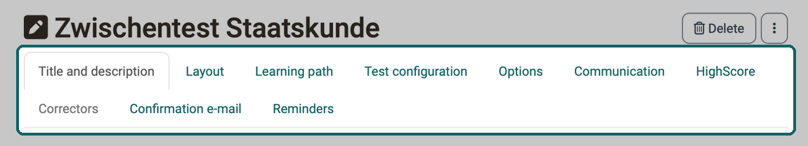{ class="shadow lightbox" title="Course element Test in the course editor · 2026.10.01" }

The tabs "Title and description" and "Layout" are the same for all course elements. The "Correctors" tab is only active if the option "Manual by correctors" is selected in the "Correction" section. The "Badges" tab is added if awarding badges is enabled in the course.

### Tab "Learning path" {: #tab_learning_path}

In the Learning path tab, you define under "Execution" whether the test is "Mandatory" or "Optional" in the learning path course, or whether the course element should not be displayed at all ("Excluded"). With "Enable exceptions", a different execution applies to certain persons or groups. Furthermore, a "Release date", a date under "Due date" and the expected "Learning time (minutes)" can be defined, with "Relative dates" also relative to an event such as the first course visit. The fields of this tab are described on the page [Learning path course - Course editor](Learning_path_course_Course_editor.md).

The following options are also available for tests under "Completion criterion": "Visit course element", "Confirmation by participant", "Score", "Passed" and "Test finished".

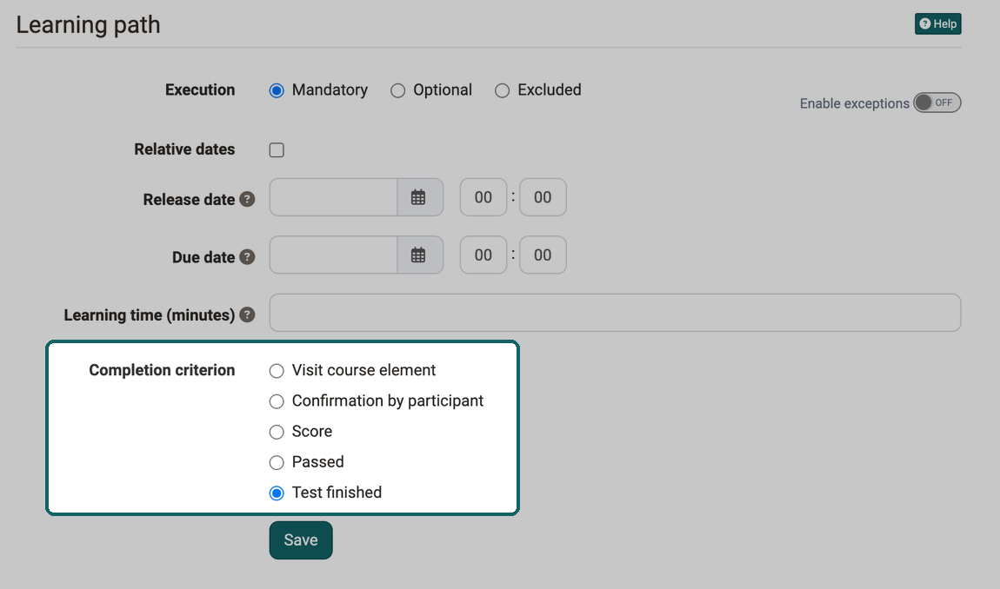{ class="shadow lightbox" title="Learning path tab of the course element Test · 2026.10.01" }

Only if the selected condition is met will the progress be shown to the participants in the learning path display and in the progress percentage.

[Beginning of test configuration section ^](#config) 
[To the top of the page ^](#course_element_test)

### Tab "Test configuration" {: #tab_configuration}

If you have not yet selected a test, a corresponding message will appear in the "Test configuration" tab. You can now "Select" or "Import" an existing test or "Create" a new test. 

!!! tip "Existing Learning Resource"
    If a test learning resource has already been inserted and you want to replace it, please follow the instructions in the section [Changes to tests and self-tests](#changes).

Click on "Select" to assign a test to the course element. You will then also see the options for creating and importing again. Here you select or create the test that you want to use and assign to the course element Test. Further settings can then be made, e.g. the type of correction or the way in which the test results are displayed can be defined.

If you have already linked a test to the course element Test, the name of the test and further information is displayed in the tab "Test configuration" and you can edit the test by clicking on "Edit learning resource".

Click on the "Preview" button to see a test preview and click on the "Replace" button to replace the test by creating or importing a new test. If you want to replace a test for which test results are already available, you will receive a corresponding message and an archive file will be created and can be saved.

An added test can be configured more specifically as follows:

#### Section Test {: #section_test}

**Levels/Grading**: Select one of the given rating scales e.g. grades, levels or emojis and adjust the details if required. Also decide if the level assignment should be automatically visible to the participants or if the assignment should be provided manually by the coach.

**Include in course assessment**: If you switch off this toggle, the test is not taken into account in the course assessment of a learning path course. This setting is not available for a conventional course.

!!! note "Learning Path Course"
    Concept and progress calculation in the learning path course. 
    [Learning path course](../learningresources/Learning_path_course.md)

**Set assessment period**: During the test period, the test can be started. As soon as the "Until" time is reached, the test is automatically ended. Even if the defined time limit has not yet run out. Instead of a fixed date, a relative date can also be chosen, e.g. x days after the first course visit. How the test period and the assessment mode work together is shown in [How do the times of an exam fit together?](../../manual_how-to/exam_preparation/exam_preparation.md#exam_times)

If nothing is activated here, the test is accessible at all times, provided no restrictions have been defined elsewhere, e.g. under "Visibility" for conventional courses or due to a serial sequence for learning path courses.

#### Section Correction {: #section_correction}

**Correction**: The correction is performed either **automatically or manually**. As soon as a question type to be evaluated manually, e.g. free text, is available, a manual evaluation is mandatory. With automatic correction, all questions are corrected automatically and directly, the result is visible to the participants immediately.

!!! note "Question Types"
    Overview of all available question types, including manually evaluated types. 
    [Question types](Test_question_types.md)

In case of manual correction, the visibility of the result is limited and the coach or corrector has to complete the correction manually. Questions to be edited manually include free text, upload file and draw. However, manual correction can also be set if required when the test consists only of automatically evaluable question types.

Three options are available:

* **Automatic**: OpenOlat corrects all questions directly.
* **Manual by course coach/owner**: The coaches or owners of the course do the correction.
* **Manual by correctors**: The correctors from the correction workflow of the learning resource Test do the correction. They can correct a test without being a member or even a coach of the course. This selection also activates the "Correctors" tab, and you can see who is assigned to the test as a corrector.

!!! info "Important"

    The option "Manual by correctors" is available if the [correction workflow](Test_settings.md#correction-workflow) is switched on in the learning resource Test. Correctors are managed independently of the course element, directly on the Test learning resource, and apply across courses. If the correction workflow is switched on and another option is selected, the "Correction" section shows a hint: with this setting no grading assignments are generated, "Manual by correctors" is recommended.

**Release assessment**: The field appears with the two manual options. With "Released", the participants see the assessment directly after the manual correction; with "Not released", only once you release the assessment.

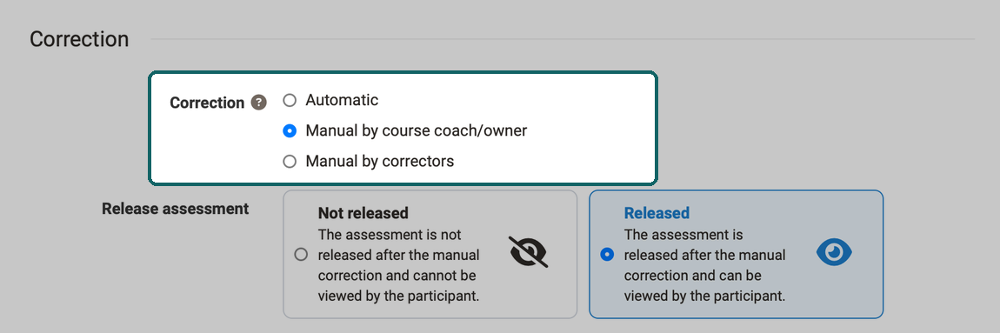{ class="shadow lightbox" title="Correction section in the Test configuration tab · 2026.10.02" }

The correction options and the release are also described on the page [Tests at course level](Tests_at_course_level.md#correction).

#### Section Report {: #section_report}

Here you define whether and in what form the test results and the performance status should be displayed to the learners. If nothing is selected here, learners will not receive any information.

**Show performance summary on test homepage**: If this option is selected, the participants are shown the points and any other performance information such as success status, number of solution attempts and the level reached on the rating scale on the start page of the test.

In addition to the performance summary, the participants can also be shown the specific test evaluation, permanently on the test homepage and directly after processing.

**Show assessment on test homepage**: In this drop-down list you define whether and under which conditions the test evaluation appears on the start page of the test. With "Always", the results are available immediately after the test is finished; with "No", they are not displayed at all. With the other options you define with "From" and "Until" in which period the results appear: only if the test was not passed, only if it was passed, with different periods for both cases or with a common period.

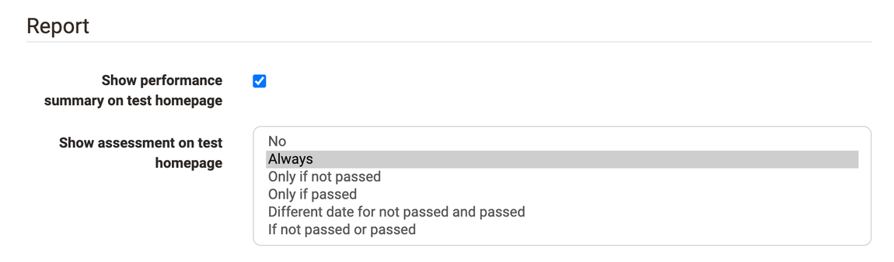{ class="shadow lightbox" title="Report section in the Test configuration tab · 2026.10.01" }

**Show results after test has been submitted**: If this checkbox is activated, the participants see the test evaluation directly after submitting.

It is important that you select under **"Overview results"** the form in which the results are to be displayed. The selection applies to both displays. The field appears as soon as "Show results after test has been submitted" is activated or an option other than "No" is selected under "Show assessment on test homepage".

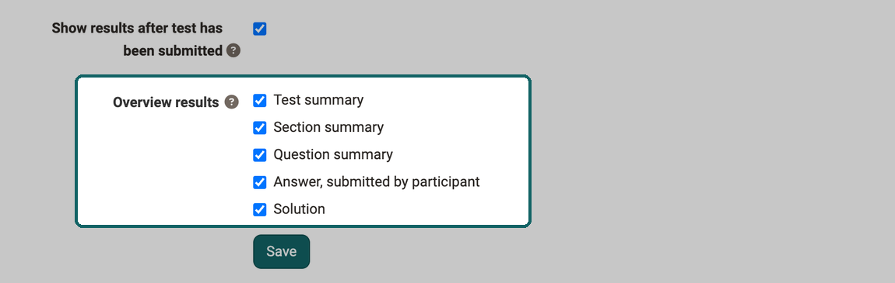{ class="shadow lightbox" title="Report section in the Test configuration tab · 2026.10.01" }

The **Test summary** shows, among other things, the percentage achieved, the time taken to complete the test, the number of questions worked on and the score achieved, as well as the status.

The **Section summary** is only relevant if a test also contains sections.

!!! note "Section Level"
    Description of the section configuration in the test editor. 
    [Section level](Configure_tests.md#section)

In the **Question summary**, the title of the question, the points achieved in each case or the matching percentage value are displayed but not the question itself.

The option **Answer, submitted by participant** shows the question, all answer options, and the choice of the participants, but no rating of whether the question was answered correctly or incorrectly. If this is desired, the option must be combined with other feedback options.

The **Solution** contains the correct answers.

Depending on the combination of display options, different types of feedback can thus be left for the participants.

[Beginning of test configuration section ^](#config) 
[To the top of the page ^](#course_element_test)

### Tab "Options" {: #tab_options}

If you include a test in a course, the settings from the configuration of the learning resource "Test" (see "[Test Settings](Test_settings.md)" and "[Configure Test](Configure_tests.md)") are taken over by default. Therefore, in the "Options" tab, "Apply configuration from learning resource" is preselected and the corresponding settings made in the learning resource Test are displayed here.

If the settings for a test included in the course are to be changed, "Customize configuration" can be selected and the desired changes made. For example, a time limit can be defined, the number of solution attempts can be restricted or guests can be allowed to perform the test. In addition, various display options can be configured.

If the "Show question title" option is not selected but menu navigation is enabled at the same time, only anonymized titles are displayed in the navigation instead of the actual titles.

!!! info "Important"

    These adjustments in the test have no effect on the configuration of the test learning resource itself.

In addition, an information text (HTML page) can also be set up for the test, which is displayed to the participants on the start page of the test above the start button. To do this, click on "Create", "Select" or "Import" in the "Information text (HTML)" section of the "Options" tab.

Activate "Allow linking in the entire storage folder" if you want to link to other HTML files or graphics in the information text, for example. However, this setting also means that experienced participants can view the entire course folder.

[Beginning of test configuration section ^](#config) 
[To the top of the page ^](#course_element_test)

### Tab "Communication" [:octicons-tag-16:{ title="from Release 16.2.0 (OO-5966)" }](https://track.frentix.com/issue/OO-5966) {: #tab_communication}

Here you can set whether participants are allowed to send live chat requests to the coaches or owners of the course during the test. Of course, this only makes sense if real coaches observe the test execution during a defined test period. This procedure is helpful, for example, when conducting online examinations or synchronous admission examinations by test.

[Beginning of test configuration section ^](#config) 
[To the top of the page ^](#course_element_test)

### Tab "HighScore" [:octicons-tag-16:{ title="from Release 11.3 (OO-2133)" }](https://track.frentix.com/issue/OO-2133) {: #tab_highscore}

A highscore overview can also be activated and further configured here for a test. This overview compares the test results of the course participants and ranks the individual results in comparison.

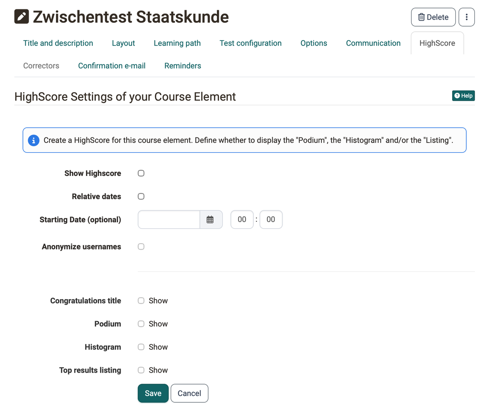{ class="shadow lightbox" title="HighScore tab of the course element Test · 2026.10.01" }

First activate "Show Highscore". Under "Starting Date (optional)" you define from when the highscore appears. With "Relative dates" you specify this date relative to an event, for example the first course visit. With "Anonymize usernames", the participants appear in the highscore without first and last names.

Below, you select what is displayed: "Congratulations title", "Podium", "Histogram" and "Top results listing". At least one display option must be activated. For the listing, you also define whether all or only the top users appear and how many.

!!! note "Highscore"
    More information on the topic of high scores. 
    [Learn more](../learningresources/Course_Elements.md#highscore)

[Beginning of test configuration section ^](#config) 
[To the top of the page ^](#course_element_test)

### Tab "Correctors" [:octicons-tag-16:{ title="from Release 15.0 (OO-4442)" }](https://track.frentix.com/issue/OO-4442) {: #tab_correctors}

The tab is active if the option "Manual by correctors" is selected in the "Correction" section; otherwise it is greyed out. It shows the configuration of the correction workflow and the correctors entered in the learning resource Test. Changes can be made via a link to the learning resource of the test.

[Beginning of test configuration section ^](#config) 
[To the top of the page ^](#course_element_test)

### Tab "Confirmation e-mail" [:octicons-tag-16:{ title="from Release 17.2.0 (OO-6672)" }](https://track.frentix.com/issue/OO-6672) {: #tab_email_confirmation}

Activate the "Confirmation e-mail" if the learners should receive a confirmation after submitting the test. A copy of the e-mail can also be sent to the course owners, assigned coaches or external e-mail addresses.

For the e-mail text, the template and a preset subject with the title of the test course element can be used. Alternatively, both can be changed. In this case, select the option "Own text" under "Template" to edit or completely change the e-mail text.

You can also use different variables such as name or score in the e-mail text.

!!! note "Variables in mailing texts"
    More information on using variables in mailing texts. 
    [Learn more](Course_Element_EMail.md#use-of-variables)

[Beginning of test configuration section ^](#config) 
[To the top of the page ^](#course_element_test)

### Tab "Reminders" [:octicons-tag-16:{ title="from Release 16.0.0 (OO-5447)" }](https://track.frentix.com/issue/OO-5447) {: #tab_reminders}

Here, reminder e-mails can be configured according to certain criteria.

!!! note "Reminders"
    More information about sending reminders. 
    [Learn more](../learningresources/Course_Reminders.md)

[Beginning of test configuration section ^](#config) 
[To the top of the page ^](#course_element_test)

### Tab "Badges" {: #tab_badges}

If the course owner has activated the awarding of badges under `Course > Administration > Settings > Tab Assessment > Section Badges`, the "Badges" tab is displayed in the course editor for this course element and a specific badge can be created for this course element.

!!! note "Badges"
    More information on the topic of badges and how they are awarded. 
    [Badges](../learningresources/OpenBadges.md)

[Beginning of test configuration section ^](#config) 
[To the top of the page ^](#course_element_test)

---

## Compare tests and self-tests {: #compare_test_self-test}

Attribute | :fontawesome-solid-square-pen: Test | :fontawesome-solid-square-pen: Self-test
------|------|------
 Purpose of use | Assessment test, test with assessment option by the teacher, standard test | Exercise, self-assessment, no insight by teacher
 Fabrication with | [Test editor](Test_editor_QTI_2.1.md) | [Test editor](Test_editor_QTI_2.1.md)
 Question types QTI 2.1 | All [Question types](Test_question_types.md) possible | All [Question types](Test_question_types.md) possible, but only automatically assessable question types can be used for points.
 Integration with course element | Test | Self-test
 Number of views by course participants | configurable | unlimited
 Results | appear in the [Assessment tool](../learningresources/Assessment_tool_overview.md) as well as in the test statistics and can be viewed by coaches | do _not_ appear in the [Assessment tool](../learningresources/Assessment_tool_overview.md) and in the test statistics and are not personalized for coaches and owners to view
 Data archiving | Yes, personalized | Yes, anonymized. However, personal allocation or feedback is not possible.

!!! tip "Tip"

    Sometimes it makes sense to use the "Test" type, even if you actually want to provide learners with a self-test. Tests enable learners to be supported individually as needed and also provide feedback on manually assessable question types, and can give teachers feedback on the quality and effectiveness of their questions.

[To the top of the page ^](#course_element_test)

---

## Changes to tests and self-tests {: #changes}

!!! warning "Attention"

    Once a test or self-test is included in a course, only very limited changes can be made under "Edit learning resource". Therefore, tests should not be included in a course until they are completely finished.

Why is that? Assuming you could still add questions in an embedded test or mark other answers as correct, on the one hand not all test subjects would encounter the same conditions. On the other hand, results might have already been saved that cannot be uniquely assigned to a version of the test file after the change. Therefore, editing of already included tests and self-tests is severely limited.

So the question is what you can do if you need to change a test for valid reasons. You have the following option:

### Replacing tests that have already been edited [:octicons-tag-16:{ title="from Release 19.1.10 (OO-8400)" }](https://track.frentix.com/issue/OO-8400) {: #tab_replace_tests}

If you want to change a test retrospectively (e.g., add new questions or correct incorrect answers), first copy the Test learning resource in the authoring area and edit the copy. Then integrate it into the desired course.

To do this, open the relevant course element in the course editor, switch to the "Test configuration" tab, and click Replace. Select the prepared test copy.

There are two options available in the next step:

* **Controlled replacement**: All previous runs and evaluations become invalid, and the evaluation form is reset. You will also receive the previous results as a ZIP download.

* **Replace only**: The test is replaced. Finished test runs remain valid, existing assessments remain unchanged. Ongoing and suspended test runs are collected and marked as invalid.

Before the replacement, a dialog box informs you of the effects. You must explicitly confirm these.

**Example:**
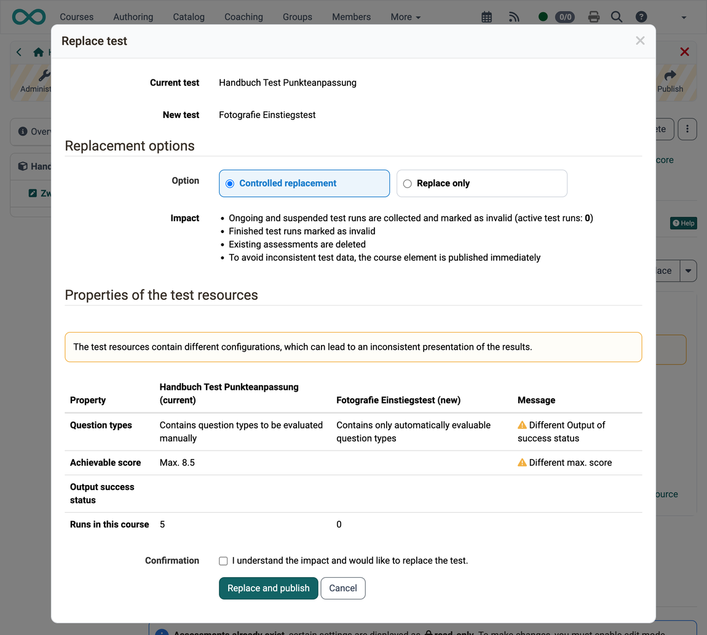{ class="shadow lightbox" title="Replace test dialog · 2026.10.01" }

After the replacement, the link "Show history" also appears next to the "Replace" button.

!!! note "Test History"
    Details on the history of replaced test learning resources. 
    [Test history](#history)

[To the top of the page ^](#course_element_test)

---

## View and assess tests {: #assess}

Anyone who wants to correct and assess completed tests finds all test runs of the course in the assessment tool. Coaches and course owners have access to it: `Course > Administration > Assessment tool`. Navigate to the desired course element Test. In the "Participants" tab, all participants are displayed with the respective processing status for this course element, and you can see in the "Status" column whether an assessment is required. Open assessments are also displayed in the overview under "Open reviews".

!!! note "Assessment Tool"
    Central interface for assessing, grading and managing the assessments of the participants. 
    [Assessment tool](../learningresources/Assessment_tool_overview.md)

Alternatively, the results of a specific test can also be viewed and managed in the course with the course editor closed, directly at the respective test course element. To do this, switch to the "Participants" tab. As the course owner, you also have access to other tabs in the course, such as Preview, Communication, Reminders, and Badges. Some of these tabs are also available to coaches.

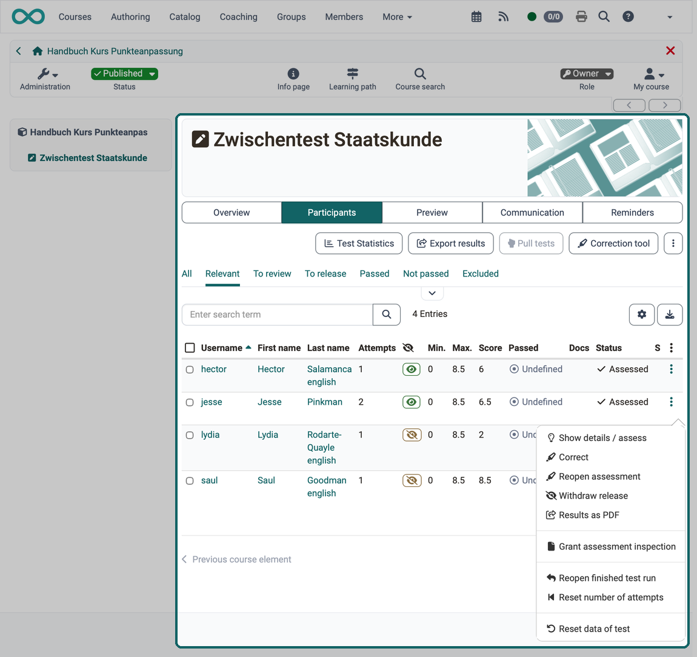{ class="shadow lightbox" title="Participants tab of the course element Test · 2026.10.01" }

If correctors have also been activated for a test, they can assess it via the Coaching Tool.

!!! note "Coaching Tool"
    Cross-course assessment by correctors. 
    [Coaching Tool](../area_modules/Coaching.md)

[To the top of the page ^](#course_element_test)

---

## Test history {: #history}

Anyone who has replaced the test learning resource of a course element keeps the previous results, sees the history of the assignments and can still open the statistics of every test learning resource used.

**A)** If the test learning resource is replaced in a controlled manner, the test results achieved so far with this course element (the test results with the previous learning resource) are automatically saved and exported as a zip file. An Excel file is also included in the export, in which the test results of the individual participants can be tracked.

**B)** If you would like to see when which test learning resource was replaced in the course element, you will find an overview at the "Replace" button. Click on the small arrow next to the button and then on "Show history".

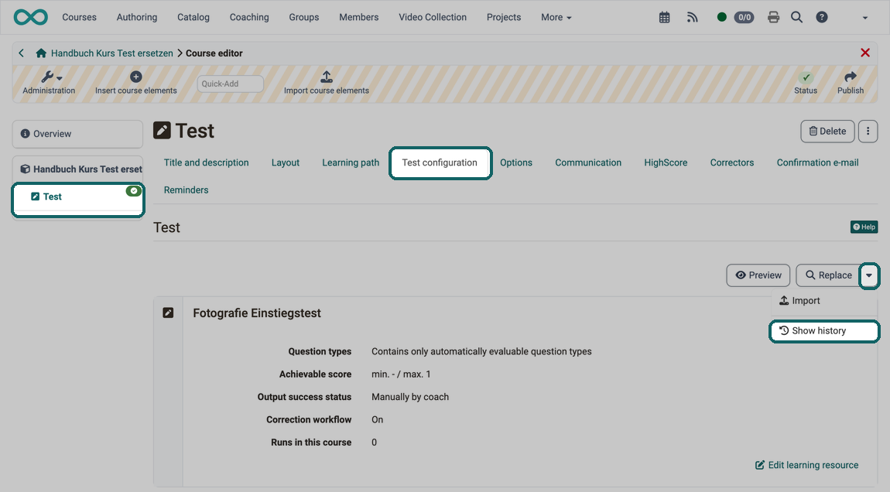{ class="shadow lightbox" title="Test configuration tab in the course editor · 2026.10.01" }

The dialog "History of the test resources" shows for each test learning resource:

* **Assigned on**: when the test learning resource was assigned to the course element.
* **Assigned by**: who assigned it.
* **Runs in this course**: how often the test learning resource was completed in this course. The runs can come from different people who have each taken the test once, or from one person who has completed it several times. Each completion counts as a run.

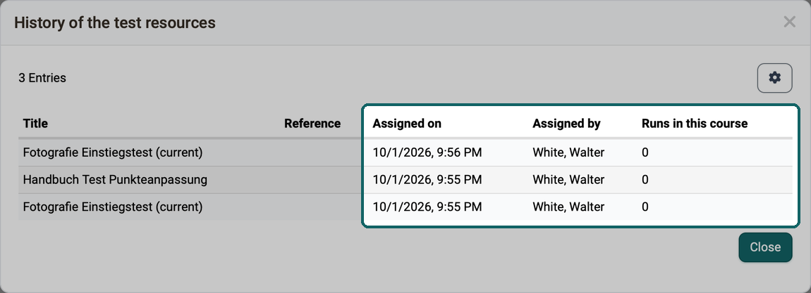{ class="shadow lightbox" title="History of the test resources dialog · 2026.10.01" }

**C)** If the test learning resource is replaced, new test statistics are also created with the new test learning resource. As a coach, select the test course element and the "Participants" tab as usual. The "Test Statistics" button is displayed here.

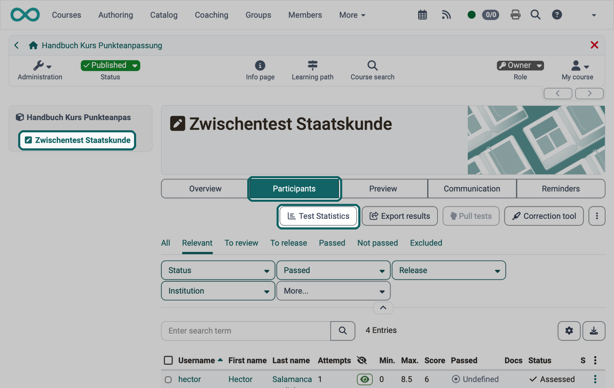{ class="shadow lightbox" title="Participants tab of the course element Test · 2026.10.01" }

If participants in this course have worked on more than one of the test learning resources used, a selection appears at the top right of the test statistics with which you switch between the statistics of the different test versions (test learning resources used).

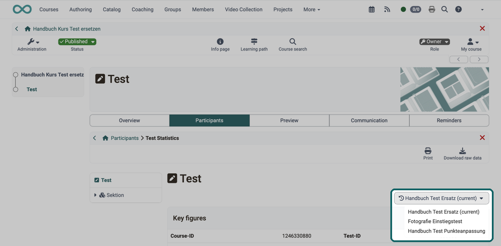{ class="shadow lightbox" title="Test statistics in the course element Test · 2026.10.02" }

!!! note "Note"

    If "Replace only" is selected, the existing assessments remain unchanged. This option should be used with caution. If, for example, 12 points can now be achieved and previously only 10, a maximum of 10 points are still entered in the course. Such entries can lead to confusion and must be corrected manually.

[To the top of the page ^](#course_element_test)

---

## Archiving test results [:octicons-tag-16:{ title="from Release 17.1.0 (OO-6466)" }](https://track.frentix.com/issue/OO-6466) {: #archive}

Anyone who wants to back up the test results of a course collectively, for example together with the results of other assessable course elements, archives them in the course archiving: `Course > Administration > Archiving & Reporting`.

!!! note "Archiving & Reporting"
    Course-wide archiving function for all assessable course elements. 
    [Archiving & Reporting](../learningresources/Course_Archiving.md)

There you can download all course results from all assessable course elements (including tests). Alternatively, you can also select only the results of specific tests and save only those. To do this, select `Course > Administration > Archiving & Reporting > Course archiving > Create archive`. In the wizard, select the archive type "Partial archive" and select the desired test elements in the step "Select course elements". In the step "Settings", choose either "Standard settings" or "Customised" for "Course elements" to adjust the archiving options.

A zip file is created, which is then available in the course archiving area for a certain period of time, e.g., 10 days, and can be copied, downloaded, and deleted. In the wizard step "Settings", with "Customised" selected, there are two variants for the course element Test under **"Export"**:

* The **Standard** export contains detailed test results for each participant in the form of an HTML document and an Excel file with the raw data.
* The **"Advanced – with PDF"** option creates the same zip file, but also adds PDF files with the detailed results for each participant. Please note: Depending on the number of PDF files contained in the zip file, it may take some time to create.

If the test contains essay questions and the **"Advanced – with PDF"** option was selected, the **"Additional option"** with **"Separate PDF file for each essay question"** can additionally be activated below. The answer to each essay question is then placed in the archive as a separate PDF file. [:octicons-tag-16:{ title="from Release 19.1.27 (OO-8964)" }](https://track.frentix.com/issue/OO-8964)

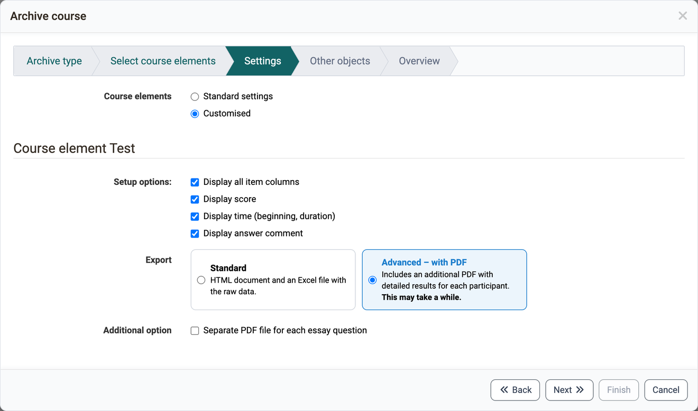{ class="shadow lightbox" title="Settings step in the Archive course dialog · 2026.10.01" }

Course archiving does not offer the option "All PDF files in one folder". In the archive, each PDF file is located in the folder of the participant, named after the person, course element and test. You get the PDF files collected in one folder via the "Export results" button in the "Participants" tab of the course element. How the files are named and stored there is described on the page [Export tests](Test_export.md#pdf_files). [:octicons-tag-16:{ title="from Release 21.1 (OO-9600)" }](https://track.frentix.com/issue/OO-9600)

You can also download the raw data of tests via the test statistics: `Course > Administration > Test statistics`. There you will also find the graphical evaluation.

!!! note "Test Statistics"
    Raw data and graphical evaluation of test results. 
    [Test Statistics](../learningresources/Statistics_Test.md)

[To the top of the page ^](#course_element_test)

---

## Working with tests {: #work_with_tests}

### Application examples
Tests can be used in the following scenarios, among others:

* **Final assessment**: Review of acquired knowledge after a learning or training phase or an online course

* **Pre-test**: Assessment of current knowledge before the start of the course in order to identify existing gaps and determine the focus of the course

* **Interest test**: Self-assessment of one's own level of knowledge and identification of personal preferences and interests

* **Answer-specific feedback**: Tests as individual feedback providers with intensive use of the OpenOlat feedback functions

* **Quiz game**: Playful knowledge assessment in the form of quizzes, quests, storytelling, etc.

* **Online exam**: Conducting exam-relevant online or e-exams

### How to edit a test (Learners perspective) [:octicons-tag-16:{ title="from Release 20.3.0 (OO-8321)" }](https://track.frentix.com/issue/OO-8321) {: #participate_as_learner}

As a learner, you work through a test question by question and can see at any time what has already been answered. To start editing a test press "Start test". Answer the questions displayed and then click "Submit answer" for each question. If generally visible, you can see in the left navigation which questions have already been answered (filled dot), which questions have only been looked at (highlighted circle) and which have not been clicked at all (grey circle). Using the icon to the right of a question, you add a personal marking as a reminder to review the question later.

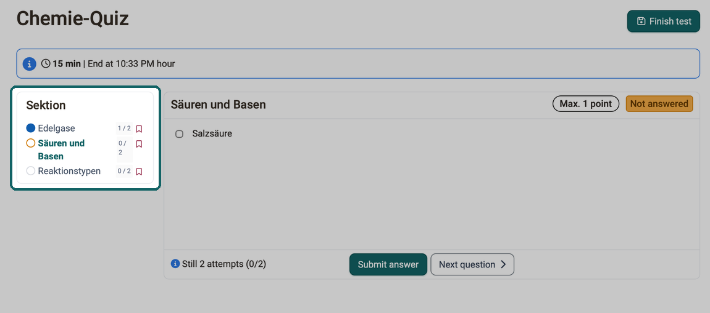{ class="shadow lightbox" title="Test from the participants' view · 2026.10.01" }

Depending on the setting, you can navigate further using the "Next question" button and/or a link in the left-hand navigation or the next question will be displayed automatically. Whether you can skip questions or see the progress of answers also depends on the configuration of the teacher. Depending on the configuration, you can interrupt the test and continue at a later time or cancel it without saving the results.

Work on a test in only one browser window. If the test is interrupted or completed in another window, the window that is still open reports "Test interrupted" or "Test completed" at the next input, with the text "Any input in this window will no longer be saved, as the test has already been completed or interrupted. Please close it now." [:octicons-tag-16:{ title="from Release 21.0.3 (OO-9707)" }](https://track.frentix.com/issue/OO-9707)

If the number of solution attempts is limited for a question, a section, or the entire test, the remaining number is displayed directly next to the question, for example "Still 2 attempts (1/3)". In the left navigation, each question shows the number of attempts used and possible, for example "1 / 2"; the remaining number appears there as a tooltip.

When you have finished editing and want to complete the test, click on the "Finish test" button. You will be asked once again for confirmation and if you confirm this, the test will be saved and will be visible to the teachers.

If a test consists of several [test parts](Configure_tests.md#testpart), you work on them one after the other and finish each one separately. A finished test part is submitted: its answers are saved, and you do not return to it. At the beginning, OpenOlat shows the page "Begin test" with the number of parts, for example "This test consists of up to 2 parts.", and the button "Enter Test".

* The menu on the left only shows the sections and questions of the current test part. If menu navigation is switched off in the course element, the button "Test question menu" leads to the page "Test part question menu" with these questions.
* At the top right, the button "Finish test part" is shown instead of "Finish test". Depending on the setting of the test, it only appears when all questions of the test part have been answered.

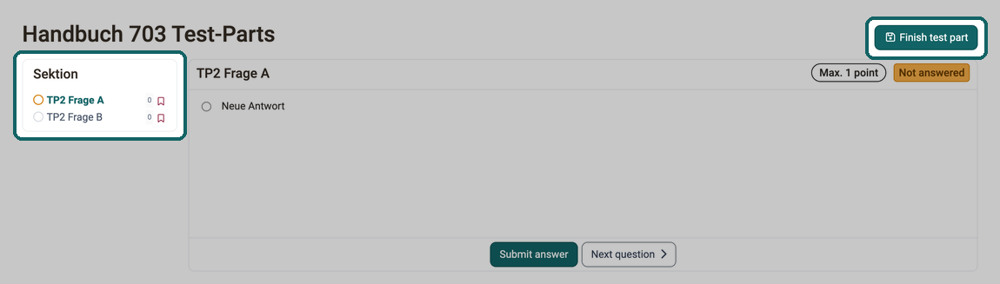{ class="shadow lightbox" title="Test with several test parts from the participants' view · 2026.10.07" }

* After clicking "Finish test part", OpenOlat asks: "Finish / Are you sure? This will commit your answers for this test part." With "Ok" you submit the test part.
* If a review is provided, the page "Test part complete" appears next. Under "Review your responses" you can view your answers, but you can no longer change them. With "Close test part" and the confirmation "Advance test part" you go to the next test part. Without review, you go directly to the next test part.
* In the last test part, the button is also called "Finish test part", the confirmation has the title "Finish test". With the confirmation, the whole test is completed.

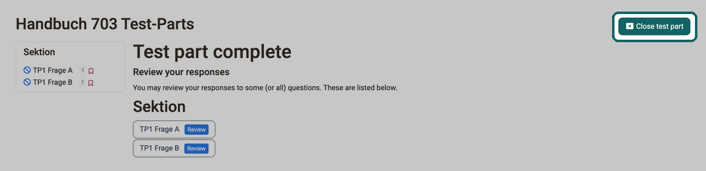{ class="shadow lightbox" title="Page Test part complete · 2026.10.07" }

Whether, how and when you see the results and the performance summary depends on the test configuration.

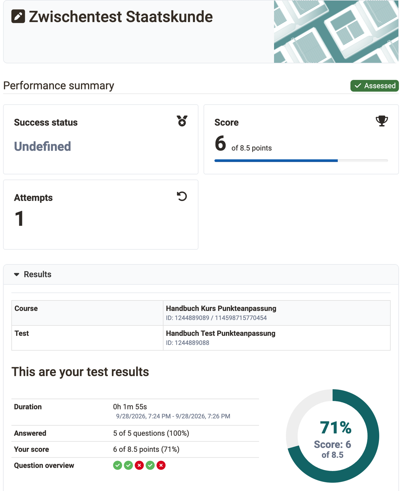{ class="shadow lightbox" title="Performance summary of a test from the participants' view · 2026.10.01" }

If you have more attempts available to process the test, you can run through the test again with "Start test". Previous runs will be retained.

[To the top of the page ^](#course_element_test)

---

## Further information {: #further_information}

**Mentioned on this page** 
[Test question types >](Test_question_types.md) 
[Course Element "Self-test" >](Course_Element_Self_Test.md) 
[Creating Tests >](Test.md) 
[Learning path course - Course editor >](Learning_path_course_Course_editor.md) 
[Learning path course - Overview >](Learning_path_course.md) 
[How do I prepare an online exam? >](../../manual_how-to/exam_preparation/exam_preparation.md) 
[Test settings - Administration >](Test_settings.md) 
[Tests at course level >](Tests_at_course_level.md) 
[Configure tests >](Configure_tests.md) 
[Types of Course Elements >](Course_Elements.md) 
[Course Element "E-Mail" >](Course_Element_EMail.md) 
[Course Reminders >](Course_Reminders.md) 
[Badges >](OpenBadges.md) 
[Test editor QTI 2.1 >](Test_editor_QTI_2.1.md) 
[Assessment tool - overview >](Assessment_tool_overview.md) 
[Coaching - Overview >](../area_modules/Coaching.md) 
[Course administration - Archiving & Reports >](Course_Archiving.md) 
[Export tests >](Test_export.md) 
[Test statistics >](Statistics_Test.md)

**Further reading** 
[Test question configuration >](Configure_test_questions.md) 
[Assessing tests >](Assessing_tests.md) 
[Coaching - Assessment Orders >](../area_modules/Coaching_Assessment_Orders.md)

[To the top of the page ^](#course_element_test)
