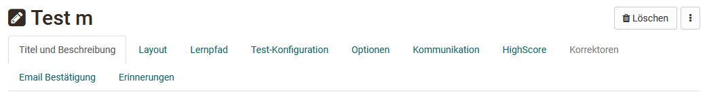
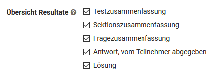

# Course Element "Test" {: #course_element_test}

## Profile

Name | Test
---------|----------
Icon | { class=size24 }
Available since | 
Functional group | Assessment
Purpose | Course element for integration of a learning resource test into a course
Assessable | yes
Specialty / Note |

The course element "Test" integrates tests into a course. A test in a course is used to assess achievements and includes various question types.

Depending on the choice of "[Question types](../learningresources/Test_question_types.md)", one or more answers can be ticked, elements can be moved by drag & drop, texts and/or numbers can be inserted, files can be added, markers or (very simple) drawings can be created. The evaluation is then carried out manually or automatically, depending on the question type. 

Several tests can also be used for different purposes per OpenOlat course. The results of course participants are recorded on a personalized basis.

OpenOlat uses the IMS-QTI 2.1 format for tests, which allows exchange with other test systems and learning management systems that also support this standard.

The two main tabs for test configuration are **Test configuration** and "**Options**".

!!! Warning "Attention"

    If participants are currently taking the test but have not yet completed it, their results will be lost. Likewise, all results obtained between the replacement of the test and the publication of this change will be lost.

!!! info "Note"

    {class="size24"}

    There are two different course elements for tests in OpenOlat: "Tests" and ["Self_Tests"](../learningresources/Course_Element_Self_Test.md). In contrast to the test, the test results are saved anonymously in the self-test. Self-tests are suitable for practice purposes and can be completed indefinitely. The results of self-tests are also displayed automatically once the test has been completed.

    The handling of self-tests is otherwise identical to the handling of the tests.

Further information on the learning resource Test
can be found in the chapter "[Create tests](../learningresources/Test.md)".

[To the top of the page ^](#course_element_test)

---

## Test configuration

To do so, open the course, go to the course editor and add a course element "Test" or select an already added course element Test. You will now see the following tabs:

{ class="shadow" }

The tabs "Title and description" and "Layout" are the same for all course elements.

### Tab "Learning path" {: #tab_learning_path}

In the Learning path tab, you can define whether the test is mandatory for the learning path course, whether it should not be used for the learning path display ("Voluntary" setting) or whether the course element should not be displayed at all ("Excluded" setting). Furthermore, a release date, a maximum processing date and the expected processing time can be defined. 

The following completion criteria are also available for tests: 

{ class="shadow" }

Only if the selected condition is met will the progress be shown to the user in the learning path display and in the progress percentage.

[Beginning of test configuration section ^](#config) 
[To the top of the page ^](#course_element_test)

### Tab "Test configuration" {: #tab_configuration}

If you have not yet selected a test, a corresponding message will appear in the "Test configuration" tab. You can now "Select" or "Import" an existing test or "Create" a new test. 
If a test learning resource has already been inserted and you want to replace it, please follow the instructions in the section [Changes to tests and self-tests](#changes).

Click on "Select" to assign a test to the course element. You will then also see the options for creating and importing again. Here you select or create the test that you want to use and assign to the course element Test. Further settings can then be made, e.g. the type of correction or the way in which the test results are displayed can be defined.

If you have already linked a test to the course element Test, the name of the test and further information is displayed in the tab "Test configuration" and you can edit the test by clicking on "Edit learning resource".

Click on the "Preview" button to see a test preview and click on the "Replace" link to replace the test by creating or importing a new test. If you want to replace a test for which test results are already available, you will receive a corresponding message and an archive file will be created and can be saved.

An added test can be configured more specifically as follows:

#### Section Test {: #section_test}

**Assessment with grading/marks**:
Select one of the given rating scales e.g. grades, levels or emojis. You can also adjust the points lower limit afterwards. Also decide if the level assignment should be automatically visible to the user or if the assignment should be provided manually by the coach.

**Exclude from course evaluation**: If the check mark is set here, the test will not be taken into account when calculating progress in a [learning path course](../learningresources/Learning_path_course.md). This setting is not available for a conventional course.

**Set test period**: During the test period, the test can be started. As soon as the "until time" is reached, the test is automatically ended. Even if the defined processing time has not yet been used up. Instead of a fixed date, a relative date can also be chosen, e.g. x days after the first course visit.

If nothing is activated here, the test is accessible at all times, provided no restrictions have been defined elsewhere, e.g. under "Visibility" for conventional courses or due to a serial sequence for learning path courses.

#### Section Correction {: #correction}

**Correction**: The correction is performed either **automatically or manually**. As soon as a [Question type](Test_question_types.md) to be evaluated manually, e.g. free text, is available, a manual variant must be selected. With automatic correction, all questions are corrected automatically and directly, the result is visible immediately.

In case of manual correction, the visibility of the result is limited and the coach or corrector has to complete the correction manually. Questions to be edited manually include free text, upload file and draw. However, manual correction can also be set if required when the test consists only of automatically evaluable question types.

If the option "**Manually by external graders**" is activated, OpenOlat users can also correct a test without being a member or even a coach of the course. This selection also activates the "Corrector" tab and you can see who is assigned to the test as a corrector.

[Test Tab Korrektoren](assets/Test_Tab_Korrektoren_DE.png){ class="shadow" }

!!! info "Note"

    If the option "Manually by external correctors" is not available, no [external correctors](Test_settings.md) have been configured in the learning resource Test.

**Release rating**: Set here whether the results are released by default or not.

{ class="shadow" }

#### Section Report {: #report}

Here you define whether and in what form the test results and the performance status should be displayed to the learners. If nothing is selected here, learners will not receive any information.

**Display points on test home page**: If this option is selected, users are shown the points and any other performance information such as success status, number of solution attempts and the level reached on the rating scale on the start page of the test.

In addition to the performance overview, the user can also be shown the specific test evaluation both directly after processing (**Display results after submitting the test**) and permanently on the course start page (**Display results on test home page**). Check the appropriate boxes.

However, it is important that you specifically select the form in which the results are to be displayed in the next step under **"Overview of results"**.

If the "Always" field is selected, the results will be available immediately after the test is finished. If "No" is selected, the results will not be displayed at all. And for the other options, criterion- or date-dependent displays can be defined.

{ class="shadow" }

The **Test Summary** shows, among other things, the percentage achieved, the time taken to complete the test, the number of questions worked on and the score achieved, as well as the status.

The **Section Summary** is only relevant if a test also contains [Sections](Configure_tests.md#section-level--section).

In the **Question Summary**, the title of the question, the points achieved in each case or the matching percentage value are displayed but not the question itself.

The **Participant Response** shows the question, all answer options, and the user's choice, but no rating of whether the question was answered correctly or incorrectly. If this is desired, the option must be combined with other feedback options.

The **solution** contains the correct answers.

Depending on the combination of display options, different types of feedback can thus be left for the user.

For the display on the start page, you can also define the conditions under which it should be displayed.

{ class="shadow" }

[Beginning of test configuration section ^](#config) 
[To the top of the page ^](#course_element_test)

### Tab "Options" {: #tab_options}

If you include a test in a course, the settings from the configuration of the learning resource "Test" (see "[Test Settings](Test_settings.md)" and "[Configure Test](Configure_tests.md)") are taken over by default. Therefore, in the "Options" tab, "Apply configuration from learning resource" is preselected and the corresponding settings made in the learning resource Test are displayed here.

If the settings for a test included in the course are to be changed, "Customize configuration" can be selected and the desired changes made. For example, a time limit can be defined, the number of solution attempts can be restricted or guests can be allowed to perform the test. In addition, various display options can be configured.

If the "Show question title" option is not selected but menu navigation is enabled at the same time, only anonymized titles are displayed in the navigation instead of the actual titles.

!!! info "Hinweis"

    These adjustments in the test have no effect on the configuration of the test learning resource itself.

In addition, an information text (HTML page) can also be set up for the test, which is displayed to the user on the start page of the test above the start button. To do this, click on "Create", "Select" or "Import" in the "Information text (HTML)" section of the "Options" tab.

Activate "Allow linking in the entire storage folder" if you want to link to other HTML files or graphics in the information text, for example. However, this setting also means that experienced course participants can view the entire course folder.

[Beginning of test configuration section ^](#config) 
[To the top of the page ^](#course_element_test)

### Tab "Communication" {: #tab_communication}

Here you can set whether participants are allowed to send live chat requests to the course coaches or owners during the test. Of course, this only makes sense if real coaches observe the test execution during a defined test period. This procedure is helpful, for example, when conducting online examinations or synchronous admission examinations by test. 

[Beginning of test configuration section ^](#config) 
[To the top of the page ^](#course_element_test)

### Tab "HighScore" {: #tab_highscore}

A highscore overview can also be activated and further configured here for a test. This overview compares the test results of the course participants and ranks the individual results in comparison. 

{ class="shadow" }

You can find more information on the topic of high scores [here](../learningresources/Course_Elements.md)

[Beginning of test configuration section ^](#config) 
[To the top of the page ^](#course_element_test)

### Tab "Correctors"

If correctors have been defined for the test in the learning resource via the correction workflow of the learning resource, an overview of the correctors and further information appears here. Changes can be made via a link to the learning resource of the test.

[Beginning of test configuration section ^](#config) 
[To the top of the page ^](#course_element_test)

### Tab "E-mail Confirmation" (:octicons-tag-24: Release 17.2.) {: #tab_email_confirmation}

Activate the e-mail confirmation if you want to confirm the submission of the test by e-mail. You can use different variables like name or score in the mail text. A copy of the mail can also be sent to the course owners, responsible coaches or external mail addresses.

For the mail text you can use the template and a preset subject with the title of the test course module in the subject. Alternatively, the template and the subject can also be changed. In this case, select "Template" -> "Custom Text" to edit or completely change the mailing text.

You can also use different variables such as name or score in the mail text. For more information on using variables in mailing texts, see [here](Course_Element_EMail.md#use-of-variables).

[Beginning of test configuration section ^](#config) 
[To the top of the page ^](#course_element_test)

### Tab "Reminders" {: #tab_reminders}

Here, reminder e-mails can be configured according to certain criteria. More information about sending reminders can be found [here](../learningresources/Course_Reminders.md).

[Beginning of test configuration section ^](#config) 
[To the top of the page ^](#course_element_test)

### Tab "Badges" {: #tab_badges}

If the course owner has activated the assignment of badges under **Administration > Settings > Assessment tab > Badges** section, the "Badges" tab will be displayed in the course editor for this course element and a specific badge can be created for this course element.

[Beginning of test configuration section ^](#config) 
[To the top of the page ^](#course_element_test)

---

## Compare tests and self-tests {: #compare_test_self-test}

Attribute | { class=size16 } Test | { class=size16 } Selbsttest
------|------|------
 Purpose of use | Assessment test, test with assessment option by the teacher, standard test | Exercise, self-assessment, no insight by teacher
 Fabrication with | [Test editor](Test_editor_QTI_2.1.md) | [Test editor](Test_editor_QTI_2.1.md)
 Question types QTI 2.1 | All [Question types](Test_question_types.md) possible | All [Question types](Test_question_types.md) possible, but only automatically assessable question types can be used for points.
 Integration with course module | Test | Self-test
 Number of views by course participants | configurable | unlimited
 Results | appear in [Assessment tool](../learningresources/Assessment_tool_overview.md) as well as in [Test statistics](../learningresources/Using_Course_Tools.md#statistics) and can be viewed by coaches | do _not_ appear in [Assessment tool](../learningresources/Assessment_tool_overview.md) and in the [Test statistics](../learningresources/Using_Course_Tools.md#test-statistics) and are not personalized for coaches and owners to view
 Data archiving | Yes, personalized | Yes, anonymized. However, personal allocation or feedback is not possible.

!!! tip "Hint"

    Sometimes it makes sense to use the "Test" type, even if you actually want to provide learners with a self-test. Tests make it possible to support learners individually if necessary and also to provide feedback on manually assessable question types.

[To the top of the page ^](#course_element_test)

---

## Changes to tests and self-tests {: #changes}

!!! warning "Attention"

    Once a test or self-test is included in a course, only very limited changes can be made under "Edit content". Therefore, tests should not be included in a course until they are completely finished.

Why is that? Assuming you could still add questions in an embedded test or mark other answers as correct, on the one hand not all test subjects would encounter the same conditions. On the other hand, results might have already been saved that cannot be uniquely assigned to a version of the test file after the change. Therefore, editing of already included tests and self-tests is severely limited.

**The work-around with only one learning resource**

For example, if you want to add a new question to a test or an answer was mistakenly marked as correct, copy the Test learning resource in the authoring area and resave the test that way. Edit and correct the test and then integrate it into the desired course. To do this, switch to the course editor and replace the file in the course element of the desired test. If results have already been received, they will be archived in your personal folder (private) and you can decide whether OpenOlat should inform those course participants who have already taken the test about the change.

**Use of several test learning resources one after the other in the same test course element** (from release 19.1.10)

If you replace the test learning resource in a test course element that has already been completed by participants, a **controlled replacement** can be carried out from release 19.1.10 onwards. All previous test runs are then marked as invalid and reset. The evaluation form is also deleted/reset. With the "Replace only" option, however, nothing is reset in the participants' test results.

If you want to replace the learning resource in a used test course element, a dialog appears.  (**Course editor > Select course element > Test configuration tab > Replace learning resource**) 
You will be informed of the effects of the exchange and the differences between the various test learning resources.
You must also expressly confirm that you are aware of these effects and wish to exchange the test learning resource.

**Example:**
{ class="shadow" }

[To the top of the page ^](#course_element_test)

---

## View and assess tests {: #evaluate}

Access tests completed by course participants in the "[Assessment tool](../learningresources/Assessment_tool_overview.md)". The assessment tool can be found in the "Administration" of the course. Navigate to the desired course element Test. In the "Participants" tab, all course participants are displayed with the respective processing status for this course element and you can see in the "Status" column whether an assessment is required. Open reviews are also displayed in the overview under "Open reviews".

Alternatively, the results can also be viewed and managed in the course run with the editor closed directly in the respective test course element. In the course run, it is also possible to configure reminders for the respective test and thus trigger a condition-dependent e-mail dispatch.

{ class="shadow" }

If external correctors have also been activated for a test, they can assess it via the [Coaching Tool](../area_modules/Coaching.md).

[To the top of the page ^](#course_element_test)

---

## Test history {: #history}

**A)** If the test learning resource is replaced in a controlled manner, the test results achieved so far with this course element (the test results with the previous learning resource) are automatically saved and exported as a zip file. An Excel file is also included in the export, in which the test results of the individual participants can be tracked.

**B)** If you would like to see when which test learning resource was replaced in the course element, you will find an overview under the "Replace" button. Click on the small arrow next to the button and then on "Show history".

{ class="shadow" }

You can see this in the list displayed,

 when the learning resource was exchanged ("Assigned on") 
 by whom it was replaced ("Assigned by") 
 how often the test learning resource has been completed by participants ("Runs in this course").  Please note that the number of runs can come from different people who have each taken the test once. However, it is also possible that a person has completed the test several times. The multiple attempts also count as runs.

{ class="shadow" }

**C)** If the test learning resource is replaced, new test statistics are also created with the new test learning resource.
As a coach, select the test course element and the "Participants" tab as usual. The "Test statistics" button is displayed here. 

{ class="shadow" }

If the test learning resource has been replaced, a button for switching between the statistics of the different test versions (test learning resources used) is displayed at the top right. 

{ class="shadow" }

!!! note "Note"

    If "Replace only" is selected, nothing is reset and added to the history! This option should be used with caution. If, for example, 12 points can now be achieved and previously only 10, a maximum of 10 points are still entered in the course. Such entries can lead to confusion and must be corrected manually.

[To the top of the page ^](#course_element_test)

---

## Test results and archiving {: #archive}

In the course view, select from the "Administration" -> [Data archiving](../learningresources/Using_Course_Tools.md#data-archiving-tool--archive)". Go to "Tests" on the left or also completely to "Course results" and save the displayed file. The results of self-tests are saved anonymously.

After archiving, you will find all the information about which person (anonymized by a run number in the case of self-testing) answered which questions, which answers they gave, and how many points were achieved in the case of self-testing.

Attention: Archiving will change with OpenOlat :octicons-tag-24: Release 19 and will then take place in the "Archiving & Reporting" menu of the administration. 

Via Administration -> "[Test Statistics](../learningresources/Using_Course_Tools.md#test-statistics)" you can also quickly access the graphical analysis of your test data.

[To the top of the page ^](#course_element_test)

---

## Working with tests

### Application examples
In general, tests in OpenOlat are used to test knowledge. Here are a few examples of the use of tests:
* Tests for knowledge verification after a phase of knowledge transfer
* Tests to check the current level of knowledge before a course, to determine where there are still deficits or to define which aspects should be particularly addressed in the course.
* Tests to check your own level of knowledge on a topic, to identify preferences and interests
* Tests as individual feedback providers, provided that the OpenOlat feedback options are used intensively
* Tests in the sense of quizzes as a playful component
* Tests as an online exam

### How to edit a test (Learners perspective)

To start editing a test press "Start test". Answer the questions displayed and then click "Save answer" for each question. If generally visible, you can see in the left navigation which questions have already been answered, which questions have only been looked at and which have not been clicked at all.

Depending on the setting, you can navigate further using the "Next question" button and/or a link in the left-hand navigation or the next question will be displayed automatically. Whether you can skip questions or see the progress of answers also depends on the configuration of the teacher. Depending on the configuration, you can interrupt the test and continue at a later time or cancel it without saving the results.

When you have finished editing and want to complete the test, click on the "End test" button. You will be asked once again for confirmation and if you confirm this, the test will be saved and will be visible to the teachers.

Whether, how and when you see the results and the performance overview depends on the test configuration.

If you have more attempts available to process the test, you can run through the test again with "Start test". Previous runs will be retained.

[To the top of the page ^](#course_element_test)
