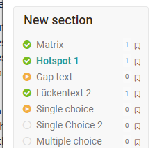

# Course Element "Test" {: #course_element_test}

## Profile

Name | Test
---------|----------
Icon | { class=size24 }
Available since | 
Functional group | Assessment
Purpose | Course element for integration of a learning resource test into a course
Assessable | yes
Specialty / Note |

The course element "Test" integrates tests into a course. A test in a course is used to assess achievements and includes various question types. Depending on the choice of "[Question types](../learningresources/Test_question_types.md)", it is evaluated automatically or manually. OpenOlat uses the IMS-QTI 2.1 format for tests, which allows exchange with other test systems and learning management systems that also support this standard.

If you have not selected any test yet, there will be a message saying _No file chosen_ under the tab "Test configuration". Click on "Choose, create or import file" to add a test to the course element, or to create a new test, respectively. In case you have already selected a test the name of this learning resource will be displayed after _Selected file_. Click on the name to open a preview of the test. Click on "Replace file" if you would like to exchange the learning resource with another one. Further information can be
found in the chapter "[Configure Tests](../learningresources/Configure_tests.md)".

The two main [tabs](../learningresources/Tests_at_course_level.md) for test configuration are **Test configuration** and "**Options**".

The settings under "Options" are initially being copied from the options of the learning resource. However, the options can be adjusted if needed. To do so, open the tab "Options" and click on "Adjust configuration". You may now set a time limit, limit the number of attempts, allow guests to do the test, choose from various display options, etc. If the option "Show question title" is not selected while menu navigation is allowed, the navigation will only show "anonymised" titles, not the real titles.

Furthermore, you can set up an information text (HTML page) which will be visible at the test start page as "Information", above the "Start" button. To add a file go to the tab "Options" and click on "Select page" or "Create page and open in editor". You can replace the file later if needed.

Once you have selected a file, the "security setting" field is added to the display and you can allow links to files in the storage folder. This is useful, for example, if you want to link to other HTML files or graphics. However, this setting also means that experienced course participants can view the entire folder of the course.

If you want to replace the included test, click "Replace file" in the "Test configuration" tab and select the new test. If test results from course participants are already available, you can download them in the next step.

Any test linked to a course can only be edited in your test-editor as long as there are no users launching and taking it. After that only typing errors can be corrected.

!!! attention

    In case participants are taking a test at that moment all their results will be lost since that test is not complete. All results achieved between replacing and publishing a test will be lost as well.

The test results of the participants will be personalised.

!!! info "Note"

    {class="size24"}

    In OpenOlat there are two different course elements for tests: "Tests" and "Self-tests". In contrast to the test, in the self-test the test results are stored anonymously. Self-tests are suitable for practice purposes and can be completed without limit. The results of self-tests are also displayed automatically after the test is completed.

    The handling of self-tests is otherwise identical to the handling of tests.

## Test configuration

To do so, open the course, go to the course editor and add a course element "Test" or select an already added course element Test. You will now see the following tabs:

{ class="shadow" }

The tabs "Title and description" and "Layout" are the same for all course elements.

### Tab "Learning path"

In the tab Learning path you can define if the course element is mandatory for the learning path course, if it should not be used for the learning path display ("Voluntary" setting) or if the course element should not be displayed at all ("Excluded" setting). Furthermore, a release date, a maximum processing date and the expected processing time can be defined. Furthermore, the following completion criteria are available for tests:

{ class="shadow" }

### "Test configuration" tab

Here you select or create the test you want to use and assign to the course element Test. Subsequently, further settings can be made, e.g. the type of correction or the type of display of the test results can be defined.

In detail, the following settings are possible after you have created or assigned a learning resource test:

#### Section Test

**Evaluation with grading/marks**:
Select one of the given rating scales e.g. grades, levels or emojis. You can also adjust the points lower limit afterwards. Also decide if the level assignment should be automatically visible to the user or if the assignment should be provided manually by the coach.

**Exclude from course evaluation**: If the check mark is set here, the test will not be taken into account when calculating progress in a [learning path course](../learningresources/Learning_path_course.md). This setting is not available for a conventional course.

**Set test period**: During the test period, the test can be started. As soon as the "until time" is reached, the test is automatically ended. Even if the defined processing time has not yet been used up. Instead of a fixed date, a relative date can also be chosen, e.g. x days after the first course visit.

#### Section Correction {: #correction}

**Correction**: The correction is performed either **automatically or manually**. As soon as a [Question type](Test_question_types.md) to be evaluated manually, e.g. free text, is available, a manual variant must be selected. With automatic correction, all questions are corrected automatically and directly, the result is visible immediately.

In case of manual correction, the visibility of the result is limited and the coach or corrector has to complete the correction manually. Questions to be edited manually include free text, upload file and draw. However, manual correction can also be set if required when the test consists only of automatically evaluable question types.

If the option "**Manual by external graders**" is activated, OpenOlat users can also correct a test without being a member or even a coach of the course. This selection also activates the "Corrector" tab and you can see who is assigned to the test as a corrector.

[Test Tab Korrektoren](assets/Test_Tab_Korrektoren_DE.png){ class="shadow" }

!!! info "Note"

    If the option "Manual by external correctors" is not available, no [external correctors](Test_settings.md) have been configured in the learning resource Test.

**Release rating**: Set here whether the results are released by default or not.

* Not released: By default, the assessment of the test is not released and cannot be viewed by the participants.
* Released: The rating is released by default and can be viewed by the participants.

{ class="shadow" }

#### Section Report {: #report}

**Display points on test home page**: When this option is selected, the points are displayed on the test home page for the user.

**Display rating on test home page**: This can be used to define whether or under which conditions the rating should be displayed on the test start page.

{ class="shadow" }

If the "Always" field is selected, the results will be available immediately after the test is finished. If "No" is selected, the results will not be displayed at all. And for the other options, criterion- or date-dependent displays can be defined.

**Display assessment after test completion**: This configures what information learners receive. The selected choice is the same for "Show results on test home page" and "Show results after test completion":

{ class="shadow" }

The **Test Summary** shows, among other things, the percentage achieved, the time taken to complete the test, the number of questions worked on and the score achieved, as well as the status.

The **Section Summary** is only relevant if a test also contains [Sections](Configure_tests.md#section-level--section).

In the **Question Summary**, the title of the question, the points achieved in each case or the matching percentage value are displayed but not the question itself.

The **Participant Response** shows the question, all answer options, and the user's choice, but no rating of whether the question was answered correctly or incorrectly. If this is desired, the option must be combined with other feedback options.

The **solution** contains the correct answers.

Depending on the combination of display options, different types of feedback can thus be left for the user.

### Tab "Options"

If you include a test in a course, the settings from the configuration of the learning resource "Test" (see "[Test Settings](Test_settings.md)" and "[Configure Test](Configure_tests.md)") are taken over by default. Therefore, in the "Options" tab, "Apply configuration from learning resource" is preselected and the corresponding settings made in the learning resource Test are displayed here.

If the settings for a test included in the course are to be changed, "Customize configuration" can be selected and the desired changes made. These adjustments in the test do not affect the configuration of the learning resource Test itself.

### Tab "Kommunikation"

Here you can set whether participants are allowed to send live chat requests to the course coaches or owners during the test. Of course, this only makes sense if real coaches observe the test execution during a defined test period.

### Tab "HighScore"

A highscore overview can also be activated and further configured here for a test.

{ class="shadow" }

### Tab "Correctors"

An overview of the correctors and further information appears. Changes can be made via a link to the learning resource of the test.

### Tab "Email Confirmation" (:octicons-tag-24: Release 17.2.)

Activate the Email confirmation if you want to confirm the submission of the test by email. You can use different variables like name or score in the mail text. A copy of the mail can also be sent to the course owners, responsible coaches or external mail addresses.

For the mail text you can use the template and a preset subject with the title of the test course module in the subject. Alternatively, the template and the subject can also be changed. In this case, select "Template" -> "Custom Text" to edit or completely change the mailing text.

For more information on using variables in mailing texts, see [here](Course_Element_EMail.md#use-of-variables).

### Tab "Reminders"

Here, reminder emails can be configured according to certain criteria. More information about sending reminders can be found [here](../learningresources/Course_Reminders.md).

## Comparing Tests and Self-tests

Feature | { class=size16 } Test | { class=size16 } Self-test
------|------|------
 Intended use | Exam test, Test with possibility of examination by the teacher, Standard Test | Practice, Self evaluation, no insight by teacher
 Production with | [Test editor](Test_editor_QTI_2.1.md) | [Test editor](Test_editor_QTI_2.1.md)
 Question types QTI 2.1 | All [Question types](Test_question_types.md) possible | All [Question types](Test_question_types.md) possible, but only question types that can be evaluated automatically can also be used for points.
 Integration with course element | Test| Self-test
 Number of calls by course participants | configurable | unlimited
 Results | appear in [Assessment tool](../learningresources/Assessment_tool_overview.md) as well as in the [Test statistics](../learningresources/Using_Course_Tools.md#test-statistics) and are visible for coaches | do _not_ appear in the [Assessment tool](../learningresources/Assessment_tool_overview.md) and in the [Test statistics](../learningresources/Using_Course_Tools.md#test-statistics) and are not personalized for coaches and owners to see
 Data archiving| yes, personalized | yes, anonymously. However, a personal assignment or feedbacks are not possible.

!!! tip "Hint"

    Sometimes it is useful to use the type "test" even if you actually want to provide learners with a self-test. Tests allow to provide individual support to learners when needed and also to provide feedback on manually assessable question types.

## Changes to tests and self-tests

!!! warning "Attention

    Once a test or self-test is included in a course, only very limited changes can be made under "Edit content". Therefore, tests should not be included in a course until they are completely finished.

Why is that? Assuming you could still add questions in an embedded test or mark other answers as correct, on the one hand not all test subjects would encounter the same conditions. On the other hand, results might have already been saved that cannot be uniquely assigned to a version of the test file after the change. Therefore, editing of already included tests and self-tests is severely limited.

For example, if you want to add a new question to a test or an answer was mistakenly marked as correct, copy the Test learning resource in the authoring area and resave the test that way. Edit and correct the test and then integrate it into the desired course. To do this, switch to the course editor and replace the file in the course element of the desired test. If results have already been received, they will be archived in your personal folder (private) and you can decide whether OpenOlat should inform those course participants who have already taken the test about the change.

## View and assess tests

Access tests completed by course participants in the "[Assessment tool](../learningresources/Assessment_tool_overview.md)". The assessment tool can be found in the "Administration" of the course. All tests and other assessable course elements of a course are displayed under "Users" and can be called up, viewed, changed and commented on in a person-related manner. Alternatively, the results can also be viewed and managed in the course run with the editor closed. In the course run it is also possible to configure reminders for the respective test and thus trigger a condition-dependent mail dispatch.

{ class="shadow" }

If external correctors have also been activated for a test, they can assess it via the [Coaching Tool](../area_modules/Coaching.md).

## Test results and archiving

In the course view, select from the "Administration" -> [Data archiving](../learningresources/Using_Course_Tools.md#data-archiving-tool--archive)". Go to "Tests" on the left or also completely to "Course results" and save the displayed file. The results of self-tests are saved anonymously.

After archiving, you will find all the information about which person (anonymized by a run number in the case of self-testing) answered which questions, which answers they gave, and how many points were achieved in the case of self-testing.

Via Administration -> "[Test Statistics](../learningresources/Using_Course_Tools.md#test-statistics)" you can also quickly access the graphical analysis of your test data.

## Working with tests

In general, tests in OpenOlat are used to test knowledge. Here are a few examples of the use of tests:

* Tests for knowledge verification after a phase of knowledge transfer
* Tests to check the current level of knowledge before a course, to determine where there are still deficits or to define which aspects should be particularly addressed in the course.
* Tests to check one's own level of knowledge on a topic, to identify preferences and interests
* Tests in the sense of quizzes as a playful component
* Tests as an online exam

In tests various [Question types](../learningresources/Test_question_types.md) can be used by the teacher. Depending on the question type, you can tick one or more answers, drag and drop elements, insert texts and/or numbers, add files, make marks or (very simple) drawings. Several tests can also be used per OpenOlat course for different purposes.

### How to edit a test

To start editing a test press "Start". Answer the questions displayed and then click "Save answer" for each question. If generally visible, you can see in the left navigation which questions have already been answered, which questions have only been looked at and which have not been clicked at all.

Depending on the setting, you can navigate further via the "Next question" button and/or a link in the left navigation or the next question will be displayed automatically. Whether you can skip questions or you see an answer progress also depends on the instructor's configuration. Depending on the configuration, you may be allowed to interrupt the test and continue at a later time or cancel it in general without results being saved.

When you have finished editing and want to close the test, click on the "End test" button. There will be another security prompt and if you confirm it, the test will be saved and will be visible for the teachers.

Depending on the question types used, the test is automatically assessed or must still be assessed manually by the instructor. A corresponding info is displayed. The owner of the course also sets when and how detailed you will be informed about your test results.

In the section "Overview of services" you will find further information e.g.

If you have more attempts available to process the test, you can run through the test again with "Start". Previous runs will be retained.