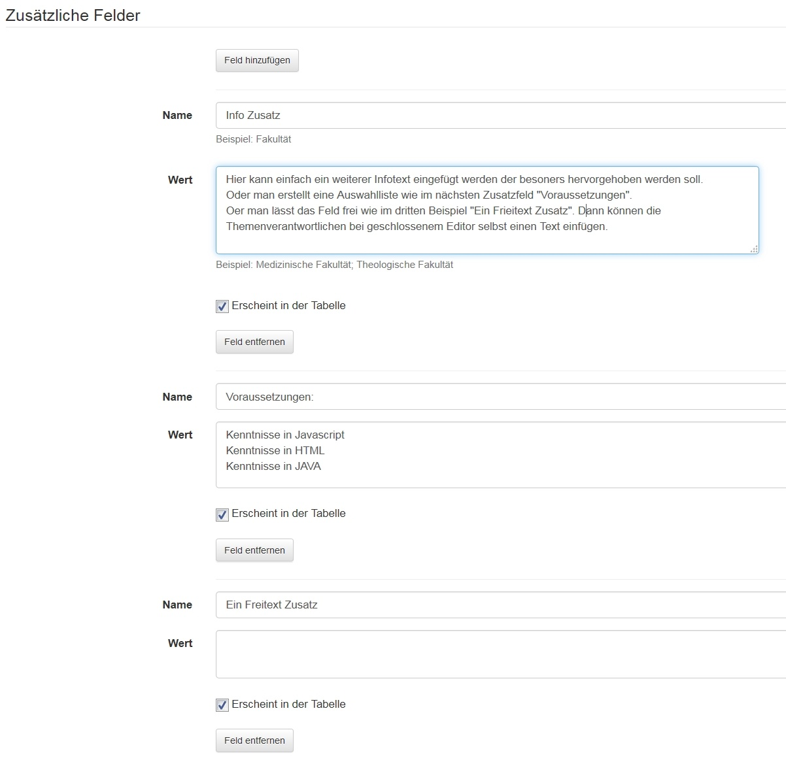
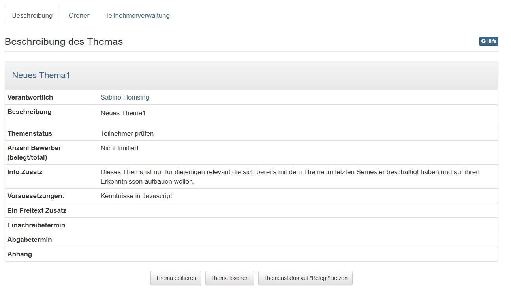
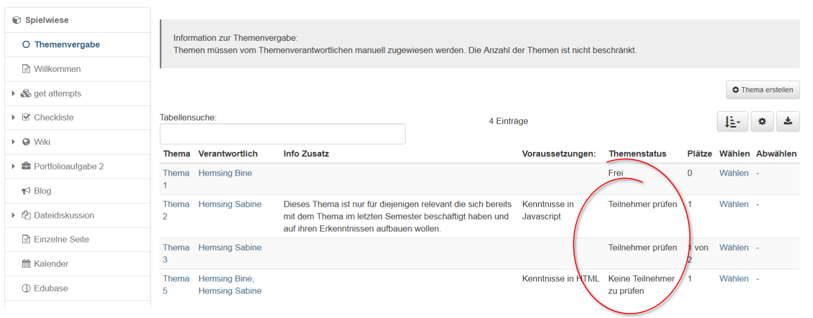
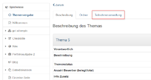

# Kursbaustein "Themenvergabe"  {: #topic_assignment}

## Steckbrief

Name | Themenvergabe
---------|----------
Icon | { class=size24  }
Verfügbar seit | 
Funktionsgruppe | Andere
Verwendungszweck | Ausschreibung, Auswahl und Betreuung von Themen zur Bearbeitung durch die Kursteilnehmer:innen
Bewertbar | nein
Spezialität / Hinweis |

Der Kursbaustein "Themenvergabe" eignet sich dazu, wenn Sie in Ihrem Kurs Themen wie beispielsweise Semesterarbeiten ausschreiben und betreuen lassen wollen. Als Besitzer des Kurses bestimmen Sie die detaillierte Konfiguration der Themenvergabe. Dazu gehört unter anderem, wer Themen ausschreiben und betreuen darf, wie die Themen beschrieben werden müssen oder wie viele Themen ein Kursteilnehmer wählen kann. Speziell am Kursbaustein "Themenvergabe" ist, dass nicht Sie als Kursbesitzer, sondern Themenverantwortliche Themen ausschreiben und betreuen.

## Editoransicht

### Themenvergabe konfigurieren

Im Tab "Konfiguration" bestimmen Sie zuerst, wie viele Themen ein Teilnehmer wählen kann und ob seine Wahl gleich gilt oder zuerst vom Themenverantwortlichen akzeptiert werden muss. Weiter können Sie zusätzliche Felder hinzufügen, welche die Themen beschreiben und in der Tabelle mit allen ausgeschriebenen Themen aufgeführt werden. Hier können Sie auch konfigurieren, ob die Themeneinschreibung und -abgabe nur innerhalb einer bestimmten Frist möglich sein soll. Im Tab „Teilbausteine“ wählen Sie aus, ob es in Ihrer Themenvergabe einen Abgabeordner und einen Rückgabeordner geben soll. Kursteilnehmer laden ihre Dateien in den Abgabeorder und Themenverantwortliche können Dateien über den Rückgabeorder zurückgeben.

**Anzahl Themen pro Teilnehmer limitieren?:**
Wenn Sie diese Option auswählen, erscheint ein Feld, in welchem Sie die Anzahl der Themen eingeben können, die ein Teilnehmer maximal pro Kursbaustein Themenvergabe auswählen darf.  
  
**Themenverantwortliche müssen Teilnehmer akzeptieren:**
Wenn Sie diese Option auswählen, können sich Teilnehmer nur provisorisch für ein Thema einschreiben. Die Themenverantwortlichen müssen dann die definitiven Teilnehmer aus den möglichen Kandidaten auswählen und akzeptieren. Wenn Sie diese Option nicht auswählen, werden automatisch alle Teilnehmer akzeptiert, die sich für das Thema eingeschrieben haben. Die Themenverantwortlichen haben aber vorgängig die Möglichkeit, die maximale Teilnehmerzahl zu definieren.  
  
**Nur ein Thema erlaubt (Akzeptierte Teilnehmer werden automatisch aus allen anderen Themen ausgetragen):**  Diese Option bedeutet, dass vom Themenverantwortlichen akzeptierte Teilnehmer automatisch aus allen anderen gewählten Themen ausgetragen werden. Teilnehmende sind also höchstens für ein Thema definitiv eingeschrieben.

**Zusätzliche Felder hinzufügen:**
Über "Feld hinzufügen" können Sie maximal fünf Ihren Bedürfnissen angepasste Felder für die genauere Beschreibung der Themen hinzufügen.

Im Feld "Name" geben Sie den gewünschten Feldnamen ein.

Sie können den Themenverantwortlichen eine Auswahl an vordefinierten Werten bzw. Texten anbieten, die in einem Pulldownmenu angezeigt werden. Hierzu geben Sie die entsprechenden Auswahlmöglichkeiten getrennt durch Strichpunkte oder Zeilenumbrüche im Feld "Wert" ein. Falls es sich um ein Freitextfeld handelt, können Sie das Feld "Wert" leer lassen. Die Themenverantwortlichen können dann einen beliebigen Wert eingeben.

Wenn Sie "**Erscheint in der Tabelle**" wählen, wird das gewünschte Feld in der Themenübersicht angezeigt. Ansonsten erscheint die Information erst bei der detaillierten Themenbeschreibung.

Über "**Feld entfernen**" können Sie zusätzliche Felder wieder löschen.

**Einschreibetermin:**
Der Themenverantwortliche kann eine Einschreibefrist
für ein Thema festlegen. Nach Ablauf dieser Frist können die Teilnhemer das Thema weder aus- noch abwählen. Der Themenverantwortliche kann nachträglich Teilnehmer ein- und austragen.  
  
**Abgabetermin:**
Ist der Abgabetermin abgelaufen, wird der Abgabeordner
geschlossen und die Teilnehmer können keine Dokumente mehr in den Abgabeordner hochladen.  

Wenn Sie "**Erscheint in der Tabelle**" wählen, wird der Termin in der Themenübersicht angezeigt.

---

### Weitere Einstellungen der Themenvergabe

**Themenverantwortliche ernennen - Tab "Verantwortliche"**

  Im Tab "Verantwortliche" fügen Sie diejenigen OpenOlat-Benutzer hinzu, welche Themen ausschreiben und betreuen dürfen. Diese Personen müssen nicht zwingend Autorenrechte haben.

  Falls Sie einen Themenverantwortlichen entfernen, der bereits Themen ausgeschrieben hat, kann er diese weiterhin betreuen, aber keine neuen Themen ausschreiben.

* **Rolle des Themenverantwortlichen**
  
  Wenn Sie vom Besitzer als Themenverantwortlichen eingesetzt werden, können Sie selber Themen ausschreiben und betreuen. Öffnen Sie die Kursansicht und navigieren Sie zur Themenvergabe. Als Themenverantwortlicher haben Sie Zugriff auf die zugehörigen Ordner. Ferner können Sie das Thema editieren, die Teilnehmer des Themas verwalten sowie weitere Themenverantwortliche hinzufügen.

* **Ordner - Tab "Teilbausteine"**

  Im Abgabeordner können Teilnehmer Dateien hochladen, die dann für die Themenverantwortlichen zugänglich sind. Die Themenverantwortlichen können Dateien in den Rückgabeordner legen. Voraussetzung ist, dass die Ordner in der Konfiguration im Kurseditor aktiviert sind.

* **Bestätigung der Abgabe - Tab "Abgabe"**

  Sie können optional einen Text eingeben, der dem Benutzer nach erfolgreicher Abgabe der Datei in einem Fenster präsentiert wird. Wenn Sie keinen Text eingeben, so wird sinngemäss folgender Text ausgegeben: Hiermit wird bestätigt, dass Meier Hubert (hmeier) die Datei "test.html" am 21.09.04 um 00:14:42 hochgeladen hat.

  Wenn Sie die Option  _Text zusätzlich als E-Mail verschicken_ auswählen, so wird dem Benutzer nach erfolgreicher Abgabe seiner Datei ein E-Mail mit dem obigen Bestätigungstext geschickt.

## Kursansicht {: #topic_assignment_runtime}

### **Neues Thema erstellen**

Als Kursbesitzer oder Themenverantwortlicher können Sie neue Themen einrichten. Übergibt man den Lernenden das Recht des Themenverantwortlichen können sie selbst Themen(vorschläge) innerhalb eines Kurses einstellen und so z.B. die weitere Gestaltung eines Kurses mitbestimmen oder selbst Vorschläge für potenzielle Hausarbeiten oder Referate einreichen.

Klicken Sie auf "**Neues Thema erstellen**" und geben Sie Thementitel und
Beschreibung ein. Je nach Konfiguration der Themenvergabe können Sie das Thema
mit weiteren Angaben beschreiben, die Einschreibe- und Abgabefrist festlegen,
bestimmen, wie viele Kursteilnehmer Ihr Thema wählen dürfen und bei Bedarf
zusätzliche Dateien als Anhang hochladen. Des weiteren legen Sie fest ob
Teilnehmer Themen wieder abwählen dürfen, und ob die Themenverantwortlichen
bei Themenaus-/abwahl per E-Mail benachrichtigt werden soll.

!!! tip "Tipp"

    Wenn Sie zu einem späteren Zeitpunkt die Konfiguration ändern wollen, klicken Sie auf den Titel des Themas. Nun können Sie das Thema editieren, den Themenstatus von "frei" auf "belegt" oder umgekehrt ändern oder das Thema löschen.

### **Thema erstellen und bearbeiten im Detail**

* **Thema:**

  Unter Titel ist der Titel des Themas aufgeführt, und kann vom Themenverantwortlichen geändert werden.  
  
* **Verantwortlich:**

  Hier sind die Themenverantwortlichen aufgelistet. Wenn User auf den Namen des Themenverantwortliches klicken, gelangen Sie zu seiner Visitenkarte und können ihn kontaktieren.

!!! info "Info"

    Wenn Sie ein Thema anlegen, werden Sie automatisch als Themenverantwortlicher aufgeführt. Sie können diese Rolle im Tab Teilnehmerverwaltung einer anderen Person übertragen oder auch weitere Benutzer zu Themenverantwortlichen ernennen.  
  
* **Beschreibung:**

  Im Feld "Beschreibung" können Detailinformationen zum Thema eingetragen werden.

* **Themenstatus:**

  In diesem Feld wird automatisch der Themenstatus angezeigt.

  Sind Sie Themenverantwortlicher oder Kursbesitzer und es haben sich noch keine Teilnehmer für Ihr Thema eingeschrieben, ist der Themenstatus auf "Keine Teilnehmer zu prüfen" gesetzt. Haben sich Teilnehmer bereits eingetragen, ist der Status auf "Teilnehmer prüfen" gesetzt. Haben Sie bereits aus den möglichen Kandidaten Teilnehmer gewählt, wird der Status "Teilnehmer akzeptiert" angezeigt.

* **Anzahl Bewerber limitieren:**

  Die Themenverantwortlichen können die verfügbare Anzahl Plätze begrenzen.

* **Abmelden vom Thema erlauben:**

  Sofern aktiviert dürfen sich die Teilnehmer auch wieder aus einem Thema austragen.

* **Zusätzliche Felder:**

  Sofern vom Kursbesitzer im Kurseditor eingerichtet (siehe oben), stehen den Themenverantwortlichen weitere Zusatzfelder zur Verfügung. Je nach Umsetzung stehen hier ein oder mehrere Auswahlelement in einer Drop-Downliste zur Verfügung oder die Themenveranwortlichen können selbst Text einfügen.

* **Einschreibetermin:**

  Sofern im Editor eingerichtet, können Themenverantwortliche hier eine Einschreibefrist definieren, wodurch nur in der entsprechenden Zeitspanne ein Thema aus- bzw. abgewählt werden kann. Vor und nach dieser Frist werden die Links "Wählen" und "Abwählen" deaktiviert und Benutzer können sich nicht in Ihr Thema ein- und austragen. Vor und nach Ablauf der Einschreibefrist können Teilnehmer aber vom Themenverantwortlichen manuell ein- oder ausgetragen werden.  
  
* **Abgabetermin:**

  Sofern im Editor eingerichtet, können Themenverantwortliche eine Abgabefrist definieren. Nur in der entsprechenden Zeitspanne können dann Dokumente in den Abgabeordner hochgeladen werden.  
  
* **Anhang:**  

  Im Feld Anhang können die Themenverantwortlichen eine Datei hochladen. Das macht dann Sinn wenn man noch umfangreiche Dokumente zu einem Thema ergänzen möchte. Mehrere Dateien können als ZIP-Datei hochgeladen werden.  
  
* **E-Mail-Benachrichtigung bei Themen Auswahl/Abwahl:**

  Wenn Sie diese Option wählen, werden Sie per E-Mail benachrichtigt, wenn Kursteilnehmer Ihr Thema aus- oder abwählen.

Über "**Thema editieren**" gelangen Sie in den Bearbeitungsmodus und können die aufgeführten Felder ändern.

Klicken Sie auf "**Thema löschen**", wenn Sie Ihr Thema aus der Themenvergabe entfernen möchten.

Wählen Sie "**Themenstatus auf "Belegt" setzen**", wenn keine weiteren Teilnehmer
ein Thema wählen können sollen. 

Über "**Themenstatus auf "Frei" setzen**" können Sie ein Thema erneut zur Wahl öffnen, auch wenn sich bereits Teilnehmer eingeschrieben und Sie diese akzeptiert haben. 

!!! warning "Achtung"

    Bitte beachten Sie, dass die zwei letzteren Schaltflächen nur ersichtlich sind, wenn der Besitzer die Themenvergabe so konfiguriert hat, dass die Teilnhemer manuell akzeptiert werden müssen.

## Tabs "Ordner" und "Teilnehmerverwaltung"

### Teilnehmer verwalten

Wenn die Konfiguration der Themenvergabe vorsieht, dass die Wahl der Kursteilnehmer vom Themenverantwortlichen akzeptiert werden muss, sehen Sie auf der Startseite der Themenvergabe in der Tabelle den Vermerk "**Teilnehmer prüfen**", sobald sich jemand für Ihr Thema eingeschrieben hat.

Öffnen Sie den Tab "**Teilnehmerverwaltung**" und akzeptieren Sie den/die Kandidaten.

Über "**Als Teilnehmer übernehmen**" wählen Sie, wem Sie das Thema vergeben möchten. Die akzeptierten Teilnehmer werden zur Liste "Akzeptierte Teilnehmer" hinzugefügt und werden auf Ihren Wunsch per E-Mail benachrichtigt. Markieren Sie die Kandidaten, die Sie nicht akzeptieren, und klicken Sie auf "Entfernen". Auf Ihren Wunsch werden die abgelehnten Kandidaten ebenfalls per E-Mail benachrichtigt.

Wenn Sie die Anzahl der Plätze nicht limitiert haben, können Sie den Vorgang mehrmals wiederholen. Denken Sie daran, im Tab "Beschreibung" "Themenstatus auf "Belegt" setzen" zu wählen, damit sich keine weiteren Kursteilnehmer für Ihr Thema bewerben.

In diesem Tab können Sie auch manuell Teilnehmer sowie weitere Themenverantwortliche hinzufügen oder entfernen. Teilnehmer haben kein Recht, das Thema zu editieren.

### Dateien herunterladen und zurückgeben

Im Tab "Ordner" finden Sie im Abschnitt "Abgabeordner" alle Dateien, die Kursteilnehmer abgegeben haben. Im Abschnitt "Rückgabeordner" können Sie korrigierte Dateien zurückgeben. Für jeden Kursteilnehmer steht dazu ein Unterordner bereit.

## Nutzerperspektive

Falls der Themenstatus auf "Frei" ist, können sich Benutzer für ein Thema einschreiben, sofern sie die maximal mögliche Themenauswahl nicht überschritten haben. Steht der Themenstatus auf "Belegt" können sich keine weiteren Benutzer einschreiben. Wenn Sie bereits ein Thema gewählt haben, steht der Themenstatus entweder auf "Provisorisch zugewiesen", wenn der Themenverantwortliche Sie als Teilnehmer akzeptieren muss, oder auf "Zugewiesen", wenn die Einschreibung automatisch verläuft. Sobald Sie der Themenverantwortliche als Teilnehmer akzeptiert, wird der Themenstatus auf "Definitiv zugewiesen" gesetzt.

## Themen einer Themenvergabe verwalten

Der Kursbaustein "Themenvergabe" kommt innerhalb eines OpenOlat-Kurses zum Einsatz. Der Besitzer eines Kurses kann den Kursbaustein nach Bedarf konfigurieren und Themenverantwortliche bestimmen. Als Themenverantwortliche/r können Sie den Kursteilnehmern Themen zur Auswahl anbieten und die Teilnehmer Ihrer Themen verwalten. Die Kursteilnehmer können schriftliche Arbeiten über den Abgabeordner einreichen und Sie können den Kursteilnehmern die korrigierten Arbeiten über den Rückgabeordner zurückgeben.

## Arbeiten mit der Themenvergabe

{class="size24"}

### Thema auswählen {: #select}

In der Themenvergabe stellen Themenverantwortliche Themen von beispielsweise Semesterarbeiten, Referaten, Webinarthemen oder Projekten zur Verfügung. Je nach Konfiguration können Sie eines oder mehrere Themen auswählen, Dateien hochladen und die vom Themenverantwortlichen zurückgegebenen Dateien einsehen.

### Tabellenübersicht Themenvergabe

Als Kursteilnehmer sehen Sie in der Tabelle die ausgeschriebenen Themen sowie weitere Informationen wie die Namen der Verantwortlichen, den Einschreibe- und Abgabezeitraum oder die Anzahl der freien Plätze und können Ihr gewünschtes Thema "wählen". Je nach Konfiguration können Sie eines oder mehrere Themen auswählen.

 **Themenstatus**: Falls der Themenstatus auf "Frei" ist, können Sie sich für ein Thema eintragen. Das ist so lange möglich bis die maximale Teilnehmerzahl oder ein Enddatum erreicht ist. Ist der Themenstatus auf "Belegt", können sich bei diesem Thema keine weiteren Benutzer eintragen. Wenn Sie bereits ein Thema gewählt haben, ist der Themenstatus entweder auf "Provisorisch zugewiesen", wenn der Themenverantwortliche Sie als Teilnehmer akzeptieren muss. Sobald Sie der Themenverantwortliche als Teilnehmer akzeptiert, wird der Themenstatus auf "Definitiv zugewiesen" gesetzt. Alternativ ist auch eine automatische Akzeptanz möglich.

Sobald ihre Wahl definitiv ist, sehen Sie den entsprechenden Eintrag in der Tabelle und finden rechts oben den Link zu der Gruppe mit dem Titel Ihres Themas (eventuell erscheint der Eintrag erst nach dem nächsten OLAT Login). Sie können ein Thema nur dann abwählen, wenn der Themenverantwortliche es für das betroffene Thema gestattet. Besteht eine Einschreibefrist, können Sie sich nach Ablauf dieser Frist in jedem Fall nicht mehr austragen.

Möglicherweise sehen Sie nicht alle der aufgeführten Dinge, da Ihr Dozent nicht alle Funktionen verwendet.

Klicken Sie auf ein Thema um weitere Informationen dazu zu erhalten:

### Themendetails

 **Thema**: Im Titel ist die Bezeichnung des Themas aufgeführt.

 **Verantwortlich**: Hier sind die Themenverantwortlichen aufgelistet. Wenn Sie auf den Namen des Themenverantwortlichen klicken, gelangen Sie zu seiner Visitenkarte und können ihn kontaktieren.

 **Beschreibung**: Im Feld Beschreibung finden Sie, sofern angegeben, Detailinformationen zum Thema.

 **Zusätzliche Felder**: Eventuell werden Ihnen noch weitere Informationen in Zusatzfeldern bereitgestellt.  

 **Einschreibetermin**: Wenn die Themenverantwortlichen eine Einschreibefrist definiert haben, können Sie nur in der entsprechenden Zeitspanne ein Thema aus- bzw. abwählen. Vor und nach Ablauf der Einschreibefrist kann Sie der Themenverantwortliche manuell ein- oder austragen.

 **Abgabetermin**: Bis zu diesem Datum können Dateien im Ordner der Themenvergabe eingereicht werden.

 **Anhang**: Im Feld Anhang können die Themenverantwortlichen eine Datei bereitstellen.

### Einreichungsprozess

Optional können bei der Themenvergabe auch Einsendungen verwaltet werden.

**Dateien in den Abgabeordner der Themenvergabe hochladen**

Klicken Sie auf den Titel des Themas. Im Tab "Ordner" finden Sie den Abgabeordner. Je nach Konfiguration ist die Abgabe termingebunden und Sie können nur innerhalb der Abgabefrist Dateien hochladen. Genaue Information zu den Terminen finden Sie im Tab "Beschreibung".

**Dateien aus dem Rückgabeordner herunterladen**

Im Tab "Ordner" finden Sie im Abschnitt "Rückgabeordner" die Dateien, die Ihnen der Themenverantwortliche zurückgegeben hat.

Wenn Sie als Themenverantwortlicher eingesetzt werden, können Sie Themen ausschreiben. Mehr dazu und dem Akzeptieren und Betreuen von Teilnehmern erfahren Sie im Kapitel "Kursbausteine" → "Andere" unter dem Punkt "[Kursbaustein Themenvergabe](../learningresources/Other.de.md#kursbaustein-„themenvergabe--topic_assignment)".
