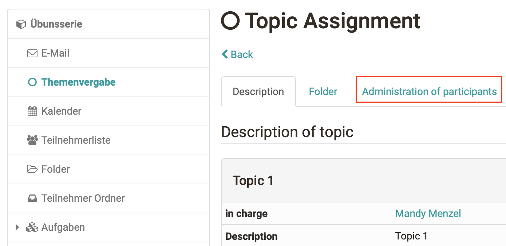

# Course Element "Topic Assignment" {: #topic_assignment}

## Profile

Name | Topic Assignment
---------|----------
Icon | { class=size24 }
Available since | 
Functional group | Others
Purpose | Invitation to tender, selection and coaching of topics to be worked on by the course participants
Assessable | no
Specialty / Note |

The course element "Topic assignment" is useful if you want to announce e.g. topics for term papers in your course before having them supervised. Course authors determine the detailed configuration of their topic assignment. This comprises e.g. who has the right to announce and supervise topics, how topics have to be described, or how many topics can be selected by one course participant. What makes this course element so special is the fact that not course authors but topic authors will announce and supervise such topics.

## Editor view

###  **How to configure topic assignments**

In the tab "Configuration" you determine first how many topics can be selected by one participant, if this selection is definite or if it has to be accepted by the topic author first. Furthermore you can add additional fields to describe a topic in more detail. This description will then be displayed in the table containing all topics announced. Here you can also determine if registrations and submissions shall only be possible within a certain period of time. In the tab "Sub-elements" you can choose if there should be a drop box as well as a return box in your topic assignment. Course participants will then upload their files to that drop box while topic authors will return those files by means of a return box.

**Configure**

* **Do you want to limit the number of Topics per participant?:** 
  When selecting this option a field will pop up to indicate the number of Topics a participant may choose from the course element Topic assignment  
  
* **Topic authors have to accept participants:** 
  When selecting this option participants can only register for a Topic temporarily. Topic authors will then have to select their candidates before finally accepting them. When deselecting this option all participants already registered for this Topic will be accepted automatically. However, topic authors are able to define the maximum number of participants first.  
  
* **Only one Topic allowed (participants accepted will be signed out automatically from other Topics):** 
  When selecting this option all users accepted as participants will be automatically signed out of all other topics selected before. This means that participants may be registered for only one Topic.

* **Add additional fields:**
  By means of "Add field" you can create fields according to your needs. You can create up to five additional fields for further details.

  In the field "Name" you can indicate a favored field name.

  You can offer your topic authors a selection of predefined values displayed in a pull-down menu. Please indicate the corresponding options in the field "Value" separated by semicolons or line breaks. When using a free-text field you can leave the field "Value" blank. Topic authors can then fill in a value of their own choice.

  When selecting "**Appears in table**" this field will be displayed in the overview as requested. Apart from that this information will appear in the detailed topic description.

  By means of "**Delete field**" you can delete additional fields.

* **Manage dates:**
  You can choose which dates should be at the disposal of topic authors.  
  
* **Registration date:** 
  A topic author can determine a registration deadline for a Topic. After this deadline participants will no longer be able to select or deselect that Topic . However, a topic author still has the option to sign participants in or out.  
  
* **Deadline:** 
  After a deadline the drop box will be closed. Participants will then no longer be able to upload documents to that drop box.  
  
  When selecting **"Appears in table"**, your event will be displayed in the overview.

----

### Further settings for topic assignment  {: #persons}

* **How to appoint topic authors - Tab "Persons in charge"**
  
  In the tab "Persons in charge" you add those OpenOlat users who should be able to announce and supervise topics. These persons do not necessarily have to hold author rights.

  If you remove a topic author who has already announced a topic he will still be able to supervise it. However, this person will no longer be able to announce new topics.

* **Role of topic authors**
  
  When being authorized by a course author to act as topic author, you can announce as well as supervise topics. Just open the course view and navigate to your topic assignment. As a person responsible for a topic you can edit that topic, administer its participants or add more persons responsible for that topic.

* **Folders - Tab "Sub-elements"**
  
  In the submission folder, participants can upload files that are then accessible to the topic owners. Topic owners can place files in the return folder. The prerequisite is that the folders are activated in the configuration in the course editor.

* **Confirmation of submission - "Submission"**

  You can optionally enter a text to be presented to the user in a new window after successfully handing in a file. If you do not enter a text, the following message (or similar) will appear: This is to confirm that John Miller (jmiller) has sent the file "test.html" on 21-09-04 at 00:14:42.

  By selecting the option _Send text additionally as e-mail_ the user will get an e-mail with the above mentioned confirmation after successfully handing in a file.

##  Course view {: #topic_assignment_runtime}

### **How to create a new topic**

As a course owner or topic manager, you can set up new topics. If you give the learner the right to set a topic (suggestion) within a course, you can help determine how a course is to be structured, for example, or submit suggestions for potential homework or presentations.

Click on "**Create new topic**" and enter the topic title and description. Depending on the configuration of the topic assignment, you can describe the topic with further details, set the enrolment and submission deadlines, determine how many course participants may choose your topic and upload additional files as attachments if required. In addition, you determine whether participants are allowed to deselect topics and whether those responsible for the topic should be notified by e-mail when topics are selected or deselected.

!!! tip "Hint"

    If you want to change the configuration at a later time, click on the topic title. Now you can edit the topic, change the topic status from "free" to "occupied" or vice versa or delete the topic.

### **Create and edit topic in detail**

* **Topic:** 

  Via Topic you will find the topic's title, which can be edited by the person responsible.  
  
* **In charge:** 

  Here you have a list of topic authors. When clicking on these authors' names you will get to their visiting cards to contact them.

!!! info "Info"

    When creating a Topic you will automatically be the person responsible for this topic. However, you can put others in charge of that role in the tab Administration of participants or appoint other users to persons responsible for your topic.  
  
* **Description:** 

  The field "Description" contains more detailed information on this Topic.

* **Topic status:**

  This field automatically displays the topic status.

  If you are the topic manager or course author and no participants have registered for your topic yet, the topic status is set to "No participants to check". If participants have already registered, the status is set to "Check participants". If you have already selected participants from the possible candidates, the status "Participant accepted" is displayed.

* **Number of vacancies (filled/total):**  

  Topic authors can limit the number of vacancies.

* **Allow unsubscribe from topic:** 
  If activated, participants may also unsubscribe from a topic.

* **Additional fields:** 
  
  If set up by the course owner in the course editor (see above), further additional fields are available to topic owners. Depending on the implementation, one or more selection elements are available here in a drop-down list or the topic owners can insert text themselves.
  
* **Registration deadline:** 

  If topic authors define a registration deadline, you will only be able to select or deselect a topic within a certain period. Before and after that deadline the links "Select" and "Deselect" will be deactivated; users will not be able to sign in or out of your Topic . The person responsible for that topic can nevertheless sign users in or out manually.  
  
* **Due date:**  

  If topic authors define a deadline, you will only be able to upload documents to the drop box within a certain period of time. Please indicate either a start date or a deadline or both.  
  
* **Attachment:** 

  In the field Attachment topic authors can upload a file. Several files can be uploaded as single ZIP file. This makes sense if you want to add extensive documents to a topic. Multiple files can be uploaded as a ZIP file.
  
* **E-mail notification when selecting/deselecting Topics:** 

  When choosing this option you will get an e-mail notification in case a course participant selects or deselects your Topic.

Via "**Edit Topic**" you will get to the editing mode.

Click on "**Delete Topic**" to delete your topic from the Topic assignment.

Choose "**Topic set status on "Filled"**" if no further participants should be able to select a Topic . 

Via "**Reset Topic status to "Vacancies"**" you can open a Topic anew - even if there are participants that are registered and accepted already. 

!!! warning "Attention"

    Please keep in mind that the last two buttons will only be visible if the course author has provided the Topic assignment with the option to accept participants manually.

## "Folder" and "Administration of participants" tabs

###  Managing participants

If the configuration of your topic assignment requires that course participants have to be accepted by the topic author you will see on the home page of topic assignments the note "Check participant" in a table as soon as somebody has applied for your topic.

Now open the tab "**Topic assignment**" and accept the application of your candidate(s).

Candidates are course participants applying for your topic. By means of "**Accept participant as**" you can decide to whom your topic should be assigned. All participants accepted will be added to the list "Participants accepted" and can be notified via e-mail if you wish. Just highlight those candidates you do not accept and click on "Delete." If you wish those candidates will be notified via e-mail as well.

If you have not limited the number of vacancies you can repeat this procedure several times. Please remember to select "Topic set status on "Filled"" in the tab "Description" to avoid further applications for your topic.

It is also possible to add or remove participants in this tab manually, as well as additional topic administrators. Participants will not be allowed to edit their topic.

### How to upload and return files

In the tab "Folder", section "Drop box", you will find all those files course participants have submitted. In the section "Return box" you can put files already corrected. There will be one sub-folder for each course participant.

## From the user's perspective

If the topic status is set to "Free", users can register for a topic, as long as they have not exceeded the maximum possible topic selection. If the topic status is set to "Occupied", no further users can register. If you have already selected a topic, the topic status is either "Provisionally assigned" if the person responsible for the topic has to accept you as a participant, or "Assigned" if the registration is automatic. As soon as the topic owner accepts you as a participant, the topic status is set to "Definitively assigned".

## Managing Topics of Topic Assignments

The course element "Topic assignment" is used within an OpenOlat course. A course author can configure this element as needed and appoint persons responsible for a topic. Persons responsible for topics can offer their course participants a variety of topics before managing these participants along with their topics. Course participants will be able to submit expositions via drop boxes. Corrections can then be returned via return boxes.

## Working with topic assignment

{class="size24"}

### Select topic {: #select}

In the topic assignment, topic owners provide topics from, for example, term papers, papers, webinar topics, or projects. Depending on the configuration, you can select one or more topics, upload files, and view the files returned by the topic owner.

### Table overview Topic assignment

As a course participant, you will see the advertised topics in the table, as well as other information such as the names of the responsible persons, the enrollment and submission period or the number of free places, and you can "choose" your desired topic. Depending on the configuration, you can select one or more themes.

**Topic status**: If the topic status is "Free", you can sign up for a topic. This is possible until the maximum number of participants or an end date is reached. If the topic status is set to "Occupied", no other users can register for this topic. If you have already selected a topic, the topic status is either set to "Provisionally assigned" when the topic owner must accept you as a participant. As soon as the person responsible for the topic accepts you as a participant, the topic status is set to "Definitely assigned". Alternatively, automatic acceptance is also possible.

As soon as your choice is final you will see the corresponding entry in the table and find the link to the group with the title of your topic in the upper right corner (possibly the entry will appear only after the next OLAT login). You can deselect a topic only if the topic owner allows it for the affected topic. If there is an enrollment period, you will not be able to unsubscribe after this period in any case.

You may not see all of the things listed because your instructor is not using all of the features.

Click on a topic to get more information about it:

**Topic**: In the title the name of the subject is listed.

**Responsible**: The people responsible for the topics are listed here. If you click on the name of the person responsible for the topic, you will get to his business card and you can contact him.

**Description**: In the Description field, you will find detailed information about the topic, if specified.

**Additional fields**: You may be provided with further information in additional fields.

**Enrollment date**: If the topic owners have defined an enrollment period, you can only select or deselect a topic during the corresponding period. Before and after the enrollment deadline, the topic manager can manually enroll or disenroll you.

**Deadline**: Files can be submitted in the topic assignment folder until this date.

**Attachment**: In the Attachment field, topic owners can provide a file.

### Submission process

Optionally, submissions can also be managed when assigning topics.

**Upload files to the submission folder of the topic assignment**

Click on the title of the topic. In the "Folder" tab you will find the delivery folder. Depending on the configuration, the submission is deadline-bound and you can only upload files within the submission deadline. You can find detailed information about the dates in the tab "Description".

**Download files from the return folder**

In the "Folder" tab, in the "Return folder" section, you will find the files that the topic owner has returned to you.

If you are assigned as a topic owner, you can post topics. You can read more about this and about accepting and supervising participants in the chapter "Course elements" → "Others" under "[Course element](../learningresources/Other.md#course-element-topic-assignment--topic_assignment)"

