# Kursbaustein "Themenbörse" {: #topic_broker}

## Steckbrief {: #profile}

Name | Themenbörse
---------|----------
Icon | { class=size24  }
Verfügbar seit | Release 19
Funktionsgruppe | Verwaltung und Organisation
Verwendungszweck | eigenständige Eintragung der Teilnehmer:innen zur Bearbeitung bestimmter Themen
Bewertbar | nein
Spezialität / Hinweis | Im Unterschied zu den Kursbausteinen "Themenvergabe" und "Einschreibung" können in der Themenbörse alle Teilnehmer:innen mehrere Themen mit Prioritäten auswählen. OpenOlat bildet dann anhand dieser Themen- und Priorisierungswünsche Zuteilungen.

Mit dem Kursbaustein "Themenbörse" wird ein Einschreibeprozess für ein Thema in 2 Schritten vollzogen: 
1. Schritt: Alle Teilnehmer:innen geben ihre Themenwünsche und Priorisierung an. 
2. Schritt: Die Themen werden den Teilnehmer:innen zugeteilt.

Diese Aufteilung bringt mehr Fairness bei der Themenvergabe, denn die Zuordnung hängt so nicht davon ab, wer seine Wünsche zuerst anmelden konnte.

## Funktionsweise {: #topic_broker_functionality}

* Es können 1 oder mehrere Kursteilnehmer:innen  an der Themenbörse teilnehmen (keine Betreuer:innen).
* Es können 1 oder mehrere Themen zur Auswahl angeboten werden.
* Die Teilnehmer:innen können zu ihren gewählten Themen eine Prioritäten-Reihenfolge angeben.
* Es kann sowohl eine Themenauswahl, wie auch eine Begrenzung der Anzahl Personen pro Thema vorgegeben werden. Auch eine Begrenzung auf Gruppen ist möglich.
* Es kann auch eine bestimmte Anzahl Themen je Teilnehmer verpflichtend gemacht werden.
* Die Themenwahl ist auf ein bestimmtes Zeitfenster beschränkt.
* OpenOlat kann nach Schliessen des Zeitfensters anhand der angegebenen Prioritäten berechnen, wer welche Themen zugewiesen bekommt. Die Berechnung kann automatisch oder manuell angestossen werden. Das manuelle Anstossen der Zuordnung (empfohlen) ist den Kursbesitzer:innen vorbehalten.

[zum Seitenanfang ^](#topic_broker)

## Der Algorithmus für eine automatische Themenzuordnung {: #topic_broker_algorithm}

Funktioniert ein Auswahl- und Zuordnungsverfahren nach dem Prinzip "first-come - first-serves" (wer zuerst kommt, wird zuerst bedient), dann ist dies unfair. Man kennt dies von der Vergabe von Tickets für Fussballspiele und Konzerte. Benutzer:innen mit besserer Internetverbindung werden bevorzugt, genauso wie Benutzer:innen, die zum Zeitpunkt der Veröffentlichung sofort Zeit für die Anmeldung haben.

Das Problem ist als "Stable Matching" Problem bekannt. Details zur Implementierung in OpenOlat finden Sie hier: [OpenOlat_Project_Broker_Matching_Algorithm.pdf](assets/OpenOlat_Project_Broker_Matching_Algorithm.pdf)

Die Themenvergabe im Kursbaustein Themenbörse geschieht deshalb in 2 Schritten:

- Wahl des Themas/Projektes/der Gruppe und Angabe der persönlichen Prioritäten (erste Wahl, zweite Wahl, usw.).
- Haben alle ihre bevorzugten Wünsche abgegeben, wird die Zuordnung vorgenommen. Wurde ein Thema öfter mit erster Priorität gewünscht als Plätze vorhanden sind, erfolgt die Zuordnung über den fairen Algorithmus gemäss den Angaben zur zweiten Priorität.   

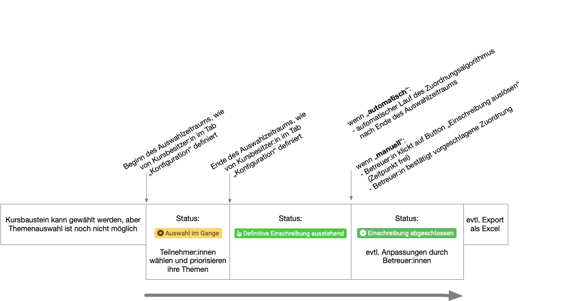{ class="shadow lightbox" }

!!! note "Hinweis"

    Aufgrund der vorangehend beschriebenen Funktionsweise ist verständlich, dass die Themenbörse in offenen Kursen, mit undefinierter Anzahl Teilnehmer:innen, nicht verwendet werden kann.

[zum Seitenanfang ^](#topic_broker)

## Wer kann wählbare Themen erfassen? {: #topic_broker_eligible_topics}

* Per Voreinstellung werden Themen durch die **Kursbesitzer:innen** erfasst.

* **Betreuer:innen** können im Tab "Themen" das Ergänzen von Themen ebenfalls erlaubt werden.

* **Betreuer:innen** kann auch das Bearbeiten von Teilnehmer:innen erlaubt werden. (Thema zuweisen, Priorisierung anpassen, Teilnehmer:innen ein- oder ausschreiben)

* Ferner können Themen auch aus einer **Excel-Datei** importiert werden.

[zum Seitenanfang ^](#topic_broker)

---

## Themenbörse einrichten (Perspektive Kursbesitzer:in) {: #topic_broker_setup}

### Tab "Konfiguration" {: #topic_broker_setup_tab_config}

Im Tab "Konfiguration" werden die Rahmenbedingungen der Themenwahl und Einschreibung festgelegt.

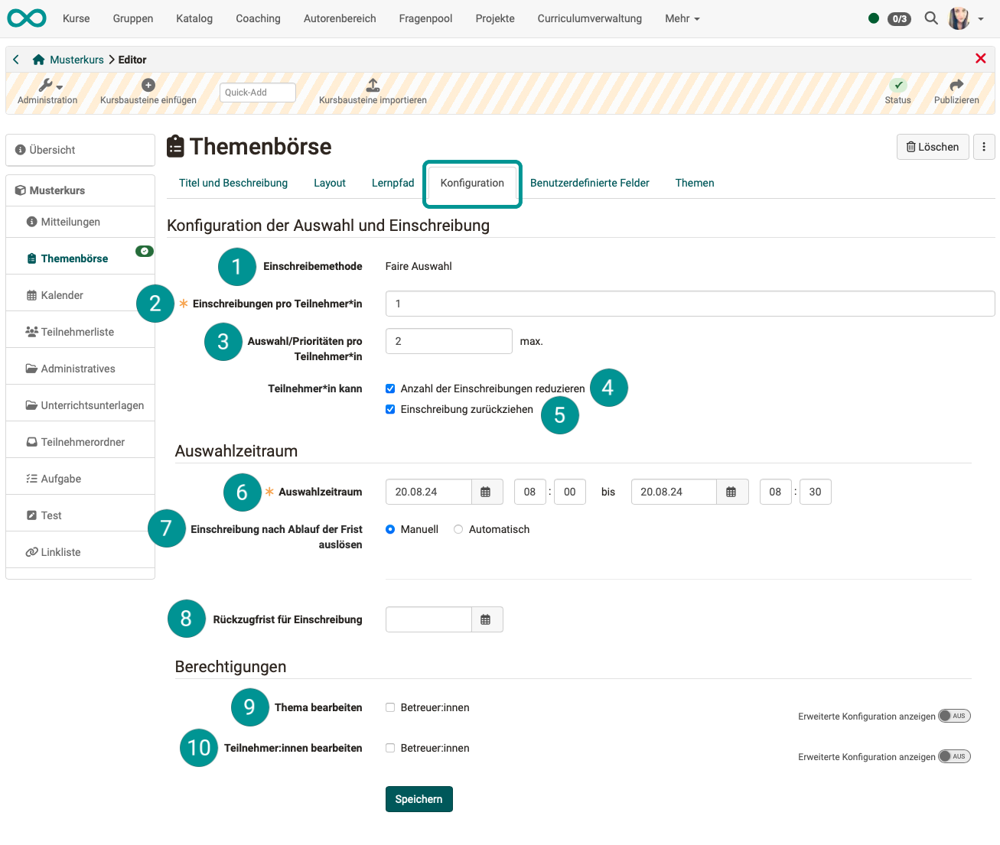{ class="shadow lightbox" }

 **Einschreibemethode** 
Aktuell ist die Methode ["Faire Auswahl"](#topic_broker_algorithm) verfügbar. Es ist geplant, dass weitere Methoden zur Auswahl hinzukommen. 

 **Einschreibungen pro Teilnehmer:in** 
Die Teilnehmer:innen sollen mehrere Wunschthemen angeben können, jedoch nach Durchführung der Zuordnung nur für 1 oder eine begrenzte Anzahl Themen definitiv eingeschrieben werden. In diesem Feld geben Sie an, für wie viele Themen die definitve Einschreibung erfolgt. Es ist eine zwingernd zu machende Angabe, die für alle Teilnehmer:innen gilt.

 **Auswahl/Prioritäten pro Teilnehmer:in** 
Wenn die Teilnehmer:innen mehrere Themen angegeben haben, können sie eine Auswahl als ihre Priorität/bevorzugter Wunsch markieren. In diesem Feld geben Sie an, wie viele Themen maximal als bevorzugtes Wunschthema angegeben werden können.

**Teilnehmer:in kann ...** 
  Wurden im Feld "Einschreibungen pro Teilnehmer:in" mehrere Einschreibungen als Vorgabe gewünscht, kann nun den Teilnehmer:innen erlaubt werden, die Anzahl der Einschreibungen individuell zu reduzieren. (Weniger Einschreibungen als im Feld "Einschreibungen pro Teilnehmer:in" vorgegeben wurde.) 
 Den Teilnehmer:innen kann auch erlaubt werden, Einschreibungen wieder zurückzuziehen, wenn nach Ablauf des Auswahlzeitraums die Zuteilung und Einschreibung erfolgt ist.

 **Auswahlzeitraum** 
Der Auswahlzeitraum ist das Zeitfenster, innerhalb dessen die Teilnehmer:innen ihre Themenwünsche abgeben müssen. Nach Ende des Auswahlzeitraums finden die Einschreibungen statt.

 **Einschreibung nach Ablauf der Frist** 
Als Kursbesitzer:in entscheiden Sie, ob die definitiven Einschreibungen automatisch oder manuell vorgenommen werden, sobald das Ende des Auswahlzeitraums erreicht ist.

 **Rückzugfrist für Einschreibung** 
Diese Option wird nur angeboten, wenn  "Einschreibung zurückziehen" gewählt wurde. Wenn ja, kann optional ein Zeitpunkt angegeben werden, bis zu dem eine Einschreibung zurückgezogen werden kann.

 **Berechtigungen: Thema bearbeiten** 
Standardmässig ist das Recht zum Bearbeiten der Themenvorgaben den Kursbesitzer:innen vorbehalten. Mit dieser Option kann das Recht auch Betreuer:innen gegeben werden. 
Die Bearbeitung kann noch detaillierter spezifiziert werden, wenn die erweiterte Konfiguration genutzt wird (Toggle-Button am rechten Rand).

 **Berechtigungen: Teilnehmer:innen bearbeiten** 
Standardmässig ist das Recht zum Übersteuern und Bearbeiten einer getroffenen Themenauswahl den Kursbesitzer:innen vorbehalten. Mit dieser Option kann das Recht auch Betreuer:innen gegeben werden. (Diese haben normalerweise nur Leserecht, wenn sie einen der Namen wählen.) Die Möglichkeit zum Übersteuern sollte jedoch möglichst nur in Ausnahmefällen benutzt werden, denn sie läuft der eigentlichen Absicht zuwider, eine faire Verteilung durch einen neutralen Algorithmus zu ermöglichen. 
Die Bearbeitung kann noch detaillierter spezifiziert werden, wenn die erweiterte Konfiguration genutzt wird (Toggle-Button am rechten Rand). 
 

[nach oben (Perspektive Kursbesitzer:in) ^](#topic_broker_setup) 
[zum Seitenanfang ^](#topic_broker)

### Tab "Benutzerdefinierte Felder" {: #topic_broker_setup_tab_custom_fields}

Im Tab "Benutzerdefinierte Felder" können Zusatzfelder erstellt werden, die dann in jedem Thema angezeigt werden. Unter den 3 Punkten am Ende einer Zeile können sie jederzeit wieder bearbeitet und gelöscht werden.

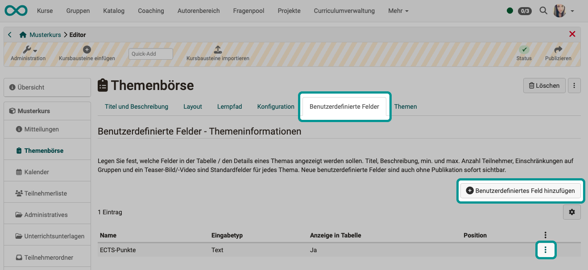{ class="shadow lightbox" }

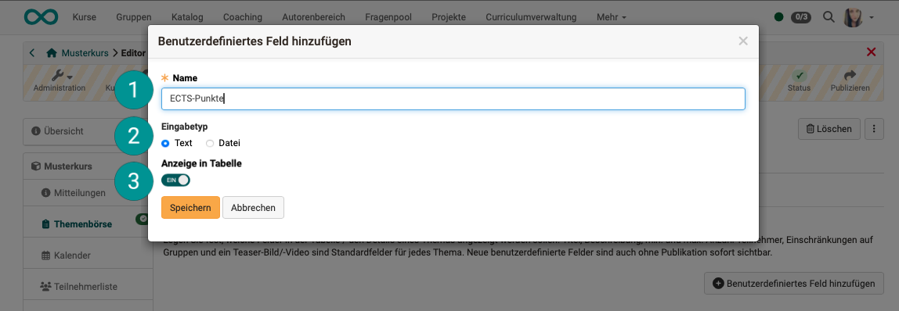{ class="shadow lightbox" }

 **Name** 
Der hier eingegebene Name erscheint als zusätzliches Feld im Popup "Thema hinzufügen".

 **Eingabetyp** 
**Text**: Beim Erfassen kann zu jedem Thema eine Angabe in Textform eingegeben werden. 
**Datei**: Beim Erfassen kann zu jedem Thema eine Datei hochgeladen werden, z.B. eine pdf-Datei mit Informationen zum Thema.

 **Anzeige in Tabelle** 
Wird der Toggle-Button eingeschaltet, erscheint dieses Feld in der Übersichtstabelle per Default.

[nach oben (Perspektive Kursbesitzer:in) ^](#topic_broker_setup) 
[zum Seitenanfang ^](#topic_broker)

### Tab "Themen" (Erfassen von Themen) {: #topic_broker_setup_tab_topic}

Die wählbaren Themen können im Kurseditor im Tab "Themen" durch Kursbesitzer:innen hinzugefügt und beschrieben werden. Alternativ kann dies auch ausserhalb des Editors im Run-Mode geschehen. Je nach Konfiguration auch durch Kursbetreuer:innen.

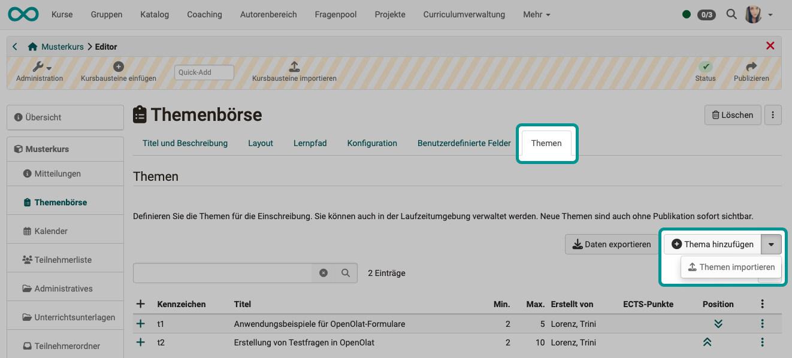{ class="shadow lightbox" }

Im nachstehenden Beispiel ist im unteren Bereich zusätzlich ein Feld enthalten, das im Tab "Benutzerdefinierte Felder" hinzugefügt wurde.

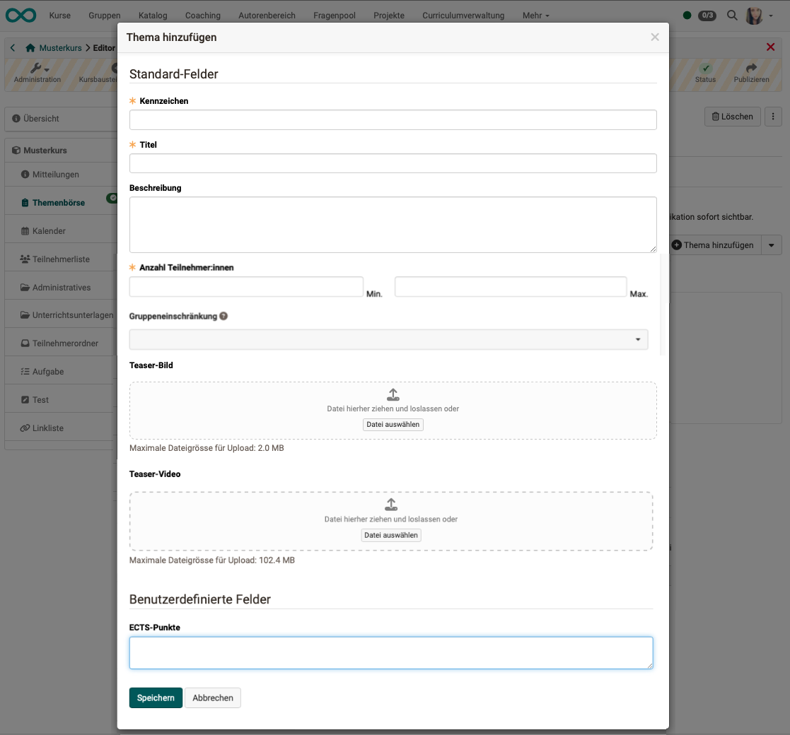{ class="shadow lightbox" }

[nach oben (Perspektive Kursbesitzer:in) ^](#topic_broker_setup) 
[zum Seitenanfang ^](#topic_broker)

---

### Themen exportieren/importieren {: #topic_broker_export_import_topics}

**Themen exportieren** 
Zum Exportieren der Themen wählen Sie im Kurseditor den betreffenden Kursbaustein, dann den **Tab "Themen"** und dort den **Button "Daten exportieren"**. 
Der Button steht auch nach dem Verlassen des Kurseditors im Run-Mode (Kopfzeile nicht schraffiert) zur Verfügung.

Beim Export wird eine zip-Datei erstellt, die eine Excel-Datei (mit allen Themen) und die dazugehörigen Mediendateien enthält. 

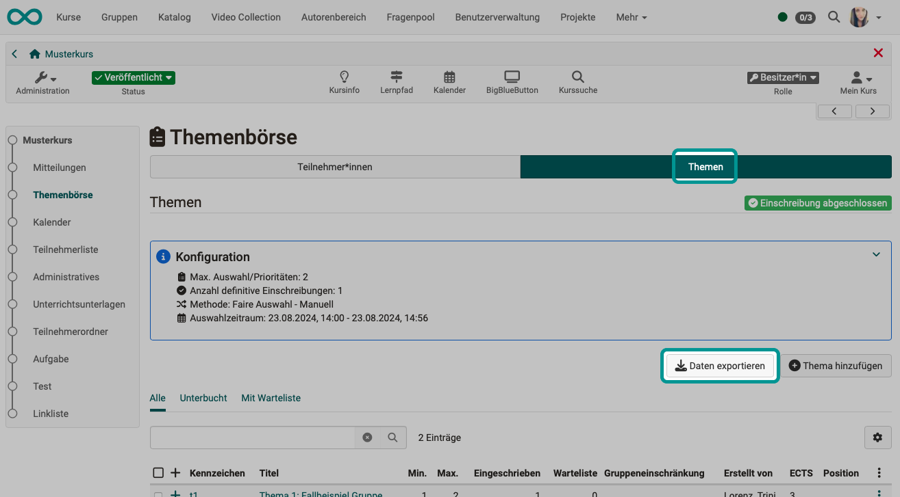{ class="shadow lightbox" }

 

**Themen importieren** 
Importiert werden können Themen, die aus einem anderen Kursbaustein "Themenbörse" (meistens aus einem anderen Kurs) exportiert wurden. Die dort exportiere zip-Datei enhält

- eine Excel-Datei mit den Themen,
- alle zugehörigen Mediendateien,
- sowie die nötigen Informationen zur Zuordnung den Mediendateien zu den richtigen Themen.

Zum Import der Themen wählen Sie **"Themen importieren**, nachdem Sie auf den kleinen Pfeil neben dem Button "Thema hinzufügen" geklickt haben.

{ class="shadow lightbox" }

Ein kleiner Wizard führt Sie durch den Importprozess.

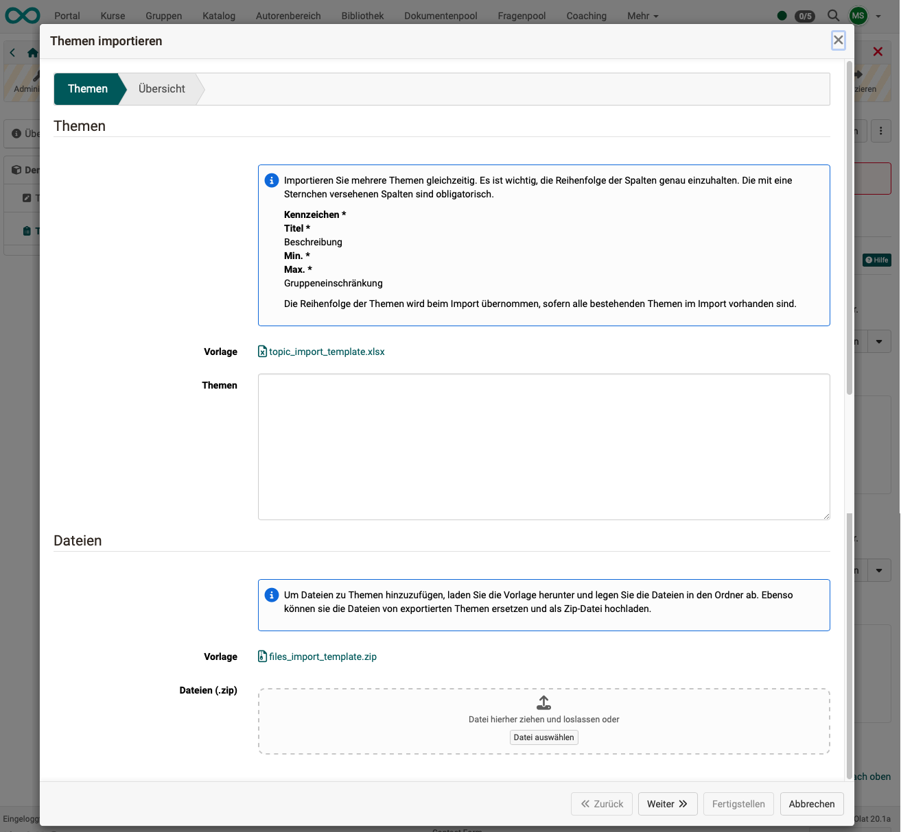{ class="shadow lightbox" }

Die Themen und Mediendateien müssen in zwei verschiedenen Feldern eingetragen werden. Für beide Felder stehen auch Musterdateien zum Herunterladen bereit. Im Normalfall werden Sie jedoch die an anderer Stelle aus einem OpenOlat-Kursbaustein "Themenbörse" exportierte zip-Datei verwenden.

**a) Themen** 
Hier werden die zu importierenden Themen als Texte (z.B. Titel) erfasst.
Wenn Sie die Excel-Datei aus einer andernorts exportierten Themensammlung verwenden wollen, müssen Sie ggf. die dort exportierte zip-Datei zuerst entpacken und die darin enthaltene Excel-Datei verwenden.

**b) Mediendateien** 
Die Mediendateien müssen beim Import dem richtigen Thema zugeordnet werden. Die Informationen dafür sind ebenfalls in der andernorts aus OpenOlat exportierten zip-Datei enthalten. Deshalb muss in diesem Abschnitt noch die gesamte zip-Datei importiert werden.

[nach oben (Perspektive Kursbesitzer:in) ^](#topic_broker_setup) 
[zum Seitenanfang ^](#topic_broker)

---

## Themenbörse betreuen (Perspektive Kursbetreuer:in) {: #topic_broker_coaching}

### Erfassen von Themen {: #topic_broker_coaching_capture_topics}

Die wählbaren Themen können schon durch Kursbesitzer:innen hinzugefügt und beschrieben worden sein (im Kurseditor im Tab "Themen"). Alternativ kann dies **auch durch Kursbetreuer:innen** geschehen. Dazu wählen Sie als Betreuer:in den Kursbaustein und den Tab "Themen". Die Themen können hier neu erstellt oder aus einer Excel-Tabelle importiert werden. (Unter der Auswahloption "Themen importieren" finden Sie auch eine Excel-Vorlage zum Download.)

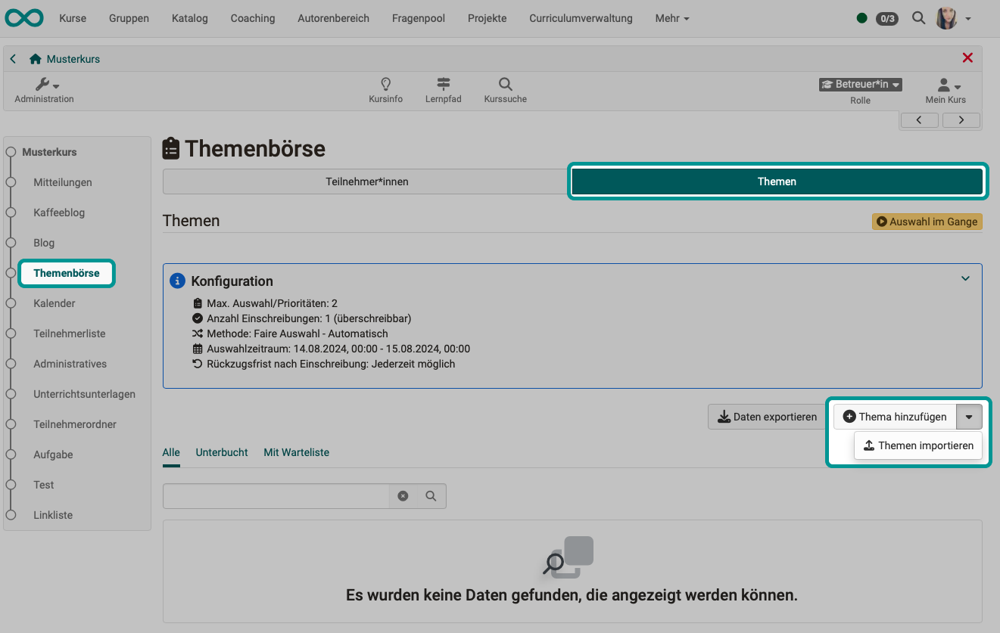{ class="shadow lightbox" }

[nach oben (Perspektive Kursbetreuer:in) ^](#topic_broker_coaching) 
[zum Seitenanfang ^](#topic_broker)

### Ansicht der Themenwünsche {: #topic_broker_coaching_view_topic_requests}

Im Tab "Teilnehmer:innen" sehen Sie als Betreuer:in, wer seine Themenwünsche schon abgegeben hat, bzw. auf der Warteliste oder schon eingeschrieben ist. Mit Klick auf das + vor einem der Namen öffnet sich die Detailansicht.

{ class="shadow lightbox" }

!!! tip "Hinweis"

    Haben Kursbetreuer:innen das Recht erhalten, können sie jederzeit eingreifen und eine getroffene Auswahl übersteuern oder bei fehlender Auswahl eine Auswahl für die Person treffen.
    Auch das Hinzufügen eines weiteren Themas ist möglich.
    
    Davon sollte jedoch möglichst nur in Ausnahmesituationen Gebrauch gemacht werden.

[nach oben (Perspektive Kursbetreuer:in) ^](#topic_broker_coaching) 
[zum Seitenanfang ^](#topic_broker)

### Themenzuordnung (Definitive Einschreibung ausstehend) {: #topic_broker_coaching_topic_assignment}

Der Prozess verläuft in den Schritten

* "Auswahl im Gange"
* "Definitive Einschreibung ausstehend"
* "Einschreibung abgeschlossen"

Haben alle Teilnehmer:innen ihre Themenwünsche eingegeben und das Zeitfenster zur Abgabe ist geschlossen worden, dann ist die Phase "Auswahl im Gange" beendet. Der Status wechselt zu "**Definitive Einschreibung ausstehend**".

Es muss nun eine Zuordnung von Teilnehmer:innen und Themen durchgeführt werden. OpenOlat kann anhand der Themen- und Priorisierungswünsche automatisch Zuteilungen machen. Dazu verwendet OpenOlat einen [fairen Algorithmus](assets/OpenOlat_Project_Broker_Matching_Algorithm.pdf). 

Die Ausführung des Zuordnungsprozesses kann **automatisch oder manuell angestossen** werden. Auf welche Art der Prozess angestossen wird, wird von Kursbesitzer:innen im Kurseditor im **Tab "Konfiguration"** festgelegt. 

[nach oben (Perspektive Kursbetreuer:in) ^](#topic_broker_coaching) 
[zum Seitenanfang ^](#topic_broker)

### Automatische Einschreibung/Themenzuordnung {: #topic_broker_assignment_automatically}

Wurde von dem/der Kursbesitzer:in im Kurseditor im Tab "Konfiguration" die Option "automatisch" gewählt, dann startet kurze Zeit nach dem Schliessen des Zeitfensters, in dem die Teilnehmer:innen ihre Wahl treffen konnten, automatisch der Zuordnungsalgorithmus. (Wie lange der Prozess läuft, ist z.B. von der Anzahl der Themen und Teilnehmer:innen abhängig.)

Der Zuordnungsalgorithmus wird **nur einmal ausgeführt**. Das gefundene Zuordnungsergebnis wird zur Einschreibung verwendet.

Betreuer:innen können die Einschreibungen jedoch manuell nachbessern und abändern (siehe [Korrektur](Course_Element_Topic_Broker.de.md#topic_broker_adjustment)).

Nach einer automatischen Zuordnung wird immer eine Mail an alle Kursteilnehmer:innen verschickt.

[nach oben (Perspektive Kursbetreuer:in) ^](#topic_broker_coaching) 
[zum Seitenanfang ^](#topic_broker)

### Manuelle Einschreibung (Themenzuordnung) durch Betreuer:innen {: #topic_broker_assignment_manually}

Wurde von dem/der Kursbesitzer:in im Kurseditor im Tab "Konfiguration" die Option "manuell" gewählt, dann muss die Ausführung des Zuordnungsalgorithmus von einem/einer Kursbesitzer:in oder einem/einer Kursbetreuer:in gestartet werden.

Der Zeitpunkt, wann Sie die Einschreibung auslösen, ist nicht festgelegt. Während der Zuordnung befindet sich der Kursbaustein immer noch im Status "Definitive Einschreibung ausstehend".

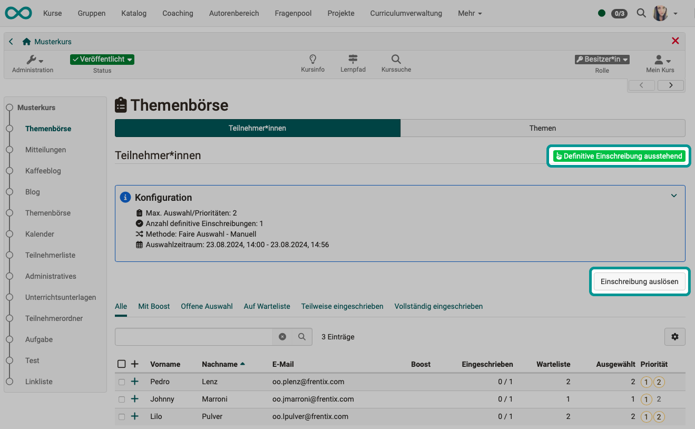{ class="shadow lightbox" }

Bei manuellem Anstossen des Zuordnungsalgorithmus können **mehrere Durchläufe** gemacht werden. Die Ergebnisse weichen voneinander ab, weil im Algorithmus auch ein Zufallsfaktor enthalten ist. Sie werden in einem Dropdown aufgelistet und Betreuer:innen können daraus einen Durchlauf auswählen, der für die endgültige Einschreibung angewendet werden soll.

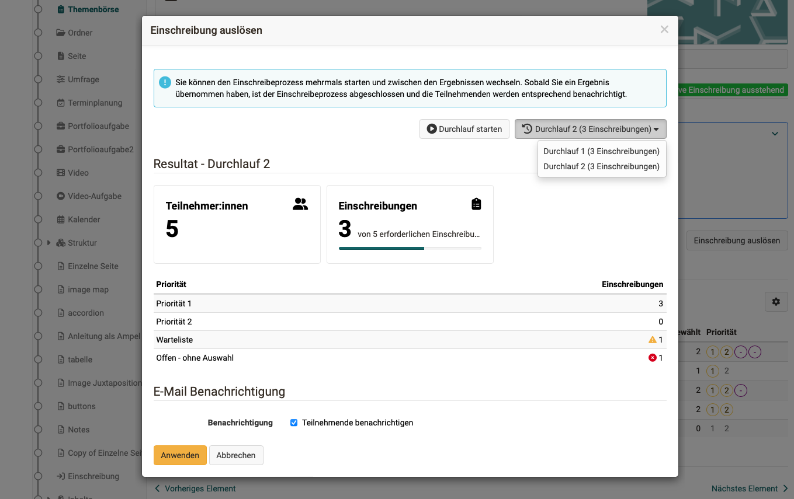{ class="shadow lightbox" }

Hat sich der/die Betreuer:in für einen Durchlauf (ein Zuordnungsergebnis) entschieden, wird mit Klick auf den Button "Anwenden" die **Einschreibung** anhand dieser Zuordnung vorgenommen. Es ist eine nochmalige Bestätigung erforderlich, denn die Einschreibung kann nicht mit einem anderen Zuordnungsergebnis/Durchlauf wiederholt werden.

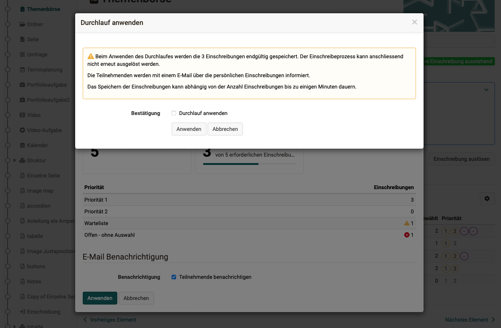{ class="shadow lightbox" }

Auch beim manuellen Anstoss kann bestimmt werden, dass im Anschluss die Teilnehmer:innen per Mail über die Einschreibung informiert werden.

!!! tip "Hinweis"

    Wenn nach Klick auf "Anwenden" noch Personen mit dem Status "Warteliste" oder "Offen" vorhanden sind, können Sie diese manuell zuordnen (siehe [Korrektur](Course_Element_Topic_Broker.de.md#topic_broker_adjustment)). 
    Dies kann z.B. erforderlich sein, wenn eine Person nach Ablauf des Zeitfensters noch keine Themenangabe gemacht hatte und deshalb vom Algorithmus nicht zugeordnet werden konnte. 

[nach oben (Perspektive Kursbetreuer:in) ^](#topic_broker_coaching) 
[zum Seitenanfang ^](#topic_broker)

### Einschreibung (Themenzuordnung) beeinflussen {: #topic_broker_boost}

Mit einer **Boost-Funktion** können Betreuer:innen pro Einzelperson eine Gewichtung ergänzen und so korrigierend eingreifen. Die Zuordnungen der Teilnehmer:innen mit einem Boost werden vom Einschreibealgorithmus bevorzugt behandelt.

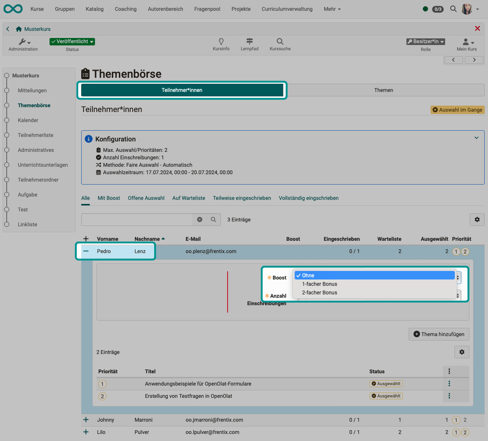{ class="shadow lightbox" }

[nach oben (Perspektive Kursbetreuer:in) ^](#topic_broker_coaching) 
[zum Seitenanfang ^](#topic_broker)

### Korrektur der Einschreibung (Themenzuordnung) durch Betreuer:innen {: #topic_broker_adjustment}

Befindet sich der Prozess in der Phase "Definitve Einschreibung ausstehend" können Betreuer:innen die getroffenen Zuordnungen korrigieren.

Für eine Übersicht wählen Sie als Kursbetreuer:in den Kursbaustein und klicken dann im Tab "Teilnehmer:innen" auf das Plussymbol vor einem Namen in der Liste. Es öffnet sich die Ansicht der getroffenen Wahl und Prioritätensetzung dieser Person.

Als Betreuer:in haben Sie die Möglichkeit, ein vorausgewähltes Thema zu entfernen oder (wenn Sie diese Themenzuordnung gut heissen) die Einschreibung manuell vorzunehmen. 

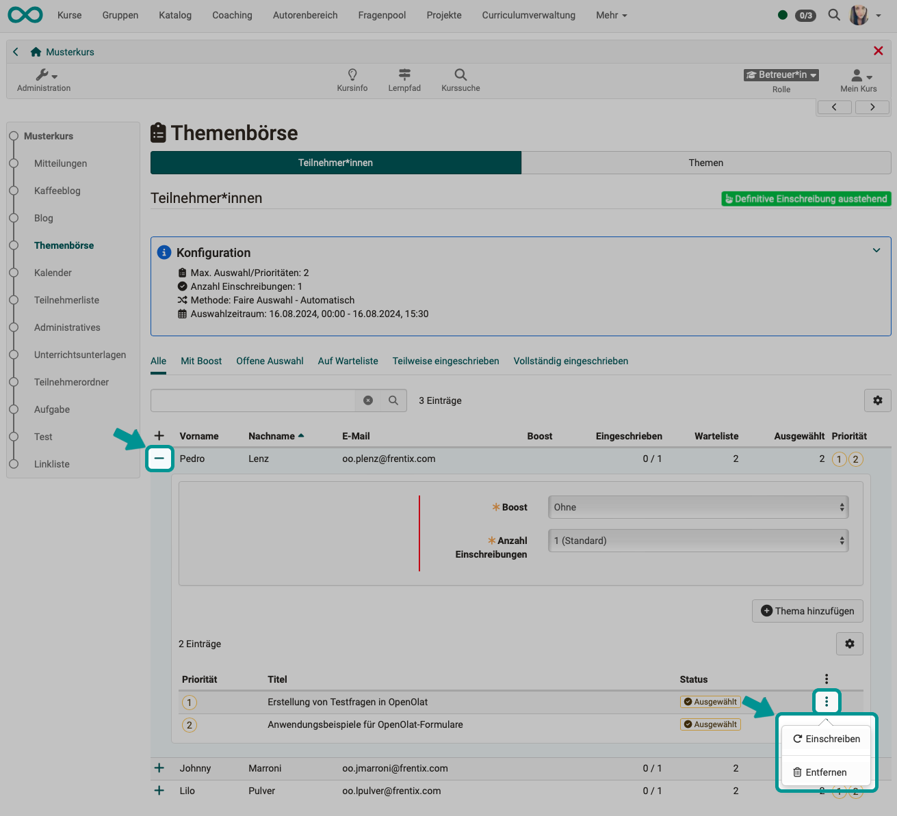{ class="shadow lightbox" }

[nach oben (Perspektive Kursbetreuer:in) ^](#topic_broker_coaching) 
[zum Seitenanfang ^](#topic_broker)

### Export der Themenwünsche und Priorisierungen {: #topic_broker_export}

Im Tab "Themen" kann mit dem Button "Daten exportieren" eine zip-Datei heruntergeladen werden, in der alle Themen, Wünsche und Priorisierungen enthalten sind (Übersicht als Excel-Datei).

Der Button ist sowohl im Kurseditor (für Kursbesitzer:innen) als auch im Run-Mode für Betreuer:innen / Besitzer:innen verfügbar.

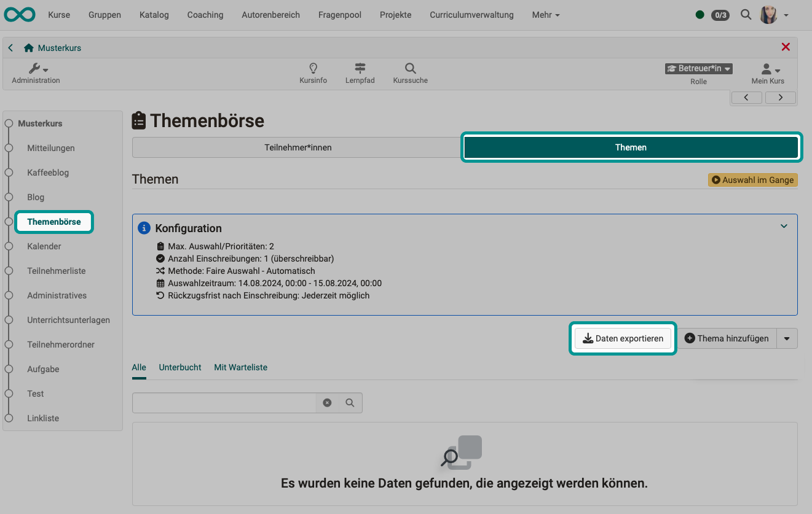{ class="shadow lightbox" }

[nach oben (Perspektive Kursbetreuer:in) ^](#topic_broker_coaching) 
[zum Seitenanfang ^](#topic_broker)

### Korrektur abgeschlossener Einschreibungen durch Betreuer:innen {: #topic_broker_adjust_enrollment}

Auch wenn bereits die Phase "Einschreibung abgeschlossen" erreicht ist, haben Sie als Kursbesitzer:in oder Betreuer:in, noch die Möglichkeit, Einschreibungen zu korrigieren. (Betreuer:innen, sofern ihnen die Berechtigung gegeben wurde.)

Wählen Sie dazu den Tab "Themen" und öffnen Sie durch Klick auf das "+" in der ersten Spalte ein Thema.

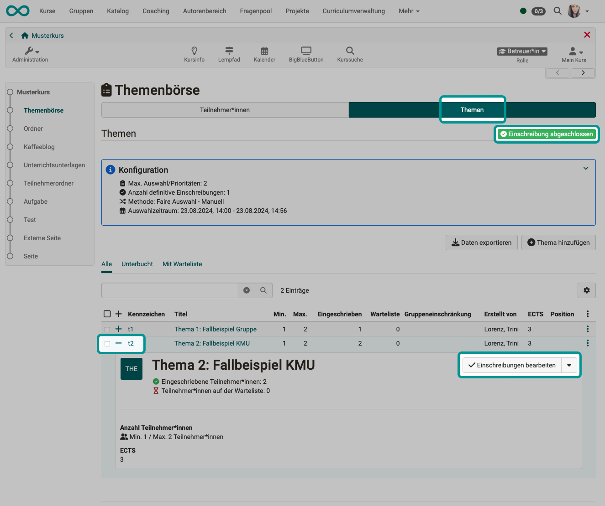{ class="shadow lightbox" }

Eine Einschreibung (auch automatisch vorgenommene) kann wieder rückgängig gemacht werden (ausgetragen werden). Klicken Sie auf "Austragen" in der Zeile der betreffenden Person.

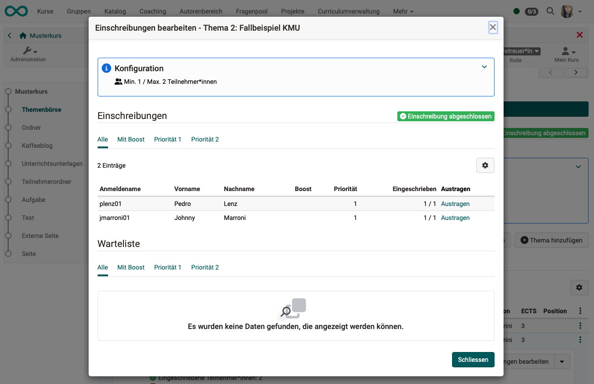{ class="shadow lightbox" }

[nach oben (Perspektive Kursbetreuer:in) ^](#topic_broker_coaching) 
[zum Seitenanfang ^](#topic_broker)

---

## Themenwahl (Perspektive Kursteilnehmer:in) {: #topic_broker_participant}

Als Teilnehmer:in wählen Sie einfach den Kursbaustein Themenbörse in Ihrem Kurs. Je nach Phase des Einschreibungsprozesses wird Ihnen der aktuelle Stand der Themenvergabe angezeigt.

### 1. Schritt: Themen wählen {: #topic_broker_participant_step1}

Klicken Sie bei einer Themenbeschreibung, für die Sie sich gern einschreiben würden,  auf den Button "Hinzufügen", dann wird er in die Liste Ihrer ausgewählten Themen übernommen. 

Je nach voreingestellter Berechtigung können Teilnehmer:innen auch eine Einschreibung zurückziehen oder die Anzahl der Einschreibungen reduzieren.

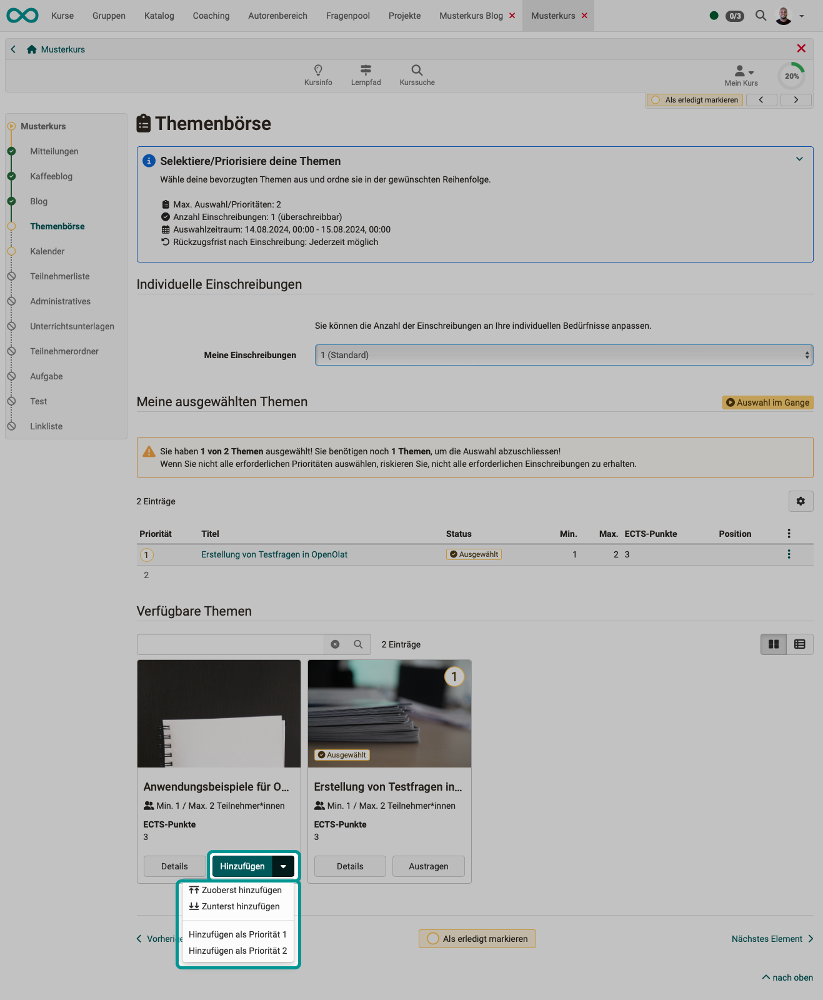{ class="shadow lightbox" }

[nach oben (Perspektive Kursteilnehmer:in) ^](#topic_broker_participant) 
[zum Seitenanfang ^](#topic_broker)

### 2. Schritt: Themen priorisieren {: #topic_broker_participant_step2}

Wenn Sie aus vielen Themen wählen können, empfiehlt es sich, zunächst alle in Frage kommenden Themen in Ihre Auswahl aufzunehmen. Sie können in einem zweiten Schritt dann in dieser Vorauswahl eine Rangliste erstellen.

Solange die Auswahl noch im Gang ist (das Zeitfenster dafür noch nicht geschlossen ist), können Sie mit Klicks auf die Doppelpfeile die Position der Themen in Ihrer Liste verändern. Überzählige Themen werden dann bei der Einschreibung nicht berücksichtigt.

{ class="shadow lightbox" }

[nach oben (Perspektive Kursteilnehmer:in) ^](#topic_broker_participant) 
[zum Seitenanfang ^](#topic_broker)

### 3. Schritt: Zuordnung abwarten {: #topic_broker_participant_step3}

Sie werden informiert, sobald Ihnen ein Thema zugeteilt worden ist. Die definitive Zuordnung und Einschreibung (durch Ihren Betreuer/Ihre Betreuerin) findet erst statt, wenn der Zeitraum für die Auswahl abgelaufen ist und alle Kursteilnehmer:innen ihre Wünsche abgegeben haben. (Um eine gerechte Zuteilung zu ermöglichen, wird durch OpenOlat ein Zuteilungsvorschlag von einem Algorithmus erstellt.)

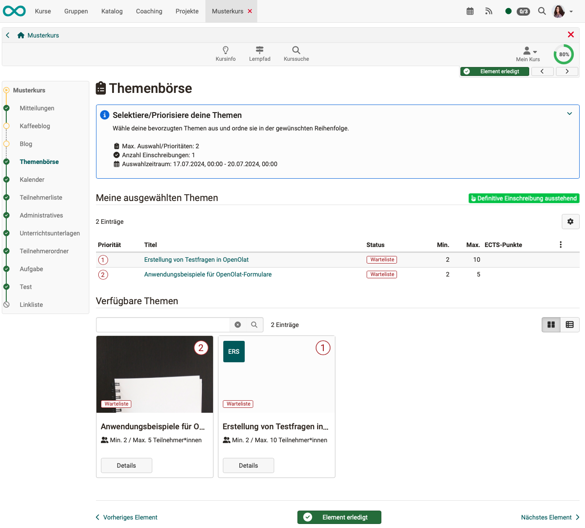{ class="shadow lightbox" }

[nach oben (Perspektive Kursteilnehmer:in) ^](#topic_broker_participant) 
[zum Seitenanfang ^](#topic_broker)

### 4. Schritt: Einschreibung(en) abfragen {: #topic_broker_participant_step4}

Sobald die endgültige Einschreibung durch den/die Betreuer:in vorgenommen wurde, ist für Sie als Teilnehmer:in im Kursbaustein ersichtlich, für welches/welche Themen Sie eingeschrieben wurden.  

{ class="shadow lightbox" }

[nach oben (Perspektive Kursteilnehmer:in) ^](#topic_broker_participant) 
[zum Seitenanfang ^](#topic_broker)

---

## Weitere Informationen {: #further_information}

[Kursbaustein Themenvergabe](../learningresources/Course_Element_Topic_Assignment.de.md) 
[Kursbaustein Einschreibung](../learningresources/Course_Element_Enrolment.de.md) 
[OpenOlat_Project_Broker_Matching_Algorithm.pdf](assets/OpenOlat_Project_Broker_Matching_Algorithm.pdf) 

