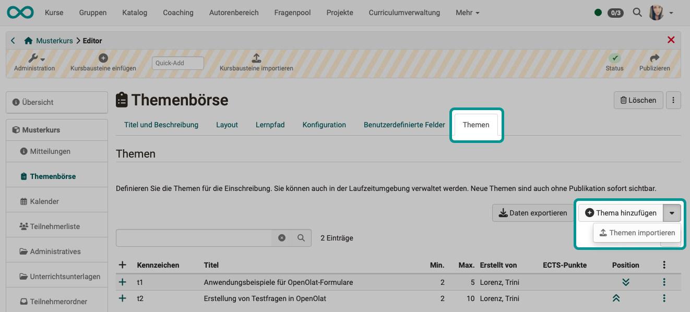
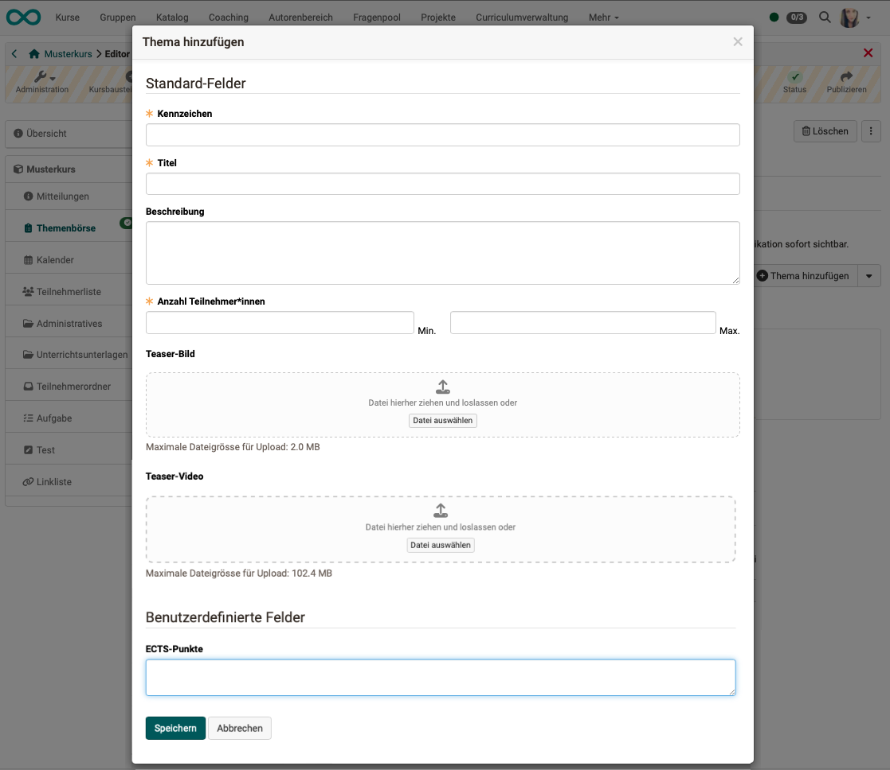
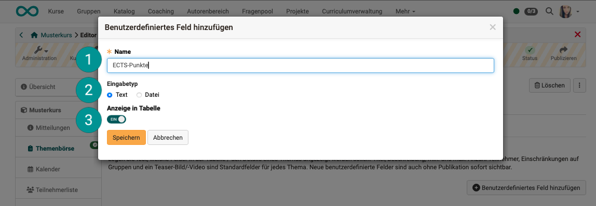
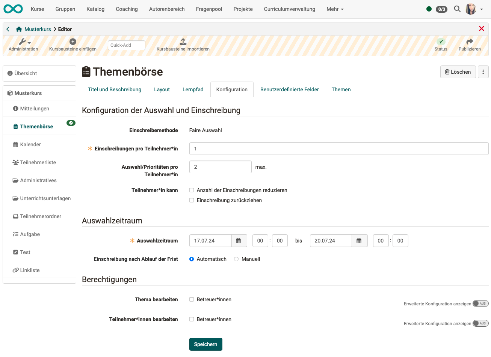
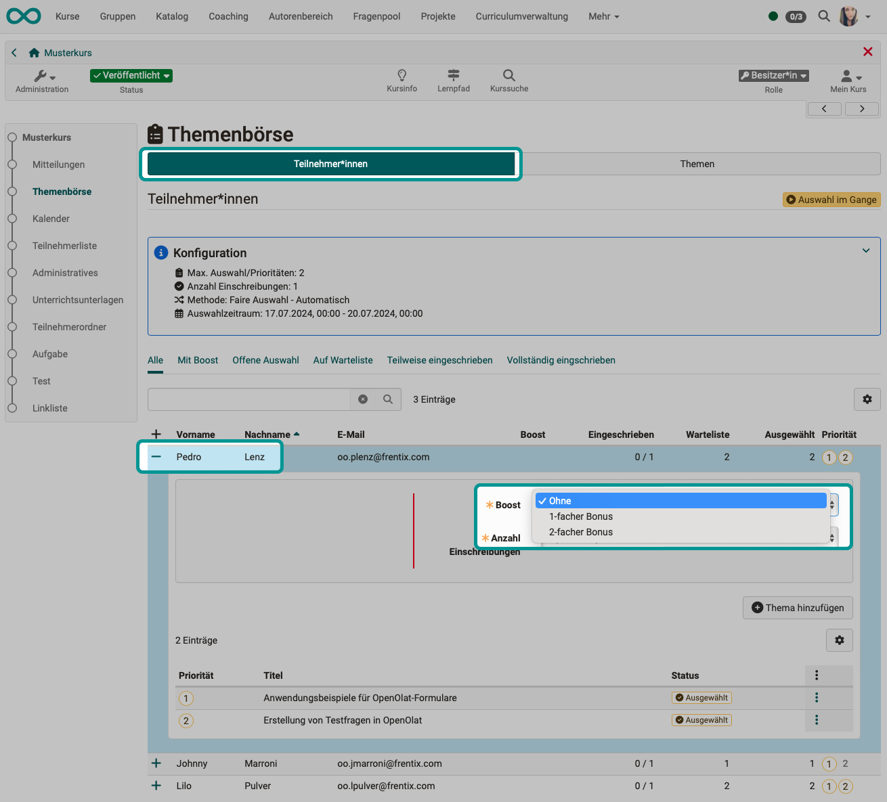

# Kursbaustein "Themenbörse" {: #topic_broker}

## Steckbrief

Name | Themenbörse
---------|----------
Icon | { class=size24  }
Verfügbar seit | Release 19
Funktionsgruppe | Verwaltung und Organisation
Verwendungszweck | eigenständige Eintragung der Teilnehmer:innen zur Bearbeitung bestimmter Themen
Bewertbar | nein
Spezialität / Hinweis | Im Unterschied zu den Kursbausteinen "Themenvergabe" und "Einschreibung" können in der Themenbörse alle Teilnehmer:innen mehrere Themen mit Prioritäten angeben. OpenOlat bildet dann anhand dieser Themen- und Priorisierungswünsche Zuteilungen.

Mit dem Kursbaustein "Themenbörse" wird ein Einschreibeprozess für ein Thema in 2 Schritten vollzogen: 
1. Schritt: Alle Teilnehmer:innen geben ihre Themenwünsche und Priorisierung an. 
2. Schritt: Die Themen werden den Teilnehmer:innen zugeteilt.

Diese Aufteilung bringt mehr Fairness bei der Themenvergabe, denn die Zuordnung hängt so nicht davon ab, wer seine Wünsche zuerst anmelden konnte.

## Funktionsweise

* Es können 1 oder mehrere Teilnehmer:innen an der Themenbörse teilnehmen.
* Es können 1 oder mehrere Themen zur Auswahl/Bearbeitung angeboten werden.
* Die Teilnehmer:innen können zu ihren gewählten Themen eine Prioritäten-Reihenfolge angeben.
* Es kann sowohl eine Themenauswahl, wie auch eine Begrenzung der Anzahl Personen pro Thema vorgegeben werden.
* Es kann auch eine bestimmte Anzahl Themen je Teilnehmer verpflichtend gemacht werden.
* Die Themenwahl muss auf ein bestimmtes Zeitfenster beschränkt werden.
* OpenOlat kann nach Schliessen des Zeitfensters anhand der angegebenen Prioritäten automatisch berechnen, wer welche Themen zugewiesen bekommt. Die Berechnung kann automatisch oder manuell angestossen werden.

## Wer kann wählbare Themen erfassen?

* Per Voreinstellung werden Themen durch die **Kursbesitzer:innen** erfasst.

* **Betreuer:innen** kann im Tab "Konfiguration" das Ergänzen von Themen ebenfalls erlaubt werden.

* **Betreuer:innen** kann auch das Bearbeiten von Teilnehmer:innen erlaubt werden. (Thema zuweisen, Priorisierung anpassen, Teilnehmer:innen ein- oder ausschreiben)

* Ferner können Themen auch aus einer **csv-Datei** importiert werden.

## Tab "Themen" (Erfassen von Themen)

Die wählbaren Themen können im Kurseditor im Tab "Themen" hinzugefügt und beschrieben werden. Alternativ kann dies auch ausserhalb des Editors im Run-Mode geschehen.

{ class="shadow lightbox" }

Im nachstehenden Beispiel ist im unteren Bereich zusätzlich ein Feld enthalten, das im Tab "Benutzerdefinierte Felder" hinzugefügt wurde.

{ class="shadow lightbox" }

## Tab "Benutzerdefinierte Felder"

Im Tab "Benutzerdefinierte Felder" können Zusatzfelder erstellt werden, die dann in jedem Thema angezeigt werden. Unter den 3 Punkten am Ende einer Zeile können sie jederzeit wieder editiert und gelöscht werden.

{ class="shadow lightbox" }

{ class="shadow lightbox" }

**1 Name** 
Der hier eingegebene Name erscheint als zusätzliches Feld im Popup "Thema hinzufügen".

**2 Eingabetyp** 
Text: Beim Erfassen kann zu jedem Thema eine Angabe in Textform eingegeben werden. 
Datei: Beim Erfassen kann zu jedem Thema eine Datei hochgeladen werden, z.B. eine pdf-Datei mit Informationen zum Thema.

**3 Anzeige in Tabelle** 
Wird der Toggle-Button eingeschaltet, erscheint dieses Feld in der Übersichtstabelle für Besitzer:innen und Betreuer:innen.

## Tab "Konfiguration"

Im Tab "Konfiguration" werden die Rahmenbedingungen der Themenwahl und Einschreibung festgelegt.

{ class="shadow lightbox" }

## Export der Themenwünsche und Priorisierungen

Im Tab "Themen" kann mit dem Button "Themen exportieren" eine zip-Datei heruntergeladen werden, in der alle Themen, Wünsche und Priorisierungen enthalten sind (Übersicht als Excel-Datei).

(Der Button ist sowohl im Kurseditor als auch im Run-Mode für Betreuer:innen / Besitzer:innen verfügbar.) 

## Einschreibung / Themenzuordnung

Ob die Einschreibung (Zuordnung der gewünschten Themen zu Teilnehmer:innen) nach Ablauf der eingestellten Frist **automatisch oder manuell** erfolgen soll, kann im Kurseditor im **Tab "Konfiguration"** festgelegt werden. OpenOlat kann anhand der Themen- und Priorisierungswünsche automatisch Zuteilungen machen.

Zur Ansicht wählen Sie den Kursbaustein und klicken dann im Tab "Teilnehmer:innen" auf das Plussymbol vor einem Namen in der Liste. Es öffnet sich die Ansicht der getroffenen Wahl und Prioritätensetzung dieser Person.

Mit einer **Boost-Funktion** können Kursbesitzer:innen pro Einzelpersonen eine Gewichtung ergänzen und so korrigierend eingreifen.

{ class="shadow lightbox" }

## Weitere Informationen

[Kursbaustein Themenvergabe](../learningresources/Course_Element_Topic_Assignment.de.md) 
[Kursbaustein Einschreibung](../learningresources/Course_Element_Enrolment.de.md) 

