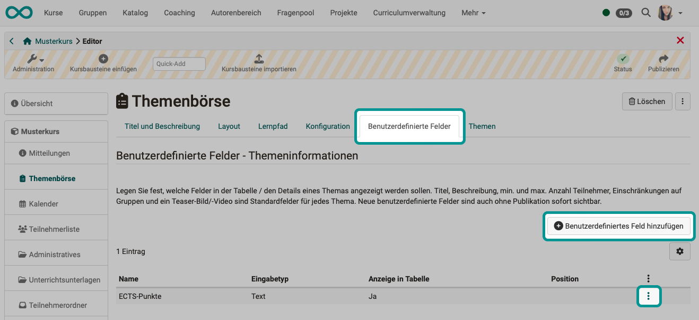
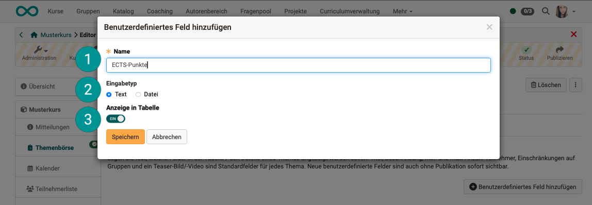
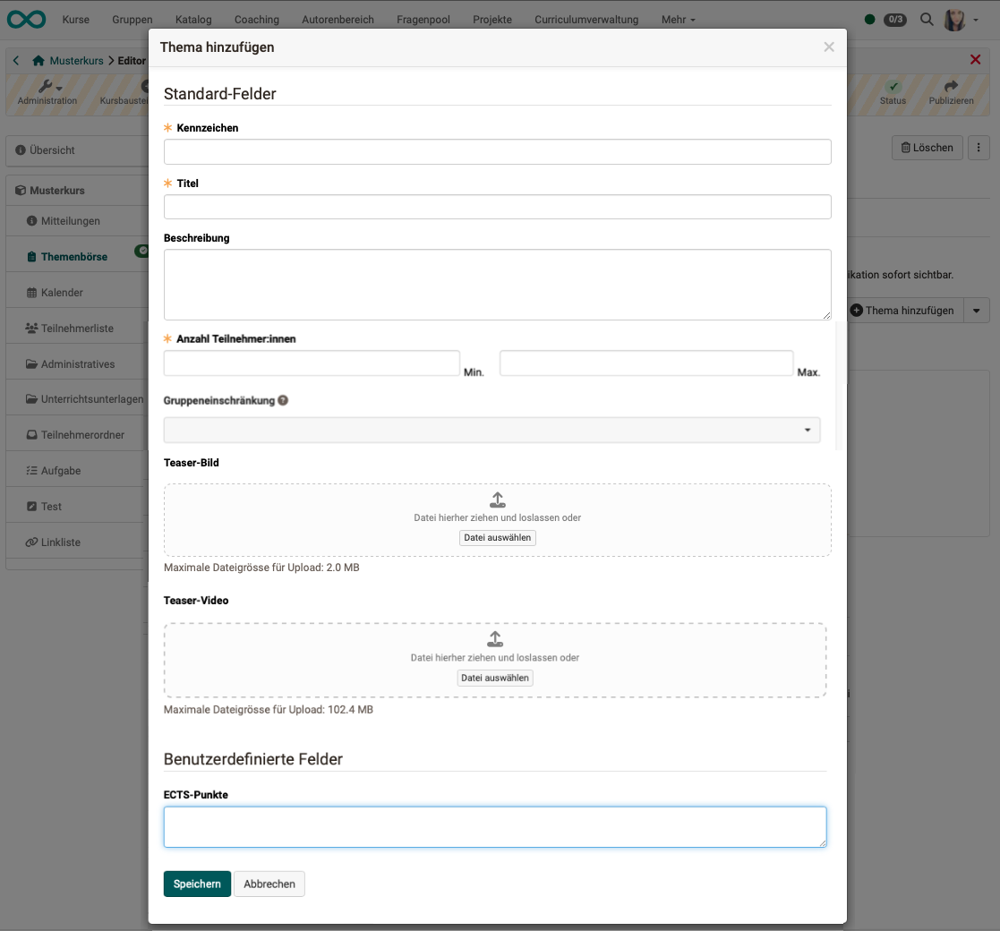
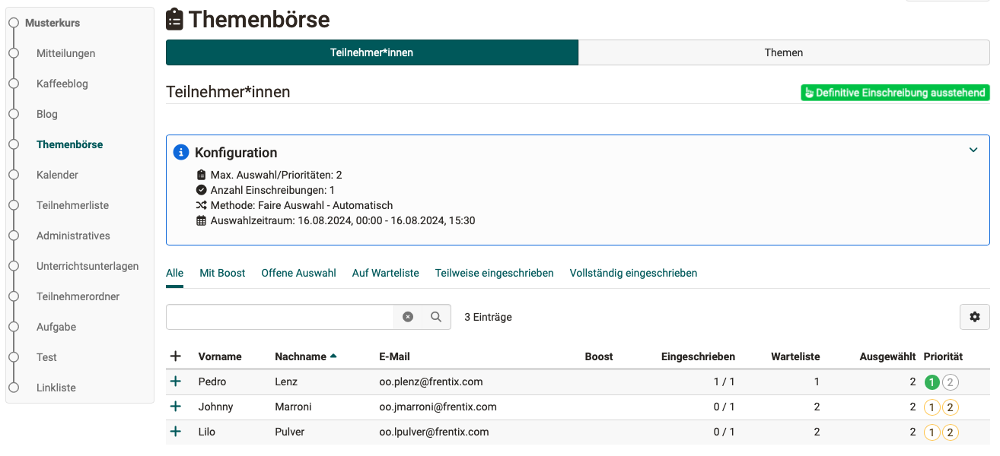
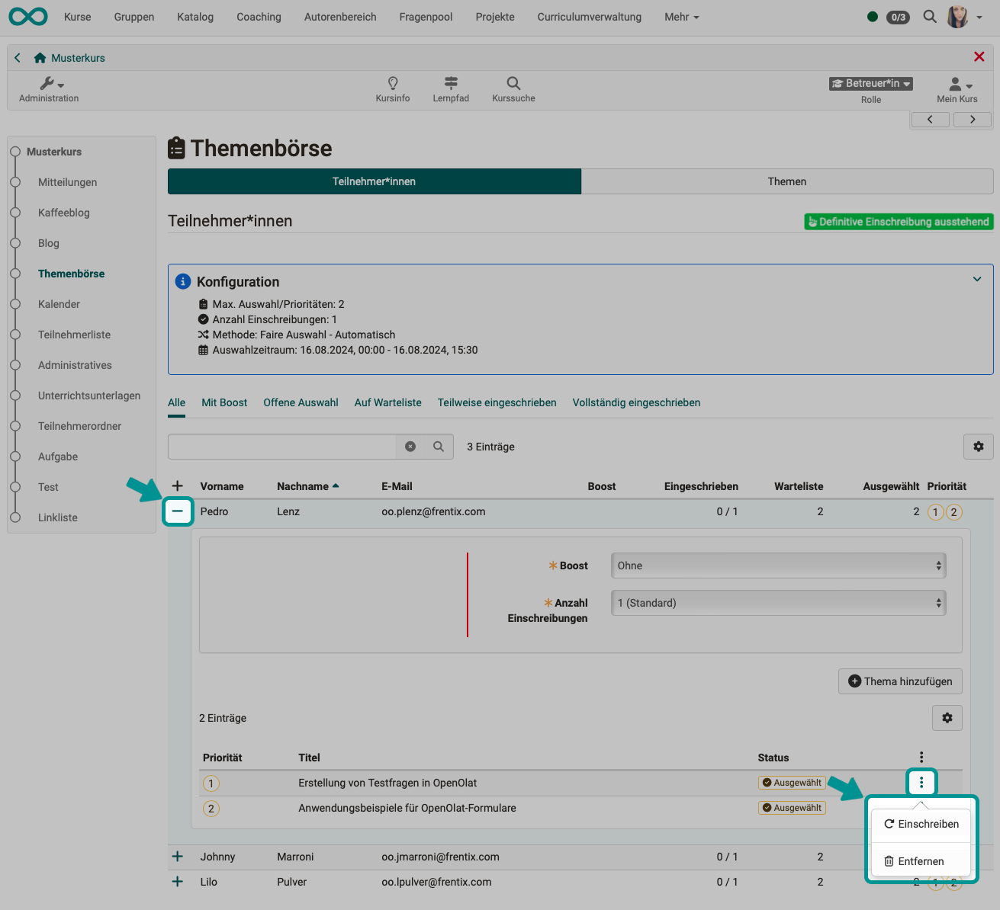
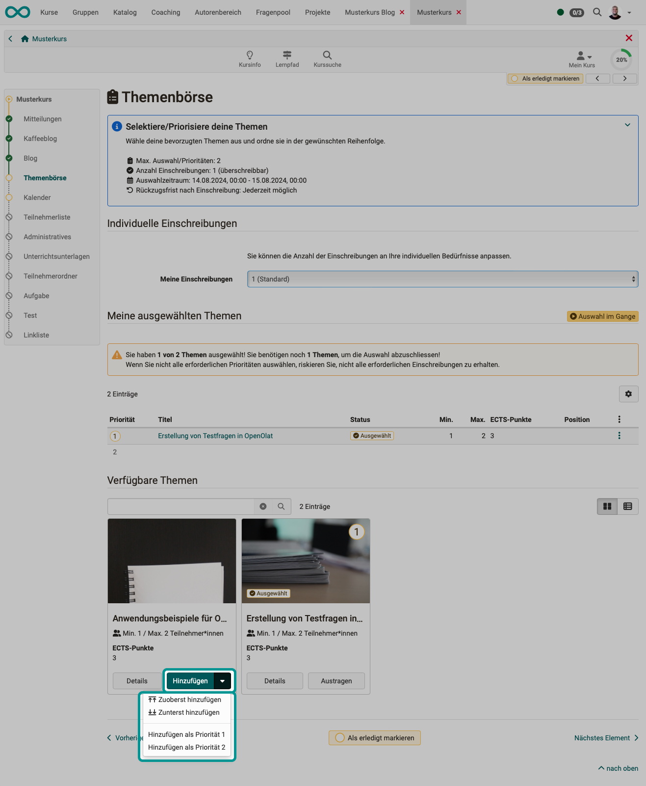
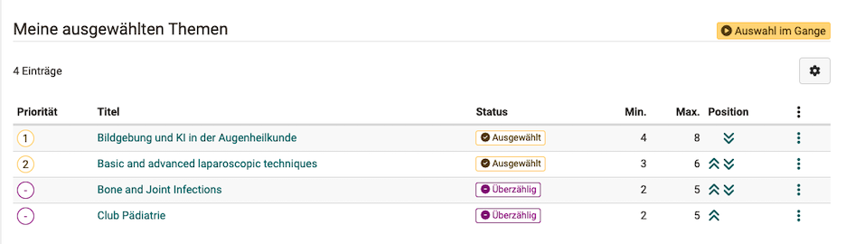
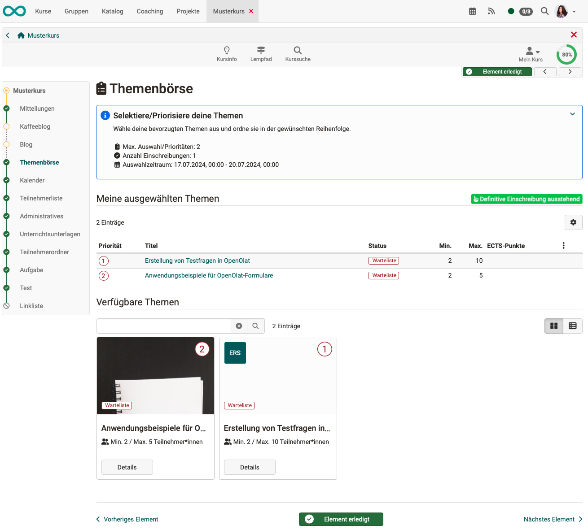
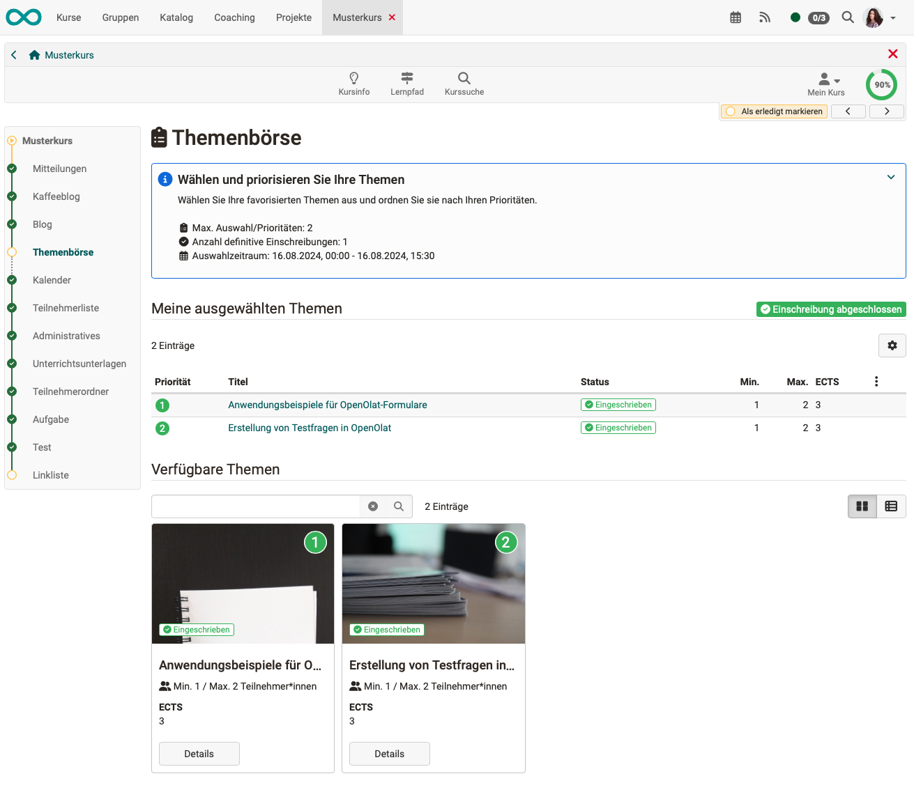

# Course Element "Topic Broker" {: #topic_broker}

## Profile {: #profile}

Name | Topic Broker
---------|----------
Icon | { class=size24  }
Available since | Release 19
Functional group | Administration and organisation
Purpose | self registration of participants in groups
Assessable | no
Speciality / Note | In contrast to the course elements "Topic assignment" and "Enrolment", all participants can specify several topics with priorities in the course element "Topic Broker". OpenOlat then creates assignments based on these topic and prioritization requests.

With the "Topic exchange" course element, a registration process for a topic is completed in 2 steps: 
1. Step: All participants indicate their preferred topics and prioritization. 
2. Step: The topics are assigned to the participants.

This division brings more fairness to the allocation of topics, because the allocation does not depend on who was able to register their wishes first.

## Functionality {: #topic_broker_functionality}

* One or more course participants can take part in the topic broker (no coaches).
* One or more topics can be offered for selection.
* Participants can specify a priority order for their chosen topics.
* Both a selection of topics and a limit on the number of people per topic can be specified. A limitation to groups is also possible.
* A certain number of topics per participant can also be made mandatory.
* The choice of topic is limited to a specific time slot.
* After closing the time window, OpenOlat can calculate who is assigned which topics based on the specified priorities. The calculation can be triggered automatically or manually. Manual initiation of the assignment (recommended) is reserved for course owners.

[To the top of the page ^](#topic_broker)

## The algorithm for automatic topic assignment {: #topic_broker_algorithm}

If a selection and allocation process works on a "first-come, first-served basis", then this is unfair. This is familiar from the allocation of tickets for football matches and concerts. Users with a better internet connection will be given preference, as will users who have time to log in immediately at the time of publication.

The problem is known as the "stable matching" problem. Details on the implementation in OpenOlat can be found here: [OpenOlat_Project_Broker_Matching_Algorithm.pdf](assets/OpenOlat_Project_Broker_Matching_Algorithm.pdf)

The assignment of topics in the course module Topic Exchange therefore takes place in 2 steps:

- Choice of topic/project/group and indication of personal priorities (first choice, second choice, etc.).
- Once everyone has submitted their preferred wishes, the assignment is made. If a topic was requested with first priority more often than there are places available, the assignment is made using the fair algorithm according to the information on the second priority. 

{ class="shadow lightbox" }

!!! note "Note"

    Due to the functionality described above, it is understandable that the topic broker cannot be used in open courses with an undefined number of participants.

[To the top of the page ^](#topic_broker)

## Who can record eligible topics? {: #topic_broker_eligible_topics}

* By default, topics are entered by the **course owners**.

* **Coaches** can also be allowed to add topics in the "Topics" tab.

* **Coaches** can also be allowed to edit participants. (Assign topic, adjust prioritization, add or remove participants)

* Topics can also be imported from an **Excel file**.

[To the top of the page ^](#topic_broker)

---

## Set up topic broker (course owner perspective) {: #topic_broker_setup}

### "Configuration" Tab {: #topic_broker_setup_tab_config}

In the "Configuration" tab, the framework conditions for the choice of subject and enrollment are defined.

{ class="shadow lightbox" }

#### Topic selection 

**Selection period** 
The selection period is the time frame within which participants must submit their topic requests. Registration will be triggered at the end of the selection period.

**Selection/Priorities per participant** 
If participants have specified several topics, they can mark a selection as their priority/preferred choice. In this field, you specify the maximum number of topics that can be specified as preferred topics.

Both are mandatory fields

#### Enrolment

 **Enrolments per participant** 
This defines how many subjects a participant will ultimately be enrolled in, regardless of the number of his/her priorities. This information is binding.

 **Participant can ...** 
If necessary, participants can also **reduce** the specified number of registrations themselves, e.g. if they do not want to work on multiple topics. 

Participants may also be allowed to **withdraw** their registrations if allocation and registration have taken place after the selection period has expired. If this option is checked, a date can be entered by which a registration can be withdrawn. 

 **Selection period** 
Currently, only the ["Fair Selection"] method is available. There are plans to add further selection methods in the future. 

 **Enrolment after the deadline** 
In general, election topics can also be assigned an implementation period. If this is the case, it may be important to avoid overlaps in the election schedule. By checking the box, you can avoid overlaps in the registration process.

 **Withdraw deadline** 
There are basically two ways to trigger the distribution of participants after the registration deadline has expired: either manually by the course administrators (see below) or automatically by the system after the end of the selection period.

If you select "automatic", additional options will appear and you can define the principle according to which the automatic distribution should take place.  
a) **Maximum number of enrolments**: High enrolment rate and short waiting list 
b) **Maximum consideration of priorities**: Focused on achieving the highest possible level of fulfillment of the selected priorities 
c) **Maximum number of topics**: High topic quota due to sufficient number of participants

#### Authorization 
If necessary, in addition to course owners, coaches can also be given the right to edit topics and/or participants. 

**Edit topic** 
By default, the right to edit the topic specifications is reserved for course owners. With this option, the right can also be granted to coaches. 
The processing can be specified in even greater detail if the advanced configuration is used (toggle button on the right-hand side).

**Edit participants** 
By default, the right to override and edit a selected topic is reserved for course owners. With this option, the right can also be given to coaches. (They normally only have read access if they choose one of the names.) However, the override option should only be used in exceptional cases, as it runs counter to the actual intention of enabling fair distribution through a neutral algorithm. 
The processing can be specified in even greater detail if the advanced configuration is used (toggle button on the right-hand side). 

[Up (Course owner perspective) ^](#topic_broker_setup) 
[To the top of the page ^](#topic_broker)

### "Custom fields" tab {: #topic_broker_setup_tab_custom_fields}

Additional fields can be created in the "Custom fields" tab, which are then displayed in each topic. They can be edited and deleted at any time under the 3 dots at the end of a line.

{ class="shadow lightbox" }

{ class="shadow lightbox" }

 **Name** 
The name entered here appears as an additional field in the "Add custom field" pop-up.

 **Input type** 
**Text**: When entering data, you can enter a text entry for each topic.  
**File**: When entering, a file can be uploaded for each topic, e.g. a pdf file with information on the topic.

 **Display in table** 
If the toggle button is activated, this field appears in the overview table by default.

[Up (Course owner perspective) ^](#topic_broker_setup) 
[To the top of the page ^](#topic_broker)

### "Topics" tab (Capturing topics) {: #topic_broker_setup_tab_topic}

The selectable topics can be added and described by course owners in the "Topics" tab of the course editor. Alternatively, this can also be done outside of the editor in run mode. Depending on the configuration, this can also be done by course coaches.

{ class="shadow lightbox" }

In the example below, the lower section also contains a field that was added in the "Custom fields" tab.

{ class="shadow lightbox" }

[Up (Course owner perspective) ^](#topic_broker_setup) 
[To the top of the page ^](#topic_broker)

---

### Export/Import topics and data {: #topic_broker_export_import_topics}

**Export topics** 
To export the topics, select the relevant course element in the course editor, then the **Tab "Topics"** and there the **Button “Export data"**. 
The button is also available after leaving the course editor in run mode (header not hatched).

When exporting, a zip file is created that contains an Excel file (with all topics) and the associated media files. The Participants’ tab in the Excel file shows which participants are registered for this topic.

{ class="shadow lightbox" }

 

**Import topics** 
You can import topics that have been exported from another course element "Topic exchange" (usually from another course). The zip file exported there contains

- an Excel file with the topics,
- all associated media files,
- as well as the necessary information for assigning the media files to the correct topics.

To import the themes, select **“Import themes"** after you have clicked on the small arrow next to the ”Add theme" button.

{ class="shadow lightbox" }

A small wizard guides you through the import process.

{ class="shadow lightbox" }

The topics and media files must be entered in two different fields. Sample files are also available to download for both fields. Normally, however, you will use the zip file exported elsewhere from an OpenOlat course element "Topic exchange".

**a) Topics** 
The topics to be imported are entered here as texts (e.g. titles).
If you want to use the Excel file from a topic collection exported elsewhere, you may first have to unzip the zip file exported there and use the Excel file it contains.

**b) Media files** 
The media files must be assigned to the correct topic during import. The information for this is also contained in the zip file exported elsewhere from OpenOlat. The entire zip file must therefore be imported in this section.

[Up (Course owner perspective) ^](#topic_broker_setup) 
[To the top of the page ^](#topic_broker)

---

## Coach topic exchange (course coach perspective) {: #topic_broker_coaching}

### Capture topics {: #topic_broker_coaching_capture_topics}

The selectable topics may have already been added and described by course owners (in the "Topics" tab in the course editor). Alternatively, this can also be done by **course tutors**. As a coach, select the course element and the "Topics" tab. The topics can be newly created here or imported from an Excel spreadsheet. (You will also find an Excel template for download under the "Import topics" selection option).

{ class="shadow lightbox" }

[Up (Course owner perspective) ^](#topic_broker_coaching) 
[To the top of the page ^](#topic_broker)

### View of topic requests {: #topic_broker_coaching_view_topic_requests}

In the "Participants" tab, coaches can see who has already submitted their topic requests, who is on the waiting list or who is already enrolled. Click on the + in front of one of the names to open the detailed view.

{ class="shadow lightbox" }

!!! tip "Note"

    If course coaches have been given the right, they can intervene at any time and override a selection made or make a selection for the person if there is no selection.
    It is also possible to add another topic.

    However, this should only be used in exceptional situations if possible.

[Up (Course owner perspective) ^](#topic_broker_coaching) 
[To the top of the page ^](#topic_broker)

### Topic assignment (final enrollment pending) {: #topic_broker_coaching_topic_assignment}

The process proceeds in the following steps

* "Selection in progress"
* "Definitive enrolment pending"
* "Enrolment completed"

Once all participants have entered their topic requests and the time window for submission has closed, the "Selection in progress" phase is complete. The status changes to "**Definitive enrolment pending**".

Participants and topics must now be assigned. OpenOlat can automatically make assignments based on the topic and prioritization requests. For this purpose, OpenOlat uses a [fair algorithm](assets/OpenOlat_Project_Broker_Matching_Algorithm.pdf).

The execution of the assignment process can be triggered **automatically or manually**. The way in which the process is triggered is determined by the course owner in the course editor in the **"Configuration"** tab. 

[Up (Course owner perspective) ^](#topic_broker_coaching) 
[To the top of the page ^](#topic_broker)

### Automatic topic assignment {: #topic_broker_assignment_automatically}

If the course owner has selected the "Automatic" option in the "Configuration" tab in the course editor, the assignment algorithm will start automatically shortly after the time window in which the participants were able to make their selection has closed. (How long the process runs depends, for example, on the number of topics and participants).

The assignment algorithm is **only executed once**. The mapping result found is used for enrolment.

However, coaches can manually correct and amend the enrolments see [Adjustment](../learningresources/Course_Element_Topic_Broker.md#topic_broker_adjustment)

After an automatic assignment, an e-mail is always sent to all course participants.

[Up (Course owner perspective) ^](#topic_broker_coaching) 
[To the top of the page ^](#topic_broker)

###  Manual topic assignment/enrolment by coaches {: #topic_broker_assignment_manually}

If the course owner has selected the "manual" option in the "Configuration" tab in the course editor, the execution of the assignment algorithm must be started by a course administrator.

The time when they trigger enrolment is not fixed.

{ class="shadow lightbox" }

If the assignment algorithm is triggered manually, **several runs** can be made. The results differ because the algorithm also contains a random factor. They are listed in a dropdown and coaches can select a run to be used for the final enrolment.

{ class="shadow lightbox" }

Once the coach has decided on a run (an assignment result), the **enrolment** is carried out based on this assignment by clicking on the "Apply" button. Reconfirmation is required, as enrolment cannot be repeated with a different assignment result/pass.

{ class="shadow lightbox" }

In the case of manual kick-off, you can also specify that the participants are subsequently informed of the enrolment by e-mail.

!!! tip "Note"

    If there are still people with the status "Waiting list" or "Open" after clicking on "Apply", you can assign them manually (see [Adjustment](Course_Element_Topic_Broker.md#topic_broker_adjustment)). 
    This may be necessary, for example, if a person has not yet entered a topic after the time window has expired and therefore could not be assigned by the algorithm.

[Up (Course owner perspective) ^](#topic_broker_coaching) 
[To the top of the page ^](#topic_broker)

### Influence topic assignment {: #topic_broker_boost}

With a **boost function**, coaches can add a weighting for each individual and thus take corrective action. The assignments of participants with a boost are given preferential treatment by the enrolment algorithm.

{ class="shadow lightbox" }

[Up (Course owner perspective) ^](#topic_broker_coaching) 
[To the top of the page ^](#topic_broker)

### Correction of topic assignment/enrolment by coaches {: #topic_broker_adjustment}

For an overview, select the course element as the course coach and then click on the plus symbol in front of a name in the list in the "Participants" tab. The view of the selection and prioritization of this person opens.

As a coach, you have the option of making the enrolment manually or removing a pre-selected topic. 

{ class="shadow lightbox" }

Enrolment (including automatic enrolment) can be canceled by coaches (deregistration).

{ class="shadow lightbox" }

[Up (Course owner perspective) ^](#topic_broker_coaching) 
[To the top of the page ^](#topic_broker)

### Export of topic requests and prioritizations {: #topic_broker_export}

In the "Topics" tab, you can use the "Export data" button to download a zip file containing all topics, requests and prioritizations (overview as an Excel file).

The button is available both in the course editor (for course owners) and in run mode for coaches/owners.

{ class="shadow lightbox" }

[Up (Course owner perspective) ^](#topic_broker_coaching) 
[To the top of the page ^](#topic_broker)

---

## Choice of topic (student perspective) {: #topic_broker_participant}

As a participant, simply select the course element Topic Broker in your course. Depending on the phase of the enrolment process, you will be shown the current status of topic allocation.

### 1. Step: Select topics {: #topic_broker_participant_step1}

Click on the "Add" button for a topic description that you would like to enrol in and it will be added to the list of your selected topics. 

Depending on the preset authorization, participants can also withdraw an enrolment or reduce the number of enrolments.

{ class="shadow lightbox" }

[Up (Perspective course participant) ^](#topic_broker_participant) 
[To the top of the page ^](#topic_broker)

### 2. Step: Prioritize topics {: #topic_broker_participant_step2}

If you have many topics to choose from, it is advisable to first include all possible topics in your selection. In a second step, you can then create a ranking list from this preselection.

As long as the selection is still in progress (the time window for this is not yet closed), you can change the position of the topics in your list by clicking on the double arrows. Excess topics will then not be considered for enrolment.

{ class="shadow lightbox" }

[Up (Perspective course participant) ^](#topic_broker_participant) 
[To the top of the page ^](#topic_broker)

### 3. Step: Wait for assignment {: #topic_broker_participant_step3}

You will be informed as soon as you have been assigned a topic. The final assignment and enrolment (by your coach) will only take place once the selection period has expired and all course participants have submitted their requests. (To enable fair allocation, OpenOlat creates an allocation proposal from an algorithm).

{ class="shadow lightbox" }

[Up (Perspective course participant) ^](#topic_broker_participant) 
[To the top of the page ^](#topic_broker)

### 4. Step: Request enrolment(s) {: #topic_broker_participant_step4}

As soon as the final enrolment has been made by the coach, you as a participant will be able to see in the course element which topic(s) you have been enroled for.  

{ class="shadow lightbox" }

[Up (Perspective course participant) ^](#topic_broker_participant) 
[To the top of the page ^](#topic_broker)

---

## Further information {: #further_information}

[Course element Topic Assignment](../learningresources/Course_Element_Topic_Assignment.md) 
[Course element Enrolment](../learningresources/Course_Element_Enrolment.md) 
[OpenOlat_Project_Broker_Matching_Algorithm.pdf](assets/OpenOlat_Project_Broker_Matching_Algorithm.pdf) 

