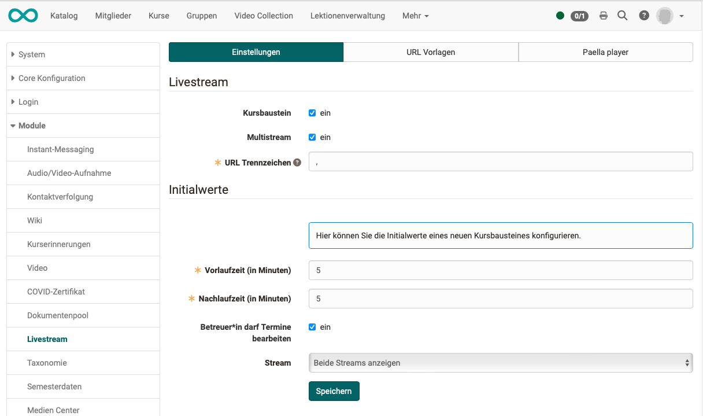

#  Kursbaustein "Video Livestream"  {: #livestream}

## Steckbrief

Name | Video Livestream
---------|----------
Icon | { class=size24  }
Verfügbar seit | 
Funktionsgruppe | Wissensvermittlung
Verwendungszweck | Anzeige eines Video-Livestreams (von dem/der Administrator:in eingerichtet)
Bewertbar | nein
Spezialität / Hinweis |

Der Kursbaustein Video Livestream ermöglicht die gleichzeitige Anzeige von 2 Livestreams. Die Videos werden während eines vordefinierten Zeitfensters einzeln oder nebeneinander angezeigt. URLs /

Beispiel: Youtube-Livestream

screen bsp TN-Screen

**Anwendungsbeispiele:**

* Übertragung einer Vorlesung mit 2 Live-Kameras (1. Kamera vortragende Person, 2. Kamera Präsentation)
* Regelmässige Beobachtungen von Wetter-Webcams mit Auswertungsauftrag im folgenden Kursbaustein, (z.B. Kursbaustein Checkliste)
* Regelmässige Tierbeobachtung via Webcam, mit Protokoll-Auftrag (z.B. in Kursbaustein Dokument)  

## Vorbereitung durch den/die Administrator:in

x

{ class="shadow lightbox" }

## Tab Konfiguration

Sind die Livestreams vorbereitet, finden die Kursautor:innen nach dem Einfügen des Kursbausteins im Kurseditor den **Tab Konfiguration**.

screen Kurseditor

