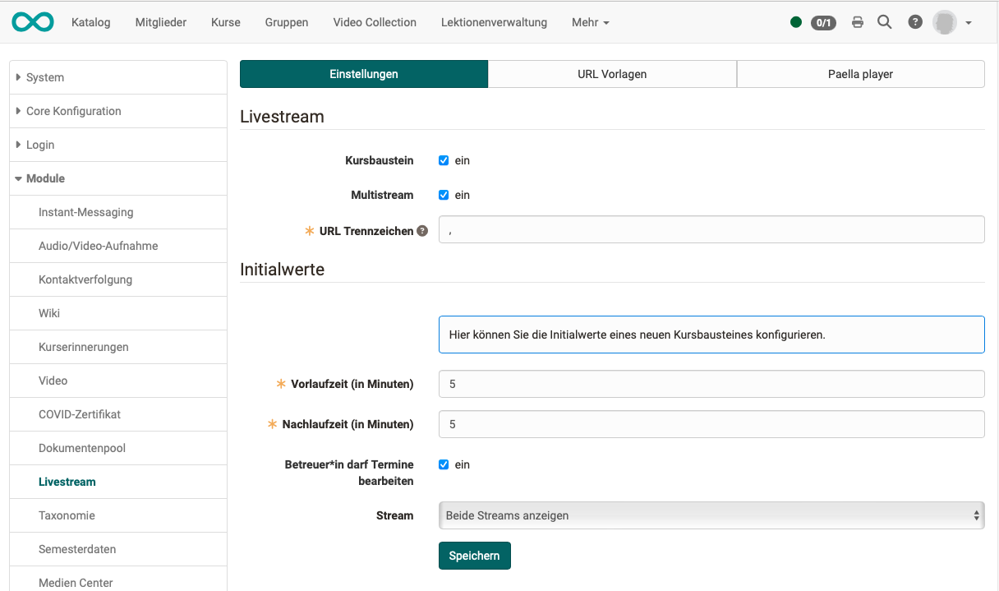

# Course Element "Video Livestream"

## Profile

Name | Video Livestream
---------|----------
Icon | :o_icon_o_livestream_icon:
Available since | 
Functional group | Knowledge transfer
Purpose | Display of a live video stream (set up by the administrator)
Assessable | no
Specialty / Note | 

The video livestream course element enables the simultaneous display of 2 livestreams. The videos are displayed individually or side by side during a predefined time window.

Example: Youtube-Livestream

**Application examples:**

* Transmission of a lecture with 2 live cameras (1st camera lecturer, 2nd camera presentation)
* Regular observations of weather webcams with evaluation assignment in the following course element (e.g. course element checklist)
* Regular animal observation via webcam, with protocol assignment (e.g. in course element document)  

## Preparation by the administrator

The administrators find the configuration in the system administration under: `Administration > Modules > Live stream`. 
There, they activate the course element and, if needed, the Multi stream option for two simultaneous live streams; with multi stream active, they also set the separator for multiple URLs of a single event. Under Default values, they set the buffer time before start and after end in minutes, whether coaches are allowed to edit, and the stream to display as the default for new course elements.

{ class="shadow lightbox" }

## Tab Configuration

Once the livestreams have been prepared, course authors will find the "Configuration" tab in the course editor after inserting the course element. 
There, they set the buffer time before start and after end in minutes, decide whether coaches are allowed to edit the events, and, with multi stream active, choose whether both live streams or only one is displayed.

## Further information {: #further_information}

[Types of Course Elements >](Course_Elements.md) 
[Course Element "Opencast" >](Course_Element_Opencast.md)

[To the top of the page ^](#livestream)
