# Kursbaustein "Videoaufgabe"  {: #video_task}

## Steckbrief

Name | Videoaufgabe
---------|----------
Icon | { class=size24  }
Verfügbar seit | Release 17.2
Funktionsgruppe | Wissensüberprüfung
Verwendungszweck | ermöglicht Beurteilungsaufgaben in einem Video
Bewertbar | ja
Spezialität / Hinweis | Zusätzliche im Video enthaltene Quizzes sind nicht bewertbar

Mit dem Kursbaustein "Videoaufgabe" können OpenOlat Video-Lernressourcen für interaktive (formative) Übungen oder Aufgaben mit Bewertungen (summativ) wiederverwendet werden. Dabei müssen Teilnehmende in einem Video relevante Situationen erkennen und einer Kategorie zuordnen. Die dafür notwendigen Platzhalter im Video (= Segmente) sowie die Kategorien werden in der Lernressource "Video" definiert (siehe Video Editor). Es steht ein Übungsmodus und ein scharfer Testmodus zur Verfügung. 

[Zum Seitenanfang ^](#video_task)

---

## Aufgabenstellungen

### Übung: Begriffe zuordnen

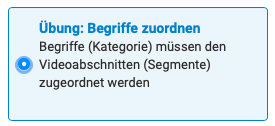{ class="shadow lightbox" }

In diesem Modus sind die Segmente (Videoabschnitte) im Video markiert.

**Beispiel:**

* Das Video zeigt den Ablauf einer medizinischen Pflegebehandlung.
* Im unteren Bereich des Videos werden Schritte der Behandlung angezeigt.
* Während das Video abgespielt wird, muss während des erkannten Schrittes die passende Bezeichnung der Massnahme (Kategoriebegriff) angeklickt werden.
* Das Feedback erfolgt unmittelbar nach der Wahl eines Begriffes.
* Eine manuelle Bewertung durch Betreuer:innen ist nicht möglich. (=> Üben soll ohne Kontrolle möglich sein.)

---

### Übung: Situationen erkennen

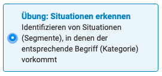{ class="shadow lightbox" }

In diesem Modus sind die Segmente (Videoabschnitte) im Video **nicht markiert**.

**Beispiel:**

* Das Video zeigt ein Beratungsgespräch.
* Im unteren Bereich des Videos sind keine Segmente (Videoabschnitte) markiert.
* Während das Video abgespielt wird, muss die lernende Person erkennen, um welche Gesprächsphase es sich gerade handelt.
* Das Feedback erfolgt unmittelbar nach der Wahl eines Begriffes.
* Eine manuelle Bewertung durch Betreuer:innen ist nicht möglich. (=> Üben soll ohne Kontrolle möglich sein.)

---

### Test: Situationen erkennen

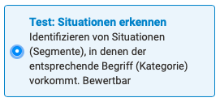{ class="shadow lightbox" }

In diesem Modus sind die Segmente (Videoabschnitte) im Video **nicht markiert**.  Im Unterschied zur Übung ist der Test **bewertbar**. 

**Beispiel:**

* Das Video zeigt ein Beratungsgespräch.
* Im unteren Bereich des Videos sind keine Segmente (Videoabschnitte) markiert.
* Während das Video abgespielt wird, muss die lernende Person erkennen, um welche Gesprächsphase es sich gerade handelt.
* Während eines Tests erhalten die Teilnehmer:innen kein Feedback.
* Am Ende wird lediglich angezeigt, dass eine automatische Bewertung vorgenommen wurde. Das detaillierte Bewertungsergebnis ist jedoch nur für den/die Betreuer:in oder Besitzer:in ersichtlich.

!!! info "Hinweis"

    Neben den 3 Aufgabenstellungen mit Segmenten können auch Quizfragen zu verschiedenen Zeitpunkten im Video angezeigt werden. Sie werden in der Auswertung jedoch derzeit nicht berücksichtigt.

[Zum Seitenanfang ^](#video_task)

---

## Übungsmodus - Testmodus

Beim Üben sollen die Ergebnisse anonym bleiben. Betreuer:innen sehen deshalb nur anonym dargestellte  Ergebnisse. In Tests werden dagegen die Eingaben durch die Betreuer:innen bewertet.

Die Anzahl der Lösungsversuche kann limitiert werden (1-9999).

Im Übungsmodus "Begriffe zuordnen" kann auch die Anzahl der Antwortversuche pro Segment begrenzt werden (1-5).

---

## Erforderliche Lernressource

In jeden Kursbaustein "Videoaufgabe" muss eine Video-Lernressource eingefügt werden.

Dies ist eine mp4-Datei, die in den Autorenbereich hochgeladen wurde, oder ein Link auf eine Online-Ressource (z.B. Youtube).

Einer mp4-Datei können in OpenOlat die nachstehenden Elemente hinzugefügt werden. Die mp4-Datei zusammen mit diesen Elementen bildet die OpenOlat-Video-Lernressource. Sie ist im Autorenbereich aufgelistet.

Um Segmente (Videoabschnitte) zuordnen zu können, benötigt eine Videoaufgabe zwingend eine Video-Lernressource, in der Segmente angelegt wurden.

| Elemente der Lernressource:                  |                                    |
| ----------------- | ---------------------------------- |
| Kapitel           | optional                           |
| Anmerkungen       | optional                           |
| Segmente          | Für eine Videoaufgabe erforderlich |
| Kommentare        | optional                           |
| Quiz              | optional (nicht ausgewertet)       | 

!!! tip "Tipp"

    Wird für die Video-Lernressource ein Link (z.B. YouTube) benutzt, ist zu bedenken, dass bei einem nicht mehr gültigen Link die Videoaufgabe unbrauchbar wird. Wir empfehlen deshalb, möglichst eine mp4-Datei in OpenOlat hochzuladen.

[Zum Seitenanfang ^](#video_task)

---

## Videoaufgabe erstellen

### Schritt 1
Erstellen Sie im Autorenbereich eine Video-Lernressource. 
Öffnen Sie den Video-Editor fügen Sie Segmente und Begriffe hinzu. 
[Mehr dazu >](../../manual_user/learningresources/Learning_resource_Video.de.md#video-editor-segmente) 

### Schritt 2
Fügen Sie einen Kursbaustein "Videoaufgabe" in den Kurs ein.

### Schritt 3
Im Kursbaustein, Tab "Konfiguration" 
a) fügen Sie die mit Segmenten vorbereitete Video-Lernressource ein und 
b) wählen den gewünschten Modus.

### Schritt 4
Stellen Sie sicher, dass im Tab "Konfiguration" 

* Segmente als Videoelemente angezeigt werden
* die richtigen Begriffe verwendet werden
* die Reihenfolge der Begriffe in der Videoaufgabe stimmt

!!! tip "Tipp"

    * Mit Klick auf "Lernressource bearbeiten" öffnen Sie den Video-Editor und können die Segmentzuordnung weiter bearbeiten.

[Zum Seitenanfang ^](#video_task)

---

## Auswertung

### Prinzipien

* Bei Übungen erfolgt die Bewertung automatisch. Sie kann nicht von Betreuer:innen abgeändert werden.
* Auch Tests werden automatisch bewertet. Betreuer:innen können alle Lösungsversuche im Bewertungswerkzeug ansehen und über die Freigabe der Bewertung entscheiden.
* In einer Video-Lernressource enthaltene Quizfragen sind derzeit nicht in der Auswertung berücksichtigt. Im Kursbaustein Videoaufgabe bezieht sich die Auswertung ausschliesslich auf die Segmente.
* Bei Übungen sollen die Ergebnisse anonym bleiben. Betreuer:innen sehen deshalb nur anonym dargestellte  Ergebnisse. 
* Die Gewichtung falscher Antworten erfolgt mit folgender Formel: 
    t = total number of segments 
    c = number of correctly identified segments 
    w = wrong clicks 
    g = Weighting wrong clicks 
    Result % = (c / t) - (w / t * g)  -> Weniger als 0% gibt es jedoch nicht  
    Score = max. score * result 

### Ergebnis für Teilnehmer:innen

Bei **Übungen** erhalten Teilnehmer:innen während der Lösung der Aufgabe unmittelbar ein Feedback angezeigt.

Ausserdem wird am Ende der Übung eine Zusammenfassung angezeigt und die Lösung kann angesehen werden.

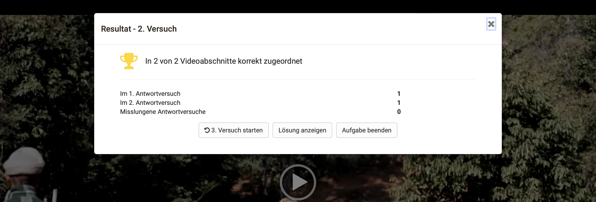{ class="shadow lightbox" }

Während eines **Tests** erhalten die Teilnehmer:innen dagegen keinerlei Feedback. Am Ende wird lediglich die Anzahl der Lösungsversuche angezeigt. (Falls weitere Versuche erlaubt sind, erscheint auch nochmals die Aufgabenstellung und der Button zum Starten der Videoaufgabe.)

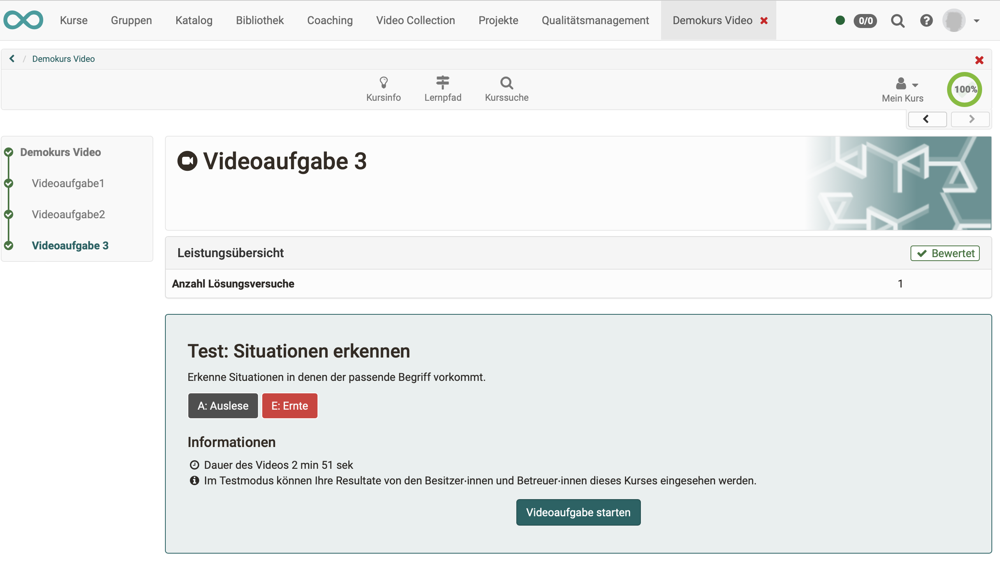{ class="shadow lightbox" }

### Ergebnisse für Betreuer:innen in Übungen

Wenn in Übungen Betreuer:innen im Kursmenü einen Kursbaustein mit der Videoaufgabe aufrufen, bekommen sie die beiden **Tabs "Teilnehmer:innen" und "Vorschau"** angezeigt.

* Im Tab **"Teilnehmer:innen"** wird in einer Liste der Bearbeitungsstand der betreuten Kursteilnehmer:innen angezeigt.
* Im Tab **"Vorschau"** wird das Video angezeigt, wie es Teilnehmer:innen sehen.

Betreuer:innen können bei jedem/jeder Teilnehmer:in einzeln die Anzahl der Versuche zurücksetzen und/oder die Daten einer Videoaufgabe zurücksetzen.

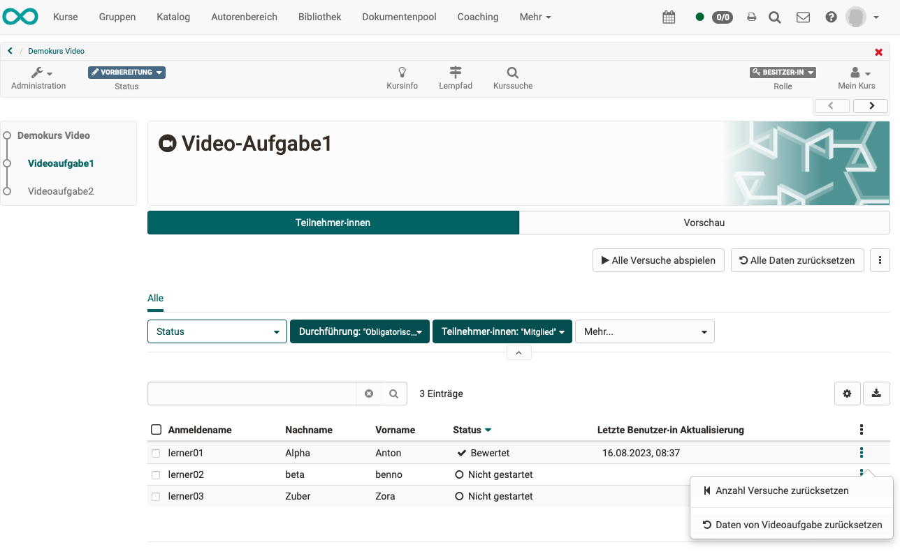{ class="shadow lightbox" }

### Button "Alle Versuche abspielen"

Da bei Übungen die Versuche der anonym bleiben sollen, können Betreuer:innen keine Resultate sehen, die bestimmten Personen zugeordnet werden können. Statt dessen werden in einer gemeinsamen Darstellung die Versuche aller Teilnehmer:innen als Striche dargestellt. 

Klicken Sie dazu den Button "Alle Versuche abspielen".

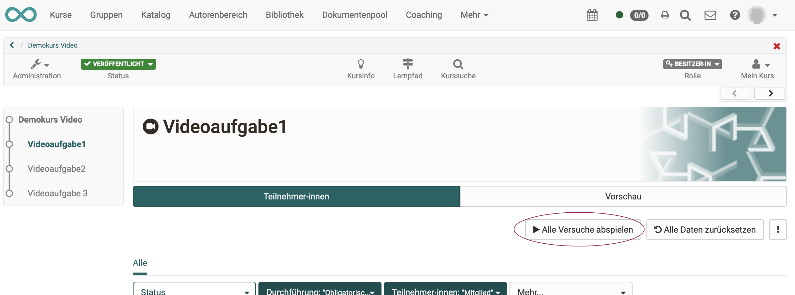{ class="shadow lightbox" }

In der Timeline des Videos werden alle erfolgreiche Antworten als grüne Striche dargestellt, die falschen Antworten als rote Striche. Betreuer:innen können so z.B. Rückschlüsse auf weit verbreitete Wissenslücken unter den Teilnehmer:innen ziehen. Die so dargestellten Ergebnisse können aber evtl. auch anzeigen, dass die Aufgabenstellung vielleicht angepasst werden sollte.

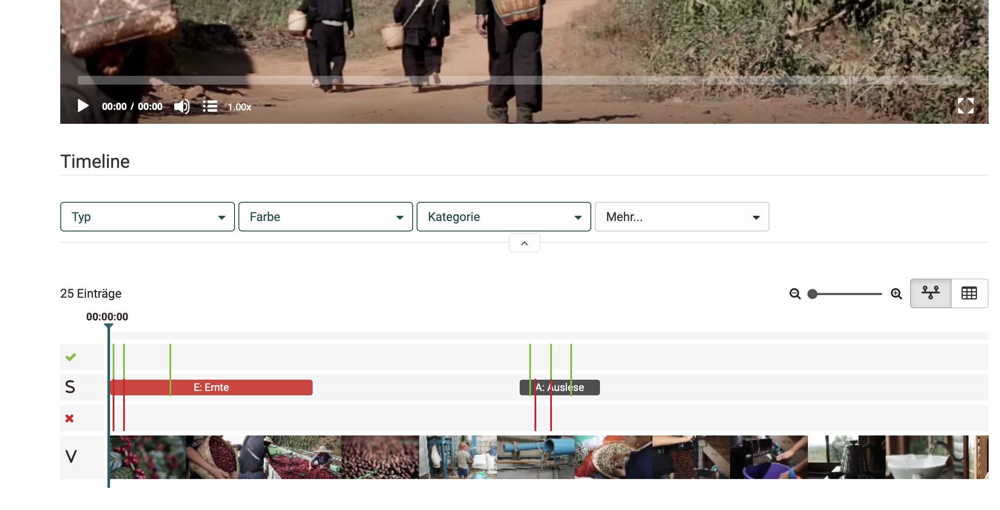{ class="shadow lightbox" }

### Button "Alle Daten zurücksetzen"

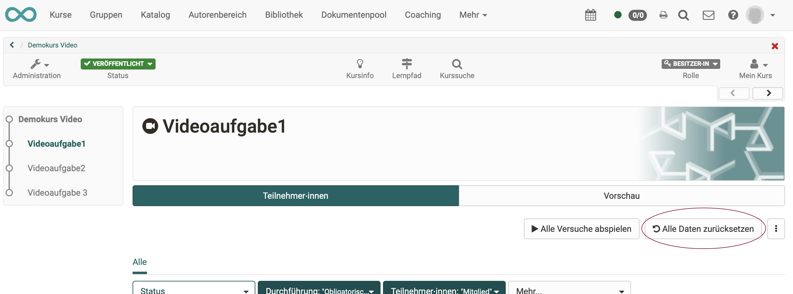{ class="shadow lightbox" }

Nach Klick auf den Button erscheint eine Sicherheitsabfrage, die beschreibt, was zurückgesetzt wird: Fortschritt, Anzahl Versuche, Testdurchläufe, Punkte und Erfolgsstatus, Freigabe der Bewertung sowie Erinnerungen. Vor dem Zurücksetzen wird eine Archivdatei mit den bisherigen Daten erstellt und heruntergeladen; sie steht zusätzlich im Leistungsnachweis der Teilnehmenden zur Verfügung.

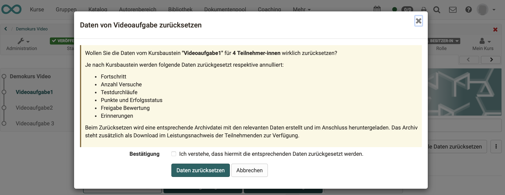{ class="shadow lightbox" }

### Ergebnisse für Betreuer:innen in Tests

Wurde für die Videoaufgabe der Modus "Test" gewählt, erscheinen ausser den **Tabs "Teilnehmer:innen" und "Vorschau"** noch die beiden **Tabs "Übersicht" und "Erinnerungen"**. Im Tab "Erinnerungen" können Betreuer:innen automatische E-Mails an Kursmitglieder einrichten, die versendet werden, sobald hinterlegte Regeln zutreffen, zum Beispiel einen Tag vor einem noch nicht absolvierten Test.

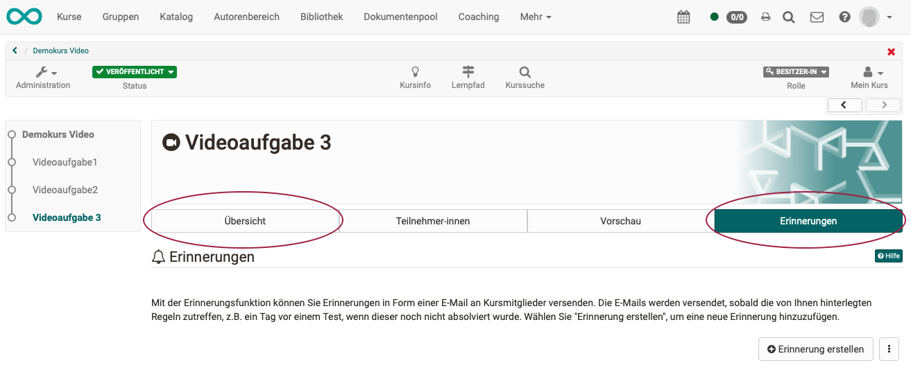{ class="shadow lightbox" }

Alle Resultate können von den Besitzer:innen und Betreuer:innen dieses Kurses im **Tab "Teilnehmer:innen"** detailliert für jeden/jede Teilnehmer:in eingesehen werden.

[Zum Seitenanfang ^](#video_task)

---

## Weiterführende Informationen {: #further_information}

[Lernressource Video >](../../manual_user/learningresources/Learning_resource_Video.de.md) 
[Kursbaustein Video >](../../manual_user/learningresources/Course_Element_Video.de.md)

[Zum Seitenanfang ^](#video_task)
