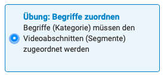
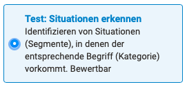
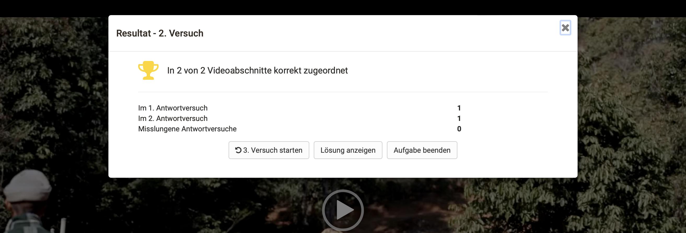
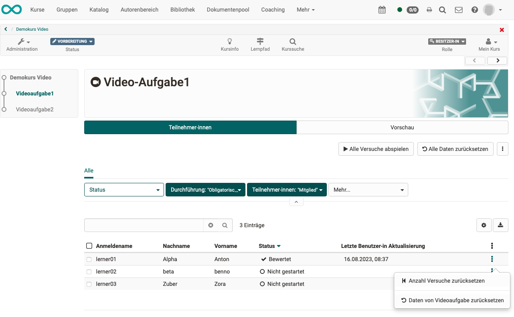
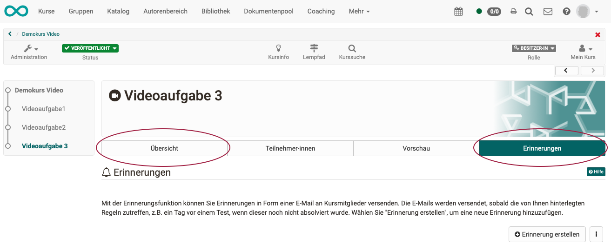

# Course Element "Video task"

## Profile

Name | Video Task
---------|----------
Icon | { class=size24 }
Available since | Release 17.2
Functional group | Assessment
Purpose | Enables assessment tasks in a video
Assessable | yes
Specialty / Note | Additional quizzes included in the video are not assessable

With the course element "Video task" OpenOlat video learning resources can be reused for interactive (formative) exercises or tasks with assessments (summative). Participants have to identify relevant situations in a video and assign them to a category. The necessary placeholders in the video (= segments) and the categories are defined in the learning resource "Video" (see Video Editor). A practice mode and a sharp test mode are available.

## Tasks

### Exercise: Matching terms

{ class="shadow lightbox" }

In this mode, the segments (video sections) in the video are marked.

**Example:**

* The video shows the process of a medical care treatment.
* In the lower area of the video, steps of the treatment are shown.
* While the video is playing, the appropriate name of the measure (category term) must be clicked on during the recognised step.
* Feedback is given immediately after a term is selected.
* Manual assessment by coaches is not possible. (=> Practising should be possible without control).

---

### Exercise: Recognising situations

{ class="shadow lightbox" }

In this mode, the segments (video sections) in the video are **not marked**.

**Example:**

* The video shows a counselling session.
* No segments (video sections) are marked in the lower area of the video.
* While the video is playing, the student has to identify which phase of the conversation it is.
* The feedback is given immediately after the selection of a term.
* Manual assessment by coaches is not possible. (=> Practising should be possible without control).

---

### Test: Recognizing situations

{ class="shadow lightbox" }

In this mode, the segments (video sections) in the video are **not marked**.  Unlike the exercise, the test is **assessable**.

**Example:**

* The video shows a counselling session.
* No segments (video sections) are marked in the lower part of the video.
* While the video is playing, the learner has to identify which phase of the conversation it is.
* During a test, the participants do not receive any feedback.
* At the end, it is only indicated that an automatic assessment has been made. However, the detailed evaluation result is only visible to the supervisor or owner.

!!! info "Note"

    In addition to the 3 tasks with segments, quiz questions can also be displayed at different times in the video. However, they are currently not taken into account in the evaluation.

---

## Practice mode - Test mode

When practising, the results should remain anonymous. Coaches therefore only see anonymously presented results. In tests, on the other hand, the entries are assessed by the supervisors.

The number of solution attempts can be limited (1-9999).

In the exercise mode "Assign terms", the number of answer attempts per segment can also be limited (1-5).

---

## Required Learning Resource

A video learning resource must be inserted into each course element "Video task".

This is an mp4 file uploaded to the authoring area or a link to an online resource (e.g. Youtube).

The following elements can be added to an mp4 file in OpenOlat. The mp4 file together with these elements forms the OpenOlat video learning resource. It is listed in the authoring area.

In order to be able to assign segments (video sections), a video task necessarily requires a video learning resource in which segments have been created.

| Elements of the Learning resource:                  |                                    |
| ----------------- | ---------------------------------- |
| Chapter           | optional                           |
| Notes       | optional                           |
| Segments          | Required for a video task |
| Comments        | optional                           |
| Quiz              | optional (not assessed)       | 

!!! hint "Note"

    If a link (e.g. YouTube) is used for the video learning resource, it should be considered that if the link is no longer valid, the video task becomes unusable. We therefore recommend uploading an mp4 file to OpenOlat if possible. 

---

## Create Video task

### Step 1
Insert a course element "Video task" into the course.

### Step 2
In the "Configuration" tab 
a) insert a video learning resource and 
b) select the desired mode.

### Step 3
Click on "Edit Learning resource" in the "Configuration" tab. This will open the video editor.

### Step 4
In the video editor, add segments and categories (see Video Learning Resource).

Configuration - What in the learning resource? What in the course element?

---

## Evaluation

### Principles

* For exercises, the assessment is automatic. It cannot be changed by the coach.
* Tests are also assessed automatically. Coaches can view all solution attempts in the assessment tool and decide whether to approve the assessment.
* Quiz questions contained in a video learning resource are currently not included in the evaluation. In the course element video task the evaluation refers exclusively to the segments.
* In exercises, the results should remain anonymous. Coaches therefore only see anonymously presented results.

### Result for participants

In **exercises**, participants receive immediate feedback while solving the task.

In addition, a summary is displayed at the end of the exercise and the solution can be viewed.

{ class="shadow lightbox" }

During a **test**, on the other hand, the participants do not receive any feedback. At the end, only the number of attempts to solve the problem is displayed. (If further attempts are allowed, the task definition and the button for starting the video task will also appear again.)

{ class="shadow lightbox" }

### Results for coaches in exercises

If in exercises tutors open a course element with a video task in the course menu, they will see the two **tabs "Participants" and "Preview"**.

* In the tab **"Participants"** the processing status of the supervised course participants is displayed in a list.
* In the **"Preview"** tab, the video is displayed as seen by participants.

Coaches can reset the number of attempts for each participant individually and/or reset the data of a video task.

{ class="shadow lightbox" }

### "Play all attempts" button

As the experiments are to remain anonymous during exercises, coaches cannot see any results that can be attributed to specific persons. Instead, the attempts of all participants are shown as strokes in a common display. 

To do this, click the button "Play all attempts".

{ class="shadow lightbox" }

In the timeline of the video, all successful answers are shown as green lines, the wrong answers as red lines. Coaches can thus draw conclusions about widespread knowledge gaps among the participants. However, the results presented in this way may also indicate that the task should perhaps be adapted.

{ class="shadow lightbox" }

### "Reset all data" button

{ class="shadow lightbox" }

After clicking on the button, a confirmation prompt appears describing what is being reset:

{ class="shadow lightbox" }

### Results for test supervisors

If the mode "Test" was selected for the video task, the **Tabs "Participants" and "Preview "** as well as the **Tabs "Overview" and "Reminders"** appear.

{ class="shadow lightbox" }

All results can be viewed by the owners and coaches of this course in detail for each participant in the **tab "Participants"**.