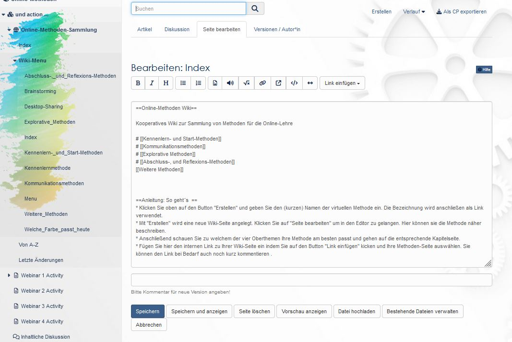

# Kursbaustein "Wiki" {: #wiki}

## Steckbrief

Name | Wiki
---------|----------
Icon | { class=size24  }
Verfügbar seit | 
Funktionsgruppe | Kommunikation und Kollaboration
Verwendungszweck | Gemeinsames Erstellen von Inhalten
Bewertbar | nein
Spezialität / Hinweis |

Verwenden Sie ein Wiki, um auf einfache Weise mit Kursteilnehmenden gemeinsam Inhalte zu erstellen. Ein Wiki kann für Gruppenarbeiten, als Dokumentationswerkzeug und generell für die kooperative Erstellung von Texten verwendet werden. Die einzelnen Seiten werden dabei in Form eines Hypertextes mit verlinkten Seiten umgesetzt.

## Im Kurseditor

Mit dem Kursbaustein "Wiki" binden Sie eine Lernressource Wiki in Ihren Kurs ein. 

Klicken Sie im Tab "**Wiki-Lerninhalt**" auf "Wiki wählen, erstellen oder importieren", ordnen ein bereits erstelltes Wiki zu oder erstellen ein neues. 

Wenn Sie schon eine Wiki Lernressource hinzugefügt haben, erscheint dessen Name. Um die Zuordnung eines Wikis nachträglich zu ändern, klicken Sie im Tab "Wiki-Lerninhalt" auf "Wiki auswechseln" und wählen anschliessend ein anderes Wiki oder erstellen Sie ein neues.

Im Tab "Wiki-Lerninhalt" können Sie auch die Berechtigungen für die Bearbeitung des Wikis definieren. So kann eingestellt werden, dass neben den Besitzern auch Betreuer und Teilnehmende Wiki-Artikel bearbeiten dürfen. Standardmässig haben alle Kursteilnehmer Lese- und Schreibrechte in einem Wiki. Einzelne Wiki-Seiten können nur von Besitzern der Lernressource gelöscht werden.


!!! warning "Achtung"

    Wenn Sie in Ihrer OpenOlat Instanz keinen Kursbaustein "Wiki" finden können, so wurde dies systemweit von einem Administrator ausgeschaltet.

## Arbeiten mit Wiki (geschlossener Kurseditor)

{ class="shadow lightbox" }

Wird ein Wiki in einem OpenOlat Kurs verwendet erscheint automatisch in der linken Kursnavigation das Wiki-Menü sowie weitere Wiki Links. Über den Link "Von A-Z" rufen Sie das Inhaltsverzeichnis mit der Anzeige aller Wiki-Seite auf. So sehen Sie auf einen Blick, welche Seiten bereits erstellt wurden.

Im Hauptbereich sehen Sie die jeweiligen Wiki Beiträge (Artikel), können die Wiki Seiten bearbeiten (Seite bearbeiten), zu den einzelnen Wiki Seiten Diskussionen führen und sich die Bearbeitungshistorie (Versionen/Autoren) ansehen. Sie können auch ein Wiki als Content Package (CP) exportieren und sich über Änderungen informieren lassen.  

### Neue Wiki-Seiten erstellen

Eine neue Wiki-Seite kann einfach über den Button "Erstellen" angelegt und anschliessend mit Inhalten befüllt werden. Zu beachten dabei ist jedoch, dass die so erstellte Seite zunächst noch keine Verbindung zu der gesamten Wiki-Struktur besitzt. Um eine Verbindung herzustellen, sollten entsprechende Verlinkungen im "Wiki-Menu" und/oder auf der "Index" Seite des Wikis angelegt werden.

Ein anderer Weg eine neue Wiki Seite zu erstellen ist, auf der Seite auf der die Verlinkung zur neuen Wiki Seite erscheinen soll, eine passende interne Verlinkung zu erstellen. Dafür können Sie entweder den entsprechenden Button des Wiki Editors verwenden oder die passende Syntax direkt eintragen. Die Wiki-Syntax für neue interne Verlinkungen sind zwei öffnende eckige Klammern + Seitennamen + zwei schliessende eckige Klammern. Also zum Beispiel: `[[Linkname]]`.

Die entsprechende Seite wird beim ersten Aufruf des Links dann automatisch angelegt.

{ class="shadow lightbox" }

### Inhalte einer Wiki-Seite ändern

Um Inhalte einer Wiki-Seite zu bearbeiten wählen Sie den Tab "Seite bearbeiten" der gewünschten Wiki Seite. Es erscheint der Wiki-Editor mit diversen Formatierungsmöglichkeiten. Hier können Sie auch Bilder, Medienlinks, mathematische Formeln, interne und externe Links in Ihr Wiki einbinden. Neben den Buttons im Editor existieren weitere Formatierungsmöglichkeiten, die Sie direkt im Text als Syntaxelemente einfügen können.

Im nachfolgenden wird die Wiki-Syntax genauer erklärt.

## Wiki Syntax

Ihre Eingaben können Sie mit der folgenden Wiki-Syntax formatieren.

!!! Warning "Achtung"

    Es empfiehlt sich, Sonderzeichen in Wikiwords zurückhaltend einzusetzen. Nicht erlaubt ist der Doppelpunkt (:). Beachten Sie auch, dass ein Leerzeichen am Anfang einer Zeile als ein Formatierungsbefehl interpretiert wird (Preformatted Text).

### Textgestaltung

Syntax | Ergebnis (Formatierung)  
---|---
'''Fetter Text ''' | **Fetter Text**  
''Kursiver Text'' | _Kursiver Text_  
==Level 2 Überschrift== | <h2>Level 2 Überschrift</h2>
* Liste | <li>Liste</li>  
# Nummerierte Liste | 1. Nummerierte Liste

### Links

Syntax | Ergebnis (Formatierung)  
---|---  
[[Interner link]] | Interner link
[[Link `|` Text]] | [Text](Course_Element_Wiki.de.md)
Externer Link [[http://www.openolat.org](http://www.openolat.org/) | [http://www.openolat.org](http://www.openolat.org/)
[[http://www.openolat.org](http://www.openolat.org/) Die Website von OpenOlat] | [Die Website von OpenOlat](http://www.openolat.org/)

Externe Adressen werden automatisch in einen Link umgewandelt, wenn Sie die volle Adresse angeben: [https://www.openolat.org](http://www.openolat.org/). Möchten Sie statt des Links einen anderen Begriff angeben, setzen Sie die URL und den Begriff gemeinsam in eckige Klammern, getrennt durch ein Leerzeichen.

### Tabellen

#### Einzeilig

=== "Syntax"

    ```markdown
    {|  
    |Zelle 1  
    |Zelle 2  
    |}| Zelle 1 Zelle 2  
    ```

=== "Ergebnis"

    Zelle 1 Zelle 2

#### Mehrzeilig

=== "Syntax"

    ```markdown
    {|  
    |Zelle 1  
    |Zelle 2  
    |-  
    |Zelle 3  
    |Zelle 4  
    |}|
    ```

=== "Ergebnis"

    Zelle 1 Zelle 2  
    Zelle 3 Zelle 4

#### Mit Rahmen

=== "Syntax"  

    ```markdown
    {| border="1"
    |Zelle 1
    |Zelle 2
    |-
    |Zelle 3
    |Zelle 4
    |}  
    ```

=== "Ergebnis"

    Zelle 1| Zelle 2 
    ---|---
    Zelle 3| Zelle 4

### Bilder und andere Dateien
  
Um z.B. Bilder ins Wiki einzufügen, müssen Sie diese zuerst in OpenOlat hochladen (via Button "_Datei hochladen_"). Sobald sich mindestens eine Datei im Wiki befindet, erscheint das Drop-Down Menu "_Datei einfügen_" , womit sich Bilder etc. bequem einfügen lassen.

=== "Syntax"

    [[Image:openolat_logo_72.png]]

=== "Ergebnis"

    

Beim Einfügen des Bildes bestehen folgende optionale Formatierungsmöglichkeiten:

#### Bildlegende

=== "Syntax"

    [[Image:openolat_logo_72.png | Das ist das OpenOlat-Logo.]]|

=== "Ergebnis"

      
    Das ist das OpenOlat-Logo.  
  
#### Ausrichtung

Mit dem Zusatz "left" oder "right" geben Sie an, wie das Bild ausgerichtet werden soll.

=== "Syntax"

    [[Image:openolat_logo_72.png|right]]

=== "Ergebnis"
  
    { align=right }

#### Bildgrösse

Geben Sie in Pixeln an, wie gross das Bild angezeigt werden soll.  

=== "Syntax"

    [[Image:openolat_logo_72.png|120px]]|

=== "Ergebnis"

    { width=120px }

#### Miniaturbild

Wenn Sie den Zusatz "thumb" und eine kleine Bildgrösse wählen, wird das Bild als Miniaturbild eingefügt. Mit Klick auf das Bild wird es in voller Grösse angezeigt.

=== "Syntax"

    [[Image:openolat_logo_72.png|thumb|24px]]

=== "Ergebnis"

    { class="lightbox" width=24px }

#### Kombinierte Formatierungen

Mehrere Formatierungsmöglichkeiten können auch gleichzeitig verwendet werden.

=== "Syntax"

    [[Image:olat_logo.png|center|150px|thumb|Das ist das OpenOlat-Logo.]]

=== "Ergebnis"

    { class="lightbox" width=150px title="Das ist das OpenOlat-Logo." }

### Andere Dateien: PDF

=== "Syntax"

    [[Media:any.pdf]]

=== "Ergebnis"

    [any.pdf](https://testing.frentix.com/test8/help/RepositoryEntry/82673665#pdf)  

### Mathematische Formeln (LaTeX)

Damit OpenOlat die Formeln schneller und schöner darstellt, können Sie jsMath-Schriften auf Ihrem Rechner installieren. Den Downloadbereich und eine Anleitung dazu finden Sie unter:  
[http://www.math.union.edu/~dpvc/jsMath/download/jsMath-fonts.html](http://www.math.union.edu/~dpvc/jsMath/download/jsMath-fonts.html)

Die Syntax der in OpenOlat verwendeten mathematischen Notation finden Sie unter: [http://meta.wikimedia.org/wiki/Help:Formula](http://meta.wikimedia.org/wiki/Help:Formula)  

#### Syntax

```html
<math>Formel hier eingeben</math>
```

#### Inline Modus

=== "Syntax"

    \\(x^2\\)

=== "Ergebnis"

    x<sup>2</sup>

### Unformatierter Text

=== "Syntax"

    ```html
    <nowiki>Hier den unformatierten Text eingeben</nowiki>
    ```

=== "Ergebnis"

    Hier den unformatierten Text eingeben  

!!! info "Hinweis"

    Weitere Informationen zur Wiki-Syntax des Media-Wikis finden Sie hier: https://www.mediawiki.org/wiki/Help:Formatting.

## Anhänge, Links auf Dateien, Export

Um eine Datei anzuhängen, laden Sie diese zuerst über "Datei hochladen" hoch. Navigieren Sie an die Stelle auf der Wiki-Seite, an der die Datei erscheinen soll. Anschliessend wählen Sie die Datei über "Datei einfügen" aus und bestätigen mit "Speichern". Links zu anderen Wiki-Seiten werden über die Schaltfläche "Link einfügen" erstellt. Weitere Formatierungsmöglichkeiten finden Sie eine Zeile darüber.

Links auf Dateien in Ordner-Kurselementen in OpenOlat erstellen Sie, indem Sie auf das Metadaten-Icon { class=size16 } klicken, und dann den **Externen Link zu dieser Ressource** kopieren. Bitte beachten Sie, dass nur auf Dateien verlinkt werden kann, die sich innerhalb eines Unterordners in einem Ordner-Kurselement befinden.

Das Wiki kann über den entsprechenden Link von allen Beteiligten als IMS-Content-Packaging exportiert und gespeichert werden. Autoren können ein exportiertes CP auch in OpenOlat wieder importieren.

!!! info "Hinweis"

    Soll ein Wiki direkt als Wiki exportiert werden, ist dies nur vom Besitzer des Wikis direkt in der Lernressource über die Menüs "Kopieren" bzw. "Inhalt exportieren" möglich. Kursteilnehmer haben diese Option nicht.

!!! Warning "Achtung"
  
    Beim Löschen von Seiten werden auch alle Versionen mitgelöscht. Sie können also keine gelöschten Seiten wiederherstellen.
