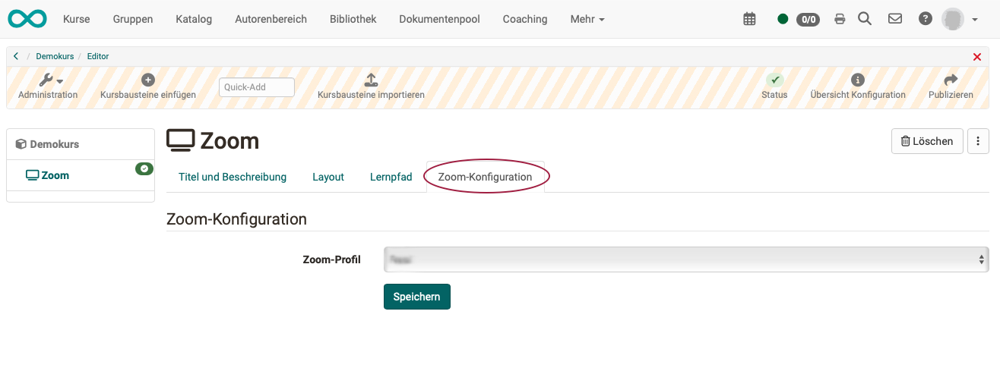

# Kursbaustein "Zoom"

## Steckbrief

Name | Zoom
---------|----------
Icon | { class=size24  }
Verfügbar seit | 
Funktionsgruppe | Kommunikation und Kollaboration
Verwendungszweck | Integration der Webkonferenz-Software Zoom
Bewertbar | nein
Spezialität / Hinweis | Zoom ist eine kommerzielle Software. Um den Kursbaustein zu nutzen ist eine separate Lizenz und ein Serverhosting erforderlich. Eine eingeschränkte Nutzung ist für registrierte Nutzer kostenlos.

## Voraussetzungen

Um den Kursbaustein "Zoom" für Webkonferenzen verwenden zu können,

* müssen Sie eine Zoom Education- oder Enterprise-Lizenz benutzen können.
* muss Zoom von Ihrem/Ihrer Administrator:in konfiguriert worden sein.

Informationen des Herstellers finden Sie auf der [Zoom-Homepage](https://zoom.us).

## Kursbaustein konfigurieren

Als Autor:in fügen Sie im Kurseditor einfach einen Kursbaustein "Zoom" ein und wählen im Tab "Zoom-Konfiguration" lediglich das vordefinierte Profil.

{ class="shadow lightbox" }

Die anderen Tabs konfigurieren Sie, wie Sie es von anderen Kursbausteinen gewohnt sind.

## Zoom Konfiguration durch Administrator:innen

Die Einbindung von Zoom in OpenOlat via LTI ist im [OpenOlat-Administrationshandbuch](https://docs.openolat.org/de/manual_admin/administration/Zoom/) beschrieben.

!!! note "Hinweis"

    Neben der Verwendung von Zoom in einem Kursbaustein, können Sie mit der Zoom-Integration Zoom-Profile verwalten und Zoom-Meetings in OpenOlat als Kurselemente, Kurswerkzeuge und Gruppenwerkzeuge verwenden.