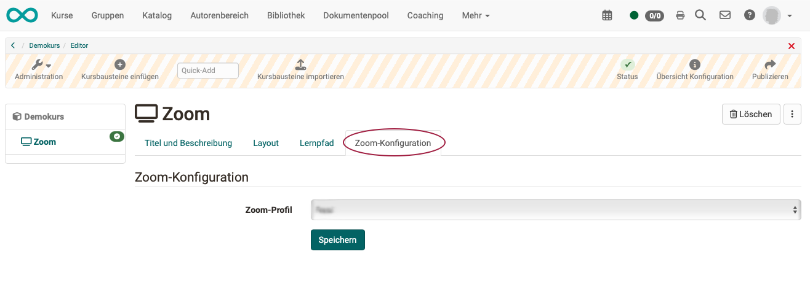

# Course Element "Zoom"

## Profile

Name | Zoom
---------|----------
Icon | { class=size24  }
Available since | 
Functional group | Communication und collaboration
Purpose | Integration of the Zoom web conferencing software 
Assessable | no
Specialty / Note | Zoom is commercial software. To use the course element, a separate license and server hosting is required. Limited use is free for registered users.

## Requirements

In order to use the course element "Zoom" for web conferencing,

* you must be able to use a Zoom Education or Enterprise license.
* Zoom must have been configured by your administrator.

Information from the manufacturer can be found on the [Zoom homepage](https://zoom.us).

## Configure course element

As author you simply add a course element "Zoom" in the course editor and select only the predefined profile in the tab "Zoom configuration".

{ class="shadow lightbox" }

You configure the other tabs as you are used to from other course elements.

## Zoom configuration by administrator

The integration of Zoom into OpenOlat via LTI is described in the [OpenOlat Administration Manual](https://docs.openolat.org/en/manual_admin/administration/Zoom/).

!!! note "Note"

    In addition to using Zoom in a course element, Zoom integration allows you to manage Zoom profiles and use Zoom meetings in OpenOlat as course elements, course tools and group tools.