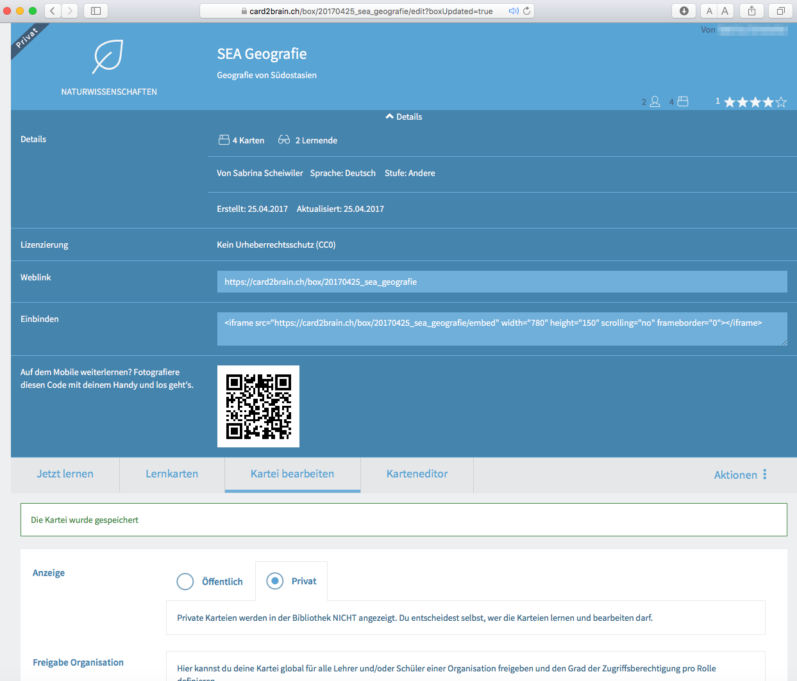
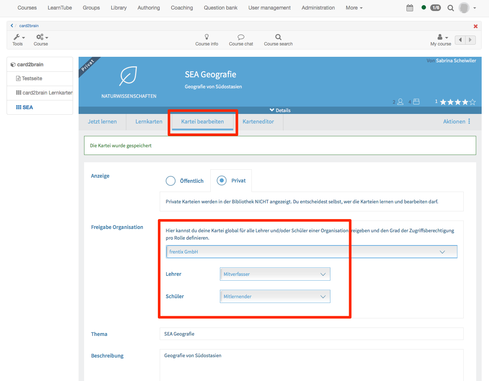

# Kursbaustein "card2brain Lernkarten" {: #card2brain}

## Steckbrief

Name | card2brain
---------|----------
Icon | { class=size24  }
Verfügbar seit | Release 11.5 (OO-2699)
Funktionsgruppe | Wissensvermittlung
Verwendungszweck | Lernen mit Online-Lernkarten
Bewertbar | nein
Spezialität / Hinweis |

!!! tip "Tipp"

    Um diesen Kursbaustein zu nutzen, müssen Sie zwingend ein Enterprise-Account von card2brain besitzen. Kunden von frentix wenden sich dafür bitte an [card2brain@frentix.com](mailto:card2brain@frentix.com), Nichtkunden kontaktieren direkt [card2brain](http://card2brain.ch/info/contact).

Der Kursbaustein card2brain ermöglicht das Lernen mit Lernkarten.

Sobald die Voreinstellungen vorgenommen worden sind, kann dieser Kursbaustein wie alle anderen Kursbausteine im OpenOlat hinzugefügt werden. Nachdem Titel und Beschreibung und je nach Bedarf Sichtbarkeit und Zugang angepasst wurden, muss im Tab Lernkartei der Alias der Lernkartei hinzugefügt werden.

Um diesen Alias hinzufügen zu können, muss zuerst eine Lernkartei auf [www.card2brain.ch](http://www.card2brain.ch) erstellt werden. Die Lernkarteien können nicht direkt im OpenOlat erstellt werden. Die Lernkartei wird ins OpenOlat verknüpft. Wenn dann eine Lernkartei erstellt ist, kann der Alias in den Details geholt werden. Der Alias ist das letzte Element des Weblinks, z.B. 20170425_sea_geografie. Kopieren Sie den Alias und fügen Sie ihn im OpenOlat ein. Anschliessend wird der Baustein gespeichert.

{ class="shadow lightbox" }

Damit alle Teilnehmenden mit dem Kursbaustein arbeiten können, ist folgende Einstellung in der Lernkartei relevant:

{ class="shadow lightbox" }

Diese Einstellung können Sie im OpenOlat vornehmen. Nachdem Sie den Kurs publiziert haben, klicken Sie auf den Kursbaustein card2brain. Klicken Sie anschliessend auf Kartei bearbeiten. Unter Freigabe Organisation ist bereits Ihre Organisation ausgewählt. Diese wird bei der Erstellung der Lernkartei in [www.card2brain.ch](http://www.card2brain.ch) hinterlegt. Für Betreuende wählen Sie Mitverfasser und für Teilnehmende Mitlernender. Somit können alle Betreuenden dieses Kurses die Lernkarten bearbeiten. Alle Teilnehmenden können mit den Lernkarten lernen.

!!! info "Wichtig"

    Die Lernkarten sind ausschliesslich zum Lernen gedacht und nicht als Prüfung. Es werden im OpenOlat keine Punkte gespeichert und der Kursbaustein card2brain kann nicht bewertet werden.

## Weiterführende Informationen {: #further_information}

[card2brain >](http://card2brain.ch/info/contact) 
[www.card2brain.ch >](http://www.card2brain.ch)

[Zum Seitenanfang ^](#card2brain)
