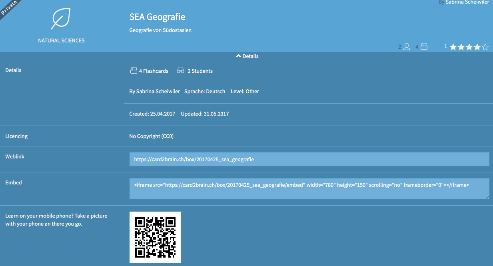
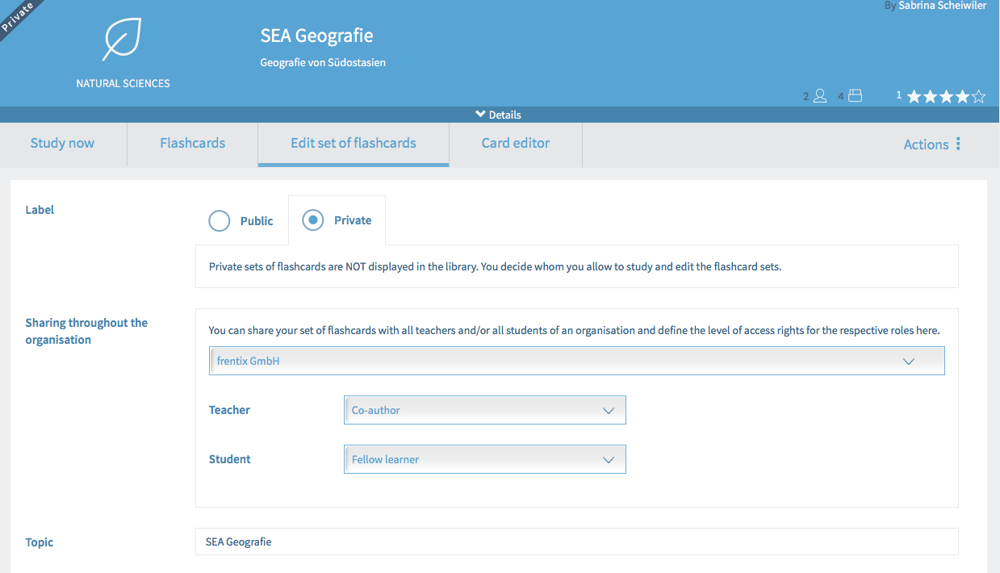

# Course Element "card2brain flashcards" {: #card2brain}

## Profile

Name | card2brain
---------|----------
Icon | { class=size24 }
Available since | Release 11.5 (OO-2699)
Functional group | Knowledge transfer
Purpose | Learning with online flashcards
Assessable | no
Specialty / Note | 

!!! tip "Tip"

    To use this course element an enterprise login of card2brain is compulsory. Clients of frentix please contact [card2brain@frentix.com](mailto:card2brain@frentix.com). Non-clients please contact [card2brain](http://card2brain.ch/info/contact) directly.

The course element card2brain allows learning with flashcards.

As soon as the pre-settings are done, the course element can be added as all other course elements are added in OpenOlat. After title and description and as required the visibility and the access have been adapted, the "Alias of flashcards" need to be added in the tab Set of flashcards.

To add this alias, a set of flashcards need to be created at [www.card2brain.ch](http://www.card2brain.ch) first. The flashcards cannot be created in OpenOlat directly. The flashcard is connected into OpenOlat. As soon as a set of flashcards is created, the alias can be taken from the details. The alias is the last part of the weblink, e.g. 20170425_sea_geografie. Copy the alias and add it to OpenOlat. Afterward the course element is saved.

{ class="shadow lightbox" }

To make sure that all participants are able to work with the course element, the following setting of the flashcard is relevant:

{ class="shadow lightbox" }

This setting can be done in OpenOlat. After publishing the course, click on the course element card2brain. Click then on Edit set of flashcards. In Share Organization the organization is already chosen. It is added during the creation of the set of flashcards in [www.card2brain.ch](http://www.card2brain.ch). For coaches you choose Co-author and for participants Fellow learner. Thus all coaches of this course can edit the flashcards. All participants can learn with the flashcards.

!!! info "Important"

    The flashcards are only for a learning purpose and not for a test. In OpenOlat no score is saved and the course element card2brain is not assessable.

## Further information {: #further_information}

[card2brain >](http://card2brain.ch/info/contact) 
[www.card2brain.ch >](http://www.card2brain.ch)

[To the top of the page ^](#card2brain)

