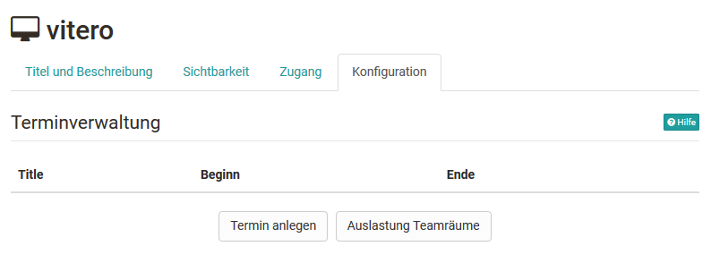
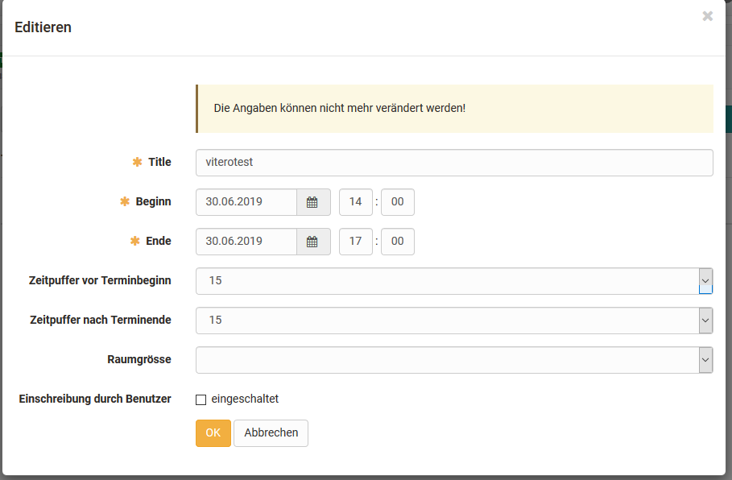

# Kursbaustein "vitero" {: #vitero}

## Steckbrief

Name | vitero
---------|----------
Icon | :o_icon_o_vitero_icon:
Verfügbar seit | 
Funktionsgruppe | Kommunikation und Kollaboration
Verwendungszweck | Integration der Webkonferenz-Software vitero
Bewertbar | nein
Spezialität / Hinweis | Kommerzielle Software, Lizenz und Serverhosting erforderlich

## Tool Spezifisches

Mit dem Kursbaustein "vitero" können Sie das vitero System für Web Conferencing, E-Collaboration, Live-E-Learning und Language Learning in ihren Kurs einbinden. vitero (virtual team room) ermöglicht Ihnen, Termine für bis zu 12 Teilnehmer plus Moderator zu erstellen.

Der virtuelle Sitzungsraum gestattet den Teilnehmern die Kommunikation über Textchat, Audio und Video sowie Dokument- und Desktopsharing. Das vitero System kann für virtuelle Teamsitzungen, aber auch z.B. für Frontalvorlesungen verwendet werden. Es unterstützt ein Rollenmodell mit den drei temporären Rollen Moderator, Co-Moderator und Teilnehmer, und spiegelt darin die OpenOlat-Rollen Kursadministrator, Betreuer und Teilnehmer wider.  

!!! note "Link zu weiteren Infos"

    Mehr zu den Funktionen des vitero Systems erfahren Sie auf der Homepage der vitero GmbH: 
    [http://www.vitero.de](http://www.vitero.de/)  

## Konfiguration im Kurseditor

{ class="shadow lightbox" }

Im Kurseditor oder in der publizierten Ansicht können Sie Ihre vitero Termine erfassen. Wählen Sie dazu die Schaltfläche "**Termin anlegen**". Zuvor können Sie mit der Schaltfläche "**Auslastung Teamräume**" die aktuelle Auslastung der verfügbaren Teamräume ansehen um einen freien Termin zu finden.

## Konfiguration im Kursrun (geschlossener Editor)

{ class="shadow lightbox" }

Geben Sie nun das Start- und das Enddatum des Termins ein und wählen Sie die Grösse des Raums. Mit "**Zeitpuffer vor Terminbeginn**" können sie festlegen wie viele Minuten vor dem Startdatum der Raum betreten werden kann. Mit "**Zeitpuffer nach Terminende**" legen Sie fest, wie viele Minuten nach Terminende der Termin definitiv geschlossen wird.

Mit der Option "**Einschreibung durch Benutzer**" ermöglichen Sie es allen Teilnehmenden, welche Zugriff auf den Kursbaustein haben, sich selbständig in diesen Termin einzutragen. Dies ist so lange möglich wie es noch freie Plätze hat. Ist diese Option ausgeschaltet, können nur Kursbesitzer Teilnehmende in die Termine eintragen.

!!! info "Wichtig"

    Für Teilnehmende sind Termine nur dann sichtbar, wenn sie in diesem Termin eingetragen sind, oder der Termin zur freien Einschreibung konfiguriert wurde.

!!! warning "Achtung"

    Ist ein Termin angelegt, kann er nach Speichern des Formulars nicht mehr verändert werden.

## Weiterführende Informationen {: #further_information}

**Auf dieser Seite erwähnt** 
[vitero GmbH](http://www.vitero.de/)

[Zum Seitenanfang ^](#vitero)

