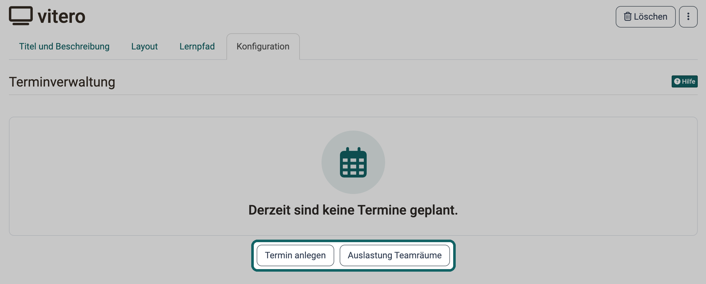
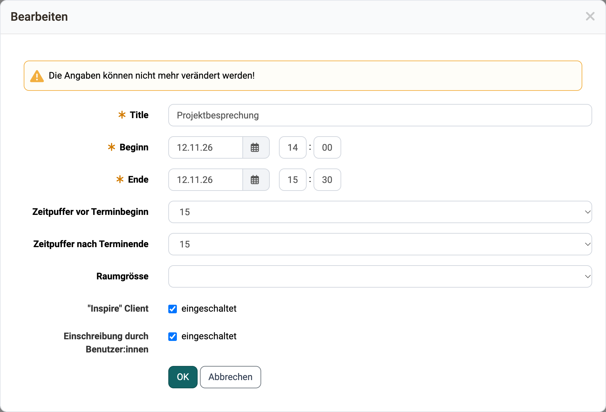

# Kursbaustein "vitero" {: #vitero}

## Steckbrief

Name | vitero
---------|----------
Icon | :o_icon_o_vitero_icon:
Verfügbar seit | Release 8.0 (2012)
Funktionsgruppe | Kommunikation und Kollaboration
Verwendungszweck | Integration der Webkonferenz-Software vitero
Bewertbar | nein
Spezialität / Hinweis | Kommerzielle Software, Lizenz und Serverhosting erforderlich

## Tool Spezifisches

Mit dem Kursbaustein "vitero" binden Sie das vitero System für Web Conferencing, E-Collaboration, Live-E-Learning und Language Learning in Ihren Kurs ein. vitero (virtual team room) stellt virtuelle Teamräume bereit, für die Sie im Kurs Termine anlegen. Welche Raumgrössen zur Wahl stehen, bestimmt die Lizenz des angebundenen vitero Servers.

Im virtuellen Sitzungsraum kommunizieren die Teilnehmenden über Textchat, Audio und Video und teilen Dokumente und den Desktop. Das vitero System eignet sich für virtuelle Teamsitzungen, aber auch zum Beispiel für Frontalvorlesungen. Besitzer:innen und Betreuer:innen des Kurses, die Sie in einen Termin eintragen, erhalten in vitero die Rolle "Gruppenleiter:in".

!!! note "Link zu weiteren Infos"

    Mehr zu den Funktionen des vitero Systems erfahren Sie auf der Homepage der vitero GmbH: 
    [http://www.vitero.de](http://www.vitero.de/)

## Konfiguration im Kurseditor

{ class="shadow lightbox" title="Tab Konfiguration im Kurseditor · 2026.11.03" }

Ihre vitero Termine legen Sie im Kurseditor im Tab "Konfiguration" oder in der Kursansicht an. Mit "Auslastung Teamräume" sehen Sie zuerst, wie stark die verfügbaren Teamräume belegt sind, und finden so einen freien Termin. Klicken Sie dann auf "Termin anlegen".

## Termin anlegen {: #konfiguration-im-kursrun-geschlossener-editor}

{ class="shadow lightbox" title="Dialog Bearbeiten im Kursbaustein vitero · 2026.11.03" }

Tragen Sie unter "Title" den Namen des Termins ein. Geben Sie unter "Beginn" und "Ende" das Start- und Enddatum des Termins ein und wählen Sie die "Raumgrösse". Unter "Zeitpuffer vor Terminbeginn" legen Sie fest, wie viele Minuten vor Beginn sich der Raum betreten lässt. Unter "Zeitpuffer nach Terminende" legen Sie fest, wie viele Minuten nach dem Ende vitero den Termin endgültig schliesst.

Mit der Option "Inspire" Client legen Sie fest, dass der Termin im vitero Client "Inspire" stattfindet. Die Option erscheint nur, wenn sie in der System-Administration unter `Administration > Externe Werkzeuge > vitero` eingeschaltet ist.

Mit der Option "Einschreibung durch Benutzer:innen" tragen sich alle Teilnehmenden mit Zugriff auf den Kursbaustein selbst in den Termin ein, solange freie Plätze vorhanden sind. Ist die Option ausgeschaltet, tragen nur Besitzer:innen des Kurses Teilnehmende in die Termine ein.

!!! info "Wichtig"

    Für Teilnehmende sind Termine nur dann sichtbar, wenn sie in diesem Termin eingetragen sind oder der Termin die Option "Einschreibung durch Benutzer:innen" trägt.

!!! warning "Achtung"

    Prüfen Sie die Angaben vor dem Speichern. Wie der Hinweis "Die Angaben können nicht mehr verändert werden!" im Dialog sagt, lassen sie sich danach nicht mehr ändern. Nur die Option "Einschreibung durch Benutzer:innen" schalten Sie auch später noch ein oder aus.

## Weiterführende Informationen {: #further_information}

[vitero GmbH](http://www.vitero.de/) 
[Kursbausteine >](Course_Elements.de.md) 
[Kursbaustein "BigBlueButton" >](bigbluebutton/index.de.md)

[Zum Seitenanfang ^](#vitero)

