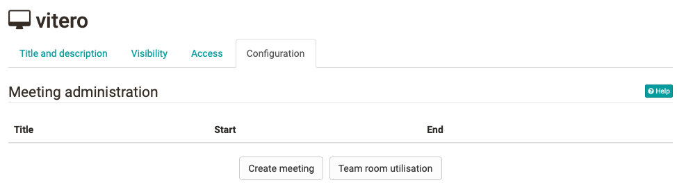
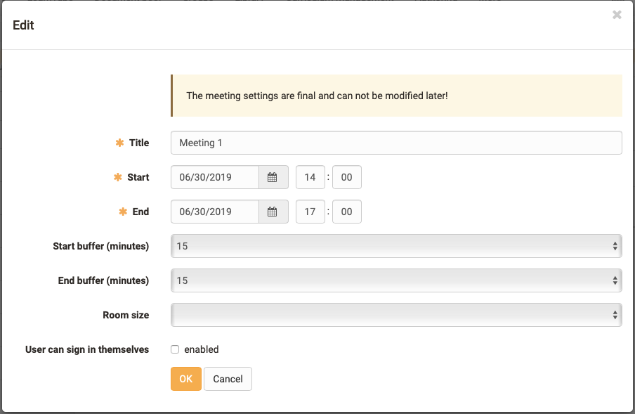

# Course Element "vitero" {: #vitero}

## Profile

Name | vitero
---------|----------
Icon | :o_icon_o_vitero_icon:
Available since | 
Functional group | Communication and collaboration
Purpose | Integration of the vitero web conferencing software
Assessable | no
Specialty / Note | Commercial software, licence and server hosting required

## Tool-specific

With the course element "vitero" you can integrate the vitero system for web conferencing, e-collaboration, live e-learning and language learning into your course. vitero (virtual team room) enables you to create appointments for up to 12 participants plus moderator.

The virtual meeting room allows participants to communicate via text chat, audio and video as well as document and desktop sharing. The vitero system can be used for virtual team sessions as well as for frontal lectures. It supports a role model with the three temporary roles moderator, co-moderator and participant, and reflects the OpenOlat roles course administrator, coach and participant.

!!! note "Link to further information"

    You can find out more about the functions of the vitero system on the homepage of vitero GmbH: 
    [http://www.vitero.de](http://www.vitero.de/)

## Configuration in the course editor

{ class="shadow lightbox" }

You can enter your vitero dates in the course editor or in the published view. Select the button "**Create meeting**". Before you do this, you can use the "**Team room utilization**" button to view the current utilization of the available team rooms in order to find a free appointment.

## Configuration in the course run (closed editor)

{ class="shadow lightbox" }

Now enter the start and end date of the appointment and select the size of the room. With "**Start buffer**" you can define how many minutes before the start date the room can be entered. With "**End buffer**" you define how many minutes after end of appointment the meeting will be closed definitively.

With the option "**User can sign in themselves**" you enable all participants who have access to the course element to enter themselves in this appointment independently. This is possible as long as there are still places available. If this option is switched off, only course owners can enter participants in the meetings.

!!! info "Important"

    For participants, meetings are only visible if they are entered in this appointment, or if the appointment has been configured for free registration.

!!! warning "Attention"

    If a meeting has been created, it cannot be changed after saving the form.

## Further information {: #further_information}

**Mentioned on this page** 
[vitero GmbH](http://www.vitero.de/)

[To the top of the page ^](#vitero)

