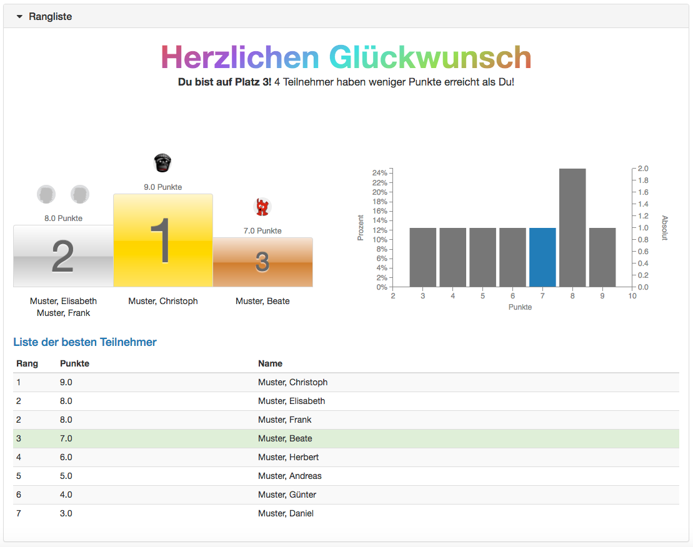

# Kursbausteine

:octicons-device-camera-video-24: **Video-Einführung**: [Was sind Kursbausteine?](<https://www.youtube.com/embed/JM6iSrfkHog>){:target="_blank”}

:octicons-device-camera-video-24: **Video-Einführung**: [Kursbausteine konfigurieren](<https://www.youtube.com/embed/SAkzzoOQEoQ>){:target="_blank”}

In OpenOlat stehen verschiedene Kursbausteine zur Verfügung, mit denen ein Kurs sehr flexibel und modular nach den gewünschten Bedürfnissen aufgebaut werden kann. So können Kursinhalte strukturiert und Inhalte bereitgestellt, kollaboratives Arbeiten und Austausch gefördert, der Wissenstand der Teilnehmenden geprüft sowie organisatorische Belange abgedeckt werden.

## Kursbausteine im Überblick

### Wissensvermittlung

Die folgenden Kursbausteine dienen insbesondere der Bereitstellung und Strukturierung von Kursinhalten. Je nach Baustein können auch bestimmte, extern erstellte Inhalte eingebunden werden.

<!--    [{ class=size16 } HTML-Seite](Course_Element_Single_Page.de.md)-->

* [:o_icon_o_st_icon: Struktur](Course_Element_Structure.de.md)
* [:o_icon_o_page_icon: Seite](Course_Element_Page.de.md)
* [:o_icon_o_sp_icon: HTML-Seite](Course_Element_HTML_Page.de.md)
* [:o_icon_o_tu_icon: Externe Seite](Course_Element_External_Page.de.md)
* [:o_icon_o_cp_icon: CP-Lerninhalt](Course_Element_CP_Learning_Content.de.md)
* [:o_icon_o_scorm_icon: SCORM 1.2](Course_Element_SCORM_Learning_Content.de.md)
* [:o_icon_o_filetype_file: Dokument](Course_Element_Document.de.md)
* [:o_icon_o_bc_icon: Ordner](Course_Element_Folder.de.md)
* [:o_icon_o_podcast_icon: Podcast](Course_Element_Podcast.de.md)
* [:o_icon_o_blog_icon: Blog](Course_Element_Blog.de.md)
* [:o_icon_o_icon_video: Video](Course_Element_Video.de.md)
* [:o_icon_o_livestream_icon: Video Livestream](Course_Element_Video_Livestream.de.md)
* [:octicons-arrow-right-24: Opencast](Course_Element_Opencast.de.md)
* [:octicons-arrow-right-24: edu-sharing](Course_Element_edu_Sharing.de.md)
* [:octicons-arrow-right-24: card2brain](Course_Element_card2brain_Flashcards.de.md)
* [:octicons-arrow-right-24: MediaSite](Course_Element_Mediasite.de.md)
* [:octicons-arrow-right-24: Edubase](Course_Element_Edubase.de.md)
* [:simple-jupyter: JupyterHub](Course_Element_JupyterHub.de.md)

### Wissensüberprüfung

Folgende Kursbausteine können insbesondere zur Wissensüberprüfung eingesetzt werden.

* [:o_icon_o_ms_icon: Bewertung](Course_Element_Assessment.de.md)
* [:o_icon_o_gta_icon: Aufgabe](Course_Element_Task.de.md)
* [:o_icon_o_gta_icon: Gruppenaufgabe](Course_Element_Grouptask.de.md)
* [:o_icon_o_ep_icon: Portfolioaufgabe](Course_Element_Portfolio_Task.de.md)
* [:o_icon_o_iqtest_icon: Test](Course_Element_Test.de.md)
* [:o_icon_o_iqself_icon: Selbsttest](Course_Element_Self_Test.de.md)
* [:o_icon_o_practice_icon: Übung](Course_Element_Practice.de.md)
* [:octicons-arrow-right-24: Video-Aufgabe](Course_Element_Video_Task.de.md)
* [:material-clipboard-file-outline: Formular](Course_Element_Form.de.md)
* [:o_icon_o_survey_icon: Umfrage](Course_Element_Survey.de.md)
* [:o_icon_o_cl_icon: Checkliste](Course_Element_Checklist.de.md)

Die meisten Kursbausteine der Kategorie Wissensüberprüfung sind bewertbar und es können bei Bedarf Punkte vergeben werden. Dann können weitere Features wie die Addition von Punkten oder die Berechnung von Bestanden / Nicht bestanden für den Kurs, basierend auf den Bewertungen verschiedener Kursbausteine, hinzugefügt werden. Die Berechnung bei herkömmlichen Kursen erfolgt über den Kursbaustein [Struktur](Course_Element_Structure.de.md) bzw. am obersten Kursknoten.

Das Konfigurationstab "Erinnerungen" steht für alle bewertbaren Bausteine der Wissensüberprüfung zur Verfügung. Hier können in Abhängigkeit vom Bearbeitungsstatus des jeweiligen Kursbausteins E-Mails verschickt werden, z.B. wenn zu einem bestimmten Datum eine Aufgabe oder ein Test noch nicht bearbeitet wurde. Die Möglichkeiten sind ähnlich wie im Menü ["Erinnerung"](../learningresources/Course_Reminders.de.md) in der Kurs-Administration.

Unter der Kategorie Wissensüberprüfung sind ausserdem die Kursbausteine "Umfrage" und "Formular" zugeordnet. Diese ermöglichen die Einbindung von OpenOlat Formularen in den Kurs, um diese für Unterrichtsevaluationen, allgemeine Befragungen, strukturierte Abfragen bestimmter Informationen der Teilnehmenden usw. zu nutzen.

#### Highscore {: #highscore}

Alle bewertbaren Kursbausteine, mit Ausnahme von "Übung" und "Struktur", erhalten zusätzlich das Konfigurationstab "Highscore", wenn am Baustein Punkte vergeben werden. Die Highscore-Darstellung ermöglicht einen spielerischen Vergleich der Teilnehmenden und kann als Motivationsfaktor verstanden werden.

Zuerst muss "Highscore anzeigen" aktiviert werden. Optional kann ein Anfangsdatum hinzugefügt werden, ab welchem der Highscore angezeigt wird. Ohne Angabe des Datums wird der Highscore direkt nach Beenden des Tests angezeigt.

Es kann definiert werden, ob die Benutzerdaten anonymisiert oder mit Vor- und Nachnamen dargestellt werden und welche Elemente des Highscores angezeigt werden sollen. Zur Auswahl stehen die Positionsanzeige, das Siegertreppchen, das Histogramm und die Liste der besten Teilnehmer. Für die Liste kann zudem definiert werden, ob alle Benutzer oder nur eine gewisse Anzahl der besten Benutzer erscheinen sollen. Es muss mindestens eine dieser Optionen ausgewählt werden.

### Kommunikation und Kollaboration

Kursbausteine dieser Kategorie werden vor allem für kollaboratives Arbeiten und den Austausch untereinander eingesetzt. Hier sind auch die Bausteine für virtuelle Klassenräume und Online-Meetings zugeordnet.

* [:o_icon_o_wiki_icon: Wiki](Course_Element_Wiki.de.md)
* [:o_icon_o_fo_icon: Forum](Course_Element_Forum.de.md)
* [:material-file-multiple-outline: Dateidiskussion](Course_Element_File_Dialog.de.md)
* [:o_icon_o_pf_icon: Teilnehmer Ordner](Course_Element_Participant_Folder.de.md)
* [:o_icon_o_cmembers_icon: Teilnehmerliste](Course_Element_Participant_List.de.md)
* [:o_icon_o_vitero_icon: Vitero](Course_Element_vitero.de.md)
* [:o_icon_o_openmeetings_icon: OpenMeetings](Course_Element_OpenMeetings.de.md)
* [:o_icon_o_vc_icon: Adobe Connect](Course_Element_Adobe_Connect.de.md)
* [:o_icon_o_gotomeeting_icon: GoToMeeting](Course_Element_GoToMeeting.de.md)
* [:o_icon_o_vc_icon: BigBlueButton](Course_Element_BigBlueButton.de.md)
* [:o_icon_o_vc_icon: Microsoft Teams](Course_Element_Microsoft_Teams.de.md)
* [:o_icon_o_vc_icon: Zoom](Course_Element_Zoom.de.md)

#### Virtuelle Räume

Mit den Kursbausteinen 
[Adobe Connect](Course_Element_Adobe_Connect.de.md), [BigBlueButton](Course_Element_BigBlueButton.de.md), [GoToMeeting](Course_Element_GoToMeeting.de.md), [Microsoft Teams](Course_Element_Microsoft_Teams.de.md), [OpenMeetings](Course_Element_OpenMeetings.de.md), [Vitero](Course_Element_vitero.de.md) und [Zoom](Course_Element_Zoom.de.md) können in OpenOlat unterschiedliche [Virtuelle Klassenzimmer](../basic_concepts/Virtual_classrooms.de.md) für synchrone Meetings, Video-Konferenzen oder Webinare eingesetzt werden.

Welche Kursbausteine für diese Zwecke verfügbar sind und welche Funktionalitäten jeweils zur Verfügung stehen, hängt von der Konfiguration ihres OpenOlat-Systems ab.

Ein virtueller Raum ermöglicht es, gleichzeitig (synchron) online mit mehreren Personen zusammen zu arbeiten, die geographisch an unterschiedlichen Orten sind. Funktionen von virtuellen Räumen sind unter anderem Live Chat, Audio und Video, Desktop- und Dokumentsharing. Wird ein virtueller Raum mittels eines Kursbausteins betreten, öffnet sich ein neues Browserfenster, in dem die virtuelle Sitzung stattfindet.

Damit Sie alle Funktionalitäten benutzen können, benötigen Sie ein Headset und eine angeschlossene Kamera. Unter Umständen muss, abhängig vom eingesetzten System, noch weitere Software temporär heruntergeladen werden.

### Verwaltung und Organisation

Für organisatorische Belange und zur Verteilung von Informationen eignen sich besonders die nachfolgenden Kursbaussteine.

* [:o_icon_o_en_icon: Einschreibung](Course_Element_Enrolment.de.md)
* [:o_icon_o_infomsg_icon: Mitteilungen](Course_Element_Notifications.de.md)
* [:o_icon_o_co_icon: E-Mail](Course_Element_EMail.de.md)
* [:o_icon_o_icon_topicbroker: Themenbörse](Course_Element_Topic_Broker.de.md)
* [:o_icon_o_cal_icon: Kalender](Course_Element_Calendar.de.md)
* [:o_icon_o_appointment_icon: Terminplanung](Course_Element_Appointment_Scheduling.de.md)

### Andere

Zusätzliche Bausteine finden Sie in der Kategorie "Andere".

* [:o_icon_o_lti_icon: LTI-Seite](Course_Element_LTI_Page.de.md)
* [:o_icon_o_projectbroker_icon: Themenvergabe](Course_Element_Topic_Assignment.de.md)
* [:octicons-link-24: Linkliste](Course_Element_Link_List.de.md)
* [:o_icon_o_icon_cns: Auswahl](Course_Element_Selection.de.md)

## Allgemeines zu Kursbausteinen

Alle Kursbausteine verfügen über die Tabs "**Titel und Beschreibung**" sowie "**Layout**". Darüber hinaus gibt es noch bestimmte Tabs die je nach technischem Kurstyp durchgängig vorhanden sind. Der Tab "Lernpfad" existiert nur bei Lernpfad Kursen. Die Tabs "Sichtbarkeit" und "Zugang" existieren nur bei den herkömmlichen Kursen.

Neben den Kursbausteinen gibt es in OpenOlat Kursen noch weitere Tools und Lernressourcen, die zur Ausgestaltung von Kursen verwendet werden können. Hinweise darauf finden Sie in den jeweiligen Kapiteln.

## Leistungsbewertung

Eine Reihe an Kursbausteinen kann entweder zur summativen bzw. formativen Bewertung genutzt werden, oder dient der Fortschrittskontrolle. Die bewertbaren Kursbausteine können im
[Bewertungswerkzeug](../learningresources/Assessment_tool_overview.de.md) eingesehen und bearbeitet werden. Weitere Informationen zu diesen Bausteinen finden Sie u.a. im Kapitel [Wissensüberprüfung](../learningresources/Assessment.de.md):

* [Aufgabe](../learningresources/Course_Element_Assessment.de.md) (manuelle Bewertung)
* [Gruppenaufgabe](../learningresources/Assessment.de.md) (manuelle Bewertung)
* [Portfolioaufgabe](../learningresources/Assessment.de.md) (manuelle Bewertung)
* [Checkliste](../learningresources/Assessment.de.md)  (manuelle & automatische Bewertung)
* [Bewertung](../learningresources/Assessment.de.md)  (manuelle Bewertung)
* [LTI](../learningresources/Other.de.md) (automatische Bewertung, wird von LTI-Seite übertragen)
* [SCORM](../learningresources/Knowledge_Transfer.de.md)  (automatische Bewertung, wird durch SCORM-Modul übertragen)
* [Test](../learningresources/Assessment.de.md)  (automatische & manuelle Bewertung)
