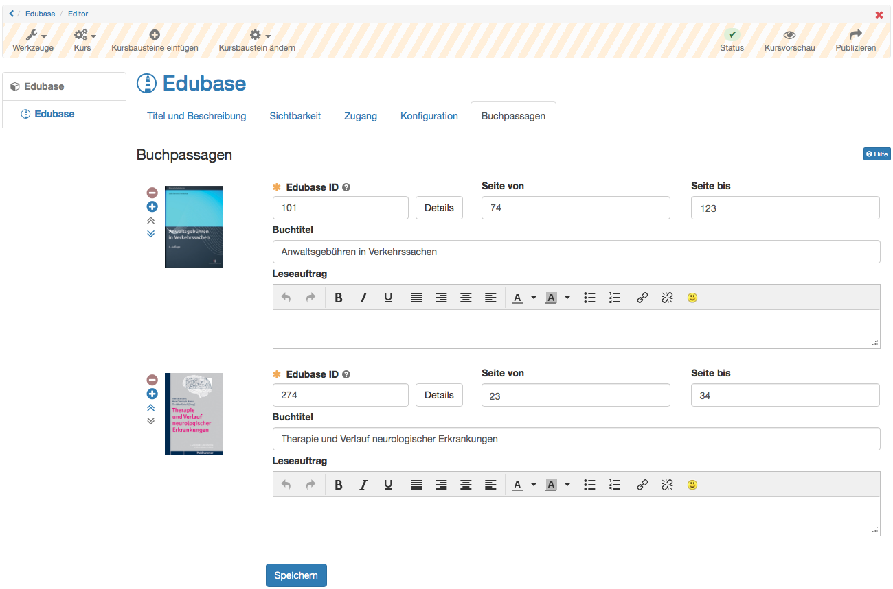

# Kursbausteine

:octicons-device-camera-video-24: **Video-Einführung**: [Was sind Kursbausteine?](<https://www.youtube.com/embed/JM6iSrfkHog>){:target="_blank”}

:octicons-device-camera-video-24: **Video-Einführung**: [Kursbausteine konfigurieren](<https://www.youtube.com/embed/SAkzzoOQEoQ>){:target="_blank”}

In diesem Kapitel erfahren Kursautoren im Detail, welche Kursbausteine im Kurseditor eines Kurses zur Verfügung stehen und wie sie konfiguriert werden.

!!! info "Info"

    Alle Kursbausteine verfügen über die Tabs "**Titel und Beschreibung**" sowie "**Layout**". Darüber hinaus gibt es noch bestimmte Tabs die je nach technischem Kurstyp durchgängig vorhanden sind. Der Tab "Lernpfad" existiert nur bei Lernpfad Kursen. Die Tabs "Sichtbarkeit" und "Zugang" existieren nur bei den herkömmlichen Kursen.

## Kursbausteine im Überblick

!!! info "Info"

    Neben den Kursbausteinen gibt es in OpenOlat Kursen noch weitere Tools und Lernressourcen, die zur Ausgestaltung von Kursen verwendet werden können. Hinweise darauf finden Sie in den jeweiligen Kapiteln.

## Arbeiten mit Kursbausteinen

Im Folgenden finden Sie eine Liste mit den wichtigsten Kursbausteinen, aus
denen Ihr Kurs aufgebaut sein kann. Wahrscheinlich werden in Ihrem Kurs nicht alle Bausteine verwendet, da es zur didaktischen Erstellung von Lernumgebungen und Kursen gehört, die Funktionalitäten und Kursbausteine gezielt auszuwählen.
Möglicherweise werden in Ihrem Kurs auch mehrere Kursbausteine desselben Typs angeboten oder die Kursbausteine sind anders benannt als in dieser Aufstellung.

Bei herkömmlichen Kursen können Sie sich an den abgebildeten Icons orientieren, um den Kursbausteintyp zu erkennen. Bei Lernpfad Kursen werden keine Icons angezeigt.

Umfangreichere Beschreibungen zur Funktionsweise der folgenden Bausteine
finden Sie auf separaten Seiten:

  * [Aufgabe](Working_with_Forums.de.md)
  * [Forum](Working_with_Tasks_and_Group_Tasks.de.md)
  * [Gruppenaufgabe](Working_with_Forums.de.md)
  * [Selbsttest](Working_with_Topic_Assignment.de.md)
  * [Test](Working_with_Topic_Assignment.de.md)
  * [Themenvergabe](Working_with_Tests.de.md)
  * [Wiki](Working_with_Wiki.de.md)

### Fragebogen, Umfrage

Fragebögen werden für Evaluationen oder Meinungsumfragen verwendet. Jede
Umfrage kann nur einmal ausgefüllt werden. Die Resultate werden normalerweise
anonymisiert gespeichert. Der Fragebogen erscheint direkt beim Aufruf des
entsprechenden Kursbausteins. Sie können einen Fragebogen bzw. eine Umfrage
auch zwischenspeichern. Füllen Sie einfach die bereitgestellten Felder aus.

### Ordner

Im Kursbaustein "Ordner" können Lehrende Dateien zum Download bereitstellen.
Standardmässig sind Ordner Kursbausteine so konfiguriert, dass nur Besitzer
und Betreuer Dateien hochladen dürfen und Kursteilnehmer lediglich das Recht
haben, Dateien zu lesen bzw. herunterzuladen.

Abonnieren Sie den Ordner, um bei neuen Dokumenten benachrichtigt zu werden.
Änderungen erfahren Sie per E-Mail oder unter „Abonnements“ in OpenOlat.

:octicons-device-camera-video-24: **Video-Einführung**: [Abonnements](<https://www.youtube.com/embed/h9gOqt7TR7Q>){:target="_blank”}

Wenn der Ordner dazu eingesetzt wird, dass Kursteilnehmer ebenfalls Dateien
hochladen dürfen, finden Sie in der Leiste über den Dateien, die
entsprechenden Funktionen. Sie können dann auch Dateien löschen, Unterordner
einrichten. Wenn Sie verhindern möchten, dass jemand Ihre Dateien löscht,
können Sie in der Tabellenansicht auf das Icon
„[Metadaten](../basic_concepts/Full_Text_Search.de.md#Volltextsuche-_metadata)“ klicken und die
Datei sperren. Gesperrte Dateien sind mit einem Schloss gekennzeichnet.

!!! info "Achtung"

    Nicht verwechseln: Neben den Download Ordnern in Kursen stehen Lernenden auch [Persönliche Ordner](../personal_menu/Personal_folders.de.md) zur Verfügung, die kursunabhängig für das individuelle Lernen genutzt werden können. Ferner gibt es den Kursbaustein "Teilnehmer Ordner" (siehe unten).

###  Podcast {: #podcast}

Ein Podcast stellt Informationen in Form von Audio- oder Videodateien bereit.
Diese so genannten Episoden können Sie einerseits direkt in OpenOlat anhören
oder betrachten, andererseits können Sie Podcasts abonnieren, die Episoden in
lokale Portale wie iTunes laden und auf Ihr mobiles Endgerät kopieren.

Um neue Episoden zu erstellen, müssen Sie vom Lehrenden dazu berechtigt
werden. Klicken Sie dann auf "Episode hinzufügen" und erstellen Sie den neuen
Podcast.

Episode erstellen oder bearbeiten

Geben Sie einen Titel ein, der die Episode möglichst präzise beschreibt.
Dieses Feld ist obligatorisch. Die Beschreibung ist fakultativ. Bedarf die
Mediadatei zusätzlicher Bemerkungen, können diese hier angegeben werden.

Eine Episode enthält immer genau eine Audio- oder Video-Datei. Wählen Sie
diese auf ihrem Computer aus, damit sie danach hochgeladen werden kann. Dies
kann je nach Grösse der Datei eine gewisse Zeit dauern. Beachten Sie, dass nur
Flash-kompatible Formate erlaubt sind (d.h. FLV, MP3, MP4, M4V, M4A und AAC).

Durch Klicken auf Veröffentlichen wird die Episode dem Podcast hinzugefügt und ist für andere zugänglich.

Jeder OpenOlat-Benutzer darf jedoch Episoden kommentieren und mit 1-5 Sternen bewerten. Um einen Kommentar zu verfassen oder bestehende Kommentare zu lesen, klicken Sie auf den Link „Kommentare“.

Abonnieren Sie den RSS-Feed des Podcasts, um keine neuen Episoden zu verpassen.

### Portfolioaufgabe

Stellt Ihnen Ihr Dozent ein vorstrukturiertes Portfolio mit Aufgabenstellungen
bzw. Aktionsaufforderungen bereit, können Sie sich diese hier abholen. Klicken
Sie auf „Portfolioaufgabe abholen“, um die Aufgabe anzusehen und die
geforderten Aufgaben in der vordefinierten Mappe zu lösen. Wenn der Lehrende
kaum Strukturierungen und Einschränkungen festgelegt hat, können Sie die Mappe
nach Belieben gestalten, ansonsten bildet die vorgegebene Strukturierung den
Rahmen für die weitere Bearbeitung. Möglicherweise hat der Lehrende einen
Abgabetermin definiert, den Sie beachten sollten.

In der Portfolioaufgabe können Sie beispielsweise Ihren Lernprozess
dokumentieren und reflektieren bzw. Bearbeitungen über einen längeren Zeitraum
vornehmen.

Sobald Sie die Portfolioaufgabe im Kurs abgeholt haben, finden Sie diese auch
in Ihrem [persönlichen
Menü](../personal_menu/Personal_Tools.de.md) unter
„Portfolio 2.0“ - „Meine Portfolio Mappen“.

Um die fertige Bearbeitung einzureichen, publizieren Sie die Aufgaben und
geben Sie den Bereich [frei](../area_modules/Shared_by_me.de.md). Weitere Informationen
zur Bearbeitung einer Portfolioaufgabe finden Sie
[hier](../learningresources/Portfolio_task_and_assignment_Collecting_and_editing.de.md).

### Teilnehmer Ordner

Hier können Lernende den Dozenten Dateien zur Verfügung stellen und auch über
den Rückgabeordner individuelle Rückmeldungen vom Lehrenden erhalten. Sofern
vom Administrator ein entsprechender Dokumenteneditor aktiviert wurde, ist
auch die Erstellung von unterschiedlichen Dateiformaten wie Word, Excel oder
PowerPoint Dateien direkt in OpenOlat möglich. Jeder Kursteilnehmer sieht hier
nur seinen eigenen individuellen Ordner. Einreichungen von anderen Lernenden
sind im Teilnehmer Ordner, im Gegensatz zum Kursbaustein "Ordner" (siehe
oben), nicht sichtbar.

Punkte oder bestanden/nicht bestanden werden hierüber nicht abgewickelt.

### Teilnehmerliste

Die Teilnehmerliste gibt einen Überblick über die Personen, die Zugang zum
Kurs haben. Je nach Einstellung werden die Kursbesitzer (Kursadministratoren),
Betreuer und oder die Teilnehmer angezeigt. Über die Teilnehmerliste hat man
auch Zugriff auf die Visitenkarte der angezeigten Personen. Je nachdem welche
Informationen die OpenOlat Mitglieder dort hinterlegt haben, erhält man
weitere Informationen und kann auch per synchronen Chat Kontakt aufnehmen. Je
nach Einstellung können Sie auch allen oder ausgewählten Teilnehmenden E-Mails
schicken oder die gesamte Teilnehmerliste herunterladen bzw. drucken.

### Video

Über den Kursbaustein Video erhalten Sie Zugriff auf ein Video und können je
nach Einstellung dieses Video auch kommentieren und per Sternchen bewerten.
Handelt es sich um ein interaktives Video, sind auch weitere Aktionen wie die
Beantwortung von Quizfragen oder der Aufruf von Verlinkungen möglich.

### Virtuelle Räume

Mit den Kursbausteinen [Adobe Connect](../learningresources/Course_Element_Adobe_Connect.de.md), [GoToMeeting](../learningresources/Course_Element_GoToMeeting.de.md), [Vitero](../learningresources/Course_Element_vitero.de.md) [BigBlueButton](../learningresources/Course_Element_BigBlueButton.de.md)und [OpenMeetings](../learningresources/Course_Element_OpenMeetings.de.md) können in OpenOlat unterschiedliche [Virtuelle Klassenzimmer](../course_elements/Virtual_classrooms.de.md) für
synchrone Meetings, Video-Konferenzen oder Webinare zum Einsatz kommen.
Welcher Kursbaustein eingebunden wird, und welche Funktionalitäten damit zur
Verfügung stehen, hängt davon ab welche Konfiguration ihr OpenOlat
Systemadministrator ausgewählt hat.

Ein virtueller Raum ermöglicht Ihnen, gleichzeitig (synchron) online mit
mehreren Personen zusammen zu arbeiten, die geographisch von Ihnen getrennt
sind. Funktionen von virtuellen Räumen sind unter anderem Live Chat, Audio und Video, Desktop- und Dokumentsharing. Wird ein virtueller Raum mittels eines Kursbausteins betreten, öffnet sich ein neues Browserfenster, in dem die virtuelle Sitzung stattfindet.

Damit Sie alle Funktionalitäten benutzen können, benötigen Sie ein Headset und eine angeschlossene Kamera. Unter Umständen muss, abhängig vom eingesetzten
System, noch weitere Software temporär heruntergeladen werden.

## Wissensvermittlung

-	:fontawesome-solid-rocket:{ .lg .middle } __Wissensvermittlung__

    ---

  [:octicons-arrow-right-24: Struktur](Course_Element_Structure.de.md)

  [:octicons-arrow-right-24: HTML-Seite](Course_Element_Single_Page.de.md)

  [:octicons-arrow-right-24: Externe Seite](Course_Element_External_Page.de.md)

  [:octicons-arrow-right-24: CP-Lerninhalt](Course_Element_CP_Learning_Content.de.md)

  [:octicons-arrow-right-24: SCORM-Lerninhalt](Course_Element_SCORM_Learning_Content.de.md)

  [:octicons-arrow-right-24: Dokument](Course_Element_Document.de.md)

  [:octicons-arrow-right-24: Ordner](Course_Element_Folder.de.md)

  [:octicons-arrow-right-24: Podcast](Course_Element_Podcast.de.md)

  [:octicons-arrow-right-24: Blog](Course_Element_Blog.de.md)

  [:octicons-arrow-right-24: Video](Course_Element_Video.de.md)

  [:octicons-arrow-right-24: Livestream](Course_Element_Video_Livestream.de.md)

  [:octicons-arrow-right-24: Opencast](Course_Element_Opencast.de.md)

  [:octicons-arrow-right-24: edu-sharing](Course_Element_edu_Sharing.de.md)

  [:octicons-arrow-right-24: card2brain](Course_Element_card2brain_Flashcards.de.md)

  [:octicons-arrow-right-24: MediaSite](Course_Element_Mediasite.md)

  [:octicons-arrow-right-24: Edubase](Course_Element_Edubase.de.md)

###  Kursbaustein „Struktur“ {: #structure}

Der Kursbaustein „Struktur“ dient der Gliederung des Kurses und bietet
standardmässig eine automatische Übersicht über alle ihm untergeordneten
Kursbausteine mit deren Kurztitel, Titel und Beschreibungen. Verwenden Sie
diesen Kursbaustein, um Ihre Kursinhalte zu gliedern und/oder Module klar zu
trennen. Weitere Informationen finden Sie
[hier](Course_Element_Structure.de.md).

###  Kursbaustein "Einzelne Seite" {: #single_page}

Im Kursbaustein „Einzelne Seite“ können Sie verschiedene Dateien direkt in die
Kursstruktur eingebunden werden. Diese webspezifischen Dateien (pdf, html)
können bereits im Ablageordner des Kurses oder einem verknüpften
Ressourcenordner vorliegen oder direkt mit dem Kurseditor als HTML-Seite
erstellt werden. Die so verknüpften Web-Dateien werden im Gegensatz zu einer
Bereitstellung über den Kursbaustein "Ordner" direkt in der Kursstruktur
angezeigt. Der Kursbaustein "Einzelne Seite" eignet sich besonders für die
Bereitstellung von schnell sichtbaren Informationen und hypertextbasierten
Inhalten. Weitere Informationen zu den Kursbausteinen "Einzelne Seite" und
"Mehrere Einzelseiten" finden Sie
[hier](Course_Element_Single_Page.de.md).

###  Kursbaustein "Externe Seite" {: #external_page}

Mit Hilfe des Kursbausteins „Externe Seite“ können Sie eine externe
Internetseite aufrufen. Geben Sie einfach die gewünschte URL in der
Konfiguration im Tab "Seiteninhalt" ein um die externe Seite in Ihre
Kursnavigation zu integrieren.  Für die Anzeige der verlinkten Seite werden
Ihnen die Varianten

  * „Eingebettet (Quelle verborgen)“,
  * „Eingebettet (Quelle sichtbar)“,
  * „Neues Browserfenster“ (Quelle sichtbar) und
  * „Vollständig integriert“ (Quelle verborgen)

angeboten. Für Seiten, die eine Authentifizierung erfordern und deren Quelle
verborgen ist, können Sie "Seite Passwort geschützt" aktivieren und die
notwendigen Zugangsdaten eintragen.

Der Einsatz dieses Kursbausteins empfiehlt sich, wenn Sie beispielsweise
Seiten mit Datenbankabfragen (Literaturrecherche-Tool, Online-Übungen aus dem
Web, etc.) einbinden möchten. Es lassen sich nur externe Seiten über die Protokolle HTTP und HTTPS verlinken.

#### Tab "Seiteninhalt" konfigurieren

**URL:** Dieses Eingabefeld müssen Sie ausfüllen. Hier geben Sie die Webseite an, auf der die gewünschten externen Inhalte liegen (im Format:_http://www.musterseite.com_)

**Darstellung konfigurieren:** Sie können zwischen vier Optionen wählen:

*  _Vollständig integriert (Quelle verborgen):_ Dies bedeutet, dass die externe HTML-Seite geparst und vollständig in die OpenOlat-Seite eingebaut wird. Die HTML-Seiten dürfen ausschliesslich Ressourcen wie Bilder, Flash, Videos oder Links mit **relativen Pfaden** enthalten. Absolute Pfade wie "http://..." sowie relativ absolute Pfade wie "/public" (relativ zu einem Basis URI) sind nicht erlaubt.
*  _Eingebettet (Quelle verborgen):_ Hier wird die externe HTML-Seite in ein sog. «iframe» eingebaut. Die Internet-Adresse der externen Seite ist für den Benutzer nicht sichtbar. Die HTML-Seiten dürfen ausschliesslich Ressourcen wie Bilder, Flash, Videos oder Links mit **relativen Pfaden** enthalten. Absolute Pfade wie "http://..." sowie relativ absolute Pfade wie "/public" (relativ zu einem Basis URI) sind nicht erlaubt.
*  _Eingebettet (Quelle sichtbar):_ Hier wird die externe HTML-Seite ebenfalls in ein «iframe» eingebaut. Im Quellcode der OLAT-Seite kann die Internet-Adresse der externen Seite eingesehen werden.
*  _Neues Browser-Fenster (Quelle sichtbar):_ Als weitere Option können Sie die externe Seite auch in einem eigenen Browserfenster anzeigen lassen.

Eingebettete Frames («iframe») verhalten sich wie eigene Browser-Fenster, die jedoch Bestandteil der HTML-Seite des Ursprungsfensters sind.  

Vorteil von «iframe»: Sie können beliebige Inhalte (komplexe Webseiten in verschachtelten Frames, mathML etc.) in OLAT anzeigen lassen.  

Nachteil von «iframe»: Die Inhalte erscheinen unter Umständen mit eigenen Scroll-Balken.

!!! info "Info"

    Sollten Sie sich nicht sicher sein, welche Variante in Ihrem Fall die Richtige ist, dann beginnen Sie mit der Option „Vollständig integriert“ und testen die anderen Darstellungsmöglichkeiten, bis die verlinkte Seite wie gewünscht angezeigt wird.

### Kursbaustein „CP-Lerninhalt“ {: #CP_learning_content}

Nutzen Sie den Kursbaustein „CP-Lerninhalt“, um einen Lerninhalt im IMS-CP-
Format (IMS-CP Version 1.1.2) in Ihren Kurs einzubinden. Das CP können Sie
entweder direkt in OpenOlat erstellen, was im Kapitel ["Fünf Schritte zu Ihrem Content-Packaging"](../resource_cp/In_Five_Steps_to_Your_Content_Package.de.md)
erklärt wird. Oder Sie erstellen das CP extern, beispielsweise mit
[eLML](http://www.elml.org "eLML ").

Weitere Infos zum CP finden Sie [hier](../learningresources/CP_Editor.de.md).  

###  Kursbaustein „SCORM-Lerninhalt“ {: #SCORM_learning_content}

Über den Kursbaustein "SCORM Lerninhalt" können extern erstellte SCORM-Pakete
in OpenOlat Kurse eingebunden werden. SCORM ist ein Standard mit dem Inhalte
aber auch interaktive E-Learning Module gekapselt und in unterschiedlichen
Systemen eingebunden werden können. Weitere Informationen zur Konfiguration
des Kursbausteins SCORM finden Sie im Kapitel "Kursbaustein "[SCORM-Lerninhalt"](Course_Element_SCORM_Learning_Content.de.md).

### Kursbaustein "Dokument" {: #document}

Mit dem Kursbaustein „Dokument“ können verschieden Dokumentformate direkt
sichtbar in den Kurs eingebunden werden. Der Kursbaustein ist besonders für
Office-Dokumente, PDF oder auch die Anzeige von Grafik-Dateien geeignet. Dabei kann sowohl auf bereits vorliegende Dateien zurückgegriffen oder Dateien neu hochgeladen oder erstellt werden. Textverarbeitungsdokumente und PDF werden über den integrierten Dokument Viewer direkt angezeigt.

Verwendet werden können Dateien, die sich im Ablageordner des Kurses befinden oder als separate Lernressource hochgeladen wurden. Welche Dateiformate neu erstellt werden können ist abhängig von den Einstellungen in der Administration der jeweiligen OpenOlat Instanz.

Die eingebundenen Dokumente können bei Bedarf später auch bearbeitet,
ausgetauscht oder als separate Lernressource gespeichert werden. Je nach
Dateityp sind noch weitere Optionen wie die Bearbeitung von Metadaten möglich.
Eine Bearbeitung der Textdokumente ist bei Aktivierung entsprechender Lizenzen in der OpenOlat Administration ebenfalls möglich, der Editor öffnet sich dann in einem separaten Fenster.

Ferner können im Kurseditor die Benutzerberechtigungen für den Kursbaustein
eingestellt werden und so z.B. definiert werden welche Rollen das jeweilige
Dokument (sofern möglich) bearbeiten und herunterladen dürfen. Auch die Höhe
der Anzeigefläche kann definiert werden.

Nach dem Download eines entsprechenden Dokuments wird in den Metadaten
angezeigt, wer das Dokument als letztes bearbeitet hat.

!!! warning "Hinweis"

    Für Video-Dateien sollte der Kursbaustein „Video“ und für HTML-Seiten der Kursbaustein „Einzelseite“ anstatt des Kursbaustein "Dokument" verwendet werden.

###  Kursbaustein „Ordner“ {: #folder}

Im Kursbaustein „Ordner“ können Sie Dateien zum Download anbieten. Vielfach
wird der Kursbaustein Ordner dazu verwendet, Kursmaterialien wie Folien oder
Skripte zur Verfügung zu stellen. Darüber hinaus kann der Kursbaustein
"Ordner" auch als kollaboratives Werkzeug für den Dateiupload der Lernenden
konfiguriert werden.

Weitere Informationen zur Konfiguration und Verwendung des Kursbausteins
"Ordner" finden Sie
[hier](Course_Element_Folder.de.md).

### Kursbaustein „Podcast“ {: #podcast}

Den Kursbaustein „Podcast“ können Sie entweder dazu benutzen, Ihre eigenen
Audio- und Videodateien oder externe Podcast-Episoden einfach in OpenOlat
bereitzustellen. Kursteilnehmer können sich Episoden direkt in OpenOlat
anzeigen lassen oder den Podcast abonnieren, die Episoden in Portale wie
iTunes laden und auf ihre mobilen Endgeräte kopieren.

Wie Sie einen Podcast [erstellen ](../resource_podcast/Four_Steps_to_Your_Podcast.de.md)und
[konfigurieren ](../learningresources/Podcast_Further_Configurations.de.md)erfahren Sie in
separaten Kapiteln.

### Kursbaustein „Video“ {: #video}

Mit dem Kursbaustein "Video" können Sie selbst erstellte Videos oder über eine
URL importierte Videos, die als Lernressource Video in OLAT vorliegen, Ihrem
Kurs hinzufügen. Es wird jeweils ein Video pro Kursbaustein verlinkt. Das
Video kann mit einer Kommentierung und Bewertung versehen und so optimal in
das Lehr-Lerngeschehen eines Kurses eingebunden werden.

Weitere Informationen zum Kursbaustein Video finden Sie
[hier](../learningresources/Course_Element_Video.de.md).
Informationen zur Nachbearbeitung des Videos mit OLAT Quiz und Sprungmarken
finden Sie im Kapitel "[Lernressource:
Video](../learningresources/Learning_resource_Video.de.md)".

###  Kursbaustein "Video Livestream"  {: #livestream}

###  Kursbaustein "Opencast"  {: #opencast}

Mit dem Kursbaustein Opencast können Aufzeichnungen von Meetings und
Lehrveranstaltungen, die auf einem Opencast-Server abgelegt sind, in OpenOlat-
Kurse eingebunden werden. Die Konfiguration und Anbindung des Opencast-Servers
erfolgt in der Administration. Im Kursbaustein können entweder einzelne Videos
oder ganze Serien eingebunden werden.

###  Kursbaustein "edu-sharing" {: #edusharing}

###  Kursbaustein "card2brain" {: #card2brain}

Der Baustein card2brain ermöglicht das Lernen mit Lernkarten. Um diesen
Baustein zu nutzen, müssen Sie zwingend ein Entreprise-Account von card2brain
besitzen. Kunden von frentix wenden Sie dafür bitte an
[card2brain@frentix.com](mailto:card2brain@frentix.com), Nichtkunden
kontaktieren direkt [card2brain](http://card2brain.ch/info/contact).

Weitere Informationen zum Kursbaustein finden Sie
[hier](Course_Element_card2brain_Flashcards.de.md).

###  Kursbaustein "Edubase" {: #edubase}

Mit diesem Kursbaustein können e-Books von Edubase verlinkt und direkt in
OpenOlat aufgerufen werden.

Um diesen Baustein zu nutzen, ist zwingend ein Account bei Edubase sowie
entsprechende Berechtigungen zur Nutzung der jeweiligen eBooks notwendig.
Kunden von frentix wenden Sie dafür bitte an
[edubase@frentix.com](mailto:edubase@frentix.com), Nichtkunden kontaktieren
direkt [Edubase](https://www.edubase.ch/).

!!! info "Info"

    Der Baustein muss zunächst in der Administration freigeschalten und konfiguriert werden, ebenso werden Berechtigungsschlüssel für die eBooks benötigt. Sind die Voreinstellungen abgeschlossen, kann der Baustein zu einem Kurs hinzugefügt werden. Für die eingebundenen eBooks ist es im Editor möglich, Leseaufträge zu bestimmten Buchpassagen für Kursteilnehmer zu erstellen.

## Wissensüberprüfung

Folgende Kursbausteine können insbesondere für zur Wissensüberprüfung eingesetzt werden.

-	:fontawesome-solid-rocket:{ .lg .middle }  __Wissensüberprüfung__

    ---

  [:fontawesome-regular-thumbs-up: Bewertung](Course_Element_Assessment.de.md)

  [:octicons-arrow-right-24: Aufgabe](Course_Element_Task.de.md)

  [:octicons-arrow-right-24: Gruppenaufgabe](Course_Element_Grouptask.de.md)

  [:octicons-arrow-right-24: Portfolioaufgabe](Course_Element_Portfolio_Task.de.md)

  [:octicons-arrow-right-24: Test](Course_Element_Test.de.md)

  [:octicons-arrow-right-24: Selbsttest](Course_Element_Self_Test.de.md)

  [:octicons-arrow-right-24: Übung](Course_Element_Practice.de.md)

  [:octicons-arrow-right-24: Video-Aufgabe](Course_Element_Video_Task.de.md)

  [:octicons-arrow-right-24: Formular](Course_Element_Form.de.md)

  [:octicons-arrow-right-24: Umfrage](Course_Element_Survey.de.md)

  [:octicons-arrow-right-24: Checkliste](Course_Element_Checklist.de.md)
	

	

Die meisten Kursbausteine der Kategorie Wissensüberprüfung können bei Bedarf auch mit Punkten versehen werden und erhalten dann den Konfigurations-Tab "Highscore". Mit der Vergabe von Punkten können weitere Features wie die Addition von Punkten oder das Bestehen/Nicht bestehen eines Kurses basierend auf den Bewertungen verschiedener Kursbausteine hinzugefügt werden. Verwendet wird hierfür ein Kursbaustein [Struktur](Course_Element_Structure.de.md) bei herkömmlichen Kursen.

Ein weiterer Konfigurations-Tab der bei den meisten Kursbausteinen der Wissensüberprüfung zur Verfügung steht (bis auf Selbsttest und Umfrage) ist der Tab "Erinnerung". Hier können in Abhängigkeit von der Bearbeitung des jeweiligen Kursbausteins E-Mails verschickt werden. Zum Beispiel kann eine
Mail verschickt werden, wenn zu einem bestimmten Datum eine Aufgabe oder ein Test noch nicht bearbeitet wurde. Die Möglichkeiten sind ähnlich wie im Menü ["Erinnerung"](../learningresources/Course_Reminders.de.md) in
der Kurs-Administration.

Zusätzlich werden hier auch die Kursbausteine "Umfrage" und "Formular" zugeordnet, um OpenOlat [Formulare](../learningresources/Form_editor_Questionnaire_editor.de.md) für Befragungen u.ä. in einem Kurs verwenden kann.

### Kursbaustein „Portfolioaufgabe“ {: #course_element_portfolio}

Über den Kursbaustein „Portfolioaufgabe“ werden vom Lehrenden vordefinierte Portfolio Mappen für die Lernenden bereitgestellt. Die Kursteilnehmenden können die
Portfolioaufgabe im Kurs abholen und werden anschliessend in ihren individuellen Portfoliobereich weitergeleitet. Das so abgeholte Portfolio kann dann von den Lernenden mit Inhalten und Artefakten befüllt und wenn gewünscht weiteren Personen oder den Kursbetreuern zugänglich gemacht werden. Je nach Konfiguration können diese Personen das Portfolio auch bewerten und kommentieren. 

Für den Kursbaustein Portfolioaufgabe benötigen Sie eine „Portfolio 2.0
Vorlage“, die mit dem Kursbaustein verknüpft wird. Sie können direkt im Kurs
über "Portfoliovorlage wählen oder erstellen" eine neue Portfoliovorlage
erstellen bzw. eine zuvor erstellte verlinken.  Wie Sie eine Portfolioaufgabe
genau erstellen erfahren Sie
[hier](../learningresources/Creating_Portfolio_Tasks.de.md).

  
Sofern Sie bereits eine Portfoliovorlage hinzugefügt haben, erscheint diese
unter Gewählte Portfoliovorlage. Folgen Sie dem Link um zur Vorschau zu
gelangen. Sie haben nun die Möglichkeit, mit der Schaltfläche
"Portfoliovorlage auswechseln" eine andere Portfolioaufgabe zu wählen.

!!! Info 

    Wurde eine Portfoliovorlage bereits heruntergeladen und bearbeitet, kann diese Vorlage nicht mehr ausgewechselt werden.

Im Kurseditor im Tab „Bewertung" können Sie die Anzeige von Punkten, Status
Bestanden/Nicht bestanden und individuellen Kommentaren vorkonfigurieren. In
den Feldern „Hinweis für alle Benutzer“ und „Hinweis für Betreuer“ formulieren
Sie allgemeine Informationen zur Bewertung an alle Kursteilnehmer und
-betreuer.

Weitere Informationen wie Lernende eine Portfolioaufgabe abholen und nutzen
finden Sie im Kapitel „[Portfolioaufgabe: abholen und
bearbeiten](../learningresources/Portfolio_task_and_assignment_Collecting_and_editing.de.md)“.
Wie Lehrende eine Portfolioaufgabe bewerten können, erfahren Sie im Kapitel
„[Portfolioaufgabe: kommentieren und
bewerten](../learningresources/Portfolio_assignment_Grading.de.md)“.

Generelle Infos zum Thema Portfolio bzw. E-Portfolio können Sie
[hier](../area_modules/index.de.md) nachlesen.

### Kursbaustein "Gruppenaufgabe"  {: #course_element_group_tasks}

Der Kursbaustein Gruppenaufgabe funktioniert größtenteils wie der Kursbaustein
„[Aufgabe](Course_Element_Task.de.md)“.
Punkte und Feedbacks werden in diesem Kursbaustein für die gesamte Gruppe erstellt, können aber individuell angepasst werden.

Folgende Unterschiede zum Kursbaustein Aufgabe sind zu beachten:

Bei der Erstellung der Gruppenaufgabe müssen im Tab „Workflow“ eine oder
mehrere Gruppen ausgewählt werden, denen die Aufgabenstellung zugewiesen wird.
Nur diese Gruppen können die Aufgabe anschliessend einsehen und bearbeiten.
Solange keine Gruppe zugewiesen wurde, ist der Kursbaustein bei geschlossenem
Editor nicht sichtbar.

Bei geschlossenem Editor werden im Tab „Alle Teilnehmer“ die zugeordneten Gruppen angezeigt, die dann ausgewählt und bewertet werden können. Im Rahmen des
Bewertungsprozesses kann entschieden werden, ob die Bewertung für die gesamte
Gruppe gilt oder ob die Bewertung nur für ein bestimmtes Gruppenmitglied gilt.  

###  Kursbaustein „Test“  {: #course_element_test}

Mit dem Kursbaustein „Test“ binden Sie eine OpenOlat Lernressource „Test“ in
Ihren Kurs ein. Ein Test wird im Kurs zur Leistungsüberprüfung oder als Quiz
verwendet und umfasst diverse Frage-Typen. Er wird je nach Wahl der  „[Fragetypen](../learningresources/Test_question_types.de.md)“ automatisiert oder manuell ausgewertet. OpenOlat verwendet das IMS-QTI 2.1
Format für Tests, was einen Austausch mit anderen Test-Systemen und Learning
Management Systemen, die diesen Standard ebenfalls unterstützen, gewährt.

Wenn Sie noch keinen Test ausgewählt haben, erscheint im Tab „Test-
Konfiguration“ der Text  _Keine Datei ausgewählt_. Klicken Sie auf „Datei
wählen, erstellen oder importieren“, um einen Test dem Kursbaustein zuzuordnen
oder einen neuen Test zu erstellen. Sollten Sie bereits einen Test ausgewählt
haben, erscheint der Name dieser Lernressource hinter  _Gewählte Datei_. Mit
Klick auf den Namen starten Sie die Vorschau des Tests. Mittels "Datei
auswechseln" können Sie die Lernressource austauschen. Weitere Informationen
finden Sie im Kapitel „[Tests
erstellen](../learningresources/Test.de.md)“.

Die zwei zentralen „[Tabs](../learningresources/Tests_at_course_level.de.md)“ in denen Sie Einstellungen für Ihren Test vornehmen können sind  **Test-Konfiguration** und „**Optionen** “.

Die Einstellungen unter "Optionen" werden zunächst aus den Optionen in der
Lernressource übernommen, können aber bei Bedarf aber im Kurs geändert werden.
Falls Sie angepasst werden sollen, kann im Tab "Optionen" die Einstellung
"Konfiguration anpassen" ausgewählt werden. In diesem Fall können Sie eine
Zeitbeschränkung setzen, die Anzahl der Lösungsversuche einschränken, Gästen
erlauben den Test durchzuführen, verschiedene Darstellungsoptionen wählen usw.
Ist die Option "Fragetitel anzeigen" nicht markiert aber gleichzeitig die
Menu-Navigation erlaubt, werden statt der wirklichen Titel lediglich
anonymisierte Titel in der Navigation angezeigt.

Ferner kann ein Informationstext (HTML-Seite) für den Test eingerichtet
werden, der auf der Startseite des Tests oberhalb der Start-Schaltfläche als
"Rechtliche Hinweise" angezeigt wird. Um eine Datei hinzuzufügen, klicken Sie
im Tab "Optionen" auf "Seite auswählen" oder Seite im Editor erstellen. Sie
können die Datei auch später wieder auswechseln.

Sobald Sie eine Datei ausgewählt haben, erweitert sich die Anzeige um das Feld
"Sicherheitseinstellung" und Sie können Verlinkungen zu Dateien im
Ablageordner zulassen. Das ist sinnvoll, wenn Sie z.B. auf andere HTML-Dateien
oder Grafiken verlinken möchten. Diese Einstellung bewirkt aber auch, dass
versierte Kursteilnehmer Einsicht in den gesamten Ablageordner des Kurses
erlangen können.

Wenn Sie den eingebundenen Test austauschen möchten, klicken Sie im Tab „Test-
Konfiguration“ auf „Datei auswechseln“ und wählen den neuen Test. Falls
bereits Testresultate von Kursteilnehmern vorhanden sind, können Sie diese im
nächsten Schritt herunterladen.

Ein in einem Kurs verlinkter Test kann nur solange vollständig im Test-Editor bearbeitet werden, bis er von mindestens einem Teilnehmenden gestartet und
abgeschlossen wurde. Danach können nur noch Tippfehler korrigiert werden.

!!! Warning "Achtung"

    Wenn Teilnehmer aktuell den Test ausführen, jedoch noch nicht abgeschlossen haben, gehen deren Resultate verloren. Ebenso gehen alle Resultate verloren, die zwischen dem Austauschen des Tests und dem Publizieren dieser Änderung angefallen sind.

Die Resultate der Kursteilnehmenden werden personalisiert aufgezeichnet.

###  Kursbaustein „Selbsttest“ {: #course_element_self_test}

Der Selbsttest wird ähnlich konfiguriert und eingerichtet wie der Kursbaustein Test. Bei Selbsttests gibt es allerdings keine Option „bestanden/nicht bestanden“, der Tab
„Highscore“ entfällt und der Kursbaustein taucht auch nicht im Bewertungswerkzeug auf.

Im Gegensatz zum Kursbaustein „Test“ dienen Selbsttests Übungszwecken, d.h. die Resultate der Kursteilnehmenden werden anonymisiert gespeichert. Selbsttests können so oft wie erwünscht bearbeitet werden. 

Im Kursbaustein „Selbsttest“ werden genau wie beim Kursbaustein "Test" Lernressourcen vom Typ Test eingebunden. Wenn Sie noch keinen Test erstellt haben, folgen Sie den Anweisungen im Kapitel ["Wie gehe ich vor, wenn ich einen Test erstelle“](../../manual_how-to/test_creation_procedure/test_creation_procedure.de.md).

Weitere Informationen zu Tests finden Sie im Kapitel „[Tests erstellen](../learningresources/Test.de.md)“. Relevant ist hier vor allem das Unterkapitel „[Tests auf Kursebene](../learningresources/Tests_at_course_level.de.md).

Eine komplexere Alternative zum Selbsttest stellt der Kursbaustein Übung dar. 

### Kursbaustein "Übung" {: #course_element_uebung}

:octicons-device-camera-video-24: **Video-Einführung**: [Der Kursbaustein Übung](<https://www.youtube.com/embed/ljbqzYLn0Zs>){:target="_blank”} 

Der Kursbaustein mit Lernkarten-Logik dient der individuellen Selbstüberprüfung der Kursteilnehmenden. Dafür kombiniert die Lehrperson mehrere OpenOlat Tests oder Fragen-Sets aus dem Fragenpool, die die Lernenden selbständig in Serien und Challenges bearbeiten können. Die Anzahl der Fragen pro Übungsserie kann genau wie die Anzahl der Gesamt-Challenges festgelegt werden. Umfasst eine Serie beispielsweise 10 Fragen, werden dem Lernenden 10 Fragen eingeblendet. Danach kann er entscheiden, ob er falsch beantwortete Fragen noch mal beantworten oder diese überspringen will. Die Anzahl der Level spiegelt die Intensität der Übung wider und gibt an wie häufig eine Frage wiederholt korrekt beantwortet werden muss. 

Neben den von der Lehrperson konfigurierten Übungssettings können Kursteilnehmende auch bestimmte Fragen wie neue Fragen oder Fragen eines bestimmten Levels filtern und bearbeiten. Auch eigene Serien können zusammengestellt werden.

Nach Abschluss einer Challenge sind neben der Einordnung in Ranglisten detaillierte Statistiken zum Lernstand sowie eine zusammenfassende Übersicht verfügbar.

!!! info "Info"

    Für diesen Kursbaustein können nur automatisch auswertbare Testfragen verwendet werden. 

### Kursbaustein "Videoaufgabe"

Mit dem  Kursbaustein „Videoaufgabe“ können OpenOlat Video-Lernressourcen für interaktive (formative) Übungen oder Aufgaben mit Bewertungen (summativ) wiederverwendet werden. Dabei müssen Teilnehmende in einem Video relevante Situationen erkennen und einer Kategorie zuordnen. Die dafür notwendigen Platzhalter im Video (= Segmente) sowie die Kategorien werden in der Lernressource "Video" definiert (s. Video Editor). Es steht ein Übungsmodus und ein scharfer Testmodus zur Verfügung. 

### Kursbaustein "Formular"  {: #course_element_form}

Mit dem Kursbaustein "Formular" können Sie die Lernressource Formular einem Kurs hinzufügen. Das Formular funktioniert ähnlich wie der Kursbaustein "Umfrage" und kann ebenfalls nur einmal ausgefüllt werden. Allerdings sind die Bearbeitungen des Formulars nicht anonym (zumindest in der Standard
Einstellung). 

Für das Ausfüllen des Kursbausteins kann im Tab
"Formular" ein letzter Abgabetermin definiert werden. Eine [Kurs-Erinnerung](../learningresources/Course_Reminders.de.md) kann ebenfalls ergänzend
verknüpft werden. Anders als beim Umfragebaustein erhalten die Teilnehmenden
bei Abgabe des ausgefüllten Formulars automatisch eine Bestätigungsmail mit
Datum und Zeitpunkt der Abgabe sowie ihr ausgefülltes Formular als PDF im
Anhang.
  
Betreuende sehen in der Übersichtstabelle im Kursrun welche Teilnehmenden das
Formular schon ausgefüllt haben und welche nicht. Bereits abgegebene Formulare
können zur weiteren Bearbeitung durch den Teilnehmenden vom Betreuer wieder
geöffnet oder auch komplett zurückgesetzt werden. Mit Klick auf die
Teilnehmenden kann das ausgefüllte Formular angesehen werden. Die
Formulardaten aller Teilnehmenden stehen als Excel-Export zur Verfügung.

Die Verwendung dieses Kursbausteins ist z.B. hilfreich, wenn die Lernenden bestimmte Formulare verpflichtend ausfüllen müssen, z.B. vor der Aufnahme eines Laborpraktikums oder als Bestätigung für das eigenständige Erbringen einer Leistung.

!!! Info 

    Anders als beim Kursbaustein Umfrage erfolgt für diesen Kursbaustein allerdings keine spezifische grafische Auswertungsübersicht. 

###  Kursbaustein „Umfrage“ {: #course_element_survey}

 
Mit dem Kursbaustein „Umfrage“ fügen Sie Ihrem Kurs einen Online-Fragebogen hinzu. Als Basis wird die Lernressource "Formular" verwendet und mit dem Kursbaustein Umfrage verknüpft. Wenn Sie noch kein Formular für Befragungen erstellt haben, folgen Sie den Anweisungen im
Kapitel "[3 Schritte zu Ihrem Formular](../forms/Three_Steps_to_your_Form.de.md)". Die Resultate einer Umfrage werden  standardmässig anonymisiert gespeichert. 

Ein in einem Kurs verlinktes Formular kann nur solange vollständig im
"[Formular-Editor](../learningresources/Form_editor_Questionnaire_editor.de.md)" bearbeitet werden, solange die Seite nicht aufgerufen wurde.
Danach können nur noch Tippfehler korrigiert werden.

!!! note "Achtung"

    Wenn Teilnehmende aktuell die Umfrage ausführen, jedoch noch nicht abgeschlossen haben, gehen deren Resultate verloren.

Weitere Informationen zum Thema Fragebogen und Umfrage finden Sie im Kapitel
„[Formulare erstellen](../learningresources/Form.de.md)“ und den
entsprechenden Unterkapiteln.

#### Highscore {: #highscore}

Alle bewertbaren Kursbausteine, mit Ausnahme des Kursbausteins Übung, sowie der Kursbaustein „Struktur“ verfügen zusätzlich über den Tab „Highscore“.

Die Highscore Darstellung ermöglicht einen spielerischen Vergleich der
Teilnehmenden und kann als Motivationsfaktor verstanden werden. Voraussetzung
für die Nutzung des Tabs "Highscore" ist, dass für den gewählten Baustein
(z.B. Test, Aufgabe, Bewertung) Punkte vergeben werden.

Zuerst muss "Highscore anzeigen" aktiviert werden. Optional kann ein
Anfangsdatum hinzugefügt werden. Ab diesem Datum wird die Highscore angezeigt.
Andernfalls wird die Highscore direkt nach Beenden des Tests angezeigt.
Anschliessend kann definiert werden, ob die Benutzerdaten anonymisiert oder
mit Vor- und Nachnamen dargestellt werden. Im nächsten Abschnitt können Sie
wählen, welche Elemente der Highscore angezeigt werden sollen. Zur Auswahl
stehen die Positionsanzeige, das Siegertreppchen, das Histogramm und die Liste
der besten Teilnehmer. Bei der Liste kann zudem definiert werden, ob alle
Benutzer oder nur eine gewisse Anzahl der besten Benutzer angezeigt werden
soll. Mindestens eine dieser Optionen muss ausgewählt werden.

## Kommunikation und Kollaboration

-	:fontawesome-solid-rocket:{ .lg .middle } __Kommunikation & Kollaboration__

    ---

  [:octicons-arrow-right-24: Wiki](Course_Element_Assessment.de.md)

  [:octicons-arrow-right-24: Forum](Course_Element_Forum.de.md)

  [:octicons-arrow-right-24: Dateidiskussion](Course_Element_File_Dialog.de.md)

  [:octicons-arrow-right-24: Teilnehmer Ordner](Course_Element_Participant_Folder.de.md)

  [:octicons-arrow-right-24: Teilnehmerliste](Course_Element_Participant_List.de.md)

    ---

  [:octicons-arrow-right-24: Vitero](Course_Element_vitero.de.md)

  [:octicons-arrow-right-24: OpenMeetings](Course_Element_OpenMeetings.de.md)

  [:octicons-arrow-right-24: Adobe Connect](Course_Element_Adobe_Connect.de.md)

  [:octicons-arrow-right-24: GoToMeeting](Course_Element_GoToMeeting.de.md)

  [:octicons-arrow-right-24: BigBlueButton](Course_Element_BigBlueButton.de.md)

  [:octicons-arrow-right-24: Microsoft Teams](Course_Element_Microsoft_Teams.de.md)

  [:octicons-arrow-right-24: Zoom](Course_Element_Zoom.de.md)

Mehr Informationen zu [Virtuelle Klassenzimmer](../course_elements/Virtual_classrooms.de.md)

### Kursbaustein „Wiki“ {: #wiki}

Verwenden Sie ein Wiki, um auf einfache Weise mit Kursteilnehmenden gemeinsam Inhalte zu erstellen. Ein Wiki kann für Gruppenarbeiten, als Dokumentationswerkzeug oder als Wissensbasis für Ihre Studien- oder Projektarbeit verwendet werden.

Mit dem Kursbaustein „Wiki“ binden Sie eine Lernressource Wiki in Ihren Kurs ein. Klicken Sie im Tab „ **Wiki-Lerninhalt** “ auf „Wiki wählen, erstellen oder importieren“, ordnen ein bereits erstelltes Wiki zu oder erstellen ein neues. Eine Schritt-für-Schritt-Anleitung zu Ihrem Wiki finden Sie im Kapitel [„Wiki erstellen"](../learningresources/Wiki.de.md). Wenn Sie noch kein Wiki ausgewählt haben, erscheint beim Titel **Gewähltes Wiki** die Meldung _Kein Wiki ausgewählt_.

Wenn Sie schon ein Wiki hinzugefügt haben, erscheint dessen Name. Um die Zuordnung eines Wikis nachträglich zu ändern, klicken Sie im Tab „Wiki-Lerninhalt“ auf „Wiki auswechseln“ und wählen anschliessend ein anderes Wiki.

Im Tab "Wiki-Lerninhalt" konfigurieren Sie die Benutzerberechtigungen des Wikis. Hier können Sie einstellen, dass neben den Besitzern auch Betreuer und Teilnehmer Wiki-Artikel bearbeiten dürfen. Standardmässig haben alle Kursteilnehmer Lese- und Schreibrechte in einem Wiki. Nur derjenige OpenOlat-Benutzer, der die Seite erstellt hat oder OpenOlat-Benutzer, welche beim Wiki als Besitzer eingetragen sind, dürfen Wiki-Seiten löschen.

Im Kapitel „Lernaktivitäten im Kurs“ finden Sie unter dem Punkt [„Wiki"](../learningresources/Working_with_Wiki.de.md) Informationen dazu, wie die Wiki-Navigation angepasst werden kann, wie Sie neue Seiten erstellen und wie Sie die verschiedenen Versionen einer Seite betrachten können.

!!! warning "Achtung"

    Wenn Sie in Ihrer OpenOlat Instanz keinen Kursbaustein "Wiki" finden können, so wurde dies systemweit von einem Administrator ausgeschaltet.

### Kursbaustein „Forum“ {: #forum}

Mit dem Kursbaustein „Forum“ können Sie in Ihrem Kurs auf einfache Weise asynchrone Online-Diskussionen für unterschiedliche Zwecke ermöglichen. Beispielsweise könnten Kursteilnehmende Beiträge mit Fragen zum Inhalt des Kurses verfassen und gegenseitig beantworten oder Sie initiieren eine Fachdiskussion oder setzen spezifische Foren basierte Online-Methoden um. Im Kapitel „Lernaktivitäten im Kurs“ finden Sie unter dem Punkt [„Forum"](../learningresources/Working_with_Forums.de.md) Informationen dazu, wie Forumsbeiträge erstellt und beantwortet werden. Standardmässig haben alle Kursteilnehmer Lese- und Schreibrechte in einem Forum.

Sie können das Forum auch als Alternative für den Mitteilungsbaustein für Ankündigungen von Seiten der Kursautoren verwenden, besonders wenn Rückfragen von den Lernenden erwünscht sind.

!!! tip "Tipp"

    Empfehlen Sie den Kursteilnehmenden, das Forum zu abonnieren, um bei neuen Beiträgen benachrichtigt zu werden.

#### Tab Konfiguration
Hier können die Benutzerberichtigungen des Forums eingestellt und definiert werden welche Kursrollen Forenbeiträge erstellen dürfen. Zur Wahl stehen Betreuer, Teilnehmer und Gäste. Auch wird hier eingestellt, ob Betreuer das Forum moderieren dürfen und ob in dem Forum pseudonymisierte Postings erlaubt sind. Bei pseudonymisierten Foren können sich die Beitragsersteller selbst ein Pseudonym auswählen. Ein einmal erstelltes Pseudonym bleibt im Forum immer aktiviert, kann aber je nach Bedarf geändert oder ausgeschaltet werden. Das Pseudonym kann von Benutzer mit einem Passwort geschützt werden, damit nur dieser Benutzer dieses Pseudonym verwenden kann. Ohne Passwortschutz kann dasselbe Pseudonym von mehreren Benutzern verwendet werden. Weiter kann eingestellt werden, dass die Verwendung eines Pseudonyms standardmässig eingeschaltet ist. Wählen Sie dazu die Checkbox "Pseudonym im einzelnen Forum-Post aktiviert".

{ class="shadow" }

**Moderationsrechte**
Alle Kursbesitzer und [Betreuer](../basic_concepts/coach.de.md) verfügen über folgende weitere Moderationsrechte. Sie können:

  * Alle Forumsbeiträge editieren, löschen und Dateien anhängen.
  * Threads priorisieren (sticky): So erscheint das Diskussionsthema immer zuoberst auf der Liste.
  * Diskussionsthemen beenden: Antworten auf Beiträge zu diesem Diskussionsthema sind nicht mehr möglich.
  * Diskussionsthemen verbergen: Das Thema erscheint nicht mehr in der Liste der Diskussionsthemen.
  * Diskussionsthemen anzeigen: Verborgene Themen werden wieder angezeigt.
  * Personenfiltern nutzen: Auf der Forumsübersichtsseite können Forumsbeiträge eines einzelnen Kursteilnehmers angezeigt werden.
  * Foren archivieren: Forumsbeiträge (im MS Word-Format) und angefügte Dateien werden in eine ZIP-Datei verpackt und in Ihrem persönlichen Ordner gespeichert.

Personen mit Moderationsrechten können auch Forumsthemen oder einzelne Beiträge verschieben. Zum einen können die Beiträge in ein anderes Thema desselben Forums verschoben werden, zum anderen können ganze Forumsthemen oder Beiträge in ein anderes Forum verschoben werden. Dabei werden jeweils alle darunter liegenden Forumsbeiträge mit verschoben und sind anschliessend im Ursprungsforum nicht mehr sichtbar. Eine Verschiebung von Themen und Beiträgen in ein anderes Forum ist sowohl im selben Kurs als auch in andere Kurse möglich. Der verschobene Thread kann als neuen Diskussionsfaden angelegt werden. Im letzten Schritt der Verschiebung kann zudem ein E-Mail an alle vom Verschieben betroffenen Benutzer geschickt werden, mit der Information, wohin das Forum nun verschoben wird.

!!! warning "Achtung"

    Forumsbeiträge können auch in Foren verschoben werden, in welchen der Ersteller des Beitrages keinen Zugriff hat.

   
Neben dem Kursbaustein "Forum" gibt es auch die Möglichkeit ein zentrales Forum für den gesamten Kurs in der [Kurs Toolbar](../learningresources/Using_Additional_Course_Features.de.md) anzeigen zu lassen. Das bietet sich häufig an, wenn der Kurs nur ein Forum umfasst, das permanent zur Verfügung stehen soll. Hier können jedoch keine weiteren Einstellungen wie Pseudonymisierung oder Vergabe von Moderationsrechten vorgenommen werden.

Neben dem Kursbaustein "Forum" gibt es auch die Möglichkeit ein zentrales
Forum für den gesamten Kurs in der [Kurs
Toolbar](../learningresources/Using_Additional_Course_Features.de.md) anzeigen zu lassen. Das bietet sich häufig an, wenn der Kurs nur ein Forum umfasst, das permanent zur Verfügung stehen soll.
Hier können jedoch keine weiteren Einstellungen wie Pseudonymisierung oder
Vergabe von Moderationsrechten vorgenommen werden.

### Kursbaustein „Dateidiskussion“ {: #file_dialog}

Der Kursbaustein Dateidiskussion kann als eine Kombination aus Forum und Ordner verstanden werden. Startpunkt ist jedoch anders als bei Foren immer ein hochgeladenes Dokument, das die Diskussionsbasis für die weitere, dem Dokument zugeordnete Forendiskussion bildet. 

Setzen Sie die Dateidiskussion beispielsweise ein, wenn Sie  möchten, dass Ihre Lernenden sich gezielt zu einem Artikel, eine Grafik oder einen sonstigen Text äussern und die Inhalte diskutieren sollen. 

Sowohl bei geschlossenem Editor als auch bei geöffneten (im Tab „**Dateien**“) ist es möglich, mit einem Klick auf „Datei hochladen“, Dokumente in die Ablage der Dateidiskussion hochzuladen, die anschliessend von allen Kursteilnehmenden angesehen und heruntergeladen werden können. Das zugehörige Diskussionsforum wird automatisch erstellt und kann mit Klick auf "Anzeigen" aufgerufen werden. Durch die Auswahl der entsprechenden Spalten ist erkennbar wer wann welche Datei hochgeladen hat und wie der Diskussionsstand ist.

Wer neben dem Kursbesitzer noch welche Aktionen vornehmen kann, wird im Kurseditor in den Benutzerberechtigungen des Tabs "Konfiguration" definiert.

#### Tab Konfiguration
Hier können die Benutzerberichtigungen des Bausteins eingestellt und definiert werden, welche Kursrollen Dateien hochladen und Diskussionsthemen erstellen dürfen. Zudem kann definiert werden, wer in den jeweiligen Diskussionsthemen Forumsbeiträge erstellen darf. Zur Wahl stehen Betreuer und Teilnehmer. Auch wird hier eingestellt, ob Betreuer die Dateidiskussion moderieren dürfen.

{ class="shadow" }

!!! warning "Achtung"

    Eine Diskussion kann erst beginnen, wenn eine entsprechende Datei hochgeladen wurde.

###  Kursbaustein "Teilnehmer Ordner" {: #participant_folder}

Der Kursbaustein "Teilnehmer Ordner" ermöglicht einen Dateiaustausch zwischen einzelnen Teilnehmenden und Betreuenden. Dafür stehen zwei Ordner zur Verfügung. Zum einen ist dies der "Teilnehmer Abgabeorder", über den Teilnehmende Dateien an Betreuer abgeben können. Zum anderen der "Betreuer Rückgabeorder", in welchem die Betreuer Dateien an alle Teilnehmer gleichzeitig oder individuell zurückgeben können. Im Prinzip verbergen sich hinter diesem Kursbaustein zwei (Kursbaustein) Ordner einmal mit Schreibberechtigung und einmal ohne, die jedoch nur für Betreuende und einen einzelnen Teilnehmer sichtbar sind. 

!!! info "Hinweis"

    Eine ähnliche Konfiguration der Abgabe von Dateien + Dateirückgabe durch Betreuer kann auch mit dem Kursbaustein ["Aufgabe"](Course_Element_Task.de.md) umgesetzt werden, nur dass die Möglichkeiten des Aufgabenbausteins deutlich umfangreicher und komplexer sind und hier auch eine Bewertung bzw. Punktevergabe vorgenommen werden kann.

#### Tab "Ordner Einstellungen"
In dem Tab "Ordner Einstellungen" im Kurseditor können Konfigurationen zum Abgabe- und Rückgabeordner vorgenommen werden. Standardmässig sind beide Ordner aktiviert und das Löschen und Überschreiben von Dateien ist den Teilnehmenden gestattet.

Ist der Teilnehmer Abgabeordner aktiviert, können die Teilnehmenden Dateien hochladen oder direkt in OpenOlat erstellen. Wurden vom Administrator der OpenOlat Instanz weitere Dokumenteneditoren aktiviert, ist auch die Erstellung von weiteren Dateiformaten wie Word, Excel oder PowerPoint Dateien möglich.

Für den Teilnehmer Abgabeordner können auch weitere Konfigurationen vorgenommen werden. So können das Löschen und Überschreiben deaktiviert werden. Dies bedeutet, dass die Teilnehmer keine Dokumente mehr löschen können sobald sie diese hochgeladen bzw. erstellt haben. Alle Dokumente bleiben zwingend im Abgabeordner. Weiter kann ein Zeitfenster für die Abgabe festgelegt werden. Die Abgabe ist nur in diesem Zeitraum möglich. Ausserhalb des Zeitraumes können Dokumente nur heruntergeladen werden.
Ist der Teilnehmer Abgabeordner aktiviert, können die Teilnehmenden Dateien hochladen oder direkt in OpenOlat erstellen. Wurden vom Administrator der OpenOlat Instanz weitere Dokumenteneditoren aktiviert, ist auch die Erstellung von weiteren Dateiformaten wie Word, Excel oder PowerPoint Dateien möglich.

Zudem kann die Anzahl Dokumente, welche abgegeben werden können, eingeschränkt werden. Sobald diese Zahl erreicht ist, stehen keine Schreibwerkzeuge mehr zur Verfügung. Das heisst, die Dokumente können nicht mehr verschoben, kopiert, gezippt oder entzippt werden. Sie können jedoch weiterhin gelöscht werden. Falls gewünscht kann auch nur der Abgabe- oder nur der Rückgabeordner aktiviert werden.

Im Tab "Template Einstellungen" können sowohl für den Abgabe- als auch den Rückgabeordner auch Unterordner angelegt und so eine durchgehende Ordner-Struktur angelegt werden. Zum Beispiel könnte ein Rückgabeordner einen Unterordner für inhaltliche Feedbacks und einen für ergänzende Dateien umfassen, oder ein Abgabeordner könnte eine gewisse gewünschte Struktur für die Abgaben widerspiegeln. 
Für den Teilnehmer Abgabeordner können weitere Konfigurationen
vorgenommen werden. So können das Löschen und Überschreiben deaktiviert werden. Dies bedeutet, dass die Teilnehmer keine Dokumente mehr löschen können
sobald sie diese hochgeladen bzw. erstellt haben. Alle Dokumente bleiben zwingend im Abgabeordner. Weiter kann ein Zeitfenster für die Abgabe festgelegt werden, so dass die Abgabe nur in diesem Zeitraum möglich ist. Ausserhalb des Zeitraumes können Dokumente aber noch heruntergeladen werden.

Zudem kann die Anzahl Dokumente, welche abgegeben werden können, eingeschränkt
werden. Sobald diese Zahl erreicht ist, stehen keine Schreibwerkzeuge mehr zur
Verfügung. Das heisst, die Dokumente können nicht mehr verschoben, kopiert,
gezippt oder entzippt werden. Sie können jedoch weiterhin gelöscht werden. Falls gewünscht kann auch nur der Abgabe-
oder nur der Rückgabeordner aktiviert werden.

!!! warning "Achtung"

    Für den Teilnehmer Ordner existiert wie für alle Upload Bereiche eine Speicherbegrenzung. Die vom Administrator eingestellte Begrenzungen für den Upload der Datei und die Begrenzung des gesamten Ordners wird angezeigt, wenn man versucht eine Datei hochzuladen.

Eine ähnliche Konfiguration der Abgabe von Dateien und Dateirückgabe durch Betreuer kann auch mit dem Kursbaustein ["Aufgabe"](Course_Element_Task.de.md) umgesetzt werden, nur dass die Möglichkeiten des Aufgabenbausteins deutlich umfassender und komplexer sind und hier auch eine Bewertung bzw. Punktevergabe vorgenommen werden kann.

#### Tab Template Einstellungen

Im Tab "Template Einstellungen" können sowohl für den Abgabe- als auch den Rückgabeordner Unterordner angelegt und so eine durchgehende Ordner-Struktur für alle Teilnehmenden angelegt werden. Zum Beispiel könnte ein Rückgabeordner einen Unterordner für inhaltliche Feedbacks und einen für ergänzende Dateien umfassen, oder ein Abgabeordner könnte eine gewisse gewünschte Struktur für die Abgaben widerspiegeln. 

!!! warning "Achtung"

    Die hier angelegten Unterordner können später nicht umbenannt werden. Lediglich ein löschen und neuanlegen ist möglich. Im Kursrun werden beim Versuch diese Unterordner umzubenennen Kopien der Unterordner mit neuem Namen erstellt.

### Kursbaustein „Teilnehmerliste“  {: #participant_list}

In der Teilnehmerliste können die Mitglieder des Kurses für alle sichtbar gemacht werden. Im Gegensatz zum Kurswerkzeug [Mitgliederverwaltung](../learningresources/Members_management.de.md), das nur für Besitzer sichtbar ist, werden mit dem Kursbaustein "Teilnehmerliste" alle Teilnehmer des Kurses, für jene OpenOlat- Benutzer die den Kurs öffnen können, sichtbar. Die Mitglieder werden sortiert nach ihrer Kursrolle nach "Kursadministratoren", "Betreuer" und "Teilnehmer" mit Foto nach ihrer "höchsten" Rolle aufgelistet. In der Konfiguration können Sie festlegen, welche Benutzergruppen in der Teilnehmerliste angezeigt werden sollen.

Durch die Verlinkung auf die OpenOlat-Visitenkarte sowie der Möglichkeit aus dem Kursbaustein heraus eine OpenOlat-Mail an jedes gewünschte Mitglied des Kurses zu schreiben, ermöglicht dieser Kursbaustein weitere Kursteilnehmende einfach und problemlos zu kontaktieren. Im Kurseditor können Sie festlegen ob die E-Mailfunktion für alle Teilnehmer oder nur für Besitzer und Betreuer verfügbar sein soll. Mails an einzelne oder mehrere Personen(-gruppen) werden in der Kursansicht über die Schaltfläche "E-Mail versenden" verschickt. Im Formular können nach Bedarf auch externe Mailadressen hinzugefügt werden.

Neben der Mailfunktion ist in der Kursansicht auch die Chatfunktion in der Teilnehmerliste verfügbar. Der Online-Status eines jeden Teilnehmers ist neben dem Namen sichtbar. Ein Klick darauf öffnet das Chatfenster (Instant Messenger).

Zum Schluss kann definiert werden, wer die Teilnehmerliste als Excel herunterladen oder als Übersicht ausdrucken darf. Wiederum wird unterschieden zwischen Betreuer und Administrator oder allen Benutzern.

!!! info "Info"

    In der Toolbar steht mit dem Werkzeug "Liste der Teilnehmer*innen" eine ähnliche Funktion zur Verfügung. Allerdings können hier keine weitere Konfigurationen vorgenommen werden. 

## Verwaltung und Organisation

-	:fontawesome-solid-rocket:{ .lg .middle } __Verwaltung & Organisation__

    ---

  [:octicons-arrow-right-24: Einschreibung](Course_Element_Enrolment.de.md)

  [:octicons-arrow-right-24: Mitteilungen](Course_Element_Notifications.de.md)

  [:octicons-arrow-right-24: E-Mail](Course_Element_EMail.de.md)

  [:octicons-arrow-right-24: Kalender](Course_Element_Calendar.de.md)

  [:octicons-arrow-right-24: Terminplanung](Course_Element_Appointment_Scheduling.de.md)

## Andere

-	:fontawesome-solid-rocket:{ .lg .middle } __Andere__

    ---

  [:octicons-arrow-right-24: LTI-Seite](Course_Element_LTI_Page.de.md)

  [:octicons-arrow-right-24: Themenvergabe](Course_Element_Topic_Assignment.de.md)

  [:octicons-arrow-right-24: E-Linkliste](Course_Element_Link_List.de.md)

## Leistungsbewertung

### Bewertung

Eine Reihe an Kursbausteinen kann entweder zur summativen oder formativen Bewertung genutzt werden, oder dient der Fortschrittskontrolle. Folgende Kursbausteine können im
[Bewertungswerkzeug](../learningresources/Using_Course_Tools.de.md) eingesehen und bearbeitet werden. Weitere Informationen zu diesen Bausteinen finden Sie u.a. im Kapitel [Wissensüberprüfung](../learningresources/Assessment.de.md):

* [Aufgabe](../learningresources/Course_Element_Assessment.de.md) (manuelle Bewertung)
* [Gruppenaufgabe](../learningresources/Assessment.de.md)(manuelle Bewertung)
* [Portfolioaufgabe](../learningresources/Assessment.de.md) (manuelle Bewertung)
* [Checkliste](../learningresources/Assessment.de.md) (manuelle & automatische Bewertung)
* [Bewertung](../learningresources/Assessment.de.md) (manuelle Bewertung)
* [LTI](../learningresources/Other.de.md) (automatische Bewertung, wird von LTI-Seite übertragen)
* [SCORM](../learningresources/Knowledge_Transfer.de.md) (automatische Bewertung, wird durch SCORM-Modul übertragen)
* [Test](../learningresources/Assessment.de.md) (automatische & manuelle Bewertung)

Im Kapitel "[Tests erstellen](../learningresources/Test.de.md)" finden Sie weitere Informationen zur Erstellung und Konfiguration von Tests.

### Leistungsnachweis & Zertifikat

Ein Leistungsnachweis ist eine Bestätigung einer erfolgten Leistungskontrolle und zeigt beispielsweise absolvierte Tests oder abgegebene und bewertete Aufgaben pro Kurs an. Leistungsnachweise müssen pro Kurs eingeschaltet werden und sind abrufbar, wenn es im betroffenen Kurs bewertbare Kursbausteine gibt und bereits ein solcher Kursbausteine absolviert und bewertet wurde. Leistungsnachweise sind für Benutzer im persönlichen Menü und im Kurs abrufbar, während Betreuer diese im [Coaching-Tool](../area_modules/Coaching.de.md) einsehen können. Druckbare Zertifikate können mittels der Kurseinstellung ["Leistungsnachweis"](../learningresources/Course_Settings.de.md) ausgestellt werden.