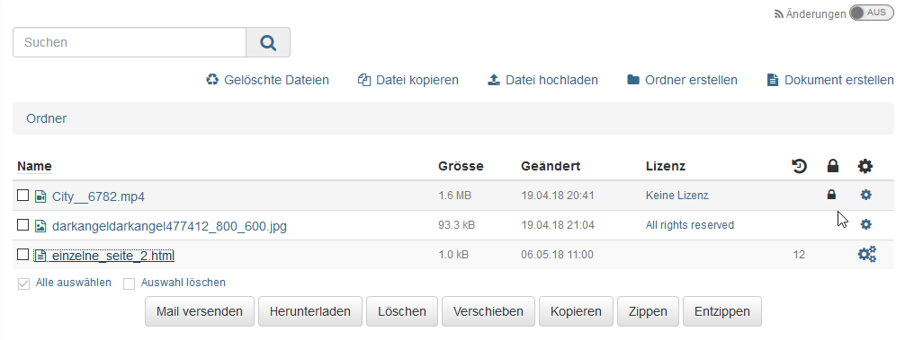
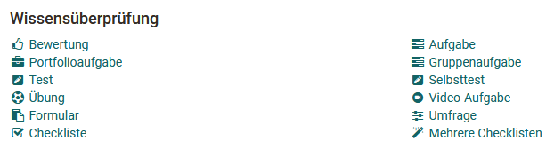
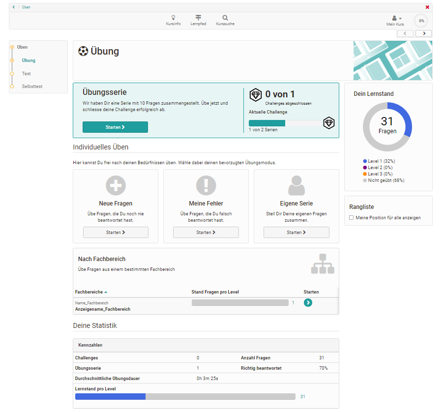
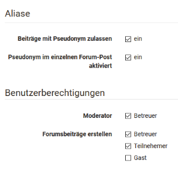
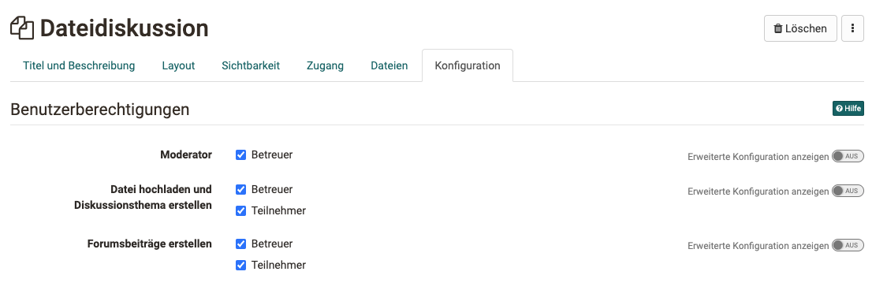
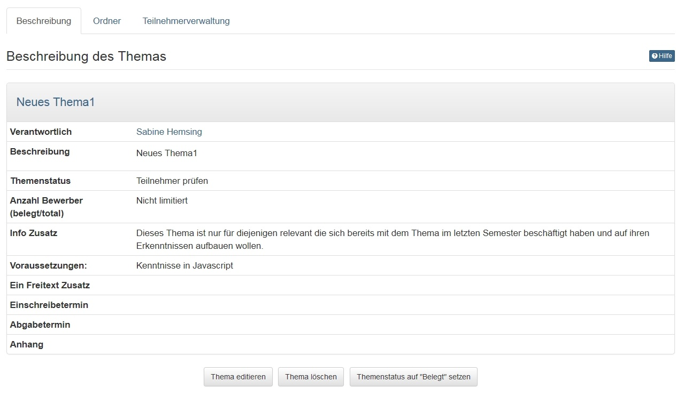
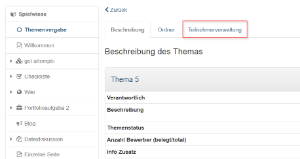

# Kursbausteine

:octicons-device-camera-video-24: **Video-Einführung**: [Was sind Kursbausteine?](<https://www.youtube.com/embed/JM6iSrfkHog>){:target="_blank”}

:octicons-device-camera-video-24: **Video-Einführung**: [Kursbausteine konfigurieren](<https://www.youtube.com/embed/SAkzzoOQEoQ>){:target="_blank”} 

In diesem Kapitel erfahren Kursautoren im Detail, welche Kursbausteine im
Kurseditor eines Kurses zur Verfügung stehen und wie sie konfiguriert werden.
Folgen Sie zuerst den Anleitungen im Kapitel ["Kurs
erstellen"](../course_create/index.de.md), wenn Sie noch keinen Kurs erstellt haben.

!!! info "Info"

    Alle Kursbausteine verfügen über die Tabs " **Titel und Beschreibung** " sowie " **Layout** ". Darüber hinaus gibt es noch bestimmte Tabs die je nach technischem Kurstyp durchgängig vorhanden sind. Der Tab "Lernpfad" existiert nur bei Lernpfad Kursen. Die Tabs "Sichtbarkeit" und "Zugang" existieren nur bei den herkömmlichen Kursen.

  

## Kursbausteine im Überblick

**Wissensvermittlung**

  * [Kursbaustein "Struktur“](Course_Element_Structure.de.md)
  * [Kursbaustein "Einzelne Seite"](Course_Element_Single_Page.de.md)
  * [Kursbaustein "Externe Seite"](Course_Element_External_Page.de.md)
  * [Kursbaustein "CP-Lerninhalt“](Course_Element_CP_Learning_Content.de.md)
  * [Kursbaustein "SCORM-Lerninhalt“](Course_Element_SCORM_Learning_Content.de.md)
  * [Kursbaustein "Dokument"](Course_Element_Document.de.md)
  * [Kursbaustein "Ordner“](Course_Element_Folder.de.md)
  * [Kursbaustein "Podcast“](Course_Element_Podcast.de.md)
  * [Kursbaustein "Blog"](Course_Element_Blog.de.md)
  * [Kursbaustein "Video“](Course_Element_Video.de.md)
  * [Kursbaustein "Video Livestream"](Course_Element_Video_Livestream.de.md)
  * [Kursbaustein "Opencast"](Course_Element_Opencast.de.md)
  * [Kursbaustein "edu-sharing"](Course_Element_edu_Sharing.de.md)
  * [Kursbaustein "card2brain"](Course_Element_card2brain_Flashcards.de.md)
  * [Kursbaustein "MediaSite"](Course_Element_Mediasite.md)
  * [Kursbaustein "Edubase"](Course_Element_Edubase.de.md)

**Wissensüberprüfung**

  * [Kursbaustein "Bewertung“](Course_Element_Assessment.de.md)
  * [Kursbaustein "Aufgabe"](Course_Element_Task.de.md)
  * [Kursbaustein "Gruppenaufgabe"](Course_Element_Grouptask.de.md)
  * [Kursbaustein "Portfolioaufgabe“](Course_Element_Portfolio_Task.de.md)
  * [Kursbaustein "Test“](Course_Element_Test.de.md)
  * [Kursbaustein "Selbsttest“](Course_Element_Self_Test.de.md)
  * [Kursbaustein "Übung"](Course_Element_Practice.de.md)  
  * [Kursbaustein "Video-Aufgabe"](Course_Element_Video_Task.de.md)  
  * [Kursbaustein "Formular"](Course_Element_Form.de.md)
  * [Kursbaustein "Umfrage“](Course_Element_Survey.de.md)
  * [Kursbaustein "Checkliste“](Course_Element_Checklist.de.md)

**Kommunikation & Kollaboration**

  * [Kursbaustein "Wiki“](Course_Element_Wiki.de.md)
  * [Kursbaustein "Forum“](Course_Element_Forum.de.md)
  * [Kursbaustein "Dateidiskussion“](Course_Element_File_Dialog.de.md)
  * [Kursbaustein "Teilnehmer Ordner"](Course_Element_Participant_Folder.de.md)
  * [Kursbaustein "Teilnehmerliste“](Course_Element_Participant_List.de.md)
  * [Kursbaustein: "vitero"](Course_Element_vitero.de.md)
  * [Kursbaustein: "OpenMeetings"](Course_Element_OpenMeetings.de.md)
  * [Kursbaustein: "Adobe Connect"](Course_Element_Adobe_Connect.de.md)
  * [Kursbaustein: "GoToMeeting"](Course_Element_GoToMeeting.de.md)
  * [Kursbaustein: "BigBlueButton"](Course_Element_BigBlueButton.de.md)
  * [Kursbaustein: "Microsoft Teams"](Course_Element_Microsoft_Teams.de.md)
  * [Kursbaustein: "Zoom"](Course_Element_Zoom.de.md)

**Verwaltung & Organisation**

  * [Kursbaustein "Einschreibung“](Course_Element_Enrolment.de.md)
  * [Kursbaustein "Mitteilungen“](Course_Element_Notifications.de.md)
  * [Kursbaustein "E-Mail“](Course_Element_EMail.de.md)
  * [Kursbaustein "Kalender“](Course_Element_Calendar.de.md)
  * [Kursbaustein "Terminplanung"](Course_Element_Appointment_Scheduling.de.md)

**Andere**

  * [Kursbaustein "LTI-Seite“](Course_Element_LTI_Page.de.md)
  * [Kursbaustein "Themenvergabe“](Course_Element_Topic_Assignment.de.md)
  * [Kursbaustein "Linkliste“](Course_Element_Link_List.de.md)

!!! info "Info"

    Neben den Kursbausteinen gibt es in OpenOlat Kursen noch weitere Tools und Lernressourcen die zur Ausgestaltung von Kursen verwendet werden können. Hinweise darauf finden Sie in den jeweiligen Kapiteln.

## Arbeiten mit Kursbausteinen

Im Folgenden finden Sie eine Liste mit den wichtigsten Kursbausteinen, aus
denen Ihr Kurs aufgebaut sein kann. Wahrscheinlich werden in Ihrem Kurs nicht
alle Bausteine verwendet, da es zur didaktischen Erstellung von Lernumgebungen
und Kursen gehört, die Funktionalitäten und Kursbausteine gezielt auszuwählen.
Möglicherweise werden in Ihrem Kurs auch mehrere Kursbausteine desselben Typs
angeboten oder die Kursbausteine sind anders benannt als in dieser
Aufstellung.

Bei herkömmlichen Kursen können Sie sich an den abgebildeten Icons
orientieren, um den Kursbausteintyp zu erkennen. Bei Lernpfad Kursen werden
keine Icons angezeigt.

Umfangreichere Beschreibungen zur Funktionsweise der folgenden Bausteine
finden Sie auf separaten Seiten:

  * [Aufgabe](Working_with_Forums.de.md)
  * [Forum](Working_with_Tasks_and_Group_Tasks.de.md)
  * [Gruppenaufgabe](Working_with_Forums.de.md)
  * [Selbsttest](Working_with_Topic_Assignment.de.md)
  * [Test](Working_with_Topic_Assignment.de.md)
  * [Themenvergabe](Working_with_Tests.de.md)
  * [Wiki](Working_with_Wiki.de.md)

### Bewertung

Hier erhalten Sie Punkte oder ein "bestanden" bzw. "nicht bestanden" von Ihrem
Dozenten. Auch Kommentare und Feedbackdokumente sowie ein Rubrik-Feedback
können Sie auf diesem Weg erhalten. Der Baustein wird häufig verwendet, wenn
Aktionen bewertet werden, die nicht zuvor online in OpenOlat eingereicht
wurden z.B. Präsenz-Referate oder reale Produkte.

### Blog {: #blog}

Ähnlich wie der Podcast dient auch der Blog dazu, neue Inhalte zur Verfügung
zu stellen. In den Beiträgen können neben Text auch Bilder oder Filme
eingebunden sein.

Jeder OpenOlat-Benutzer darf Blogeinträge mit 1-5 Sternen bewerten und
kommentieren.  Um einen Kommentar zu verfassen oder bestehende Kommentare zu
lesen, klicken Sie auf den Link „Kommentare“. Sie sehen zudem die Bewertungen
der anderen Blogleser.

Blogeinträge _erstellen_ können Sie nur, wenn der Kursbesitzer Sie dazu
berechtigt hat. Klicken Sie auf „Neuen Eintrag erstellen“ und verfassen Sie
den Blogeintrag.

 Blogeintrag erstellen und editieren

 **Titel:** Geben Sie einen Titel ein, der den Blogeintrag beschreibt. Dieses
Feld ist obligatorisch.

 **Beschreibung:** Die Beschreibung ist fakultativ und wird als Vorschau eines
Artikels oder Eintrags verwendet. Es kann sich somit auch um eine kurze
Einleitung oder Zusammenfassung handeln.

 **Inhalt:** Der Inhalt ist der eigentliche Blogeintrag. Dieses Feld sollte
also unbedingt ausgefüllt werden. Formatierungen und Bilder sind erlaubt.

 **Datum und Zeit der Veröffentlichung:** Das Datum und die Zeit der
Veröffentlichung werden dafür verwendet, den Eintrag für andere Benutzer
sichtbar zu machen oder zu verbergen. Liegt der Zeitpunkt der Veröffentlichung
in der Vergangenheit, so wird der Eintrag sichtbar. Liegt er hingegen in der
Zukunft, so handelt es sich um eine geplante Veröffentlichung des Eintrags.

Sie können den Eintrag durch Klicken auf "Veröffentlichen" für andere
zugänglich machen (ab dem angegebenen Datum). Wenn Sie an Ihrem Eintrag zu
einem späteren Zeitpunkt weiterschreiben wollen, klicken Sie auf "Entwurf
speichern". "Abbrechen" verwirft Ihre Änderungen und schliesst das
Formularfenster. Entwürfe erscheinen in der Liste der Einträge gelb
hinterlegt. Geplante Veröffentlichungen sind grün gekennzeichnet. Alle anderen
Einträge sind öffentlich und für andere sichtbar.

Sie können den neuen Eintrag entweder direkt veröffentlichen, das Datum der
Veröffentlichung wählen oder den Eintrag als Entwurf speichern.

Abonnieren Sie den RSS-Feed des Blogs, um keine neuen Einträge zu verpassen.

### Checkliste

Erreichte Ziele, fehlende Aufgaben, richtige oder falsche Lösungen -
Checklisten machen dies sichtbar und dadurch für den Betreuer auch bewertbar.

Als informationelle Arbeitshilfe, die Benutzer dabei unterstützt z.B. kleinere
Aufgaben zu erledigen oder Informationen gesichert zu behalten, erlaubt die
Checkliste das Führen von z.B. To Do- oder Prüflisten. So können z.B. auch
Aufgaben ausserhalb von OpenOlat dokumentiert werden. Sollte dies der Fall
sein, finden Sie eventuell Informationen zur Bewertung auf der Startseite der
Checkliste.

Wenn eine Checkliste mit einem Abgabedatum versehen wurde, kann diese im
Anschluss nicht mehr bearbeitet werden. Unterhalb des Abgabedatums und der
Bewertungsinformation befindet sich die tatsächliche Liste mit allen
Checkboxen, inklusive eventueller Informationen und Dateien zum Download.
Erscheint eine Checkbox ausgegraut, so kann sie entweder nur vom Betreuer
abgehakt werden, oder das Abgabedatum ist bereits abgelaufen.

### Einschreibung

Mit Hilfe des Kursbausteins "Einschreibung" können Sie sich in eine oder
mehrere Gruppen eines Kurses eintragen. Gruppen können in OLAT für
unterschiedliche Zwecke verwendet werden, z.B. für Arbeitsgruppen oder zur
Verteilung von Kursteilnehmenden.

Wählen Sie den Link „Einschreiben“, um Mitglied einer Gruppe zu werden.
Abhängig von der Konfiguration können Sie sich entweder nur in eine Gruppe
einschreiben, oder in mehrere gleichzeitig. Die Einschreibung bewirkt, dass
nun rechts im Dropdown-Menü "Mein Kurs" die Links zu den entsprechenden
Kurs-[Gruppe](Gruppen.html)n in denen Sie Mitglied sind, sichtbar werden.

Bei einigen Gruppen ist die Anzahl Mitglieder limitiert. Ist die Gruppe voll,
gibt eventuell eine Warteliste. Je nach Konfiguration. Wenn der
Gruppenadministrator das so eingestellt hat, rücken Sie automatisch nach,
sobald sich ein Gruppenmitglied aus der Gruppe austrägt.

Oft können Sie sich am selben Ort, wo Sie sich eingeschrieben haben, wieder
aus der Gruppe austragen. Sollte dies nicht der Fall sein, so hat der
Gruppenadministrator das Austragen untersagt und Sie müssen Ihn kontaktieren,
wenn Sie sich aus Versehen eingeschrieben haben.

### E-Mail

Diese Funktion ist eine Art Kontaktformular. Je nach Konfiguration können hier
E-Mails an alle Kursbesitzer, alle Betreuer alle Teilnehmenden oder
Teilnehmende aus bestimmten Gruppen verschickt werden. Füllen Sie die Felder
„Betreff“ und „Nachricht“ aus und senden Sie die E-Mail über OpenOlat.

### Fragebogen, Umfrage

Fragebögen werden für Evaluationen oder Meinungsumfragen verwendet. Jede
Umfrage kann nur einmal ausgefüllt werden. Die Resultate werden normalerweise
anonymisiert gespeichert. Der Fragebogen erscheint direkt beim Aufruf des
entsprechenden Kursbausteins. Sie können einen Fragebogen bzw. eine Umfrage
auch zwischenspeichern. Füllen Sie einfach die bereitgestellten Felder aus.

### Kalender

Der Kursbaustein „Kalender“ bietet eine alternative Sicht auf den
[Kurskalender](../../pages/viewpage.action%EF%B9%96pageId=108593252.html#Zus%C3%A4tzlicheKursfunktionen-
_kurskalender), welcher, wenn aktiviert, oben in der Kurstoolbar aufgerufen
werden kann. Das Startdatum z.B. die jeweilige Semesterwoche kann vom
Lehrenden bei Bedarf vorgegeben werden.

### Ordner

Im Kursbaustein "Ordner" können Lehrende Dateien zum Download bereitstellen.
Standardmässig sind Ordner Kursbausteine so konfiguriert, dass nur Besitzer
und Betreuer Dateien hochladen dürfen und Kursteilnehmer lediglich das Recht
haben, Dateien zu lesen bzw. herunterzuladen.

Abonnieren Sie den Ordner, um bei neuen Dokumenten benachrichtigt zu werden.
Änderungen erfahren Sie per E-Mail oder unter „Abonnements“ in OpenOlat.

:octicons-device-camera-video-24: **Video-Einführung**: [Abonnements](<https://www.youtube.com/embed/h9gOqt7TR7Q>){:target="_blank”}

Wenn der Ordner dazu eingesetzt wird, dass Kursteilnehmer ebenfalls Dateien
hochladen dürfen, finden Sie in der Leiste über den Dateien, die
entsprechenden Funktionen. Sie können dann auch Dateien löschen, Unterordner
einrichten. Wenn Sie verhindern möchten, dass jemand Ihre Dateien löscht,
können Sie in der Tabellenansicht auf das Icon
„[Metadaten](../personal/Full-Text_Search.de.md#Volltextsuche-_metadata)“ klicken und die
Datei sperren. Gesperrte Dateien sind mit einem Schloss gekennzeichnet.

  

Achtung nicht verwechseln: Neben den Download Ordnern in Kursen stehen
Lernenden auch [Persönliche
Ordner](../personal/Personal_folders.de.md) zur
Verfügung, die kursunabhängig für das individuelle Lernen genutzt werden
können. Ferner gibt es den Kursbaustein "Teilnehmer Ordner" (siehe unten).

###  Podcast {: #podcast}

Ein Podcast stellt Informationen in Form von Audio- oder Videodateien bereit.
Diese so genannten Episoden können Sie einerseits direkt in OpenOlat anhören
oder betrachten, andererseits können Sie Podcasts abonnieren, die Episoden in
lokale Portale wie iTunes laden und auf Ihr mobiles Endgerät kopieren.

Um neue Episoden zu erstellen, müssen Sie vom Lehrenden dazu berechtigt
werden. Klicken Sie dann auf "Episode hinzufügen" und erstellen Sie den neuen
Podcast.

 Episode erstellen oder bearbeiten

Geben Sie einen Titel ein, der die Episode möglichst präzise beschreibt.
Dieses Feld ist obligatorisch. Die Beschreibung ist fakultativ. Bedarf die
Mediadatei zusätzlicher Bemerkungen, können diese hier angegeben werden.

Eine Episode enthält immer genau eine Audio- oder Video-Datei. Wählen Sie
diese auf ihrem Computer aus, damit sie danach hochgeladen werden kann. Dies
kann je nach Grösse der Datei eine gewisse Zeit dauern. Beachten Sie, dass nur
Flash-kompatible Formate erlaubt sind (d.h. FLV, MP3, MP4, M4V, M4A und AAC).

Durch Klicken auf Veröffentlichen wird die Episode dem Podcast hinzugefügt und
ist für andere zugänglich.

Jeder OpenOlat-Benutzer darf jedoch Episoden kommentieren und mit 1-5 Sternen
bewerten. Um einen Kommentar zu verfassen oder bestehende Kommentare zu lesen,
klicken Sie auf den Link „Kommentare“.

Abonnieren Sie den RSS-Feed des Podcasts, um keine neuen Episoden zu
verpassen.

### Portfolioaufgabe

  

Stellt Ihnen Ihr Dozent ein vorstrukturiertes Portfolio mit Aufgabenstellungen
bzw. Aktionsaufforderungen bereit, können Sie sich diese hier abholen. Klicken
Sie auf „Portfolioaufgabe abholen“, um die Aufgabe anzusehen und die
geforderten Aufgaben in der vordefinierten Mappe zu lösen. Wenn der Lehrende
kaum Strukturierungen und Einschränkungen festgelegt hat, können Sie die Mappe
nach Belieben gestalten, ansonsten bildet die vorgegebene Strukturierung den
Rahmen für die weitere Bearbeitung. Möglicherweise hat der Lehrende einen
Abgabetermin definiert, den Sie beachten sollten.

In der Portfolioaufgabe können Sie beispielsweise Ihren Lernprozess
dokumentieren und reflektieren bzw. Bearbeitungen über einen längeren Zeitraum
vornehmen.

Sobald Sie die Portfolioaufgabe im Kurs abgeholt haben, finden Sie diese auch
in Ihrem [persönlichen
Menü](../personal/Personal_Menu.de.md) unter
„Portfolio 2.0“ - „Meine Portfolio Mappen“.

Um die fertige Bearbeitung einzureichen, publizieren Sie die Aufgaben und
geben Sie den Bereich [frei](../portfolio/Shared_by_me.de.md). Weitere Informationen
zur Bearbeitung einer Portfolioaufgabe finden Sie
[hier](../portfolio/Portfolio_task_and_assignment_Collecting_and_editing.de.md).

### Terminplanung

Auf diesem Weg kann Ihnen Ihre Lehrperson diverse Termine zur Auswahl oder
direkt zur Einschreibung bereitstellen. Sie können den oder die für Sie
passenden Termine auswählen indem Sie auf das ? klicken. Je nach Konfiguration
kann es eine Deadline für den Eintrag geben.

  

### Teilnehmer Ordner

  

Hier können Lernende den Dozenten Dateien zur Verfügung stellen und auch über
den Rückgabeordner individuelle Rückmeldungen vom Lehrenden erhalten. Sofern
vom Administrator ein entsprechender Dokumenteneditor aktiviert wurde, ist
auch die Erstellung von unterschiedlichen Dateiformaten wie Word, Excel oder
PowerPoint Dateien direkt in OpenOlat möglich. Jeder Kursteilnehmer sieht hier
nur seinen eigenen individuellen Ordner. Einreichungen von anderen Lernenden
sind im Teilnehmer Ordner, im Gegensatz zum Kursbaustein "Ordner" (siehe
oben), nicht sichtbar.

Punkte oder bestanden/nicht bestanden werden hierüber nicht abgewickelt.

  

### Teilnehmerliste

Die Teilnehmerliste gibt einen Überblick über die Personen, die Zugang zum
Kurs haben. Je nach Einstellung werden die Kursbesitzer (Kursadministratoren),
Betreuer und oder die Teilnehmer angezeigt. Über die Teilnehmerliste hat man
auch Zugriff auf die Visitenkarte der angezeigten Personen. Je nachdem welche
Informationen die OpenOlat Mitglieder dort hinterlegt haben, erhält man
weitere Informationen und kann auch per synchronen Chat Kontakt aufnehmen. Je
nach Einstellung können Sie auch allen oder ausgewählten Teilnehmenden E-Mails
schicken oder die gesamte Teilnehmerliste herunterladen bzw. drucken.

  

### Video

Über den Kursbaustein Video erhalten Sie Zugriff auf ein Video und können je
nach Einstellung dieses Video auch kommentieren und per Sternchen bewerten.
Handelt es sich um ein interaktives Video, sind auch weitere Aktionen wie die
Beantwortung von Quizfragen oder der Aufruf von Verlinkungen möglich.

### Virtuelle Räume

Mit den Kursbausteinen [Adobe Connect](../course_elements/Course_element_Adobe_Connect.de.md),
[GoToMeeting](../course_elements/Course_element_GoToMeeting.de.md),
[Vitero](../course_elements/Course_element_vitero.de.md) [BigBlueButton
](../course_elements/Course_element_BigBlueButton.de.md)und
[OpenMeetings](../course_elements/Course_element_OpenMeetings.de.md) können in OpenOlat
unterschiedliche [Virtuelle Klassenzimmer](../course_elements/Virtual_classrooms.de.md) für
synchrone Meetings, Video-Konferenzen oder Webinare zum Einsatz kommen.
Welcher Kursbaustein eingebunden wird, und welche Funktionalitäten damit zur
Verfügung stehen, hängt davon ab welche Konfiguration ihr OpenOlat
Systemadministrator ausgewählt hat.

Ein virtueller Raum ermöglicht Ihnen, gleichzeitig (synchron) online mit
mehreren Personen zusammen zu arbeiten, die geographisch von Ihnen getrennt
sind. Funktionen von virtuellen Räumen sind unter anderem Live Chat, Audio und
Video, Desktop- und Dokumentsharing. Wird ein virtueller Raum mittels eines
Kursbausteins betreten, öffnet sich ein neues Browserfenster, in dem die
virtuelle Sitzung stattfindet.

Damit Sie alle Funktionalitäten benutzen können, benötigen Sie ein Headset und
eine angeschlossene Kamera. Unter Umständen muss, abhängig vom eingesetzten
System, noch weitere Software temporär heruntergeladen werden.

## Wissensvermittlung

###  Kursbaustein „Struktur“ {: #structure}

Der Kursbaustein „Struktur“ dient der Gliederung des Kurses und bietet
standardmässig eine automatische Übersicht über alle ihm untergeordneten
Kursbausteine mit deren Kurztitel, Titel und Beschreibungen. Verwenden Sie
diesen Kursbaustein, um Ihre Kursinhalte zu gliedern und/oder Module klar zu
trennen. Weitere Informationen finden Sie
[hier](Course_Element_Structure.de.md).

###  Kursbaustein "Einzelne Seite" {: #single_page}

Im Kursbaustein „Einzelne Seite“ können Sie verschiedene Dateien direkt in die
Kursstruktur eingebunden werden. Diese webspezifischen Dateien (pdf, html)
können bereits im Ablageordner des Kurses oder einem verknüpften
Ressourcenordner vorliegen oder direkt mit dem Kurseditor als HTML-Seite
erstellt werden. Die so verknüpften Web-Dateien werden im Gegensatz zu einer
Bereitstellung über den Kursbaustein "Ordner" direkt in der Kursstruktur
angezeigt. Der Kursbaustein "Einzelne Seite" eignet sich besonders für die
Bereitstellung von schnell sichtbaren Informationen und hypertextbasierten
Inhalten. Weitere Informationen zu den Kursbausteinen "Einzelne Seite" und
"Mehrere Einzelseiten" finden Sie
[hier](Course_Element_Single_Page.de.md).

###  Kursbaustein "Externe Seite" {: #external_page}

Mit Hilfe des Kursbausteins „Externe Seite“ können Sie eine externe
Internetseite aufrufen. Geben Sie einfach die gewünschte URL in der
Konfiguration im Tab "Seiteninhalt" ein um die externe Seite in Ihre
Kursnavigation zu integrieren.  Für die Anzeige der verlinkten Seite werden
Ihnen die Varianten

  * „Eingebettet (Quelle verborgen)“,
  * „Eingebettet (Quelle sichtbar)“,
  * „Neues Browserfenster“ (Quelle sichtbar) und
  * „Vollständig integriert“ (Quelle verborgen)

angeboten. Für Seiten, die eine Authentifizierung erfordern und deren Quelle
verborgen ist, können Sie "Seite Passwort geschützt" aktivieren und die
notwendigen Zugangsdaten eintragen.

Der Einsatz dieses Kursbausteins empfiehlt sich, wenn Sie beispielsweise
Seiten mit Datenbankabfragen (Literaturrecherche-Tool, Online-Übungen aus dem
Web, etc.) einbinden möchten. Es lassen sich nur externe Seiten über die Protokolle HTTP und HTTPS verlinken.

  

#### Tab "Seiteninhalt" konfigurieren

**URL:** Dieses Eingabefeld müssen Sie ausfüllen. Hier geben Sie die Webseite an, auf der die gewünschten externen Inhalte liegen (im Format:_http://www.musterseite.com_)

**Darstellung konfigurieren:** Sie können zwischen vier Optionen wählen:

*  _Vollständig integriert (Quelle verborgen):_ Dies bedeutet, dass die externe HTML-Seite geparst und vollständig in die OpenOlat-Seite eingebaut wird. Die HTML-Seiten dürfen ausschliesslich Ressourcen wie Bilder, Flash, Videos oder Links mit **relativen Pfaden** enthalten. Absolute Pfade wie "http://..." sowie relativ absolute Pfade wie "/public" (relativ zu einem Basis URI) sind nicht erlaubt.
*  _Eingebettet (Quelle verborgen):_ Hier wird die externe HTML-Seite in ein sog. «iframe» eingebaut. Die Internet-Adresse der externen Seite ist für den Benutzer nicht sichtbar. Die HTML-Seiten dürfen ausschliesslich Ressourcen wie Bilder, Flash, Videos oder Links mit **relativen Pfaden** enthalten. Absolute Pfade wie "http://..." sowie relativ absolute Pfade wie "/public" (relativ zu einem Basis URI) sind nicht erlaubt.
*  _Eingebettet (Quelle sichtbar):_ Hier wird die externe HTML-Seite ebenfalls in ein «iframe» eingebaut. Im Quellcode der OLAT-Seite kann die Internet-Adresse der externen Seite eingesehen werden.
*  _Neues Browser-Fenster (Quelle sichtbar):_ Als weitere Option können Sie die externe Seite auch in einem eigenen Browserfenster anzeigen lassen.

Eingebettete Frames («iframe») verhalten sich wie eigene Browser-Fenster, die jedoch Bestandteil der HTML-Seite des Ursprungsfensters sind.  

Vorteil von «iframe»: Sie können beliebige Inhalte (komplexe Webseiten in verschachtelten Frames, mathML etc.) in OLAT anzeigen lassen.  

Nachteil von «iframe»: Die Inhalte erscheinen unter Umständen mit eigenen Scroll-Balken.

!!! info "Info"

    Sollten Sie sich nicht sicher sein, welche Variante in Ihrem Fall die Richtige ist, dann beginnen Sie mit der Option „Vollständig integriert“ und testen die anderen Darstellungsmöglichkeiten, bis die verlinkte Seite wie gewünscht angezeigt wird.

  

### Kursbaustein „CP-Lerninhalt“ {: #CP_learning_content}

Nutzen Sie den Kursbaustein „CP-Lerninhalt“, um einen Lerninhalt im IMS-CP-
Format (IMS-CP Version 1.1.2) in Ihren Kurs einzubinden. Das CP können Sie
entweder direkt in OpenOlat erstellen, was im Kapitel ["Fünf Schritte zu Ihrem Content-Packaging"](../resource_cp/In_Five_Steps_to_Your_Content_Package.de.md)
erklärt wird. Oder Sie erstellen das CP extern, beispielsweise mit
[eLML](http://www.elml.org "eLML ").

Weitere Infos zum CP finden Sie [hier](../resource_cp/index.de.md).  

###  Kursbaustein „SCORM-Lerninhalt“ {: #SCORM_learning_content}

Über den Kursbaustein "SCORM Lerninhalt" können extern erstellte SCORM-Pakete
in OpenOlat Kurse eingebunden werden. SCORM ist ein Standard mit dem Inhalte
aber auch interaktive E-Learning Module gekapselt und in unterschiedlichen
Systemen eingebunden werden können. Weitere Informationen zur Konfiguration
des Kursbausteins SCORM finden Sie im Kapitel "Kursbaustein "[SCORM-Lerninhalt"](../course_elements/Course_Element_SCORM_Learning_Content.de.md).

### Kursbaustein "Dokument" {: #document}

Mit dem Kursbaustein „Dokument“ können verschieden Dokumentformate direkt
sichtbar in den Kurs eingebunden werden. Der Kursbaustein ist besonders für
Office-Dokumente, PDF oder auch die Anzeige von Grafik-Dateien geeignet. Dabei
kann sowohl auf bereits vorliegende Dateien zurückgegriffen oder Dateien neu
hochgeladen oder erstellt werden. Textverarbeitungsdokumente und PDF werden
über den integrierten Dokument Viewer direkt angezeigt.

Verwendet werden können Dateien, die sich im Ablageordner des Kurses befinden
oder als separate Lernressource hochgeladen wurden. Welche Dateiformate neu
erstellt werden können ist abhängig von den Einstellungen in der
Administration der jeweiligen OpenOlat Instanz.

Die eingebundenen Dokumente können bei Bedarf später auch bearbeitet,
ausgetauscht oder als separate Lernressource gespeichert werden. Je nach
Dateityp sind noch weitere Optionen wie die Bearbeitung von Metadaten möglich.
Eine Bearbeitung der Textdokumente ist bei Aktivierung entsprechender Lizenzen
in der OpenOlat Administration ebenfalls möglich, der Editor öffnet sich dann
in einem separaten Fenster.

Ferner können im Kurseditor die Benutzerberechtigungen für den Kursbaustein
eingestellt werden und so z.B. definiert werden welche Rollen das jeweilige
Dokument (sofern möglich) bearbeiten und herunterladen dürfen. Auch die Höhe
der Anzeigefläche kann definiert werden.

Nach dem Download eines entsprechenden Dokuments wird in den Metadaten
angezeigt, wer das Dokument als letztes bearbeitet hat.

!!! warning "Hinweis"

    Für Video-Dateien sollte der Kursbaustein „Video“ und für HTML-Seiten der Kursbaustein „Einzelseite“ anstatt des Kursbaustein "Dokument" verwendet werden.

  

###  Kursbaustein „Ordner“ {: #folder}

Im Kursbaustein „Ordner“ können Sie Dateien zum Download anbieten. Vielfach
wird der Kursbaustein Ordner dazu verwendet, Kursmaterialien wie Folien oder
Skripte zur Verfügung zu stellen. Darüber hinaus kann der Kursbaustein
"Ordner" auch als kollaboratives Werkzeug für den Dateiupload der Lernenden
konfiguriert werden.

Weitere Informationen zur Konfiguration und Verwendung des Kursbausteins
"Ordner" finden Sie
[hier](Course_Element_Folder.de.md).

  

### Kursbaustein „Podcast“ {: #podcast}

Den Kursbaustein „Podcast“ können Sie entweder dazu benutzen, Ihre eigenen
Audio- und Videodateien oder externe Podcast-Episoden einfach in OpenOlat
bereitzustellen. Kursteilnehmer können sich Episoden direkt in OpenOlat
anzeigen lassen oder den Podcast abonnieren, die Episoden in Portale wie
iTunes laden und auf ihre mobilen Endgeräte kopieren.

Wie Sie einen Podcast [erstellen ](../resource_podcast/Four_Steps_to_Your_Podcast.de.md)und
[konfigurieren ](../resource_podcast/Podcast_-_Further_Configurations.de.md)erfahren Sie in
separaten Kapiteln.

### Kursbaustein "Blog" {: #blog}

Über den „Blog“ können Sie die Teilnehmer des Kurses über aktuelle Themen in
Form von Text, Bild oder Video informieren. Sie können sowohl externe Blogs
einbinden als auch einen neue OLAT Lernressource „Blog“ erstellen und
verwenden. Kursbesitzer können in einem Blog beispielsweise mehr oder weniger
regelmäßig einen inhaltlichen Blog führen und so die Kursteilnehmenden über
neue aktuelle Inhalte zum Veranstaltungsthema informieren. Die Teilnehmenden
können diese Beiträge dann kommentieren und auch mit 1-5 Sternen bewerten.
Ferner ist es möglich, den Kursteilnehmenden das Schreibrecht für einen Blog
zu geben, so dass sie gemeinsam einen Kursblog führen können.

Wie Sie einen Blog [erstellen ](../resource_blog/Four_Steps_to_Your_Blog.de.md)und
[konfigurieren ](../resource_blog/Blog_-_Further_Configurations.de.md)erfahren Sie auf
separaten Seiten.

### Kursbaustein „Video“ {: #video}

Mit dem Kursbaustein "Video" können Sie selbst erstellte Videos oder über eine
URL importierte Videos, die als Lernressource Video in OLAT vorliegen, Ihrem
Kurs hinzufügen. Es wird jeweils ein Video pro Kursbaustein verlinkt. Das
Video kann mit einer Kommentierung und Bewertung versehen und so optimal in
das Lehr-Lerngeschehen eines Kurses eingebunden werden.

Weitere Informationen zum Kursbaustein Video finden Sie
[hier](../resource_video/Course_Element_Video.de.md).
Informationen zur Nachbearbeitung des Videos mit OLAT Quiz und Sprungmarken
finden Sie im Kapitel "[Lernressource:
Video](../resource_video/Learning_resource_Video.de.md)".

###  Kursbaustein "Video Livestream"  {: #livestream}

  

###  Kursbaustein "Opencast"  {: #opencast}

Mit dem Kursbaustein Opencast können Aufzeichnungen von Meetings und
Lehrveranstaltungen, die auf einem Opencast-Server abgelegt sind, in OpenOlat-
Kurse eingebunden werden. Die Konfiguration und Anbindung des Opencast-Servers
erfolgt in der Administration. Im Kursbaustein können entweder einzelne Videos
oder ganze Serien eingebunden werden.

###  Kursbaustein "edu-sharing" {: #edusharing}

  

###  Kursbaustein "card2brain" {: #card2brain}

Der Baustein card2brain ermöglicht das Lernen mit Lernkarten. Um diesen
Baustein zu nutzen, müssen Sie zwingend ein Entreprise-Account von card2brain
besitzen. Kunden von frentix wenden Sie dafür bitte an
[card2brain@frentix.com](mailto:card2brain@frentix.com), Nichtkunden
kontaktieren direkt [card2brain](http://card2brain.ch/info/contact).

Weitere Informationen zum Kursbaustein finden Sie
[hier](Course_Element_card2brain_Flashcards.de.md).

###  Kursbaustein "Edubase" {: #edubase}

Mit diesem Kursbaustein können e-Books von Edubase verlinkt und direkt in
OpenOlat aufgerufen werden.

Um diesen Baustein zu nutzen, ist zwingend ein Account bei Edubase sowie
entsprechende Berechtigungen zur Nutzung der jeweiligen eBooks notwendig.
Kunden von frentix wenden Sie dafür bitte an
[edubase@frentix.com](mailto:edubase@frentix.com), Nichtkunden kontaktieren
direkt [Edubase](https://www.edubase.ch/).

!!! info "Info"

    Der Baustein muss zunächst in der Administration freigeschalten und konfiguriert werden, ebenso werden Berechtigungsschlüssel für die eBooks benötigt. Sind die Voreinstellungen abgeschlossen, kann der Baustein zu einem Kurs hinzugefügt werden. Für die eingebundenen eBooks ist es im Editor möglich, Leseaufträge zu bestimmten Buchpassagen für Kursteilnehmer zu erstellen.

## Wissensüberprüfung

Hier erhalten Sie einen Überblick über die Kursbausteine, die zur
Wissensüberprüfung eingesetzt werden können. Für einige Kursbausteine
existieren vertiefende, separate Seiten oder Kapitel hier im Handbuch.

OpenOlat stellt diverse Kursbausteine für die Wissensüberprüfung zur
Verfügung. Die zentralen Kursbausteine hierfür sind die drei Kursbausteine die OpenOlat [Tests](../tests/Configure_tests.de.md) verwenden und die beiden
Kursbausteine für
[Einsendeaufgaben](../task/index.de.md). Aber auch die
anderen Bausteine wie
[Portfolioaufgabe](../portfolio/Creating_Portfolio_Tasks.de.md),
[Bewertungen](Course_Element_Assessment.de.md) mit und ohne
Bewertungsraster (Rubrik) oder die Checklisten bieten für bestimmte Szenarien
viel Potenzial.

Die meisten Kursbausteine der Kategorie Wissensüberprüfung können bei Bedarf
auch mit Punkten versehen werden und erhalten dann den Konfigurations-Tab
"Highscore". Mit der Vergabe von Punkten können weitere Features wie die
Addition von Punkten oder das Bestehen/Nicht bestehen eines Kurses basierend
auf den Bewertungen verschiedener Kursbausteine hinzugefügt werden. Verwendet
wird hierfür ein Kursbaustein
[Struktur](Course_Element_Structure.de.) bei herkömmlichen
Kursen.

Ein weiterer Konfigurations-Tab der bei den meisten Kursbausteinen der Wissensüberprüfung zur Verfügung steht (bis auf Selbsttest und Umfrage) ist der Tab "Erinnerung". Hier können in Abhängigkeit von der Bearbeitung des jeweiligen Kursbausteins E-Mails verschickt werden. Zum Beispiel kann eine
Mail verschickt werden, wenn zu einem bestimmten Datum eine Aufgabe oder ein Test noch nicht bearbeitet wurde. Die Möglichkeiten sind ähnlich wie im Menü ["Erinnerung"](../course_operation/Course_Reminders.de.md) in
der Kurs-Administration. 

In der Kategorie Wissensüberprüfung findet man auch die Kursbausteine "Umfrage" und "Formular" mit dem man OpenOlat [Formulare](../forms/Form_editor_Questionnaire_editor.de.md) für Befragungen u.ä. in einen Kurs einbauen kann.

### Kursbaustein „Bewertung“  {: #course_element_assessment}

Der Kursbaustein „Bewertung“ eignet sich, um Leistungen zu bewerten, welche
nicht explizit elektronisch abgegeben werden, z.B. Präsenz-Referate oder
Online-Webseiten. Auch eine Rubrik-Bewertung steht hier zur Verfügung.

Auf separaten Seiten erfahren Sie wie man eine 
[Bewertung](Course_Element_Assessment.de.md) einrichtet, durchführt und
konfiguriert.

  

### Kursbaustein "Aufgabe" {: #course_element_task}

Mit Hilfe des Kursbausteins Aufgabe können Lehrende Dateiabgaben und
Einsendeaufgaben organisieren. Lernende laden dabei ihre Einreichungen in den
OpenOlat Kurs hoch und erhalten vom Lehrenden ein Feedback bzw. eine
Bewertung. Ebenso können Überarbeitungen eingefordert oder Musterlösungen bereitgestellt werden.

Die zentrale Konfiguration des Kursbausteins erfolgt im Tab
„Workflow“. Hier bestimmen Sie, welche der folgenden Optionen Sie verwenden möchten. Anschliessend können Sie diese weiter konfigurieren:
 
  * **Aufgabenstellung**: Stellen Sie eine Aufgabenstellung direkt im Kursbaustein zur Verfügung. 
  * **Abgabe**: Lernende sollen die Möglichkeit haben ihre Bearbeitung einzureichen. Kursteilnehmer erstellen hier ihre Lösungen oder laden diese als PDF hoch.
  * **Rückgabe und Feedback**: Korrigierte Aufgaben und Überarbeitungsanforderungen können hier den Teilnehmern zurückgegeben werden.
  *  **Überarbeitung**: Teilnehmer geben in diesem Abschnitt überarbeitete Dokumente ab. Sie können weitere Korrekturanforderungen stellen, bis Sie die Aufgabe als erledigt betrachten und den Revisionsprozess schliessen.
  *  **Musterlösung**: Stellen Sie allen Teilnehmenden eine Musterlösung für die Aufgabe  zur Verfügung. Musterlösungen können als Datei hochgeladen oder direkt in OpenOlat erstellt werden.
  *  **Bewertung**: Punkte, bestanden/nicht bestanden und Feedbacks können individuell hinterlegt werden. 

 Im Tab "Lernpfad" (bzw. im Tab "Workflow" bei herkömmlichen) kann ferner definiert werden ob die Aufgabe obligatorisch oder freiwillig ist. Obligatorische Aufgaben müssen bearbeitet werden und werden nach Ablauf des eingestellten Abgabetermins eingezogen und zur Bewertung an den Lehrenden übergeben. Bei freiwilligen Aufgaben kann der User selbst entscheiden ob er sie bearbeiten möchte. Ferner werden freiwillige Aufgaben nach der Deadline _nicht_ eingezogen.   

!!! info "Info"

    Eine Schritt-für-Schritt-Anleitung zum Erstellen einer Aufgabe und die detaillierten [Konfigurationsmöglichkeiten](../task/Task_-_Further_Configurations.de.md) finden Sie im Kapitel [„Aufgabe erstellen"](../task/index.md).

  

### Kursbaustein „Portfolioaufgabe“ {: #course_element_portfolio}

Über den Kursbaustein „Portfolioaufgabe“ werden vom Lehrenden vordefinierte Portfolio Mappen für die Lernenden bereitgestellt. Die Kursteilnehmenden können die
Portfolioaufgabe im Kurs abholen und werden anschliessend in ihren individuellen Portfoliobereich weitergeleitet. Das so abgeholte Portfolio kann dann von den Lernenden mit Inhalten und Artefakten befüllt und wenn gewünscht weiteren Personen oder den Kursbetreuern zugänglich gemacht werden. Je nach Konfiguration können diese Personen das Portfolio auch bewerten und kommentieren. 

Für den Kursbaustein Portfolioaufgabe benötigen Sie eine „Portfolio 2.0
Vorlage“, die mit dem Kursbaustein verknüpft wird. Sie können direkt im Kurs
über "Portfoliovorlage wählen oder erstellen" eine neue Portfoliovorlage
erstellen bzw. eine zuvor erstellte verlinken.  Wie Sie eine Portfolioaufgabe
genau erstellen erfahren Sie
[hier](../portfolio/Creating_Portfolio_Tasks.de.md).

  
Sofern Sie bereits eine Portfoliovorlage hinzugefügt haben, erscheint diese
unter Gewählte Portfoliovorlage. Folgen Sie dem Link um zur Vorschau zu
gelangen. Sie haben nun die Möglichkeit, mit der Schaltfläche
"Portfoliovorlage auswechseln" eine andere Portfolioaufgabe zu wählen.

!!! Info 

    Wurde eine Portfoliovorlage bereits heruntergeladen und bearbeitet, kann diese Vorlage nicht mehr ausgewechselt werden.

Im Kurseditor im Tab „Bewertung" können Sie die Anzeige von Punkten, Status
Bestanden/Nicht bestanden und individuellen Kommentaren vorkonfigurieren. In
den Feldern „Hinweis für alle Benutzer“ und „Hinweis für Betreuer“ formulieren
Sie allgemeine Informationen zur Bewertung an alle Kursteilnehmer und
-betreuer.

Weitere Informationen wie Lernende eine Portfolioaufgabe abholen und nutzen
finden Sie im Kapitel „[Portfolioaufgabe: abholen und
bearbeiten](../portfolio/Portfolio_task_and_assignment_Collecting_and_editing.de.md)“.
Wie Lehrende eine Portfolioaufgabe bewerten können, erfahren Sie im Kapitel
„[Portfolioaufgabe: kommentieren und
bewerten](../portfolio/Portfolio_assignment_Grading.de.md)“.

Generelle Infos zum Thema Portfolio bzw. E-Portfolio können Sie
[hier](../portfolio/index.de.md) nachlesen.

### Kursbaustein "Gruppenaufgabe"  {: #course_element_group_tasks}

Der Kursbaustein Gruppenaufgabe funktioniert größtenteils wie der Kursbaustein
„[Aufgabe](../task/index.de.md)“.
Punkte und Feedbacks werden in diesem Kursbaustein für die gesamte Gruppe erstellt, können aber individuell angepasst werden.

Folgende Unterschiede zum Kursbaustein Aufgabe sind zu beachten:

Bei der Erstellung der Gruppenaufgabe müssen im Tab „Workflow“ eine oder
mehrere Gruppen ausgewählt werden, denen die Aufgabenstellung zugewiesen wird.
Nur diese Gruppen können die Aufgabe anschliessend einsehen und bearbeiten.
Solange keine Gruppe zugewiesen wurde, ist der Kursbaustein bei geschlossenem
Editor nicht sichtbar.

Bei geschlossenem Editor werden im Tab „Alle Teilnehmer“ die zugeordneten Gruppen angezeigt, die dann ausgewählt und bewertet werden können. Im Rahmen des
Bewertungsprozesses kann entschieden werden, ob die Bewertung für die gesamte
Gruppe gilt oder ob die Bewertung nur für ein bestimmtes Gruppenmitglied gilt.  

###  Kursbaustein „Test“  {: #course_element_test}

Mit dem Kursbaustein „Test“ binden Sie eine OpenOlat Lernressource „Test“ in
Ihren Kurs ein. Ein Test wird im Kurs zur Leistungsüberprüfung oder als Quiz
verwendet und umfasst diverse Frage-Typen. Er wird je nach Wahl der  „[Fragetypen](../tests/Test_question_types.de.md)“ automatisiert oder manuell ausgewertet. OpenOlat verwendet das IMS-QTI 2.1
Format für Tests, was einen Austausch mit anderen Test-Systemen und Learning
Management Systemen, die diesen Standard ebenfalls unterstützen, gewährt.

Wenn Sie noch keinen Test ausgewählt haben, erscheint im Tab „Test-
Konfiguration“ der Text  _Keine Datei ausgewählt_. Klicken Sie auf „Datei
wählen, erstellen oder importieren“, um einen Test dem Kursbaustein zuzuordnen
oder einen neuen Test zu erstellen. Sollten Sie bereits einen Test ausgewählt
haben, erscheint der Name dieser Lernressource hinter  _Gewählte Datei_. Mit
Klick auf den Namen starten Sie die Vorschau des Tests. Mittels "Datei
auswechseln" können Sie die Lernressource austauschen. Weitere Informationen
finden Sie im Kapitel „[Tests
erstellen](../tests/index.de.md)“.

Die zwei zentralen „[Tabs](../tests/Tests_at_course_level.de.md)“ in denen Sie Einstellungen für Ihren Test vornehmen können sind  **Test-Konfiguration** und „**Optionen** “.

Die Einstellungen unter "Optionen" werden zunächst aus den Optionen in der
Lernressource übernommen, können aber bei Bedarf aber im Kurs geändert werden.
Falls Sie angepasst werden sollen, kann im Tab "Optionen" die Einstellung
"Konfiguration anpassen" ausgewählt werden. In diesem Fall können Sie eine
Zeitbeschränkung setzen, die Anzahl der Lösungsversuche einschränken, Gästen
erlauben den Test durchzuführen, verschiedene Darstellungsoptionen wählen usw.
Ist die Option "Fragetitel anzeigen" nicht markiert aber gleichzeitig die
Menu-Navigation erlaubt, werden statt der wirklichen Titel lediglich
anonymisierte Titel in der Navigation angezeigt.

Ferner kann ein Informationstext (HTML-Seite) für den Test eingerichtet
werden, der auf der Startseite des Tests oberhalb der Start-Schaltfläche als
"Rechtliche Hinweise" angezeigt wird. Um eine Datei hinzuzufügen, klicken Sie
im Tab "Optionen" auf "Seite auswählen" oder Seite im Editor erstellen. Sie
können die Datei auch später wieder auswechseln.

Sobald Sie eine Datei ausgewählt haben, erweitert sich die Anzeige um das Feld
"Sicherheitseinstellung" und Sie können Verlinkungen zu Dateien im
Ablageordner zulassen. Das ist sinnvoll, wenn Sie z.B. auf andere HTML-Dateien
oder Grafiken verlinken möchten. Diese Einstellung bewirkt aber auch, dass
versierte Kursteilnehmer Einsicht in den gesamten Ablageordner des Kurses
erlangen können.

Wenn Sie den eingebundenen Test austauschen möchten, klicken Sie im Tab „Test-
Konfiguration“ auf „Datei auswechseln“ und wählen den neuen Test. Falls
bereits Testresultate von Kursteilnehmern vorhanden sind, können Sie diese im
nächsten Schritt herunterladen.

Ein in einem Kurs verlinkter Test kann nur solange vollständig im Test-Editor bearbeitet werden, bis er von mindestens einem Teilnehmenden gestartet und
abgeschlossen wurde. Danach können nur noch Tippfehler korrigiert werden.

!!! Warning "Achtung"

    Wenn Teilnehmer aktuell den Test ausführen, jedoch noch nicht abgeschlossen haben, gehen deren Resultate verloren. Ebenso gehen alle Resultate verloren, die zwischen dem Austauschen des Tests und dem Publizieren dieser Änderung angefallen sind.

Die Resultate der Kursteilnehmenden werden personalisiert aufgezeichnet.

###  Kursbaustein „Selbsttest“ {: #course_element_self_test}

Der Selbsttest wird ähnlich konfiguriert und eingerichtet wie der Kursbaustein Test. Bei Selbsttests gibt es allerdings keine Option „bestanden/nicht bestanden“, der Tab
„Highscore“ entfällt und der Kursbaustein taucht auch nicht im Bewertungswerkzeug auf.

Im Gegensatz zum Kursbaustein „Test“ dienen Selbsttests Übungszwecken, d.h. die Resultate der Kursteilnehmenden werden anonymisiert gespeichert. Selbsttests können so oft wie erwünscht bearbeitet werden. 

Im Kursbaustein „Selbsttest“ werden genau wie beim Kursbaustein "Test" Lernressourcen vom Typ
Test eingebunden. Wenn Sie noch keinen Test erstellt haben, folgen Sie den
Anweisungen im Kapitel „[Vier Schritte zu Ihrem Test oder
Selbsttest“](../tests/Four_Steps_to_Your_Test_or_Self-test.de.md).

Weitere Informationen zu Tests finden Sie im Kapitel „[Tests erstellen](../tests/index.de.md)“. Relevant ist hier vor allem das Unterkapitel „[Tests auf Kursebene](../tests/Tests_at_course_level.de.md).

Eine komplexere Alternative zum Selbsttest stellt der Kursbaustein Übung dar. 

### Kursbaustein "Übung" {: #course_element_uebung}

:octicons-device-camera-video-24: **Video-Einführung**: [Der Kursbaustein Übung](<https://www.youtube.com/embed/ljbqzYLn0Zs>){:target="_blank”} 

Der Kursbaustein mit Lernkarten-Logik dient der individuellen Selbstüberprüfung der Kursteilnehmenden. Dafür kombiniert die Lehrperson mehrere OpenOlat Tests oder Fragen-Sets aus dem Fragenpool, die die Lernenden selbständig in Serien und Challenges bearbeiten können. Die Anzahl der Fragen pro Übungsserie kann genau wie die Anzahl der Gesamt-Challenges festgelegt werden. Umfasst eine Serie beispielsweise 10 Fragen, werden dem Lernenden 10 Fragen eingeblendet. Danach kann er entscheiden, ob er falsch beantwortete Fragen noch mal beantworten oder diese überspringen will. Die Anzahl der Level spiegelt die Intensität der Übung wider und gibt an wie häufig eine Frage wiederholt korrekt beantwortet werden muss. 

Neben den von der Lehrperson konfigurierten Übungssettings können Kursteilnehmende auch bestimmte Fragen wie neue Fragen oder Fragen eines bestimmten Levels filtern und bearbeiten. Auch eigene Serien können zusammengestellt werden.

Nach Abschluss einer Challenge sind neben der Einordnung in Ranglisten detaillierte Statistiken zum Lernstand sowie eine zusammenfassende Übersicht verfügbar.

!!! info "Info"

    Für diesen Kursbaustein können nur automatisch auswertbare Testfragen verwendet werden. 

### Kursbaustein "Videoaufgabe"

Mit dem  Kursbaustein „Videoaufgabe“ können OpenOlat Video-Lernressourcen für interaktive (formative) Übungen oder Aufgaben mit Bewertungen (summativ) wiederverwendet werden. Dabei müssen Teilnehmende in einem Video relevante Situationen erkennen und einer Kategorie zuordnen. Die dafür notwendigen Platzhalter im Video (= Segmente) sowie die Kategorien werden in der Lernressource "Video" definiert (s. Video Editor). Es steht ein Übungsmodus und ein scharfer Testmodus zur Verfügung. 

### Kursbaustein "Formular"  {: #course_element_form}

Mit dem Kursbaustein "Formular" können Sie die Lernressource Formular einem Kurs hinzufügen. Das Formular funktioniert ähnlich wie der Kursbaustein "Umfrage" und kann ebenfalls nur einmal ausgefüllt werden. Allerdings sind die Bearbeitungen des Formulars nicht anonym (zumindest in der Standard
Einstellung). 

Für das Ausfüllen des Kursbausteins kann im Tab
"Formular" ein letzter Abgabetermin definiert werden. Eine [Kurs-Erinnerung](../course_operation/Course_Reminders.de.md) kann ebenfalls ergänzend
verknüpft werden. Anders als beim Umfragebaustein erhalten die Teilnehmenden
bei Abgabe des ausgefüllten Formulars automatisch eine Bestätigungsmail mit
Datum und Zeitpunkt der Abgabe sowie ihr ausgefülltes Formular als PDF im
Anhang.
  
Betreuende sehen in der Übersichtstabelle im Kursrun welche Teilnehmenden das
Formular schon ausgefüllt haben und welche nicht. Bereits abgegebene Formulare
können zur weiteren Bearbeitung durch den Teilnehmenden vom Betreuer wieder
geöffnet oder auch komplett zurückgesetzt werden. Mit Klick auf die
Teilnehmenden kann das ausgefüllte Formular angesehen werden. Die
Formulardaten aller Teilnehmenden stehen als Excel-Export zur Verfügung.

Die Verwendung dieses Kursbausteins ist z.B. hilfreich, wenn die Lernenden bestimmte Formulare verpflichtend ausfüllen müssen, z.B. vor der Aufnahme eines Laborpraktikums oder als Bestätigung für das eigenständige Erbringen einer Leistung.

!!! Info 

    Anders als beim Kursbaustein Umfrage erfolgt für diesen Kursbaustein allerdings keine spezifische grafische Auswertungsübersicht. 

###  Kursbaustein „Umfrage“ {: #course_element_survey}

 
Mit dem Kursbaustein „Umfrage“ fügen Sie Ihrem Kurs einen Online-Fragebogen hinzu. Als Basis wird die Lernressource "Formular" verwendet und mit dem Kursbaustein Umfrage verknüpft. Wenn Sie noch kein Formular für Befragungen erstellt haben, folgen Sie den Anweisungen im
Kapitel "[3 Schritte zu Ihrem Formular](../forms/Three_Steps_to_your_Form.de.md)". Die Resultate einer Umfrage werden  standardmässig anonymisiert gespeichert. 

Ein in einem Kurs verlinktes Formular kann nur solange vollständig im
"[Formular-Editor](../forms/Form_editor_Questionnaire_editor.de.md)" bearbeitet werden, solange die Seite nicht aufgerufen wurde.
Danach können nur noch Tippfehler korrigiert werden.

!!! note "Achtung"

    Wenn Teilnehmende aktuell die Umfrage ausführen, jedoch noch nicht abgeschlossen haben, gehen deren Resultate verloren.

Weitere Informationen zum Thema Fragebogen und Umfrage finden Sie im Kapitel
„[Formulare erstellen](../forms/index.de.md)“ und den
entsprechenden Unterkapiteln.

### Kursbaustein „Checkliste“  {: #course_element_checklist}

Der Kursbaustein bietet Ihnen die Möglichkeit, Check- oder Prüflisten in der Kursstruktur einzubetten und zu bewerten. Eine Checkliste enthält
Checkelemente mit erledigten und unerledigten Tätigkeiten oder Überprüfungen.
Als informationelle Arbeitshilfe, die Benutzer dabei unterstützt z.B. kleinere
Aufgaben zu erledigen oder Informationen gesichert zu behalten, erlaubt die
Checkliste z.B. das Führen von Anwesenheits- oder To Do-Listen. 

Es können auch mehrere Checklisten auf einmal hinzugefügt werden. Dieses
Vorgehen ist sinnvoll, wenn Sie mehrere identische Checklisten benötigen.
Dabei werden mehrere (maximal 12) Bausteine mit denselben Checkelementen
erstellt und mit einem Strukturbaustein gebündelt.  Für jeden Baustein wird
dabei automatisch ein Titel angelegt, Änderungen sind aber möglich. Jeder
Baustein kann dann noch mit einem spezifischen Abgabedatum versehen werden.

So können relativ schnell mehrere Checklisten mit identischen Check-Kriterien
aber für unterschiedliche Gruppen, für unterschiedliche zu checkende Objekte,
für unterschiedliche Veranstaltungstermine oder zur Überprüfung desselben
Gegenstandes zu unterschiedlichen Zeitpunkten (Entwicklung) erstellt werden.  

Weitere Informationen finden Sie
[hier](Course_Element_Checklist.de.md).

#### Highscore {: #highscore}

Alle bewertbaren Kursbausteine, mit Ausnahme des Kursbausteins Übung, sowie der Kursbaustein „Struktur“ verfügen zusätzlich über den Tab „Highscore“.

Die Highscore Darstellung ermöglicht einen spielerischen Vergleich der
Teilnehmenden und kann als Motivationsfaktor verstanden werden. Voraussetzung
für die Nutzung des Tabs "Highscore" ist, dass für den gewählten Baustein
(z.B. Test, Aufgabe, Bewertung) Punkte vergeben werden.

Zuerst muss "Highscore anzeigen" aktiviert werden. Optional kann ein
Anfangsdatum hinzugefügt werden. Ab diesem Datum wird die Highscore angezeigt.
Andernfalls wird die Highscore direkt nach Beenden des Tests angezeigt.
Anschliessend kann definiert werden, ob die Benutzerdaten anonymisiert oder
mit Vor- und Nachnamen dargestellt werden. Im nächsten Abschnitt können Sie
wählen, welche Elemente der Highscore angezeigt werden sollen. Zur Auswahl
stehen die Positionsanzeige, das Siegertreppchen, das Histogramm und die Liste
der besten Teilnehmer. Bei der Liste kann zudem definiert werden, ob alle
Benutzer oder nur eine gewisse Anzahl der besten Benutzer angezeigt werden
soll. Mindestens eine dieser Optionen muss ausgewählt werden.

## Kommunikation und Kollaboration
Mehr Informationen zu [Virtuelle Klassenzimmer](Virtual_classrooms.de.md)

### Kursbaustein „Wiki“ {: #wiki}

Verwenden Sie ein Wiki, um auf einfache Weise mit Kursteilnehmenden gemeinsam Inhalte zu erstellen. Ein Wiki kann für Gruppenarbeiten, als Dokumentationswerkzeug oder als Wissensbasis für Ihre Studien- oder Projektarbeit verwendet werden.

Mit dem Kursbaustein „Wiki“ binden Sie eine Lernressource Wiki in Ihren Kurs ein. Klicken Sie im Tab „ **Wiki-Lerninhalt** “ auf „Wiki wählen, erstellen oder importieren“, ordnen ein bereits erstelltes Wiki zu oder erstellen ein neues. Eine Schritt-für-Schritt-Anleitung zu Ihrem Wiki finden Sie im Kapitel [„Wiki erstellen"](../resource_wiki/index.de.md). Wenn Sie noch kein Wiki ausgewählt haben, erscheint beim Titel **Gewähltes Wiki** die Meldung _Kein Wiki ausgewählt_.

Wenn Sie schon ein Wiki hinzugefügt haben, erscheint dessen Name. Um die Zuordnung eines Wikis nachträglich zu ändern, klicken Sie im Tab „Wiki-Lerninhalt“ auf „Wiki auswechseln“ und wählen anschliessend ein anderes Wiki.

Im Tab "Wiki-Lerninhalt" konfigurieren Sie die Benutzerberechtigungen des Wikis. Hier können Sie einstellen, dass neben den Besitzern auch Betreuer und Teilnehmer Wiki-Artikel bearbeiten dürfen. Standardmässig haben alle Kursteilnehmer Lese- und Schreibrechte in einem Wiki. Nur derjenige OpenOlat-Benutzer, der die Seite erstellt hat oder OpenOlat-Benutzer, welche beim Wiki als Besitzer eingetragen sind, dürfen Wiki-Seiten löschen.

Im Kapitel „Lernaktivitäten im Kurs“ finden Sie unter dem Punkt [„Wiki"](../learning_activities/Working_with_Wiki.de.md) Informationen dazu, wie die Wiki-Navigation angepasst werden kann, wie Sie neue Seiten erstellen und wie Sie die verschiedenen Versionen einer Seite betrachten können.

!!! warning "Achtung"

    Wenn Sie in Ihrer OpenOlat Instanz keinen Kursbaustein "Wiki" finden können, so wurde dies systemweit von einem Administrator ausgeschaltet.

### Kursbaustein „Forum“ {: #forum}

Mit dem Kursbaustein „Forum“ können Sie in Ihrem Kurs auf einfache Weise asynchrone Online-Diskussionen für unterschiedliche Zwecke ermöglichen. Beispielsweise könnten Kursteilnehmende Beiträge mit Fragen zum Inhalt des Kurses verfassen und gegenseitig beantworten oder Sie initiieren eine Fachdiskussion oder setzen spezifische Foren basierte Online-Methoden um. Im Kapitel „Lernaktivitäten im Kurs“ finden Sie unter dem Punkt [„Forum"](../learning_activities/Working_with_Forums.de.md) Informationen dazu, wie Forumsbeiträge erstellt und beantwortet werden. Standardmässig haben alle Kursteilnehmer Lese- und Schreibrechte in einem Forum.

Sie können das Forum auch als Alternative für den Mitteilungsbaustein für Ankündigungen von Seiten der Kursautoren verwenden, besonders wenn Rückfragen von den Lernenden erwünscht sind.

!!! tip "Tipp"

    Empfehlen Sie den Kursteilnehmenden, das Forum zu abonnieren, um bei neuen Beiträgen benachrichtigt zu werden.

#### Tab Konfiguration
Hier können die Benutzerberichtigungen des Forums eingestellt und definiert werden welche Kursrollen Forenbeiträge erstellen dürfen. Zur Wahl stehen Betreuer, Teilnehmer und Gäste. Auch wird hier eingestellt, ob Betreuer das Forum moderieren dürfen und ob in dem Forum pseudonymisierte Postings erlaubt sind. Bei pseudonymisierten Foren können sich die Beitragsersteller selbst ein Pseudonym auswählen. Ein einmal erstelltes Pseudonym bleibt im Forum immer aktiviert, kann aber je nach Bedarf geändert oder ausgeschaltet werden. Das Pseudonym kann von Benutzer mit einem Passwort geschützt werden, damit nur dieser Benutzer dieses Pseudonym verwenden kann. Ohne Passwortschutz kann dasselbe Pseudonym von mehreren Benutzern verwendet werden. Weiter kann eingestellt werden, dass die Verwendung eines Pseudonyms standardmässig eingeschaltet ist. Wählen Sie dazu die Checkbox "Pseudonym im einzelnen Forum-Post aktiviert".

{ class="shadow" }

**Moderationsrechte**
Alle Kursbesitzer und [Betreuer](../access_roles_rights/coach.de.md) verfügen über folgende weitere Moderationsrechte. Sie können:

  * Alle Forumsbeiträge editieren, löschen und Dateien anhängen.
  * Threads priorisieren (sticky): So erscheint das Diskussionsthema immer zuoberst auf der Liste.
  * Diskussionsthemen beenden: Antworten auf Beiträge zu diesem Diskussionsthema sind nicht mehr möglich.
  * Diskussionsthemen verbergen: Das Thema erscheint nicht mehr in der Liste der Diskussionsthemen.
  * Diskussionsthemen anzeigen: Verborgene Themen werden wieder angezeigt.
  * Personenfiltern nutzen: Auf der Forumsübersichtsseite können Forumsbeiträge eines einzelnen Kursteilnehmers angezeigt werden.
  * Foren archivieren: Forumsbeiträge (im MS Word-Format) und angefügte Dateien werden in eine ZIP-Datei verpackt und in Ihrem persönlichen Ordner gespeichert.

Personen mit Moderationsrechten können auch Forumsthemen oder einzelne Beiträge verschieben. Zum einen können die Beiträge in ein anderes Thema desselben Forums verschoben werden, zum anderen können ganze Forumsthemen oder Beiträge in ein anderes Forum verschoben werden. Dabei werden jeweils alle darunter liegenden Forumsbeiträge mit verschoben und sind anschliessend im Ursprungsforum nicht mehr sichtbar. Eine Verschiebung von Themen und Beiträgen in ein anderes Forum ist sowohl im selben Kurs als auch in andere Kurse möglich. Der verschobene Thread kann als neuen Diskussionsfaden angelegt werden. Im letzten Schritt der Verschiebung kann zudem ein E-Mail an alle vom Verschieben betroffenen Benutzer geschickt werden, mit der Information, wohin das Forum nun verschoben wird.

!!! warning "Achtung"

    Forumsbeiträge können auch in Foren verschoben werden, in welchen der Ersteller des Beitrages keinen Zugriff hat.

   
Neben dem Kursbaustein "Forum" gibt es auch die Möglichkeit ein zentrales Forum für den gesamten Kurs in der [Kurs Toolbar](../course_operation/Using_Additional_Course_Features.de.md) anzeigen zu lassen. Das bietet sich häufig an, wenn der Kurs nur ein Forum umfasst, das permanent zur Verfügung stehen soll. Hier können jedoch keine weiteren Einstellungen wie Pseudonymisierung oder Vergabe von Moderationsrechten vorgenommen werden.

Neben dem Kursbaustein "Forum" gibt es auch die Möglichkeit ein zentrales
Forum für den gesamten Kurs in der [Kurs
Toolbar](../course_operation/Using_Additional_Course_Features.de.md) anzeigen zu lassen. Das bietet sich häufig an, wenn der Kurs nur ein Forum umfasst, das permanent zur Verfügung stehen soll.
Hier können jedoch keine weiteren Einstellungen wie Pseudonymisierung oder
Vergabe von Moderationsrechten vorgenommen werden.

### Kursbaustein „Dateidiskussion“ {: #file_dialog}

Der Kursbaustein Dateidiskussion kann als eine Kombination aus Forum und Ordner verstanden werden. Startpunkt ist jedoch anders als bei Foren immer ein hochgeladenes Dokument, das die Diskussionsbasis für die weitere, dem Dokument zugeordnete Forendiskussion bildet. 

Setzen Sie die Dateidiskussion beispielsweise ein, wenn Sie  möchten, dass Ihre Lernenden sich gezielt zu einem Artikel, eine Grafik oder einen sonstigen Text äussern und die Inhalte diskutieren sollen. 

Sowohl bei geschlossenem Editor als auch bei geöffneten (im Tab „**Dateien**“) ist es möglich, mit einem Klick auf „Datei hochladen“, Dokumente in die Ablage der Dateidiskussion hochzuladen, die anschliessend von allen Kursteilnehmenden angesehen und heruntergeladen werden können. Das zugehörige Diskussionsforum wird automatisch erstellt und kann mit Klick auf "Anzeigen" aufgerufen werden. Durch die Auswahl der entsprechenden Spalten ist erkennbar wer wann welche Datei hochgeladen hat und wie der Diskussionsstand ist.

Wer neben dem Kursbesitzer noch welche Aktionen vornehmen kann, wird im Kurseditor in den Benutzerberechtigungen des Tabs "Konfiguration" definiert.

#### Tab Konfiguration
Hier können die Benutzerberichtigungen des Bausteins eingestellt und definiert werden, welche Kursrollen Dateien hochladen und Diskussionsthemen erstellen dürfen. Zudem kann definiert werden, wer in den jeweiligen Diskussionsthemen Forumsbeiträge erstellen darf. Zur Wahl stehen Betreuer und Teilnehmer. Auch wird hier eingestellt, ob Betreuer die Dateidiskussion moderieren dürfen.

{ class="shadow" }

!!! warning "Achtung"

    Eine Diskussion kann erst beginnen, wenn eine entsprechende Datei hochgeladen wurde.

###  Kursbaustein "Teilnehmer Ordner" {: #participant_folder}

Der Kursbaustein "Teilnehmer Ordner" ermöglicht einen Dateiaustausch zwischen einzelnen Teilnehmenden und Betreuenden. Dafür stehen zwei Ordner zur Verfügung. Zum einen ist dies der "Teilnehmer Abgabeorder", über den Teilnehmende Dateien an Betreuer abgeben können. Zum anderen der "Betreuer Rückgabeorder", in welchem die Betreuer Dateien an alle Teilnehmer gleichzeitig oder individuell zurückgeben können. Im Prinzip verbergen sich hinter diesem Kursbaustein zwei (Kursbaustein) Ordner einmal mit Schreibberechtigung und einmal ohne, die jedoch nur für Betreuende und einen einzelnen Teilnehmer sichtbar sind. 

!!! info "Hinweis"

    Eine ähnliche Konfiguration der Abgabe von Dateien + Dateirückgabe durch
    Betreuer kann auch mit dem [Kursbaustein "Aufgabe"](../task/index.de.md)
    umgesetzt werden, nur dass die Möglichkeiten des Aufgabenbausteins deutlich
    umfangreicher und komplexer sind und hier auch eine Bewertung bzw. Punktevergabe
    vorgenommen werden kann.

#### Tab "Ordner Einstellungen"
In dem Tab "Ordner Einstellungen" im Kurseditor können Konfigurationen zum Abgabe- und Rückgabeordner vorgenommen werden. Standardmässig sind beide Ordner aktiviert und das Löschen und Überschreiben von Dateien ist den Teilnehmenden gestattet.

Ist der Teilnehmer Abgabeordner aktiviert, können die Teilnehmenden Dateien hochladen oder direkt in OpenOlat erstellen. Wurden vom Administrator der OpenOlat Instanz weitere Dokumenteneditoren aktiviert, ist auch die Erstellung von weiteren Dateiformaten wie Word, Excel oder PowerPoint Dateien möglich.

Für den Teilnehmer Abgabeordner können auch weitere Konfigurationen vorgenommen werden. So können das Löschen und Überschreiben deaktiviert werden. Dies bedeutet, dass die Teilnehmer keine Dokumente mehr löschen können sobald sie diese hochgeladen bzw. erstellt haben. Alle Dokumente bleiben zwingend im Abgabeordner. Weiter kann ein Zeitfenster für die Abgabe festgelegt werden. Die Abgabe ist nur in diesem Zeitraum möglich. Ausserhalb des Zeitraumes können Dokumente nur heruntergeladen werden.
Ist der Teilnehmer Abgabeordner aktiviert, können die Teilnehmenden Dateien hochladen oder direkt in OpenOlat erstellen. Wurden vom Administrator der OpenOlat Instanz weitere Dokumenteneditoren aktiviert, ist auch die Erstellung von weiteren Dateiformaten wie Word, Excel oder PowerPoint Dateien möglich.

Zudem kann die Anzahl Dokumente, welche abgegeben werden können, eingeschränkt werden. Sobald diese Zahl erreicht ist, stehen keine Schreibwerkzeuge mehr zur Verfügung. Das heisst, die Dokumente können nicht mehr verschoben, kopiert, gezippt oder entzippt werden. Sie können jedoch weiterhin gelöscht werden. Falls gewünscht kann auch nur der Abgabe- oder nur der Rückgabeordner aktiviert werden.

Im Tab "Template Einstellungen" können sowohl für den Abgabe- als auch den Rückgabeordner auch Unterordner angelegt und so eine durchgehende Ordner-Struktur angelegt werden. Zum Beispiel könnte ein Rückgabeordner einen Unterordner für inhaltliche Feedbacks und einen für ergänzende Dateien umfassen, oder ein Abgabeordner könnte eine gewisse gewünschte Struktur für die Abgaben widerspiegeln. 
Für den Teilnehmer Abgabeordner können weitere Konfigurationen
vorgenommen werden. So können das Löschen und Überschreiben deaktiviert werden. Dies bedeutet, dass die Teilnehmer keine Dokumente mehr löschen können
sobald sie diese hochgeladen bzw. erstellt haben. Alle Dokumente bleiben zwingend im Abgabeordner. Weiter kann ein Zeitfenster für die Abgabe festgelegt werden, so dass die Abgabe nur in diesem Zeitraum möglich ist. Ausserhalb des Zeitraumes können Dokumente aber noch heruntergeladen werden.

Zudem kann die Anzahl Dokumente, welche abgegeben werden können, eingeschränkt
werden. Sobald diese Zahl erreicht ist, stehen keine Schreibwerkzeuge mehr zur
Verfügung. Das heisst, die Dokumente können nicht mehr verschoben, kopiert,
gezippt oder entzippt werden. Sie können jedoch weiterhin gelöscht werden. Falls gewünscht kann auch nur der Abgabe-
oder nur der Rückgabeordner aktiviert werden.

!!! warning "Achtung"

    Für den Teilnehmer Ordner existiert wie für alle Upload Bereiche eine Speicherbegrenzung. Die vom Administrator eingestellte Begrenzungen für den Upload der Datei und die Begrenzung des gesamten Ordners wird angezeigt, wenn man versucht eine Datei hochzuladen.

Eine ähnliche Konfiguration der Abgabe von Dateien und Dateirückgabe durch Betreuer kann auch mit dem Kursbaustein["Aufgabe"](../task/index.de.md) umgesetzt werden, nur dass die Möglichkeiten des Aufgabenbausteins deutlich umfassender und komplexer sind und hier auch eine Bewertung bzw. Punktevergabe vorgenommen werden kann.
#### Tab Template Einstellungen

Im Tab "Template Einstellungen" können sowohl für den Abgabe- als auch den Rückgabeordner Unterordner angelegt und so eine durchgehende Ordner-Struktur für alle Teilnehmenden angelegt werden. Zum Beispiel könnte ein Rückgabeordner einen Unterordner für inhaltliche Feedbacks und einen für ergänzende Dateien umfassen, oder ein Abgabeordner könnte eine gewisse gewünschte Struktur für die Abgaben widerspiegeln. 

!!! warning "Achtung"

    Die hier angelegten Unterordner können später nicht umbenannt werden. Lediglich ein löschen und neuanlegen ist möglich. Im Kursrun werden beim Versuch diese Unterordner umzubenennen Kopien der Unterordner mit neuem Namen erstellt.

### Kursbaustein „Teilnehmerliste“  {: #participant_list}

In der Teilnehmerliste können die Mitglieder des Kurses für alle sichtbar gemacht werden. Im Gegensatz zum Kurswerkzeug [Mitgliederverwaltung](../course_operation/Members_management.de.md), das nur für Besitzer sichtbar ist, werden mit dem Kursbaustein "Teilnehmerliste" alle Teilnehmer des Kurses, für jene OpenOlat- Benutzer die den Kurs öffnen können, sichtbar. Die Mitglieder werden sortiert nach ihrer Kursrolle nach "Kursadministratoren", "Betreuer" und "Teilnehmer" mit Foto nach ihrer "höchsten" Rolle aufgelistet. In der Konfiguration können Sie festlegen, welche Benutzergruppen in der Teilnehmerliste angezeigt werden sollen.

Durch die Verlinkung auf die OpenOlat-Visitenkarte sowie der Möglichkeit aus dem Kursbaustein heraus eine OpenOlat-Mail an jedes gewünschte Mitglied des Kurses zu schreiben, ermöglicht dieser Kursbaustein weitere Kursteilnehmende einfach und problemlos zu kontaktieren. Im Kurseditor können Sie festlegen ob die E-Mailfunktion für alle Teilnehmer oder nur für Besitzer und Betreuer verfügbar sein soll. Mails an einzelne oder mehrere Personen(-gruppen) werden in der Kursansicht über die Schaltfläche "E-Mail versenden" verschickt. Im Formular können nach Bedarf auch externe Mailadressen hinzugefügt werden.

Neben der Mailfunktion ist in der Kursansicht auch die Chatfunktion in der Teilnehmerliste verfügbar. Der Online-Status eines jeden Teilnehmers ist neben dem Namen sichtbar. Ein Klick darauf öffnet das Chatfenster (Instant Messenger).

Zum Schluss kann definiert werden, wer die Teilnehmerliste als Excel herunterladen oder als Übersicht ausdrucken darf. Wiederum wird unterschieden zwischen Betreuer und Administrator oder allen Benutzern.

!!! info "Info"

    In der Toolbar steht mit dem Werkzeug "Liste der Teilnehmer*innen" eine ähnliche Funktion zur Verfügung. Allerdings können hier keine weitere Konfigurationen vorgenommen werden. 

## Verwaltung und Organisation

### Kursbaustein „Einschreibung“ {: #enrolment}

Der Kursbaustein „Einschreibung“ wird verwendet, damit sich Kursteilnehmer in
eine oder mehrere OpenOlat Gruppen eintragen können. Definieren Sie dazu im
Tab „Konfiguration“, in welche und wie viele **Gruppen** sich Kursteilnehmende
einschreiben können. Sie können auch die Reihenfolge der Gruppen in der
Auswahlliste definieren. Sollten Sie noch keine Gruppen erstellt haben oder
weitere benötigen, so können Sie dies mit einem Klick auf „Auswählen“ und
„Erstellen“ direkt im Tab „Konfiguration“ tun. Bestehende und neu erstellte
Gruppen können in der [Mitgliederverwaltung
](../course_operation/Members_management.de.md)bearbeitet werden.

Mittels "**Mehrere Eintragungen erlauben**" legen Sie optional fest, ob
Kursteilnehmer sich in mehrere Gruppen eintragen dürfen, und falls ja, in wie
viele.

Im Feld „**Austragen erlaubt**“ bestimmen Sie optional, ob ein einmal
eingeschriebener Kursteilnehmer die Möglichkeit hat, sich wieder aus einer
Gruppe auszutragen. In der Gruppenverwaltung können Sie beim Editieren der
Gruppe festlegen, ob es eine Warteliste und ob es ein automatisches Nachrücken
geben soll.

!!! info "Info"

    Sofern Sie zuvor einen oder mehrere Lernbereiche in der Administration angelegt und hier Gruppen zugeordnet haben, können Sie auf diese Lernbereiche auch im Tab "Konfiguration" des Einschreibebausteins zugreifen.

### Kursbaustein „Mitteilungen“ {: #notification}

:octicons-device-camera-video-24: **Video-Einführung**: [Mitteilungen](<https://www.youtube.com/embed/3tAj19Avfkk>){:target="_blank”}

Der Kursbaustein bietet die Möglichkeit, Mitteilungen in der Kursstruktur
einzubetten. Diese Mitteilungen sind sowohl im Kurs als auch bei den
Benachrichtigungen der einzelnen Benutzer sichtbar. Bei der Mitteilung kann es
sich sowohl um einen kurzen Infotext handeln, als auch um umfangreiche Infos,
die per Datei-Anhang (max. 5 MB) beigefügt werden. Während der Erstellung
einer Mitteilung kann definiert werden, ob die Mitteilung zusätzlich per Mail
an bestimmte Nutzergruppen des Kurses (Abonnierte, Kursbesitzer, Betreuer,
Mitglieder oder Gruppen) erfolgen soll.

 **Anzeige:** Die maximale Anzahl Tage legt fest, wie lange (in Tagen) die
Mitteilungen im Kurs angezeigt werden. Die maximale Anzahl Mitteilungen legt
fest, wie viele Mitteilungen gleichzeitig im Kurs angezeigt werden.

 **Automatisch abonnieren:** Standardmässig wird der Kursbaustein automatisch
von Kursbesuchern abonniert. Diese Option können Sie hier ausschalten, so dass
Kursbesucher Mitteilungen manuell abonnieren können.

:octicons-device-camera-video-24: **Video-Einführung**: [Abonnements](<https://www.youtube.com/embed/h9gOqt7TR7Q>){:target="_blank”}

Mitteilungen können im persönlichen Menü unter "Abonnements" eingesehen
werden. Die Anzahl angezeigter Mitteilungen kann im Kurseditor eingestellt
werden.

Standardmässig dürfen nur Betreuer und Besitzer Mitteilungen erstellen. Alle
Kursteilnehmer dürfen jedoch Mitteilungen lesen. Im Tab „Mitteilungs-
Konfiguration“ können Sie diese Einstellung Ihren Wünschen entsprechend
anpassen.

Die Anzahl der Zeichen für die Mitteilung ist auf 32.000 Zeichen begrenzt. Sie
erhalten eine entsprechende Information über die bereits verbrauchte
Zeichenzahl rechts unten im Mitteilungseditor. Wird die erlaubte Zeichenzahl
überschritten, erfolgt ein entsprechender Hinweis. Achtung: Die Anzahl der
angegebenen tatsächlichen Zeichen weicht von der Anzahl der sichtbaren Zeichen
ab, da für die tatsächliche Anzahl der HTML Code verwendet wird.

!!! tip "Tipp"

    Ein Element mit ähnlichen Funktionen, jedoch ohne spezifische Konfiguration, findet man auch in der Toolbar. Es handelt sich um die "[Teilnehmer Infos](../course_operation/Using_Additional_Course_Features.de.md)".

  

### Kursbaustein „E-Mail“  {: #mail}

  

Über den Kursbaustein „E-Mail“ geben Sie Ihren Kursteilnehmern die
Möglichkeit, eine E-Mail an einen von Ihnen definierten Empfängerkreis zu
senden.

Sie haben zwei Möglichkeiten, um Nachrichten zu versenden. Entweder geben Sie
im Tab „**Empfänger**“ direkt die E-Mail-Adresse von bestimmten Personen ein, oder
sie wählen die Personengruppen aus, an die eine Nachricht versendet werden
soll. Sie können differenziert festlegen ob die Nachricht an Kursbesitzer,
Betreuer und / oder Teilnehmer von Kurs und / oder Gruppen geschickt wird.

Um im Feld „E-Mailadressen“ mehrere Empfängeradressen einzutragen, müssen Sie
diese durch einen Zeilenumbruch trennen, d.h. jede E-Mailadresse muss auf
einer eigenen Zeile stehen.

#### Versand an Kurseigentümer/Betreuer/Teilnehmer
Markieren Sie die
gewünschten Checkboxen, um die Mitgliedergruppen zu definieren, die Sie
anschreiben möchten. Markieren Sie bei Betreuern und Teilnehmern in einem
zweiten Schritt, ob Sie jeweils alle anschreiben möchten, oder nach Kurs und
Gruppen unterscheiden. Klicken Sie keine Checkbox an, wird keine Mail
verschickt.

In den Feldern „Betreff (Vorlage)“ und „Nachricht (Vorlage)“ können Sie
optional Standardwerte vorgeben. 

 * *Betreff*: Wird der Betreff vorgegeben so kann dieser von den Teilnehmenden
nicht angepasst werden. Wird der Betreff	 in der Vorlage leer gelassen, so müssen 
die Teilnehmenden einen eigenen Betreff festlegen (Pflichtfeld)
 * *Nachricht*: Die vordefinierte Nachricht kann beim Versand einer E-Mail durch 
die Teilnehmenden beliebig editiert werden.

Zudem kann die Nachricht / der Betreff mit dem Einsatz von Variablen
persönlicher und kursbezogen gestaltet werden.

#### Einsatz von Variablen

Folgende Variablen können im Betreff und im Text der E-Mail verwendet werden:

    
| Variable | Beschreibung |
| -----|----|    
|    `$firstname` | Der Vorname des Benutzers  | 
| `$lastname` | Der Nachname des Benutzers  |
| `$fullName` | Der volle Name des Benutzers  |
| `$username` | Der Benutzername  |
| `$email` | Die E-Mailadresse des Benutzers  |
| `$courseurl` | Die Internetadresse des Kurses  |
| `$coursename` | Der Name des Kurses wie auf der Infoseite  |
| `$coursedescription` | Die Beschreibung des Kurses wie auf der Infoseite  |
  
!!! info ""

    Die Benutzervariablen beziehen sich auf denjenigen, der die E-Mail über den **"Senden"-Button** auslöst und verschickt.

  

  

Geben Sie durch einen geeigneten Kurztitel des Kursbausteins „E-Mail“ Ihren
Kursteilnehmern einen Hinweis darauf, an welchen Empfängerkreis diese
Nachricht versendet wird. Im E-Mailformular selbst werden die
Empfängeradressen aus Gründen des Datenschutzes nicht angezeigt.

!!! tip "Tipp"

    Ein Element  "E-Mail" mit ähnlichen Funktionen, jedoch ohne spezifische Konfiguration, findet man auch in der [Toolbar](../course_operation/Using_Additional_Course_Features.de.md).

###  Kursbaustein „Kalender“ {: #cal}

Mit dem Kursbaustein „Kalender“ können Sie den Kurskalender in die
Kursstruktur einbetten. Es ist auch möglich mehrere Instanzen desselben
Kalenders dem Kurs hinzuzufügen.

Diese Einbindung ist eine Alternative gegenüber der Einbindung des Kalenders
in der Kurstoolbar (vergl. "[Einsatz weiterer Kursfunktionen der
Toolbar](../course_operation/Using_Additional_Course_Features.de.md)").

Standardmässig dürfen nur Besitzer und Betreuer Termine erstellen. Alle
Kursteilnehmer dürfen jedoch Kalendereinträge lesen. Im Tab „Kalender-
Konfiguration“ können Sie definieren, ob neben den Kursbesitzern auch
Teilnehmer und Betreuer des Kurses Kalendereinträge einstellen und bearbeiten
dürfen. Ferner können Sie hier konfigurieren, welches Datum angezeigt wird,
wenn der Kurskalender aus der Kursstruktur aufgerufen wird. Kurskalender
werden automatisch den[ persönlichen Kalendern](../personal/Calendar.de.md) der
Kursteilnehmer hinzugefügt.

  

Wenn Sie im Kalender jeweils eine Semesterwoche anzeigen und Links auf
Kursbausteine einfügen, dient der Kalender als Übersichtsseite auf die Termine
und Aufgaben der Woche.

  

Prüfen Sie, ob der _Kursbaustein_ "Kalender" wirklich für Sie die optimale
Wahl darstellt. In vielen Fällen, insbesondere bei[ Lernpfad
Kursen](../course_create/Learning_path_course.de.md), ist es
sinnvoller in den Einstellungen den Kalender in der [Toolbar
](../course_operation/Using_Additional_Course_Features.de.md)zu aktivieren.

!!! tip "Tipp"

    Wenn Sie in Ihrer OpenOlat Instanz keinen Kursbaustein "Kalender" finden können, so wurde dies systemweit von einem Administrator ausgeschaltet.

###  Kursbaustein "Terminplanung"  {: #appointment_scheduling}

Mit dem Kursbaustein Terminplanung können sowohl Einschreibungen für bestimmte
Termine als auch Terminfindungen organisiert werden. Generell kann
konfiguriert werden, ob mehrere Termine ausgewählt werden können, ob es eine
Begrenzung der Teilnehmerzahl gibt, ob die Teilnehmenden sehen wer sich
eingetragen hat und ob ein BigBlueButton Raum zugeordnet werden soll.

Im Kurseditor wird der Kursbaustein hinzugefügt und es kann festgelegt werden,
ob Betreuer Themen und Termine ebenfalls bearbeiten dürfen oder ob dies nur
durch die Kursbesitzer möglich ist. Soll die Terminwahl nur innerhalb eines
bestimmten Zeitfensters möglich sein, müssen die Zeitangaben im Kurseditor im
Tab "Lernpfad" entsprechend angegeben werden bzw. bei herkömmlichen Kursen die
Sichtbarkeit oder der Zugang passend konfiguriert werden.

Die eigentliche Konfiguration und Einrichtung der Termine erfolgt jedoch im
Kursrun bei geschlossenem Editor. Dafür werden zunächst über den Button
"Anlass erstellen" eine neue Einschreibung oder Terminfindung angelegt und die
Basiskonfiguration vorgenommen sowie Termine eingetragen.

Über den Button "**Termin hinzufügen**" können Sie auch später noch weitere
Termine dieser Abstimmung hinzufügen.  Auch können bereits angelegte Termine
über den Drei-Punkte-Link wieder überarbeitet werden.

#### Termine: erstellen & bearbeiten

info "Menü "Anlass erstellen""

    So konfigurieren Sie eine Einschreibung oder Terminfindung

**Titel:** Geben Sie hier die Bezeichnung des Termins an, z.B. "Abstimmung
Abschlussmeeting", "Kick-Off-Meeting" usw.. Die Eingabe ist notwendig
(Pflichtfeld).

 **Beschreibung:** Erläutern Sie die Terminwahl näher.

 **Typ:** Entscheiden Sie ob es sich um eine Terminfindung für einen
gemeinsamen Termin oder um die Einschreibung für einen oder mehrere Termine
aus einer Auswahl, z.B. Labortermine handelt.

 **Konfiguration:** Entscheiden sie ob die Teilnehmenden nur einen oder
mehrere Termine auswählen dürfen und ob die Namen der Teilnehmenden für andere
Teilnehmende sichtbar sein sollen. Bei der "Einschreibung" kann ergänzend noch
definiert werden ob der Coach (Betreuer) den Termin noch bestätigen muss.

 **Organisator:**  Definieren Sie hier, wer als Organisator der Terminplanung
angezeigt wird.

 **Ort:** Geben Sie hier den Veranstaltungsort ein.

 **Max. Teilnehmer:** Sie können die Mitgliederzahl für einen Termin begrenzen
(nur bei "Einschreibung")

 **Terminart:** Sie können Termine basierend auf der Dauer, basierend auf
einem Start- und Enddatum oder wiederkehrend nach bestimmten Wochentagen
anlegen. Die Auswahl erleichtert Ihnen die Erstellung von weiteren Terminen.

!!! info ""

    Wird "Dauer" gewählt, werden beim Hinzufügen von weiteren Terminen die Termine am gleichen Tag vorkonfiguriert und die Uhrzeiten entsprechend der Dauer angepasst.

    Wird Start/Ende gewählt bleiben die gewählten Uhrzeiten erhalten und man braucht bei neuen Einträgen nur das Datum anzupassen.

 **Termine:** Hier werden die konkreten Wahltermine eingetragen. Durch Klick
auf das „+ Zeichen“ werden neue Termine hinzugefügt. Durch Klick auf das „-
Zeichen“ werden Termine wieder gelöscht.

 **Online Termin:** Die Optionen sind: Nein, kein Online-Termin oder man wählt
direkt das gewünschte Tool BigBlueButton oder Teams aus, sofern vom
Administrator die Virtuellen Klassenzimmer aktiviert wurden.

!!! tip "Tipp"

    Wird BigBlueButton oder Teams aktiviert, kann für die gewählten Termine jeweils ein BigBlueButton bzw. Teams Raum hinzugefügt und weiter konfiguriert werden. Beim Ort wird in diesem Fall automatisch "online" angezeigt.

  

Ein erstellter "Anlass" kann später mit Klick auf das Zahnrad **bearbeitet,
dupliziert oder gelöscht** werden. Auch kann der Teilnehmerkreis für den Anlass
auf bestimmte Gruppen eingeschränkt werden. Ein Export der Teilnehmenden für
einen Anlass ist ebenfalls möglich.

Die konkreten Termine von bereits angelegten Terminplanungen können über den
Link "Termine anzeigen" näher betrachtet und vom Kursbesitzer bzw. Betreuer
editiert werden. Sie können hier Teilnehmende hinzufügen, löschen, umbuchen,
die Beschreibung anpassen, Termine ändern oder Termine bestätigen.

Teilnehmende können über den Link "**Termine auswählen**" bzw. "**Eintragen**" die
gewünschten Termine sehen und auswählen. Wurde ein Termin bestätigt, ist das
ebenfalls sichtbar.

## Andere

### Kursbaustein „LTI-Seite“ {: #lti}

Mit Hilfe des Kursbausteins „LTI-Seite“ können Sie externe Lernapplikationen
in Ihren Kurs integrieren und den Inhalt im OpenOlat-Fenster anzeigen lassen.
LTI steht für „Learning Tool Interoperability“ und ist ein IMS Standard zur
Einbindung von externen Lernapplikationen wie zum Beispiel einem Chat, einem
Mediawiki, einem Testeditor oder einem virtuellen Labor.

Weitere Informationen zu LTI finden Sie auf der LTI Projekthomepage: [__
http://www.imsglobal.org/lti/](http://www.imsglobal.org/lti/)

Geben Sie im Tab „Seiteninhalt“ die zu referenzierende URL sowie den Schlüssel
und das zugehörige Passwort an. Wenn ein Benutzer in der Kursnavigation die
LTI-Seite anwählt, muss er aus Datenschutzgründen zuerst der Datenübertragung
zustimmen, bevor im Hintergrund die Benutzerdaten und Kursinformationen sowie
der Schlüssel geschützt an die eingebundene Lernapplikation übermittelt
werden. Die Lernapplikation überprüft die Zugangsrechte und erlaubt bei
gültigem Schlüssel den Zugriff. Eine erneute Abfrage zur Datenübermittlung
erfolgt später nur wieder, wenn sich die Konfiguration des Bausteins in Bezug
auf übermittelte Daten ändert.

Wenn der Benutzer die LTI-Seite in der Navigation auswählt, erscheint die
eingebundene Lernapplikation im OLAT-Kurs.

  

### LTI konfigurieren

Die folgenden Parameter können konfiguriert werden:

 **URL:** In diesem Eingabefeld geben Sie die Adresse der externen
Lernapplikation im Format "https://tools.vcrp.de/lti_quiz/lti_quizwand.php"
ein. Weitere Infos zu diesem Beispiel finden Sie
[hier](https://olat.vcrp.de/url/RepositoryEntry/1502282140/CourseNode/94291000213998)

 **Schlüssel:** Hier geben Sie den Schlüssel ein, den Sie vom Anbieter der
externen Lernapplikation erhalten haben ("lti_quiz" im obigen Beispiel).

 **Passwort:** Hier geben Sie das zum Schlüssel passende Passwort ein, das Sie
ebenfalls vom Anbieter der externen Lernapplikation erhalten haben ("weeHoo1w"
im obigen Beispiel).

 **Inhalt automatisch starten:** Ist diese Option aktiviert wird die
verbundene Applikation direkt, ohne Zwischenseite "LTI-Lerninhalt anzeigen"
dargestellt. Der Administrator kann diese Option abschalten.

* * *

 **Vorname/Name übertragen:** Wenn Sie diese Checkbox ankreuzen, wird der Vor-
und Nachname des Benutzers an die externe Lernapplikation weitergegeben.
Ansonsten kann der Benutzer die externe Lernapplikation anonym nutzen.

 **E-Mailadresse übertragen:** Markieren Sie die Checkbox, wird die
E-Mailadresse des Benutzers an die externe Lernapplikation weitergegeben.

 **Zusätzliche Attribute:** In dieses Eingabefeld können Sie weitere
Parameter eingeben, die an die Lernapplikation übermittelt werden sollen. So
kann der Lernapplikation beispielsweise mitgeteilt werden, dass die Anfrage
von der Lernplattform OLAT übermittelt wird. (Die externe Lernapplikation muss
die weitergegebenen Informationen verarbeiten können, weshalb eine Absprache
mit dem Anbieter nötig ist). Sie haben die Wahl von statischen Text-Attributen
(Für alle Benutzer ist Wert identisch) oder zusätzlichen dynamischen
Benutzerattributen (pro Benutzer unterschiedlich). Sie können beliebig viele
Zusatzattribute definieren, die LTI Ressource muss allerdings wissen, dass es
diese Attribute gibt da diese nicht im Standard definiert sind.

* * *

 **OpenOlat Rollen:** In diesem Bereich können Sie definieren welche Rolle
die einzelnen Benutzer einnehmen wenn Sie die LTI Ressource starten. Es werden
dabei die drei OpenOlat Besitzer, Betreuer und Teilnehmer unterstützt. Für
jede Rolle kann genau definiert werden, welche Rollen dafür auf Seiten der LTI
Ressource angewendet werden soll. Die folgenden LTI Rollen können konfiguriert
werden: Lerner, Instruktur, Administrator, Assistent Lehrperson,
Inhaltersteller und Mentor. 

**Punkte übertragen:** Wählen Sie diese Checkbox, wenn die LTI Ressource
Punkte erzeugen und mit dem LTI 1.1 Standard an OpenOlat übermitteln soll.
Dies ist optional. Übermittelte Punkte erscheinen beim Benutzer auf der
Startseite des LTI Bausteins sowie auf dem Leistungsnachweis. Bitte beachten
Sie, dass LTI gemäss Standard nur einen Wert zwischen 0 und 1 liefern kann.

!!! info ""

  Wird die Option „Punkte übertragen“ aktiviert, kann die LTI-Seite als bewertbares Kurselement zum Kurs hinzugefügt werden, und erscheint dann im Bewertungswerkzeug. Zusätzlich erscheinen die übermittelten Punkte beim Benutzer auf der Startseite des LTI-Bausteins.

 **Skalierungsfaktor:** Mit dem Skalierungsfaktor können Sie die LTI
Resultate, die gemäss Standard einen Wert zwischen 0 und 1 einnehmen müssen,
auf einen im OpenOlat Kurs praktischeren Wert Skalieren. Möchten Sie
beispielsweise in OpenOlat maximal 10 Punkte für eine LTI Aufgabe vergeben, so
müssen Sie als Skalierungsfaktor den Wert "10" eintragen. Möchten Sie die
Punkte unverändert übernehmen wählen Sie den Wert "1".

 **Notwendige Punktzahl für 'bestanden':** Geben Sie hier den optionalen
Schwellenwert, ab wann das LTI Element als bestanden gilt, an. Dieser
Schwellenwert bezieht sich auf das skalierte Endresultat und nicht auf die von
LTI übermittelten Rohdaten! Im obigen Beispiel wäre ein Schwellwert von "5"
gleichbedeutend mit "50%".

* * *

 **Anzeige:** Wählen Sie die Option "Eingebettet in Kurs (iFrame)" um die LTI
Ressource eingebetten im Kurslayout anzuzeigen. Mit der Option "Neues Fenster
öffnen" wird die LTI Ressource hingegen in einem neuen Fenster geöffnet. Dies
ist sinnvoll, wenn die Ressource viel Platz braucht oder parallel mit anderen
Kurselementen verwendet werden soll.

 **Höhe Anzeigefläche:** Wählen Sie "automatisch" oder eine explizite Grösse
aus wenn die automatische Funktion ungenügend ist.

 **Breite Anzeigefläche:** Wählen Sie "automatisch" oder eine explizite
Grösse aus wenn die automatische Funktion ungenügend ist.

* * *

 **Alle beim Start gesendete Information anzeigen (Debug):** Wenn Sie diese
Checkbox ankreuzen, werden den Benutzern die gesendeten Informationen
angezeigt. Diese Informationen beinhalten Parameter wie zum Beispiel die
Benutzeridentifikation, den Kursnamen, den Kursbaustein etc.Wenn Sie die in
der Kursansicht auf die Schaltfläche "Launch Endpoint with BasicLTI Data"
oberhalb der Anzeige der gesendeten Daten drücken, gelangen Sie zur Startseite
der Lernapplikation.

### Kursbaustein „Themenvergabe“  {: #topic_assignment}

Der Kursbaustein „Themenvergabe“ eignet sich dazu, wenn Sie in Ihrem Kurs
Themen wie beispielsweise Semesterarbeiten ausschreiben und betreuen lassen
wollen. Als Besitzer des Kurses bestimmen Sie die detaillierte Konfiguration
der Themenvergabe. Dazu gehört unter anderem, wer Themen ausschreiben und
betreuen darf, wie die Themen beschrieben werden müssen oder wie viele Themen
ein Kursteilnehmer wählen kann. Speziell am Kursbaustein „Themenvergabe“ ist,
dass nicht Sie als Kursbesitzer, sondern Themenverantwortliche Themen
ausschreiben und betreuen.

#### Editoransicht

#####  **Themenvergabe konfigurieren**

Im Tab „Konfiguration“ bestimmen Sie zuerst, wie viele Themen ein Teilnehmer
wählen kann und ob seine Wahl gleich gilt oder zuerst vom
Themenverantwortlichen akzeptiert werden muss. Weiter können Sie zusätzliche
Felder hinzufügen, welche die Themen beschreiben und in der Tabelle mit allen
ausgeschriebenen Themen aufgeführt werden. Hier können Sie auch konfigurieren,
ob die Themeneinschreibung und -abgabe nur innerhalb einer bestimmten Frist
möglich sein soll. Im Tab „Teilbausteine“ wählen Sie aus, ob es in Ihrer
Themenvergabe einen Abgabeordner und einen Rückgabeordner geben soll.
Kursteilnehmer laden ihre Dateien in den Abgabeorder und Themenverantwortliche
können Dateien über den Rückgabeorder zurückgeben.

**Konfiguration**

* **Anzahl Themen pro Teilnehmer limitieren?:** 
 
  Wenn Sie diese Option
auswählen, erscheint ein Feld, in welchem Sie die Anzahl der Themen eingeben
können, die ein Teilnehmer maximal pro Kursbaustein Themenvergabe auswählen
darf.  
  
* **Themenverantwortliche müssen Teilnehmer akzeptieren:** 

    Wenn Sie diese Option
auswählen, können sich Teilnehmer nur provisorisch für ein Thema einschreiben.
Die Themenverantwortlichen müssen dann die definitiven Teilnehmer aus den
möglichen Kandidaten auswählen und akzeptieren.  
Wenn Sie diese Option nicht auswählen, werden automatisch alle Teilnehmer
akzeptiert, die sich für das Thema eingeschrieben haben. Die
Themenverantwortlichen haben aber vorgängig die Möglichkeit, die maximale
Teilnehmerzahl zu definieren.  
  
* **Nur ein Thema erlaubt (Akzeptierte Teilnehmer werden automatisch aus allen anderen Themen ausgetragen):** 

    Diese Option bedeutet, dass vom
Themenverantwortlichen akzeptierte Teilnehmer automatisch aus allen anderen
gewählten Themen ausgetragen werden. Teilnehmende sind also höchstens für ein
Thema definitiv eingeschrieben.

* **Zusätzliche Felder hinzufügen:**

  Über "Feld hinzufügen" können Sie maximal fünf Ihren Bedürfnissen angepasste
Felder für die genauere Beschreibung der Themen hinzufügen.

  Im Feld "Name" geben Sie den gewünschten Feldnamen ein.

  Sie können den Themenverantwortlichen eine Auswahl an vordefinierten Werten
bzw. Texten anbieten, die in einem Pulldownmenu angezeigt werden. Hierzu geben
Sie die entsprechenden Auswahlmöglichkeiten getrennt durch Strichpunkte oder
Zeilenumbrüche im Feld "Wert" ein. Falls es sich um ein Freitextfeld handelt,
können Sie das Feld "Wert" leer lassen. Die Themenverantwortlichen können dann
einen beliebigen Wert eingeben.

  Wenn Sie "**Erscheint in der Tabelle**" wählen, wird das gewünschte Feld in der
Themenübersicht angezeigt. Ansonsten erscheint die Information erst bei der
detaillierten Themenbeschreibung.

  Über "**Feld entfernen**" können Sie zusätzliche Felder wieder löschen.

  
* **Einschreibetermin:** 

  Der Themenverantwortliche kann eine Einschreibefrist
für ein Thema festlegen. Nach Ablauf dieser Frist können die Teilnhemer das
Thema weder aus- noch abwählen. Der Themenverantwortliche kann nachträglich
Teilnehmer ein- und austragen.  
  
* **Abgabetermin:** 

  Ist der Abgabetermin abgelaufen, wird der Abgabeordner
geschlossen und die Teilnehmer können keine Dokumente mehr in den Abgabeordner
hochladen.  
  
  Wenn Sie "**Erscheint in der Tabelle**" wählen, wird der Termin in der Themenübersicht angezeigt.

----

##### **Weitere Einstellungen der Themenvergabe**

* **Themenverantwortliche ernennen - Tab "Verantwortliche"**

  Im Tab „Verantwortliche“ fügen Sie diejenigen OpenOlat-Benutzer hinzu, welche
Themen ausschreiben und betreuen dürfen. Diese Personen müssen nicht zwingend
Autorenrechte haben.

  Falls Sie einen Themenverantwortlichen entfernen, der bereits Themen
ausgeschrieben hat, kann er diese weiterhin betreuen, aber keine neuen Themen
ausschreiben.

* **Rolle des Themenverantwortlichen**

  Wenn Sie vom Besitzer als Themenverantwortlichen eingesetzt werden, können Sie
selber Themen ausschreiben und betreuen. Öffnen Sie die Kursansicht und
navigieren Sie zur Themenvergabe. Als Themenverantwortlicher haben Sie Zugriff
auf die zugehörigen Ordner. Ferner können Sie das Thema editieren, die
Teilnehmer des Themas verwalten sowie weitere Themenverantwortliche
hinzufügen.

* **Ordner - Tab "Teilbausteine"**

  Im Abgabeordner können Teilnehmer Dateien hochladen, die dann für die
Themenverantwortlichen zugänglich sind. Die Themenverantwortlichen können
Dateien in den Rückgabeordner legen.Voraussetzung ist, dass die Ordner in der
Konfiguration im Kurseditor aktiviert sind.

* ***Bestätigung der Abgabe - Tab "Abgabe"**

  Sie können optional einen Text eingeben, der dem Benutzer nach erfolgreicher
Abgabe der Datei in einem Fenster präsentiert wird. Wenn Sie keinen Text
eingeben, so wird sinngemäss folgender Text ausgegeben: Hiermit wird
bestätigt, dass Meier Hubert (hmeier) die Datei "test.html" am 21.09.04 um
00:14:42 hochgeladen hat.

  Wenn Sie die Option  _Text zusätzlich als E-Mail verschicken_ auswählen, so
wird dem Benutzer nach erfolgreicher Abgabe seiner Datei ein E-Mail mit dem
obigen Bestätigungstext geschickt.

####  Kursansicht {: #topic_assignment_runtime}

#### **Neues Thema erstellen**

Als Kursbesitzer oder Themenverantwortlicher können Sie neue Themen
einrichten. Übergibt man den Lernenden das Recht des Themenverantwortlichen
können sie selbst Themen(vorschläge) innerhalb eines Kurses einstellen und so
z.B. die weitere Gestaltung eines Kurses mitbestimmen oder selbst Vorschläge
für potenzielle Hausarbeiten oder Referate einreichen.

Klicken Sie auf „**Neues Thema erstellen**“ und geben Sie Thementitel und
Beschreibung ein. Je nach Konfiguration der Themenvergabe können Sie das Thema
mit weiteren Angaben beschreiben, die Einschreibe- und Abgabefrist festlegen,
bestimmen, wie viele Kursteilnehmer Ihr Thema wählen dürfen und bei Bedarf
zusätzliche Dateien als Anhang hochladen. Des weiteren legen Sie fest ob
Teilnehmer Themen wieder abwählen dürfen, und ob die Themenverantwortlichen
bei Themenaus-/abwahl per E-Mail benachrichtigt werden soll.

!!! tip "Tipp" 

    Wenn Sie zu einem späteren Zeitpunkt die Konfiguration ändern wollen, klicken Sie auf den Titel des Themas. Nun können Sie das Thema editieren, den Themenstatus von „frei“ auf „belegt“ oder umgekehrt ändern oder das Thema löschen.

#### **Thema erstellen und bearbeiten im Detail**

* **Thema:** 

  Unter Titel ist der Titel des Themas aufgeführt, und kann vom
Themenverantwortlichen geändert werden.  
  
* **Verantwortlich:** 

  Hier sind die Themenverantwortlichen aufgelistet. Wenn
User auf den Namen des Themenverantwortliches klicken, gelangen Sie zu seiner
Visitenkarte und können ihn kontaktieren.

!!! info "Info"

    Wenn Sie ein Thema anlegen, werden Sie automatisch als Themenverantwortlicher aufgeführt. Sie können diese Rolle im Tab Teilnehmerverwaltung einer anderen Person übertragen oder auch weitere Benutzer zu Themenverantwortlichen ernennen.  
  
* **Beschreibung:** 

  Im Feld Beschreibung können Detailinformationen zum Thema
eingetragen werden.

* **Themenstatus:** 

  In diesem Feld wird automatisch der Themenstatus angezeigt.

  Sind Sie Themenverantwortlicher oder Kursbesitzer und es haben sich noch keine
Teilnehmer für Ihr Thema eingeschrieben, ist der Themenstatus auf "Keine
Teilnehmer zu prüfen" gesetzt. Haben sich Teilnehmer bereits eingetragen, ist
der Status auf "Teilnehmer prüfen" gesetzt. Haben Sie bereits aus den
möglichen Kandidaten Teilnehmer gewählt, wird der Status "Teilnehmer
akzeptiert" angezeigt.

* **Anzahl Bewerber limitieren:** 

  Die Themenverantwortlichen können die
verfügbare Anzahl Plätze begrenzen.

* **Abmelden vom Thema erlauben:** 
  
  Sofern aktiviert dürfen sich die Teilnehmer
auch wieder aus einem Thema austragen.

* **Zusätzliche Felder:** 

  Sofern vom Kursbesitzer im Kurseditor eingerichtet
(siehe oben) stehen den Themenverantwortlichen weitere Zusatzfelder zur
Verfügung. Je nach Umsetzung stehen hier ein oder mehrere Auswahlelement in
einer Drop-Downliste zur Verfügung oder die Themenveranwortlichen können
selbst Text einfügen.

* **Einschreibetermin:** 

  Sofern im Editor eingerichtet, können
Themenverantwortliche hier eine Einschreibefrist definieren, wodurch nur in
der entsprechenden Zeitspanne ein Thema aus- bzw. abgewählt werden kann. Vor
und nach dieser Frist werden die Links "Wählen" und "Abwählen" deaktiviert und
Benutzer können sich nicht in Ihr Thema ein- und austragen. Vor und nach
Ablauf der Einschreibefrist können Teilnehmer aber vom Themenverantwortlichen
manuell ein- oder ausgetragen werden.  
  
* **Abgabetermin:** 

  Sofern im Editor eingerichtet, können Themenverantwortliche
eine Abgabefrist definieren. Nur in der entsprechenden Zeitspanne können dann
Dokumente in den Abgabeordner hochgeladen werden.  
  
* **Anhang:**  

  Im Feld Anhang können die Themenverantwortlichen eine Datei
hochladen. Das macht dann Sinn wenn man noch umfangreiche Dokuemnte zu einem
Thema ergänzen möchte. Mehrere Dateien können als ZIP-Datei hochgeladen
werden.  
  
* **E-Mail-Benachrichtigung bei Themen Auswahl/Abwahl:** 

  Wenn Sie diese Option
wählen, werden Sie per E-Mail benachrichtigt, wenn Kursteilnehmer Ihr Thema
aus- oder abwählen.

Über "**Thema editieren**" gelangen Sie in den Bearbeitungsmodus und können die
aufgeführten Felder ändern.

Klicken Sie auf "**Thema löschen**", wenn Sie Ihr Thema aus der Themenvergabe
entfernen möchten.

Wählen Sie "**Themenstatus auf "Belegt" setzen**", wenn keine weiteren Teilnehmer
ein Thema wählen können sollen. 

Über "**Themenstatus auf "Frei" setzen**" können
Sie ein Thema erneut zur Wahl öffnen, auch wenn sich bereits Teilnehmer
eingeschrieben und Sie diese akzeptiert haben. 

!!! warning "Achtung"

    Bitte beachten Sie, dass die zwei letzteren Schaltflächen nur ersichtlich sind, wenn der Besitzer die Themenvergabe so konfiguriert hat, dass die Teilnhemer manuell akzeptiert werden müssen.

#### Tabs "Ordner" und "Teilnehmerverwaltung"

#####  **Teilnehmer verwalten**

Wenn die Konfiguration der Themenvergabe vorsieht, dass die Wahl der
Kursteilnehmer vom Themenverantwortlichen akzeptiert werden muss, sehen Sie
auf der Startseite der Themenvergabe in der Tabelle den Vermerk „**Teilnehmer prüfen**“, sobald sich jemand für Ihr Thema eingeschrieben hat.

Öffnen Sie den Tab "**Teilnehmerverwaltung**" und akzeptieren Sie den/die
Kandidaten.

Über "**Als Teilnehmer übernehmen**" wählen Sie, wem Sie das Thema vergeben
möchten. Die akzeptierten Teilnehmer werden zur Liste "Akzeptierte Teilnehmer"
hinzugefügt und werden auf Ihren Wunsch per E-Mail benachrichtigt. Markieren
Sie die Kandidaten, die Sie nicht akzeptieren, und klicken Sie auf
"Entfernen". Auf Ihren Wunsch werden die abgelehnten Kandidaten ebenfalls per
E-Mail benachrichtigt.

Wenn Sie die Anzahl der Plätze nicht limitiert haben, können Sie den Vorgang
mehrmals wiederholen. Denken Sie daran, im Tab "Beschreibung" "Themenstatus
auf "Belegt" setzen" zu wählen, damit sich keine weiteren Kursteilnehmer für
Ihr Thema bewerben.

In diesem Tab können Sie auch manuell Teilnehmer sowie weitere
Themenverantwortliche hinzufügen oder entfernen. Teilnehmer haben kein Recht,
das Thema zu editieren.

##### **Dateien herunterladen und zurückgeben**

Im Tab „Ordner“ finden Sie im Abschnitt „Abgabeordner“ alle Dateien, die
Kursteilnehmer abgegeben haben. Im Abschnitt „Rückgabeordner“ können Sie
korrigierte Dateien zurückgeben. Für jeden Kursteilnehmer steht dazu ein
Unterordner bereit.

  

***Aus der Nutzerperspektive:***

Falls der Themenstatus auf "Frei" ist, können sich Benutzer für ein Thema
einschreiben, sofern sie die maximal mögliche Themenauswahl nicht
überschritten haben. Steht der Themenstatus auf "Belegt" können sich keine
weiteren Benutzer einschreiben. Wenn Sie bereits ein Thema gewählt haben,
steht der Themenstatus entweder auf "Provisorisch zugewiesen", wenn der
Themenverantwortliche Sie als Teilnehmer akzeptieren muss, oder auf
"Zugewiesen", wenn die Einschreibung automatisch verläuft. Sobald Sie der
Themenverantwortliche als Teilnehmer akzeptiert, wird der Themenstatus auf
"Definitiv zugewiesen" gesetzt.

### Kursbaustein „Linkliste“ {: #linklist}

Der Kursbaustein "Linkliste" erlaubt es schnell und einfach eine Linksammlung
für einen Kurs anzulegen. Keinerlei HTML-Kenntnisse werden dazu benötigt. In
der Editoransicht des Kursbausteins muss im Tab "Konfiguration" lediglich die
URL der Zielseite eingetragen, oder eine Zieldatei über das Lupen-Icon
ausgewählt werden. Im neu sich öffnenden modalen Fenster können Dateien auch
hochgeladen werden. Wählen Sie aus ob der Link in einem neuen oder im
bestehenden Fenster geöffnet wird, und geben Sie dann den gewünschten Titel
des Links an. Im Kommentarfeld unterhalb der Adresszeile kann bei Bedarf eine
Beschreibung zum Link hinzugefügt werden. Mit einem Klick auf die Müll- oder +
Schaltfläche werden bestehende Links gelöscht oder neue hinzugefügt.

Beispiel:

## Leistungsbewertung

### Bewertung

Eine Reihe an Kursbausteinen kann entweder zur summativen oder formativen Bewertung genutzt werden, oder dient der Fortschrittskontrolle. Folgende Kursbausteine können im
[Bewertungswerkzeug](../course_operation/Using_Course_Tools.de.md) eingesehen und bearbeitet werden. Weitere Informationen zu diesen Bausteinen finden Sie u.a. im Kapitel [Wissensüberprüfung](../course_elements/Assessment.de.md):

* [Aufgabe](../course_elements/Course_Element_Assessment.de.md) (manuelle Bewertung)
* [Gruppenaufgabe](../course_elements/Assessment.de.md)(manuelle Bewertung)
* [Portfolioaufgabe](../course_elements/Assessment.de.md) (manuelle Bewertung)
* [Checkliste](../course_elements/Assessment.de.md) (manuelle & automatische Bewertung)
* [Bewertung](../course_elements/Assessment.de.md) (manuelle Bewertung)
* [LTI](../course_elements/Other.de.md) (automatische Bewertung, wird von LTI-Seite übertragen)
* [SCORM](../course_elements/Knowledge_Transfer.de.md) (automatische Bewertung, wird durch SCORM-Modul übertragen)
* [Test](../course_elements/Assessment.de.md) (automatische & manuelle Bewertung)

Im Kapitel "[Tests erstellen](../tests/index.de.md)" finden Sie weitere Informationen zur Erstellung und Konfiguration von Tests.

### Leistungsnachweis & Zertifikat

Ein Leistungsnachweis ist eine Bestätigung einer erfolgten Leistungskontrolle und zeigt beispielsweise absolvierte Tests oder abgegebene und bewertete Aufgaben pro Kurs an. Leistungsnachweise müssen pro Kurs eingeschaltet werden und sind abrufbar, wenn es im betroffenen Kurs bewertbare Kursbausteine gibt und bereits ein solcher Kursbausteine absolviert und bewertet wurde. Leistungsnachweise sind für Benutzer im persönlichen Menü und im Kurs abrufbar, während Betreuer diese im
[Coaching-Tool](Coaching.de.md) einsehen können. Druckbare Zertifikate können mittels der Kurseinstellung
["Leistungsnachweis"](../course_create/Course_Settings.de.md) ausgestellt werden.
