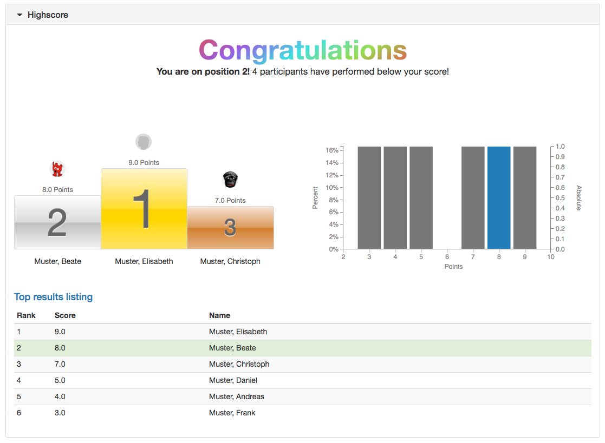

# Types of Course Elements

In OpenOlat, various course elements are available with which a course can be structured very flexibly and modularly according to the desired needs. In this way, course content can be structured and provided, collaborative work and exchange can be promoted, the knowledge level of the participants can be checked, and organizational concerns can be covered.

## Course elements at a glance

### Knowledge Transfer

The following course elements serve in particular to provide and structure course content. Depending on the module, certain externally created content can also be integrated.

	  [:fontawesome-solid-cubes: Structure](Course_Element_Structure.md)

    [:fontawesome-solid-file-lines: Page](Course_Element_Page.md)

    [:fontawesome-regular-file-lines: HTML-Page](Course_Element_HTML_Page.md)

    [:fontawesome-solid-up-right-from-square: External Page](Course_Element_External_Page.md)

    [:fontawesome-solid-box-archive: CP Learning Content](Course_Element_CP_Learning_Content.md)

    [:fontawesome-solid-box-archive: SCORM Learning Content](Course_Element_SCORM_Learning_Content.md)

    [:fontawesome-regular-file: Document](Course_Element_Document.md)

    [:fontawesome-regular-folder-open: Folder](Course_Element_Folder.md)

    [:fontawesome-solid-video: Podcast](Course_Element_Podcast.md)

    [:fontawesome-solid-bullhorn: Blog](Course_Element_Blog.md)

	  [:fontawesome-solid-film: Video](Course_Element_Video.md)

    [:fontawesome-solid-video: Video Livestream](Course_Element_Video_Livestream.md)

    [:octicons-arrow-right-24: Opencast](Course_Element_Opencast.md)

    [:octicons-arrow-right-24: edu-sharing](Course_Element_edu_Sharing.md)

    [:octicons-arrow-right-24: card2brain](Course_Element_card2brain_Flashcards.md)

    [:octicons-arrow-right-24: MediaSite](Course_Element_Mediasite.md)

    [:octicons-arrow-right-24: Edubase](Course_Element_Edubase.md)

    [:simple-jupyter: JupyterHub](Course_Element_JupyterHub.md)

### Assessment

The following course elements can be used in particular to test knowledge.

	  [:fontawesome-regular-thumbs-up: Assessment](Course_Element_Assessment.md)

    [:fontawesome-solid-bars-progress: Task](Course_Element_Task.md)

    [:fontawesome-solid-bars-progress: Group Task](Course_Element_Grouptask.md)

    [:fontawesome-solid-briefcase: Portfolio Task](Course_Element_Portfolio_Task.md)

    [:fontawesome-solid-square-pen: Test](Course_Element_Test.md)

    [:fontawesome-solid-square-pen: Self-test](Course_Element_Self_Test.md)

	  [:fontawesome-solid-futbol: Practice](Course_Element_Practice.md)

    [:octicons-arrow-right-24: Video Task](Course_Element_Video_Task.md)

    [:material-clipboard-file-outline: Form](Course_Element_Form.md)

    [:fontawesome-solid-sliders: Survey](Course_Element_Survey.md)

    [:fontawesome-regular-square-check: Checklist](Course_Element_Checklist.md)

Most of the course elements in the Assessment category are assessable and points can be assigned if needed. Then, further features such as the addition of points or the calculation of pass/fail for the course, based on the assessments of different course elements, can be added. The calculation for traditional courses is done through the course element [Structure](Course_Element_Structure.md) or at the top course node.

The configuration tab "Reminders" is available for all assessable elements of the knowledge check. Here, e-mails can be sent depending on the processing status of the respective course element, e.g. if an assignment or a test has not yet been processed on a certain date. The possibilities are similar to those in the menu ["Reminder"](../learningresources/Course_Reminders.md) in the course administration.

In addition, the course elements "Survey" and "Form" are assigned to the category "Knowledge check". These enable the integration of OpenOlat [forms](../learningresources/Form_editor_Questionnaire_editor.md) into the course in order to use them for teaching evaluations, general surveys, structured queries of certain information of the participants, etc.

#### Highscore  {: #highscore}

All assessable course elements, with the exception of "Practice" and "Structure", additionally receive the configuration tab "Highscore" if points are awarded at the element. The high score display enables a playful comparison of the participants and can be understood as a motivational factor.

First, "Show highscore" must be activated. Optionally, a start date can be added from which the highscore will be displayed. Without specifying the date, the high score will be displayed immediately after the test is finished.

It can be defined whether the user data is displayed anonymously or with first and last name and which elements of the highscore should be displayed. You can choose between the position display, the winner's podium, the histogram and the list of the best participants. For the list it is also possible to define whether all users or only a certain number of the best users should appear. At least one of these options must be selected.

### Communication and Collaboration

Course elements in this category are mainly used for collaborative work and exchange among each other. The course elements for virtual classrooms and online meetings are also assigned here.

	  [:fontawesome-solid-earth-americas: Wiki](Course_Element_Wiki.md)

    [:fontawesome-regular-comments: Forum](Course_Element_Forum.md)

    [:material-file-multiple-outline: File Dialog](Course_Element_File_Dialog.md)

    [:fontawesome-solid-inbox: Participant folder](Course_Element_Participant_Folder.md)

    [:fontawesome-solid-users: Participant list](Course_Element_Participant_List.md)

	[:fontawesome-solid-desktop: Vitero](Course_Element_vitero.md)

    [:fontawesome-solid-desktop: OpenMeetings](Course_Element_OpenMeetings.md)

    [:fontawesome-solid-desktop: Adobe Connect](Course_Element_Adobe_Connect.md)

    [:fontawesome-solid-desktop: GoToMeeting](Course_Element_GoToMeeting.md)

    [:fontawesome-solid-desktop: BigBlueButton](Course_Element_BigBlueButton.md)

    [:fontawesome-solid-desktop: Microsoft Teams](Course_Element_Microsoft_Teams.md)

    [:fontawesome-solid-desktop: Zoom](Course_Element_Zoom.md)

### Virtual Classrooms

With the course elements 
[Adobe Connect](../learningresources/Course_Element_Adobe_Connect.md),
[BigBlueButton](Course_Element_BigBlueButton.md),
[GoToMeeting](../learningresources/Course_Element_GoToMeeting.md),
[Microsoft Teams](Course_Element_Microsoft_Teams.md), [OpenMeetings](../learningresources/Course_Element_OpenMeetings.md), different [Virtual classrooms](../course_elements/Virtual_classrooms.md) can be used in OpenOlat for synchronous meetings, video conferences or webinars.

Which course element will be integrated and which functionalities will be available depends on which configuration your OpenOlat system administrator has selected.

A virtual room allows you to work online (synchronously) with several people who are geographically separated from you. Functions of virtual rooms include live chat, audio and video, desktop and document sharing. When entering a virtual room by means of a course element a new browser window will open in which the virtual session will take place.

To be able to use all functionalities you will need a headset and a connected camera. Depending on your system you might have to download additional software temporarily.

### Administration and Org

The following course elements are particularly suitable for organizational matters and for the distribution of information.

	  [:fontawesome-solid-right-to-bracket: Enrolment](Course_Element_Enrolment.md)

    [:fontawesome-solid-circle-info: Notifications](Course_Element_Notifications.md)

    [:fontawesome-regular-envelope: E-Mail](Course_Element_EMail.md)

    [:fontawesome-solid-clipboard-list: Topic Broker](Course_Element_Topic_Broker.md)

    [:fontawesome-regular-calendar-days: Calendar](Course_Element_Calendar.md)

    [:fontawesome-regular-calendar: Appointment scheduling](Course_Element_Appointment_Scheduling.md)

### Other

Additional building blocks can be found in the category "Other".

	  [:fontawesome-solid-up-right-from-square: LTI Page](Course_Element_LTI_Page.md)

    [:fontawesome-regular-circle: Topic Assignment](Course_Element_Topic_Assignment.md)

    [:octicons-link-24: Link list](Course_Element_Link_List.md)

    [:fontawesome-solid-arrows-turn-right: Selection](Course_Element_Selection.md)

## General information on course elements

All course elements have the tabs "**Title and description**" and "**Layout**". In addition, there are certain tabs that exist throughout depending on the technical course type. The tab "Learning path" only exists for learning path courses. The tabs "Visibility" and "Access" exist only for traditional courses.

In addition to the course elements, there are other tools and learning resources in OpenOlat courses that can be used to design courses. You will find references to them in the respective chapters.

## Performance assessment

A number of course elements can be used either for summative or formative assessment, or serves as performance control tool. The assessable course elements can be viewed in the [assessment tool](../learningresources/Using_Course_Tools.md#UsingCourseTools-_bewertungswerkzeug). Further information on these modules can be found, among other things, in the chapter ["Assessment"](../learningresources/Assessment.md):

* [Task](../learningresources/Assessment.md) (manual assessment)
* [Group task](../learningresources/Assessment.md)(Manual assessment)
* [Portfolio task](../learningresources/Assessment.md) (manual assessment)
* [Check list](../learningresources/Assessment.md) (manual & automatic assessment)
* [Assessment](../learningresources/Assessment.md) (manual assessment)
* [LTI](../learningresources/Other.md) (automatic assessment, transferred from LTI page)
* [SCORM](../learningresources/Knowledge_Transfer.md) (automatic assessment, transferred from SCORM module)
* [Test](../learningresources/Assessment.md#Assessment-_test_kursbaustein) (automatic & manual assessment)
