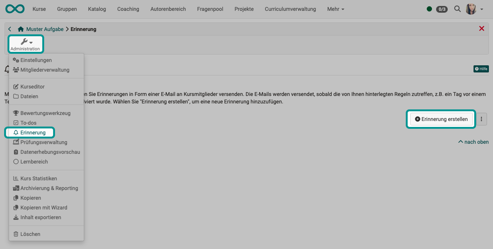
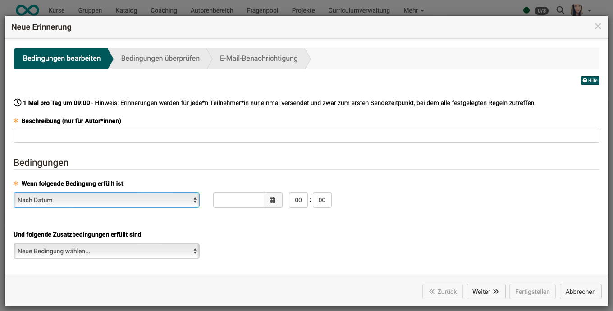
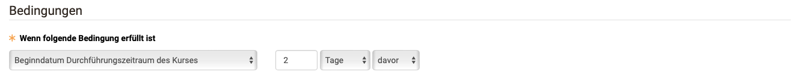
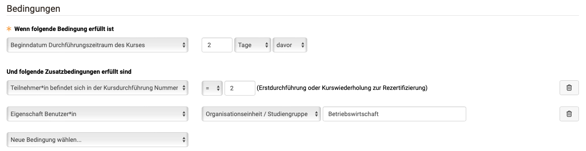
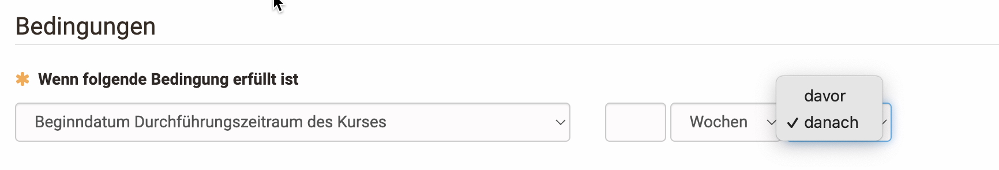
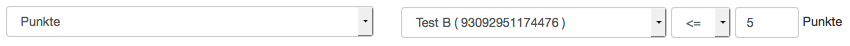
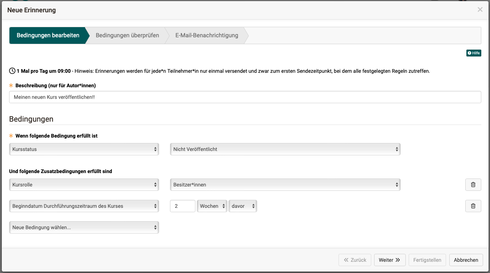
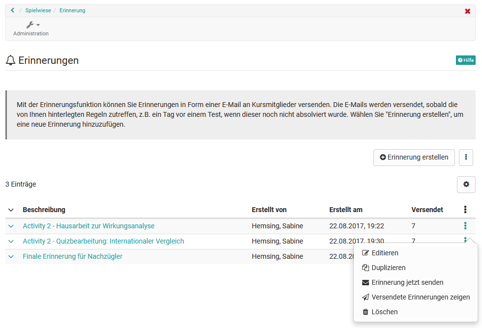

# Erinnerungen {: #course_reminders}

Mit der Erinnerungsfunktion wird der automatische Versand von Mails organisiert.

{ class="shadow lightbox" }

Zusätzlich zum Weg über die Kursadministration können für bestimmte bewertbare Kursbausteine Erinnerungen auch direkt bei dem jeweiligen Kursbaustein eingerichtet werden. In diesem Fall ist der entsprechenden Kursbaustein bereits vorgewählt. So kann beispielweise rasch eine Erinnerung für Lernende erstellt werden, die einen bestimmten Test noch gar nicht durchgeführt haben (Versuche  = 0). Oder es kann eine E-Mail an alle Personen verschickt werden, die eine Aufgabe bestanden haben.

[Zum Seitenanfang ^](#course_reminders)

---

## Erinnerung erstellen {: #create}

Als Kursbesitzer:in definieren Sie in einer Regelliste,

* unter welchen **Bedingungen** die Erinnerung verschickt werden soll 
* den **Mailtext**
* an **wen** die Erinnerung verschickt werden soll

Sobald die Bedingungen erfüllt sind, werden die Mails automatisch zum Versand freigegeben. Die genaue Sendezeit und Häufigkeit wird von Ihrem Systemadministrator systemweit festgelegt. 

Klicken Sie dazu auf die **Schaltfläche "Erinnerung erstellen"**. Es erscheint ein Wizard, der Sie Schritt für Schritt durch den Erstellungsprozess führt.

{ class="shadow lightbox" }

Geben Sie als erstes die Beschreibung für die Erinnerung ein. Diese Beschreibung ist nur für die Autor:innen sichtbar und dient der übersichtlichen und informativen Darstellung aller Erinnerungen eines Kurses. Wählen Sie dann die Bedingungen für den Versand aus.

Im zweiten Schritt des Wizards werden die Bedingungen überprüft und noch einmal angezeigt. 

Im letzten Schritt geben Sie dann den E-Mail Text ein und können auswählen, ob auch Betreuer:innen oder Besitzer:innen eine Kopie erhalten sollen oder eine Kopie an eine externe Adresse verschickt werden soll.

[Zum Seitenanfang ^](#course_reminders)

---

## Bedingungen für den Versand von Erinnerungen {: #conditions}

Die Bedingungen können aus einem Dropdown-Menü gewählt werden. Je nach Bedingung erscheint rechts daneben ein weiteres Eingabefeld für genauere Angaben.

{ class="shadow lightbox" }

Mehrere Bedingungen können nach Wunsch kombiniert werden können. Dadurch können auf den individuellen Bedarf zugeschnittene Erinnerungen ausgelöst werden. Es muss aber mindestens ein Kriterium gewählt werden, damit ein Versand ausgelöst werden kann.

{ class="shadow lightbox" }

!!! info "Hinweis"

    Bei der Verknüpfung handelt es sich um eine "und" Verknüpfung. Das heißt, nur wenn alle Bedingungen erfüllt sind, wird die Erinnerungsmail ausgelöst.

Es können folgende Kriterien als Bedingung konfiguriert werden:

* **Einschreibedatum** 
Versand x Tage, Wochen, Monate oder Jahre danach 
_Beispiel_: Benutzer:innen erhalten 2 Tage nach der Einschreibung zusätzliche Informationen zum Kurs. (Vorausgesetzt auch die übrigen Bedingungen werden erfüllt.)  

* **Kursstatus** 
Wählen Sie, in welchem Status sich der Kurs befinden muss, damit eine Erinnerung verschickt wird. 

    * Vorbereitung
    * Review
    * Freigabe Betreuer:innen
    * Veröffentlicht
    * Nicht Vorbereitung
    * Nicht Review
    * Nicht Freigabe Betreuer:innen
    * Nicht Veröffentlicht
  
_Beispiel_: Nur wenn der Kurs den Status "Freigabe Betreuer:innen" hat, erhalten alle Betreuer:innen eine Info-Mail über ihre Betreuungsaufgabe.

* **Beginndatum Durchführungszeitraum des Kurses** 
x Tage, Wochen, Monate oder Jahre davor oder danach

* **Enddatum Durchführungszeitraum des Kurses** 
x Tage, Wochen, Monate oder Jahre davor oder danach

* **Erster Kursbesuch** 
x Tage, Wochen, Monate oder Jahre danach

* **Letzter Kursbesuch** 
x Tage, Wochen, Monate oder Jahre danach

* **Teilnehmer:in befindet sich in der Kursdurchführung Nummer** 
Siehe Hinweis zu Operatoren

* **Fortschritt** 
Nur bei [Lernpfad Kursen](../learningresources/Learning_path_course.de.md).
Hier erfolgt der Versand basierend auf dem prozentualen Kursfortschritt der Teilnehmenden, wie er in den Einstellungen der Administration konfiguriert wurde. 
_Beispiel_: Benutzer die mindestens 80% eines Kurses erfolgreich abgeschlossen haben. 
Siehe Hinweis zu Operatoren

* **Ausstellungsdatum Zertifikat** 
Diese Option wird nur angezeigt, wenn die Zertifikatvergabe aktiviert ist (Kursadministration > Einstellungen > Tab "Bewertung").

* **Ablaufdatum Zertifikat** 
Diese Option wird nur angezeigt, wenn die Zertifikatvergabe aktiviert ist (Kursadministration > Einstellungen > Tab "Bewertung").

---

* **Gruppenmitglieder** 
Auswahl einer bestimmten Gruppe. Nur deren Gruppenmitglieder erhalten die Mail. 

* **Kursrolle** 
Die Erinnerungsempfänger:innen müssen eine der folgenden Rollen innehaben:

    * Besitzer:innen
    * Betreuer:innen
    * Teilnehmer:innen
    * Betreuer:innen und Teilnehmer:innen
    * Besitzer:innen und Betreuer:innen
    * Mitglieder

    _Beispiel_: Nur Besitzer:innen und Betreuer:innen erhalten eine Erinnerung.  

* **Eigenschaft Benutzer:in** 
Die Erinnerungsempfänger:innen müssen einen bestimmten Wert zu einem der folgenden Merkmale aufweisen:

    * Postleitzahl
    * Region / Kanton
    * Stadt
    * Land
    * Institution
    * Institutionsnummer (Matrikelnummer)
    * Institutions-E-Mail
    * Organisationseinheit / Studiengruppe
    * Studienfach
    
    _Beispiel_: Benutzer aus der Stadt Zürich.  
  

---

* **Bis Datum** 
Eingabefelder für Datum und Uhrzeit, als Eingabehilfe Button zur Anzeige des Kalenders

* **Nach Datum** 
Eingabefelder für Datum und Uhrzeit, als Eingabhilfe Button zur Anzeige des Kalenders

!!! info "Wann wird die Mail verschickt, wenn ich hier ein Datum angebe?"

    Der Versand der Kurserinnerungen findet nicht sofort statt. Alle Erinnerungsmails werden gemeinsam z.B. täglich um 9.00 Uhr verschickt. Dies ist eine Voreinstellung und kann von Administrator:innen geändert und bis auf "stündlich" angepasst werden (Administration > Module > Kurserinnerungen). 
    Zum Versandzeitpunkt prüft OpenOlat jeweils, welche Bedingungen erfüllt sind und verschickt entsprechend die Mails. Es werden dann alle Kurserinnerungen verschickt, die z.B. um 9.00 die Bedingungen erfüllen ("im Ausgangskorb liegen").

    Wenn **"Bis Datum"** abgeprüft wird, kann die Bedingung zum Zeitpunkt der Reminder-Erstellung schon erfüllt sein und es werden Mails verschickt. Sinn macht diese Einstellung vor allem in Verbindung mit einer weiteren Bedingung, z.B. Wenn "bis Datum" "der Test bestanden wurde", wird eine Mail verschickt "Sie haben sich termingerecht qualifiziert und erhalten dafür ...".
    
    Wenn **"Nach Datum"** mit einem Datum nach dem Zeitpunkt der Reminder-Erstellung verwendet wird, werden die Mails im "Ausgangskorb" zum erstmöglichen Versandtermin verschickt, wenn das "Nach Datum" erreicht wurde.

---

* **Datum des letzten Versuchs** 
Diese Option betrifft nur bewertbare Kursbausteine.
    * Dropdown zur Auswahl eines bewertbaren Kursbausteins
    * x Tage, Wochen, Monate oder Jahre danach

* **Versuche** 
Diese Option betrifft nur bewertbare Kursbausteine. Hier wird die Anzahl der Lösungsversuche für den Mailversand berücksichtigt. 
_Beispiel_: Ein Test wurde noch kein Mal (0) durchgeführt.

* **Bestanden** 
Diese Option betrifft nur bewertbare Kursbausteine, für die ein Bestanden-Status im Editor konfiguriert wurde. Dieser kann hier als Bedingung ausgewählt werden. 
_Beispiel_: Ein Test-Kursbaustein wurde mit "Bestanden" bewertet.

* **Punkte** 
Diese Option betrifft nur bewertbare Kursbausteine, für die eine Punktezahl im Editor konfiguriert wurde. Diese können hier als Bedingung ausgewählt werden. 
_Beispiel_: In einer Checkliste wurden weniger als 3 Punkte erreicht.

---

* **Termin: Aufgabe Zuweisung** 
Diese Option betrifft nur Kursbausteine vom Typ "Aufgabe".

* **Termin: Aufgabe Dokumente abgeben** 
Diese Option betrifft nur Kursbausteine vom Typ "Aufgabe". Wenn dort eine bearbeitete Aufgabe hochgeladen werden kann, kann eine Bedingung für eine Erinnerung sich auf den Abgabezeitpunkt der Aufgabendokumente beziehen.

* **Termin: Aufgabe Peer-Review Abgabe** 
Diese Option betrifft nur Kursbausteine vom Typ "Aufgabe". Wenn dort ein Peer-Review konfiguriert ist, kann eine Bedingung sich auf den Abgabezeitpunkt des Peer-Reviews beziehen.

---

* **Termin: Formular ausfüllen** 
Diese Option betrifft nur Kursbausteine vom Typ "Formular".

!!! info "Option davor/danach"

    Für Bedingungen, welche zu einem Datum eine Angabe "davor" oder "danach" benötigen, wird dies als Auswahlliste zur Verfügung gestellt.
    { class="shadow" }

!!! info "Datum"

    Zum eingetragenen Datum (inkl. Uhrzeit) wird die Erinnerung zur nächst möglichen Sendezeit verschickt. Wird das "bis Datum" verwendet, so wird die Erinnerung zum nächstmöglichen Sendezeitpunkt gesendet, bis das Datum (und die Uhrzeit) erreicht ist. 
    _Beispiel_: 24.06.2021 16:30  

!!! info "Zeitspanne"

    Diese Bedingungen bauen darauf auf, wie lange etwas schon her ist, oder wie lange ein bestimmter Zeitpunkt noch entfernt ist.
    
    _Beispiel_: 5 Wochen bevor die Zuweisung für die Gruppenaufgabe schliesst.
    
    _Beispiel_: 5 Tage nachdem der User den Kurs zum ersten Mal aufgerufen hat.  
  

!!! info "Operatoren"

    Für die Bedingungen "Teilnehmer:in befindet sich in der Kursdurchführung Nummer", "Versuche" und "Punkte" werden Operatoren benötigt um die verschiedenen Zustände "mehr als, weniger als, weniger oder gleich, mehr oder gleich, gleich" und "ungleich" korrekt darzustellen. Sie dienen dazu Ausdrücke miteinander zu vergleichen, und in Abhängigkeit davon einen logischen Rückgabewert zu erzeugen.

    Operator | Bezeichnung | Erklärung
    ---------|----------|---------
    `<` | kleiner | korrekt wenn a kleiner b ist
    `<=`| kleiner gleich| korrekt, wenn a kleiner oder gleich b ist
    `=`| gleich| korrekt, wenn a gleich b ist
    `=>`| grösser gleich| korrekt, wenn a grösser oder gleich b ist
    `>`| grösser| korrekt, wenn a grösser b ist
    `!=`| ungleich| korrekt, wenn a ungleich b ist

    In unseren Bedingungen wird in diesem Fall z.B. das Ergebnis eines Testes (a) mit dem eingegebenen Wert in der Bedingungsregel (b) verglichen. Ist der logische Rückgabewert "True", also trifft die Bedingung zu, dann wird die Erinnerung ausgelöst.  

    _Beispiel:_ Eine Erinnerung soll verschickt werden, wenn ein Teilnehmer in einem Test maximal 5 Punkte erreicht hat. In OpenOlat sieht die Bedingung dann folgendermassen aus:
    { class="shadow" }

[Zum Seitenanfang ^](#course_reminders)

---

## E-Mail Text {: #text}

Mit Hilfe des E-Mail-Textes, der nach Bedarf angepasst werden kann, erstellen Sie ganz spezifische, auf die Situation angepasste E-Mail-Erinnerungen.

!!! tip "Tipp"

    Am besten verwenden Sie die bereits eingetragenen Variablen um die Erinnerung so persönlich und hilfreich wie möglich zu gestalten.

* **$firstName**: Der Vorname des Benutzers
* **$lastName**: Der Nachname des Benutzers
* **$fullName**: Der vollständige Name je nach Systemkonfiguration. Der Standardwert ist "Nachname, Vorname"
* **$email**: Die Emailadresse des Benutzers
* **$userName**: Der Benutzername
* **$courseUrl**: Die Internetadresse des Kurses
* **$courseName**: Der Name des Kurses wie auf der Infoseite
* **$courseDescription**: Die Beschreibung des Kurses wie auf der Infoseite

Hier ein Beispiel:

{ class="shadow" }

Am obersten Kursknoten werden zusätzlich alle Erinnerungen aufgelistet, die an keinen bestimmten Kursbaustein gebunden sind. Auch können sowohl hier als auch bei anderen Assessment Bausteinen mit dem Tab "Erinnerungen" weitere Konfigurationen vorgenommen werden, z.B. konfigurierte Erinnerungen editiert, dupliziert, versendet, gelöscht werden. Auch die Anzeige des Versands ist möglich.

[Zum Seitenanfang ^](#course_reminders)

---

## Empfänger {: #recipients}

Erinnerungen sind gut geeignet, um **Kursteilnehmer:innen** daran zu erinnern, was sie als nächstes erledigen sollten.
Eine **Kopie an die Betreuer:innen und/oder Kursbesitzer:innen** informiert auch diese, dass Teilnehmer:innen etwas zu erledigen haben.

In manchen Fällen sollen Erinnerungen **ausschliesslich an Betreuer:innen** geschickt werden. 
**Beispiel:** 
Kursteilnehmer:innen zeigen keinen Fortschritt. Der/die Betreuer:in sollte dann Kontakt mit diesen Kursteilnehmer:innen aufnehmen und Hilfestellung leisten. Die Erinnerung dazu sollte nur an den/die Betreuer:in gehen. Sie könnten als Bedingungen z.B. eingeben, dass der Fortschritt noch unter x% ist und gleichzeitig ein bestimmter Punktewert in einem Eingangstest nicht erreicht wurde.

Ebenso können Erinnerungen auch **ausschliesslich an die Kursbesitzer:innen** versandt werden. 
**Beispiel:** 
Manchmal vergessen Autor:innen ihren Kurs zu publizieren, weil noch Dinge unklar waren als sie das letzte Mal an der Kurserstellung gearbeitet haben. In diesem Fall kann der Kursstatus in Kombination mit der Rolle als Versandkriterium verwendet werden.

{ class="shadow lightbox" }

[Zum Seitenanfang ^](#course_reminders)

---

## Erinnerungen kontrollieren und bearbeiten {: #check_and_edit}

Wurden bereits Erinnerungen erstellt, sind diese unter **Administration > Erinnerungen** aufgelistet.
Auf der Übersichtsseite sehen Sie alle für diesen Kurs bereits erstellten Erinnerungen und können sich auch bereits versendete Erinnerungen anzeigen lassen. Die Liste der bereits versendeten Erinnerungen enthält Informationen zum Empfänger sowie die Sendezeit. Einzelne Erinnerungen aus dieser Liste können über den Link "Wieder schicken" einfach verschickt werden.

{ class="shadow" }

Neue Erinnerungen können jederzeit erstellt werden.

Soll z.B. eine einzelne Bedingung für den Versand entfernt werden, finden Sie im Bearbeitungsmodus die Buttons zum Löschen einer einzelnen Bedingung rechts neben der jeweiligen Bedingung. 

Erinnerungen können auch gezielt und wiederholt ausgelöst werden. Dabei werden Erinnerungen aber dennoch nur an jene Benutzer geschickt, für die alle Bedingungen als erfüllt gelten.

[Zum Seitenanfang ^](#course_reminders)

---

## Weiterführende Informationen  {: #further_information}

[Persönliches Menü: E-Mail >](../personal_menu/E-Mail.de.md) 
[Kursbaustein Mitteilungen >](../learningresources/Course_Element_Notifications.de.md) 
[Teilnehmer Infos >](../learningresources/Using_Additional_Course_Features.de.md#teilnehmer-infos) 

