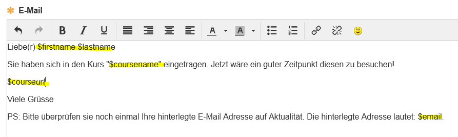

# Erinnerungen {: #course_reminders}

Mit der Erinnerungsfunktion wird der automatische Versand von Mails organisiert.

{ class="shadow lightbox" }

Unter Kursadministration → Erinnerung werden alle Erinnerungen eines Kurses angezeigt und können dort auch erstellt werden. Zusätzlich gibt es bei allen Kursbausteinen, die mit der Erinnerungsfunktion verknüpft werden können, einen eigenen Tab „Erinnerungen“ direkt am Baustein.

Erinnerungen, die nicht an einen bestimmten Kursbaustein gebunden sind, finden Sie im Kurseditor beim obersten Kursbaustein – ebenfalls im Tab „Erinnerungen“.

An all diesen Stellen können Erinnerungen erstellt, angezeigt, bearbeitet und der Versand überprüft werden.

[Zum Seitenanfang ^](#course_reminders)

---

## Erinnerung erstellen {: #create}

Als Kursbesitzer:in definieren Sie 

* unter welchen **Bedingungen** die Erinnerung verschickt werden soll 
* den **Mailtext**
* an **wen** die Erinnerung verschickt werden soll

Um eine Erinnerung zu erstellen klicken Sie auf die **Schaltfläche "Erinnerung erstellen"**. Es erscheint ein Wizard, der Sie Schritt für Schritt durch den Erstellungsprozess führt.

{ class="shadow lightbox" }

**Schritt: Bedingungen bearbeiten**

Geben Sie als erstes die Beschreibung für die Erinnerung ein. Diese Beschreibung ist nur für die Autor:innen sichtbar und dient der übersichtlichen und informativen Darstellung der Erinnerungen eines Kurses. Wählen Sie dann die Bedingungen für den Versand aus.

**Schritt: Bedingungen überprüfen**

Im zweiten Schritt des Wizards werden die Bedingungen überprüft und noch einmal angezeigt an wen gemäß der Konfiguration die Erinnerung versandt würde. 

**Schritt: E-Mail Benachrichtigung**

Im letzten Schritt geben Sie dann den zu versendenden E-Mail-Text ein und können auswählen ob die Erinnerungen an alle Personen des Kurses auf die die definierten Regeln zutreffen versandt werden sollen. Optional dazu kann noch eine Kopie an Kursbesitzer:innen, Betreuende oder Personen mit einer externen Mail-Adresse verschickt werden.

Alternativ kann die erstellte Erinnerung auch nur an die Besitzer:innen, zuständige Betreuer:innen oder externe E-Mail-Adressen versandt werden. Diese Option bietet sich vor allem für Test-Erinnerungen oder spezifische Erinnerungen für Lehrpersonen an.

Sobald die Bedingungen für eine Erinnerung erfüllt sind, werden die Mails automatisch zum Versand freigegeben. Die genaue Sendezeit und Häufigkeit wird von Ihrem Systemadministrator systemweit festgelegt. 

[Zum Seitenanfang ^](#course_reminders)

---

## Bedingungen für den Versand von Erinnerungen {: #conditions}

Entscheidend für die zu versendenden Erinnerungen sind die konkreten Bedingungen. Hier bietet OpenOlat jede Menge Möglichkeiten. Die konkreten Bedingungen können aus einem Dropdown-Menü gewählt werden. Je nach Bedingung erscheint rechts daneben ein weiteres Eingabefeld für genauere Angaben.

{ class="shadow lightbox" }

Mehrere Bedingungen können nach Wunsch kombiniert werden können. Dadurch können auf den individuellen Bedarf zugeschnittene Erinnerungen ausgelöst werden. Es muss aber mindestens ein Kriterium gewählt werden, damit ein Versand ausgelöst werden kann.

{ class="shadow lightbox" }

!!! info "Hinweis"

    Bei der Verknüpfung handelt es sich um eine "und" Verknüpfung. Das heißt, nur wenn **alle** Bedingungen erfüllt sind, wird die Erinnerungsmail ausgelöst.

Es können folgende Kriterien als Bedingung konfiguriert werden:

* **Einschreibedatum** 
Versand x Tage, Wochen, Monate oder Jahre danach 
_Beispiel_: Benutzer:innen erhalten 2 Tage nach der Einschreibung zusätzliche Informationen zum Kurs. 

* **Kursstatus** 
Wählen Sie, in welchem Status sich der Kurs befinden muss, damit eine Erinnerung verschickt wird. 

    * Vorbereitung
    * Review
    * Freigabe Betreuer:innen
    * Veröffentlicht
    * Nicht Vorbereitung
    * Nicht Review
    * Nicht Freigabe Betreuer:innen
    * Nicht Veröffentlicht
  
    _Beispiel_: Nur wenn der Kurs den Status "Freigabe Betreuer:innen" hat, erhalten alle Betreuer:innen eine Info-Mail über ihre Betreuungsaufgabe.

* **Beginndatum Durchführungszeitraum des Kurses** 
x Tage, Wochen, Monate oder Jahre davor oder danach

* **Enddatum Durchführungszeitraum des Kurses** 
x Tage, Wochen, Monate oder Jahre davor oder danach

* **Erster Kursbesuch** 
x Tage, Wochen, Monate oder Jahre danach

* **Letzter Kursbesuch** 
x Tage, Wochen, Monate oder Jahre danach

* **Teilnehmer:in befindet sich in der Kursdurchführung Nummer** 
Hier geht es um die Erstdurchführung oder Kurswiederholung zur Rezertifizierung. 

    _Beispiel_: Kursteilnehmende die den Kurs das zweite Mal durchlaufen erhalten eine Erinnerungsmail.

* **Fortschritt** 
Diese Option gibt es nur bei [Lernpfad Kursen](../learningresources/Learning_path_course.de.md).
Hier erfolgt der Versand basierend auf dem prozentualen Kursfortschritt der Teilnehmenden, wie er in den Einstellungen der Kurs-Administration konfiguriert wurde. 
_Beispiel_: Lernende, die mindestens 80% eines Kurses erfolgreich erledigt haben erhalten eine Motivationsmail um noch bald die letzten 20% zu erledigen.

* **Ausstellungsdatum Zertifikat** 
Diese Option wird nur angezeigt, wenn die Zertifikatvergabe aktiviert ist (Kursadministration > Einstellungen > Tab "Bewertung"). 
_Beispiel_: Die Mail wird versandt 1 Tag nachdem ein Zertifikat ausgestellt wurde.

* **Ablaufdatum Zertifikat** 
Diese Option wird nur angezeigt, wenn die Zertifikatvergabe aktiviert ist (Kursadministration > Einstellungen > Tab "Bewertung"). _Beispiel_: Die Mail wird versandt 2 Wochen bevor das Zertifikat abläuft, so dass die Teilnehmenden daran erinnert werden die für das Zertifikat notwendigen Aktivitäten durchzuführen bevor das Zertifikat abläuft.

---

* **Gruppenmitglieder** 
Auswahl einer bestimmten Gruppe. Nur deren Gruppenmitglieder erhalten die Mail. 

* **Kursrolle** 
Die Erinnerungsempfänger:innen müssen eine der folgenden Rollen innehaben:

    * Besitzer:innen
    * Betreuer:innen
    * Teilnehmer:innen
    * Betreuer:innen und Teilnehmer:innen
    * Besitzer:innen und Betreuer:innen
    * Mitglieder

    _Beispiel_: Nur Besitzer:innen und Betreuer:innen erhalten eine Erinnerung.  

* **Eigenschaft Benutzer:in** 
Die Erinnerungsempfänger:innen müssen einen bestimmten Wert zu einem der folgenden Merkmale aufweisen:

    * Postleitzahl
    * Region / Kanton
    * Stadt
    * Land
    * Institution
    * Institutionsnummer (Matrikelnummer)
    * Institutions-E-Mail
    * Organisationseinheit / Studiengruppe
    * Studienfach

    _Beispiel_: Benutzer aus der Stadt Zürich.  

    Voraussetzung ist, dass die Angaben auch eingetragen bzw. übertragen wurden.
  

---

* **Bis Datum** 
Eingabefelder für Datum und Uhrzeit, als Eingabehilfe Button zur Anzeige des Kalenders. Diese Bedingung eignet sich häufig für die Kombination mit anderen Bedingungen.

* **Nach Datum** 
Eingabefelder für Datum und Uhrzeit, als Eingaehilfe Button zur Anzeige des Kalenders. Diese Bedingung eignet sich häufig für die Kombination mit anderen Bedingungen, z.B. wenn bis zu einem bestimmten Termin ein bestimmter Kursfortschritt nicht erreicht wurde.

---

* **Datum des letzten Versuchs** 
Diese Option bezieht sich auf bewertbare Kursbausteine.
    * In der Dropdown-Liste werden die möglichen Kursbausteine, die berücksichtigt werden können, angezeigt. 
    * x Tage, Wochen, Monate oder Jahre danach 
    _Beispiel_: Die Erinnerung wird verschickt 1 Woche nachdem ein bestimmter Test ausgefüllt wurde.

* **Versuche** 
Diese Option betrifft nur bewertbare Kursbausteine. Hier wird die Anzahl der Lösungsversuche für den Mailversand berücksichtigt. 
_Beispiel_: Ein Test wurde noch kein Mal (0) durchgeführt.

* **Bestanden** 
Diese Option betrifft nur bewertbare Kursbausteine, für die ein Bestanden-Status im Editor konfiguriert wurde. Dieser kann hier als Bedingung ausgewählt werden. 
_Beispiel_: Ein Test-Kursbaustein wurde mit "Bestanden" bewertet.

* **Punkte** 
Diese Option betrifft nur bewertbare Kursbausteine, für die eine Punktezahl definiert wurde. Der Versand kann dann in Abhängigkeit einer Punktzahl erfolgen.  
_Beispiel_: In einer Checkliste wurden weniger als 3 Punkte erreicht.

---

* **Termin: Aufgabe Zuweisung** 
Diese Option betrifft nur Kursbausteine vom Typ "Aufgabe", bei denen auch die Aufgabenstellung im Kursbaustein abgelegt wurde und ein Termin für die Zuweisung zugeordnet wurde. Der Versand der Erinnerungsmail bezieht sich dann auf den im Kurseditor hinterlegten Termin, z.B. 
x Tage, Wochen, Monate davor. 

* **Termin: Aufgabe Dokumente abgeben** 
Diese Option betrifft nur Kursbausteine vom Typ "Aufgabe" bei denen die "Abgabe" in der Workflow-Konfiguration aktiviert wurde. Eine Erinnerungsmail kann dann x Tage, Wochen, Monate vor dem Abgabetermin verschickt werden. 

* **Termin: Aufgabe Peer-Review Abgabe** 
Diese Option betrifft nur Kursbausteine vom Typ "Aufgabe" bei denen im Workflow die Peer-Review Funktion aktiviert wurde und ein "bis" Datum mit dem Review verknüpft wurde. 
_Beispiel_: Eine Erinnerung wird 3 Tage vor dem finalen Peer-Review Endtermin verschickt.

---

* **Termin: Formular ausfüllen** 
Diese Option betrifft nur Kursbausteine vom Typ "Formular" bei denen im Kurseditor ein Endtermin für das Ausfüllen hinterlegt wurde. 
_Beispiel_: Eine Erinnerung wird 2 Tage vor der Ausfülldeadline für das Formular verschickt.

## Hinweise zur Konfiguration der Erinnerungen

!!! info "Wann wird die Mail verschickt, wenn ich hier ein Datum angebe?"

    Der Versand der Kurserinnerungen findet nicht sofort statt. Alle Erinnerungsmails werden gemeinsam z.B. täglich um 9.00 Uhr verschickt. Dies ist eine Voreinstellung und kann von Administrator:innen geändert und bis auf "stündlich" angepasst werden (Administration > Module > Kurserinnerungen). 
    Zum Versandzeitpunkt prüft OpenOlat jeweils, welche Bedingungen erfüllt sind und verschickt entsprechend die Mails. Es werden dann alle Kurserinnerungen verschickt, die z.B. um 9.00 die Bedingungen erfüllen ("im Ausgangskorb liegen").

    Wenn **"Bis Datum"** abgeprüft wird, kann die Bedingung zum Zeitpunkt der Reminder-Erstellung schon erfüllt sein und es werden Mails verschickt. Sinn macht diese Einstellung vor allem in Verbindung mit einer weiteren Bedingung, z.B. Wenn "bis Datum" "der Test bestanden wurde", wird eine Mail verschickt "Sie haben sich termingerecht qualifiziert und erhalten dafür ...".
    
    Wenn **"Nach Datum"** mit einem Datum nach dem Zeitpunkt der Reminder-Erstellung verwendet wird, werden die Mails im "Ausgangskorb" zum erstmöglichen Versandtermin verschickt, wenn das "Nach Datum" erreicht wurde.

!!! info "Option davor/danach"

    Für Bedingungen, welche zu einem Datum eine Angabe "davor" oder "danach" benötigen, wird dies als Auswahlliste zur Verfügung gestellt.
    { class="shadow" }

!!! info "Datum"

    Zum eingetragenen Datum (inkl. Uhrzeit) wird die Erinnerung zur nächst möglichen Sendezeit verschickt. Wird das "bis Datum" verwendet, so wird die Erinnerung zum nächstmöglichen Sendezeitpunkt gesendet, bis das Datum (und die Uhrzeit) erreicht ist. 
    _Beispiel_: 24.06.2021 16:30  

!!! info "Zeitspanne"

    Diese Bedingungen bauen darauf auf, wie lange etwas schon her ist, oder wie lange ein bestimmter Zeitpunkt noch entfernt ist.
    
    _Beispiel_: 5 Wochen bevor die Zuweisung für die Gruppenaufgabe schliesst.
    
    _Beispiel_: 5 Tage nachdem der User den Kurs zum ersten Mal aufgerufen hat.  
  

!!! info "Operatoren"

    Für die Bedingungen "Teilnehmer:in befindet sich in der Kursdurchführung Nummer", "Versuche" und "Punkte" werden Operatoren benötigt um die verschiedenen Zustände "mehr als, weniger als, weniger oder gleich, mehr oder gleich, gleich" und "ungleich" korrekt darzustellen. Sie dienen dazu Ausdrücke miteinander zu vergleichen, und in Abhängigkeit davon einen logischen Rückgabewert zu erzeugen.

    Operator | Bezeichnung | Erklärung
    ---------|----------|---------
    `<` | kleiner | korrekt wenn a kleiner b ist
    `<=`| kleiner gleich| korrekt, wenn a kleiner oder gleich b ist
    `=`| gleich| korrekt, wenn a gleich b ist
    `=>`| grösser gleich| korrekt, wenn a grösser oder gleich b ist
    `>`| grösser| korrekt, wenn a grösser b ist
    `!=`| ungleich| korrekt, wenn a ungleich b ist

    In unseren Bedingungen wird in diesem Fall z.B. das Ergebnis eines Testes (a) mit dem eingegebenen Wert in der Bedingungsregel (b) verglichen. Ist der logische Rückgabewert "True", also trifft die Bedingung zu, dann wird die Erinnerung ausgelöst.  

    _Beispiel:_ Eine Erinnerung soll verschickt werden, wenn ein Teilnehmer in einem Test maximal 5 Punkte erreicht hat. In OpenOlat sieht die Bedingung dann folgendermassen aus:
    { class="shadow" }

[Zum Seitenanfang ^](#course_reminders)

---

## E-Mail Text {: #text}

Mit Hilfe des E-Mail-Textes, der nach Bedarf angepasst werden kann, erstellen Sie ganz spezifische, auf die Situation angepasste E-Mail-Erinnerungen.

!!! tip "Tipp"

    Durch Bewegen des Mauszeigers auf das kleine Fragezeichensymbol werden Ihnen die verfügbaren Variablen angezeigt.

    { class="shadow lightbox" }

### Im Betreff verfügbare Variablen

* **$courseName**: Der Name des Kurses wie auf der Infoseite.
* **$courseAuthors**: Die Namen, die in den Kurseinstellungen, Tab "Metadaten" unter "Autor:innen/Durchführung mit" eingegeben wurde.
* **$courseExecPeriodStart**: Das Datum, das in den Kurseinstellungen, Tab "Durchführung" als Beginn des Durchführungzeitraum angegeben wurde.
* **$courseExecPeriodEnd**: Das Datum, das in den Kurseinstellungen, Tab "Durchführung" als Ende des Durchführungzeitraum angegeben wurde.
* **$courseLocation**: Der Text, der in den Kurseinstellungen, Tab "Durchführung" als Durchführungsort eingegeben wurde.

### Im Mailtext verfügbare Variablen

* **$firstName**: Der Vorname des Benutzers.
* **$lastName**: Der Nachname des Benutzers.
* **$fullName**: Der vollständige Name je nach Systemkonfiguration. Der Standardwert ist "Nachname, Vorname".
* **$email**: Die E-mail-Adresse des Benutzers.
* **$userName**: Der Benutzername.
* **$courseUrl**: Die Internetadresse des Kurses.
* **$courseName**: Der Name des Kurses wie auf der Infoseite.
* **$courseDescription**: Die Beschreibung des Kurses wie auf der Infoseite.
* **$courseAuthors**: Die Namen, die in den Kurseinstellungen, Tab "Metadaten" unter "Autor:innen/Durchführung mit" eingegeben wurde.
* **$courseCertification**: Die Beschreibung der Bescheinigung, wie sie in den Kurseinstellungen, Tab "Info" angegeben wurde.
* **$courseExecPeriodStart**: Das Datum, das in den Kurseinstellungen, Tab "Durchführung" als Beginn des Durchführungzeitraum angegeben wurde.
* **$courseExecPeriodEnd**: Das Datum, das in den Kurseinstellungen, Tab "Durchführung" als Ende des Durchführungzeitraum angegeben wurde.
* **$courseExpOfWork**: Der geschätzte Zeitaufwand, der in den Kurseinstellungen, Tab "Metadaten" unter "Zeitaufwand" als Text eingegeben wurde.
* **$courseLocation**: Der Text, der in den Kurseinstellungen, Tab "Durchführung" als Durchführungsort eingegeben wurde.
* **$courseMainLang**: Die Sprache, die in den Kurseinstellungen, Tab "Metadaten" unter "Hauptsprache" eingegeben wurde.
* **$courseObjectives**: Der Text, der in den Kurseinstellungen, Tab "Info" als Lernzielbeschreibung eingegeben wurde.
* **$courseReference**: Der Text, der in den Kurseinstellungen im Tab "Info" unter "Kennzeichen" eingegeben wurde.
* **$courseRequirements**: Der Text, der in den Kurseinstellungen im Tab "Info" unter "Voraussetzungen" eingegeben wurde.
* **$courseTeaser**: Der Teaser-Text, der in den Kurseinstellungen im Tab "Info" eingegeben wurde.
* **$recipientFirstName**: siehe [Beispiel](../../manual_how-to/progress_information/progress_information.de.md#by_reminders)  
* **$recipientLastName**: siehe [Beispiel](../../manual_how-to/progress_information/progress_information.de.md#by_reminders) 

Hier ein Beispiel:

{ class="shadow" }

[Zum Seitenanfang ^](#course_reminders)

---

## Empfänger {: #recipients}

Erinnerungen sind gut geeignet, um **Kursteilnehmer:innen** daran zu erinnern, was sie als nächstes erledigen sollten.
Eine **Kopie an die Betreuer:innen und/oder Kursbesitzer:innen** informiert auch diese, dass Teilnehmer:innen etwas zu erledigen haben.

In manchen Fällen sollen Erinnerungen **ausschliesslich an Betreuer:innen** geschickt werden.

**Beispiel:** 
Kursteilnehmer:innen zeigen keinen Fortschritt. Der/die Betreuer:in sollte dann Kontakt mit diesen Kursteilnehmer:innen aufnehmen und Hilfestellung leisten. Die Erinnerung dazu sollte nur an den/die Betreuer:in gehen. Sie könnten als Bedingungen z.B. eingeben, dass der Fortschritt noch unter x% ist und gleichzeitig ein bestimmter Punktewert in einem Eingangstest nicht erreicht wurde.

Ebenso können Erinnerungen auch **ausschliesslich an die Kursbesitzer:innen** versandt werden.

**Beispiel:** 
Manchmal vergessen Autor:innen ihren Kurs zu publizieren, weil noch Dinge unklar waren als sie das letzte Mal an der Kurserstellung gearbeitet haben. In diesem Fall kann der Kursstatus in Kombination mit der Rolle als Versandkriterium verwendet werden.

{ class="shadow lightbox" }

Für besondere Fälle können Erinnerungen auch **ausschliesslich an bestimmnte externe Mailadressen** versandt werden.

[Zum Seitenanfang ^](#course_reminders)

---

## Erinnerungen kontrollieren und bearbeiten {: #check_and_edit}

Wurden bereits Erinnerungen erstellt, sind diese unter **Administration > Erinnerungen** aufgelistet.
Auf der Übersichtsseite sehen Sie alle für diesen Kurs bereits erstellten Erinnerungen und können sich auch bereits versendete Erinnerungen anzeigen lassen. Die Liste der bereits versendeten Erinnerungen enthält Informationen zum Empfänger sowie die Sendezeit. Einzelne Erinnerungen aus dieser Liste können über den Link "Wieder schicken" einfach verschickt werden.

{ class="shadow" }

Neue Erinnerungen können jederzeit erstellt werden.

Soll z.B. eine einzelne Bedingung für den Versand entfernt werden, finden Sie im Bearbeitungsmodus die Buttons zum Löschen einer einzelnen Bedingung rechts neben der jeweiligen Bedingung. 

Erinnerungen können auch gezielt und wiederholt ausgelöst werden. Dabei werden Erinnerungen aber dennoch nur an jene Benutzer geschickt, für die alle Bedingungen als erfüllt gelten.

[Zum Seitenanfang ^](#course_reminders)

---

## Weiterführende Informationen  {: #further_information}
Weitere OpenOlat Werkzeuge, die auf andere Weise auch für Erinnerungen verwendet werden können:  

[Persönliches Menü: E-Mail >](../personal_menu/E-Mail.de.md) 
[Kursbaustein Mitteilungen >](../learningresources/Course_Element_Notifications.de.md) 
[Teilnehmer Infos >](../learningresources/Using_Additional_Course_Features.de.md#teilnehmer-infos) 

