# Course Reminders {: #course_reminders}

The reminder feature is used to manage the automatic sending of emails. Reminders can be created, viewed, edited, and their status checked in various places.

## Where are reminders created? {: #access}

### Course administration

Under `Course > Administration > Reminders`, all reminders of a course are displayed, and you can also create new ones there.

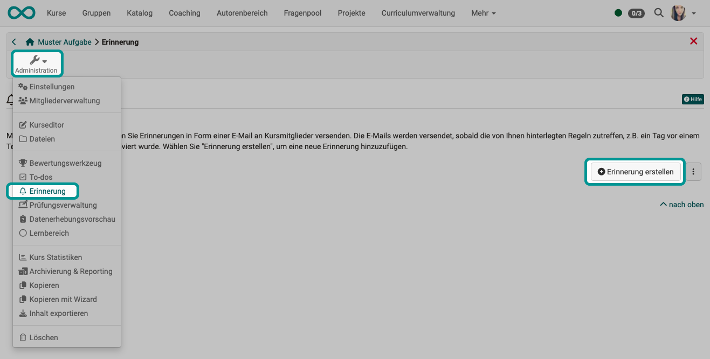{ class="shadow lightbox" }

### Course elements with reminder function

In addition, there are course elements that can be linked to the reminder function. They have their own "Reminders" tab right on the element.

**Call in the course editor:**
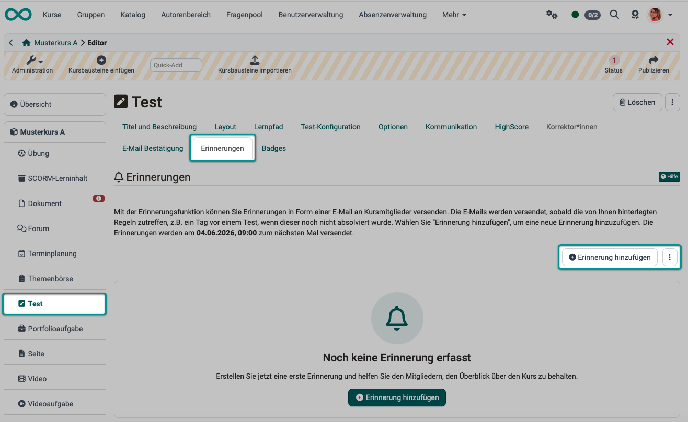{ class="shadow lightbox" }

**Call outside the course editor (run mode), for course owners only:**
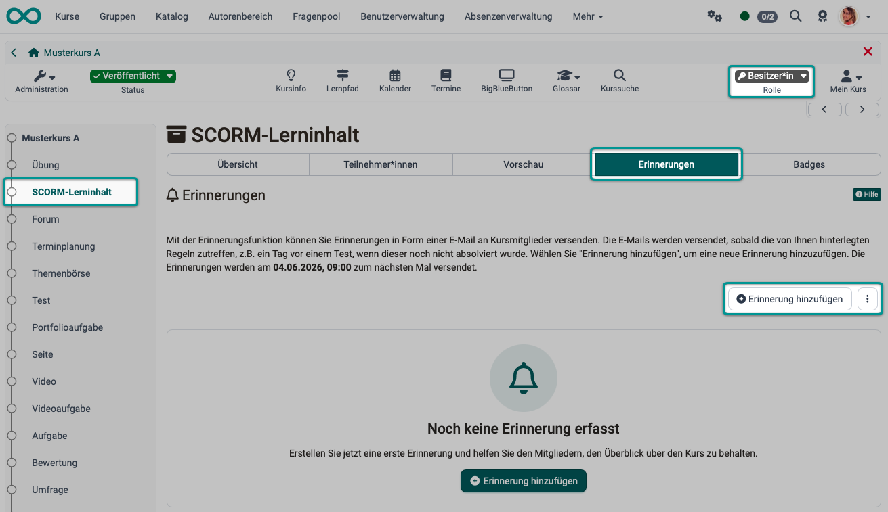{ class="shadow lightbox" }

### Course title (top-level course node)

Reminders that are not linked to a specific course element can also be found in the course editor at the top-level course element/course title: also in the "Reminders" tab.

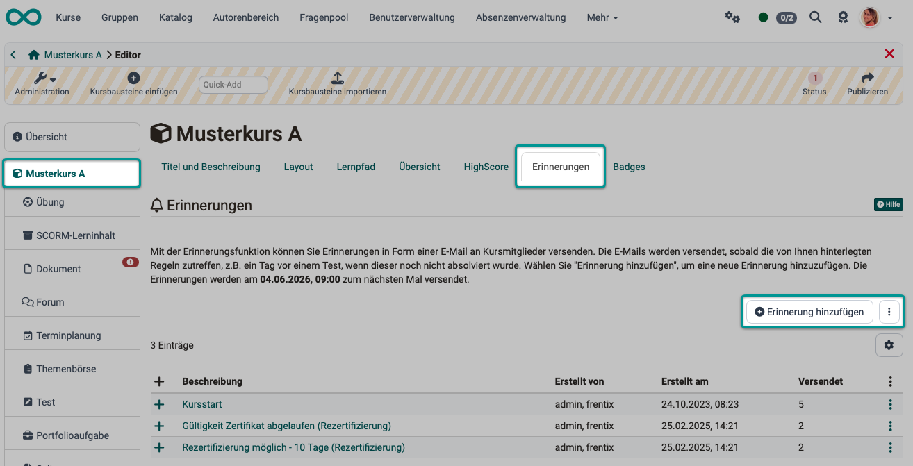{ class="shadow lightbox" }

[To the top of the page ^](#course_reminders)

---

## Create reminder {: #create}

As the course owner, you define

* under which **conditions** the reminder should be sent
* the **mail text**
* to **whom** the reminder should be sent

To create a reminder, click the **"Create reminder"** button. A wizard appears that guides you step by step through the creation process.

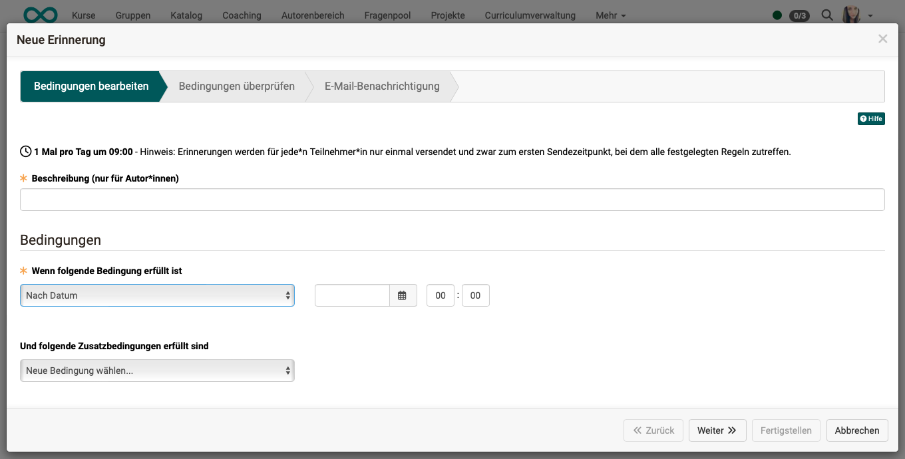{ class="shadow lightbox" }

**Step 1: Edit description and conditions**

First enter the description for the reminder. This description is only visible to the authors and is used for the clear and informative presentation of the reminders of a course. Then select the conditions for the dispatch. More on this below.

**Step 2: Check conditions**

In the second step of the wizard, the conditions are checked and it is shown again to whom the reminder would be sent according to the configuration.

**Step 3: E-mail notification**

In the last step, you enter the e-mail text to be sent. You can select whether the reminders should be sent to all persons in the course to whom the defined rules apply. Optionally, a copy can also be sent to course owners, coaches or persons with an external e-mail address.

Alternatively, the created reminder can also be sent only to the owners, responsible coaches or external e-mail addresses. This option is particularly suitable for test reminders or specific reminders for teachers.

As soon as the conditions for a reminder are met, the e-mails are automatically released for dispatch. The exact sending time and frequency is defined system-wide by your system administrator.

[To the top of the page ^](#course_reminders)

---

## Conditions for sending reminders {: #conditions}

The specific conditions are decisive for the reminders to be sent. OpenOlat offers a wide range of options here. The conditions can be selected from a drop-down menu. Depending on the condition, a further input field appears to the right for more detailed information.

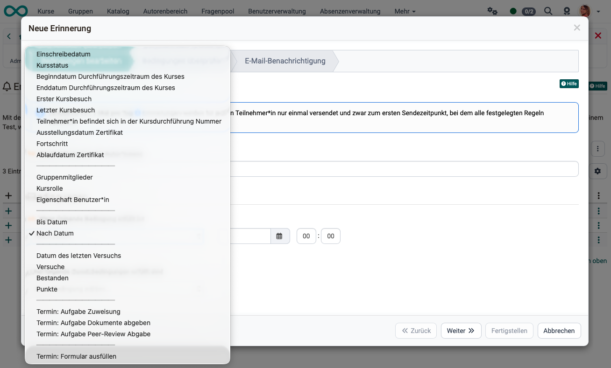{ class="shadow lightbox" }

Several conditions can be combined as required. This allows reminders to be triggered that are tailored to individual requirements. However, at least one criterion must be selected for a dispatch to be triggered.

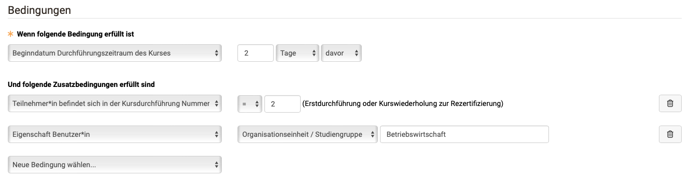{ class="shadow lightbox" }

!!! info "Note"

    The link is an "and" link. This means that only if **all** conditions are met, the reminder e-mail will be triggered.

The following criteria can be configured as a condition:

* **Date of registration** 
Dispatch x days, weeks, months or years later 
_Example_: Participants receive additional information about the course 2 days after enrolment.

* **Course status** 
Select the status the course must be in for a reminder to be sent.

    * Preparation
    * Review
    * Release from coach
    * Published
    * Not preparation
    * Not review
    * Not release from coach
    * Not published

    _Example_: Only if the course has the status "Release from coach" will all coaches receive an info e-mail about their coaching task.

* **Start date implementation period of the course** 
x days, weeks, months or years before or after

* **End date implementation period of the course** 
x days, weeks, months or years before or after

* **First course visit** 
x days, weeks, months or years after

* **Last course visit** 
x days, weeks, months or years after

* **Participant is in the course execution number** 
This concerns the initial run or course repetition for recertification.

    _Example_: Course participants who complete the course for the second time receive a reminder e-mail.

* **Certificate date of issue** 
This option is only displayed if certificate allocation is activated: `Course > Administration > Settings > Tab "Assessment"`. 
_Example_: The mail is sent 1 day after a certificate has been issued.

* **Progress** 
This option is only available for [learning path courses](../learningresources/Learning_path_course.md).
The dispatch is based on the percentage course progress of the participants, as configured in the settings of the course administration. 
_Example_: Learners who have successfully completed at least 80% of a course will receive a motivational e-mail to complete the last 20% soon.

* **Certificate date of expiry** 
This option is only displayed if certificate allocation is activated: `Course > Administration > Settings > Tab "Assessment"`. 
_Example_: The e-mail is sent 2 weeks before the certificate expires, so that participants are reminded to carry out the activities required for the certificate before it expires.

 

* **Group members** 
Selection of a specific group. Only the members of this group will receive the e-mail.

* **Course role** 
The reminder recipients must have one of the following roles:

    * Owners
    * Coaches
    * Participants
    * Coaches and participants
    * Owners and coaches
    * Members

    _Example_: Only owners and coaches will receive a reminder.

* **User property** 
The reminder recipients must have a certain value for one of the following characteristics:

    * Postal code
    * Region / canton
    * City
    * Country
    * Institution
    * Institution number (matriculation number)
    * Institution e-mail
    * Organizational unit / study group
    * Study subject

    _Example_: Participant from the city of Zurich.

    The prerequisite is that the details have also been entered or transferred.

* **Until date** 
Input fields for date and time, with a button as input aid for displaying the calendar. This condition is often suitable for combination with other conditions.

* **After date** 
Input fields for date and time, with a button as input aid for displaying the calendar. This condition is often suitable for combining with other conditions, e.g. if a certain course progress has not been reached by a certain date.

* **Date of the last attempt** 
This option relates to assessable course elements.
    * The drop-down list shows the possible course elements that can be taken into account.
    * x days, weeks, months or years after 
    _Example_: The reminder will be sent 1 week after a specific test has been completed.

* **Attempts** 
This option only affects assessable course elements. The number of attempts is taken into account for the mail dispatch. 
_Example_: A test has not yet been carried out (0 times).

* **Passed** 
This option only affects assessable course elements for which a pass status has been configured in the editor. This can be selected here as a condition. 
_Example_: A test course element was assessed as "Passed".

    !!! warning "Attention: Option "Undefined""

        "Undefined" is the initial value for the passed status (success status) for all assessable elements. Activating this option as a condition only makes sense in combination with the second condition "After date". Otherwise, the reminder will be triggered directly at the next possible dispatch time.

        _Example "Reminder to coach"_: A course element task has not yet been assessed or has been completed with "Undefined" at time x.

        _Example "Reminder to participant"_: A course element checklist has not yet been processed at time x or has been completed by the coach with "Undefined".

* **Points** 
This option only affects assessable course elements for which a number of points has been defined. The dispatch can then depend on a score. 
_Example_: Less than 3 points were achieved in a checklist.

* **Schedule: Task assignment** 
This option only affects course elements of the type "Task" for which the task has also been stored in the course element and a date has been assigned for the assignment. The reminder e-mail is then sent based on the date stored in the course editor, e.g. x days, weeks, months before.

* **Schedule: Task submit documents** 
This option only affects course elements of the type "Task" for which "Submission" has been activated in the workflow configuration. A reminder e-mail can then be sent x days, weeks or months before the submission deadline.

* **Schedule: Task submit peer review** 
This option only affects course elements of the type "Task" for which the peer review function has been activated in the workflow and an "until" date has been linked to the review.
_Example_: A reminder is sent 3 days before the final peer review deadline.

 

* **Schedule: Fill out form** 
This option only affects course elements of the type "Form" for which an end date for completion has been defined in the course editor.
_Example_: A reminder is sent 2 days before the deadline for completing the form.

[To the top of the page ^](#course_reminders)

---

## Notes on configuring reminders {: #notes}

!!! info "When is the e-mail sent, if I enter a date here?"

    Course reminders are not sent immediately. All reminder e-mails are sent together, e.g. daily at 9.00 a.m. This is a default setting and can be changed by administrators in the system administration and adjusted up to "hourly": `Administration > Modules > Course reminders`.
    At the time of sending, OpenOlat checks which conditions are met and sends the e-mails accordingly. All course reminders that meet the conditions at, for example, 9.00 a.m. ("are in the outbox") are then sent.

    If **"Until date"** is checked, the condition may already be fulfilled at the time the reminder is created, and e-mails are sent. This setting is particularly useful in combination with another condition, e.g. if "until date" is "the test has been passed", an e-mail is sent: "You have qualified on time and will receive ...".

    If **"After date"** is used with a date after the time the reminder was created, the e-mails in the "outbox" are sent at the first possible sending date once the "after date" has been reached.

    Please note: 
    An execution period begins at 0:00 a.m. on the start date and ends at 11:59 p.m. on the end date. 
    This means that once the end of the execution period has been reached (the next day), no more reminders will be sent.

!!! info "Option before/after"

    For conditions that require a "before" or "after" specification for a date, this is provided as a selection list.
    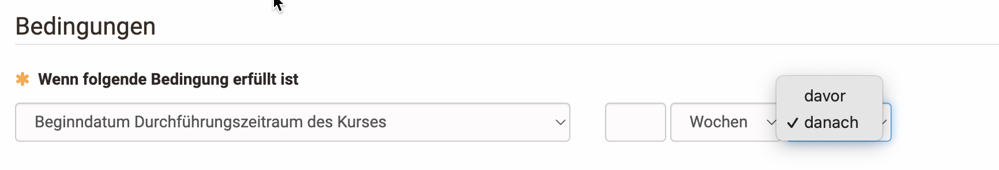{ class="shadow lightbox" }

!!! info "Date"

    The reminder is sent at the next possible sending time on the date (incl. time) entered. If "until date" is used, the reminder is sent at the next possible sending time until the date (and time) is reached. 
    _Example_: 24.06.2021 16:30

!!! info "Time span"

    These conditions are based on how long ago something happened or how far away a certain point in time is.

    _Example_: 5 weeks before the assignment for the group task closes.

    _Example_: 5 days after the participant has accessed the course for the first time.

!!! info "Operators"

    Operators are required for the conditions "Participant is in the course execution number", "Attempts" and "Points" to correctly represent the different states "more than, less than, less or equal, more or equal, equal" and "not equal". They are used to compare expressions with each other and to generate a logical return value depending on this.

    Operator | Description | Explanation
    ---------|----------|---------
    `<` | less than | correct if a is less than b
    `<=`| less or equal | correct if a is less than or equal to b
    `=`| equal | correct if a is equal to b
    `=>`| more or equal | correct if a is greater than or equal to b
    `>`| more | correct if a is greater than b
    `!=`| not equal | correct if a is not equal to b

    In our conditions, in this case for example, the result of a test (a) is compared with the value entered in the condition rule (b). If the logical return value is "True", i.e. the condition is met, the reminder is triggered.

    _Example_: A reminder should be sent when a participant has achieved a maximum of 5 points in a test. In OpenOlat, the condition looks like this:
    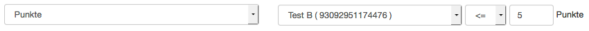{ class="shadow lightbox" }

[To the top of the page ^](#course_reminders)

---

## E-mail text {: #text}

With the help of the e-mail text, which can be customized as needed, you create very specific e-mail reminders tailored to the situation.

!!! tip "Tip"

    Moving the mouse pointer over the small question mark symbol shows you the available variables.

    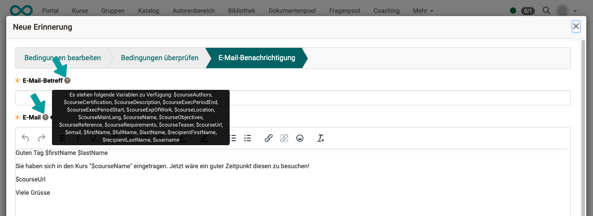{ class="shadow lightbox" }

### Variables available in the subject

* **$courseName**: The name of the course as on the info page.
* **$courseAuthors**: The names entered in the course settings, tab "Metadata" under "Authors/Conducted with".
* **$courseExecPeriodStart**: The date specified in the course settings, tab "Execution" as the start of the execution period.
* **$courseExecPeriodEnd**: The date specified in the course settings, tab "Execution" as the end of the execution period.
* **$courseLocation**: The text entered in the course settings, tab "Execution" as the execution location.

### Variables available in the mail text

* **$firstName**: The first name of the participant.
* **$lastName**: The last name of the participant.
* **$fullName**: The full name depending on the system configuration. The default value is "last name, first name".
* **$email**: The e-mail address of the participant.
* **$userName**: The username.
* **$courseUrl**: The internet address of the course.
* **$courseName**: The name of the course as on the info page.
* **$courseDescription**: The description of the course as on the info page.
* **$courseAuthors**: The names entered in the course settings, tab "Metadata" under "Authors/Conducted with".
* **$courseCertification**: The description of the certification as specified in the course settings, tab "Info".
* **$courseExecPeriodStart**: The date specified in the course settings, tab "Execution" as the start of the execution period.
* **$courseExecPeriodEnd**: The date specified in the course settings, tab "Execution" as the end of the execution period.
* **$courseExpOfWork**: The estimated amount of time entered as text in the course settings, tab "Metadata" under "Time required".
* **$courseLocation**: The text entered in the course settings, tab "Execution" as the execution location.
* **$courseMainLang**: The language entered in the course settings, tab "Metadata" under "Main language".
* **$courseObjectives**: The text entered as the learning objective description in the course settings, tab "Info".
* **$courseReference**: The text entered in the course settings, tab "Info" under "Identifier".
* **$courseRequirements**: The text entered in the course settings, tab "Info" under "Requirements".
* **$courseTeaser**: The teaser text entered in the course settings, tab "Info".
* **$recipientFirstName**: see [example](../../manual_how-to/progress_information/progress_information.md#by_reminders) 
* **$recipientLastName**: see [example](../../manual_how-to/progress_information/progress_information.md#by_reminders)

Here is an example:

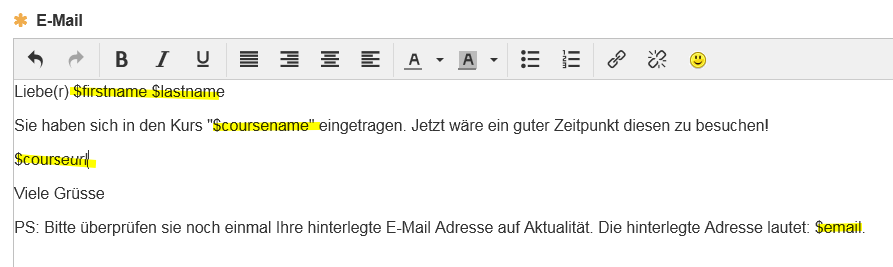{ class="shadow lightbox" }

[To the top of the page ^](#course_reminders)

---

## Recipients {: #recipients}

Reminders are good for reminding **course participants** of what they should do next.
A **copy to the coaches and/or course owners** also informs them that participants have something to do.

In some cases, reminders should be sent **exclusively to coaches**.

**Example:** 
Course participants show no progress. The coach should then contact these participants and provide assistance. This reminder should only go to the coach. You could, for example, enter as conditions that progress is still below x% and, at the same time, a certain score has not been reached in an entrance test.

Reminders can also be sent **exclusively to course owners**.

**Example:** 
Sometimes authors forget to publish their course because things were still unclear when they last worked on the course creation. In this case, the course status can be used in combination with the role as a dispatch criterion.

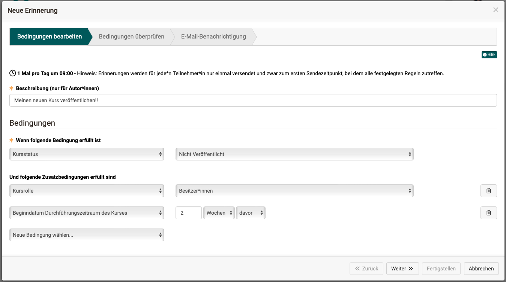{ class="shadow lightbox" }

For special cases, reminders can also be sent **exclusively to certain external e-mail addresses**.

[To the top of the page ^](#course_reminders)

---

## Check and edit reminders {: #check_and_edit}

If reminders have already been created, they are listed under `Course > Administration > Reminders`.
On the overview page you can see all the reminders already created for this course and can also view reminders that have already been sent. The list of reminders already sent contains information about the recipient and the sending time. Individual reminders from this list can easily be sent again via the "Resend" link.

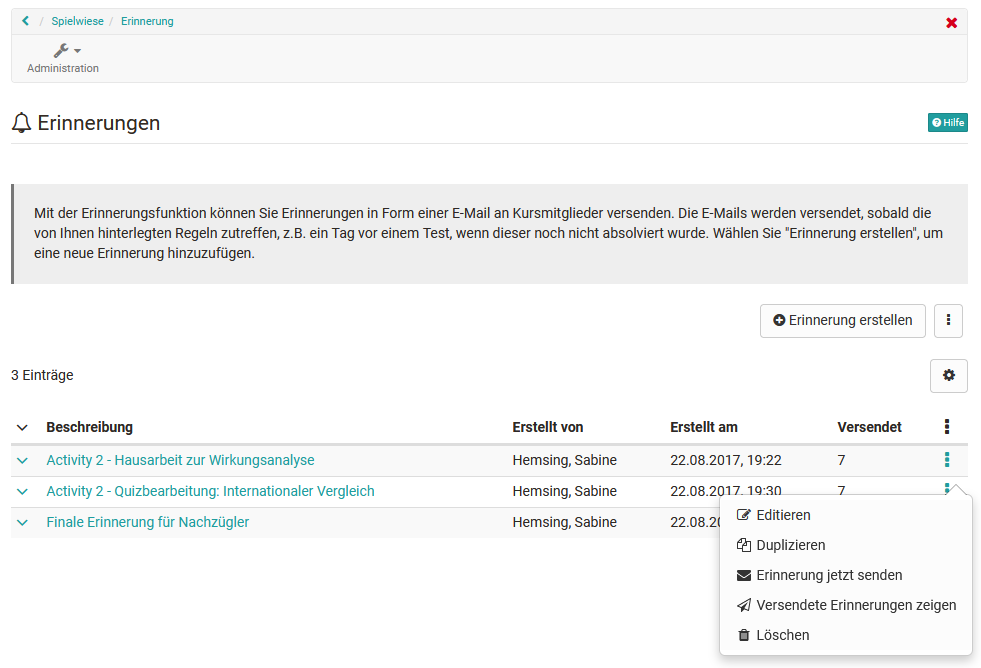{ class="shadow lightbox" }

New reminders can be created at any time.

If, for example, an individual condition for dispatch is to be removed, you will find the buttons for deleting an individual condition to the right of the respective condition in edit mode.

Reminders can also be triggered specifically and repeatedly. However, reminders are still only sent to those participants for whom all conditions are met.

[To the top of the page ^](#course_reminders)

---

## Further information {: #further_information}

Other OpenOlat tools that can also be used for reminders in other ways:

[Personal tools: E-Mail >](../personal_menu/E-Mail.md) 
[Course Element "Notifications" >](../learningresources/Course_Element_Notifications.md) 
[Using Additional Course Features >](../learningresources/Using_Additional_Course_Features.md)

[To the top of the page ^](#course_reminders)
