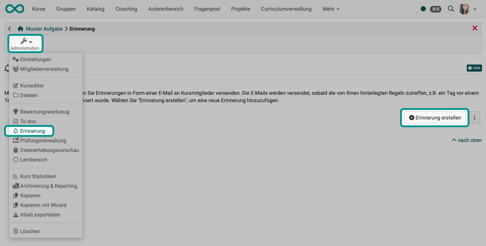
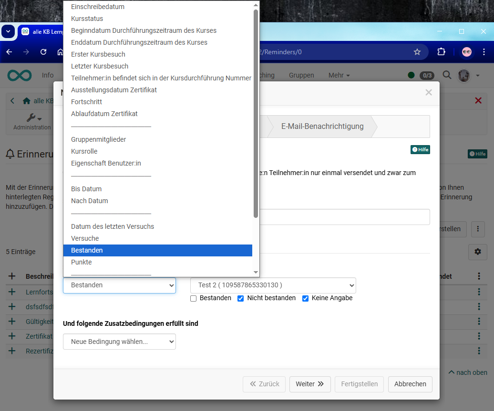
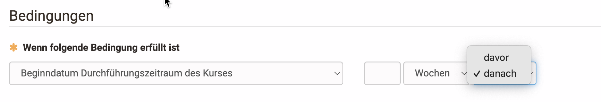
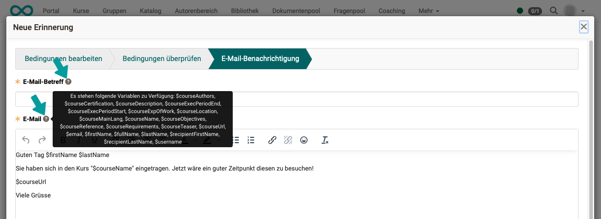
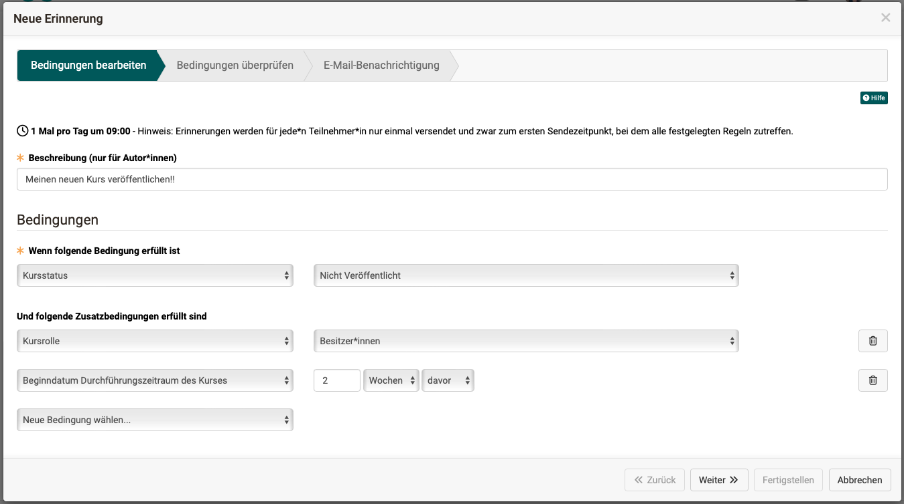

# Course Reminders {: #course_reminders}

The reminder function organizes the automatic sending of e-mails.

{ class="shadow lightbox" }

All reminders for a course are displayed under Course administration → Reminders and can also be created there. In addition, all course elements that can be linked to the reminder function have their own "Reminders" tab directly on the element.

Reminders that are not linked to a specific course element can be found in the course editor at the top course element - also in the "Reminders" tab.

Reminders can be created, displayed, edited and the dispatch checked in all these places.

[To the top of the page ^](#course_reminders)

---

## Create reminder {: #create}

As the course owner, you define a list of rules,

* under which **conditions** the reminder should be sent
* the **mail text**
* to **who** the reminder should be sent to

To do this, click on the **"Create reminder"** button. A wizard will appear to guide you step by step through the creation process.

{ class="shadow lightbox" }

**Step: Edit requirements**

First enter the description for the reminder. This description is only visible to the authors and is used for the clear and informative presentation of all reminders of a course. Then select the conditions for shipping.

**Step: Check requirements**

In the second step of the wizard, the conditions are checked and the person to whom the reminder would be sent according to the configuration is displayed again.

**Step: E-mail notifications**

In the last step, you then enter the email text to be sent and can select whether the reminders should be sent to all persons in the course to whom the defined rules apply. Optionally, you can also send a copy to course owners, coaches or people with an external e-mail address.

Alternatively, the created reminder can also be sent only to the owners, responsible coaches or external e-mail addresses. This option is particularly useful for test reminders or specific reminders for teachers.

As soon as the conditions for a reminder are met, the mails are automatically released for dispatch. The exact sending time and frequency is defined system-wide by your system administrator. 

[To the top of the page ^](#course_reminders)

---

## Conditions for sending reminders {: #conditions}

The specific conditions are decisive for the reminders to be sent. OpenOlat offers a wide range of options here. The specific conditions can be selected from a drop-down menu. Depending on the condition, a further input field appears to the right for more detailed information.

{ class="shadow lightbox" }

Several conditions can be combined as required. This allows reminders to be triggered that are tailored to individual requirements. However, at least one criterion must be selected for a dispatch to be triggered.

{ class="shadow lightbox" }

!!! info "Note"

    The link is an "and" link. This means that only if **all** conditions are met, the reminder e-mail will be triggered.

The following criteria can be configured as a condition:

* **Date of registration** 
Dispatch x days, weeks, months or years later 
_Example_: Users will receive additional information about the course 2 days after enrolment.

* **Course status** 
Select the status the course must be in for a reminder to be sent.

    * Preparation
    * Review
    * Release from coach
    * Published
    * Not preparation
    * Not review
    * Not release from coach
    * Not published

_Example_: Only if the course has the status "Approved coaches" will all coaches receive an info e-mail about their coaching task.

* **Start date Implementation period of the course** 
x Days, weeks, months or years before or after

* **End date Implementation period of the course** 
x Days, weeks, months or years before or after

* **First course visit** 
x Days, weeks, months or years after

* **Last course visit** 
x Days, weeks, months or years after

* **Participant is in the course implementation number** 
See note on operators

    _Example_: Course participants who complete the course for the second time receive a reminder e-mail.

* **Progress** 
Only for [Learning path courses](../learningresources/Learning_path_course.md).
In this case, the course is sent based on the percentage progress of the participants as configured in the administration settings. 
_Example_: Learners who have successfully completed at least 80% of a course will receive a motivational email to complete the last 20% soon.

* **Certificate date of issue** 
This option is only displayed if certificate allocation is activated. (Course administration > Settings > Tab "Assessment") 
_Example_: The mail is sent 1 day after a certificate has been issued.

* **Certificate date of expiry** 
This option is only displayed if certificate allocation is activated. (Course administration > Settings > Tab "Assessment"). 
_Example_: The e-mail is sent 2 weeks before the certificate expires, so that participants are reminded to carry out the activities required for the certificate before it expires.

---

* **Group members** 
Selection of a specific group. Only the members of this group will receive the e-mail.

* **Course role** 
The reminder recipients must have one of the following roles:

    * Owner
    * Coach
    * Participant
    * Coach and participant
    * Owner and coach
    * Member
    
    _Example_: Only owners and coaches will receive a reminder.

* **User property** 
The reminder recipients must have a certain value for one of the following characteristics:

    * Postal code
    * Region
    * City
    * Country
    * Institution
    * Institution number (matriculation number)
    * Institution e-mail
    * Organizational unit / study group
    * Study subject
  
    _Example_: User from the city of Zurich.

    The prerequisite is that the details have also been entered or transferred. 

---

* **Until date** 
Input fields for date and time, as input help button for displaying the calendar. This condition is often suitable for combination with other conditions.

* **After date** 
Input fields for date and time, as input help button to display the calendar. This condition is often suitable for combining with other conditions, e.g. if a certain course progress has not been reached by a certain date.

---

* **Date of the last attempt** 
This option relates to assessable course elements.
    * The possible course elements that can be taken into account are displayed in the drop-down list.
    * x days, weeks, months or years after 
    _Example_: The reminder will be sent 1 week after a specific test has been completed.

* **Attempts** 
tbd

* **Passed** 
This option only affects assessable course elements for which a pass status has been configured in the editor. This can be selected here as a condition. 
_Example_: One test course element was assessed as "Passed".

    !!! warning "Attention: Option "Undefined""

        “Undefined” is the initial value for the passed status (success status) for all assessable course elements. Activating this option as a condition only makes sense in combination with the second condition “By date”. Otherwise, the reminder will be triggered directly at the next possible dispatch time.
       
        _Example "Reminder to coach"_: A course element task has not yet been assessed or has been completed with “Undefined” at time x.
       
        _Example "Reminder to participant"_: A course element checklist has not yet been completed at time x or has been completed by the coach with “Undefined”.

* **Points** 
This option only affects assessable course elements for which a number of points has been defined. They can then be sent depending on a score. 
_Example_: Less than 3 points were achieved in one checklist.

---

* **Schedule: Task "Assignment"** 
This option only affects course elements of the type “Task” for which the task has also been stored in the course element and a date has been assigned for the assignment. The reminder e-mail is then sent for the date stored in the course editor, e.g. x days, weeks, months before. 

* **Schedule: Task "Submit documents"** 
This option only affects course elements of the type "Task" for which "Submission" has been activated in the workflow configuration. A reminder e-mail can then be sent x days, weeks or months before the submission deadline. 

* **Schedule: Task "Submit peer review task"** 
This option only affects course elements of the type "Task" for which the peer review function has been activated in the workflow and a "until" date has been linked to the review. 
_Example_: A reminder will be sent out 3 days before the final peer review deadline.

---

* **Schedule: Fill out form** 
This option only affects course elements of the type "Form" for which an end date for completion has been defined in the course editor. 
_Example_: A reminder will be sent out 2 days before the deadline for completing the form.

!!! info "When is the e-mail being sent, if I specify a date here?"

    Course reminders are not sent out immediately. All reminder e-mails are sent together, e.g. daily at 9.00 am. This is a default setting and can be changed by administrators and adjusted to "hourly" (Administration > Modules > Course reminders).
    At the time of sending, OpenOlat checks which conditions are met and sends the e-mails accordingly. All course reminders that fulfill the conditions ("are in the outbox") at 9.00 a.m., for example, are then sent.

    If **"Until date"** is checked, the condition may already be fulfilled at the time the reminder is created and e-mails are sent. This setting is particularly useful in conjunction with another condition, e.g. if "to date" is "the test has been passed", an e-mail is sent "You have qualified on time and will receive ...".

    If **"From date"** is used with a date after the time of reminder creation, the e-mails in the "Outbox" will be sent on the first possible sending date when the "By date" has been reached.

!!! info "Option before/after"

    For conditions that require a "before" or "after" specification for a date, this is provided as a selection list.
    { class="shadow" }

!!! info "Date"

    The reminder is sent at the next possible sending time on the date (incl. time) entered. If "to date" is used, the reminder is sent at the next possible sending time until the date (and time) is reached. 
    _Example_: 24.06.2021 16:30 

!!! info "Time span"

    These conditions are based on how long ago something happened or how far away a certain point in time is.

    _Example_: 5 weeks before the assignment for the group task closes.

    _Example_: 5 days after the user has accessed the course for the first time.

!!! info "Operators"

    Operators are required for the conditions "Participant is in course execution number", "Attempts" and "Points" to correctly represent the different states "more than, less than, less or equal, more or equal, equal" and "not equal". They are used to compare expressions with each other and to generate a logical return value depending on this.

    Operator | Description | Explanation
    ---------|----------|---------
    `<` | less than | correct if a is less than b
    `<=`| less or equal | correct if a is less than or equal to b
    `=`| equal | correct if a is equal to b
    `=>`| more or equal | correct if a is greater than or equal to b
    `>`| more | correct if a is greater than b
    `!=`| not equal | correct if a is not equal to b

    In our conditions in this case, for example, the result of a test (a) is compared with the entered value in the condition rule (b). If the logical return value is "True", i.e. the condition is true, then the reminder is triggered.

    _Example_: A reminder should be sent when a participant has achieved a maximum of 5 points in a test. In OpenOlat, the condition looks like this:
    

[To the top of the page ^](#course_reminders)

---

## E-mail text {: #text}

With the help of the e-mail text, which can be customized as required, you can create very specific e-mail reminders tailored to the situation.

!!! tip "Hint"

    The available variables are displayed by moving the mouse pointer over the small question mark symbol.

    { class="shadow lightbox" }

### Variables available in the subject

* **$courseName**: The name of the course as on the info page.
* **$courseAuthors**: The names entered in the course settings, tab "Metadata" under "Author/Conduction with”.
**$courseExecPeriodStart**: The date specified in the course settings, tab "Execution" as the start of the execution period.
**$courseExecPeriodEnd**: The date specified in the course settings, tab "Execution" as the end of the execution period.
**$courseLocation**: The text that was entered in the course settings, tab "Implementation" as the implementation location.

### Variables available in the mail text

* **$firstName**: The first name of the user.
* **$lastName**: The last name of the user.
* **$fullName**: The full name depending on the system configuration. The default value is "lastname, firstname".
* **$email**: The e-mail address of the user.
* **$userName**: The username.
* **$courseUrl**: The internet address of the course.
* **$courseName**: The name of the course as on the info page.
* **$courseDescription**: The description of the course as on the info page.
* **$courseAuthors**: The names entered in the course settings, tab "Metadata" under "Author:inside/conducted with".
* **$courseCertification**: The description of the certification as specified in the course settings, tab "Info".
* **$courseExecPeriodStart**: The date specified in the course settings, tab "Execution" as the start of the execution period.
* **$courseExecPeriodEnd**: The date specified in the course settings, tab "Execution" as the end of the execution period.
* **$courseExpOfWork**: The estimated amount of time that was entered as text in the course settings, tab "Metadata" under "Time spent".
* **$courseLocation**: The text that was entered in the course settings, tab "Implementation" as the implementation location.
* **$courseMainLang**: The language entered in the course settings, tab "Metadata" under "Main language".
* **$courseObjectives**: The text that was entered as the learning objective description in the course settings, tab "Info".
* **$courseReference**: The text that was entered in the course settings in the "Info" tab under "Indicator".
* **$courseRequirements**: The text that was entered in the course settings in the "Info" tab under "Requirements".
* **$courseTeaser**: The teaser text entered in the “Info” tab of the course settings.
* **$recipientFirstName**: see [example](../../manual_how-to/progress_information/progress_information.md)  
* **$recipientLastName**: see [example](../../manual_how-to/progress_information/progress_information.md) 

Here is an example:

{ class="shadow" }

[To the top of the page ^](#course_reminders)

---

## Recipients {: #recipients}

Reminders are good for reminding **course participants** of what they should do next.
A **copy to the coaches and/or course owners** also informs them that participants have something to do.

In some cases, reminders should be sent **exclusively to coaches**. 

**Example:** 
Course participants do not show any progress. The coach should then contact these students and provide assistance. This reminder should only go to the coach. You could enter as conditions, for example, that the progress is still below x% and at the same time a certain score has not been reached in an entrance test.

Reminders can also be sent **exclusively to course owners**. 

**Example:** 
Sometimes authors forget to publish their course because things were still unclear when they last worked on the course creation. In this case, the course status can be used in combination with the role as a dispatch criterion.

{ class="shadow lightbox" }

For special cases, reminders can also be sent **exclusively to certain external e-mail addresses**.

[To the top of the page ^](#course_reminders)

---

## Check and edit reminders {: #check_and_edit}

If reminders have already been created, these are listed under **Administration > Reminders**.
On the overview page you can see all the reminders already created for this course and can also view reminders that have already been sent. The list of reminders that have already been sent contains information about the recipient and the sending time. Individual reminders from this list can be easily sent via the "Send again" link.

{ class="shadow" }

New reminders can be created at any time.

If, for example, an individual condition for dispatch is to be removed, you will find the buttons for deleting an individual condition to the right of the respective condition in edit mode.

Reminders can also be triggered repeatedly and in a targeted manner. However, reminders are only sent to those users for whom all conditions have been met.

[To the top of the page ^](#course_reminders)

---

## Further information {: #further_information}

[Personal Menu: E-Mails >](../personal_menu/E-Mail.md) 
[Course element Notifications](../learningresources/Course_Element_Notifications.md) 
[Participant infos](../learningresources/Using_Additional_Course_Features.md#teilnehmer-infos) 

