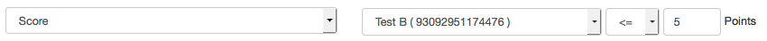

# Course Reminders

With the reminder function, you create rule lists, upon fulfillment of which a previously defined mail is automatically sent to a user group of the course defined in the rules. Frequency and sending time is defined system-wide by your system administrator. Reminders can also be triggered specifically - but reminders will still only be sent to those users for whom all conditions are considered to be met.

{ class="shadow" }

On the overview page you can see all reminders that have already been created for a course and you can also view reminders that have already been sent.  The list of already sent reminders contains information about the recipient as well as the sending time. Individual reminders from this list can be easily sent using the "Resend" link.

## Create reminder

Reminders can be created at any time. To do so, click on the "Create reminder" button. A wizard will appear that will guide you step by step through the creation process.

{ class="shadow" }

First, enter the description for the reminder. This description is only visible to the authors and is used to display all reminders of a course in a clear and informative way. Then select the conditions for sending. In the next step, the conditions are checked and displayed again. In the last step you enter the concrete e-mail text and can also select whether tutors or owners should also receive a copy or whether a copy should be sent to an external address.

In addition to the configuration in the course administration, reminders for certain assessment course elements can also be set up directly for the respective course element. In this case, the corresponding course element is already preselected. For example, you can quickly create a reminder for learners who have not yet taken a certain test (attempts = 0) or send an e-mail to all persons who have passed an assignment.

## Conditions for sending reminders

Various conditions are available for the configuration of reminders, which can be combined as desired. Thus, various reminders tailored to individual needs can be triggered by mail.

!!! info "Note"

    The link is an "and" link. This means that only if all conditions are met, the reminder email will be triggered.

Define under which conditions a reminder should be sent. In the drop-down menu you specify the type of the condition, while in the following fields you specify the condition by e.g. a date or a score. Use the buttons to the right of the condition to remove it or add another condition. At least one criterion must be selected for a dispatch to be triggered.

There are different types of conditions: Below is a brief explanation of the types one and how they are generally applied.

### Time span

These conditions build on how long ago something happened, or how long away a certain point in time is.

_Example_: 5 weeks before the assignment for the group task closes.

_Example_: 5 days after the user first accessed the course.  
  
* Enrollment date
* Begin date execution period of course
* End date execution period of course
* Initial course launch date
* Recent course launch date
* Issue date certificate
* Date of last attempt
* Expiration date certificate
* Deadline: Task assignment
* Deadline: Task documents submission
* Deadline: Form completition

!!! info "Option before/after"

    For conditions which the option "before" or "after" can be considered, this is provided as a selection list.
    { class="shadow" }

### Attempts

Here the number of attempts of assessable course elements is taken into account for the dispatch as a condition.

_Example_: A test has not been (0) attempted yet.

* Attempts  
  
### Assessment

Assessable course elements for which a score or pass status has been configured in the editor can be included here as a condition.

_Example_: Less than 3 points were achieved in a checklist.
  
* Passed
* Score

!!! info "Operators"

    For the two conditions "Attempts" and "Score" operators are needed to correctly represent the different states "more than, less than, less than or equal, more or equal, equal" and "not equal". They are used to compare expressions with each other, and to generate a logical return value depending on this.

    Operator | Description | Explanation
    ---------|----------|---------
    `<` | less than | correct if a is less than b
    `<=`| less than or equal to| correct if a is less than or equal to b
    `=`| equal| correct if a is equal to b
    `=>`| greater than or equal to| correct if a is greater than or equal to b
    `>`| greater than| correct, if a is greater than b
    `!=`| not equal| correct, if a is not equal to b

    In our conditions in this case, for example, the result of a test (a) is compared with the entered value in the condition rule (b). If the logical return value is "True", i.e. the condition is true, then the reminder is triggered.

    An example: A reminder should be sent when a student has scored a maximum of 5 points in a test. In OpenOlat the condition looks like this:

    

### Date

On the entered date (incl. time) the reminder will be sent at the next possible sending time. If "until date" is used, the reminder is sent at the next possible sending time until the date (and time) is reached.

_Example_: 24.06.2021 16:30  
  
* After date
* Until date

### Affiliation

Based on the OLAT role the reminder will be sent to the course participants.

_Example_: Send to all owners and coaches.  
  
* Course role
* Group member

### User property

Here the sending is done based on certain user specific properties. Reminders will be sent to those course members who have the selected profile attribute.

_Example_: User from the city of Zurich.  
  
### Progress (only for [Learning path courses](../learningresources/Learning_path_course.md))
Here the dispatch is based on the percentage course progress of the participants as configured in the administration settings.

_Example_ : Users who have successfully completed at least 80% of a course.  
  
You can combine as many conditions as you want. It is certainly useful to think beforehand about who should receive a reminder under which condition and at what time.

## Email text

Using the email text, which can be customized as needed, you create very specific email reminders tailored to the situation.

!!! tip "Tip"

    It is best to use the variables already entered to make the reminder as personal and helpful as possible.

* **$firstName**: The first name of the user.
* **$lastName**: The last name of the user
* **$fullName**: The full name depending on the system configuration. The default value is "lastname, firstname".
* **$email**: The email address of the user.
* **$userName**: The username
* **$courseUrl**: The internet address of the course
* **$courseName**: The name of the course as on the info page
* **$courseDescription**: The description of the course as on the info page.

Here is an example:

{ class="shadow" }

At the top course node, all reminders that are not tied to a specific course element are also listed. Also here as well as with other assessment elements with the tab "Reminders" further configurations can be made, e.g. configured reminders can be edited, duplicated, sent, deleted. It is also possible to display the dispatch.