# Kurseinstellungen {: #course_settings}

Unter **Administration > Einstellungen** nehmen Sie Konfigurationen vor, die den Kurs als Ganzes betreffen.

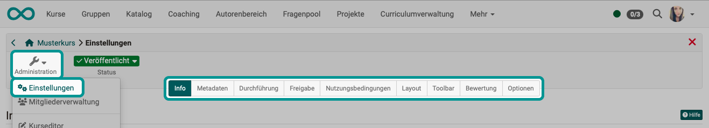{ class="shadow lightbox" }

:octicons-device-camera-video-24: **Video-Einführung**: [Kursbausteine konfigurieren](<https://www.youtube.com/embed/SAkzzoOQEoQ>){:target="_blank”}

!!! info "Hinweise"

    Jede [Lernressource](../learningresources/index.de.md) verfügt über ein Menü "Einstellungen", nicht nur Kurse.
    
    Die Einstellungen von herkömmlichen und [Lernpfadkursen](../learningresources/Learning_path_course.de.md) variieren leicht.

    Über die Tabs "Info", "Metadaten", "Durchführung" und "Freigabe" können Sie Informationen angeben, die in der [Kursinfoseite](../learningresources/Set_up_info_page.de.md) sichtbar werden.

## Tab Info {: #info}

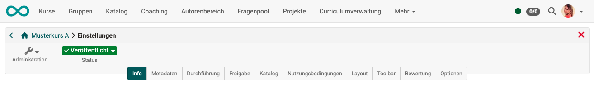{ class="shadow lightbox" }

Hier definieren Sie Informationen über den Kurs bzw. die Lernressource. Dazu zählen: 

* Titel
* Kennzeichen (Eine externe Kennung, die in der Kursübersicht angezeigt wird. Z.B. die Bezeichnung aus dem Vorlesungsverzeichnis oder einem gedruckten Kurskatalog.) 
* Teaser (Textzeile/Begriff)
* Kursbeschreibung
* Beschreibung der Lernziele
* Voraussetzungen
* Anforderungen für eine Bescheinigung
* Titelbild
* Teaser-Film

Diese Infos sind für Interessierte auch ohne Kurszugang unter (Kurs-)Info sichtbar. 
Unter dem hier definierten Titel erscheint die Lernressource in der alphabetischen Kursliste und ist für Anfragen über die Suchmaske relevant.

[Details über die **Infoseite** >](../learningresources/Info_page.de.md) 
[Details über das **Setup der Infoseite** >](../learningresources/Set_up_info_page.de.md) 
[Zum Seitenanfang ^](#course_settings)

## Tab Metadaten {: #metadata}

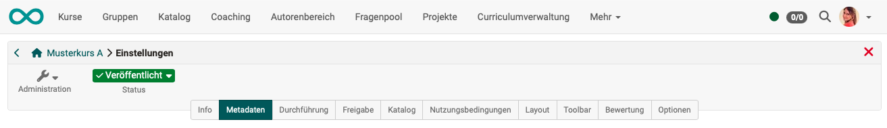{ class="shadow lightbox" }

Metadaten enthalten Schlagwörter, die den Kurs beschreiben. Anhand der Metadaten kann Ihr Kurs z.B. besser gefunden werden. Sie sind optional und müssen nicht zwingend ausgefüllt werden.

Metadaten eines Kurses sind

* Typ der Lernressource (in diesem Fall: Kurs)
* ID-Nummer des Kurses
* Ersteller des Kurses
* Autor:innen / Namen der Lehrenden des Kurses
* Fachbereiche (aus der Taxonomy)
* Durchführungsformat (Blendend Learning, Selbststudium, ...)
* Hauptsprache
* geschätzter Zeitaufwand zur Bearbeitung
* Lizenz

[Mehr über **Metadaten** >](../basic_concepts/Full_Text_Search.de.md#metadata) 
[Zum Seitenanfang ^](#course_settings)

## Tab Durchführung {: #execution}

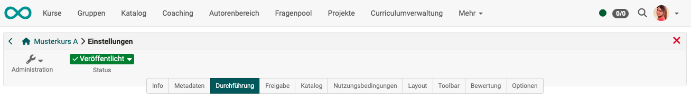{ class="shadow lightbox" }

Hier können Sie 

* den Durchführungszeitraum des Kurses definieren, 
* das "[Lektionen- und Absenzmanagement](../learningresources/Lectures_and_absences.de.md)" einschalten und weiter konfigurieren (sofern vom Administrator aktiviert), 
* existierende herkömmliche Kurse in Lernpfad Kurse konvertieren 
* bzw. bei [Lernpfad Kursen](Learning_path_course.de.md) definieren, wie der Lernfortschritt berechnet wird, anhand der Anzahl der Kursbausteine oder anhand der Bearbeitungsdauer der Kursbausteine.

[Zum Seitenanfang ^](#course_settings)

## Tab Freigabe {: #share}

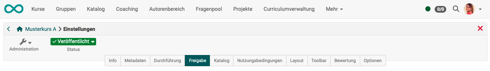{ class="shadow lightbox" }

Im Tab "Freigabe" definieren Sie, wie und für wen ein Kurs oder eine Lernressource freigegeben wird. 

* Ob der Zugang nur für ausgewählte Mitglieder möglich ist, der Kurs selbst gewählt und gebucht werden kann oder der Zugang ganz offen steht 
* Wann Teilnehmer:innen aus dem Kurs austreten können
* Ob ggf. nur administrative Rollen einer bestimmten Organisationseinheit Zugriff erhalten
* Ob und wie andere Autor:innen auf den Kurs zugreifen können
* Ob externe OER-Kataloge und Suchmaschinen Informationen erhalten
* Ob ein Angebot im Katalog zum Kurs gemacht wird und wenn ja, welches
* Ob der Kurs auch von einem anderen LMS aus via LTI genutzt werden kann

[Details zum **Tab Freigabe** >](Course_Settings_Share.de.md) 
[Mehr zur **Freigabe** >](Access_configuration.de.md) 
[Zum Seitenanfang ^](#course_settings)

## Tab Katalog (gilt nur für Katalog Version 1) {: #catalog}

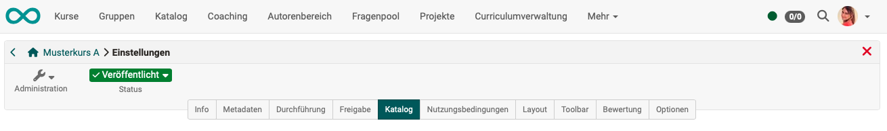{ class="shadow lightbox" }

Über den Button "In Katalog einfügen" kann die Lernressource in den Katalog eingetragen und einer oder mehreren vordefinierten Kategorien zugeordnet werden. Um den Kurs oder die Lernressource in mehrere Katalogbereiche einzutragen, muss der Schritt wiederholt werden. Anschließend erscheinen alle Katalogeinträge hier im Tab "Katalog" und können hier auch wieder entfernt werden.

Der gesamte OpenOlat [Katalog (Version 1)](../area_modules/Courses.de.md) ist für alle User im Menü "Kurse" einsehbar.

Tragen Sie Ihre Kurse erst in den Katalog ein, wenn diese fertiggestellt sind und für die Benutzer sichtbar sein sollen.  

[Zum Seitenanfang ^](#course_settings)

## Tab Nutzungsbedingungen {: #disclaimer}

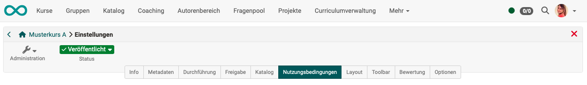{ class="shadow lightbox" }

Hier können 

* frei definierbare kursbezogene **Nutzungsbedingungen** 
* und eine kursbezogene **Datenschutzerklärung** 

aktiviert und hinterlegt werden. Startet eine Person den Kurs, muss sie zunächst die Bedingungen akzeptieren, ansonsten ist ein Kurszugang nicht möglich. 

In der [Mitgliederverwaltung](../learningresources/Members_management.de.md) sehen Sie im Bereich "Einwilligungen" welche Personen die Bedingungen bereits akzeptiert haben.

{ class="shadow" }

[Zum Seitenanfang ^](#course_settings)

## Tab Layout {: #layout}

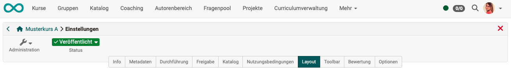{ class="shadow lightbox" }

Unter Layout kann 

* eine **Layoutvorlage** für einen Kurs ausgewählt, 
* die **Kursnavigation** näher bestimmt 
* und der **Stil der Kursbausteine** definiert werden.

Je nach Einstellungen durch den Kursadministrator stehen Ihnen bestimmte **Layoutvorlagen**, mindestens aber eine Standard Vorlage zur Verfügung. Darüber hinaus können Sie im [Ablageordner](../learningresources/Storage_folder.de.md) des Kurses eigene CSS Kursvorlagen hinterlegen und im Menü Layout verknüpfen. So lassen sich z.B. Schriften und Farben für Texte, Überschriften, Links, das Menü und die Toolbox individuell gestalten und mit einem passenden Logo versehen.

Im Bereich "**Navigation**" kann die Sichtbarkeit des Menüs und der Krümelnavigation eingestellt werden. In Lernpfad Kursen kann darüber hinaus eingestellt werden, ob die Menü Icons und der spezifische Lernpfad für den User angezeigt wird oder nicht. Je nach linearem oder flexiblem Szenario bietet sich die eine oder andere Variante an.

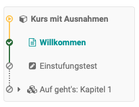{ class="shadow" }
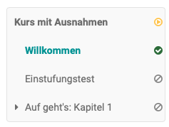{ class="shadow" }

Im Bereich "**Standard Stil Kursbausteine**" können Sie die Basisdarstellung der Kursbausteine definieren und z.B. ein eigenes Hintergrundbild hochladen oder ein Hintergrundbild aus der Bibliothek wählen, den Stil des Bildes definieren, sowie bei Bedarf eine Farbkategorie zuordnen. In der Vorschau sehen Sie die Auswirkungen.

[Zum Seitenanfang ^](#course_settings)

## Tab Toolbar {: #toolbar}

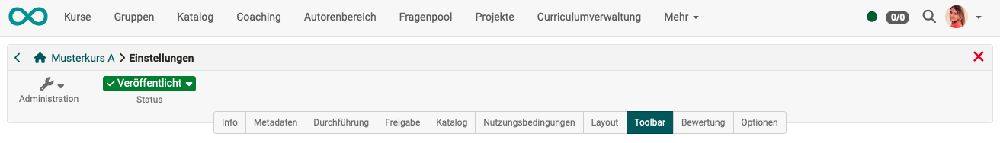{ class="shadow lightbox" }

Hier schalten Sie die Toolbar in der Kopfzeile des Kurses ein oder aus und definieren, welche konkreten einzelnen Werkzeuge in der Toolbar den Kursteilnehmer:innen angezeigt werden.

[Zu den Details >](../learningresources/Course_Settings_Toolbar.de.md) 
[Zum Seitenanfang ^](#course_settings)

## Tab Bewertung {: #assessment}

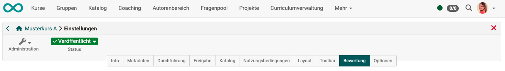{ class="shadow lightbox" }

Im Tab Bewertung können Sie folgende Aspekte aktivieren bzw. konfigurieren:

* Kurs-Bewertung mit Punkten: Summe, Durchschnitt, gewichtet
* Anforderungen für das Bestehen des Kurses 
* die Rolle der Betreuenden im Bewertungsprozess
* Leistungsnachweise aktivieren und konfigurieren
* Kreditpunkte aktivieren und konfigurieren
* Kurs-Zertifikate aktivieren, konfigurieren und auch eine Rezertifizierung einrichten
* die Vergabe von Badges aktivieren

!!! info "Hinweis"

    Bei herkömmlichen Kursen sind im Bewertungs-Tab nur die Einstellungen für Leistungsnachweise, Zertifikate und Badges verfügbar.  Die Konfiguration für das Bestehen erfolgt im Kurseditor auf dem obersten Kursbaustein im Tab "Punkte". Einen Fortschritt gibt es bei herkömmlichen Kursen nicht.

[Zu den Details >](../learningresources/Course_Settings_Assessment.de.md) 
[Zu den Details der **Zertifikate** >](../learningresources/Course_Settings_Assessment.de.md#certificate) 
[Zu den Details der **Rezertifizierung** >](../learningresources/Course_Settings_Assessment.de.md#recertification) 
[Zum Seitenanfang ^](#course_settings)

## Tab Optionen {: #options}

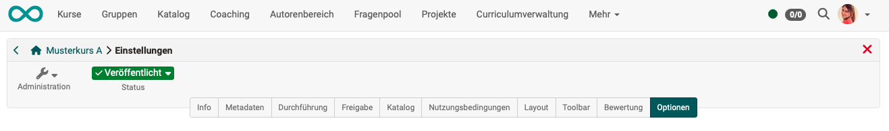{ class="shadow lightbox" }

Hier aktivieren Sie je nach Bedarf

* ein kurspezifisches [Glossar](../learningresources/Using_Additional_Course_Features.de.md) 
* einen [Ressourcenordner](../learningresources/index.de.md) zu Ihrem Kurs
* einen speziellen Ordner für Betreuer:innen
* To-dos für Betreuer:innen 
Falls Sie Benutzer*in mit einer administrativen Rolle sind (Lernressourcenverwalter:in, Administrator:in), werden Ihnen hier zusätzlich noch spezielle Optionen angezeigt: 
* Einladung externe Benutzer:innen für Kursbesitzer:innen mit Autorenrecht aktivieren
* die "LTI 1.3"-Freigabe für Kursbesitzer:innen mit Autorenrecht aktivieren

[Details zum Tab Optionen > ](../learningresources/Course_Settings_Options.de.md) 
[Zum Seitenanfang ^](#course_settings)