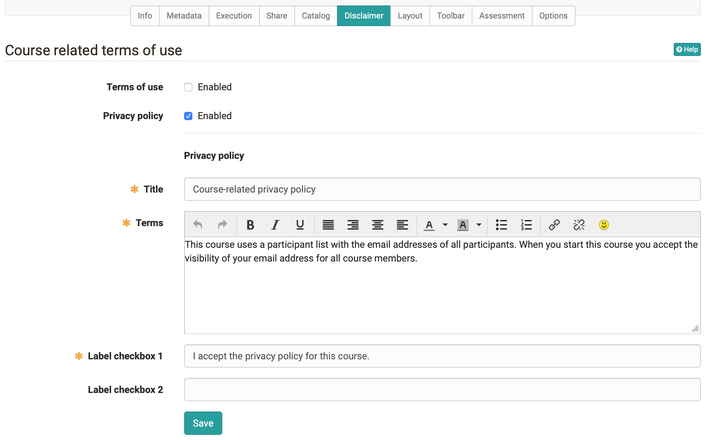
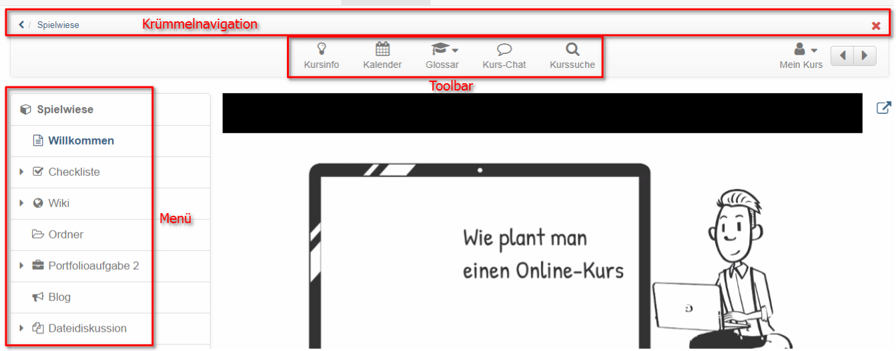
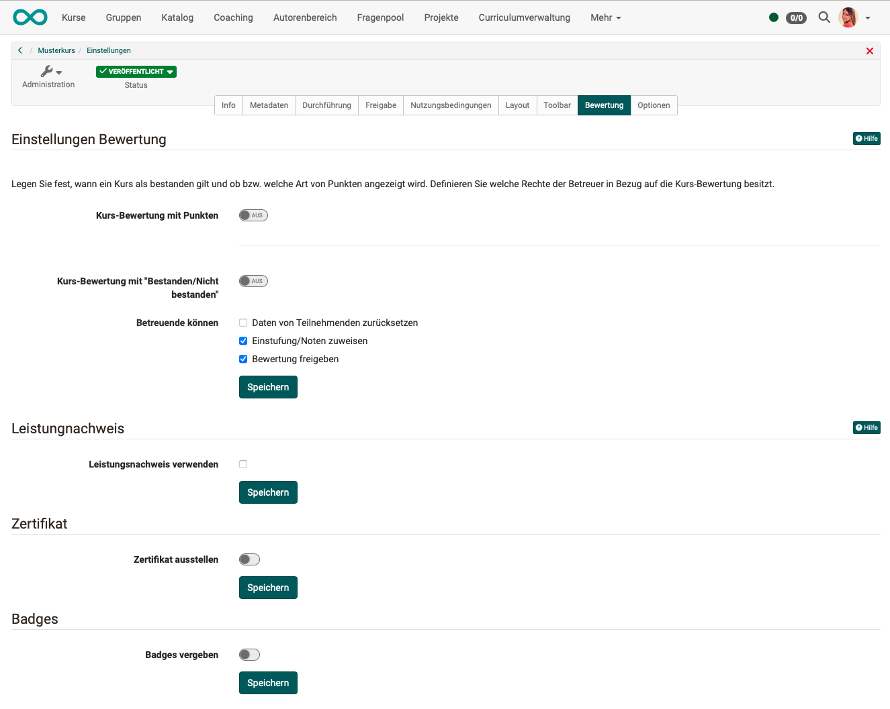

# Course Settings

The menu "Settings" of the "Administration" offers further central configurations for your OpenOlat course.

Each [Learning resource](../learningresources/index.md), not just courses, have a menu "Settings". Furthermore, the settings of conventional and learning path courses vary slightly.

**Course settings**

{ class="shadow" }

Via the tabs "Info", "Metadata", "Execution" and "Share" you can set up information that is visible in the course info page.

## Tab Info

Here you define further information on the course or learning resource. This information is also visible to interested parties without course access under (Course)info. This includes, for example: Title, relevant description, certificate, cover image and teaser movie. The learning resource appears under the title in the alphabetical course list and for queries via the search mask. Further information can be found [here](../learningresources/Set_up_info_page.md).

## Tab Metadata

Here you can enter other things that appear under "Info" e.g. the names of the teachers of the course. Also, the course can be assigned to a given didactic type such as self-study course or examination course. Especially relevant is the entry of the license of the course.

## Tab Execution {: #Execution}

Here you can activate the "[Lecture and Absence Management](../learningresources/Lectures_and_absences.md)" if activated by the administrator, convert existing conventional courses into learning path courses or, in case of [Learning path courses](Learning_path_course.md), define how the learning progress is calculated on the basis of the number of course elements or on the basis of the learning time of the course elements.  

## Tab Share

In this tab you define how and for whom a course or a learning resource is released. Further information on setting up the appropriate access configuration can be found [here](Access_configuration.md).

## Tab Catalog

The button "Add to catalog" can be used to add the learning resource to the catalog and assign it to one or more predefined categories. Learning resources can be inserted more than once at different spots in your catalog, just repeat the before mentioned step. All selected categories will be displayed under "Catalogue entries", where you can delete them as well.

The entire OpenOlat Catalogue can be viewed by all users in the ["Courses"](../area_modules/Courses.md) menu.

Only enter your courses in the catalog when they are finished and should be visible to the users.

## Tab Disclaimer {: #disclaimer}

Here you can activate and set course-related terms of use or a course-related privacy policy. If a person starts the course, he/she must first accept the conditions, otherwise access to the course is not possible. In the [Members management](../learningresources/Members_management.md) you can see in the area "Consents" which persons have already accepted the conditions.

{ class="shadow" }

## Tab Layout

Under "Layout" you can select a layout template for a course, hide the left course navigation and also the bread-crumb navigation for participants.

Depending on the settings by the course administrator, certain layout templates are available, but at least one default template. In addition, you can store your own CSS course templates in the course [Storage folder](../learningresources/Storage_folder.md) and link them in the Layout menu. For example, fonts and colors for texts, headlines, links, the menu and the toolbox can be individually designed and provided with a suitable logo.

In the Navigation section you can set the visibility of the menu and crumb navigation. In learning path courses it is also possible to set whether the menu icons and the specific learning path are displayed to the user or not. Depending on the linear or flexible scenario, one or the other variant offers itself.

{ class="shadow" }
{ class="shadow" }

In the section "Course element default style" you can define the default presentation of the course elements and, for example, upload a background image and define the style of the image as well as assign a color category. In the preview you can see the effects.

## Tab Toolbar

Here you switch the toolbar and certain tools of the toolbar on or off. In this way, certain tools that are to be available continuously can be called up at a central location. In addition to course search, glossary and course chat these tools include various [tools](../learningresources/Using_Additional_Course_Features.md) that can also be called up as course element, e.g. calendar, list of participants, e-mail, blog, wiki, forum, and documents folder. In the case of [Wiki](../learningresources/Wiki.md) and [Blog](../learningresources/Blog.md), it is also possible to fall back on learning resources that have already been created. The other tools are similar to the corresponding course elements, but do not offer the further configuration options as they are available in the course elements in the course editor.

The use of the tools in the toolbar is particularly important for linear [Learning path courses](Learning_path_course.md) in order to make important tools available continuously and centrally, regardless of the sequential order of the learning steps.

## Tab Assessment {: #assessment}

In the Assessment tab, you can make settings for

* Assessment methods: total, average, weighted
* Requirements for passing the course 
* Activate and configure course certificates
* Activate and configure course certificates and also set up recertification
* Award of badges

{ class="shadow lightbox" }

For learning path courses, a course pass can be based on 
* 100% learning progress, 
* passing all course elements  
* passing a certain number of course elements  
* a certain number of reached points 

or a combination of these aspects. 

When selecting "Number of course elements passed" and "Score reached", the specific course elements that are taken into account can be displayed. For a better overview, show the column "Include in course assessment". 

The configuration of whether a course element is included in the overall assessment is done in the course editor directly with the respective course element. 

!!! info 

    For conventional courses, only the settings for evidence of achievement, certificates and badges are available in the evaluation table.  The configuration for passing the course is done in the course editor on the top course element in the "Score" tab. There is no progression for conventional courses.

## Tab Options {: #options}

Here you can activate and configure a course-specific [glossary](../learningresources/Using_Additional_Course_Features.md) and a [resource folder](../learningresources/index.md) and thus connect with your course as well as create a special folder for Coaches.

### Include glossary

You can either connect to your already created glossary here or create a new glossary in the menu that appears.  Once a glossary has been selected, it can also be activated in the "Toolbar" tab.

### Including Resource Folder

Here you can either connect to an already created learning resource "Resource Folder" or create a new resource folder in the appearing menu. The files of the resource folder then appear in the storage folder of the course in the automatically created subfolder "_sharedfolder".

By default in the course all files of the resource folder are read only and the edit of the files is neither in the storage folder nor in the course editor when embedding into a single page possible. If editing should be possible in the course, this option need to be deselected in the course settings at "Read only".

For more information and step-by-step instructions on how to integrate a resource order, please visit the [How to](../../manual_how-to/multiple_use/multiple_use.md) area. 

Please note: You can only add _one_ resource folder to a course. We strongly recommend to first define a general strategy: Which files should be stored in an overall resource folder, and which files are preferably stored in a storage folder within a course, respectively.

### Enable Coach Folder

Furthermore, a course-wide folder for the coaches of the course can be activated in the "Options" menu. All course coaches can then store, view, edit or delete documents in this folder. It is also possible to create subfolders in the configured area.

As location for the folder, either an already existing folder from the storage folder of the course can be selected or a new folder can be generated especially for the Coaches. If "Automatically generated folder" is selected, the coaches will not have access to any other files located in the storage folder of the course, while course creators or persons with access to the course editor will be able to see the coaches' files in the automatically generated folder "_coachdocuments"_ in the storage folder. This means that course owners always have access to the files of the coach folder and can also use them for linking to certain course elements, e.g. a single page. On the other hand, Coaches will _not_ be able to integrate files into the course structure even with the new folder.

In the Administration menu, the new submenu "Coach documents" appears for coaches as well as for course owners.

