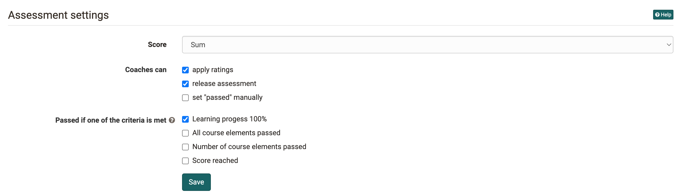
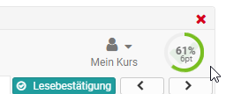
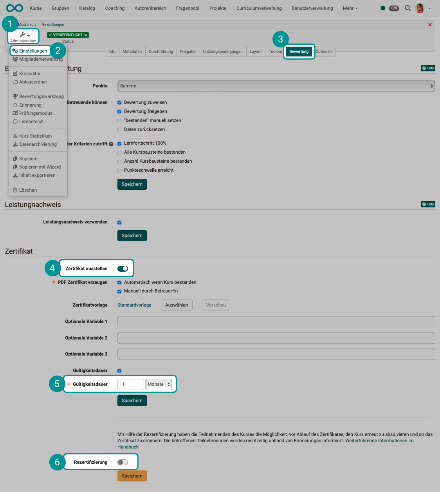

# Course Settings

The menu "Settings" of the "Administration" offers further central configurations for your OpenOlat course.

Each [Learning resource](../learningresources/index.md), not just courses, have a menu "Settings". Furthermore, the settings of conventional and learning path courses vary slightly.

**Course settings**

{ class="shadow" }

Via the tabs "Info", "Metadata", "Execution" and "Share" you can set up information that is visible in the course info page.

## Tab Info

Here you define further information on the course or learning resource. This information is also visible to interested parties without course access under (Course)info. This includes, for example: Title, relevant description, certificate, cover image and teaser movie. The learning resource appears under the title in the alphabetical course list and for queries via the search mask. Further information can be found [here](../learningresources/Set_up_info_page.md).

## Tab Metadata

Here you can enter other things that appear under "Info" e.g. the names of the teachers of the course. Also, the course can be assigned to a given didactic type such as self-study course or examination course. Especially relevant is the entry of the license of the course.

## Tab Execution {: #Execution}

Here you can activate the "[Lecture and Absence Management](../learningresources/Lectures_and_absences.md)" if activated by the administrator, convert existing conventional courses into learning path courses or, in case of [Learning path courses](Learning_path_course.md), define how the learning progress is calculated on the basis of the number of course elements or on the basis of the learning time of the course elements.  

## Tab Share

In this tab you define how and for whom a course or a learning resource is released. Further information on setting up the appropriate access configuration can be found [here](Access_configuration.md).

## Tab Catalog

The button "Add to catalog" can be used to add the learning resource to the catalog and assign it to one or more predefined categories. Learning resources can be inserted more than once at different spots in your catalog, just repeat the before mentioned step. All selected categories will be displayed under "Catalogue entries", where you can delete them as well.

The entire OpenOlat Catalogue can be viewed by all users in the ["Courses"](../area_modules/Courses.md) menu.

Only enter your courses in the catalog when they are finished and should be visible to the users.

## Tab Disclaimer {: #disclaimer}

Here you can activate and set course-related terms of use or a course-related privacy policy. If a person starts the course, he/she must first accept the conditions, otherwise access to the course is not possible. In the [Members management](../learningresources/Members_management.md) you can see in the area "Consents" which persons have already accepted the conditions.

{ class="shadow" }

## Tab Layout

Under "Layout" you can select a layout template for a course, hide the left course navigation and also the bread-crumb navigation for participants.

Depending on the settings by the course administrator, certain layout templates are available, but at least one default template. In addition, you can store your own CSS course templates in the course [Storage folder](../learningresources/Storage_folder.md) and link them in the Layout menu. For example, fonts and colors for texts, headlines, links, the menu and the toolbox can be individually designed and provided with a suitable logo.

In the Navigation section you can set the visibility of the menu and crumb navigation. In learning path courses it is also possible to set whether the menu icons and the specific learning path are displayed to the user or not. Depending on the linear or flexible scenario, one or the other variant offers itself.

{ class="shadow" }
{ class="shadow" }

In the section "Course element default style" you can define the default presentation of the course elements and, for example, upload a background image and define the style of the image as well as assign a color category. In the preview you can see the effects.

## Tab Toolbar

Here you switch the toolbar and certain tools of the toolbar on or off. In this way, certain tools that are to be available continuously can be called up at a central location. In addition to course search, glossary and course chat these tools include various [tools](../learningresources/Using_Additional_Course_Features.md) that can also be called up as course element, e.g. calendar, list of participants, e-mail, blog, wiki, forum, and documents folder. In the case of [Wiki](../learningresources/Wiki.md) and [Blog](../learningresources/Blog.md), it is also possible to fall back on learning resources that have already been created. The other tools are similar to the corresponding course elements, but do not offer the further configuration options as they are available in the course elements in the course editor.

The use of the tools in the toolbar is particularly important for linear [Learning path courses](Learning_path_course.md) in order to make important tools available continuously and centrally, regardless of the sequential order of the learning steps.

## Tab Assessment {: #assessment}

In this tab you can activate performance records and have a certificate generated automatically. In learning path courses, this tab defines the settings for passing the course, the score display, etc.

### Assessment settings (for Learning Path Courses)

For [Learning path courses](Learning_path_course.md) there are further configuration options in the tab "Assessment". Here you define when a course is considered **passed** and whether or what kind of points are displayed. A pass can occur, for example, when a learner has achieved 100% in learning progress, has passed all or a certain number of course elements, or has achieved a certain minimum score.

In detail, the following configuration options are available:

{ class="shadow" }

  * Score
    * Here you can define whether or which type of points (total points or average) are displayed in addition to the percentage display in the course.
    { class="shadow" }
  * Coaches can ...
    * apply ratings
    * release assessment: Here you can set whether the coach should be able to release the assessment for the participants.
    * set "passed" manually: In this case the course coach or owner can manually deine in the assessment tool whether a course participant has passed or failed the course.
  * Passed if one of the criteria is met ...
    * Learning progress 100 %: When all mandatory course elements have been completed and 100 % is displayed the course is automatically considered passed.
    * All course elements passed: A course is regarded as passed if all assessable course elements marked with "passed/not passed" have been passed, no matter whether the course modules are mandatory or optional. In order to exclude individual course elements, you have to tick off "Ignore in course assessment" in the course configuration of the course element in the course editor.
    * Number of course elements passed: Here you can define how many course elements have to be passed in order to consider the entire course as passed.
    * Score reached: Here you can define how many points learners have to achieve in order consider the entire course as passed.

!!! hint "Passed-criteria"
	The individual criteria are an "or-link". It is therefore sufficient if one of the criteria mentioned applies.

!!! hint "Conventional course"
	For conventional courses, the criteria for passing a course are set in the course editor on the top course element in the tab "Score" and the result is displayed on the course start page.

!!! hint "High Score"
	Only if sum or average has been selected under "Score", the tab "High Score" can be configured in the course editor.

### Use evidence of achievement

If you activate the option "Use evidence of achievement", the option "Evidence of achievement" appears in the toolbar menu ["My course"](../learningresources/Additional_Course_Features.md) and the course participants see an overview of the assessable course elements with their current assessment status.

The according link will only appear in your course if there is also an assessable course element, and the course participant has received at least one automatic or manual assessment. This could be, e.g., a test attempt or the assessment of a task.

If you deactivate this feature your participants will no longer see their evidences of achievement. However, they are not lost; those evidences will only no longer be on display. If you choose to delete a course that contains evidences of achievement your users will still be able to see their own evidences.

### (Course) certificate

#### What is a certificate? 

A **PDF certificate** can be issued as confirmation of course attendance or achievement of specific course-related activities. It is also possible to issue a certificate without the use of a performance record.

**By whom is a certificate issued?**

As author, you can choose whether the certificate is issued **manually** by the coach or **automatically** after passing the course. 

The selection "manual" allows you to use certificates in courses without assessable course elements. If the certificate is to be issued manually, the coach can do this **in the assessment tool** in the performance overview of the individual users.

**Where can the certificates be viewed?**

As soon as the participant has fulfilled all conditions for a passed course, the certificate is available in the **toolbar of the respective course** under "My course" in the transcript of records. Users will also automatically receive an **email notification** as soon as a certificate has been issued.

**How is the validity checked?**

A **validity period** can be set for the certificate. You specify the period of validity in days, weeks, months or years.

To control the validity of a certificate the attribute "certificateVerificationUrl" needs to be added to the template. It allows to generate the certificate again later on, thanks to a **QR code**. It can then be compared with the already available version. If both versions are consistent, the certificate can be validated. However, the QR code for validation is only possible if you use an HTML form.

**What happens when a certificate expires?**

Based on the date of issue as well as the expiry date of the certificate, [Reminders](../learningresources/Course_Reminders.md) can be triggered. E.g. the user receives an info that the certificate has expired or will expire in a few days or a **recertification** is possible from now on.

**Create certificate template**

Usually, a systemwide PDF template, specified beforehand by an administrator, should be available. If however, you wish to utilize your own individual template, you can upload one in the  **Certificate template**  section.

A PDF template though is no ordinary PDF file, but has to be either a PDF form created with a HTML form.

With this [certificate bot](https://tools.vcrp.de/zertifikatsbot/){:target="_blank”} you can easily and quickly create certificate templates in HTML format. If you want to adapt the bot to your needs, you can use the [repository](https://gitlab.vcrp.de/openolat/zertifikatsbot){:target="_blank”} with the public code (MIT license).

The form fields then must contain specific variables, which will be replaced by the system upon certificate creation with the respective values. All attributes can be used as variables. PDF templates use variable names without a $ prefix, HTML forms use a $ prefix.

In order to be able to format date-values there is the"dateFormatter"-object. It offers methods to format the "*Raw" formats. To just format a raw format there is the "formatDate()" function. To add a given period of time there is the formatDateRelative (Date baseLineDate, days, months, years) which adds the period given in days/months/years to the baseLineDate.

Signatures, logos or similar can be integrated into the certificate as static graphics via the optional variables. The corresponding files must be available for this with the certificate template.

???+ note "Here a list of the most important variables:"

    _User:_

      * $fullName
      * $firstName
      * $lastName
      * $birthDay
      * $institutionalName
      * $orgUnit
      * $studySubject
      * ...

        All user attributes are available as variables.

    _Course:_

      * $title
      * $externalReference
      * $authors
      * $from (date)
      * $fromLong (date)
      * $to (date)
      * $toLong (date)
      * $location
      * $expenditureOfWork
      * $mainLanguage

    _Performance data (all types of courses):_

      * $score
      * $status

    _Performance data (Learning path course only):_

      * $maxScore
      * $progress

    _Certificate data:_

      * $dateFirstCertification
      * $dateFirstCertificationLong
      * $dateFirstCertificationRaw
      * $dateCertification
      * $dateCertificationLong
      * $dateCertificationRaw
      * $dateNextRecertification
      * $dateNextRecertificationLong
      * $dateNextRecertificationRaw
      * $certificateVerificationUrl

    _Relative date:_

      Dates can be specified on the certificate that are calculated relative to a "raw" date:

      Methode and parameter | Example: $dateNextRecertificationRaw = 11/15/2021 
      ---------|----------
      *Relative date short style* | *Output: 09/22/2031*
      $formatter.formatDateRelative(original date, "language code", +/- days, +/- months, +/- years) | $formatter.formatDateRelative($dateNextRecertificationRaw, "en", 7, -2, 10)
      *Relatives Datum lang* | *Output: September 22, 2031*
      $formatter.formatDateLongRelative(original date, "language code", +/- days, +/- months, +/- years) | $formatter.formatDateRelative($dateNextRecertificationRaw, "en", 7, -2, 10)
            

    _Fields from the course info:_

      * $!description
      * $!objectives
      * $!requirements
      * $!credits  

    _Optional variables:_

      * $custom1
      * $custom2
      * $custom3

If you would like to have such a certificate template, feel free to contact us via [support@frentix.com](mailto:support@frentix.com) in order to receive a cost estimate for a template according to your requirements.

### Recertification

**Requirements**

In order to set up a process for recertification, certificate creation must have been activated beforehand. If a certificate for a course has expired, recertification may be offered to all affected participants.

The option for recertification is linked to

* an existing previous (initial) certification
* a defined indication of the earliest date from which recertification is possible.

{ class="shadow lightbox" }

 **Allow re-certification**  
 
If recertification is activated, a specification must be made as to when recertification should be possible: "at the earliest from ... days before expiry of certificate validity".

(The value must be less than the validity period.)

**Set up Reminders**

Before recertification is finally activated, you will be prompted to set up reminders. Define automatically sent messages to affected participants, e.g. as soon as their recertification becomes possible and/or when the validity of the previous certificate has expired.

The data of the participating persons will be reset during recertification (course reset).

Performance records and certificates from previous passes will be retained.

## Tab Options {: #options}

Here you can activate and configure a course-specific [glossary](../learningresources/Using_Additional_Course_Features.md) and a [resource folder](../learningresources/index.md) and thus connect with your course as well as create a special folder for Coaches.

### Include glossary

You can either connect to your already created glossary here or create a new glossary in the menu that appears.  Once a glossary has been selected, it can also be activated in the "Toolbar" tab.

### Including Resource Folder

Here you can either connect to an already created learning resource "Resource Folder" or create a new resource folder in the appearing menu. The files of the resource folder then appear in the storage folder of the course in the automatically created subfolder "_sharedfolder".

By default in the course all files of the resource folder are read only and the edit of the files is neither in the storage folder nor in the course editor when embedding into a single page possible. If editing should be possible in the course, this option need to be deselected in the course settings at "Read only".

For more information and step-by-step instructions on how to integrate a resource order, please visit the [How to](../../manual_how-to/multiple_use/multiple_use.md) area. 

Please note: You can only add _one_ resource folder to a course. We strongly recommend to first define a general strategy: Which files should be stored in an overall resource folder, and which files are preferably stored in a storage folder within a course, respectively.

### Enable Coach Folder

Furthermore, a course-wide folder for the coaches of the course can be activated in the "Options" menu. All course coaches can then store, view, edit or delete documents in this folder. It is also possible to create subfolders in the configured area.

As location for the folder, either an already existing folder from the storage folder of the course can be selected or a new folder can be generated especially for the Coaches. If "Automatically generated folder" is selected, the coaches will not have access to any other files located in the storage folder of the course, while course creators or persons with access to the course editor will be able to see the coaches' files in the automatically generated folder "_coachdocuments"_ in the storage folder. This means that course owners always have access to the files of the coach folder and can also use them for linking to certain course elements, e.g. a single page. On the other hand, Coaches will _not_ be able to integrate files into the course structure even with the new folder.

In the Administration menu, the new submenu "Coach documents" appears for coaches as well as for course owners.

