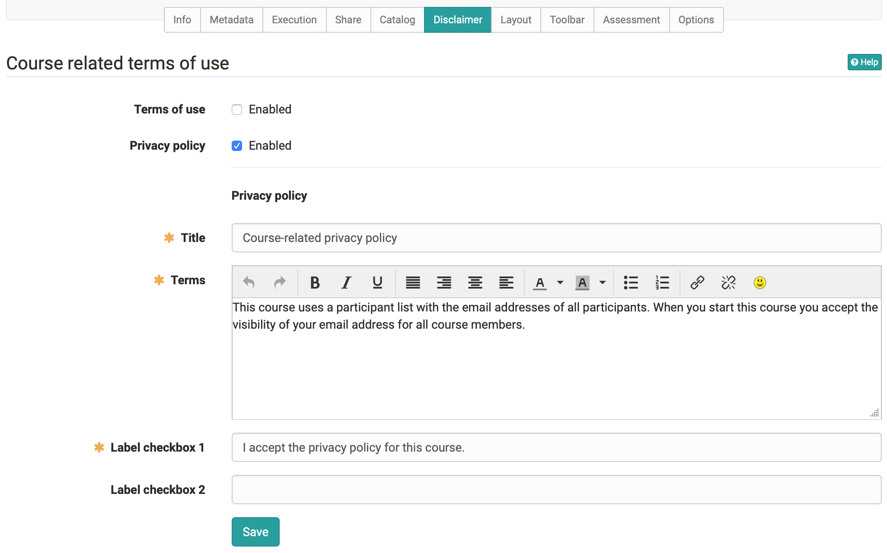
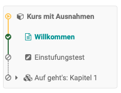
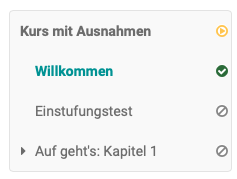

# Course Settings {: #course_settings}

You can make the configurations that affect the course as a whole under: 
`Course > Administration > Settings`

The "Settings" menu is available to owners of the course, learning resource managers and administrators, and also to persons who have been granted the "Course editor" right in the [Member management](../learningresources/Members_management.md).

{ class="shadow lightbox" }

!!! info "Important"

    Every [learning resource](../learningresources/index.md) has a "Settings" menu, not just courses.

    The settings of conventional and [learning path courses](../learningresources/Learning_path_course.md) vary slightly.

    You can use the "Info", "Metadata", "Implementation" and "Release" tabs to specify information that will be visible in the [Course info page](../learningresources/Info_page.md).

## Profile

Name | Course settings
---------|----------
Available since | Release 13.0 (OO-3706)

## Tab Info {: #info}

{ class="shadow lightbox" }

Here you define information about the course or learning resource. This includes:

* Title
* Identifier (An external identifier that is displayed in the course overview. E.g. the name from the course catalog or a printed course catalog).
* Teaser (text line/term)
* Course description
* Description of the learning objectives
* Prerequisites
* Requirements for a certificate
* Cover picture
* Teaser movie

This information is also visible to interested parties without course access under (course) info. 
The learning resource appears under the title defined here in the alphabetical course list and is relevant for inquiries via the search mask.

[More about the **Set up of the info page** >](../learningresources/Course_Settings_Info.md) 
[More about the **content of the info page** >](../learningresources/Info_page.md) 
[To the top of the page ^](#course_settings)

## Tab Metadata {: #metadata}

{ class="shadow lightbox" }

Metadata contains keywords that describe the course. The metadata can be used to make your course easier to find, for example. They are optional and do not have to be filled in.

Metadata of a course are

* Type of the learning resource (in this case: course)
* ID of the course
* Creator of the course
* Author/name of the teachers of the course
* Subject areas (from the taxonomy)
* Implementation format (blended learning, self-study, ...)
* Main language
* Estimated time required for processing
* License

[For more details >](../learningresources/Course_Settings_Metadata.md) 
[More about **Meta data** >](../basic_concepts/Full_Text_Search.md#metadata) 
[To the top of the page ^](#course_settings)

## Tab Execution {: #execution}

{ class="shadow lightbox" }

Here you can

* define the implementation period of the course,
* switch on the "[Absence management](../area_modules/Absence_Management.md)" and configure it further (if switched on in the system administration under `Administration > Modules > Events / Absences`),
* convert existing conventional courses into learning path courses
* or for [learning path courses](Learning_path_course.md) define how the learning progress is calculated, based on the number of course elements or on the duration of the course elements.

[For more details >](../learningresources/Course_Settings_Execution.md) 
[To the top of the page ^](#course_settings)

## Tab Share {: #share}

{ class="shadow lightbox" }

In the "Release" tab, you define how and for whom a course or learning resource is released.

* Whether access is only possible for selected members, the course itself can be selected and booked or access is completely open
* When participants can withdraw from the course
* Whether only administrative roles of a specific organizational unit are granted access
* Whether and how other authors can access the course
* Whether external OER catalogs and search engines receive information
* Whether an offer is made in the catalog for the course and if so, which one
* Whether the course can also be used from another LMS via LTI

[Details about **Tab Share** >](Course_Settings_Share.md) 
[More about the **Share** >](Access_configuration.md) 
[To the top of the page ^](#course_settings)

## Tab Catalog (only applies to catalog version 1) {: #catalog}

{ class="shadow lightbox" }

The "Add to catalog" button can be used to enter the learning resource in the catalog and assign it to one or more predefined categories. To enter the course or learning resource in several catalog areas, the step must be repeated. All catalog entries then appear here in the "Catalog" tab and can also be removed here.

The entire OpenOlat [catalog (version 1)](../area_modules/Courses.md) can be viewed by all users in the "Courses" menu.

Only enter your courses in the catalog once they have been completed and should be visible to users.

[To the top of the page ^](#course_settings)

## Tab Terms of use {: #disclaimer}

{ class="shadow lightbox" }

Here

* freely definable course-related **terms of use**
* and a course-related **privacy policy** 

can be activated and stored. If a person starts the course, they must first accept the conditions, otherwise access to the course is not possible. For each text you switch on, you enter a title, the conditions and the label of the checkbox that is ticked to accept. A second checkbox is possible.

In the [Member management](../learningresources/Members_management.md) you can see in the "Consents" section which persons have already accepted the conditions.

{ class="shadow lightbox" }

[To the top of the page ^](#course_settings)

## Tab Layout {: #layout}

{ class="shadow lightbox" }

In the Layout tab you determine how the course looks and how participants move through it. Here you can

* select a **layout template** for a course,
* define the **course navigation** in more detail
* and define the **style of the course elements**.

Which **layout templates** are available is determined by the system layout (theme) that applies to your entire OpenOlat instance. The "Default" template is always available. A uniform appearance for all courses (colors, fonts, logo) is therefore implemented centrally via a custom system layout, see [Representation, layout](../../manual_admin/administration/Customizing.md#layout). For a single course, choose the option "Customize...": there you set the font and colors for text, headings, links, menu and toolbox and upload a logo. In addition, you can store your own CSS files in the "courseCSS" folder of the course [Storage folder](../learningresources/Storage_folder.md). They then appear in the selection as "from course folder".

In the "**Navigation**" section you can set the visibility of the menu and crumb navigation. In learning path courses you also specify whether the icons and the path are displayed in the menu ("Display icons in menu", "Display path in menu"). Depending on the linear or flexible scenario, one or the other variant offers itself.

{ class="shadow lightbox" }
{ class="shadow lightbox" }

In the section "**Course element default style**" you can define the default presentation of the course elements and, for example, upload a background image and define the style of the image as well as assign a color category. In the preview you can see the effects.

[To the top of the page ^](#course_settings)

## Tab Toolbar {: #toolbar}

{ class="shadow lightbox" }

Here you can switch the toolbar in the course header on or off and define which specific individual tools are displayed to course participants in the toolbar.

[For more details >](../learningresources/Course_Settings_Toolbar.md) 
[To the top of the page ^](#course_settings)

## Tab Assessment {: #assessment}

{ class="shadow lightbox" }

In the Assessment tab, you can make settings for

* Assessment methods: total, average, weighted
* Requirements for passing the course 
* The role of coaches in the assessment process
* Activate and configure course certificates
* Activate and configure credit points
* Activate and configure course certificates and also set up recertification
* Award of badges

!!! info "Important"

    For conventional courses, only the settings for evidence of achievement, certificates and badges are available in the Assessment tab. The configuration for passing the course is done in the course editor on the top course element in the "Score" tab. There is no progression for conventional courses.

[For more details >](../learningresources/Course_Settings_Assessment.md) 
[For more details on **certificates** >](../learningresources/Course_Settings_Assessment.md#certificate) 
[For more details on **recertification** >](../learningresources/Course_Settings_Assessment.md#recertification) 
[To the top of the page ^](#course_settings)

## Tab Options {: #options}

{ class="shadow lightbox" }

Here you activate as required

* a course-specific [glossary](../learningresources/Using_Additional_Course_Features.md)
* a [resource folder](../learningresources/index.md) for your course
* a special folder for coaches
* to-dos for coaches

If you are a user with an administrative role (learning resource manager, administrator), you will be shown additional special options:

* invitation to activate external users for course owners with author rights
* activate the "LTI 1.3" release for course owners with authoring rights

[For more details > ](../learningresources/Course_Settings_Options.md) 
[To the top of the page ^](#course_settings)

## Further information {: #further_information}

[Course Administration: Overview >](../learningresources/Administration.md) 
[Creating Courses >](../learningresources/Creating_Course.md)

[To the top of the page ^](#course_settings)
